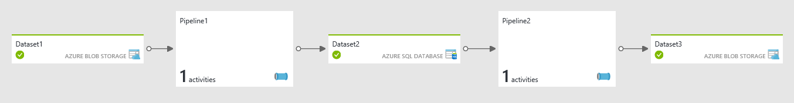

<properties 
    pageTitle="Création/Pipelines de planification, bicyclette activités dans données usine | Microsoft Azure" 
    description="Découvrez comment créer un pipeline de données dans Azure Data Factory pour vous déplacer et transformer les données. Créer un flux de travail de données par l’effort pour produire prêt à utiliser les informations." 
    keywords="pipeline de données, les données par l’effort de flux de travail"
    services="data-factory" 
    documentationCenter="" 
    authors="sharonlo101" 
    manager="jhubbard" 
    editor="monicar"/>

<tags 
    ms.service="data-factory" 
    ms.workload="data-services" 
    ms.tgt_pltfrm="na" 
    ms.devlang="na" 
    ms.topic="article"
    ms.date="09/12/2016" 
    ms.author="shlo"/>

# Pipelines et activités dans usine données Azure
Cet article vous aide à comprendre les pipelines et activités dans Azure Data Factory et les utiliser pour créer de bout en bout pilotées par les données des flux de travail pour votre déplacement de données et les scénarios de traitement des données.  

> [AZURE.NOTE] Cet article suppose que vous avez parcouru [présentation Azure Data Factory](data-factory-introduction.md). Si vous n’avez pas exercices-on-expérience de création de données permettraient de références, en passant par [créer votre première usine données](data-factory-build-your-first-pipeline.md) didacticiel vous comprenez cet article mieux.  

## Qu’est un pipeline de données ?
**Pipeline** est un regroupement logique des **activités**. Il est utilisé pour les activités de groupe en une seule unité qui effectue une tâche. Pour mieux comprendre les pipelines mieux, vous devez comprendre tout d’abord une activité. 

## Qu’est une activité ?
Activités définissent les actions à effectuer sur vos données. Chaque activité accepte zéro, un ou plusieurs [jeux de données](data-factory-create-datasets.md) comme entrées et génère un ou plusieurs jeux de données sous forme de sortie. 

Par exemple, vous pouvez utiliser une activité de copie pour harmoniser copie des données à partir d’une banque de données vers une autre banque de données. De même, vous pouvez utiliser une activité HDInsight Hive pour exécuter une requête Hive sur un cluster Azure HDInsight pour transformer vos données. Azure Data Factory fournit un large éventail de [transformation de données](data-factory-data-transformation-activities.md)et les activités de [déplacement de données](data-factory-data-movement-activities.md) . Vous pouvez également choisir créer une activité personnalisée .NET pour exécuter votre propre code. 

## Pipeline de copie d’exemple
Dans le pipeline d’exemple ci-dessous, il existe une activité de type **copie** dans la section **activités** . Dans cet exemple, la [Copier une activité](data-factory-data-movement-activities.md) copie des données à partir d’un stockage d’objets Blob Azure à une base de données SQL Azure. 

    {
      "name": "CopyPipeline",
      "properties": {
        "description": "Copy data from a blob to Azure SQL table",
        "activities": [
          {
            "name": "CopyFromBlobToSQL",
            "type": "Copy",
            "inputs": [
              {
                "name": "InputDataset"
              }
            ],
            "outputs": [
              {
                "name": "OutputDataset"
              }
            ],
            "typeProperties": {
              "source": {
                "type": "BlobSource"
              },
              "sink": {
                "type": "SqlSink",
                "writeBatchSize": 10000,
                "writeBatchTimeout": "60:00:00"
              }
            },
            "Policy": {
              "concurrency": 1,
              "executionPriorityOrder": "NewestFirst",
              "retry": 0,
              "timeout": "01:00:00"
            }
          }
        ],
        "start": "2016-07-12T00:00:00Z",
        "end": "2016-07-13T00:00:00Z"
      }
    } 

Notez les points suivants :

- Dans la section activités, il n'est qu’une seule activité dont le **type** est défini sur **Copier**.
- Entrée de l’activité est définie sur **InputDataset** et sortie de l’activité est définie sur **OutputDataset**.
- Dans la section **typeProperties** , **BlobSource** est spécifiée comme type de source et **SqlSink** est spécifiée comme type de récepteur.

Pour les différentes étapes de création de ce pipeline, voir [didacticiel : copier des données depuis le stockage Blob de base de données SQL](data-factory-copy-data-from-azure-blob-storage-to-sql-database.md). 

## Pipeline de transformation d’exemple
Dans le pipeline d’exemple ci-dessous, il existe une activité de type **HDInsightHive** dans la section **activités** . Dans cet exemple, l' [activité HDInsight Hive](data-factory-hive-activity.md) transforme les données d’un stockage d’objets Blob Azure en exécutant un fichier de script Hive sur un cluster Azure HDInsight Hadoop. 

    {
        "name": "TransformPipeline",
        "properties": {
            "description": "My first Azure Data Factory pipeline",
            "activities": [
                {
                    "type": "HDInsightHive",
                    "typeProperties": {
                        "scriptPath": "adfgetstarted/script/partitionweblogs.hql",
                        "scriptLinkedService": "AzureStorageLinkedService",
                        "defines": {
                            "inputtable": "wasb://adfgetstarted@<storageaccountname>.blob.core.windows.net/inputdata",
                            "partitionedtable": "wasb://adfgetstarted@<storageaccountname>.blob.core.windows.net/partitioneddata"
                        }
                    },
                    "inputs": [
                        {
                            "name": "AzureBlobInput"
                        }
                    ],
                    "outputs": [
                        {
                            "name": "AzureBlobOutput"
                        }
                    ],
                    "policy": {
                        "concurrency": 1,
                        "retry": 3
                    },
                    "scheduler": {
                        "frequency": "Month",
                        "interval": 1
                    },
                    "name": "RunSampleHiveActivity",
                    "linkedServiceName": "HDInsightOnDemandLinkedService"
                }
            ],
            "start": "2016-04-01T00:00:00Z",
            "end": "2016-04-02T00:00:00Z",
            "isPaused": false
        }
    }

Notez les points suivants : 

- Dans la section activités, il n'est qu’une seule activité dont le **type** est défini sur **HDInsightHive**.
- Le fichier de script Hive, **partitionweblogs.hql**, est stocké dans le compte de stockage Azure (spécifié par scriptLinkedService, appelé **AzureStorageLinkedService**) et dans le dossier de **scripts** dans conteneur **adfgetstarted**.
- La section **définit** est utilisée pour spécifier les paramètres de runtime sont passés au script hive comme valeurs de configuration Hive (par ex. ${hiveconf : inputtable}, ${hiveconf:partitionedtable}).

Pour les différentes étapes de création de ce pipeline, voir [didacticiel : créer votre première pipeline pour traiter les données à l’aide de cluster Hadoop](data-factory-build-your-first-pipeline.md). 

## Chaîne d’activités
Si vous avez plusieurs activités dans un pipeline et sortie d’une activité n’est pas une entrée d’une autre activité, les activités peuvent s’exécuter en parallèle si secteurs d’entrée de données pour les activités sont prêts. 

Vous pouvez bicyclette deux activités en demandant le jeu de données de sortie d’une activité en tant que le jeu de données d’entrée de l’autre activité. Les activités peuvent être dans le pipeline de même ou dans pipelines différents. La deuxième activité s’exécute uniquement lorsque le premier d'entre eux se termine avec succès. 

Par exemple, considérez le cas suivant :
 
1.  Pipeline P1 a A1 activité qui requiert dataset d’entrée externe D1 et produire **sortie** dataset **D2**.
2.  Pipeline P2 a A2 activité qui nécessite **d’entrée** de dataset **D2**et produit sortie dataset D3.
 
Dans ce scénario, l’activité A1 s’exécute lorsque les données externes ne soient disponibles et la fréquence de disponibilité planifiée est atteint.  L’activité A2 s’exécute lorsque les secteurs planifiées à partir de D2 deviennent disponibles et la fréquence de disponibilité planifiée est atteint. S’il existe une erreur dans un des secteurs de dataset D2, A2 ne fonctionne pas pour cette section qu’il soit disponible.

Vue de diagramme :

Vue de diagramme avec les deux activités dans le pipeline de même : 

Pour plus d’informations, voir [planification et l’exécution](#chaining-activities). 

## Planification et l’exécution
Jusque vous avez entendu quelles sont les pipelines et activités. Vous avez également étudié comment ils sont définis et un niveau supérieur des activités dans Azure Data Factory. Laissez-nous observez comment ils sont exécutées. 

Un pipeline est actif uniquement entre son heure de début et heure de fin. Il n’est pas exécutée avant l’heure de début ou après l’heure de fin. Si le pipeline est suspendu, elle ne sont pas exécutée, quel que soit son heure de début et de fin. Pour un pipeline exécuter, il ne doit pas être interrompu. En fait, il n’est pas le pipeline est exécuté. Il est les activités dans le pipeline sont exécutées. Toutefois ils faire dans le contexte général du pipeline. 

Consultez [planification et l’exécution](data-factory-scheduling-and-execution.md) pour comprendre le fonctionnement de la planification et l’exécution dans Azure Data Factory.

## Créer des pipelines
Azure Data Factory propose divers mécanismes pour créer et déployer pipelines (qui à son tour contiennent une ou plusieurs activités qu’il contient). 

### À l’aide du portail Azure
Vous pouvez utiliser l’éditeur de données par défaut dans le portail Azure pour créer une opportunité. Pour une procédure pas à pas de bout en bout, voir [prise en main Azure Data Factory (données usine éditeur)](data-factory-build-your-first-pipeline-using-editor.md) . 

### À l’aide de Visual Studio 
Vous pouvez utiliser Visual Studio pour créer et déployer pipelines sur Azure Data Factory. Pour une procédure pas à pas de bout en bout, voir [prise en main Azure Data Factory (Visual Studio)](data-factory-build-your-first-pipeline-using-vs.md) . 

### À l’aide de PowerShell Azure
Vous pouvez utiliser la session PowerShell Azure pour créer des pipelines dans Azure Data Factory. Par exemple, vous avez défini le pipeline de JSON dans un fichier à c:\DPWikisample.json. Vous pouvez le télécharger sur votre instance Azure Data Factory comme le montre l’exemple suivant :

    New-AzureRmDataFactoryPipeline -ResourceGroupName ADF -Name DPWikisample -DataFactoryName wikiADF -File c:\DPWikisample.json

Voir [prise en main Azure Data Factory (Azure PowerShell)](data-factory-build-your-first-pipeline-using-powershell.md) pour une procédure pas à pas de bout en bout pour la création d’une usine de données avec un pipeline. 

### À l’aide du Kit de développement .NET
Vous pouvez créer et déployer trop pipeline via le Kit de développement .NET. Ce mécanisme peut être utilisé pour créer des pipelines par programme. Pour plus d’informations, voir [créer, gérer et surveiller les références de données par programme](data-factory-create-data-factories-programmatically.md). 

### À l’aide du Gestionnaire de ressources Azure modèle
Vous pouvez créer et déployer pipeline à l’aide d’un modèle Azure le Gestionnaire de ressources. Pour plus d’informations, voir [prise en main Azure Data Factory (Azure le Gestionnaire de ressources)](data-factory-build-your-first-pipeline-using-arm.md). 

### À l’aide de l’API REST
Vous pouvez créer et déployer pipeline à l’aide des API REST trop. Ce mécanisme peut être utilisé pour créer des pipelines par programme. Pour plus d’informations, voir [créer ou mettre à jour un Pipeline](https://msdn.microsoft.com/library/azure/dn906741.aspx). 

## Surveiller et gérer les pipelines  
Une fois un pipeline est déployé, vous pouvez gérer et analyser vos pipelines, secteurs et s’exécute. En savoir plus sur ce sujet : [surveiller et gérer les Pipelines](data-factory-monitor-manage-pipelines.md).

## Pipeline JSON   
Laissez-nous prendre une présentation détaillée sur la façon dont un pipeline est défini au format JSON. La structure générique pour un pipeline se présente comme suit :

    {
        "name": "PipelineName",
        "properties": 
        {
            "description" : "pipeline description",
            "activities":
            [
    
            ],
            "start": "<start date-time>",
            "end": "<end date-time>"
        }
    }

La section **activités** peut avoir une ou plusieurs des activités définies qu’il contient. Chaque activité possède la structure de niveau supérieur suivante :

    {
        "name": "ActivityName",
        "description": "description", 
        "type": "<ActivityType>",
        "inputs":  "[]",
        "outputs":  "[]",
        "linkedServiceName": "MyLinkedService",
        "typeProperties":
        {
    
        },
        "policy":
        {
        }
        "scheduler":
        {
        }
    }

Tableau suivant décrivent les propriétés dans les définitions de JSON activité et pipeline :

Balise | Description | Obligatoire
--- | ----------- | --------
nom | Nom de l’activité ou le pipeline. Spécifiez un nom qui représente l’action que l’activité ou pipeline est configuré pour faire <ul><li>Nombre maximal de caractères : 260</li><li>Doit commencer par un numéro de la lettre ou un trait de soulignement (_)</li><li>Caractères suivants ne sont pas autorisés : «. », « + », « ? », « / », « < », « > », « * », « % », « & », « : «, »\\»</li></ul> | Oui
Description | Texte décrivant l’activité ou pipeline est utilisé pour | Oui
type | Spécifie le type de l’activité. Consultez les articles [Activités de déplacement des données](data-factory-data-movement-activities.md) et [Des activités de Transformation de données](data-factory-data-transformation-activities.md) pour différents types d’activités. | Oui
entrées | Tables d’entrée utilisés par l’activité  une table d’entrée « entrées » : [{« nom » : « inputtable1 »}],  deux tables d’entrée  « entrées » : [{« nom » : « inputtable1 »}, {« nom » : « inputtable2 »}], | Oui
sorties | Tables de sortie utilisé par le activity.// une table de sortie « produit » : [{« nom » : « outputtable1 »}],  deux tables de sortie « produit » : [{« nom » : « outputtable1 »}, {« nom » : « outputtable2 »}], | Oui
linkedServiceName | Nom du service lié utilisé par l’activité.   Une activité peut-être nécessiter que vous spécifiez le service lié qui est lié à l’environnement cluster requis. | Oui pour HDInsight activité et Azure d’apprentissage automatique lot scores activité   Non pour tous les autres
typeProperties | Propriétés de la section typeProperties dépendent du type de l’activité. | N°
stratégie | Stratégies qui affectent le comportement de l’exécution de l’activité. S’il n’est pas spécifié, stratégies par défaut sont utilisés. | N°
Démarrer | Date-heure de début pour le pipeline. Doit être au [format ISO](http://en.wikipedia.org/wiki/ISO_8601). Par exemple : 2014-10-14T16:32:41Z.   Il est possible de spécifier une heure locale, par exemple un temps estimé. Voici un exemple : « 2016-02-27T06:00:00**-05:00**», qui est 6 AM EST.  Les propriétés de début et de fin ensemble spécifient période active pour le pipeline. Secteurs de sortie uniquement produits avec des cours de la période active. | N°  Si vous spécifiez une valeur pour la propriété de fin, vous devez spécifier la valeur de la propriété de démarrage.  Les heures de début et de fin peuvent être vides pour créer une opportunité. Vous devez spécifier les deux valeurs pour définir une période active pour le pipeline à exécuter. Si vous ne spécifiez pas les heures de début et de fin lorsque vous créez une opportunité, vous pouvez définir à l’aide de l’applet de commande Set-AzureRmDataFactoryPipelineActivePeriod ultérieurement.
fin | Date-heure de fin pour le pipeline. Si spécifié doit être au format ISO. Par exemple : 2014-10-14T17:32:41Z   Il est possible de spécifier une heure locale, par exemple un temps estimé. Voici un exemple : « 2016-02-27T06:00:00**-05:00**», qui est 6 AM EST.  Pour exécuter le pipeline indéfiniment, spécifiez 9999-09-09 comme la valeur de la propriété de fin. | N°   Si vous spécifiez une valeur pour la propriété start, vous devez spécifier la valeur de la propriété de fin.  Consultez les remarques pour la propriété **de démarrage** .
isPaused | Si la valeur true le pipeline ne fonctionne pas. Valeur par défaut = false. Vous pouvez utiliser cette propriété pour activer ou désactiver. | N° 
Planificateur | propriété « planificateur » est utilisée pour définir une planification souhaitée pour l’activité. Ses sous-propriétés sont les mêmes que ceux de la [propriété de disponibilité d’un dataset](data-factory-create-datasets.md#Availability). | N° |   
| pipelineMode | Le mode de séries pour le pipeline de planification. Valeurs autorisées sont : planifiée (par défaut), unique.  « Planifié » indique que le pipeline s’exécute sur un intervalle de temps spécifié en fonction de sa période active (heure de début et de fin). « Unique » indique que le pipeline s’exécute qu’une seule fois. Pipelines unique une fois créés ne peut pas être modifié ou mis à jour pour le moment. Voir [Onetime pipeline](data-factory-scheduling-and-execution.md#onetime-pipeline) pour plus d’informations sur la configuration unique. | N° | 
| expirationTime | Durée après sa création pour laquelle le pipeline est valide et doit rester mis en service. Si elle n’a pas tout actif, a échoué, ou en attente s’exécute, le pipeline est supprimé automatiquement une fois qu’il atteint le délai d’expiration. | N° | 
| jeux de données | Liste des jeux de données devant être utilisé par les activités définies dans le pipeline. Cette propriété peut être utilisée pour définir des groupes de données qui sont spécifiques à ce pipeline et non définies par le factory de données. Jeux de données définis dans ce pipeline peut uniquement être utilisé par cette canalisation et ne peuvent pas être partagés. Pour plus d’informations, voir [jeux de données inclus dans l’étendue](data-factory-create-datasets.md#scoped-datasets) .| N° |  
 

### Stratégies
Stratégies affectent le comportement de l’exécution d’une activité, spécifiquement lorsque le secteur d’un tableau est traité. Le tableau suivant fournit les détails.

Propriété | Valeurs autorisées | Valeur par défaut | Description
-------- | ----------- | -------------- | ---------------
concurrence | Nombre entier   Valeur maximale : 10 | 1 | Nombre d’exécutions simultanées de l’activité.  Il détermine le nombre d’exécutions activité parallèle qui peut se produire sur les différentes sections. Par exemple, si une activité a besoin accéder un grand ensemble de données disponibles, ayant une plus grande valeur concurrence accélère le traitement des données. 
executionPriorityOrder | NewestFirst  OldestFirst | OldestFirst | Détermine l’ordre des sections de données qui sont en cours de traitement.  Par exemple, si vous avez 2 coupe (cela s’une produise à 4 heures et l’autre à 5 pm), et les deux sont en attente d’exécution. Si vous définissez l’executionPriorityOrder être NewestFirst, le secteur à 5 PM est traité en premier. De même si vous définissez l’executionPriorityORder être OldestFIrst, le secteur à 4 PM est traité. 
nouvelles tentatives | Nombre entier  Valeur maximale peut être 10 | 3 | Nombre de tentatives avant le traitement des données pour le secteur est marqué comme échec. L’exécution des activités pour une tranche de données est répétée jusqu'à ce nombre de tentatives spécifié. La nouvelle tentative s’effectue dès que possible après l’échec.
délai d’attente | TimeSpan | 00:00:00 | Délai d’expiration de l’activité. Exemple : 00:10:00 (implique le délai d’expiration 10 minutes)  Si une valeur n’est pas spécifiée ou est égal à 0, le délai d’expiration est infini.  Si la durée de traitement des données sur un secteur dépasse la valeur du délai, elle est annulée, et le système de tentatives de renouvellement le traitement. Le nombre de tentatives dépend de la propriété de tentatives. En cas de délai d’attente, le statut est défini sur avec délai dépassé.
retard | TimeSpan | 00:00:00 | Spécifier le délai avant le traitement des données du démarrage du secteur.  L’exécution de l’activité pour une tranche de données est démarrée une fois le délai au-delà de la durée d’exécution prévue.  Exemple : 00:10:00 (implique délai de 10 minutes)
longRetry | Nombre entier  Valeur maximale : 10 | 1 | Le nombre de tentatives de temps avant l’échec de l’exécution de secteur.  longRetry tentatives espacées par longRetryInterval. Donc si vous souhaitez spécifier un délai entre les nouvelles tentatives, utilisez longRetry. Si réessayer et longRetry sont spécifiés, chaque tentative longRetry inclut de nouvelles tentatives et le nombre maximal de tentatives est réessayer * longRetry.  Par exemple, si nous avons les paramètres suivants dans la stratégie d’activité : Réessayer : 3 longRetry : 2 longRetryInterval : 01:00:00  Supposons qu’il existe un seul secteur à exécuter (état est en attente) et l’exécution d’activité échoue chaque fois. Au départ il serait 3 tentatives consécutives d’exécution. Après chaque tentative, l’état de secteur serait réessayer. Une fois que les 3 premières tentatives dépassent, l’état de secteur serait LongRetry.  Après avoir une heure (autrement dit, les valeurs de longRetryInteval), il serait un jeu supplémentaire de 3 tentatives d’exécution consécutifs. Après cela, l’état de secteur serait être a échoué et aucune plusieurs nouvelles tentatives ne seraient effectuées. Par conséquent, global 6 tentatives ont été apportées.  Si toute exécution réussit, l’état de secteur est prêt et aucune plusieurs tentatives.  longRetry peut-être être utilisé dans les situations dans lesquelles les données dépendantes arrivent à des moments pas déterminée ou l’environnement global est douteux sous lequel le traitement des données se produit. Dans ce cas, pratique tentatives une après l’autre ne permettront pas et cela après un intervalle de temps produit le résultat souhaité.  Word de faire preuve de prudence : ne définissez pas des valeurs élevées longRetry ou longRetryInterval. En règle générale, des valeurs élevées sous-entendent l’existence d’autres problèmes système. 
longRetryInterval | TimeSpan | 00:00:00 | Le délai entre chaque tentative de temps 

## Étapes suivantes

- Comprendre [la planification et l’exécution dans Azure Data Factory](data-factory-scheduling-and-execution.md).  
- En savoir plus sur le [déplacement de données](data-factory-data-movement-activities.md) et des [fonctions de transformation de données](data-factory-data-transformation-activities.md) dans Azure Data Factory
- Comprendre la [gestion et surveillance dans Azure Data Factory](data-factory-monitor-manage-pipelines.md).
- [Créer et déployer votre pipeline de main fermée](data-factory-build-your-first-pipeline.md). 
