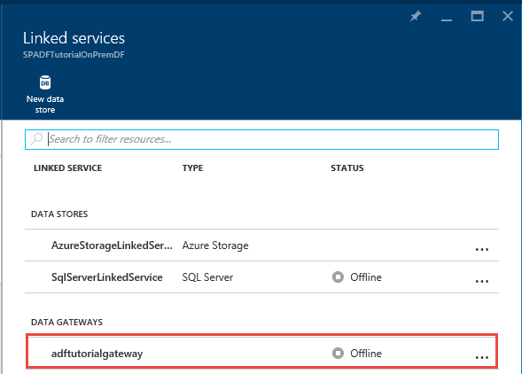
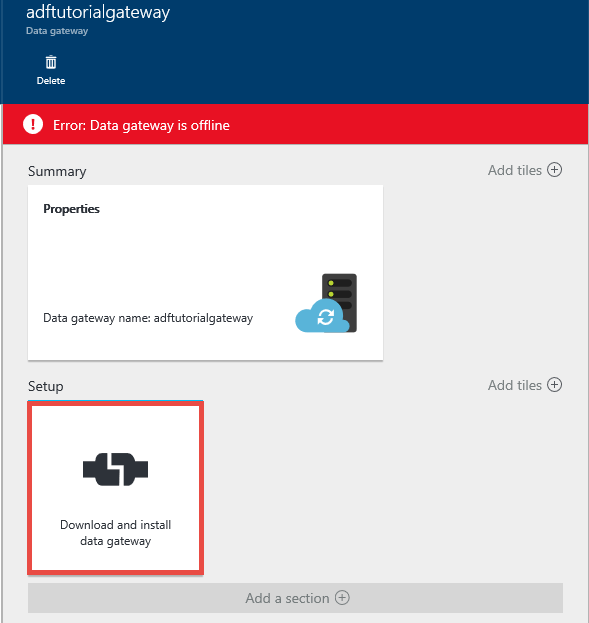
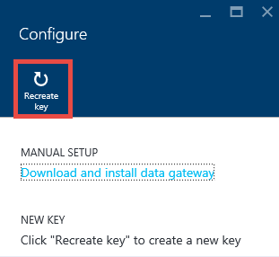
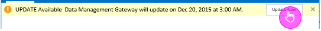
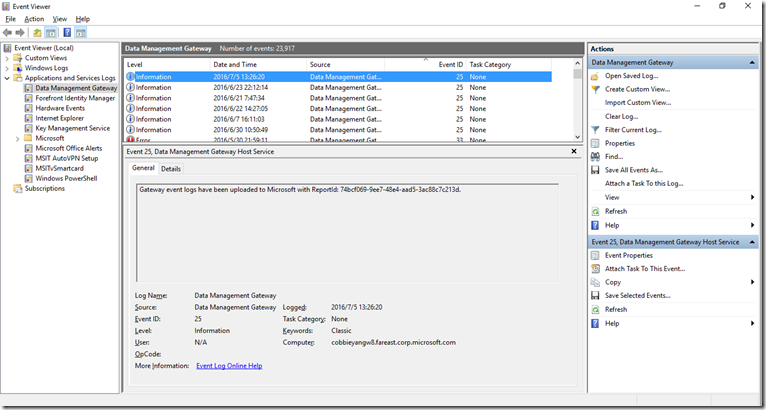
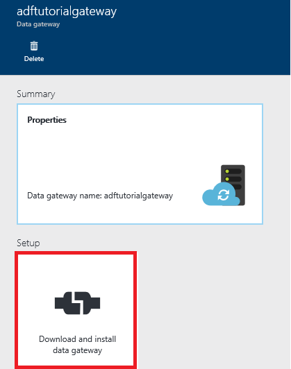
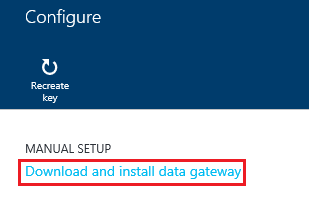
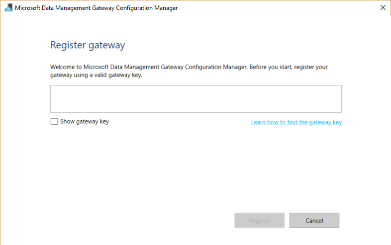

<properties 
    pageTitle="Passerelle de gestion des données destinée aux données | Microsoft Azure"
    description="Configurer une passerelle de données pour déplacer des données entre en local et le nuage. Utiliser la passerelle de gestion des données dans Azure Data Factory pour déplacer vos données." 
    services="data-factory" 
    documentationCenter="" 
    authors="linda33wj" 
    manager="jhubbard" 
    editor="monicar"/>

<tags 
    ms.service="data-factory" 
    ms.workload="data-services" 
    ms.tgt_pltfrm="na" 
    ms.devlang="na" 
    ms.topic="article" 
    ms.date="10/11/2016" 
    ms.author="jingwang"/>

# Passerelle de gestion des données
La passerelle de gestion des données est un agent de client que vous devez installer dans votre environnement local pour copier des données entre banques de données cloud et en local. Les banques de données locales pris en charge par Data Factory sont répertoriées dans la section [sources de données prises en charge](data-factory-data-movement-activities.md##supported-data-stores) . 

> [AZURE.NOTE] Pour l’instant, passerelle prend en charge uniquement l’activité de copie et l’activité de procédure stockée dans Data Factory. Il n’est pas possible d’utiliser la passerelle à partir d’une activité personnalisée pour accéder aux sources de données locales. 

Cet article complète la procédure pas à pas dans le [déplacer des données entre en local et nuage de banques de données](data-factory-move-data-between-onprem-and-cloud.md) article. Dans la procédure pas à pas, vous créez un pipeline qui utilise la passerelle pour déplacer des données d’une base de données SQL Server en local pour un blob Azure. Cet article fournit des informations détaillées détaillées sur la passerelle de gestion des données.   

## Vue d’ensemble

### Fonctionnalités de la passerelle de gestion des données
Passerelle de gestion des données fournit les fonctionnalités suivantes :

- Modèle de sources de données locales et sources de données au sein de la même usine de données en nuage et déplacer des données.
- Comporte un seul volet de verre pour la surveillance et la gestion avec visibilité sur l’état de la passerelle à partir de la carte de données par défaut.
- Gérer l’accès aux sources de données locales en toute sécurité.
    - Aucune modification n’est requise pour les pare-feu d’entreprise. Passerelle vérifie uniquement les connexions sortantes basé sur HTTP pour ouvrir internet.
    - Chiffrer les informations d’identification pour vos banques de données locales avec votre certificat.
- Déplacement de données efficace – les données sont transférées en parallèle, problèmes réseau résistant à une avec l’option automatique logique de nouvelle tentative.

### Flux de données et de flux de commande
Lorsque vous utilisez une activité copier pour copier des données entre locaux et cloud, l’activité utilise une passerelle pour transférer des données à partir de la source de données locales au cloud et vice versa.

Données de haut niveau icies Récapitulatif des étapes pour la copie de la passerelle de données et flux pour : 

1.  Développeur de données crée une passerelle pour une usine de données Azure à l’aide du [portail Azure](https://portal.azure.com) ou une [Applet de commande PowerShell](https://msdn.microsoft.com/library/dn820234.aspx). 
2.  Données developer crée un service lié pour une banque de données locale en spécifiant la passerelle. Dans le cadre de la configuration du service liée, développeur de données utilise l’application de définir ces informations pour spécifier les informations d’identification et les types d’authentification.  La boîte de dialogue informations d’identification du paramètre application communique avec le magasin de données pour tester la connexion et la passerelle pour enregistrer les informations d’identification.
3. Passerelle chiffre les informations d’identification avec le certificat associé à la passerelle (fournie par le développeur de données), avant d’enregistrer les informations d’identification dans le cloud.
4. Données usine service communique avec la passerelle pour la planification et la gestion des travaux à l’aide d’un canal de contrôle qui utilise une file d’attente de bus service Azure partagé. Lorsqu’un travail d’activité copies doit déconnectés, Data Factory files d’attente de la demande ainsi que des informations d’identification. Passerelle lance le travail après l’interrogation la file d’attente.
5.  La passerelle déchiffre les informations d’identification avec le même certificat et s’y connecte au magasin de données locales avec type d’authentification appropriée et informations d’identification.
6.  La passerelle copie les données à partir d’un magasin local pour un espace de stockage cloud, ou vice versa selon la configuration de l’activité de copie dans le pipeline de données. Pour cette étape, la passerelle communique directement avec les services de stockage sur le nuage tel stockage d’objets Blob Azure sur un canal sécurisé (HTTPS).

### Considérations sur l’utilisation de passerelle
- Une instance unique de la passerelle de gestion des données peut être utilisée pour plusieurs sources de données locale. Toutefois, **une instance de passerelle unique est liée à une usine de données Azure** et ne peut pas être partagée avec une autre usine de données.
- Vous pouvez avoir **une seule instance de la passerelle de gestion des données** qui sont installées sur un seul ordinateur. Supposons que vous avez deux références de données que vous avez besoin pour accéder aux sources de données locales, vous devez installer passerelles sur deux ordinateurs locaux. En d’autres termes, une passerelle est liée à une usine de données spécifiques
- La **passerelle n’a pas besoin d’être sur le même ordinateur que la source de données**. Toutefois, rapprocher passerelle vers la source de données réduit la durée de la passerelle pour vous connecter à la source de données. Nous vous conseillons d’installer la passerelle sur un ordinateur qui est différent de celui qui héberge la source de données locale. Lorsque la passerelle et source de données se trouvent sur des ordinateurs différents, la passerelle ne concurrence pas pour les ressources de la source de données.
- Vous pouvez avoir **plusieurs passerelles sur des ordinateurs différents se connecter à la même source de données sur site**. Par exemple, vous devrez peut-être deux passerelles servant deux références de données, mais la source de données locale est enregistrée avec les deux les références de données.
- Si vous disposez déjà d’une passerelle installée sur votre ordinateur servant un scénario de **Power BI** , installez une **passerelle séparée destinée aux données Azure** sur un autre ordinateur.
- Passerelle doit être utilisée même lorsque vous utilisez **ExpressRoute**.
- Traiter votre source de données comme source de données locale (qui est protégé par un pare-feu) même lorsque vous utilisez **ExpressRoute**. Utiliser la passerelle pour établir la connectivité entre le service et la source de données.
- Vous devez **utiliser la passerelle** même si le magasin de données se trouve dans le cloud sur un **Ordinateur virtuel IaaS Azure**. 

## Installation

### Conditions préalables
- Les versions de **système d’exploitation** pris en charge sont Windows 7, Windows 8/8.1, Windows 10, Windows Server 2008 R2, Windows Server 2012, Windows Server 2012 R2. Installation de la passerelle de gestion des données sur un contrôleur de domaine n’est actuellement pas pris en charge.
- .NET framework 4.5.1 ou version ultérieure est requis. Si vous installez la passerelle sur un ordinateur Windows 7, installez .NET Framework 4.5 ou version ultérieure. Pour plus d’informations, voir [Configuration requise pour .NET Framework](https://msdn.microsoft.com/library/8z6watww.aspx) . 
- La **configuration** recommandée pour l’ordinateur passerelle est au moins de 2 GHz, 4 cœurs, 8 Go de RAM et disque 80 Go.
- Si l’ordinateur hôte en veille prolongée, la passerelle ne répond pas aux demandes de données. Par conséquent, configurez un **plan d’alimentation** approprié sur l’ordinateur avant d’installer la passerelle. Si l’ordinateur est configuré pour la mise en veille prolongée, l’installation de la passerelle vous demande un message.
- Vous devez être un administrateur sur l’ordinateur pour installer et configurer la passerelle de gestion des données avec succès. Vous pouvez ajouter des utilisateurs au groupe **d’Utilisateurs de passerelle de gestion des données** local Windows. Les membres de ce groupe sont en mesure d’utiliser l’outil Gestionnaire de Configuration de passerelle de gestion des données de configuration de la passerelle. 

Comme copie activité s’exécute se produire sur une fréquence spécifique, l’utilisation des ressources (processeur, mémoire) sur l’ordinateur également respecte la même avec pointe et temps d’inactivité. L’utilisation des ressources dépend également intensément la quantité de données est déplacées. Lorsque plusieurs tâches sont en cours, voir Utilisation des ressources remonter pendant les heures de pointe. 

### Options d’installation
Passerelle de gestion des données peut être installé des façons suivantes : 

- En téléchargeant un fichier MSI l’installation à partir du [Centre de téléchargement Microsoft](https://www.microsoft.com/download/details.aspx?id=39717).  Le fichier MSI peut également servir à mettre à niveau de la passerelle de gestion des données existantes vers la dernière version, avec tous les paramètres sont conservés.
- En cliquant sur lien **télécharger et installer la passerelle de données** sous Configuration manuelle ou **installer directement sur cet ordinateur** sous installation rapide. Voir l’article [déplacer des données entre locaux et cloud](data-factory-move-data-between-onprem-and-cloud.md) pour des instructions détaillées sur l’utilisation de l’installation rapide. L’étape manuelle vous permet d’accéder au centre de téléchargement.  Les instructions pour télécharger et installer la passerelle à partir du centre de téléchargement sont dans la section suivante. 

### Meilleures pratiques de l’installation :
1.  Configurer alimentation sur l’ordinateur hôte de la passerelle afin que l’ordinateur ne pas mise en veille prolongée. Si l’ordinateur hôte en veille prolongée, la passerelle ne répond pas aux demandes de données.
2.  Sauvegardez le certificat associé à la passerelle.

### Installer passerelle du centre de téléchargement
1. Accédez à la [page de téléchargement de passerelle de gestion des données de Microsoft](https://www.microsoft.com/download/details.aspx?id=39717). 
2. Cliquez sur **Télécharger**, sélectionnez la version appropriée (**32 bits** ou **64 bits**), puis cliquez sur **suivant**. 
3. Exécuter le **MSI** directement ou enregistrez-le sur votre disque dur et exécuter.
4. Dans la page **Bienvenue** , sélectionnez une **langue** , cliquez sur **suivant**.
5. **Accepter** le contrat de licence utilisateur final, cliquez sur **suivant**. 
6. Sélectionnez le **dossier** d’installation de la passerelle et cliquez sur **suivant**. 
7. Dans la page **prêt à installer** , cliquez sur **installer**. 
8. Cliquez sur **Terminer** pour terminer l’installation.
9. Obtenir la clé à partir du portail Azure. Consultez la section suivante pour obtenir des instructions étape par étape. 
10. Dans la page **Enregistrer passerelle** du **Gestionnaire de Configuration de passerelle de gestion des données** s’exécutant sur votre ordinateur, procédez comme suit : 
    1. Collez la clé dans le texte.
    2. Si vous le souhaitez, cliquez sur **Afficher la clé de passerelle** pour afficher le texte de touche.
    3. Cliquez sur **Enregistrer**. 

### Inscrire la passerelle à l’aide de la clé

#### Si vous n’avez pas encore créé une passerelle logique dans le portail
Pour créer une passerelle dans le portail et obtenir la clé à partir de la carte de **configurer** , suivez les étapes de la procédure pas à pas dans l’article [déplacer des données entre en local et le nuage](data-factory-move-data-between-onprem-and-cloud.md) .    

#### Si vous avez déjà créé la passerelle logique dans le portail
1. Dans le portail Azure, accédez à la carte de **Données par défaut** , puis cliquez sur **Services liés** vignette.

    
2. Dans la carte de **Services liés** , sélectionnez la logique **passerelle** que vous avez créé dans le portail. 

      
2. Dans la carte de la **Passerelle de données** , cliquez sur **télécharger et installer la passerelle de données**.

       
3. Dans la carte de **configurer** , cliquez sur **recréer clé**. Cliquez sur Oui dans le message d’avertissement après lecture avec soin.

    
4. Cliquez sur le bouton Copier en regard de la clé. La clé est copiée dans le Presse-papiers.
    
     

### Icônes de la barre d’état système / notifications
Voici une illustration parmi les icônes de la barre qui s’affiche. 

Si vous déplacez le curseur sur le message de notification/icône de barre d’état système, vous obtiendrez plus d’informations sur l’état de l’opération de passerelle/mise à jour dans une fenêtre contextuelle.

### Ports et pare-feu
Il existe deux pare-feu, vous devez prendre en considération : **pare-feu d’entreprise** en cours d’exécution sur le routeur central de l’organisation et **le pare-feu Windows** configuré comme un processus sur l’ordinateur local dans lequel est installée la passerelle.  

Au niveau du pare-feu de l’entreprise, vous devez configurer les ports sortants et les domaines suivants :

| Noms de domaine | Ports | Description |
| ------ | --------- | ------------ |
| *. servicebus.windows.net | 443, 80 | Récepteurs sur Service Bus relais sur TCP (nécessite 443 pour l’acquisition de jeton de contrôle d’accès) | 
| *. servicebus.windows.net | 9350-9354, 5671 | Relais de bus service facultatif sur TCP | 
| *. core.windows.net | 443 | HTTPS | 
| *. clouddatahub.net | 443 | HTTPS | 
| Graph.Windows.NET | 443 | HTTPS |
| Login.Windows.NET | 443 | HTTPS | 

Au niveau du pare-feu windows, ces ports de sortie sont activées normalement. Si pas, vous pouvez configurer les ports et les domaines en conséquence sur l’ordinateur passerelle.

#### Copier des données à partir d’un magasin de données source dans un magasin de données récepteur

Assurez-vous que les règles de pare-feu sont correctement activées sur le pare-feu d’entreprise, le pare-feu Windows sur l’ordinateur passerelle, et stockent les données lui-même. L’activation de ces règles permet la passerelle pour vous connecter à ces deux source et récepteur avec succès. Activer des règles pour chaque magasin de données qui intervient dans l’opération de copie.

Par exemple, pour copier à partir **d’une banque de données locale à un récepteur de base de données SQL Azure ou un magasin de données SQL Azure récepteur**, procédez comme suit : 

- Autoriser les communications **TCP** sortantes sur le port **1433** pour le pare-feu Windows et pare-feu d’entreprise
- Configurer les paramètres du pare-feu de Azure SQL server pour ajouter l’adresse IP de l’ordinateur passerelle à la liste d’adresses IP autorisées. 

### Considérations sur les serveurs proxy
Si votre environnement réseau d’entreprise utilise un serveur proxy pour accéder à internet, configurez la passerelle de gestion des données pour utiliser les paramètres de proxy appropriés. Vous pouvez définir le proxy pendant la phase initiale d’inscription. 

Passerelle qui utilise le serveur proxy pour vous connecter au service cloud. Cliquez sur **Modifier** la liaison pendant l’installation initiale. Vous voyez la boîte de dialogue **paramètres de proxy** .

Il existe trois options de configuration : 

- **Ne pas utiliser proxy**: passerelle n’utilise pas explicitement n’importe quel proxy pour vous connecter aux services cloud.
- **Utiliser le proxy système**: passerelle utilise le paramètres de proxy qui n’est configuré dans diahost.exe.config.  Si aucun proxy n’est configuré dans diahost.exe.config, passerelle se connecte au service de nuage directement sans passer par proxy.
- **Utiliser le proxy personnalisé**: configurer le paramètres à utiliser pour la passerelle, au lieu d’utiliser des configurations dans diahost.exe.config de proxy HTTP.  Adresse et le Port sont nécessaires.  Nom d’utilisateur et mot de passe sont facultatives selon le paramètre d’authentification de votre serveur proxy.  Tous les paramètres sont chiffrées avec le certificat d’informations d’identification de la passerelle et stockées localement sur l’ordinateur hôte passerelle.

Le Service de hôte de passerelle de gestion des données redémarre automatiquement après avoir enregistré les paramètres proxy mis à jour. 

Une fois passerelle a été enregistrée avec succès, si vous souhaitez afficher ou mettre à jour les paramètres de proxy, utilisez le Gestionnaire de Configuration de passerelle de gestion des données. 

1. Lancez le Gestionnaire de Configuration de passerelle de gestion des données.
2. Basculer vers l’onglet **paramètres** .
3. Cliquez sur le lien **Modifier** dans la section **HTTP Proxy** pour lancer la boîte de dialogue **Définir le Proxy HTTP** .  
4. Après avoir cliqué sur le bouton **suivant** , vous voyez une boîte de dialogue Avertissement demandant votre autorisation Enregistrer le paramètres de proxy et redémarrez le Service hôte passerelle.

Vous pouvez afficher et mettre à jour proxy HTTP à l’aide du Gestionnaire de Configuration. 

> [AZURE.NOTE] Si vous configurez un serveur proxy avec l’authentification NTLM, le Service passerelle hôte s’exécute sous le compte de domaine. Si vous changez le mot de passe du compte de domaine ultérieurement, n’oubliez pas de mettre à jour les paramètres de configuration pour le service, puis redémarrez-le en conséquence. En raison de cette exigence, nous suggérer que vous utilisez un compte de domaine dédié pour accéder au serveur proxy qui ne nécessite pas mettre à jour le mot de passe fréquemment.

### Configurer les paramètres du serveur proxy dans diahost.exe.config
Si vous sélectionnez des paramètres pour le serveur proxy HTTP de **utiliser le proxy système** , passerelle utilise le paramètre dans diahost.exe.config proxy.  Si aucun proxy n’est spécifié dans diahost.exe.config, passerelle se connecte au service de nuage directement sans passer par proxy. La procédure suivante fournit des instructions pour mettre à jour le fichier de configuration. 

1.  Dans l’Explorateur de fichiers, créez une copie sans échec de C:\Program Files\Microsoft données Gestion Gateway\2.0\Shared\diahost.exe.config pour sauvegarder le fichier d’origine.
2.  Lancez Notepad.exe en cours d’exécution en tant qu’administrateur et ouvrez le fichier texte « Gateway\2.0\Shared\diahost.exe.config gestion des données C:\Program Files\Microsoft. Vous recherchez la balise par défaut system.net comme indiqué dans le code suivant :

            <system.net>
                <defaultProxy useDefaultCredentials="true" />
            </system.net>   

    Vous pouvez ensuite ajouter des détails du serveur proxy comme illustré dans l’exemple suivant :

            <system.net>
                  <defaultProxy enabled="true">
                        <proxy bypassonlocal="true" proxyaddress="http://proxy.domain.org:8888/" />
                  </defaultProxy>
            </system.net>

    Propriétés supplémentaires sont autorisées à l’intérieur de la balise proxy pour spécifier les paramètres requis comme scriptLocation. Reportez-vous au [proxy, élément (paramètres réseau)](https://msdn.microsoft.com/library/sa91de1e.aspx) sur la syntaxe.

            <proxy autoDetect="true|false|unspecified" bypassonlocal="true|false|unspecified" proxyaddress="uriString" scriptLocation="uriString" usesystemdefault="true|false|unspecified "/>

3. Enregistrer le fichier de configuration à l’emplacement d’origine, puis redémarrez le service hôte de passerelle de gestion des données, qui Récupère les modifications. Pour redémarrer le service : utiliser l’applet services à partir du panneau, ou à partir du **Gestionnaire de Configuration de passerelle de gestion des données** > cliquez sur le bouton **Arrêter le Service** , puis cliquez sur le **Démarrer le Service**. Si le service ne démarre pas, il est probable qu’une syntaxe balise XML incorrecte a été ajoutée dans le fichier de configuration d’application qui a été modifié.     

Outre ces points, vous devez également Assurez-vous que Microsoft Azure se trouve dans la liste d’autorisation de votre entreprise. La liste d’adresses Microsoft Azure IP valides pouvant être téléchargée à partir du [Centre de téléchargement Microsoft](https://www.microsoft.com/download/details.aspx?id=41653).

#### Symptômes possibles pour les problèmes liés au serveur proxy et de pare-feu
Si vous rencontrez des erreurs semblables à ceux suivants, il est probable en raison d’une configuration incorrecte du serveur proxy ou un pare-feu qui bloque la passerelle de se connecter aux données usine pour s’authentifier. Reportez-vous à la section précédente pour vérifier votre pare-feu et serveur proxy sont correctement configurés.

1.  Lorsque vous tentez d’inscrire la passerelle, vous recevez l’erreur suivante : « Impossible d’enregistrer la clé de passerelle. Avant d’essayer d’enregistrer à nouveau la clé de passerelle, vérifiez que la passerelle de gestion des données est dans un état connecté et le Service de hôte de passerelle de gestion des données est démarré. »
2.  Lorsque vous ouvrez le Gestionnaire de Configuration, voir état comme « Déconnecté » ou « Connexion ». Lorsque vous affichez les journaux d’événements Windows, sous « Observateur d’événements » > « Journaux applications et Services » > « Passerelle de gestion des données », voir messages d’erreur tels que l’erreur suivante :`Unable to connect to the remote server` 
    `A component of Data Management Gateway has become unresponsive and restarts automatically. Component name: Gateway.`

### Ouvrez le port 8050 pour le chiffrement des informations d’identification 
L’application **d’Informations d’identification du paramètre** utilise le port entrant **8050** à relais informations d’identification pour la passerelle lorsque vous configurez un local liée service dans le portail Azure. Pendant l’installation de la passerelle, par défaut, l’installation de la passerelle de gestion des données l’ouvre sur l’ordinateur passerelle.
 
Si vous utilisez un pare-feu tiers, vous pouvez ouvrir manuellement le port 8050. Si vous rencontrez problème pare-feu pendant l’installation de la passerelle, vous pouvez essayer d’utiliser la commande suivante pour installer la passerelle sans configurer le pare-feu.

    msiexec /q /i DataManagementGateway.msi NOFIREWALL=1

Si vous choisissez de ne pas ouvrir le port 8050 sur l’ordinateur passerelle, utilisez mécanismes que d’utiliser l’application de **Définir ces informations** pour configurer les informations d’identification du magasin de données. Par exemple, vous pouvez aussi utiliser applet de commande PowerShell [New-AzureRmDataFactoryEncryptValue](https://msdn.microsoft.com/library/mt603802.aspx) . Voir la section [informations d’identification de paramètre et sécurité](#set-credentials-and-securityy) comment données stockent les informations d’identification pouvant être définie.

## Mise à jour 
Par défaut, passerelle de gestion des données est automatiquement mis à jour lorsqu’une version plus récente de la passerelle est disponible. La passerelle n’est pas mis à jour jusqu'à ce que toutes les tâches planifiées sont effectuées. Aucune autre tâche n’est traitées par la passerelle jusqu'à ce que l’opération de mise à jour est terminée. Si la mise à jour échoue, passerelle est annulée à l’ancienne version. 

Vous voyez le temps de mise à jour planifiée aux emplacements suivants :

- Carte de propriétés de la passerelle dans le portail Azure.
- Page d’accueil du Gestionnaire de Configuration de passerelle données Gestion
- Message de notification de barre d’état système. 

L’onglet Accueil du Gestionnaire de Configuration de passerelle données gestion affiche la grille de mise à jour et la dernière fois que la passerelle a été installé ou mis à jour. 

Vous pouvez installer la mise à jour immédiatement ou attendre la passerelle à mettre à jour automatiquement à l’heure planifiée. Par exemple, l’image suivante montre le message de notification indiqué dans le Gestionnaire de Configuration de passerelle, ainsi que le bouton de mise à jour que vous pouvez cliquer pour installer immédiatement. 

Le message de notification dans la barre d’état système peut se présenter comme le montre l’image suivante : 

Vous voyez l’état de l’opération de mise à jour (manuelle ou automatique) dans la barre d’état système. Lorsque vous lancez le Gestionnaire de Configuration de passerelle prochaine, vous voyez un message dans la barre de notification que la passerelle a été mis à jour ainsi qu’un lien à [ce qui est le sujet](data-factory-gateway-release-notes.md).

### Pour activer/désactiver la fonctionnalité de mise à jour automatique
Vous pouvez activer/désactiver la fonctionnalité de mise à jour automatique en procédant comme suit : 

1. Lancez Windows PowerShell sur l’ordinateur passerelle. 
2. Basculez vers le dossier C:\Program Files\Microsoft données Gestion Gateway\2.0\PowerShellScript.
3. Exécuter la commande suivante pour désactiver la mise à jour automatique des fonctionnalités (désactiver).   

        .\GatewayAutoUpdateToggle.ps1  -off

4. Pour le réactiver : 
    
        .\GatewayAutoUpdateToggle.ps1  -on  

## Gestionnaire de configuration 
Une fois que vous installez la passerelle, vous pouvez lancer le Gestionnaire de Configuration de passerelle de gestion des données dans une des façons suivantes : 

- Dans la fenêtre de **recherche** , tapez la **Passerelle de gestion des données** pour accéder à cet utilitaire. 
- Exécutez l' exécutable **ConfigManager.exe** dans le dossier : **C:\Program Files\Microsoft données Gestion Gateway\2.0\Shared** 
 
### Page d’accueil
La page d’accueil permet d’effectuer les opérations suivantes : 

- Afficher l’état de la passerelle (connectée au service cloud etc.). 
- **S’inscrire** à l’aide d’une clé à partir du portail.
- **Arrêter** et démarrer le **service hôte de passerelle de gestion des données** sur l’ordinateur passerelle.
- **Mises à jour de la planification** à un moment donné des jours.
- Afficher la date de **dernière mise à jour**lorsque la passerelle a été. 

### Page de paramètres
La page Paramètres vous permet de vous permettent d’effectuer les actions suivantes :

- Afficher, modifier et exporter le **certificat** utilisé par la passerelle. Ce certificat est utilisé pour chiffrer les informations d’identification de source de données.
- Modifier le **port HTTPS** pour le point de terminaison. La passerelle ouvre un port pour définir les informations d’identification de source de données. 
- **État** du point de terminaison
- Afficher le **certificat SSL** est utilisé pour la communication SSL entre portail et la passerelle pour définir les informations d’identification pour les sources de données.  

### Page Diagnostics
La page Diagnostics permet de vous permettent d’effectuer les actions suivantes :

- Activer des commentaires **journalisation**, afficher les journaux dans l’Observateur d’événements et envoyer les journaux à Microsoft si une erreur s’est produite.
- **Tester la connexion** à une source de données.  

### Page d’aide
La page d’aide affiche les informations suivantes :  

- Brève description de la passerelle
- Numéro de version
- Liens vers l’aide en ligne, déclaration de confidentialité et contrat de licence.  

## Résolution des problèmes

- Vous pouvez trouver des informations détaillées dans passerelle les journaux dans les journaux d’événements Windows. Vous pouvez les retrouver facilement à l’aide de Windows **Observateur d’événements** sous **journaux de Services et applications** > **Passerelle de gestion des données**. Lors de la résolution des problèmes liés à la passerelle, recherchez les événements d’erreur au niveau de l’événement visionneuse.
- Si la passerelle cesse de fonctionner après avoir **Modifier le certificat**, redémarrez le **Service de passerelle de gestion des données** à l’aide de l’outil Gestionnaire de Configuration de passerelle gestion des données Microsoft ou l’application du Panneau de Services. Si vous voyez toujours une erreur, vous devrez peut-être explicitement accorder des autorisations pour l’utilisateur du service passerelle de gestion des données d’accès au certificat dans le Gestionnaire de certificats (certmgr.msc).  Le compte d’utilisateur par défaut pour le service est : **NT Service\DIAHostService**. 
- Si l’application **Gestionnaire d’informations d’identification** ne parvient pas à **chiffrer** les informations d’identification lorsque vous cliquez sur le bouton chiffrer dans l’éditeur usine données, vérifiez que vous exécutez cette application sur l' **ordinateur passerelle**. Dans le cas contraire, exécutez l’application sur l’ordinateur passerelle et essayez de chiffrer les informations d’identification.  
- Si vous voyez les données à stocker connexion ou les erreurs liées au pilote, procédez comme suit : 
    - Lancez le **Gestionnaire de Configuration de passerelle de gestion des données** sur l’ordinateur passerelle.
    - Basculer vers l’onglet **Diagnostics**
    - Sélectionnez/Entrez les valeurs appropriées pour les champs dans le groupe de **tester la connexion à une source de données locale à l’aide de cette passerelle**
    - Cliquez sur **tester la connexion** pour vérifier si vous pouvez vous connecter à la source de données locale à partir de l’ordinateur de passerelle en utilisant les informations de connexion et les informations d’identification. Si le test de connexion échoue après l’installation d’un pilote, redémarrez la passerelle pour qu’elle décrochez la dernière modification.  

    

### Envoi des journaux de passerelle à Microsoft
Lorsque vous contactez le Support Microsoft pour obtenir de l’aide sur la résolution des problèmes de passerelle, vous devrez peut-être partager vos journaux de passerelle. La version de la passerelle vous permet de partager facilement les journaux de passerelle requise par le biais deux clics de bouton dans le Gestionnaire de Configuration de passerelle.   

1. Basculer vers onglet **Diagnostics** du Gestionnaire de configuration de passerelle.
 
    
2. Cliquez sur **Envoyer les journaux** le lien pour afficher la boîte de dialogue suivante : 

    
3. (facultatif) Cliquez sur **Afficher les journaux** pour passer en revue les journaux dans l’Observateur d’événements.
4. (facultatif) Cliquez sur **confidentialité** pour consulter la déclaration de confidentialité de Microsoft online services. 
3. Une fois que vous êtes satisfait ce que vous êtes prêt à télécharger, cliquez sur **Envoyer les journaux** pour réellement envoyer les journaux de sept derniers jours à Microsoft pour résoudre les problèmes. Vous devriez voir l’état de l’opération d’envoi journaux comme le montre l’image suivante :

    
4. Une fois l’opération terminée, vous voyez une boîte de dialogue comme le montre l’image suivante :
    
    
5. Notez l' **ID de rapport** et partagez-le avec Support Microsoft. L’ID de rapport est utilisé pour identifier les journaux de passerelle que vous avez téléchargée de résoudre les problèmes.  L’ID état est également enregistré dans l’Observateur d’événements pour référence.  Vous pouvez rechercher en recherchant dans l’ID d’événement « 25 » et vérifiez la date et l’heure.
    
        

### Passerelle archive ouvre une session sur l’ordinateur hôte passerelle
Il existe certains scénarios si vous avez des problèmes de passerelle et vous ne pouvez pas partager directement les journaux de passerelle : 

- Vous installez la passerelle manuellement et inscrire la passerelle ;
- Vous tentez d’inscrire la passerelle avec une clé régénérée dans le Gestionnaire de configuration ; 
- Vous essayez d’envoi des journaux et le service hôte passerelle ne peut pas être connecté ;

Dans ce cas, vous pouvez enregistrer les journaux de passerelle en tant que fichier zip et partagez-le lorsque vous contactez le support technique Microsoft ultérieurement. Par exemple, si vous recevez un message d’erreur lors de l’enregistrement de la passerelle comme illustré dans l’image suivante :   

Cliquez sur lien journaux de **passerelle Archive** pour archiver et enregistrer les journaux et partager le fichier zip avec prise en charge de Microsoft. 

### Passerelle est en ligne avec des fonctionnalités limitées 
Vous voyez l’état de la passerelle comme étant **en ligne avec des fonctionnalités limitées** pour une des raisons suivantes.

- Passerelle ne peut pas se connecter au service de nuage via bus des services.
- Service de nuage ne peut pas se connecter à la passerelle via bus des services.

Lors de la passerelle est en ligne avec des fonctionnalités limitées, vous pouvez ne pas être en mesure d’utiliser l’Assistant de copie de données par défaut pour créer des pipelines de données pour copier les données vers ou à partir de banques de données locale.

Résolution/solution de contournement pour ce problème (en ligne avec des fonctionnalités limitées) est basé sur si passerelle ne peut pas se connecter au service de nuage ou l’autre façon. Les sections suivantes fournissent ces solutions de contournement. 

#### Passerelle ne peut pas se connecter au service de nuage via bus des services
Suivez ces étapes pour obtenir la passerelle en ligne : 

1. Activer les ports de sortie 9350 9354 sur les deux le pare-feu Windows sur l’ordinateur passerelle et de pare-feu d’entreprise. Consultez la section [Ports et pare-feu](#ports-and-firewall) pour les détails.
2. Configurer les paramètres proxy sur la passerelle. Consultez la section [Remarques sur le serveur Proxy](#proxy-server-considerations) pour les détails. 

Pour résoudre ce problème, utiliser l’éditeur de données par défaut dans Azure portal (ou) Visual Studio (ou) PowerShell Azure.

#### Erreur : Service Cloud ne peut pas se connecter à la passerelle via bus des services.
Suivez ces étapes pour obtenir la passerelle en ligne :
 
1. Activer les ports sortants 5671 et 9350-9354 sur les deux le pare-feu Windows sur l’ordinateur passerelle et de pare-feu d’entreprise. Consultez la section [Ports et pare-feu](#ports-and-firewall) pour les détails.
2. Configurer les paramètres proxy sur la passerelle. Consultez la section [Remarques sur le serveur Proxy](#proxy-server-considerations) pour les détails.
3. Supprimer la limitation IP statique sur le serveur proxy. 

Pour résoudre ce problème, vous pouvez utiliser l’éditeur de données par défaut dans Azure portal (ou) Visual Studio (ou) PowerShell Azure.
 
## Déplacer la passerelle à partir d’un ordinateur à un autre
Cette section fournit les étapes nécessaires pour le client de la passerelle déplacement d’un ordinateur vers un autre ordinateur. 

2. Dans le portail, accédez à la **page d’accueil par défaut de données**, puis cliquez sur la vignette de **Services liés** . 

     
3. Dans la section **Données passerelles** de la cuillère **Services liés** , sélectionnez votre passerelle.
    
    
4. Dans la carte de la **passerelle de données** , cliquez sur **télécharger et installer la passerelle de données**.
    
     
5. Dans la carte de **configurer** , cliquez sur **télécharger et installer la passerelle de données**, puis suivez les instructions d’installation de la passerelle de données sur l’ordinateur. 

    
6. Laisser le **Gestionnaire de Configuration de passerelle de gestion des Microsoft données** ouverte. 
 
     
7. Dans la carte **configurer** dans le portail, cliquez sur **recréer clé** dans la barre de commandes, puis cliquez sur **Oui** pour le message d’avertissement. Cliquez sur le **bouton Copier** en regard de texte de la touche qui copie la clé dans le Presse-papiers. La passerelle sur l’ancien ordinateur cesse de fonctionner comme dès que vous recréez la clé.  
    
    
     
8. Collez la **clé** dans la zone de texte dans la page **Enregistrer la passerelle** du **Gestionnaire de Configuration de passerelle de gestion des données** sur votre ordinateur. (facultatif) Cliquez sur **Afficher la clé de passerelle** de case à cocher pour afficher le texte de touche. 
 
    
9. Cliquez sur **Enregistrer** pour enregistrer la passerelle auprès du service cloud.
10. Sous l’onglet **paramètres** , cliquez sur **Modifier** pour sélectionner le même certificat qui a été utilisé avec la passerelle ancienne, entrez le **mot de passe**, puis cliquez sur **Terminer**. 
 
    

    Vous pouvez exporter un certificat à partir de la passerelle ancienne en procédant comme suit : lancer le Gestionnaire de Configuration de passerelle de gestion des données sur l’ancien ordinateur, basculez vers l’onglet **certificat** , cliquez sur le bouton **Exporter** et suivez les instructions. 
10. Après l’enregistrement est effectué de la passerelle, vous devez voir l' **inscription** défini sur **inscrit** et **statut** est défini sur **démarré** dans la page d’accueil du Gestionnaire de Configuration de passerelle. 

## Chiffrer les informations d’identification 
Pour chiffrer les informations d’identification dans l’éditeur par défaut des données, procédez comme suit :

1. Lancer le navigateur web sur l' **ordinateur passerelle**, accédez au [portail Azure](http://portal.azure.com). Recherchez votre usine données si nécessaire, usine de données ouverte dans la carte de **Données par défaut** , puis sur **auteur et déployer** pour lancer l’éditeur de données par défaut.   
1. Cliquez sur un **service lié** existant dans l’arborescence pour afficher sa définition JSON ou créer un service lié qui requiert une passerelle de gestion des données (par exemple : SQL Server ou Oracle). 
2. Dans l’éditeur de JSON, pour la propriété **nom de la passerelle** , entrez le nom de la passerelle. 
3. Entrez le nom du serveur pour la propriété **Source de données** dans le **connectionString**.
4. Entrez le nom de base de données de la propriété **Catalogue Initial** dans le **connectionString**.    
5. Cliquez sur **chiffrer** bouton dans la barre de commandes qui ouvre le clic-application once **Gestionnaire d’informations d’identification** . Vous devriez voir la boîte de dialogue **Informations d’identification de paramètre** . 
    
6. Dans la boîte de dialogue **Informations d’identification du paramètre** , procédez comme suit :  
    1.  Sélectionnez **l’authentification** que vous souhaitez que le service Data Factory à utiliser pour vous connecter à la base de données. 
    2.  Entrez le nom de l’utilisateur qui a accès à la base de données pour le paramètre de **nom d’utilisateur** . 
    3.  Entrez votre mot de passe pour l’utilisateur pour le paramètre de **mot de passe** .  
    4.  Cliquez sur **OK** pour chiffrer les informations d’identification et fermer la boîte de dialogue. 
5.  Vous devriez maintenant voir une propriété **encryptedCredential** dans le **connectionString** .      
        
            {
                "name": "SqlServerLinkedService",
                "properties": {
                    "type": "OnPremisesSqlServer",
                    "description": "",
                    "typeProperties": {
                        "connectionString": "data source=myserver;initial catalog=mydatabase;Integrated Security=False;EncryptedCredential=eyJDb25uZWN0aW9uU3R",
                        "gatewayName": "adftutorialgateway"
                    }
                }
            }

Si vous accédez au portail depuis un ordinateur sur lequel est différent de l’ordinateur passerelle, vous devez vous assurer que l’application Gestionnaire d’informations d’identification peut se connecter à l’ordinateur passerelle. Si l’application ne peut pas accéder à l’ordinateur passerelle, il ne vous permet pas pour définir les informations d’identification pour la source de données et pour tester la connexion pour la source de données.  

Lorsque vous utilisez l’application **Paramètre les informations d’identification** , le portail chiffre les informations d’identification avec le certificat spécifié dans l’onglet **certificat** du **Gestionnaire de Configuration de passerelle** sur l’ordinateur passerelle. 

Si vous recherchez une approche basée sur les API pour chiffrer les informations d’identification, vous pouvez utiliser l’applet de commande PowerShell [New-AzureRmDataFactoryEncryptValue](https://msdn.microsoft.com/library/mt603802.aspx) pour chiffrer les informations d’identification. L’applet de commande utilise le certificat de passerelle est configurée pour utiliser pour chiffrer les informations d’identification. Vous ajoutez des informations d’identification chiffrées à l’élément **EncryptedCredential** **connectionString** dans le JSON. Vous utilisez le JSON avec l’applet de commande [New-AzureRmDataFactoryLinkedService](https://msdn.microsoft.com/library/mt603647.aspx) ou dans l’éditeur par défaut des données. 

    "connectionString": "Data Source=<servername>;Initial Catalog=<databasename>;Integrated Security=True;EncryptedCredential=<encrypted credential>",

Il existe une approche plus pour définir les informations d’identification à l’aide de l’éditeur de données par défaut. Si vous créez un service SQL Server lié à l’aide de l’éditeur et que vous entrez des informations d’identification en texte brut, les informations d’identification sont chiffrées à l’aide d’un certificat possédant le service de données par défaut. Il n’utilise pas le certificat de passerelle est configurée pour utiliser. Alors que cette approche est un peu plus rapide dans certains cas, il est moins sûre. Par conséquent, nous vous recommandons de suivre cette approche uniquement à des fins de développement/test. 

## Applets de commande PowerShell 
Cette section décrit comment créer et inscrire une passerelle à l’aide des applets de commande PowerShell Azure. 

1. Lancez **Azure PowerShell** en mode administrateur. 
2. Connectez-vous à votre compte Azure en exécutant la commande suivante et en entrant vos informations d’identification Azure. 

    Connexion AzureRmAccount
2. Utiliser l’applet de commande **New-AzureRmDataFactoryGateway** pour créer une passerelle logique comme suit :

        $MyDMG = New-AzureRmDataFactoryGateway -Name <gatewayName> -DataFactoryName <dataFactoryName> -ResourceGroupName ADF –Description <desc>

    **Exemple de commande et de sortie**:

        PS C:\> $MyDMG = New-AzureRmDataFactoryGateway -Name MyGateway -DataFactoryName $df -ResourceGroupName ADF –Description “gateway for walkthrough”

        Name              : MyGateway
        Description       : gateway for walkthrough
        Version           :
        Status            : NeedRegistration
        VersionStatus     : None
        CreateTime        : 9/28/2014 10:58:22
        RegisterTime      :
        LastConnectTime   :
        ExpiryTime        :
        ProvisioningState : Succeeded
        Key               : ADF#00000000-0000-4fb8-a867-947877aef6cb@fda06d87-f446-43b1-9485-78af26b8bab0@4707262b-dc25-4fe5-881c-c8a7c3c569fe@wu#nfU4aBlq/heRyYFZ2Xt/CD+7i73PEO521Sj2AFOCmiI

    
4. Dans Azure PowerShell, basculez vers le dossier : * *C:\Program Files\Microsoft données Gestion Gateway\2.0\PowerShellScript\**. Exécuter * *RegisterGateway.ps1* * associée à la variable locale * *$Key** comme indiqué dans la commande suivante. Ce script enregistre l’agent du client installé sur votre ordinateur avec la passerelle logique avoir créé précédemment.

        PS C:\> .\RegisterGateway.ps1 $MyDMG.Key
        
        Agent registration is successful!

    Vous pouvez inscrire la passerelle sur un ordinateur distant en utilisant le paramètre IsRegisterOnRemoteMachine. Exemple :
        
        .\RegisterGateway.ps1 $MyDMG.Key -IsRegisterOnRemoteMachine true

5. Vous pouvez utiliser l’applet de commande **Get-AzureRmDataFactoryGateway** pour obtenir la liste des passerelles dans votre usine de données. Lorsque la colonne **statut** indique **en ligne**, cela signifie que votre passerelle est prête à utiliser.

        Get-AzureRmDataFactoryGateway -DataFactoryName <dataFactoryName> -ResourceGroupName ADF

Vous pouvez supprimer une passerelle à l’aide de l’applet de commande **Supprimer AzureRmDataFactoryGateway** et modifiez la description d’une passerelle à l’aide des applets de commande **Set-AzureRmDataFactoryGateway** . Pour la syntaxe et autres informations sur ces applets de commande, voir référence de Data Factory applet de commande.  

### Liste des passerelles à l’aide de PowerShell

    Get-AzureRmDataFactoryGateway -DataFactoryName jasoncopyusingstoredprocedure -ResourceGroupName ADF_ResourceGroup

### Supprimer la passerelle à l’aide de PowerShell
    
    Remove-AzureRmDataFactoryGateway -Name JasonHDMG_byPSRemote -ResourceGroupName ADF_ResourceGroup -DataFactoryName jasoncopyusingstoredprocedure -Force 

## Étapes suivantes
- Voir [déplacer des données entre en local et nuage de banques de données](data-factory-move-data-between-onprem-and-cloud.md) article. Dans la procédure pas à pas, vous créez un pipeline qui utilise la passerelle pour déplacer des données d’une base de données SQL Server en local pour un blob Azure.  
