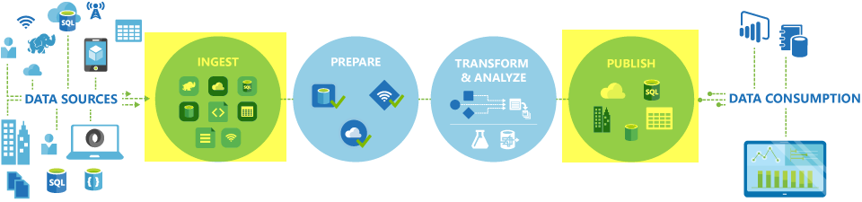

<properties
    pageTitle="Déplacer des données à l’aide de copie activité | Microsoft Azure"
    description="En savoir plus sur le déplacement des données dans les pipelines Data Factory : migration des données entre banques cloud et entre un magasin local et un magasin cloud. Utilisez l’activité de copie."
    keywords="copier des données, déplacement de données, migration des données, de transfert de données"
    services="data-factory"
    documentationCenter=""
    authors="linda33wj"
    manager="jhubbard"
    editor="monicar"/>

<tags
    ms.service="data-factory"
    ms.workload="data-services"
    ms.tgt_pltfrm="na"
    ms.devlang="na"
    ms.topic="article"
    ms.date="09/22/2016"
    ms.author="jingwang"/>

# Déplacer des données à l’aide d’activité de copie

## Vue d’ensemble
Dans Azure Data Factory, vous pouvez utiliser activité copier pour copier les données de différentes formes de diverses en local et de sources de données Azure en nuage. Une fois que les données sont copiées, pouvoir être davantage de transformation et d’analyse. Vous pouvez également utiliser activité de copie pour publier transformation et les résultats de l’analyse pour business intelligence (BI) et consommation de l’application.

Activité de copie est optimisée par sécurisé, fiable, format SVG et le [service globalement disponible](#global). Cet article fournit des détails sur le déplacement des données dans Data Factory et activité de copie.

Tout d’abord, nous allons voir comment la migration de données s’effectue entre deux banques de données cloud et entre une banque de données locale et un magasin de données cloud.

> [AZURE.NOTE] Pour plus d’informations sur les activités en général, voir [activités et les pipelines de présentation](data-factory-create-pipelines.md).

### Copier des données entre deux banques de données du cloud
Lors de la source et récepteur de banques de données se trouvent dans le cloud, copie activité parcourt les étapes suivantes pour copier des données provenant de la source dans le récepteur. Le service correspondant à copier activité :

1. Lit les données à partir du magasin de données source.
2. Effectue sérialisation/désérialisation, compression/décompression, mappage de colonne, puis tapez conversion. Fonction ces opérations basées sur les configurations du jeu de données d’entrée, jeu de données de sortie et activité de copie.
3.  Écrit des données dans le magasin de données de destination.

Le service choisit automatiquement la région optimale pour effectuer le déplacement de données. Cette zone est généralement celui le plus proche de la banque de données récepteur.

### Copier des données entre un magasin de données en local et un magasin de données du cloud
Pour déplacer en toute sécurité des données entre un magasin de données en local et un magasin de données cloud, installez la passerelle de gestion des données sur votre ordinateur local. Passerelle de gestion des données est un agent qui permet de traitement et déplacement de données hybride. Vous pouvez l’installer sur le même ordinateur que les données stockent elle-même ou sur un ordinateur distinct qui a accès au magasin de données.

Dans ce scénario, passerelle de gestion des données effectue la sérialisation/désérialisation, la compression/décompression, le mappage de colonne et la conversion de type. Données ne sont pas transmis via le service Azure Data Factory. En revanche, passerelle de gestion des données écrit directement les données dans le magasin de destination.

Voir [déplacer des données entre en local et nuage de banques de données](data-factory-move-data-between-onprem-and-cloud.md) pour une introduction et une procédure pas à pas. Pour plus d’informations sur cet agent, consultez la [Passerelle de gestion des données](data-factory-data-management-gateway.md) .

Vous pouvez également déplacer des données de prise en charge des magasins de données qui sont hébergés sur des machines virtuelles Azure IaaS (machines virtuelles) à l’aide de passerelle de gestion des données. Dans ce cas, vous pouvez installer passerelle de gestion des données sur la même machine virtuelle comme stockent les données lui-même ou sur un ordinateur virtuel distinct qui a accès au magasin de données.

## Banques de données prises en charge et formats
[AZURE.INCLUDE [data-factory-supported-data-stores](../../includes/data-factory-supported-data-stores.md)]

Si vous avez besoin déplacer des données vers ou à partir de des données stockent que copie activité ne prend en charge, utilisez une **activité personnalisée** dans Data Factory avec votre propre logique de copie/déplacement des données. Pour plus d’informations sur la création et à l’aide d’une activité personnalisée, voir [utiliser les activités personnalisées dans un pipeline Azure Data Factory](data-factory-use-custom-activities.md).

### Formats de fichier pris en charge
Activité de copie permet de copier des fichiers en tant que-est comprise entre deux basée sur le fichier banques de données, tels que HADOOP Blob Azure et système de fichiers. Pour ce faire, vous pouvez ignorer la [section format](data-factory-create-datasets.md) dans les deux les définitions de jeu de données d’entrée et de sortie. Les données sont copiées efficacement sans toute sérialisation/désérialisation.

Activité de copie également lire et écrire à des fichiers dans les formats spécifiés : texte, Avro, ORC, Parquet et JSON. Vous pouvez effectuer les activités suivantes de copie, par exemple :

-   Copiez les données au format texte (CSV) des objets Blob Azure et écrire sur base de données SQL Azure.
-   Copiez les fichiers au format texte (CSV) du système de fichiers en local et écrire sur Azure Blob de format Avro.
-   Copier des données dans une base de données SQL Azure et écrire vers HADOOP local au format ORC.

## Déplacement de données globalement disponibles
Azure Data Factory est disponible uniquement dans les régions ouest États-Unis, Extrême-Orient États-Unis et Europe du Nord. Toutefois, le service correspondant à copier activité est disponible du globalement dans les régions et les zones géographiques suivants. La topologie globalement disponible garantit déplacement de données qui évite généralement sauts entre région. Consultez [Services par région](https://azure.microsoft.com/regions/#services) pour la disponibilité des données usine et déplacer des données dans une zone.

### Copier des données entre banques de données cloud
Lors de la source et récepteur de banques de données se trouvent dans le cloud, Data Factory utilise un déploiement de service dans la zone qui correspond le mieux au récepteur dans la même géographie pour déplacer les données. Consultez le tableau suivant pour le mappage :

Zone de la banque de données de destination | Région utilisé pour le déplacement de données
:----------------------------------- | :----------------------------
États-Unis Extrême-Orient | États-Unis Extrême-Orient
États-Unis Extrême-Orient 2 | États-Unis Extrême-Orient 2
États-Unis Ouest | États-Unis Ouest
États-Unis Ouest 2 | États-Unis Ouest
États-Unis centre | États-Unis centre
États-Unis centre ouest | États-Unis centre
États-Unis centre nord | États-Unis centre nord
États-Unis centre sud | États-Unis centre sud
Europe du Nord | Europe du Nord
Europe ouest | Europe ouest
Pays d’Asie du Sud-est | Pays d’Asie du Sud-est
Asie de l’est | Pays d’Asie du Sud-est
Orient Japon | Orient Japon
Japon ouest | Orient Japon
Brésil sud | Brésil sud
Australie est | Australie nord-est
Australie sud-est. | Australie sud-est.
Inde central | Inde central
Inde du Sud | Inde central
Inde ouest | Inde central

> [AZURE.NOTE] Si la zone de la banque de données de destination n’est pas dans la liste précédente, copie activité échoue plutôt que d’utiliser une zone de remplacement.

### Copier des données entre un magasin de données en local et un magasin de données du cloud
Lorsque les données sont copiées entre locaux (ou machines virtuelles/IaaS Azure) et cloud stores, [Passerelle de gestion des données](data-factory-data-management-gateway.md) effectue déplacement de données sur un ordinateur local ou un ordinateur virtuel. Les données ne sont pas transmis via le service dans le cloud, sauf si vous utilisez la fonctionnalité [mis en place de copie](data-factory-copy-activity-performance.md#staged-copy) . Dans ce cas, les données sont véhiculées par le biais du stockage d’objets Blob Azure intermédiaire avant qu’elle est écrite dans le magasin de données récepteur.

## Créer un pipeline avec une activité copie
Vous pouvez créer un pipeline avec une activité copie dans de deux façons :

### À l’aide de l’Assistant copie
L’Assistant données usine copie vous aide à créer un pipeline avec une activité copie. Ce pipeline permet de copier des données à partir de sources pris en charge dans destinations *sans écrire JSON* définitions des services liés, jeux de données et pipelines. Pour plus d’informations sur l’Assistant, consultez [L’Assistant copie de données par défaut](data-factory-copy-wizard.md) .  

### À l’aide des scripts JSON
Vous pouvez utiliser l’éditeur de données par défaut dans le portail Azure, Visual Studio ou Azure PowerShell pour créer une définition JSON pour un pipeline (à l’aide de copie activité). Ensuite, vous pouvez déployer dessus pour créer le pipeline de données par défaut. Voir [didacticiel : utiliser copie activité dans un pipeline Azure Data Factory](data-factory-copy-data-from-azure-blob-storage-to-sql-database.md) pour un didacticiel des instructions étape par étape.    

Propriétés JSON (par exemple, nom, description, entrée et sortie tables et stratégies) sont disponibles pour tous les types d’activités. Propriétés disponibles dans la `typeProperties` section de l’activité dépendent de chaque type d’activité.

Activité de copie, le `typeProperties` section varie selon les types de sources et les récepteurs. Cliquez sur un source/récepteur dans la section [sources et les récepteurs prises en charge](#supported-data-stores) pour en savoir plus sur les propriétés de type qui prend en charge de l’activité de copie pour ce magasin de données.   

Voici un exemple de définition de JSON :

    {
      "name": "ADFTutorialPipeline",
      "properties": {
        "description": "Copy data from Azure blob to Azure SQL table",
        "activities": [
          {
            "name": "CopyFromBlobToSQL",
            "type": "Copy",
            "inputs": [
              {
                "name": "InputBlobTable"
              }
            ],
            "outputs": [
              {
                "name": "OutputSQLTable"
              }
            ],
            "typeProperties": {
              "source": {
                "type": "BlobSource"
              },
              "sink": {
                "type": "SqlSink",
                "writeBatchSize": 10000,
                "writeBatchTimeout": "60:00:00"
              }
            },
            "Policy": {
              "concurrency": 1,
              "executionPriorityOrder": "NewestFirst",
              "retry": 0,
              "timeout": "01:00:00"
            }
          }
        ],
        "start": "2016-07-12T00:00:00Z",
        "end": "2016-07-13T00:00:00Z"
      }
    }

Le calendrier défini dans le groupe de données de sortie détermine quand l’activité s’exécute (par exemple : **quotidienne**, fréquence comme **jour**et l’intervalle **1**). L’activité de copies des données d’un jeu de données d’entrée (**source**) dans un jeu de données de sortie (**récepteur**).

Vous pouvez spécifier plusieurs dataset d’activité de copie entrée. Ils sont utilisés pour vérifier les dépendances avant l’exécution de l’activité. Toutefois, seules les données du premier jeu de données sont copiées au groupe de données de destination. Pour plus d’informations, voir [planification et l’exécution](data-factory-scheduling-and-execution.md).  

## Performances et réglage
Voir l' [activité de copie de guide de performances et réglage des périphériques](data-factory-copy-activity-performance.md), qui décrit les principaux facteurs qui affectent les performances de déplacer des données (copie activité) dans Azure Data Factory. Par ailleurs, répertorie les résultats obtenus lors des tests internes et présente différentes façons pour optimiser les performances de l’activité de copie.

## Copie de planification et séquentiel
Pour plus d’informations sur le fonctionnement de la planification et l’exécution dans Data Factory, voir [planification et l’exécution](data-factory-scheduling-and-execution.md) . Il est possible d’exécuter une après l’autre plusieurs opérations de copie d’une manière séquentielle/commandé. Consultez la section [commandé copie](data-factory-scheduling-and-execution.md#ordered-copy) .

## Conversions de types
Différents magasins de données ont des systèmes de types native. Activité de copie exécute des conversions de type automatique à partir de types de sources pour recevoir les types de l’approche en deux étapes suivantes :

1. Convertir des types de sources native un type .NET.
2. Convertir un type .NET à un type de récepteur native.

Le mappage à partir d’un système de type native à un type .NET d’une banque de données se trouve dans l’article de magasin de données correspondantes. (Cliquez sur le lien spécifique dans la table [pris en charge de banques de données](#supported-data-stores) ). Vous pouvez utiliser ces mappages afin de déterminer les types appropriés lors de la création de vos tables, copie activité effectue les conversions de droite.

## Étapes suivantes
- Pour en savoir plus sur l’activité de copie, voir [copier des données à partir du stockage Blob Azure à base de données SQL Azure](data-factory-copy-data-from-azure-blob-storage-to-sql-database.md).
- Pour en savoir plus sur le déplacement des données à partir d’une banque de données locale vers un magasin de données cloud, voir [déplacement des données à partir de locaux cloud données stocke](data-factory-move-data-between-onprem-and-cloud.md).
