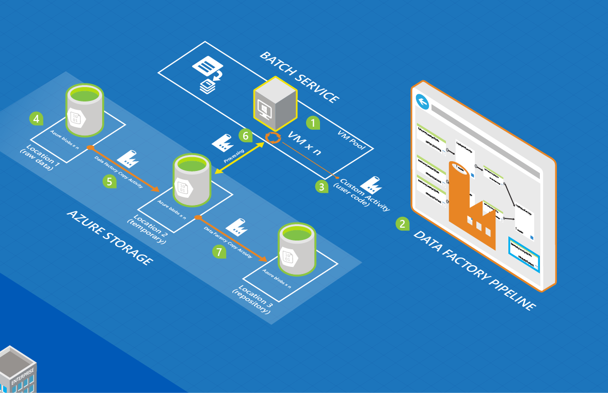
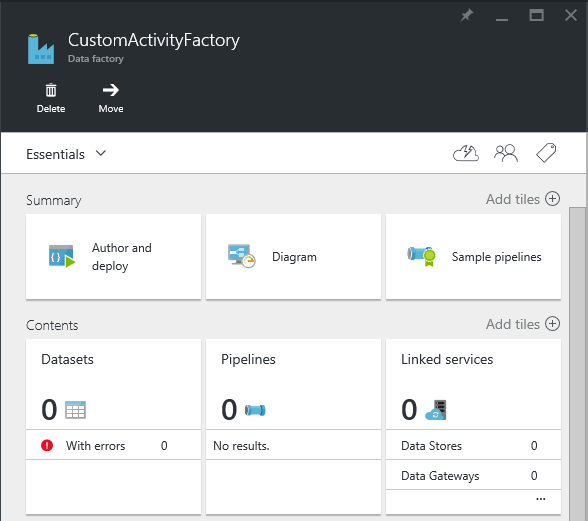
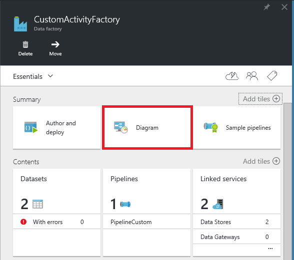
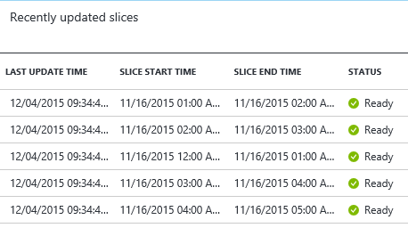
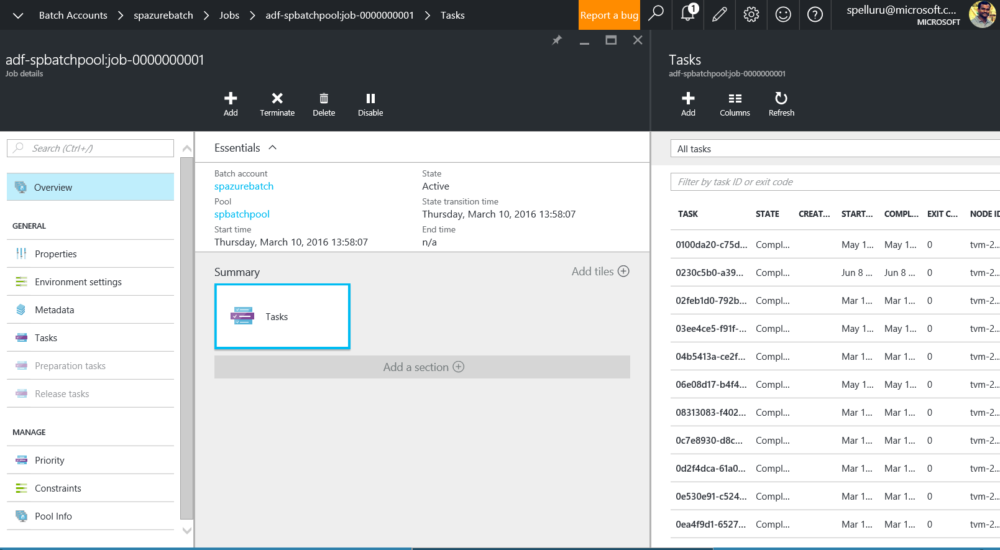

<properties
    pageTitle="Traiter les jeux de données à grande échelle à l’aide de données par défaut et la feuille | Microsoft Azure"
    description="Décrit comment traiter les grandes quantités de données dans un pipeline Azure Data Factory à l’aide de capacité de traitement en parallèle du lot Azure."
    services="data-factory"
    documentationCenter=""
    authors="spelluru"
    manager="jhubbard"
    editor="monicar"/>

<tags
    ms.service="data-factory"
    ms.workload="data-services"
    ms.tgt_pltfrm="na"
    ms.devlang="na"
    ms.topic="article"
    ms.date="10/17/2016"
    ms.author="spelluru"/>

# Processus à grande échelle des groupes de données à l’aide de données par défaut et la feuille
Cet article décrit une architecture d’un exemple de solution qui se déplace et traite les jeux de données à grande échelle de manière automatique et planifiée. Il fournit également une procédure pas à pas de bout en bout pour mettre en œuvre la solution en utilisant Azure Data Factory et Azure lot. 

Cet article est supérieure à notre article classique, car elle contient une procédure pas à pas d’une solution exemple complet. Si vous ne connaissez pas le lot et Data Factory, vous pouvez en savoir plus sur ces services et découvrez comment ils fonctionnent ensemble. Si vous avez des informations sur les services et soyez conception/élaboration d’une solution, vous pouvez vous concentrer uniquement sur la [section architecture](#architecture-of-sample-solution) de l’article et si vous développez un prototype ou une solution, vous pouvez également essayer d’obtenir des instructions étape par étape de la [procédure pas à pas](#implementation-of-sample-solution). Nous inviter vos commentaires sur ce contenu et comment l’utiliser.

Tout d’abord, nous allons voir comment les services de données par défaut et de la feuille peuvent vous aider avec traitement de grands volumes de données dans le cloud.     

## Pourquoi lot Azure ?
Lot Azure active vous permet d’exécuter des applications à grande échelle parallèles et High performance computing (HPC) efficacement dans le cloud. Il s’agit d’un service de plateforme qui planifie cluster de manière intensive à s’exécuter sur une collection managée des machines virtuelles et pouvez échelle calculer automatiquement ressources pour répondre aux besoins de vos projets.

Avec le service lot, vous définissez des ressources cluster Azure pour exécuter vos applications en parallèle et à l’échelle. Vous pouvez exécuter à la demande ou planifiée travaux et que vous n’avez pas besoin manuellement créer, configurer et gérer un cluster HPC, machines virtuelles, réseaux virtuels ou un travail complexe et infrastructure de planification de la tâche.

Consultez les articles suivants si vous n’êtes pas familiarisé avec Azure lot en aidant à comprendre l’architecture/implémentation de la solution décrite dans cet article.   

- [Concepts de base du lot Azure](../batch/batch-technical-overview.md)
- [Présentation des fonctionnalités de traitement par lots](../batch/batch-api-basics.md)

(facultatif) Pour en savoir plus sur Azure lot, voir la [rubrique d’apprentissage pour lot Azure](https://azure.microsoft.com/documentation/learning-paths/batch/).

## Pourquoi usine données Azure ?
Données Factory est un service d’intégration de données sur le nuage qui orchestre et automatisation déplacement et transformation de données. Au moyen du service de données par défaut, vous pouvez créer les pipelines de données gérées que déplacement des données locales et en nuage banques de données dans un magasin de données centralisé (par exemple : stockage d’objets Blob Azure) et processus/transformation des données à l’aide de services tels que Azure HDInsight et d’apprentissage automatique Azure. Vous pouvez également planifier les pipelines de données d’exécution dans une manière planifiée (horaire, quotidienne, hebdomadaire, etc.) et un moniteur et les gérer en un clin de œil à identifier les problèmes et prendre des mesures. 

Consultez les articles suivants si vous n’êtes pas familiarisé avec Azure Data Factory en aidant à comprendre l’architecture/implémentation de la solution décrite dans cet article.  

- [Présentation des données Azure usine](data-factory-introduction.md)
- [Créer votre première pipeline de données](data-factory-build-your-first-pipeline.md)   

(facultatif) Pour en savoir plus sur Azure Data Factory, voir la [rubrique d’apprentissage pour Azure Data Factory](https://azure.microsoft.com/documentation/learning-paths/data-factory/).

## Données usine et lot gagnante
Données Factory comprend activités intégrées comme activité de copie à copier/déplacer des données à partir d’un magasin de données source dans un magasin de données de destination et activité ruche pour traiter les données à l’aide de clusters Hadoop (HDInsight) sur Azure. Voir les [Activités de Transformation de données](data-factory-data-transformation-activities.md) pour une liste des activités de transformation pris en charge. 

Il vous permet également de créer des activités .NET personnalisées pour déplacer ou traiter les données avec votre propre logique et exécutez ces activités sur un cluster Azure HDInsight ou sur un pool Azure lot de machines virtuelles. Lorsque vous utilisez Azure lot, vous pouvez configurer le pool à l’échelle automatique (ajouter ou supprimer des machines virtuelles en fonction de la charge de travail) basée sur une formule que vous avez défini.     

## Architecture de solution de l’échantillon
Même si l’architecture décrite dans cet article est destiné à une solution simple, il est pertinent pour les scénarios complexes tels que risque de modélisation par services financiers, le traitement des images et rendu et analyse génomique. 

Le diagramme illustre 1) comment Data Factory orchestre traitement et déplacement de données et 2) comment Azure lot traite les données d’une manière parallèle. Télécharger et imprimer le diagramme pour faciliter la consultation (11 x 17. ou la taille de la cellule A3) : [orchestration HPC et les données à l’aide de lot Azure et Data Factory](http://go.microsoft.com/fwlink/?LinkId=717686).

La liste suivante fournit les étapes de base du processus. La solution inclut code et explications pour générer la solution de bout en bout.

1.  **Configurer Azure lot avec un pool de nœuds de calcul (machines virtuelles)**. Vous pouvez spécifier le nombre de nœuds et la taille de chaque nœud.

2.  **Créer une instance d’Azure Data Factory** qui est configuré avec entités qui représentent stockage blob Azure, le service de cluster Azure lot, données d’entrée/sortie et un flux de travail/pipeline d’activités déplacer et transformer les données.

3.   **Créer une activité personnalisée .NET dans le pipeline de données par défaut**. L’activité est votre code utilisateur qui s’exécute sur le pool lot Azure.

4.  **Grandes quantités de magasin de données d’entrée en tant que des objets BLOB Azure stockage**. Données sont divisées en sections logiques (généralement par heure).

5.  **Data Factory copie les données qui sont traitées en parallèle** à l’emplacement secondaire.

6.  **L’activité personnalisée en utilisant le pool attribué par lot exécute des données**. Données usine peut exécuter activités simultanément. Chaque activité traite un secteur de données. Les résultats sont stockés dans le stockage Azure.

7.  **Que données usine déplace le résultat final à un emplacement tiers**, pour une distribution via une application, ou pour un traitement approfondi par d’autres outils.

## Implémentation de la solution de l’échantillon
L’exemple de solution est intentionnellement simple et consiste à vous montrer comment utiliser conjointement Data Factory et lot de traitement des jeux de données. La solution compte simplement le nombre d’occurrences d’un terme à rechercher (« Microsoft ») dans les fichiers d’entrée organisées en une série chronologique. Il renvoie le nombre de fichiers de sortie.

**Heure**: Si vous connaissez les concepts de base d’Azure, Data Factory et lot et les conditions préalables ci-dessous s’est terminée, nous estimer cette solution prend 1 et 2 heures.

### Conditions préalables

#### Abonnement Azure
Si vous n’avez un abonnement Azure, vous pouvez créer un compte d’évaluation gratuit en quelques minutes. Voir la [version d’évaluation gratuite](https://azure.microsoft.com/pricing/free-trial/).

#### Compte de stockage Azure
Vous utilisez un compte de stockage Azure pour stocker les données dans ce didacticiel. Si vous n’avez pas un compte de stockage Azure, voir [créer un compte de stockage](../storage/storage-create-storage-account.md#create-a-storage-account). L’exemple de solution utilise le stockage blob.

#### Compte lot Azure
Créez un compte Azure lot à l’aide du [portail Azure](http://manage.windowsazure.com/). Voir [créer et gérer un compte Azure lot](../batch/batch-account-create-portal.md). Notez la clé de compte et nom de compte Azure lot. Vous pouvez également utiliser l’applet de commande [New-AzureRmBatchAccount](https://msdn.microsoft.com/library/mt603749.aspx) pour créer un compte Azure lot. Pour obtenir des instructions détaillées sur l’utilisation de cette applet de commande, voir [prise en main applets de commande PowerShell de lot Azure](../batch/batch-powershell-cmdlets-get-started.md) .

L’exemple de solution utilise lot Azure (indirectement via un pipeline Azure Data Factory) pour traiter les données d’une manière parallèle sur un pool de nœuds de calcul (une collection managée des machines virtuelles).

#### Azure pool lot des machines virtuelles (machines virtuelles)
Créer un **lot Azure pool** avec au moins 2 nœuds de calcul.

1.  Dans le [portail Azure](https://portal.azure.com), cliquez sur **Parcourir** dans le menu de gauche, puis cliquez sur **Comptes lot**. 
2. Sélectionnez votre compte Azure lot pour ouvrir la carte **Lot de compte** . 
3. Cliquez sur **Pools** vignette.
4. Dans la carte **des Pools** , sur le bouton Ajouter dans la barre d’outils pour ajouter un regroupement.
    1. Entrez un ID pour le regroupement (**ID du Pool**). Notez l' **ID du pool**; vous avez besoin lorsque vous créez la solution Data Factory. 
    2. Spécifiez **Windows Server 2012 R2** pour le paramètre de famille de systèmes d’exploitation.
    3. Sélectionnez un **niveau de tarification nœud**.
    4. Entrez **2** en tant que valeur du paramètre **Cible dédié** .
    5. Entrez **2** en tant que valeur du paramètre de **tâches Max par nœud** .
    6. Cliquez sur **OK** pour créer le pool. 
    
#### Explorateur de stockage Azure   
[Azure stockage Explorer 6 (outil)](https://azurestorageexplorer.codeplex.com/) ou [CloudXplorer](http://clumsyleaf.com/products/cloudxplorer) (contre les logiciels ClumsyLeaf). Vous utilisez ces outils permettant d’examiner et modifier les données dans vos projets de stockage Azure, y compris les journaux de vos applications hébergé sur le nuage.

1.  Créer un conteneur nommé **mycontainer** avec un accès privé (pas d’accès anonyme)

2.  Si vous utilisez **CloudXplorer**, créer des dossiers et sous-dossiers avec la structure suivante :

    

    **Inputfolder** et **outputfolder** sont des dossiers de niveau supérieur dans **mycontainer,** et **inputfolder** contient des sous-dossiers avec cachets de date-heure (AAAA-MM-JJ-HH).

    Si vous utilisez l' **Explorateur de stockage Azure**, dans l’étape suivante, vous devez télécharger des fichiers avec des noms : inputfolder/2015-11-16-00/file.txt, inputfolder/2015-11-16-01/file.txt et ainsi de suite. Cette étape crée automatiquement les dossiers.

3.  Créer un fichier de texte **fichier.txt** sur votre ordinateur avec contenu qui comporte le mot clé **Microsoft**. Par exemple : « tester une activité personnalisée Microsoft test une activité personnalisée Microsoft ».

4.  Télécharger le fichier dans les dossiers suivants d’entrée dans le stockage blob Azure.

    

    Si vous utilisez **l’Explorateur de stockage Azure**, téléchargez le fichier **fichier.txt** sur **mycontainer**. Cliquez sur **Copier** dans la barre d’outils pour créer une copie de l’objet blob. Dans la boîte de dialogue **Blob de copier** , modifier le **nom du blob de destination** pour **inputfolder/2015-11-16-00/file.txt.** Répétez cette étape pour créer inputfolder/2015-11-16-01/file.txt, inputfolder/2015-11-16-02/file.txt, inputfolder/2015-11-16-03/file.txt, inputfolder/2015-11-16-04/file.txt et ainsi de suite. Cette action crée automatiquement les dossiers.

3.  Créer un autre conteneur nommé : **customactivitycontainer**. Vous téléchargez le fichier zip une activité personnalisée à ce conteneur.

#### Visual Studio
Installez Microsoft Visual Studio 2012 ou version ultérieure pour créer l’activité de traitement par lots personnalisée à utiliser dans la solution Data Factory.

### Principales étapes à suivre pour créer la solution

1.  Créer une activité personnalisée qui contient la logique de traitement des données.
2.  Créer une usine de données Azure qui utilise l’activité personnalisée :

### Créer une activité personnalisée

L’activité personnalisée Data Factory est au cœur de cette solution. L’exemple de solution utilise Azure lot pour exécuter l’activité personnalisée. Voir [utiliser des activités personnalisées dans un pipeline Azure Data Factory](data-factory-use-custom-activities.md) pour les informations de base pour développer des activités personnalisées et les utiliser dans les pipelines Azure Data Factory.

Pour créer une activité personnalisée .NET que vous pouvez utiliser dans un pipeline Azure Data Factory, vous devez créer un projet de **Bibliothèque de classes .NET** avec une classe qui mettent en œuvre, cette interface **IDotNetActivity** . Cette interface comporte une seule méthode : **Execute**. Voici la signature de la méthode :

    public IDictionary<string, string> Execute(
                IEnumerable<LinkedService> linkedServices,
                IEnumerable<Dataset> datasets,
                Activity activity,
                IActivityLogger logger)

La méthode a quelques composants clés que vous devez comprendre.

-   La méthode prend quatre paramètres :

    1.  **linkedServices**. Liste énumérable des services liées qui lier des sources de données d’entrée/sortie (par exemple : stockage d’objets Blob Azure) à l’usine de données. Dans cet exemple, il n'est qu’un seul service lié de type stockage Azure utilisé pour l’entrée et sortie.

    2.  **jeux de données**. Il s’agit d’une liste énumérable de jeux de données. Vous pouvez utiliser ce paramètre pour obtenir les emplacements et les schémas définis par jeux de données d’entrée et de sortie.

    3.  **activité**. Ce paramètre représente la cluster entité actuelle - dans ce cas, un service lot Azure.

    4.  **Enregistreur d’événements**. Le journal vous permet d’écrire des commentaires de débogage survenant en tant que le journal « Utilisateurs » pour le pipeline.

-   La méthode retourne un dictionnaire qui peut être utilisé pour monter en cascade des activités personnalisées à l’avenir. Cette fonctionnalité n’est pas encore implémentée, aussi retourner un dictionnaire vide à partir de la méthode. 

#### Procédure : Créer une activité personnalisée

1.  Créer un projet de bibliothèque de classes .NET dans Visual Studio.

    1.  Barre de lancement **Visual Studio 2012**/**2013/2015**.

    2.  Cliquez sur **fichier**, pointez sur **Nouveau**, puis cliquez sur **projet**.

    3.  Développez **modèles**, puis sélectionnez **Visual C\#**. Dans cette procédure pas à pas, vous utilisez C\#, mais vous pouvez utiliser n’importe quelle langue .NET pour développer l’activité personnalisée.

    4.  Sélectionnez la **Bibliothèque de classes** dans la liste des types de projets à droite.

    5.  Entrez **MyDotNetActivity** pour le **nom**.

    6.  Sélectionnez **C:\\chargeur** à l' **emplacement**. Créer le dossier **chargeur** s’il n’existe pas.

    7.  Cliquez sur **OK** pour créer le projet.

2.  Cliquez sur **Outils**, pointez sur **Gestionnaire de Package NuGet**, puis cliquez sur **Gestionnaire de Package Console**.

3.  Dans la **Console du Gestionnaire de Package**, exécutez la commande suivante pour importer **Microsoft.Azure.Management.DataFactories**.

            Install-Package Microsoft.Azure.Management.DataFactories

4.  Importer le package NuGet **Stockage Azure** au projet. Vous devez ce lot, car vous utilisez le stockage Blob API dans cet exemple.

        Install-Package Azure.Storage

5.  Ajoutez les directives suivantes **à l’aide** pour le fichier source dans le projet.

        using System.IO;
        using System.Globalization;
        using System.Diagnostics;
        using System.Linq;

        using Microsoft.Azure.Management.DataFactories.Models;
        using Microsoft.Azure.Management.DataFactories.Runtime;

        using Microsoft.WindowsAzure.Storage;
        using Microsoft.WindowsAzure.Storage.Blob;

6.  Modifier le nom de l' **espace de noms** pour **MyDotNetActivityNS**.

        namespace MyDotNetActivityNS

7.  Remplacez le nom de la classe **MyDotNetActivity** et il dérivent de l’interface **IDotNetActivity** comme illustré ci-dessous.

        public class MyDotNetActivity : IDotNetActivity

8.  Implémentez méthode (Ajouter) l' **exécution** de l’interface **IDotNetActivity** à la classe **MyDotNetActivity** et copiez le code suivant à la méthode. Consultez la section [Exécuter une méthode](#execute-method) pour explication de la logique utilisée dans cette méthode.

        /// 

        /// Execute method is the only method of IDotNetActivity interface you must implement.
        /// In this sample, the method invokes the Calculate method to perform the core logic.  
        /// 

        public IDictionary<string, string> Execute(
            IEnumerable<LinkedService> linkedServices,
            IEnumerable<Dataset> datasets,
            Activity activity,
            IActivityLogger logger)
        {

            // declare types for input and output data stores
            AzureStorageLinkedService inputLinkedService;

            Dataset inputDataset = datasets.Single(dataset => dataset.Name == activity.Inputs.Single().Name);
    
            foreach (LinkedService ls in linkedServices)
                logger.Write("linkedService.Name {0}", ls.Name);

            // using First method instead of Single since we are using the same
            // Azure Storage linked service for input and output.
            inputLinkedService = linkedServices.First(
                linkedService =>
                linkedService.Name ==
                inputDataset.Properties.LinkedServiceName).Properties.TypeProperties
                as AzureStorageLinkedService;

            string connectionString = inputLinkedService.ConnectionString; // To create an input storage client.
            string folderPath = GetFolderPath(inputDataset);
            string output = string.Empty; // for use later.

            // create storage client for input. Pass the connection string.
            CloudStorageAccount inputStorageAccount = CloudStorageAccount.Parse(connectionString);
            CloudBlobClient inputClient = inputStorageAccount.CreateCloudBlobClient();

            // initialize the continuation token before using it in the do-while loop.
            BlobContinuationToken continuationToken = null;
            do
            {   // get the list of input blobs from the input storage client object.
                BlobResultSegment blobList = inputClient.ListBlobsSegmented(folderPath,
                                         true,
                                         BlobListingDetails.Metadata,
                                         null,
                                         continuationToken,
                                         null,
                                         null);

                // Calculate method returns the number of occurrences of
                // the search term (“Microsoft”) in each blob associated
                // with the data slice.
                //
                // definition of the method is shown in the next step.
                output = Calculate(blobList, logger, folderPath, ref continuationToken, "Microsoft");

            } while (continuationToken != null);

            // get the output dataset using the name of the dataset matched to a name in the Activity output collection.
            Dataset outputDataset = datasets.Single(dataset => dataset.Name == activity.Outputs.Single().Name);

            folderPath = GetFolderPath(outputDataset);

            logger.Write("Writing blob to the folder: {0}", folderPath);

            // create a storage object for the output blob.
            CloudStorageAccount outputStorageAccount = CloudStorageAccount.Parse(connectionString);
            // write the name of the file.
            Uri outputBlobUri = new Uri(outputStorageAccount.BlobEndpoint, folderPath + "/" + GetFileName(outputDataset));

            logger.Write("output blob URI: {0}", outputBlobUri.ToString());
            // create a blob and upload the output text.
            CloudBlockBlob outputBlob = new CloudBlockBlob(outputBlobUri, outputStorageAccount.Credentials);
            logger.Write("Writing {0} to the output blob", output);
            outputBlob.UploadText(output);

            // The dictionary can be used to chain custom activities together in the future.
            // This feature is not implemented yet, so just return an empty dictionary.
            return new Dictionary<string, string>();
        }

9.  Ajoutez les méthodes d’assistance suivantes à la classe. Ces méthodes sont appelées par la méthode **Execute** . Surtout, la méthode **Calculate** isole le code parcourt chaque blob.

        /// 

        /// Gets the folderPath value from the input/output dataset.
        /// 

        private static string GetFolderPath(Dataset dataArtifact)
        {
            if (dataArtifact == null || dataArtifact.Properties == null)
            {
                return null;
            }

            AzureBlobDataset blobDataset = dataArtifact.Properties.TypeProperties as AzureBlobDataset;
            if (blobDataset == null)
            {
                return null;
            }

            return blobDataset.FolderPath;
        }

        /// 

        /// Gets the fileName value from the input/output dataset.
        /// 

        private static string GetFileName(Dataset dataArtifact)
        {
            if (dataArtifact == null || dataArtifact.Properties == null)
            {
                return null;
            }

            AzureBlobDataset blobDataset = dataArtifact.Properties.TypeProperties as AzureBlobDataset;
            if (blobDataset == null)
            {
                return null;
            }

            return blobDataset.FileName;
        }

        /// 

        /// Iterates through each blob (file) in the folder, counts the number of instances of search term in the file,
        /// and prepares the output text that is written to the output blob.
        /// 

        public static string Calculate(BlobResultSegment Bresult, IActivityLogger logger, string folderPath, ref BlobContinuationToken token, string searchTerm)
        {
            string output = string.Empty;
            logger.Write("number of blobs found: {0}", Bresult.Results.Count<IListBlobItem>());
            foreach (IListBlobItem listBlobItem in Bresult.Results)
            {
                CloudBlockBlob inputBlob = listBlobItem as CloudBlockBlob;
                if ((inputBlob != null) && (inputBlob.Name.IndexOf("$$$.$$$") == -1))
                {
                    string blobText = inputBlob.DownloadText(Encoding.ASCII, null, null, null);
                    logger.Write("input blob text: {0}", blobText);
                    string[] source = blobText.Split(new char[] { '.', '?', '!', ' ', ';', ':', ',' }, StringSplitOptions.RemoveEmptyEntries);
                    var matchQuery = from word in source
                                     where word.ToLowerInvariant() == searchTerm.ToLowerInvariant()
                                     select word;
                    int wordCount = matchQuery.Count();
                    output += string.Format("{0} occurrences(s) of the search term \"{1}\" were found in the file {2}.\r\n", wordCount, searchTerm, inputBlob.Name);
                }
            }
            return output;
        }

    La méthode **GetFolderPath** renvoie le chemin d’accès au dossier qui dataset pointe vers et la méthode **GetFileName** retourne le nom de la blob/fichier sur lequel pointe le jeu de données.

        "name": "InputDataset",
        "properties": {
            "type": "AzureBlob",
            "linkedServiceName": "StorageLinkedService",
            "typeProperties": {
                "fileName": "file.txt",
                "folderPath": "mycontainer/inputfolder/{Year}-{Month}-{Day}-{Hour}",

    La méthode **Calculate** calcule le nombre d’instances du mot clé **Microsoft** dans les fichiers d’entrée (BLOB dans le dossier). Le terme à rechercher (« Microsoft ») est codé en dur dans le code.

10.  Compiler le projet. Cliquez sur **créer** à partir du menu, puis cliquez sur **Générer la Solution**.

11.  Lancez **l’Explorateur Windows**et accédez à **emplacement\\déboguer** ou **emplacement\\relâchez** dossier selon le type de génération.

12.  Créer un fichier zip **MyDotNetActivity.zip** qui contient tous les fichiers binaires dans le ** \\emplacement\\déboguer** dossier. Vous voudrez peut-être inclure le MyDotNetActivity. fichier **PDB** afin que vous obteniez des détails supplémentaires comme numéro de ligne dans le code source qui a provoqué le problème lorsqu’une erreur se produit.

    

13.  Télécharger **MyDotNetActivity.zip** comme un objet blob au conteneur blob : **customactivitycontainer** dans le stockage blob Azure que le **StorageLinkedService** lié service dans **ADFTutorialDataFactory** utilise. Créer le conteneur de blob **customactivitycontainer** s’il n’existe pas déjà.

#### Exécuter la méthode

Cette section fournit des autres détails et remarques sur le code dans la méthode Execute.

1.  Les membres d’itération au sein de la collection d’entrée sont trouvent dans l’espace de noms [Microsoft.WindowsAzure.Storage.Blob](https://msdn.microsoft.com/library/azure/microsoft.windowsazure.storage.blob.aspx) . Parcourez la collection d’objets blob nécessite l’utilisation de la classe **BlobContinuationToken** . En résumé, vous devez utiliser un-tandis que boucle avec le jeton comme mécanisme pour sortir de la boucle. Pour plus d’informations, voir [comment utiliser le stockage Blob de .NET](../storage/storage-dotnet-how-to-use-blobs.md). Voici une boucle de base :

        // Initialize the continuation token.
        BlobContinuationToken continuationToken = null;
        do
        {
        // Get the list of input blobs from the input storage client object.
        BlobResultSegment blobList = inputClient.ListBlobsSegmented(folderPath,
                                true,
                                          BlobListingDetails.Metadata,
                                          null,
                                          continuationToken,
                                          null,
                                          null);
        // Return a string derived from parsing each blob.
            output = Calculate(blobList, logger, folderPath, ref continuationToken, "Microsoft");

        } while (continuationToken != null);

    Consultez la documentation de la méthode [ListBlobsSegmented](https://msdn.microsoft.com/library/jj717596.aspx) pour plus d’informations.

2.  Le code pour l’utilisation de l’ensemble des objets BLOB logiquement accède au sein de la ne-tout en boucle. Dans la méthode **Execute** , ne-alors que boucle passe la liste des objets BLOB à une méthode nommée **Calculate**. La méthode retourne une variable chaîne nommée **sortie** qui est le résultat d’avoir parcouru tous les objets BLOB dans le segment.

    Elle renvoie le nombre d’occurrences du terme de recherche (**Microsoft**) dans le blob passé à la méthode de **calcul** .

        output += string.Format("{0} occurrences of the search term \"{1}\" were found in the file {2}.\r\n", wordCount, searchTerm, inputBlob.Name);

3.  Une fois que la méthode **Calculate** a terminé le travail, elle doit être écrite dans un nouveau blob. Donc pour chaque jeu d’objets BLOB traitées, un nouveau blob peut être écrites avec les résultats. Pour écrire dans un nouveau blob, tout d’abord rechercher le jeu de données de sortie.

        // Get the output dataset using the name of the dataset matched to a name in the Activity output collection.
        Dataset outputDataset = datasets.Single(dataset => dataset.Name == activity.Outputs.Single().Name);

4.  Le code appelle également une méthode d’assistance : **GetFolderPath** pour extraire le chemin du dossier (le nom du conteneur stockage).

        folderPath = GetFolderPath(outputDataset);

    La **GetFolderPath** effectue un cast de l’objet DataSet pour un AzureBlobDataSet, c'est-à-dire une propriété nommée FolderPath.

        AzureBlobDataset blobDataset = dataArtifact.Properties.TypeProperties as AzureBlobDataset;

        return blobDataset.FolderPath;

5.  Le code appelle la méthode **GetFileName** pour extraire le nom du fichier (nom d’objets blob). Le code est semblable au code ci-dessus pour obtenir le chemin du dossier.

        AzureBlobDataset blobDataset = dataArtifact.Properties.TypeProperties as AzureBlobDataset;

        return blobDataset.FileName;

6.  Le nom du fichier est écrit en créant un objet URI. Le constructeur URI utilise la propriété **BlobEndpoint** pour renvoyer le nom du conteneur. Le nom de fichier et le chemin du dossier sont ajoutés à construire le blob de sortie URI.  

        // Write the name of the file.
        Uri outputBlobUri = new Uri(outputStorageAccount.BlobEndpoint, folderPath + "/" + GetFileName(outputDataset));

7.  Le nom du fichier a été écrit et maintenant vous pouvez écrire la chaîne de sortie à partir de la méthode de **calcul** dans un nouveau blob :

        // Create a blob and upload the output text.
        CloudBlockBlob outputBlob = new CloudBlockBlob(outputBlobUri, outputStorageAccount.Credentials);
        logger.Write("Writing {0} to the output blob", output);
        outputBlob.UploadText(output);

### Créer le factory de données

Dans la section [créer une activité personnalisée](#create-the-custom-activity) , vous avez créé une activité personnalisée et téléchargé le fichier zip avec des fichiers binaires et le fichier PDB dans un conteneur d’objets blob Azure. Dans cette section, vous créez une **usine de données** Azure avec un **pipeline** qui utilise l' **activité personnalisée**.

Le jeu de données d’entrée pour l’activité personnalisée représente les objets BLOB (fichiers) dans le dossier d’entrée (mycontainer\\inputfolder) dans le stockage blob. Le dataset de sortie pour l’activité représente les objets BLOB de sortie dans le dossier de sortie (mycontainer\\outputfolder) dans le stockage blob.

Supprimer un ou plusieurs fichiers dans les dossiers d’entrée :

    mycontainer -\> inputfolder
        2015-11-16-00
        2015-11-16-01
        2015-11-16-02
        2015-11-16-03
        2015-11-16-04

Par exemple, déposez un fichier (fichier.txt) avec le contenu suivant dans chacun des dossiers.

    test custom activity Microsoft test custom activity Microsoft

Chaque dossier saisie correspond à un secteur dans Azure Data Factory même si le dossier contient des fichiers ou égale à 2. Lorsque chaque secteur est traité par le pipeline, l’activité personnalisée parcourt tous les objets BLOB dans le dossier d’entrée pour cette section.

Vous voyez cinq fichiers de sortie avec le même contenu. Par exemple, le fichier de sortie à partir de traitement du fichier dans le dossier 2015-11-16-00 comporte le contenu suivant :

    2 occurrences(s) of the search term "Microsoft" were found in the file inputfolder/2015-11-16-00/file.txt.

Si vous faites glisser plusieurs fichiers (fichier.txt, file2.txt, file3.txt) avec le même contenu vers le dossier d’entrée, vous voyez le contenu suivant dans le fichier de copie. Chaque dossier (2015-11-16-00, etc.) correspond à un secteur dans cet exemple, même si le dossier comporte plusieurs fichiers d’entrée.

    2 occurrences(s) of the search term "Microsoft" were found in the file inputfolder/2015-11-16-00/file.txt.
    2 occurrences(s) of the search term "Microsoft" were found in the file inputfolder/2015-11-16-00/file2.txt.
    2 occurrences(s) of the search term "Microsoft" were found in the file inputfolder/2015-11-16-00/file3.txt.

Le fichier de copie comporte trois lignes à présent, une pour chaque fichier d’entrée (blob) dans le dossier associé à la section (2015-11-16-00).

Une tâche est créée pour chaque activité exécuter. Dans cet exemple, vous trouverez qu’une seule activité dans le pipeline. Lorsqu’un secteur est traité par le pipeline, l’activité personnalisée s’exécute sur Azure lot pour traiter le secteur. Dans la mesure où il existe cinq secteurs (chaque secteur peut avoir plusieurs objets BLOB ou fichier), il existe cinq tâches créés par lots Azure. Lorsqu’une tâche s’exécute sur le lot, il est en réalité l’activité personnalisée qui est en cours d’exécution.

La procédure suivante fournit des détails supplémentaires.

#### Étape 1 : Créer le factory de données

1.  Après la connexion au [portail Azure](https://portal.azure.com/), procédez comme suit :

    1.  Cliquez sur **Nouveau** dans le menu de gauche.

    2.  Cliquez sur **données + Analytique** dans la carte de **Nouveau** .

    3.  Cliquez sur **Data Factory** dans la carte **analytique de données** .

2.  Dans la carte **nouvelle factory de données** , entrez **CustomActivityFactory** pour le nom. Le nom de la factory données Azure doit être globalement unique. Si vous recevez l’erreur : **nom d’usine données « CustomActivityFactory » n’est pas disponible**, modifiez le nom de la factory de données (par exemple, **yournameCustomActivityFactory**) et essayez à nouveau de créer.

3.  Cliquez sur **Nom du groupe ressources**et sélectionnez un groupe de ressources existant ou créer un groupe de ressources.

4.  Vérifiez que vous utilisez l’abonnement correcte et la région où vous souhaitez le factory de données à créer.

5.  Cliquez sur **créer** dans la carte **nouvelle factory de données** .

6.  Vous voyez le factory de données en cours de création dans le **tableau de bord** du portail Azure.

7.  Après que le factory de données a été créé avec succès, vous voyez la page par défaut de données, qui indique le contenu de la factory de données.

 

#### Étape 2 : Créer des services liées

Services liés lier banques de données ou le calculent des services à une usine de données Azure. Dans cette étape, vous liez votre compte de **Stockage Azure** et **Azure lot** compte à votre usine de données.

#### Créer le service de stockage Azure lié

1.  Cliquez sur le **auteur et déployer** vignette sur la carte de **Données par défaut** pour **CustomActivityFactory**. Vous voyez l’éditeur d’usine de données.

2.  Cliquez sur **nouveau magasin de données** dans la barre de commandes et choisissez **stockage Azure.** Vous devriez voir le script JSON pour la création d’un service de stockage Azure liées dans l’éditeur.

    

3.  Remplacez le **nom du compte** avec le nom de votre compte de stockage Azure et la **clé de compte** avec la touche d’accès du compte de stockage Azure. Pour savoir comment obtenir votre clé d’accès de stockage, voir [Afficher, copier et stockage régénérer les touches d’accès](../storage/storage-create-storage-account.md#view-copy-and-regenerate-storage-access-keys).

4.  Dans la barre de commande pour déployer le service lié, cliquez sur **déployer** .

    

#### Créer le lot Azure lié service

Dans cette étape, vous créez un service lié pour votre compte **Azure lot** qui est utilisé pour exécuter l’activité personnalisée Data Factory.

1.  Cliquez sur **Nouveau calcul** sur la barre de commandes et choisissez **Azure lot.** Vous devriez voir le script JSON pour créer un service lot Azure liées dans l’éditeur.

2.  Dans le script JSON :

    1.  Remplacez le **nom du compte** avec le nom de votre compte Azure lot.

    2.  Remplacez **touche d’accès rapide** avec la touche d’accès rapide du compte Azure lot.

    3.  Entrez l’ID du pool pour la propriété **poolName** **.** Pour cette propriété, vous pouvez spécifier un nom du pool ou du pool identifiant.

    4.  Entrez le lot URI pour la propriété JSON **batchUri** . 
    
        > [AZURE.IMPORTANT] L' **URL** à partir de la **carte de compte Azure lot** est au format suivant : \<nom de compte\>. \<région\>. batch.azure.com. Pour la propriété **batchUri** dans le JSON, vous devez **Supprimer « nom de compte ».** à partir de l’URL. Exemple : `"batchUri": "https://eastus.batch.azure.com"`.

        

        Pour la propriété **poolName** , vous pouvez également spécifier l’ID du pool plutôt que le nom du pool.

        > [AZURE.NOTE] Le service de données par défaut ne reconnaît pas une option à la demande pour Azure lot comme nous le faisons pour HDInsight. Vous ne pouvez utiliser votre propre pool Azure lot dans une usine de données Azure.

    5.  Spécifiez **StorageLinkedService** pour la propriété **linkedServiceName** . Vous avez créé ce service lié à l’étape précédente. Ce stockage est utilisé comme une zone de transfert des fichiers et des journaux.

3.  Dans la barre de commande pour déployer le service lié, cliquez sur **déployer** .

#### Étape 3 : Créer des groupes de données

Dans cette étape, vous créez des groupes de données pour représenter les données d’entrée et de sortie.

#### Créer le jeu de données d’entrée

1.  Dans l' **éditeur** pour le Factory de données, cliquez sur **Nouveau groupe de données** dans la barre d’outils, puis sur **stockage d’objets Blob Azure** dans le menu déroulant.

2.  Remplacez le JSON dans le volet droit par l’extrait de JSON suivant :

        {
            "name": "InputDataset",
            "properties": {
                "type": "AzureBlob",
                "linkedServiceName": "AzureStorageLinkedService",
                "typeProperties": {
                    "folderPath": "mycontainer/inputfolder/{Year}-{Month}-{Day}-{Hour}",
                    "format": {
                        "type": "TextFormat"
                    },
                    "partitionedBy": [
                        {
                            "name": "Year",
                            "value": {
                                "type": "DateTime",
                                "date": "SliceStart",
                                "format": "yyyy"
                            }
                        },
                        {
                            "name": "Month",
                            "value": {
                                "type": "DateTime",
                                "date": "SliceStart",
                                "format": "MM"
                            }
                        },
                        {
                            "name": "Day",
                            "value": {
                                "type": "DateTime",
                                "date": "SliceStart",
                                "format": "dd"
                            }
                        },
                        {
                            "name": "Hour",
                            "value": {
                                "type": "DateTime",
                                "date": "SliceStart",
                                "format": "HH"
                            }
                        }
                    ]
                },
                "availability": {
                    "frequency": "Hour",
                    "interval": 1
                },
                "external": true,
                "policy": {}
            }
        }

     Vous créez un pipeline plus loin dans cette procédure pas à pas avec l’heure de début : 2015-11-heures 16T00:00:00Z et de fin : 2015-11-16T05:00:00Z. Elle est planifiée pour produire des données **toutes les heures**, ce qui donne 5/sorties secteurs (entre **00**: 00:00 -\> **05**: 00:00).

     La **fréquence** et l' **intervalle** du groupe de données d’entrée est définie sur **heures** et **1**, ce qui signifie que le secteur d’entrée est disponible toutes les heures.

     Voici les heures de début pour chaque secteur, qui est représenté par la variable système **SliceStart** dans l’extrait de code JSON ci-dessus.

  	| **Secteur** | **Heure de début**          |
  	|-----------|-------------------------|
  	| 1         | 2015-11-16T**00**: 00:00 |
  	| 2         | 2015-11-16T**01**: 00:00 |
  	| 3         | 2015-11-16T**02**: 00:00 |
  	| 4         | 2015-11-16T**03**: 00:00 |
  	| 5         | 2015-11-16T**04**: 00:00 |

     La **folderPath** est calculé à l’aide de la partie année, mois, jour et heure de l’heure de début du secteur (**SliceStart**). Par conséquent, voici comment un dossier d’entrée est mappé avec un secteur.

  	| **Secteur** | **Heure de début**          | **Dossier d’entrée**  |
  	|-----------|-------------------------|-------------------|
  	| 1         | 2015-11-16T**00**: 00:00 | 2015-11-16 :**00** |
  	| 2         | 2015-11-16T**01**: 00:00 | 2015-11-16 -**01** |
  	| 3         | 2015-11-16T**02**: 00:00 | 2015-11-16 -**02** |
  	| 4         | 2015-11-16T**03**: 00:00 | 2015-11-16 -**03** |
  	| 5         | 2015-11-16T**04**: 00:00 | 2015-11-16 -**04** |

3.  Dans la barre d’outils pour créer et déployer le tableau **InputDataset** , cliquez sur **déployer** . 

#### Créer le jeu de données de sortie

Dans cette étape, vous créez un autre jeu de données de type AzureBlob pour représenter les données de sortie.

1.  Dans l' **éditeur** pour le Factory de données, cliquez sur **Nouveau groupe de données** dans la barre d’outils, puis sur **stockage d’objets Blob Azure** dans le menu déroulant.

2.  Remplacez le JSON dans le volet droit par l’extrait de JSON suivant :

        {
            "name": "OutputDataset",
            "properties": {
                "type": "AzureBlob",
                "linkedServiceName": "AzureStorageLinkedService",
                "typeProperties": {
                    "fileName": "{slice}.txt",
                    "folderPath": "mycontainer/outputfolder",
                    "partitionedBy": [
                        {
                            "name": "slice",
                            "value": {
                                "type": "DateTime",
                                "date": "SliceStart",
                                "format": "yyyy-MM-dd-HH"
                            }
                        }
                    ]
                },
                "availability": {
                    "frequency": "Hour",
                    "interval": 1
                }
            }
        }

    Un fichier sortie blob est généré pour chaque secteur d’entrée. Voici comment un fichier de sortie est nommé pour chaque secteur. Tous les fichiers de sortie sont générées dans un seul dossier de sortie : **mycontainer\\outputfolder**.

  	| **Secteur** | **Heure de début**          | **Fichier de copie**       |
  	|-----------|-------------------------|-----------------------|
  	| 1         | 2015-11-16T**00**: 00:00 | 2015-11-16 -**00. txt** |
  	| 2         | 2015-11-16T**01**: 00:00 | 2015-11-16 -**01. txt** |
  	| 3         | 2015-11-16T**02**: 00:00 | 2015-11-16 -**02. txt** |
  	| 4         | 2015-11-16T**03**: 00:00 | 2015-11-16 -**03. txt** |
  	| 5         | 2015-11-16T**04**: 00:00 | 2015-11-16 -**04. txt** |

     N’oubliez pas que tous les fichiers dans un dossier d’entrée (par exemple : 2015-11-16-00) font partie d’un secteur avec l’heure de début : 2015-11-16-00. Lors du traitement de cette section, l’activité personnalisée effectue une analyse chaque fichier et génère une ligne dans le fichier de copie avec le nombre d’occurrences du terme de recherche (« Microsoft »). S’il existe trois fichiers dans le dossier 2015-11-16-00, il existe trois lignes dans le fichier de copie : 2015-11-16-00.txt.

3.  Dans la barre d’outils pour créer et déployer **OutputDataset**, cliquez sur **déployer** .

#### Étape 4 : Créer et exécuter le pipeline avec une activité personnalisée

Dans cette étape, vous créez un pipeline avec une activité, l’activité personnalisée que vous avez créée.

> [AZURE.IMPORTANT] Si vous n’avez pas téléchargé **fichier.txt** pour entrer les dossiers dans le conteneur blob, faites-le avant de créer le pipeline. La propriété **isPaused** est définie sur false dans le pipeline de JSON, afin que le pipeline s’exécute immédiatement comme la date de **début** est passée.

1.  Dans l’éditeur d’usine de données, cliquez sur **nouveau pipeline de** dans la barre de commandes. Si vous ne voyez pas la commande, cliquez sur **... (Points de suspension)** pour l’afficher.

2.  Remplacez le JSON dans le volet droit par le script JSON suivant :

        {
            "name": "PipelineCustom",
            "properties": {
                "description": "Use custom activity",
                "activities": [
                    {
                        "type": "DotNetActivity",
                        "typeProperties": {
                            "assemblyName": "MyDotNetActivity.dll",
                            "entryPoint": "MyDotNetActivityNS.MyDotNetActivity",
                            "packageLinkedService": "AzureStorageLinkedService",
                            "packageFile": "customactivitycontainer/MyDotNetActivity.zip"
                        },
                        "inputs": [
                            {
                                "name": "InputDataset"
                            }
                        ],
                        "outputs": [
                            {
                                "name": "OutputDataset"
                            }
                        ],
                        "policy": {
                            "timeout": "00:30:00",
                            "concurrency": 5,
                            "retry": 3
                        },
                        "scheduler": {
                            "frequency": "Hour",
                            "interval": 1
                        },
                        "name": "MyDotNetActivity",
                        "linkedServiceName": "AzureBatchLinkedService"
                    }
                ],
                "start": "2015-11-16T00:00:00Z",
                "end": "2015-11-16T05:00:00Z",
                "isPaused": false
           }
        }

    Notez les points suivants :

    -   Il n'existe qu’une seule activité dans le pipeline et qui est de type : **DotNetActivity**.

    -   **AssemblyName** est défini sur le nom de la DLL : **MyDotNetActivity.dll**.

    -   **Point d’entrée** est défini sur **MyDotNetActivityNS.MyDotNetActivity**. Il s’agit \<espace de noms\>. \<NomClasse\> dans votre code.

    -   **PackageLinkedService** est défini sur **StorageLinkedService** qui pointe vers le stockage blob qui contient le fichier zip une activité personnalisée. Si vous utilisez différents comptes Azure stockage des fichiers d’entrée/sortie du fichier zip une activité personnalisée, vous devez créer un autre service de stockage Azure lié. Cet article suppose que vous utilisez le même compte de stockage Azure.

    -   **PackageFile** est défini sur **customactivitycontainer/MyDotNetActivity.zip**. Il est au format : \<containerforthezip\>/\<nameofthezip.zip\>.

    -   L’activité personnalisée prend **InputDataset** comme entrée et **OutputDataset** sous forme de sortie.

    -   La propriété **linkedServiceName** de l’activité personnalisée pointe vers l' **AzureBatchLinkedService**, qui indique à Azure Data Factory l’activité personnalisée doit s’exécuter sur lot Azure.

    -   Le paramètre de **concurrence** est important. Si vous utilisez la valeur par défaut, ce qui correspond à 1, même si vous avez 2 ou plusieurs nœuds dans le pool Azure lot, les secteurs sont traités une après l’autre. Par conséquent, vous ne soyez pas tirer parti de la fonctionnalité de traitement en parallèle du lot Azure. Si vous définissez **concurrence** sur une valeur supérieure, par exemple 2, cela signifie que deux coupe (correspond à deux tâches dans Azure lot) peut être traité en même temps, dans ce cas, les deux ordinateurs virtuels du lot Azure pool sont utilisés. Par conséquent, définissez la propriété concurrence correctement.

    -   Qu’une seule tâche (secteur) est exécutée sur un ordinateur virtuel à tout moment par défaut. La raison est que, par défaut, les **tâches Maximum par machine virtuelle** est défini sur 1 pour un pool lot Azure. Dans le cadre de conditions préalables, vous avez créé un pool avec cette propriété valeur 2, de sorte que les deux secteurs Data Factory peuvent s’exécuter sur un ordinateur virtuel en même temps.

    -   propriété **isPaused** est définie sur false par défaut. Le pipeline s’exécute immédiatement dans cet exemple, car les secteurs commencer par le passé. Vous pouvez définir cette propriété sur true pour interrompre le pipeline et la valeur false pour redémarrer.

    -   L’heure de **début** et de **fin** sont cinq heures cm et secteurs sont produites toutes les heures, afin de cinq secteurs sont obtenus par le pipeline.

3.  Dans la barre de commande pour déployer le pipeline de, cliquez sur **déployer** .

#### Étape 5 : Tester le pipeline

Dans cette étape, vous testez le pipeline en déplacement de fichiers dans les dossiers d’entrée. Commençons par tester le pipeline avec un seul fichier par un seul dossier d’entrée.

1.  Dans la carte de données par défaut dans le portail Azure, cliquez sur **le diagramme**.

    

2.  Dans la vue de diagramme, double-cliquez sur jeu de données d’entrée : **InputDataset**.

    

3.  Vous devriez voir la carte **InputDataset** avec tous les cinq secteurs prêts. Notez **l’heure de début de secteur** et **l’heure de fin de secteur** pour chaque secteur.

    

4.  Dans la **Vue de diagramme**, cliquez sur **OutputDataset**.

5.  Vous devriez voir que les secteurs cinq sortie sont dans l’état prêt si elles ont déjà été produits.

    

6.  Portail Azure permet d’afficher les **tâches** associées les **secteurs** et voir quels machine virtuelle chaque secteur exécuté sur. Consultez la section [Data Factory et l’intégration des commandes](#data-factory-and-batch-integration) pour plus d’informations. 

7.  Vous devriez voir les fichiers de sortie dans **outputfolder** de **mycontainer** dans votre espace de stockage blob Azure.

    

    Vous devriez voir cinq fichiers de sortie, une pour chaque secteur d’entrée. Chaque fichier de sortie doit avoir contenu similaire à la sortie suivante :

        2 occurrences(s) of the search term "Microsoft" were found in the file inputfolder/2015-11-16-00/file.txt.

    Le diagramme suivant illustre comment les secteurs Data Factory correspondent aux tâches dans Azure lot. Dans cet exemple, un secteur a exécuter qu’un seul.

    

8.  À présent, nous allons essayer avec plusieurs fichiers dans un dossier. Créer des fichiers : **file2.txt**, **file3.txt**, **file4.txt**et **file5.txt** avec le même contenu obtenus fichier.txt dans le dossier : **2015-11-06-01**.

9.  Dans le dossier de sortie, **supprimez** le fichier de copie : **2015-11-16-01.txt**.

10. À présent, dans la carte **OutputDataset** , clic droit sur le secteur avec **l’heure de début du secteur** définie sur **11/16/2015 01:00:00 AM**et cliquez sur **exécuter** pour réexécuter/ré-process le secteur. À présent, le secteur consiste cinq fichiers au lieu d’un fichier.

    

11. Une fois que le secteur s’exécute et son statut est **prêt**, vérifiez le contenu dans le fichier de copie pour cette section (**2015-11-16-01.txt**) dans **outputfolder** de **mycontainer** dans votre espace de stockage blob. Il doit être une ligne pour chaque fichier de la section.

        2 occurrences(s) of the search term "Microsoft" were found in the file inputfolder/2015-11-16-01/file.txt.
        2 occurrences(s) of the search term "Microsoft" were found in the file inputfolder/2015-11-16-01/file2.txt.
        2 occurrences(s) of the search term "Microsoft" were found in the file inputfolder/2015-11-16-01/file3.txt.
        2 occurrences(s) of the search term "Microsoft" were found in the file inputfolder/2015-11-16-01/file4.txt.
        2 occurrences(s) of the search term "Microsoft" were found in the file inputfolder/2015-11-16-01/file5.txt.

> [AZURE.NOTE] Si vous n’a pas supprimé le fichier du résultat 2015-11-16-01.txt avant d’essayer de cinq fichiers d’entrée, vous voyez une ligne à partir de l’exécution de secteur précédente et cinq lignes à partir de l’exécution du secteur actuel. Par défaut, le contenu est ajouté pour le fichier de sortie s’il existe déjà.

#### Intégration de données par défaut et de la feuille
Le service Data Factory crée une tâche dans Azure lot avec le nom : **chargeur-poolname:job-xxx**. 

Une tâche dans le travail est créée pour chaque exécution de l’activité d’un secteur. S’il existe 10 secteurs prêtes à être traitée, 10 tâches sont créés dans la tâche. Vous pouvez avoir plusieurs secteur en cours d’exécution en parallèle si vous avez plusieurs nœuds de calcul dans le pool. Si le nombre maximum de tâches par nœud de calcul est défini sur > 1, il peut être plus d’un secteur s’exécutant sur le même cluster.

Dans cet exemple, il existe cinq secteurs, donc cinq tâches lot Azure. Avec la **concurrence** la valeur **5** dans le pipeline de JSON dans Azure Data Factory et **tâches Maximum par machine virtuelle** valeur **2** dans pool Azure lot avec **2** machines virtuelles, l’exécution des tâches rapides (vérifier les heures de début et de fin des tâches).

Utiliser le portail pour afficher la tâche et ses tâches qui sont associés les **secteurs** et voir quels machine virtuelle chaque secteur exécuté sur. 

### Déboguer le pipeline

Le débogage se compose de quelques techniques de base :

1.  Si le secteur d’entrée n’est pas défini sur **prêt**, vérifiez que l’arborescence d’entrée est correct et fichier.txt existe dans les dossiers d’entrée.

    

2.  Dans la méthode **Execute** de l’activité personnalisée, utilisez l’objet **IActivityLogger** pour enregistrer les informations qui vous permet de résoudre les problèmes. Les messages enregistrés apparaissent dans l’utilisateur\_fichier journal 0.pour.

    Dans la carte **OutputDataset** , cliquez sur le secteur pour afficher la carte de **Données secteur** pour cette section. Vous voyez **s’exécute à l’activité** pour cette section. Vous devriez voir une activité exécuter pour le secteur. Si vous cliquez sur **exécuter** dans la barre de commandes, vous pouvez démarrer une autre activité exécutée pour le secteur même.

    Lorsque vous cliquez sur l’exécution de l’activité, vous voyez la carte de **Détails de la série activité** contenant la liste des fichiers journaux. Vous voyez des messages enregistrés dans la **utilisateur\_0.pour journal** fichier. Lorsqu’une erreur se produit, vous voyez trois activité s’exécute, car le nombre de tentatives est défini sur 3 dans la pipeline/activité JSON. Lorsque vous cliquez sur l’exécution de l’activité, vous consultez les fichiers journaux que vous pouvez consulter pour résoudre l’erreur.

    

    Dans la liste des fichiers journaux, cliquez sur l' **utilisateur 0.log**. Dans le volet de droite sont les résultats de l’utilisation de la méthode **IActivityLogger.Write** .

    

    Vérifier le système-0.log pour les messages d’erreur système et les exceptions.

        Trace\_T\_D\_12/6/2015 1:43:35 AM\_T\_D\_\_T\_D\_Verbose\_T\_D\_0\_T\_D\_Loading assembly file MyDotNetActivity...

        Trace\_T\_D\_12/6/2015 1:43:35 AM\_T\_D\_\_T\_D\_Verbose\_T\_D\_0\_T\_D\_Creating an instance of MyDotNetActivityNS.MyDotNetActivity from assembly file MyDotNetActivity...

        Trace\_T\_D\_12/6/2015 1:43:35 AM\_T\_D\_\_T\_D\_Verbose\_T\_D\_0\_T\_D\_Executing Module

        Trace\_T\_D\_12/6/2015 1:43:38 AM\_T\_D\_\_T\_D\_Information\_T\_D\_0\_T\_D\_Activity e3817da0-d843-4c5c-85c6-40ba7424dce2 finished successfully

3.  Inclure le fichier **PDB** dans le fichier zip afin que les détails des erreurs ont des informations telles que la **pile d’appels** lorsqu’une erreur se produit.

4.  Tous les fichiers dans le fichier zip pour l’activité personnalisée doivent être au **niveau supérieur** sans sous-dossier.

    

5.  Assurez-vous que **assemblyName** (MyDotNetActivity.dll), **point d’entrée** (MyDotNetActivityNS.MyDotNetActivity), **packageFile** (customactivitycontainer/MyDotNetActivity.zip) et **packageLinkedService** (doivent pointer vers le stockage blob Azure qui contient le fichier zip) sont définis pour les valeurs correctes.

6.  Si vous corrigé une erreur et que vous souhaitez traiter à nouveau le secteur, avec le bouton droit de la section dans la carte **OutputDataset** et cliquez sur **exécuter**.

    

    > [AZURE.NOTE] 
    > Vous voyez un **conteneur** dans votre espace de stockage Blob Azure nommé : **adfjobs**. Ce conteneur n’est pas supprimé automatiquement, mais vous pouvez le supprimer en toute sécurité une fois que vous avez fini de test de la solution. De même, la solution Data Factory crée un lot Azure **travail** nommé : **chargeur -\<ID/nom du pool de\>: travail 0000000001**. Vous pouvez supprimer cette tâche après que l’avoir testé la solution si vous le souhaitez.
7. L’activité personnalisée n’utilise pas le fichier **app.config** à partir de votre package. Par conséquent, si votre code lit les chaînes de connexion dans le fichier de configuration, il ne fonctionne pas lors de l’exécution. Les meilleures pratiques lorsqu’à l’aide du lot Azure doit contenir aucun secret dans un **KeyVault Azure**, utilisez une entité de service basé sur le certificat pour protéger la keyvault et distribuer le certificat au pool de lot Azure. L’activité personnalisée .NET accessibles puis secrets à partir de la KeyVault en cours d’exécution. Cette solution est un modèle générique et peut s’adapter à n’importe quel type de code secret, pas seulement les chaîne de connexion.

    Il existe une solution plus facile (mais pas une meilleure pratique) : vous pouvez créer un **SQL Azure lié service** avec connexion les paramètres de chaîne, créer un jeu de données qui utilise le service lié et bicyclette le jeu de données sous forme d’un jeu de données d’entrée factice à l’activité .NET personnalisée. Vous pouvez accéder à chaîne de connexion du service liées dans le code d’une activité personnalisée et il devrait fonctionner correctement lors de l’exécution.  

#### Étendre l’échantillon

Vous pouvez étendre cet exemple pour en savoir plus sur les fonctionnalités Azure Data Factory et Azure lot. Par exemple, pour traiter les secteurs dans un intervalle de temps différente, procédez comme suit :

1.  Ajouter les sous-dossiers suivants dans **inputfolder**: 2015-11-16-05 2015-11-16-06, 201-11-16-07, 2011-11-16-08, 2015-11-16-09 et le lieu de saisie des fichiers dans ces dossiers. Modifier l’heure de fin pour le pipeline de `2015-11-16T05:00:00Z` à `2015-11-16T10:00:00Z`. Dans la **Vue de diagramme**, double-cliquez sur **InputDataset**et vérifiez que les secteurs d’entrée sont prêts. Double-cliquez sur **OuptutDataset** pour vérifier l’état de secteurs de sortie. S’ils sont dans l’état prêt, vérifiez l’outputfolder pour les fichiers de sortie.

2.  Augmentez ou diminuez le paramètre de **concurrence** comprendre comment il affecte les performances de votre solution, notamment le traitement qui a lieu sur lot Azure. (Voir l’étape 4 : créer et exécuter le pipeline pour plus d’informations sur le paramètre de **concurrence** .)

3.  Créer un pool avec supérieure/inférieure **tâches Maximum par machine virtuelle**. Pour utiliser le nouveau pool que vous avez créé, mettez à jour le service lot Azure liées dans la solution Data Factory. (Voir l’étape 4 : créer et exécuter le pipeline pour plus d’informations sur le paramètre de **tâches Maximum par machine virtuelle** .)

4.  Créez un pool Azure lot avec fonctionnalité **d’échelle** . Automatiquement mise à l’échelle des nœuds de calcul dans un pool d’Azure lot est l’ajustement dynamique de puissance utilisée par votre application de traitement. Par exemple, vous pouvez créer un pool lot azure avec 0 machines virtuelles dédiés et une formule échelle automatique en fonction du nombre de tâches en attente :
 
    Une machine virtuelle par en attente de la tâche à la fois (par exemple : donner tâches en attente -> cinq machines virtuelles) :

        pendingTaskSampleVector=$PendingTasks.GetSample(600 * TimeInterval_Second);
        $TargetDedicated = max(pendingTaskSampleVector);

    Nombre maximal d’une machine virtuelle à la fois, quel que soit le nombre de tâches en attente :

        pendingTaskSampleVector=$PendingTasks.GetSample(600 * TimeInterval_Second);
        $TargetDedicated = (max(pendingTaskSampleVector)>0)?1:0;

    Pour plus d’informations, voir [automatiquement échelle nœuds dans un pool d’Azure lot de calcul](../batch/batch-automatic-scaling.md) . 

    Si le pool utilise valeur par défaut [autoScaleEvaluationInterval](https://msdn.microsoft.com/library/azure/dn820173.aspx), le service du lot peut prendre 15 à 30 minutes pour préparer la machine virtuelle avant l’exécution de l’activité personnalisée.  Si le pool utilise un autre autoScaleEvaluationInterval, le service du lot peut prendre autoScaleEvaluationInterval + 10 minutes. 
     
5. Dans l’exemple de solution, la méthode **Execute** appelle la méthode de **calcul** qui traite un secteur de données d’entrée pour produire un secteur de données de sortie. Vous pouvez écrire votre propre méthode pour traiter les données d’entrée et remplacer l’appel de méthode de calcul dans la méthode Execute par un appel à votre méthode.

 

### Étapes suivantes : utilisent les données

Une fois que vous traitez des données, vous pouvez l’utiliser avec des outils en ligne comme **Microsoft Power BI**. Voici des liens pour vous aider à comprendre Power BI et comment l’utiliser dans Azure :

-   [Explorer un jeu de données dans Power BI](https://powerbi.microsoft.com/en-us/documentation/powerbi-service-get-data/)

-   [Prise en main Power BI Desktop](https://powerbi.microsoft.com/en-us/documentation/powerbi-desktop-getting-started/)

-   [Actualiser les données dans Power BI](https://powerbi.microsoft.com/en-us/documentation/powerbi-refresh-data/)

-   [Azure et Power BI - vue d’ensemble](https://powerbi.microsoft.com/en-us/documentation/powerbi-azure-and-power-bi/)

## Références

-   [Données Azure usine](https://azure.microsoft.com/documentation/services/data-factory/)

    -   [Présentation du service Factory de données Azure](data-factory-introduction.md)

    -   [Prise en main Azure Data Factory](data-factory-build-your-first-pipeline.md)

    -   [Utiliser des activités personnalisées dans un pipeline Azure Data Factory](data-factory-use-custom-activities.md)

-   [Lot Azure](https://azure.microsoft.com/documentation/services/batch/)

    -   [Concepts de base du lot Azure](../batch/batch-technical-overview.md)

    -   [Vue d’ensemble des fonctionnalités de lot Azure](../batch/batch-api-basics.md)

    -   [Créer et gérer le compte Azure lot dans le portail Azure](../batch/batch-account-create-portal.md)

    -   [Prise en main Azure lot bibliothèque .NET](../batch/batch-dotnet-get-started.md)

[batch-explorer]: https://github.com/Azure/azure-batch-samples/tree/master/CSharp/BatchExplorer
[batch-explorer-walkthrough]: http://blogs.technet.com/b/windowshpc/archive/2015/01/20/azure-batch-explorer-sample-walkthrough.aspx

