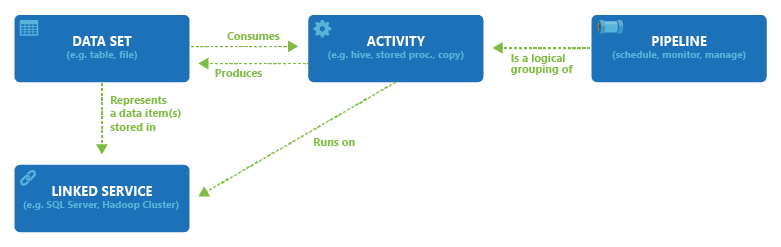

<properties 
    pageTitle="Présentation des données par défaut, un service d’intégration données | Microsoft Azure" 
    description="Découvrez les nouveautés de Azure Data Factory : un service d’intégration de données cloud qui orchestre et automatisation mouvement et transformation de données." 
    keywords="intégration de données, l’intégration des données cloud Nouveautés usine données azure"
    services="data-factory" 
    documentationCenter="" 
    authors="sharonlo101" 
    manager="jhubbard" 
    editor="monicar"/>

<tags 
    ms.service="data-factory" 
    ms.workload="data-services" 
    ms.tgt_pltfrm="na" 
    ms.devlang="na" 
    ms.topic="get-started-article" 
    ms.date="09/22/2016" 
    ms.author="shlo"/>

# Présentation du Service de Factory de données Azure, un service d’intégration de données dans le cloud

## Qu’est Azure Data Factory ? 
Données Factory est un service d’intégration de données sur le nuage qui orchestre et automatisation **déplacement** et **transformation** de données. Vous pouvez créer des solutions d’intégration de données au moyen du service de données par défaut qui peuvent acquisition de données de différentes banques de données, les données du processus/de transformation et publier les données de résultat pour les banques de données. 

Données usine service permet vous permettent de créer des pipelines de données qui se déplacent et transforment les données, puis exécutez les pipelines sur une planification spécifiée (toutes les heures, quotidienne, hebdomadaire, etc.). Il fournit également les visualisations enrichies pour afficher les dépendances entre vos pipelines de données et lignage et surveiller tous vos pipelines de données à partir d’une seule vue unifiée afin d’identifier facilement les problèmes et configurer la surveillance des alertes.

**figure 1.** Acquisition de données à partir de diverses sources de données, préparer, transformer et analyser les données et puis publier prêts à l’emploi des données pour la consommation.

## Pipelines et activités
Dans une solution Data Factory, vous créez un ou plusieurs données **pipelines**. Un pipeline est un regroupement logique des activités. Ils sont utilisés pour des activités de groupe en une seule unité ensemble d’exécuter une tâche. 

**Activités** définissez les actions à effectuer sur vos données. Par exemple, vous pouvez utiliser une activité copier pour copier des données à partir d’une banque de données vers une autre banque de données. De même, vous pouvez utiliser une activité Hive, qui s’exécute une requête Hive sur un cluster Azure HDInsight à transformer ou analyser vos données. Données usine prend en charge les deux types d’activités : activités de déplacement des données et des activités de transformation de données. 
  
## Activités de déplacement des données 
[AZURE.INCLUDE [data-factory-supported-data-stores](../../includes/data-factory-supported-data-stores.md)]

Consultez l’article des [Activités de déplacement des données](data-factory-data-movement-activities.md) pour plus d’informations. 

## Activités de transformation des données
[AZURE.INCLUDE [data-factory-transformation-activities](../../includes/data-factory-transformation-activities.md)]

Consultez l’article des [Activités de Transformation de données](data-factory-data-transformation-activities.md) pour plus d’informations.

Si vous voulez déplacer données vers ou à partir de des données stockent que copie activité ne prend en charge, ou transformer les données à l’aide de votre propre logique, créer une **activité .NET personnalisée**. Pour plus d’informations sur la création et à l’aide d’une activité personnalisée, voir [utiliser les activités personnalisées dans un pipeline Azure Data Factory](data-factory-use-custom-activities.md).

## Services liés
Les services liées définissent les informations nécessaires pour les données par défaut pour vous connecter à des ressources externes (exemples : stockage Azure, en local SQL Server, Azure HDInsight). Services liées sont utilisées pour deux raisons dans Data Factory :

- Pour représenter un **magasin de données** , y compris, mais sans limitation, un serveur SQL local, base de données Oracle, fichier partage ou un compte de stockage d’objets Blob Azure. Consultez la section [activités de déplacement des données](data-factory-data-movement-activities.md) pour une liste de banques de données prises en charge. 
- Pour représenter une **ressource de calcul** que vous pouvez héberger l’exécution d’une activité. Par exemple, l’activité HDInsightHive s’exécute sur un cluster HDInsight Hadoop. Consultez la section [activités de transformation de données](data-factory-data-transformation-activities.md) pour une liste des environnements cluster pris en charge. 

## Jeux de données 
Services liés lien banques de données à une usine de données Azure. Jeux de données représente les structures de données avec les banques de données. Par exemple, un service de stockage Azure lié fournit des informations de connexion de données par défaut pour vous connecter à un compte de stockage Azure. Un jeu de données Blob Azure Spécifie le conteneur blob et le dossier dans le stockage Blob Azure à partir de laquelle le pipeline doit lire les données. De même, un service SQL Azure lié fournit des informations de connexion pour une base de données SQL Azure et un jeu de données SQL Azure spécifie la table qui contient les données.   

## Relation entre des entités Data Factory
Données Factory comporte quelques entités clées qui fonctionnent ensemble pour définir d’entrée et sortie des données, traitement des événements et la planification et les ressources nécessaires pour exécuter le flux de données souhaité.

**Figure 2.** Relations entre le service Dataset, activité, Pipeline et lié

Avec les quatre concepts simples de services liés, les jeux de données, les activités et les pipelines, vous êtes prêt à commencer ! Vous pouvez [créer votre première pipeline](data-factory-build-your-first-pipeline.md). 

## Régions pris en charge
Pour l’instant, vous pouvez créer des références de données dans les régions **Ouest États-Unis**, **Extrême-Orient États-Unis**et **Europe du Nord** . Toutefois, une usine de données peut accéder aux banques de données et calculer des services dans les autres régions Azure pour déplacer des données entre banques de données ou le calculent des données de processus à l’aide de services. 

Azure Data Factory ne stocke pas toutes les données. Il vous permet de créer des flux de données par l’effort pour organiser le déplacement des données entre [pris en charge de banques de données](data-factory-data-movement-activities.md#supported-data-stores) et le traitement des données à l’aide de [services de calcul](data-factory-compute-linked-services.md) dans les autres régions ou dans un environnement local. Il vous permet également [surveiller et gérer des flux de travail](data-factory-monitor-manage-pipelines.md) à l’aide à la fois par programme et de l’interface utilisateur. 

Même si Azure Data Factory est disponible dans uniquement **États-Unis Ouest**, **US Extrême-Orient**et régions **d’Europe du Nord** , le service alimenter le déplacement des données dans les données par défaut est disponible [globalement](data-factory-data-movement-activities.md#global) dans plusieurs régions. En cas d’un magasin de données placé derrière un pare-feu puis une [Passerelle de gestion des données](data-factory-move-data-between-onprem-and-cloud.md) installés dans votre environnement local déplace les données à la place. 

Pour obtenir un exemple, supposons que votre environnement cluster comme un cluster Azure HDInsight d’apprentissage automatique Azure est insuffisant région Europe ouest. Vous pouvez créer et utiliser une instance Azure Data Factory en Europe du Nord et l’utiliser pour planifier des tâches sur votre environnement cluster dans Europe ouest. Il faut quelques millisecondes destinée aux données déclencher la tâche sur votre environnement cluster, mais la durée d’exécution de la tâche dans votre environnement informatique ne change pas.

Nous avons l’intention d’avoir Azure Data Factory dans toutes les zones géographiques pris en charge par Azure à l’avenir.
  
## Étapes suivantes
Pour apprendre à créer des références de données avec les pipelines de données, suivez les instructions détaillées dans les didacticiels suivants. 

Didacticiel | Description
-------- | -----------
[Créer un pipeline de données qui traite les données à l’aide de cluster Hadoop](data-factory-build-your-first-pipeline.md) | Dans ce didacticiel, vous créez votre première usine données Azure avec un pipeline de données **traite les données** à exécuter un script Hive sur un cluster Azure HDInsight (Hadoop). |
[Créer un pipeline de données pour déplacer des données entre deux banques de données du cloud](data-factory-copy-data-from-azure-blob-storage-to-sql-database.md) | Dans ce didacticiel, vous créez une usine de données avec un pipeline qui **déplace les données** depuis le stockage Blob de base de données SQL.
[Créer un pipeline de données pour déplacer des données entre un magasin de données en local et un magasin de données cloud à l’aide de la passerelle de gestion des données](data-factory-move-data-between-onprem-and-cloud.md) | Dans ce didacticiel, vous créez une usine de données avec un pipeline qui **déplace les données** à partir d’une base de données SQL Server **en local** vers un blob Azure. Dans le cadre de la procédure pas à pas, vous installez et configurez la passerelle de gestion des données sur votre ordinateur. 
