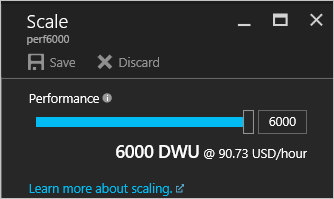
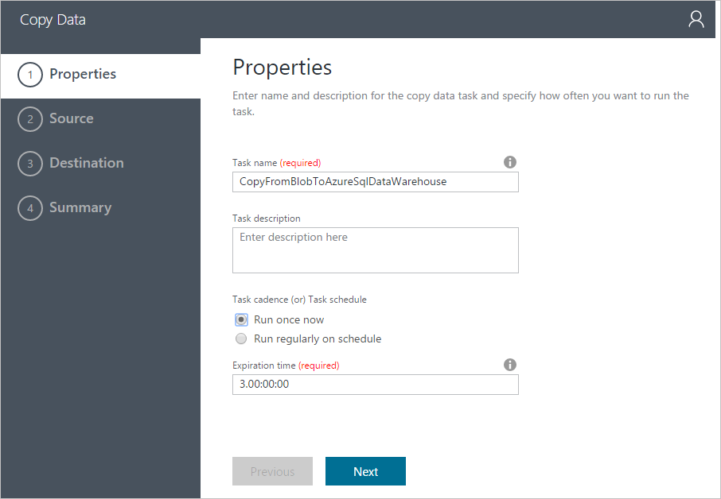
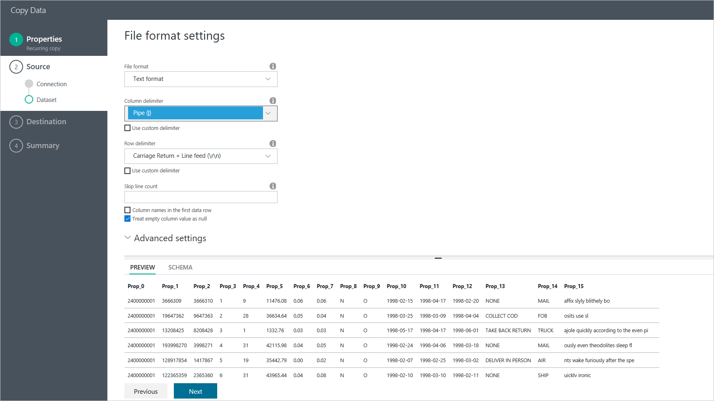
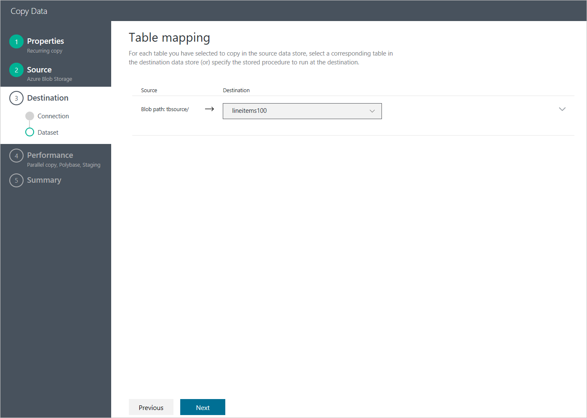

<properties 
    pageTitle="Charger to de données SQL Data Warehouse | Microsoft Azure" 
    description="Montre comment 1 To de données peuvent être chargée dans SQL Azure Data Warehouse sous 15 minutes avec une usine de données Azure" 
    services="data-factory" 
    documentationCenter="" 
    authors="linda33wj" 
    manager="jhubbard" 
    editor="monicar"/>

<tags 
    ms.service="data-factory" 
    ms.workload="data-services" 
    ms.tgt_pltfrm="na" 
    ms.devlang="na" 
    ms.topic="article" 
    ms.date="10/28/2016" 
    ms.author="jingwang"/>

# Charger 1 To dans SQL Azure Data Warehouse sous 15 minutes avec Azure Data Factory [Assistant copie]
[Magasin de données SQL Azure](../sql-data-warehouse/sql-data-warehouse-overview-what-is.md) est une base de données sur le nuage, horizontale capable de traiter les volumes importants de données, relationnelles et non relationnelles.  Data Warehouse SQL basé sur l’architecture de traitement hautement parallèle (MPP), est optimisé pour les charges de travail entrepôt enterprise données.  Il propose élasticité cloud grâce à la flexibilité à l’échelle de stockage et calculer séparément.

Prise en main Azure SQL Data Warehouse maintenant est plus simple que jamais **Azure Data Factory**.  Azure Data Factory est un service d’intégration de données entièrement gérée sur le nuage, qui peut être utilisé pour remplir une SQL Data Warehouse avec les données à partir de votre système existant et vous de gagner du temps lors de l’évaluation SQL Data Warehouse et vos solutions analytique par-dessus.  Voici les principaux avantages de charger les données à l’aide d’usine de données Azure Azure SQL Data Warehouse :

- **Facile à configurer**: 5-étape Assistant intuitif sans écriture de script obligatoire.
- **Prise en charge du magasin de données enrichies**: prise en charge intégrée pour un large éventail d’en local et banques de données sur le nuage.
- **Sécuriser et la conformité**: les données sont transférées sur HTTPS ou ExpressRoute et garantit la présence de service global vos données quittent jamais la limite géographique
- **Performances uniques à l’aide de PolyBase** – Polybase à l’aide d’est le plus efficacement possible pour déplacer des données dans Azure SQL Data Warehouse. Utilisation de la fonctionnalité d’objets blob intermédiaire, vous pouvez obtenir des vitesses de charge élevée à partir de tous les types de banques de données en plus de stockage Blob Azure, qui prend en charge la Polybase par défaut.

Cet article vous explique comment utiliser l’Assistant copie de données par défaut pour charger les données de 1 To de stockage d’objets Blob Azure dans SQL Azure Data Warehouse en sous 15 minutes, au plus 1,2 Go/s débit.

Cet article fournit des instructions détaillées pour le déplacement de données vers SQL Azure Data Warehouse à l’aide de l’Assistant copie. 

> [AZURE.NOTE] Voir [déplacer des données vers et depuis Data Warehouse Azure SQL Azure Data Factory à l’aide de](data-factory-azure-sql-data-warehouse-connector.md) l’article pour des informations générales sur les fonctionnalités de données Factory en déplaçant les données vers/à partir du magasin de données SQL Azure. 
> 
> Vous pouvez également créer des pipelines à l’aide du portail Azure, Visual Studio, PowerShell, etc.. Voir [didacticiel : copier des données d’objets Blob Azure à base de données SQL Azure](data-factory-copy-data-from-azure-blob-storage-to-sql-database.md) pour un bref aperçu des instructions détaillées pour l’utilisation de l’activité de copie dans Azure Data Factory.  

## Conditions préalables
- Stockage d’objets Blob Azure : cette expérience utilise Azure Blob Storage (GRS) pour le stockage dataset test TPC-H.  Si vous ne disposez pas d’un compte de stockage Azure, Découvrez [comment créer un compte de stockage](../storage/storage-create-storage-account.md#create-a-storage-account).
- Données [TPC-H](http://www.tpc.org/tpch/) : nous allons utiliser TPC-H comme le jeu de données de test.  Pour ce faire, vous devez utiliser `dbgen` à partir du Kit de ressources de TPC-H, qui vous permet de générer le dataset.  Vous pouvez télécharger le code source pour `dbgen` dans [Les outils TPC](http://www.tpc.org/tpc_documents_current_versions/current_specifications.asp) et compiler vous-même, ou téléchargez le fichier binaire compilé à partir de [GitHub](https://github.com/Azure/Azure-DataFactory/tree/master/Samples/TPCHTools).  Exécutez dbgen.exe avec les commandes suivantes pour générer un fichier plat 1 To pour `lineitem` table double entre 10 fichiers :
    - `Dbgen -s 1000 -S **1** -C 10 -T L -v`
    - `Dbgen -s 1000 -S **2** -C 10 -T L -v`
    - …
    - `Dbgen -s 1000 -S **10** -C 10 -T L -v` 

    Maintenant, copiez les fichiers générés au Blob Azure.  Reportez-vous au [déplacement des données vers et depuis un système de fichiers local à l’aide de Azure Data Factory](data-factory-onprem-file-system-connector.md) pour savoir comment procéder à l’aide de la copie de la définition d’application.   
- Magasin de données SQL Azure : cette expérience charge les données dans Azure SQL Data Warehouse créé avec 6 000 DWUs

    Pour obtenir des instructions détaillées sur la création d’une base de données SQL Data Warehouse, voir [créer un magasin de données SQL Azure](../sql-data-warehouse/sql-data-warehouse-get-started-provision/) .  Pour obtenir les meilleurs résultats de charge possibles dans SQL Data Warehouse à l’aide de Polybase, nous choisissez nombre maximal d’unités de magasin de données (DWUs) autorisés dans le paramètre de Performance, ce qui correspond à 6 000 DWUs.

    > [AZURE.NOTE] 
    > Lors du chargement d’objets Blob Azure, les performances de chargement de données sont directement proportionnelles au nombre de DWUs vous configurez sur le Data Warehouse SQL :
    > 
    > Chargement de 1 To dans 1 000 DWU SQL Data Warehouse ne récupère 87min (~ 200MBps débit) chargement de 1 To dans 2 000 DWU SQL Data Warehouse ne récupère 46min (~ 380MBps débit) chargement de 1 To dans 6 000 DWU SQL Data Warehouse ne récupère 14min (~1.2GBps débit) 

    Pour créer un Data Warehouse SQL avec 6 000 DWUs, déplacez le curseur de performances tout à fait à droite :

    

    Pour une base de données existante qui n’est pas configuré avec 6 000 DWUs, vous pouvez l’adapter à l’aide du portail Azure.  Accédez à la base de données dans le portail Azure, et il existe un bouton **échelle** dans le panneau de **vue d’ensemble** indiqué dans l’image suivante :

        

    Cliquez sur le bouton **échelle** pour ouvrir le volet suivant, déplacez le curseur à la valeur maximale, puis cliquez sur le bouton **Enregistrer** .

    
    
    Cette expérience charge les données dans SQL Azure Data Warehouse à l’aide `xlargerc` classe de ressource.

    Pour obtenir les meilleurs résultats possibles, copie doit être effectuée à l’aide d’un utilisateur SQL Data Warehouse appartenant à `xlargerc` classe de ressource.  Découvrez comment en suivante [Modifier un exemple de classe ressource utilisateur](../sql-data-warehouse/sql-data-warehouse-develop-concurrency.md#change-a-user-resource-class-example).  

- Créer schéma de table de destination dans la base de données SQL Azure Data Warehouse, en exécutant l’instruction DDL suivante :

        CREATE TABLE [dbo].[lineitem]
        (
            [L_ORDERKEY] [bigint] NOT NULL,
            [L_PARTKEY] [bigint] NOT NULL,
            [L_SUPPKEY] [bigint] NOT NULL,
            [L_LINENUMBER] [int] NOT NULL,
            [L_QUANTITY] [decimal](15, 2) NULL,
            [L_EXTENDEDPRICE] [decimal](15, 2) NULL,
            [L_DISCOUNT] [decimal](15, 2) NULL,
            [L_TAX] [decimal](15, 2) NULL,
            [L_RETURNFLAG] [char](1) NULL,
            [L_LINESTATUS] [char](1) NULL,
            [L_SHIPDATE] [date] NULL,
            [L_COMMITDATE] [date] NULL,
            [L_RECEIPTDATE] [date] NULL,
            [L_SHIPINSTRUCT] [char](25) NULL,
            [L_SHIPMODE] [char](10) NULL,
            [L_COMMENT] [varchar](44) NULL
        )
        WITH
        (
            DISTRIBUTION = ROUND_ROBIN,
            CLUSTERED COLUMNSTORE INDEX
        )

Les étapes préalables terminée, nous sommes maintenant prêts à configurer l’activité de copie à l’aide de l’Assistant copie.

## Lancez l’Assistant copie

1.  Connectez-vous au [portail Azure](https://portal.azure.com).
2.  Cliquez sur **+ Nouveau** à partir du coin supérieur gauche, cliquez sur **Intelligence + analytique**, puis cliquez sur **Data Factory**. 
6. Dans la carte **nouvelle factory de données** :
    1. Entrez **LoadIntoSQLDWDataFactory** pour le **nom**.
        Le nom de la factory données Azure doit être globalement unique. Si vous recevez l’erreur : **nom d’usine données « LoadIntoSQLDWDataFactory » n’est pas disponible**, modifiez le nom de la factory de données (par exemple, yournameLoadIntoSQLDWDataFactory) et essayez à nouveau de créer. Consultez la rubrique de [Données Factory - règles d’appellation](data-factory-naming-rules.md) pour les règles d’appellation pour les objets de données par défaut.  
     
    2. Sélectionnez votre **abonnement**Azure.
    3. Groupe de ressources, effectuez l’une des opérations suivantes : 
        1. Sélectionnez **utiliser existant** pour sélectionner un groupe de ressources existant.
        2. Sélectionnez **Créer nouveau** pour entrer un nom pour un groupe de ressources.
    3. Sélectionnez un **emplacement** pour le factory de données.
    4. Cochez **code confidentiel au tableau de bord** dans la partie inférieure de la carte.  
    5. Cliquez sur **créer**.
10. Une fois la création terminée, vous voyez la carte de **Données usine** comme le montre l’image suivante :

    
11. Sur la page d’accueil par défaut de données, cliquez sur la vignette de **copier des données** pour lancer **l’Assistant copie**. 

    > [AZURE.NOTE] Si vous voyez que le navigateur web est bloqué sur « Autorisation... », désactiver/désactivez le paramètre de **bloquer les cookies tiers et données d’un site** (ou) conserver activé et créer une exception pour **login.microsoftonline.com** et puis réessayez de démarrer l’Assistant à nouveau.

## Étape 1 : Configurer la planification de chargement des données
La première étape consiste à configurer les planification de chargement des données.  

Dans la page **Propriétés** :
1. Entrez **CopyFromBlobToAzureSqlDataWarehouse** pour **nom de la tâche**
2. L’option **exécuter une seule fois maintenant** .   
3. Cliquez sur **suivant**.  

## Étape 2 : Configurer les sources
Cette section décrit les étapes pour configurer la source : Blob Azure qui contient la ligne TB TPC-H 1 élément fichiers.

Sélectionnez le **Stockage d’objets Blob Azure** comme les données stockent et cliquez sur **suivant**.

Renseignez les informations de connexion pour le compte de stockage Blob Azure, puis cliquez sur **suivant**.

Choisissez le **dossier** contenant les fichiers de ligne TPC-H, puis cliquez sur **suivant**.

Après avoir cliqué sur **suivant**, les paramètres de format de fichier sont détectés automatiquement.  Assurez-vous que le séparateur de cette colonne est « | « au lieu de la virgule par défaut','.  Une fois que vous avez affiché un aperçu de données, cliquez sur **suivant** .

## Étape 3 : Configuration de destination
Cette section décrit comment configurer la destination : `lineitem` table dans la base de données SQL Azure Data Warehouse.

Choisissez **Azure SQL Data Warehouse** comme la banque de destination, puis cliquez sur **suivant**.

Renseignez les informations de connexion pour Azure SQL Data Warehouse.  Vérifiez que vous spécifiez l’utilisateur est membre du rôle `xlargerc` (voir la section **conditions préalables** pour obtenir des instructions détaillées), puis cliquez sur **suivant**. 

Choisissez la table de destination, puis cliquez sur **suivant**.

Acceptez les paramètres par défaut pour le mappage de colonne et cliquez sur **suivant**.

## Étape 4 : Paramètres des performances

**Autoriser polybase** est activée par défaut.  Cliquez sur **suivant**.

## Étape 5 : Déployer et surveiller les résultats de charge
Cliquez sur **Terminer** pour déployer. 

Une fois le déploiement est terminé, cliquez sur `Click here to monitor copy pipeline` pour contrôler la copie exécutée l’avancement.

Sélectionner le pipeline de copie que vous avez créé dans la liste **Activité Windows** .

Vous pouvez afficher la copie de détails de l’exécution dans l' **Explorateur Windows activité** dans le volet de droite, y compris le volume de données lues à partir de la source et écrites dans destination, durée et le débit moyen de l’exécution.

Comme vous pouvez le constater à partir de l’écran suivant, copiez 1 To de stockage d’objets Blob Azure vers SQL Data Warehouse a eu 14 minutes, atteindre efficacement 1,22 débit Go/s !

## Meilleures pratiques
Voici quelques recommandations pour votre base de données SQL Azure Data Warehouse en cours d’exécution :

- Utiliser une grande classe ressource lors du chargement dans un INDEX COLUMNSTORE groupé.
- Pour les jointures plus efficaces, envisagez d’utiliser distribution hachage par sélectionner la colonne à la place par défaut arrondir robin distribution.
- Pour des vitesses de chargement plus rapides, vous pouvez utiliser segment pour les données transitoires.
- Créer des statistiques une fois que vous avez terminé de chargement de magasin de données SQL Azure.

Pour plus d’informations, voir [meilleures pratiques pour le magasin de données SQL Azure](../sql-data-warehouse/sql-data-warehouse-best-practices.md) . 

## Étapes suivantes
- [Assistant de copie de données usine](data-factory-copy-wizard.md) - cet article fournit des détails sur l’Assistant copie. 
- [Activité de copie de guide de performances et réglage](data-factory-copy-activity-performance.md) - cet article contient les mesures de performances de référence et guide de réglage.

