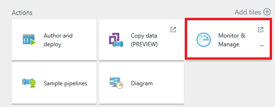
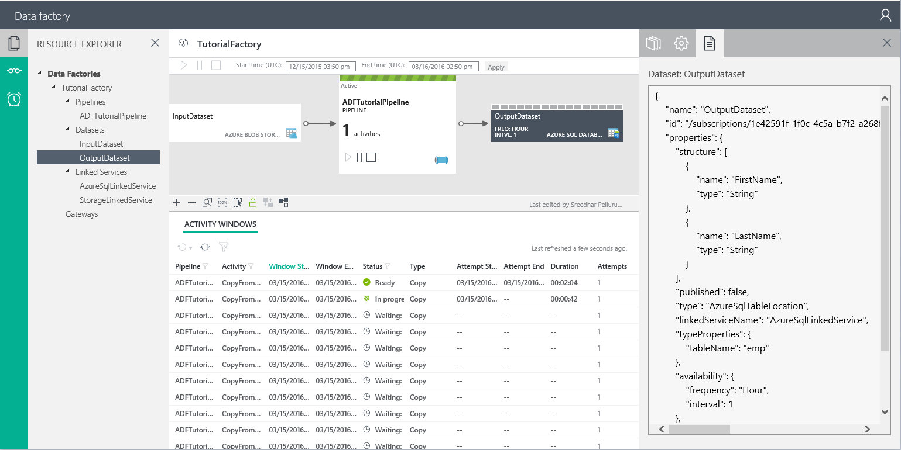
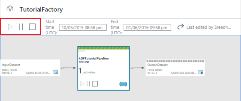
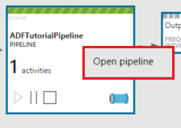
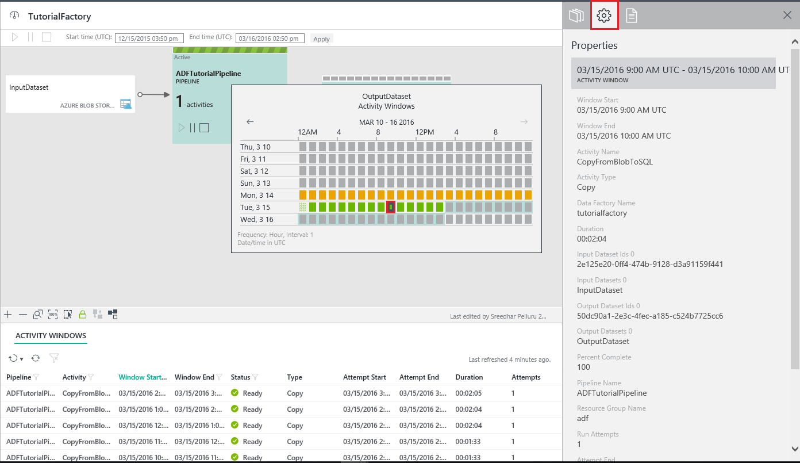
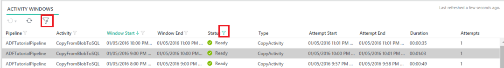
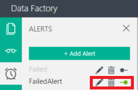

<properties 
    pageTitle="Surveiller et gérer les pipelines Azure Data Factory" 
    description="Découvrez comment utiliser de surveillance et d’application de gestion pour surveiller et gérer les pipelines et les références de données Azure." 
    services="data-factory" 
    documentationCenter="" 
    authors="spelluru" 
    manager="jhubbard" 
    editor="monicar"/>

<tags 
    ms.service="data-factory" 
    ms.workload="data-services" 
    ms.tgt_pltfrm="na" 
    ms.devlang="na" 
    ms.topic="article" 
    ms.date="09/06/2016" 
    ms.author="spelluru"/>

# Surveiller et gérer les pipelines Azure Data Factory à l’aide de nouveaux de surveillance et d’application de gestion
> [AZURE.SELECTOR]
- [À l’aide de PowerShell portail/Azure Azure](data-factory-monitor-manage-pipelines.md)
- [À l’aide de surveillance et d’application de gestion](data-factory-monitor-manage-app.md)

Cet article décrit comment contrôler, gérer et déboguer vos pipelines et créer des alertes pour recevoir une notification concernant les échecs à l’aide **de surveillance et d’application de gestion**. Vous pouvez également visionner la vidéo suivante pour en savoir plus sur l’utilisation de la surveillance et application de gestion.
   

> [AZURE.VIDEO azure-data-factory-monitoring-and-managing-big-data-piplines]
      
## Lancer la surveillance et gestion App un
Pour lancer le moniteur et l’application de gestion, cliquez sur **analyse et gérer** vignette sur la carte de **Données par défaut** pour votre usine de données.

 

Vous devriez voir que le suivi et application de gestion des lancement dans une onglet/une fenêtre séparée.  

> [AZURE.NOTE] Si vous voyez que le navigateur web est bloqué sur « Autorisation... », désactiver/désactivez le paramètre de **bloquer les cookies tiers et données d’un site** (ou) conserver activé et créer une exception pour **login.microsoftonline.com** et puis réessayez de démarrer l’application à nouveau.

Si vous ne voyez pas windows activité dans la liste en bas, cliquez sur le bouton **Actualiser** dans la barre d’outils pour actualiser la liste. En outre, définissez les valeurs correctes pour les filtres de **l’heure de début** et **heure de fin** .  

## Comprendre la surveillance et l’application de gestion
Il existe trois onglets (**Explorateur des ressources**, **Affichages de surveillance**et **d’alertes**) sur la gauche, le premier onglet (Explorateur des ressources) est activée par défaut. 

### Explorateur de ressources
Vous consultez les rubriques suivantes : 

- Ressource Explorer **arborescence** dans le volet gauche.
- **Vue de diagramme** dans la partie supérieure.
- Liste **d’Activité Windows** en bas dans le volet central.
- **Propriétés**/onglets de**l’Explorateur de fenêtre activité** dans le volet droit. 

Dans l’Explorateur de ressources, vous voyez toutes les ressources (pipelines, jeux de données, des services liées) dans le factory de données dans une arborescence. Lorsque vous sélectionnez un objet dans l’Explorateur de ressources, vous remarquez les éléments suivants : 

- entité Data Factory associée est mis en surbrillance dans la vue de diagramme.
- associé à windows activité (cliquez [ici](data-factory-scheduling-and-execution.md) pour en savoir plus sur windows activité) sont mis en surbrillance dans la liste activité Windows en bas.  
- propriétés de l’objet sélectionné dans la fenêtre de propriétés dans le volet droit. 
- Définition de JSON de l’objet sélectionné, le cas échéant. Par exemple : un service lié ou un jeu de données ou un pipeline. 

Consultez [planification et l’exécution de](data-factory-scheduling-and-execution.md) l’article pour plus d’informations sur la fenêtre d’activité. 

### Vue de diagramme
La vue de diagramme d’une usine de données fournit un seul volet de verre pour surveiller et gérer le factory de données et ses actifs. Lorsque vous sélectionnez une entité Data Factory (dataset/pipeline) dans la vue de diagramme, vous remarquez les éléments suivants :
 
- l’entité de factory de données est sélectionnée dans l’arborescence
- windows activité associée sont mis en surbrillance dans la liste activité Windows.
- propriétés de l’objet sélectionné dans la fenêtre Propriétés

Lorsque le pipeline est activé (et non dans l’état suspendu), indiqué par une ligne verte. 

Vous remarquerez qu’il existe trois boutons de commande pour le pipeline de la vue de diagramme. Vous pouvez utiliser le deuxième bouton pour interrompre le pipeline. La pause ne pas mettre fin aux activités en cours d’exécution et lui permettre de continue jusqu'à la fin. Bouton troisième s’interrompt le pipeline et termine son l’exécution d’activités existantes. Bouton première reprend le pipeline. Lorsque votre pipeline est suspendue, vous remarquez la modification de la couleur pour le pipeline de mosaïque comme suit.

Vous pouvez sélectionner plusieurs deux ou plusieurs pipelines (à l’aide de CTRL) et utilisez les boutons de barre de commande pour suspendre/reprendre plusieurs pipelines à la fois.

Vous pouvez voir toutes les activités dans le pipeline, par clic droit sur la vignette pipeline, puis cliquez sur **Ouvrir pipeline**.

Dans le pipeline ouvert, vous voyez toutes les activités dans le pipeline. Dans cet exemple, vous trouverez qu’une seule activité : activité de copie. Pour revenir à la vue précédente, cliquez sur nom d’usine de données dans le menu de navigation en haut.

Dans le pipeline, lorsque vous cliquez sur un jeu de données de sortie ou lorsque vous déplacez votre souris sur le jeu de données de sortie, vous voyez la fenêtre contextuelle activité Windows pour ce jeu de données.

Vous pouvez cliquer sur une fenêtre d’activité pour afficher des détails de celui-ci dans la fenêtre de **Propriétés** dans le volet droit. 

Dans le volet droit, basculez vers onglet **Activité fenêtre Explorateur** pour afficher plus de détails.

 

Vous remarquiez **résolu variables** pour chaque série d’activité essayez dans la section **tentatives** . 

Basculer vers l’onglet **Script** examiner la définition de script JSON pour l’objet sélectionné.   

Vous pouvez voir windows activité dans trois emplacements :

- Activité Windows la fenêtre contextuelle dans la vue de diagramme (volet central).
- Explorateur de fenêtre activité dans le volet droit.
- Liste des activités Windows dans le volet inférieur.

Dans l’activité Windows contextuel et activité fenêtre Explorer, vous pouvez faire défiler à la semaine précédente et semaine suivante en utilisant les flèches gauche et droite.

En bas de la vue de diagramme, vous voyez les boutons pour effectuer un Zoom dans, Zoom arrière, Zoom pour ajuster, effectuer un Zoom 100 %, verrouiller mise en page. Bouton disposition verrouillage vous empêche de déplacer accidentellement des tables et des pipelines dans la vue de diagramme et est activé par défaut. Vous pouvez désactiver cette option et entités se déplacer dans le diagramme. Lorsque vous désactivez, vous pouvez utiliser le bouton en dernier pour positionner automatiquement les tables et les pipelines. Vous pouvez également effectuer un Zoom / Zoom arrière à l’aide de la roulette de la souris.

### Liste des activités Windows
La liste de windows activité dans la partie inférieure du volet central affiche toutes les fenêtres activité du groupe de données que vous avez sélectionné dans l’Explorateur de ressource ou d’une vue de diagramme. Par défaut, la liste se trouve dans l’ordre décroissant, ce qui signifie que vous voyez la dernière fenêtre d’activité en haut. 

Cette liste ne pas actualiser automatiquement, afin d’utiliser le bouton Actualiser dans la barre d’outils pour actualiser manuellement.  

Les fenêtres activité peuvent être dans un des statuts suivants :

<table>
<tr>
    <th align="left">État</th><th align="left">Sous-état</th><th align="left">Description</th>
</tr>
<tr>
    <td rowspan="8">En attente</td><td>ScheduleTime</td><td>L’heure n’a pas encore de la fenêtre d’activité à exécuter.</td>
</tr>
<tr>
<td>DatasetDependencies</td><td>Les dépendances en amont n’êtes pas prêts.</td>
</tr>
<tr>
<td>ComputeResources</td><td>Les ressources cluster ne sont pas disponibles.</td>
</tr>
<tr>
<td>ConcurrencyLimit</td> <td>Toutes les instances d’activité sont en cours d’exécution autres fenêtres activité occupé (e).</td>
</tr>
<tr>
<td>ActivityResume</td><td>Activité est suspendue et ne pouvez pas exécuter les fenêtres activité jusqu'à ce qu’il soit repris.</td>
</tr>
<tr>
<td>Nouvelles tentatives</td><td>L’exécution des activités est retentée.</td>
</tr>
<tr>
<td>Validation</td><td>Validation n’a pas encore commencé.</td>
</tr>
<tr>
<td>ValidationRetry</td><td>En attente de validation pour de nouvelles tentatives.</td>
</tr>
<tr>
<tr
<td rowspan="2">InProgress</td><td>Validation</td><td>Validation en cours.</td>
</tr>
<td></td>
<td>La fenêtre d’activité est en cours de traitement.</td>
</tr>
<tr>
<td rowspan="4">A échoué</td><td>Avec délai dépassé</td><td>L’exécution a eu plus longue que ce qui est autorisé par l’activité.</td>
</tr>
<tr>
<td>Annulé</td><td>Annulé par l’utilisateur.</td>
</tr>
<tr>
<td>Validation</td><td>Échec de la validation.</td>
</tr>
<tr>
<td></td><td>Échec de générer et/ou valider la fenêtre d’activité.</td>
</tr>
<td>Prêt</td><td></td><td>La fenêtre activité est prête à la consommation.</td>
</tr>
<tr>
<td>Ignorés</td><td></td><td>La fenêtre d’activité n’est pas traitée.</td>
</tr>
<tr>
<td>Aucun</td><td></td><td>Une fenêtre d’activité utilisée pour existe avec un autre statut, mais a été réinitialisée.</td>
</tr>
</table>

Lorsque vous cliquez sur une fenêtre de l’activité dans la liste, vous afficher les détails dans **L’Explorateur Windows activité** ou **Propriétés de la** fenêtre sur la droite.

### Actualiser windows activité  
Les détails ne sont pas automatiquement actualisées, afin de le réutiliser **Actualiser** bouton (deuxième) dans la barre de commande pour actualiser manuellement la liste des activités windows.  
 

### Fenêtre Propriétés
La fenêtre Propriétés est dans le volet de la plus à droite de l’application de gestion et de surveillance. 

Il affiche les propriétés de l’élément sélectionné dans l’Explorateur de ressources (arborescence) (ou) diagramme affichage (ou) liste des activités windows. 

### Activité fenêtre Explorer

La fenêtre **Explorateur de fenêtre activité** est dans le volet de la plus à droite de la surveillance et d’application de gestion. Il affiche plus d’informations sur la fenêtre d’activité que vous avez sélectionné dans la liste de Windows activité ou activité Windows contextuel. 

Vous pouvez basculer vers une autre fenêtre activité en cliquant dessus dans la vue calendrier en haut. Vous pouvez également utiliser la **flèche vers la gauche**/boutons**flèche vers la droite** en haut pour afficher windows activité du précédent/semaine prochaine.

Vous pouvez utiliser les boutons de barre d’outils dans le volet inférieur **exécutez à nouveau** la fenêtre d’activité ou **Actualiser** les détails dans le volet. 

### Script 
Vous pouvez utiliser l’onglet **Script** pour afficher la définition JSON de l’entité de données par défaut sélectionnée (service liée, dataset et pipeline). 

## Utilisation d’affichages système
Le suivi et application de gestion comprend des vues système prédéfinies (**windows activité récentes**, **Échec activité windows**, **Windows activité en cours**) qui vous permet d’afficher les fenêtres activité récentes/échec/en cours pour votre usine de données. 

Basculez vers l’onglet **Vues de l’analyse** de la gauche en cliquant dessus. 

Pour l’instant, il existe trois affichages système pris en charge. Sélectionnez une option pour voir windows activité récente (ou) activité échec windows (ou) windows activité en cours dans la liste activité Windows (en bas du volet central). 

Lorsque vous sélectionnez option **récente activité windows** , vous voyez toutes les fenêtres activité récentes dans l’ordre décroissant de **dernière tentative heure**. 

Vous pouvez utiliser l’affichage **Échec activité windows** pour voir toutes les fenêtres activité échec dans la liste. Sélectionner une fenêtre activité échec dans la liste pour afficher les détails dans les **Propriétés de la** fenêtre (ou) **Activité fenêtre Explorateur**. Vous pouvez également télécharger les journaux d’une fenêtre d’activité a échoué. 

## Tri et filtrage windows activité
Modifier les paramètres de **début** et **heure de fin** dans la barre de commandes filtre activité Windows. Après avoir modifié l’heure de début et heure de fin, cliquez sur le bouton en regard de l’heure de fin pour actualiser la liste activité Windows.

> [AZURE.NOTE] Pour l’instant, toutes les heures sont au format UTC dans la surveillance et d’application de gestion. 

Dans la **liste activité Windows**, cliquez sur le nom d’une colonne (par exemple : état). 

Vous pouvez effectuer les opérations suivantes :

- Effectuez un tri dans l’ordre croissant.
- Effectuez un tri dans l’ordre décroissant.
- Filtrer par une ou plusieurs valeurs (prêt, en attente, etc.)

Lorsque vous spécifiez un filtre sur une colonne, vous voyez le bouton Filtre activé pour cette colonne indiquer que les valeurs de la colonne sont des valeurs filtrées. 

Vous pouvez utiliser la même fenêtre contextuelle pour effacer les filtres. Pour effacer tous les filtres de la liste des activités windows, cliquez sur le bouton Effacer le filtre dans la barre de commandes. 

## Effectuer les opérations du lot

### Exécutez à nouveau windows activité sélectionnée
Sélectionnez une fenêtre d’activité, cliquez sur la flèche vers le bas pour le premier bouton de barre de commande et sélectionnez **réexécuter** / **réexécuter avec en amont dans le pipeline**. Lorsque vous sélectionnez option **réexécuter avec en amont dans le pipeline** , il exécute à nouveau toutes les fenêtres activités en amont également. 
    

Vous pouvez également sélectionner plusieurs fenêtres activité dans la liste et les réexécuter en même temps. Vous souhaiterez peut-être filtrer windows activité en fonction de l’état (par exemple : **Échec**), puis réexécutez les fenêtres activité échec après avoir corrigé le problème dans lequel les fenêtres activité échec. Consultez la section suivante pour plus d’informations sur le filtrage des fenêtres d’activité dans la liste.  

### Suspendre/reprendre plusieurs pipelines
Vous pouvez sélectionner plusieurs deux ou plusieurs pipelines (à l’aide de CTRL) et utilisez les boutons de barre de commande (mis en surbrillance dans un rectangle rouge dans l’image ci-dessous) pour suspendre/reprendre les à la fois.

## Créer des alertes 
La page alertes vous permet de créer une alerte, afficher/modifier/supprimer toutes les alertes existantes. Vous pouvez également activer/désactiver une alerte. Pour afficher la page alertes, cliquez sur l’onglet Alertes.

### Pour créer une alerte

1. Cliquez sur **Ajouter une alerte** pour ajouter une alerte. Vous consultez la page de détails. 

    
1. Spécifiez le **nom** et la **description** de l’alerte, puis cliquez sur **suivant**. Vous devez voir la page de **filtres** .

    

2. Sélectionnez **l’événement**, **l’état**et **sous-état** (facultatif) sur lequel vous souhaitez que le service Data Factory des alertes, puis cliquez sur **suivant**. Vous devez voir la page de **destinataires** .

     
3. Sélectionnez **messagerie abonnement administrateurs** option et/ou entrez **messagerie de l’administrateur supplémentaires**, puis cliquez sur **Terminer**. Vous devriez voir l’alerte dans la liste. 
    
    

Dans la liste des alertes, utilisez les boutons associés à l’alerte à modifier/supprimer/activer/désactiver une alerte. 

### Événement/état/sous-état
Le tableau suivant fournit la liste des événements disponibles et statuts (et sous-états).

Nom de l’événement | État | Statut secondaire
-------------- | ------ | ----------
Activité exécutée mise en route | Mise en route | Démarrage
Activité exécutée terminée | A réussi. | A réussi. 
Activité exécutée terminée | A échoué| Allocation des ressources a échoué  Échec de l’exécution  Dépassé  Échec de la Validation  Abandonnées
À la demande HDI Cluster créer mise en route | Mise en route | &nbsp; |
À la demande HDI Cluster créé avec succès | A réussi. | &nbsp; |
À la demande HDI Cluster supprimé | A réussi. | &nbsp; |
### Pour modifier/supprimer/désactiver une alerte

    
 

