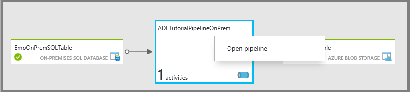
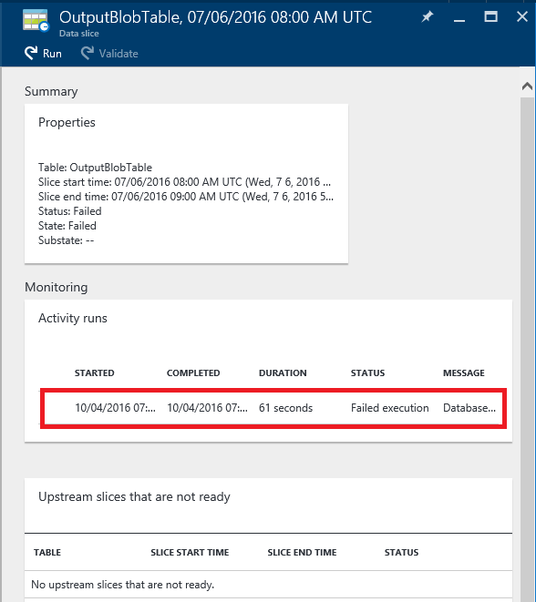
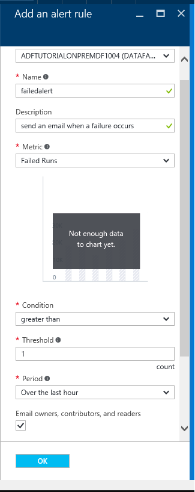

<properties 
    pageTitle="Surveiller et gérer les pipelines Azure Data Factory" 
    description="Découvrez comment utiliser Azure Portal et Azure PowerShell pour surveiller et gérer des références de données Azure et pipelines que vous avez créé." 
    services="data-factory" 
    documentationCenter="" 
    authors="spelluru" 
    manager="jhubbard" 
    editor="monicar"/>

<tags 
    ms.service="data-factory" 
    ms.workload="data-services" 
    ms.tgt_pltfrm="na" 
    ms.devlang="na" 
    ms.topic="article" 
    ms.date="09/06/2016" 
    ms.author="spelluru"/>

# Surveiller et gérer les pipelines Azure Data Factory
> [AZURE.SELECTOR]
- [À l’aide du portail/Azure Azure PowerShell](data-factory-monitor-manage-pipelines.md)
- [À l’aide de surveillance et d’application de gestion](data-factory-monitor-manage-app.md)

Le service de données par défaut fournit une vue fiable et complète de vos services de mouvement stockage, le traitement et données. Le service vous donne un contrôle vous permet de tableau de bord que vous pouvez utiliser pour effectuer les tâches suivantes : 

- Évaluer rapidement les données de bout en bout pipeline santé.
- Identifier les problèmes et prendre des mesures verres si nécessaire. 
- Lignage des données de suivi. 
- Effectuer le suivi des relations entre vos données sur un de vos sources.
- Comptabilité complète historique de vue de l’exécution du travail, l’intégrité du système et les dépendances.

Cet article décrit comment contrôler, gérer et déboguer vos pipelines. Il fournit également des informations sur la façon de créer des alertes et être informé à partir de panne.

## Comprendre les pipelines et états d’activité
À l’aide du portail Azure, vous pouvez :

- Afficher votre usine de données sous la forme d’un diagramme
- Afficher les activités dans un pipeline
- Afficher des jeux de données d’entrée et de sortie
- et bien plus encore. 

Cette section fournit également la façon dont un secteur passe d’un état à un autre état.   

### Accédez à votre usine de données
1.  Connectez-vous au [portail Azure](https://portal.azure.com).
2.  Dans le menu de gauche, cliquez sur **références de données** . Si vous ne voyez pas le, cliquez sur **plusieurs services >** et cliquez sur **références de données** sous catégorie **INTELLIGENCE + les données d’analyse** . 

    

    Vous devriez voir toutes les références de données dans la carte de **références de données** . 
4. Dans la carte de références de données, sélectionnez le factory de données que qui vous intéresse.

      
5.  et vous devez voir la page d’accueil (carte**factory de données** ) pour le factory de données.

    

#### Vue de diagramme de votre usine de données
La vue de diagramme d’une usine de données fournit un seul volet de verre pour surveiller et gérer le factory de données et ses actifs.

Pour afficher la vue de diagramme de votre usine de données, cliquez sur **diagramme** dans la page d’accueil par défaut des données.

Vous pouvez effectuer un zoom sur, effectuer un zoom arrière, zoom pour ajuster, effectuer un zoom à 100 %, verrouiller la mise en page du diagramme et positionner automatiquement pipelines et des tables. Vous pouvez également consulter les informations de lignage des données (afficher les éléments en amont et en aval des éléments sélectionnés).
 

### Activités au sein d’une opportunité 
1. Le pipeline d’avec le bouton droit, puis cliquez sur **pipeline ouvert** pour afficher toutes les activités dans le pipeline ainsi que des jeux de données d’entrée et de sortie pour les activités. Cette fonctionnalité est utile lorsque votre pipeline comprend plusieurs activités et que vous voulez comprendre le fonctionnement lignage d’un seul pipeline.

      
2. Dans l’exemple suivant, vous voyez deux activités dans le pipeline avec leurs entrées et les sorties. L’activité intitulée **JoinData** de type HDInsight ruche activité et **EgressDataAzure** de type activité copie se trouvent dans ce pipeline exemple. 
    
     
3. Vous pouvez accéder à page d’accueil par défaut des données en cliquant sur le lien données par défaut dans la barre de navigation dans le coin supérieur gauche.

    

### État d’affichage de chaque activité à l’intérieur d’une opportunité
Vous pouvez afficher l’état actuel d’une activité en affichant l’état d’un des jeux de données générés par l’activité. 

Par exemple : dans l’exemple suivant, la **BlobPartitionHiveActivity** a été correctement exécuté et produit un dataset nommé **PartitionedProductsUsageTable**, qui se trouve dans l’état **prêt** .

En double-cliquant sur **PartitionedProductsUsageTable** dans l’affichage tâches présente tous les secteurs obtenus par différents activité s’exécute à l’intérieur d’une opportunité. Vous constatez que l' **BlobPartitionHiveActivity** a été correctement exécuté chaque mois pour derniers huit mois et produit les secteurs dans l’état **prêt** .

Les secteurs dataset d’usine de données peuvent avoir un des statuts suivants :

<table>
<tr>
    <th align="left">État</th><th align="left">Sous-état</th><th align="left">Description</th>
</tr>
<tr>
    <td rowspan="8">En attente</td><td>ScheduleTime</td><td>L’heure n’a pas encore pour le secteur à exécuter.</td>
</tr>
<tr>
<td>DatasetDependencies</td><td>Les dépendances en amont n’êtes pas prêts.</td>
</tr>
<tr>
<td>ComputeResources</td><td>Les ressources cluster ne sont pas disponibles.</td>
</tr>
<tr>
<td>ConcurrencyLimit</td> <td>Toutes les instances d’activité sont en cours d’exécution autres secteurs occupé (e).</td>
</tr>
<tr>
<td>ActivityResume</td><td>Activité est suspendue et ne pouvez pas exécuter les secteurs jusqu'à ce qu’il soit repris.</td>
</tr>
<tr>
<td>Nouvelles tentatives</td><td>L’exécution des activités est retentée.</td>
</tr>
<tr>
<td>Validation</td><td>Validation n’a pas encore commencé.</td>
</tr>
<tr>
<td>ValidationRetry</td><td>En attente de validation pour de nouvelles tentatives.</td>
</tr>
<tr>
<tr
<td rowspan="2">InProgress</td><td>Validation</td><td>Validation en cours.</td>
</tr>
<td></td>
<td>Le secteur est en cours de traitement.</td>
</tr>
<tr>
<td rowspan="4">A échoué</td><td>Avec délai dépassé</td><td>L’exécution a eu plus longue que ce qui est autorisé par l’activité.</td>
</tr>
<tr>
<td>Annulé</td><td>Annulé par l’utilisateur.</td>
</tr>
<tr>
<td>Validation</td><td>Échec de la validation.</td>
</tr>
<tr>
<td></td><td>Échec de générer et/ou valider le secteur.</td>
</tr>
<td>Prêt</td><td></td><td>Le secteur est prêt à la consommation.</td>
</tr>
<tr>
<td>Ignorés</td><td></td><td>Le secteur n’est pas traité.</td>
</tr>
<tr>
<td>Aucun</td><td></td><td>Un secteur qui permet d’existe avec un autre statut, mais a été réinitialisé.</td>
</tr>
</table>

Vous pouvez afficher des détails sur un secteur en cliquant sur une entrée de secteur dans la carte **Récemment les secteurs mis à jour** .

 
Si le secteur a été exécuté à plusieurs reprises, vous obtiendrez plusieurs lignes dans la liste **activité s’exécute** . Vous pouvez afficher des détails sur une activité exécuter en cliquant sur l’entrée exécuter dans la liste **Qu'activité s’exécute** . La liste affiche tous les fichiers journaux ainsi qu’un message d’erreur, le cas échéant. Cette fonctionnalité est utile pour afficher et journaux de débogage sans avoir à quitter votre usine de données.

Si le secteur n’est pas dans l’état **prêt** , vous pouvez voir les secteurs en amont qui ne sont pas prêt et bloquent le secteur en cours d’exécution dans la liste **des secteurs en amont qui ne sont pas prêtes** . Cette fonctionnalité est utile lorsque votre secteur est à l’état **en attente** et que vous voulez comprendre les dépendances en amont sur lequel se trouve le secteur.

### Diagramme d’état du jeu de données
Une fois que vous déployez une usine de données et les pipelines ont une période active valide, le jeu de données découpe transition à partir d’un état à un autre. Actuellement l’état secteur suit le diagramme d’état suivants :

Le flux de transition d’état dataset dans usine de données : en attente -> dans l’avancement/en cours (validation) -> prêt/Échec

Les secteurs démarrent dans un état **en attente** pour les conditions préalables à respecter avant d’exécuter. Ensuite, l’activité commence à s’exécuter et le secteur se trouvent dans l’état **En cours** . L’exécution de l’activité peut-être réussir ou échouer. Le secteur est marqué comme **prêt**» ou **Échec** en fonction du résultat de l’exécution. 

Vous pouvez réinitialiser le secteur pour revenir en arrière à partir de l’état **prêt** ou **Échec** à l’état **en attente** . Vous pouvez également indiquer le secteur de l’état à **sauter**, qui empêche l’exécution de l’activité et pas traiter le secteur.

## Gérer les pipelines
Vous pouvez gérer vos pipelines à l’aide de PowerShell Azure. Par exemple, vous pouvez suspendre et reprendre pipelines en exécutant les applets de commande PowerShell Azure. 

### Interrompre et reprendre pipelines
Vous pouvez pause/suspendre pipelines à l’aide de l’applet de commande Powershell **Suspension AzureRmDataFactoryPipeline** . Cette applet de commande est utile lorsque vous ne voulez pas exécuter vos pipelines jusqu'à ce qu’un problème est résolu.

Par exemple : dans l’écran suivant, un problème a été identifié avec **PartitionProductsUsagePipeline** dans usine de données **productrecgamalbox1dev** et nous voulons suspendre le pipeline de.

Pour suspendre un pipeline, exécutez la commande PowerShell suivante :

    Suspend-AzureRmDataFactoryPipeline [-ResourceGroupName] <String> [-DataFactoryName] <String> [-Name] <String>

Par exemple :

    Suspend-AzureRmDataFactoryPipeline -ResourceGroupName ADF -DataFactoryName productrecgamalbox1dev -Name PartitionProductsUsagePipeline 

Une fois que le problème a été résolu avec la **PartitionProductsUsagePipeline**, le pipeline suspendu peut reprendre en exécutant la commande PowerShell suivante :

    Resume-AzureRmDataFactoryPipeline [-ResourceGroupName] <String> [-DataFactoryName] <String> [-Name] <String>

Par exemple :

    Resume-AzureRmDataFactoryPipeline -ResourceGroupName ADF -DataFactoryName productrecgamalbox1dev -Name PartitionProductsUsagePipeline 

## Déboguer pipelines
Azure Data Factory fournit les fonctionnalités enrichies via le portail Azure et Azure PowerShell à déboguer et résoudre les problèmes de canalisations.

### Rechercher des erreurs dans une opportunité
Cas d’échec de l’exécution de l’activité dans un pipeline, le dataset obtenu par le pipeline est dans un état d’erreur en raison de l’échec. Vous pouvez déboguer et résoudre les erreurs dans Azure Data Factory en utilisant les mécanismes suivants.

#### Utiliser portail Azure débogage d’un message d’erreur :

3.  Dans la carte de la **TABLE** , cliquez sur le secteur problème avec le **statut** défini sur **Échec**.

    
4.  Dans la carte de **Données secteur** , cliquez sur l’activité exécutée qui a échoué.
    
    
5.  Dans la carte de **Détails de la série activité** , vous pouvez télécharger les fichiers associés avec le traitement HDInsight. Cliquez sur Télécharger pour état/stderr à télécharger le fichier journal des erreurs qui contient plus d’informations sur l’erreur.

      

#### Utiliser PowerShell pour déboguer une erreur
1.  Lancez **PowerShell Azure**.
3.  Exécuter la commande **Get-AzureRmDataFactorySlice** pour afficher les secteurs ainsi que leur état. Vous devriez voir un secteur avec l’état : **Échec**.       

            Get-AzureRmDataFactorySlice [-ResourceGroupName] <String> [-DataFactoryName] <String> [-TableName] <String> [-StartDateTime] <DateTime> [[-EndDateTime] <DateTime> ] [-Profile <AzureProfile> ] [ <CommonParameters>]
    
    Par exemple :
        
            Get-AzureRmDataFactorySlice -ResourceGroupName ADF -DataFactoryName LogProcessingFactory -TableName EnrichedGameEventsTable -StartDateTime 2014-05-04 20:00:00

    Remplacez **StartDateTime** par la valeur StartDateTime spécifiée pour la AzureRmDataFactoryPipelineActivePeriod ensemble.
4. À présent, exécutez l’applet de commande **Get-AzureRmDataFactoryRun** pour obtenir plus d’informations sur l’activité exécuter pour le secteur.

        Get-AzureRmDataFactoryRun [-ResourceGroupName] <String> [-DataFactoryName] <String> [-TableName] <String> [-StartDateTime] 
        <DateTime> [-Profile <AzureProfile> ] [ <CommonParameters>]
    
    Par exemple :

        Get-AzureRmDataFactoryRun -ResourceGroupName ADF -DataFactoryName LogProcessingFactory -TableName EnrichedGameEventsTable -StartDateTime "5/5/2014 12:00:00 AM"

    La valeur de StartDateTime est l’heure de début pour le secteur erreur/problème que vous avez noté à l’étape précédente. La date-heure doit être placés entre guillemets doubles.
5.  Vous devriez voir le résultat avec des détails sur le message d’erreur (semblable à ce qui suit) :

            Id                      : 841b77c9-d56c-48d1-99a3-8c16c3e77d39
            ResourceGroupName       : ADF
            DataFactoryName         : LogProcessingFactory3
            TableName               : EnrichedGameEventsTable
            ProcessingStartTime     : 10/10/2014 3:04:52 AM
            ProcessingEndTime       : 10/10/2014 3:06:49 AM
            PercentComplete         : 0
            DataSliceStart          : 5/5/2014 12:00:00 AM
            DataSliceEnd            : 5/6/2014 12:00:00 AM
            Status                  : FailedExecution
            Timestamp               : 10/10/2014 3:04:52 AM
            RetryAttempt            : 0
            Properties              : {}
            ErrorMessage            : Pig script failed with exit code '5'. See wasb://     adfjobs@spestore.blob.core.windows.net/PigQuery
                                            Jobs/841b77c9-d56c-48d1-99a3-
                        8c16c3e77d39/10_10_2014_03_04_53_277/Status/stderr' for
                        more details.
            ActivityName            : PigEnrichLogs
            PipelineName            : EnrichGameLogsPipeline
            Type                    :
    
    
6.  Vous pouvez exécuter l’applet de commande **Enregistrer AzureRmDataFactoryLog** dont la valeur Id voir dans la sortie et télécharger les fichiers journaux à l’aide de la **-DownloadLogsoption** pour l’applet de commande.

            Save-AzureRmDataFactoryLog -ResourceGroupName "ADF" -DataFactoryName "LogProcessingFactory" -Id "841b77c9-d56c-48d1-99a3-8c16c3e77d39" -DownloadLogs -Output "C:\Test"

## Exécutez à nouveau échecs dans un pipeline

### À l’aide du portail Azure

Une fois que vous résoudre les problèmes et déboguez les erreurs dans un pipeline, vous pouvez relancer échecs en accédant à la section d’erreur, en cliquant sur le bouton **exécuter** dans la barre de commandes.

Dans le cas où le secteur Échec de la validation en raison d’un échec de la stratégie (pour ex : données n’est pas disponibles), vous pouvez corriger l’erreur et contrôlez de nouveau en cliquant sur le bouton **Valider** dans la barre de commandes.

### À l’aide de PowerShell Azure

Vous pouvez réexécuter échecs à l’aide de l’applet de commande Set-AzureRmDataFactorySliceStatus. Voir la rubrique [Set-AzureRmDataFactorySliceStatus](https://msdn.microsoft.com/library/mt603522.aspx) pour la syntaxe et autres informations sur l’applet de commande. 

**Exemple :** L’exemple suivant définit l’état de tous les secteurs pour la table 'DAWikiAggregatedData' 'En attente » dans le factory de données Azure 'WikiADF'.

Le UpdateType est défini sur UpstreamInPipeline, ce qui signifie que les statuts de chaque section de la table et toutes les tables (en amont) dépendantes sont définies comme « En attente ». Autre valeur possible pour ce paramètre est « Personne ».

    Set-AzureRmDataFactorySliceStatus -ResourceGroupName ADF -DataFactoryName WikiADF -TableName DAWikiAggregatedData -Status Waiting -UpdateType UpstreamInPipeline -StartDateTime 2014-05-21T16:00:00 -EndDateTime 2014-05-21T20:00:00

## Créer des alertes
Azure événements utilisateur lorsqu’une ressource Azure (par exemple, une usine de données) est créé, mis à jour ou supprimé. Vous pouvez créer des alertes sur ces événements. Usine de données vous permet de capturer différentes mesures et créer des alertes sur indicateurs. Nous vous recommandons d’utiliser événements de surveillance et de mesures en temps réel à des fins historiques. 

### Alertes pour les événements
Événements Azure fournissent des explications utiles sur quoi de neuf dans vos ressources Azure. Azure événements utilisateur lorsqu’une ressource Azure (par exemple, une usine de données) est créé, mis à jour ou supprimé. Lorsque vous utilisez le Factory de données Azure, les événements sont générés lorsque :

- Azure Data Factory est créé, mis à jour/supprimer.
- Traitement des données (appelé lors de l’exécution) a démarré/terminé.
- Un cluster de HDInsight à la demande est créé et supprimé.

Vous pouvez créer des alertes sur ces événements utilisateur et les configurer pour envoyer des notifications par courrier électronique à l’administrateur et coadministrateurs de l’abonnement. En outre, vous pouvez spécifier des adresses de messagerie supplémentaires d’utilisateurs qui ont besoin de recevoir des notifications par courrier électronique lorsque les conditions sont remplies. Cette fonctionnalité est utile lorsque vous souhaitez être informé concernant les échecs et ne voulez pas surveiller en permanence votre usine de données.

> [AZURE.NOTE] Pour l’instant, le portail n’affiche pas les alertes sur les événements. Utilisez [surveillance et application de gestion](data-factory-monitor-manage-app.md) pour voir toutes les alertes.

#### Définition d’une définition d’alerte :
Pour spécifier une définition d’alerte, vous créez un fichier JSON décrivant les opérations que vous souhaitez être averti sur. Dans l’exemple suivant, l’alerte envoie une notification par courrier électronique pour l’opération RunFinished. Pour être spécifique, une notification par courrier électronique est envoyée lorsqu’une exécution en usine données terminée et l’exécution n’a pas pu (état = FailedExecution).

    {
        "contentVersion": "1.0.0.0",
         "$schema": "http://schema.management.azure.com/schemas/2014-04-01-preview/deploymentTemplate.json#",
        "parameters": {},
        "resources": 
        [
            {
                "name": "ADFAlertsSlice",
                "type": "microsoft.insights/alertrules",
                "apiVersion": "2014-04-01",
                "location": "East US",
                "properties": 
                {
                    "name": "ADFAlertsSlice",
                    "description": "One or more of the data slices for the Azure Data Factory has failed processing.",
                    "isEnabled": true,
                    "condition": 
                    {
                        "odata.type": "Microsoft.Azure.Management.Insights.Models.ManagementEventRuleCondition",
                        "dataSource": 
                        {
                            "odata.type": "Microsoft.Azure.Management.Insights.Models.RuleManagementEventDataSource",
                            "operationName": "RunFinished",
                            "status": "Failed",
                            "subStatus": "FailedExecution"   
                        }
                    },
                    "action": 
                    {
                        "odata.type": "Microsoft.Azure.Management.Insights.Models.RuleEmailAction",
                        "customEmails": [ "<your alias>@contoso.com" ]
                    }
                }
            }
        ]
    }

À partir de la définition de JSON, **sous-état** peut être supprimé si vous ne voulez pas être averti sur un échec spécifique.

Cet exemple définit l’alerte pour toutes les références de données dans votre abonnement. Si vous souhaitez que l’alerte pour être défini pour une usine de données particulier, vous pouvez spécifier les données usine **resourceUri des services Web** dans la **source de données**:

    "resourceUri" : "/SUBSCRIPTIONS/<subscriptionId>/RESOURCEGROUPS/<resourceGroupName>/PROVIDERS/MICROSOFT.DATAFACTORY/DATAFACTORIES/<dataFactoryName>"

Le tableau suivant fournit la liste des opérations disponibles et statuts (et statuts sous-adresse).

Nom de l’opération | État | Statut secondaire
-------------- | ------ | ----------
RunStarted | Mise en route | Démarrage
RunFinished | Échec / a réussi. | FailedResourceAllocation  A réussi.  FailedExecution  Avec délai dépassé  < annulé  FailedValidation  Abandonné
OnDemandClusterCreateStarted | Mise en route
OnDemandClusterCreateSuccessful | A réussi.
OnDemandClusterDeleted | A réussi.

Pour plus d’informations sur les éléments JSON utilisés dans l’exemple, voir [Créer une règle d’alerte](https://msdn.microsoft.com/library/azure/dn510366.aspx) . 

#### Déploiement de l’alerte 
Pour déployer l’alerte, utilisez l’applet de commande PowerShell Azure : **Nouveau AzureRmResourceGroupDeployment**, comme illustré dans l’exemple suivant :

    New-AzureRmResourceGroupDeployment -ResourceGroupName adf -TemplateFile .\ADFAlertFailedSlice.json  

Une fois le déploiement de groupe de ressources terminée avec succès, vous verrez les messages suivants :

    VERBOSE: 7:00:48 PM - Template is valid.
    WARNING: 7:00:48 PM - The StorageAccountName parameter is no longer used and will be removed in a future release.
    Please update scripts to remove this parameter.
    VERBOSE: 7:00:49 PM - Create template deployment 'ADFAlertFailedSlice'.
    VERBOSE: 7:00:57 PM - Resource microsoft.insights/alertrules 'ADFAlertsSlice' provisioning status is succeeded
    
    DeploymentName    : ADFAlertFailedSlice
    ResourceGroupName : adf
    ProvisioningState : Succeeded
    Timestamp         : 10/11/2014 2:01:00 AM
    Mode              : Incremental
    TemplateLink      :
    Parameters        :
    Outputs           :

> [AZURE.NOTE] Vous pouvez utiliser l’API REST de [Créer une règle d’alerte](https://msdn.microsoft.com/library/azure/dn510366.aspx) pour créer une règle d’alerte. La charge utile JSON est similaire à l’exemple JSON.  

#### Récupération de la liste des déploiements de groupe de ressources Azure
Pour récupérer la liste des déploiements déployés sur un groupe de ressources Azure, utilisez l’applet de commande : **Get-AzureRmResourceGroupDeployment**, comme illustré dans l’exemple suivant :

    Get-AzureRmResourceGroupDeployment -ResourceGroupName adf
    
    DeploymentName    : ADFAlertFailedSlice
    ResourceGroupName : adf
    ProvisioningState : Succeeded
    Timestamp         : 10/11/2014 2:01:00 AM
    Mode              : Incremental
    TemplateLink      :
    Parameters        :
    Outputs           :

#### Résolution des problèmes d’événements utilisateur

1. Vous pouvez voir tous les événements générés après avoir cliqué sur la vignette **métriques et opérations** .

    

2. Cliquez sur **événements** mosaïque pour afficher les événements. 

    
3. Dans la carte **d’événements** , vous pouvez afficher des détails sur les événements, filtrer les événements et ainsi de suite. 

    
4. Cliquez sur une **opération** dans la liste opérations qui génère une erreur.
    
     
5. Cliquez sur un événement **d’erreur** pour afficher des détails sur l’erreur.

    
  

Consultez l’article des [Applets de commande Azure un aperçu](https://msdn.microsoft.com/library/mt282452.aspx) pour les applets de commande PowerShell que vous pouvez utiliser pour ajouter/get/supprimer les alertes. Voici quelques exemples d’utilisation de l’applet de commande **Get-AlertRule** : 

    PS C:\> get-alertrule -res $resourceGroup -n ADFAlertsSlice -det
        
            Properties :
            Action      : Microsoft.Azure.Management.Insights.Models.RuleEmailAction
            Condition   :
            DataSource :
            EventName             :
            Category              :
            Level                 :
            OperationName         : RunFinished
            ResourceGroupName     :
            ResourceProviderName  :
            ResourceId            :
            Status                : Failed
            SubStatus             : FailedExecution
            Claims                : Microsoft.Azure.Management.Insights.Models.RuleManagementEventClaimsDataSource
            Condition   :
            Description : One or more of the data slices for the Azure Data Factory has failed processing.
            Status      : Enabled
            Name:       : ADFAlertsSlice
            Tags       :
            $type          : Microsoft.WindowsAzure.Management.Common.Storage.CasePreservedDictionary, Microsoft.WindowsAzure.Management.Common.Storage
            Id: /subscriptions/<subscription ID>/resourceGroups/<resource group name>/providers/microsoft.insights/alertrules/ADFAlertsSlice
            Location   : West US
            Name       : ADFAlertsSlice
    
    PS C:\> Get-AlertRule -res $resourceGroup

            Properties : Microsoft.Azure.Management.Insights.Models.Rule
            Tags       : {[$type, Microsoft.WindowsAzure.Management.Common.Storage.CasePreservedDictionary, Microsoft.WindowsAzure.Management.Common.Storage]}
            Id         : /subscriptions/<subscription id>/resourceGroups/<resource group name>/providers/microsoft.insights/alertrules/FailedExecutionRunsWest0
            Location   : West US
            Name       : FailedExecutionRunsWest0
    
            Properties : Microsoft.Azure.Management.Insights.Models.Rule
            Tags       : {[$type, Microsoft.WindowsAzure.Management.Common.Storage.CasePreservedDictionary, Microsoft.WindowsAzure.Management.Common.Storage]}
            Id         : /subscriptions/<subscription id>/resourceGroups/<resource group name>/providers/microsoft.insights/alertrules/FailedExecutionRunsWest3
            Location   : West US
            Name       : FailedExecutionRunsWest3

    PS C:\> Get-AlertRule -res $resourceGroup -Name FailedExecutionRunsWest0
    
            Properties : Microsoft.Azure.Management.Insights.Models.Rule
            Tags       : {[$type, Microsoft.WindowsAzure.Management.Common.Storage.CasePreservedDictionary, Microsoft.WindowsAzure.Management.Common.Storage]}
            Id         : /subscriptions/<subscription id>/resourceGroups/<resource group name>/providers/microsoft.insights/alertrules/FailedExecutionRunsWest0
            Location   : West US
            Name       : FailedExecutionRunsWest0

Exécuter les commandes suivantes obtenir de l’aide pour afficher des détails et des exemples de l’applet de commande Get-AlertRule. 

    get-help Get-AlertRule -detailed 
    get-help Get-AlertRule -examples

- Si vous voyez les événements de génération d’alerte sur le portail carte, mais vous ne recevez des notifications par courrier électronique, vérifiez si adresse de messagerie spécifiée est configurée pour recevoir des messages électroniques provenant d’expéditeurs externes. Les alertes par courrier électronique a peut-être été bloquées par vos paramètres de messagerie.

### Alertes sur indicateurs
Usine de données vous permet de capturer différentes mesures et créer des alertes sur indicateurs. Vous pouvez surveiller et créer des alertes sur les mesures suivantes pour les secteurs dans votre usine de données.
 
- Échec s’exécute
- Exécution réussie

Les mesures sont utiles et vous permettent d’obtenir un aperçu des échecs et réussites global s’exécute dans leur usine de données. Indicateurs sont émis chaque fois qu’il existe une exécution de secteur. En haut de l’heure, les mesures sont agrégés et transmis à votre compte de stockage. Par conséquent, pour activer les mesures, configurez un compte de stockage.

#### Activation des indicateurs :
Pour activer les indicateurs, cliquez sur les éléments suivants dans la carte de données par défaut :

**Surveillance** -> **métrique** -> **les paramètres de Diagnostic** -> **Diagnostic**

Dans la carte de **Diagnostic** , cliquez **sur** et sélectionnez le compte de stockage et enregistrez.

Une fois enregistré, il peut prendre jusqu'à une heure pour les indicateurs qui doivent apparaître dans la carte de surveillance, car agrégation de mesures s’effectue toutes les heures.

### Définir une alerte sur Indicateurs :

Cliquez sur carte de **données usine indicateurs** : 

Dans la carte **métrique** , cliquez sur **+ Ajouter une alerte** dans la barre d’outils. 

Dans la page **Ajouter une règle d’alerte** , procédez comme suit, puis cliquez sur **OK**.
 
- Entrez un nom pour l’alerte (exemple : échec alerte).
- Entrez une description de l’alerte (exemple : envoyer un courrier électronique lors d’une défaillance).
- Sélectionner une mesure (échec s’exécute et réussie s’exécute).
- Spécifiez une condition et une valeur de seuil.   
- Spécifiez la période. 
- Spécifiez si un message électronique doit être envoyé aux propriétaires, les collaborateurs et les lecteurs.
- et bien plus encore. 

Une fois que la règle d’alerte est ajoutée avec succès, la carte se ferme et vous voyez la nouvelle alerte dans la page **métrique** . 

Vous devez également voir le nombre d’alertes sur la vignette **alertes** . Cliquez sur **alertes** mosaïque.

Dans la carte **alertes** , pour afficher toutes les alertes existantes. Pour ajouter une alerte, cliquez sur **Ajouter une alerte** dans la barre d’outils.

### Notifications d’alerte :
Une fois que la règle d’alerte correspond à la condition, vous devez obtenir un message électronique aux alert. Une fois que le problème est résolu et la condition d’alerte ne correspondent pas à d’autres, vous obtenez un message électronique résolu alert.

Ce comportement est différent des événements dans lequel une notification est envoyée chaque lors de l’échec de la règle d’alerte étant.

### Déploiement d’alertes à l’aide de PowerShell
Vous pouvez déployer des alertes pour les mesures de la même façon comme vous le feriez pour les événements. 

**Définition d’une alerte :**

    {
        "contentVersion" : "1.0.0.0",
        "$schema" : "http://schema.management.azure.com/schemas/2014-04-01-preview/deploymentTemplate.json#",
        "parameters" : {},
        "resources" : [
        {
                "name" : "FailedRunsGreaterThan5",
                "type" : "microsoft.insights/alertrules",
                "apiVersion" : "2014-04-01",
                "location" : "East US",
                "properties" : {
                    "name" : "FailedRunsGreaterThan5",
                    "description" : "Failed Runs greater than 5",
                    "isEnabled" : true,
                    "condition" : {
                        "$type" : "Microsoft.WindowsAzure.Management.Monitoring.Alerts.Models.ThresholdRuleCondition, Microsoft.WindowsAzure.Management.Mon.Client",
                        "odata.type" : "Microsoft.Azure.Management.Insights.Models.ThresholdRuleCondition",
                        "dataSource" : {
                            "$type" : "Microsoft.WindowsAzure.Management.Monitoring.Alerts.Models.RuleMetricDataSource, Microsoft.WindowsAzure.Management.Mon.Client",
                            "odata.type" : "Microsoft.Azure.Management.Insights.Models.RuleMetricDataSource",
                            "resourceUri" : "/SUBSCRIPTIONS/<subscriptionId>/RESOURCEGROUPS/<resourceGroupName
    >/PROVIDERS/MICROSOFT.DATAFACTORY/DATAFACTORIES/<dataFactoryName>",
                            "metricName" : "FailedRuns"
                        },
                        "threshold" : 5.0,
                        "windowSize" : "PT3H",
                        "timeAggregation" : "Total"
                    },
                    "action" : {
                        "$type" : "Microsoft.WindowsAzure.Management.Monitoring.Alerts.Models.RuleEmailAction, Microsoft.WindowsAzure.Management.Mon.Client",
                        "odata.type" : "Microsoft.Azure.Management.Insights.Models.RuleEmailAction",
                        "customEmails" : ["abhinav.gpt@live.com"]
                    }
                }
            }
        ]
    }
 
Remplacer les valeurs appropriées subscriptionId, resourceGroupName et dataFactoryName dans l’échantillon.

*metricName* à partir de maintenant prend en charge les deux valeurs :
- FailedRuns
- SuccessfulRuns

**Déploiement de l’alerte :**

Pour déployer l’alerte, utilisez l’applet de commande PowerShell Azure : **Nouveau AzureRmResourceGroupDeployment**, comme illustré dans l’exemple suivant :

    New-AzureRmResourceGroupDeployment -ResourceGroupName adf -TemplateFile .\FailedRunsGreaterThan5.json

Vous devriez voir le message suivant après le déploiement réussi :

    VERBOSE: 12:52:47 PM - Template is valid.
    VERBOSE: 12:52:48 PM - Create template deployment 'FailedRunsGreaterThan5'.
    VERBOSE: 12:52:55 PM - Resource microsoft.insights/alertrules 'FailedRunsGreaterThan5' provisioning status is succeeded
    
    
    DeploymentName    : FailedRunsGreaterThan5
    ResourceGroupName : adf
    ProvisioningState : Succeeded
    Timestamp         : 7/27/2015 7:52:56 PM
    Mode              : Incremental
    TemplateLink      :
    Parameters        :
    Outputs           

Vous pouvez également utiliser l’applet de commande **Add-AlertRule** pour déployer une règle d’alerte. Voir [Ajouter AlertRule](https://msdn.microsoft.com/library/mt282468.aspx) rubrique pour plus d’informations et des exemples.  

## Déplacer factory de données d’un groupe de ressources différent ou d’abonnement
Vous pouvez déplacer une usine de données à un groupe de ressources différent ou un autre abonnement en utilisant le bouton de barre de commande **déplacer** sur la page d’accueil de votre usine de données. 

Vous pouvez également déplacer toutes les ressources associées (par exemple, des alertes associées le factory de données) ainsi que le factory de données.

