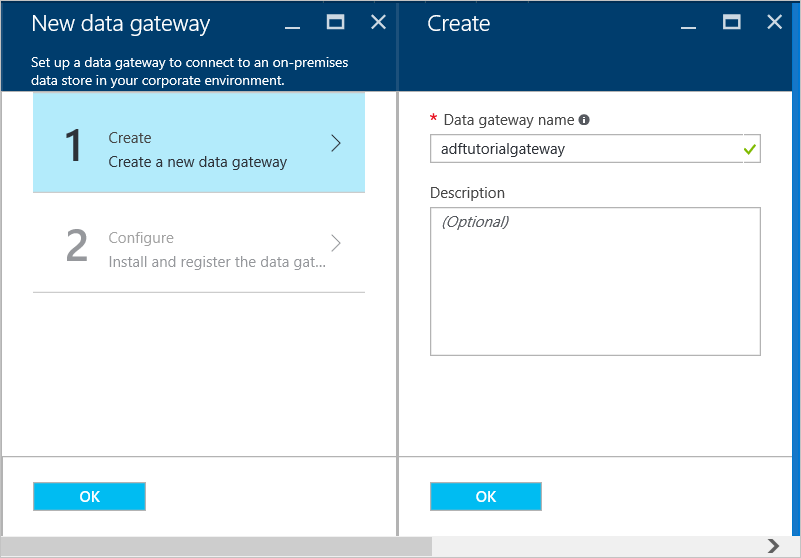
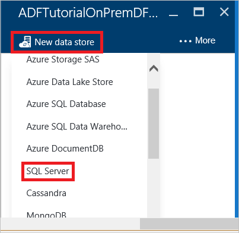
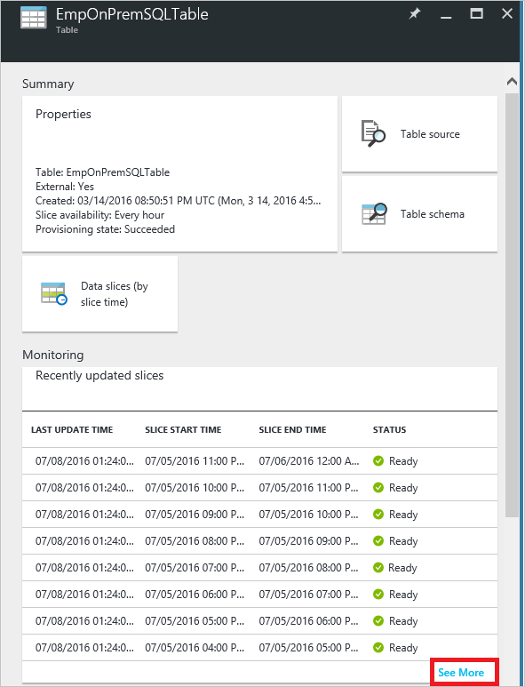
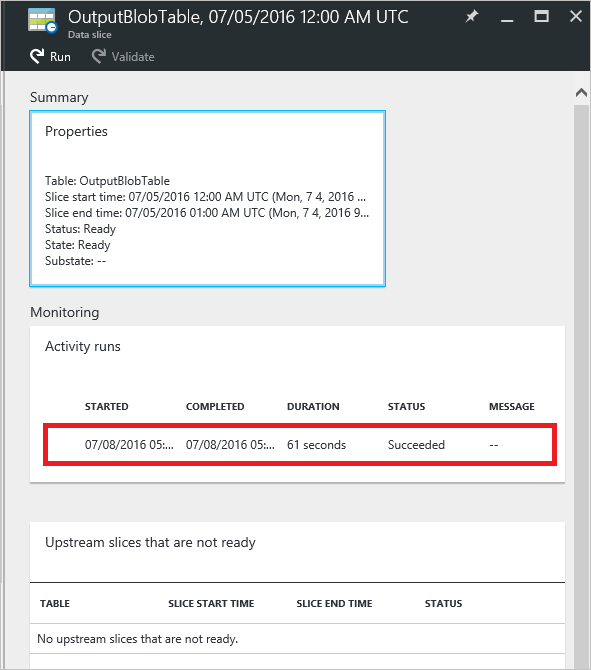
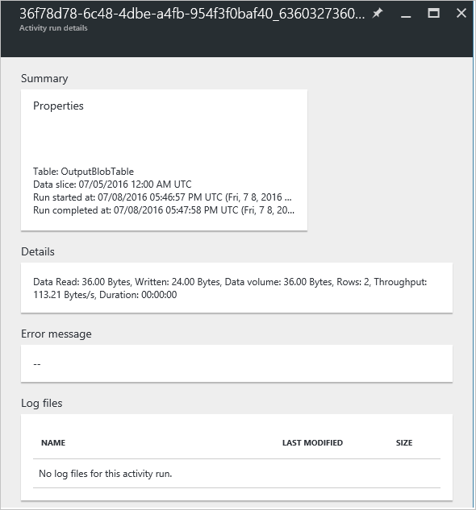

<properties 
    pageTitle="Déplacer les données - passerelle de gestion des données | Microsoft Azure"
    description="Configurer une passerelle de données pour déplacer des données entre en local et le nuage. Utiliser la passerelle de gestion des données dans Azure Data Factory pour déplacer vos données." 
    keywords="passerelle de données, l’intégration des données déplacer des données, les informations d’identification de la passerelle"
    services="data-factory" 
    documentationCenter="" 
    authors="linda33wj" 
    manager="jhubbard" 
    editor="monicar"/>

<tags 
    ms.service="data-factory" 
    ms.workload="data-services" 
    ms.tgt_pltfrm="na" 
    ms.devlang="na" 
    ms.topic="article" 
    ms.date="10/18/2016" 
    ms.author="jingwang"/>

# Déplacer des données entre sources locales et le cloud avec la passerelle de gestion des données
Cet article fournit une vue d’ensemble de l’intégration de données entre banques de données locale et banques de données cloud à l’aide de données par défaut. Il s’appuie sur l’article [Activités de déplacement des données](data-factory-data-movement-activities.md) et d’autres articles données usine principaux concepts : [jeux de données](data-factory-create-datasets.md) et [pipelines](data-factory-create-pipelines.md). 

## Passerelle de gestion des données
Vous devez installer la passerelle de gestion des données sur votre ordinateur local pour activer le déplacement des données vers ou à partir d’une banque de données locale. La passerelle peut être installée sur le même ordinateur que le magasin de données ou sur un autre ordinateur dans la mesure où la passerelle peut se connecter au magasin de données. 

> [AZURE.IMPORTANT] Consultez l’article de [Passerelle de gestion des données](data-factory-data-management-gateway.md) pour plus d’informations sur la passerelle de gestion des données.   

La procédure suivante vous montre comment créer une usine de données avec un pipeline qui déplace les données à partir d’une base de données **SQL Server** en local vers un stockage d’objets blob Azure. Dans le cadre de la procédure pas à pas, vous installez et configurez la passerelle de gestion des données sur votre ordinateur. 

## Procédure pas à pas : copier des données locales vers le cloud
  
## Créer factory de données
Dans cette étape, vous utilisez le portail Azure pour créer une instance Azure Data Factory nommée **ADFTutorialOnPremDF**. 

1.  Connectez-vous au [portail Azure](https://portal.azure.com). 
2.  Cliquez sur **+ Nouveau**, cliquez sur **Intelligence + analytique**, puis cliquez sur **Data Factory**.

      
2. Dans la carte **nouvelle factory de données** , entrez **ADFTutorialOnPremDF** pour le nom.

    

    > [AZURE.IMPORTANT] 
    > Le nom de la factory données Azure doit être globalement unique. Si vous recevez l’erreur : **nom d’usine données « ADFTutorialOnPremDF » n’est pas disponible**, modifiez le nom de la factory de données (par exemple, yournameADFTutorialOnPremDF) et essayez à nouveau de créer. Utilisez ce nom à la place ADFTutorialOnPremDF tout en effectuant les étapes restantes dans ce didacticiel.
    > 
    > Le nom de la factory de données peut être enregistré comme un nom **DNS** à l’avenir et donc deviennent visible publiquement.
3. Sélectionnez l' **abonnement Azure** où vous souhaitez le factory de données à créer. 
4.  Sélectionnez existant **groupe de ressources** ou créer un groupe de ressources. Dans le didacticiel, créez un groupe de ressources nommé : **ADFTutorialResourceGroup**. 
5.  Cliquez sur **créer** dans la carte **nouvelle factory de données** .

    > [AZURE.IMPORTANT] Pour créer des instances de données par défaut, vous devez être membre du rôle de [Collaborateur usine](../active-directory/role-based-access-built-in-roles.md/#data-factory-contributor) au niveau du groupe de ressources/abonnement. 
11. Une fois la création terminée, vous voyez la carte de **Données usine** comme le montre l’image suivante :

    

## Créer la passerelle
5. Dans la carte de **Données par défaut** , cliquez sur **auteur et déployer** vignette pour lancer l' **éditeur** pour le factory de données.

     
6.  Dans l’éditeur d’usine de données, cliquez sur **... Plus** dans la barre d’outils, puis cliquez sur **nouvelle passerelle de données**. Vous pouvez également avec le bouton droit de **Passerelles de données** dans l’arborescence, puis cliquez sur **nouvelle passerelle de données**. 

    
2. Dans la carte de **créer** , entrez **adftutorialgateway** pour le **nom**, puis cliquez sur **OK**.    

    
3. Dans la carte de **configurer** , cliquez sur **installer directement sur cet ordinateur**. Cette action télécharge le package d’installation de la passerelle, installe, configure et enregistre la passerelle sur l’ordinateur.  

    > [AZURE.NOTE] 
    > Utilisez Internet Explorer ou dans un navigateur web compatible avec Microsoft ClickOnce.
    > 
    > Si vous utilisez Chrome, accédez à la [Boutique Chrome](https://chrome.google.com/webstore/), rechercher avec le mot clé « ClickOnce », choisissez une des extensions ClickOnce et installez-le. 
    >  
    > Procédez de même pour Firefox (complément installer). Cliquez sur **Menu Ouvrir** la barre d’outils (**trois barres horizontales** dans le coin supérieur droit), cliquez sur **modules complémentaires**, rechercher avec le mot clé « ClickOnce », choisissez une des extensions ClickOnce et installez-le.    

    

    Le moyen le plus simple (un seul clic) de cet consiste à télécharger, installer, configurer et inscrire la passerelle en une seule étape. Vous pouvez voir que l’application **Gestionnaire de Configuration de passerelle de gestion des Microsoft données** est installée sur votre ordinateur. Vous pouvez également trouver l' exécutable **ConfigManager.exe** dans le dossier : **C:\Program Files\Microsoft données Gestion Gateway\2.0\Shared**.

    Vous pouvez également télécharger et installer passerelle manuellement en utilisant les liens dans cette carte et enregistrez-le à l’aide de la clé indiquée dans la zone de texte **Nouvelle clé** .
    
    Consultez l’article de [Passerelle de gestion des données](data-factory-data-management-gateway.md) pour toutes les informations sur la passerelle.

    >[AZURE.NOTE] Vous devez être un administrateur sur l’ordinateur local pour installer et configurer la passerelle de gestion des données avec succès. Vous pouvez ajouter des utilisateurs au groupe **d’Utilisateurs de passerelle de gestion des données** local Windows. Les membres de ce groupe peuvent utiliser l’outil Gestionnaire de Configuration de passerelle de gestion des données pour configurer la passerelle. 

5. Attendez quelques minutes ou patienter jusqu'à ce que vous voyez le message de notification suivant :

     
6. Lancez l’application **Gestionnaire de Configuration de passerelle de gestion des données** sur votre ordinateur. Dans la fenêtre de **recherche** , tapez la **Passerelle de gestion des données** pour accéder à cet utilitaire. Vous pouvez également trouver l' exécutable **ConfigManager.exe** dans le dossier : **C:\Program Files\Microsoft données Gestion Gateway\2.0\Shared** 

    
6. Vérifiez que vous voyez `adftutorialgateway is connected to the cloud service` message. L’état de la barre du bas affiche **connecté au service cloud** ainsi qu’une **coche verte**.

    Sous l’onglet **accueil** , vous pouvez également effectuer les opérations suivantes : 
    - **Inscrire** une passerelle avec une clé à partir du portail Azure en utilisant le bouton Enregistrer. 
    - **Arrêter** le Service de hôte de passerelle de gestion des données s’exécutant sur votre ordinateur passerelle. 
    - **Mises à jour du planning** soit installé en une heure spécifique de la journée. 
    - Affichage de la passerelle a été **mis à jour**.
    - Spécifier l’heure à laquelle une mise à jour la passerelle peut être installé. 

8. Basculer vers l’onglet **paramètres** . Le certificat spécifié dans la section **certificat** est utilisé pour le chiffrement/déchiffrement des informations d’identification pour le magasin de données locales que vous spécifiez dans le portail. (facultatif) Cliquez sur **Modifier** pour utiliser votre propre certificat à la place. Par défaut, la passerelle qui utilise le certificat est généré par le service de données par défaut.

    

    Vous pouvez également effectuer les actions suivantes sous l’onglet **paramètres** : 
    - Afficher ou exportez le certificat utilisé par la passerelle.
    - Modifier le point de terminaison HTTPS utilisée par la passerelle.    
    - Définir un proxy HTTP devant être utilisé par la passerelle.   
9. (facultatif) Basculer vers l’onglet **Diagnostics** , cochez l’option **Activer la journalisation détaillée** si vous voulez activer la journalisation détaillée que vous pouvez utiliser pour résoudre les problèmes avec la passerelle. Vous trouverez les informations de journalisation dans l' **Observateur d’événements** sous **Services journaux des Applications et** -> nœud de**Passerelle de gestion des données** . 

    

    Vous pouvez également effectuer les opérations suivantes dans l’onglet **Diagnostics** : 
    
    - Utilisez la section **Tester la connexion** à une source de données locale à l’aide de la passerelle.
    - Cliquez sur **Afficher les journaux** pour afficher le journal de passerelle de gestion des données dans une fenêtre Observateur d’événements. 
    - Cliquez sur **Envoyer les journaux** pour télécharger un fichier zip avec les journaux de sept derniers jours à Microsoft pour faciliter la résolution des problèmes de vos problèmes. 
10. Sous l’onglet **Diagnostics** , dans la section **Tester la connexion** , sélectionnez **SQL Server** pour le type du magasin de données, entrez le nom du serveur de base de données, nom de la base de données, spécifiez le type d’authentification, entrez le nom d’utilisateur et mot de passe, puis cliquez sur **Test** pour vérifier que la passerelle peut se connecter à la base de données. 
11. Affichez au navigateur web, puis dans le **portail Azure**, cliquez sur **OK** sur la carte de **configurer** , puis sur la carte **nouvelle passerelle de données** .
6. Vous devriez voir **adftutorialgateway** sous **Passerelles de données** dans l’arborescence à gauche.  Si vous cliquez dessus, vous devriez voir le JSON associé. 
    

## Créer des services liées 
Dans cette étape, vous créez deux services liées : **AzureStorageLinkedService** et **SqlServerLinkedService**. La **SqlServerLinkedService** lie une base de données SQL Server en local et les liens de service liées **AzureStorageLinkedService** stocker un blob Azure à l’usine de données. Vous créez un pipeline plus loin dans cette procédure pas à pas qui copie les données à partir de la base de données SQL Server en local dans le magasin d’objets blob Azure. 

#### Ajouter un service lié à une base de données SQL Server en local
1.  Dans l' **Éditeur de Factory de données**, cliquez sur **nouveau magasin de données** dans la barre d’outils, puis sélectionnez **SQL Server**. 

     
3.  Dans l' **éditeur de JSON** sur la droite, procédez comme suit : 
    1. Pour le **nom de la passerelle**, spécifiez **adftutorialgateway**. 
    2. Dans le **connectionString**, procédez comme suit : 
        1. Pour **nom du serveur**, entrez le nom du serveur qui héberge la base de données SQL Server.
        2. Pour **databasename**, entrez le nom de la base de données.
        3. Cliquez sur **chiffrer** la barre d’outils. Cela télécharge et ouvre l’application Gestionnaire d’informations d’identification.
        
            
        5. Dans la boîte de dialogue **Informations d’identification du paramètre** spécifier le type d’authentification, nom d’utilisateur et mot de passe, puis cliquez sur **OK**. Si la connexion a réussi, les informations d’identification chiffrées sont stockées dans le JSON et ferme la boîte de dialogue. 
        6. Fermez l’onglet navigateur vide que vous lancer la boîte de dialogue s’il n’est pas automatiquement fermé et revenir à l’onglet avec le portail Azure. 
  
            Sur l’ordinateur passerelle, ces informations d’identification sont **chiffrés** à l’aide d’un certificat possédant le service de données par défaut. Si vous souhaitez utiliser le certificat est associé à la passerelle de gestion des données à la place, voir [définir les informations d’identification en toute sécurité](#set-credentials-and-security).    
    1.  Dans la barre de commande pour déployer le service SQL Server lié, cliquez sur **déployer** . Vous devriez voir le service lié dans l’arborescence. 
        
          

#### Ajouter un service lié pour un compte de stockage Azure
 
1. Dans l' **Éditeur de Factory de données**, cliquez sur **nouveau magasin de données** dans la barre de commandes, puis sur **stockage Azure**.
2. Entrez le nom de votre compte de stockage Azure pour le **nom du compte**.
3. Entrez la clé pour votre compte de stockage Azure pour la **clé de compte**.
4. Cliquez sur **déployer** pour déployer les **AzureStorageLinkedService**.
   
 
## Créer des groupes de données
Dans cette étape, vous créez une entrée et de sortie des jeux de données qui représentent des données d’entrée et de sortie pour l’opération de copie (base de données locale SQL Server = > stockage d’objets blob Azure). Avant de créer des groupes de données, procédez comme suit (la procédure détaillée suit la liste) :

- Créer une table nommée **emp** dans la base de données SQL Server vous ajouté comme un service lié à l’usine de données et insérer quelques exemples d’entrées dans la table.
- Créer un conteneur blob nommé **adftutorial** dans le compte de stockage blob Azure que vous ajouté comme un service lié à l’usine de données.

### Préparer les locaux SQL Server pour le didacticiel

1. Dans la base de données que vous avez spécifié pour SQL Server en local service liée (**SqlServerLinkedService**), utilisez le script SQL suivant pour créer la table **emp** dans la base de données.

        CREATE TABLE dbo.emp
        (
            ID int IDENTITY(1,1) NOT NULL, 
            FirstName varchar(50),
            LastName varchar(50),
            CONSTRAINT PK_emp PRIMARY KEY (ID)
        )
        GO 
2. Insérer des exemples dans la table : 

        INSERT INTO emp VALUES ('John', 'Doe')
        INSERT INTO emp VALUES ('Jane', 'Doe')

### Créer le jeu de données d’entrée

1. Dans l' **Éditeur de Factory de données**, cliquez sur **... Plus**, cliquez sur **Nouveau groupe de données** dans la barre de commandes, puis cliquez sur **table SQL Server**. 
2.  Remplacez le JSON dans le volet droit par le texte suivant :
        
            {       
                "name": "EmpOnPremSQLTable",
                "properties": {
                    "type": "SqlServerTable",
                    "linkedServiceName": "SqlServerLinkedService",
                    "typeProperties": {
                        "tableName": "emp"
                    },
                    "external": true,
                    "availability": {
                        "frequency": "Hour",
                        "interval": 1
                    },
                    "policy": {
                        "externalData": {
                            "retryInterval": "00:01:00",
                            "retryTimeout": "00:10:00",
                            "maximumRetry": 3
                        }
                    }
                }
            }    

    Notez les points suivants : 

    - **type** est défini sur **SqlServerTable**.
    - **tableName** est défini sur **emp**.
    - **linkedServiceName** est défini sur **SqlServerLinkedService** (vous aviez créé ce service lié précédemment dans cette procédure pas à pas).
    - Pour un dataset d’entrée n’est pas généré par un autre pipeline dans Azure Data Factory, vous devez définir **externes** **true**. Il indique les données d’entrée sont générées externes au service Azure Data Factory. Vous pouvez éventuellement définir des stratégies de données externes à l’aide de l’élément **externalData** dans la section **stratégie** .    

    Pour plus d’informations sur les propriétés JSON, voir [déplacer des données vers ou à partir de SQL Server](data-factory-sqlserver-connector.md) .
2. Dans la barre de commande pour déployer le jeu de données, cliquez sur **déployer** .  

### Créer le jeu de données de sortie

1.  Dans l' **Éditeur de Factory de données**, cliquez sur **Nouveau groupe de données** dans la barre de commandes, puis cliquez sur **stockage d’objets Blob Azure**.
2.  Remplacez le JSON dans le volet droit par le texte suivant : 

            {
                "name": "OutputBlobTable",
                "properties": {
                    "type": "AzureBlob",
                    "linkedServiceName": "AzureStorageLinkedService",
                    "typeProperties": {
                        "folderPath": "adftutorial/outfromonpremdf",
                        "format": {
                            "type": "TextFormat",
                            "columnDelimiter": ","
                        }
                    },
                    "availability": {
                        "frequency": "Hour",
                        "interval": 1
                    }
                }
            }
  
    Notez les points suivants : 
    
    - **type** est défini sur **AzureBlob**.
    - **linkedServiceName** est défini sur **AzureStorageLinkedService** (vous avez créé ce service lié à l’étape 2).
    - **folderPath** est défini sur **adftutorial/outfromonpremdf** où outfromonpremdf est le dossier dans le conteneur adftutorial. Créez le conteneur **adftutorial** s’il n’existe pas déjà. 
    - La **disponibilité** est défini sur **toutes les heures** (**fréquence** définie sur **heure** et **intervalle** la valeur **1**).  Le service de données usine génère un secteur de données de sortie toutes les heures dans la table **emp** dans la base de données SQL Azure. 

    Si vous ne spécifiez pas un **nom de fichier** pour une **table de sortie**, les fichiers générés dans le **folderPath** sont nommés au format suivant : données. <Guid>.txt (par exemple : : Data.0a405f8a-93ff-4c6f-b3be-f69616f1df7a.txt.).

    Pour définir **folderPath** et **nom de fichier** dynamiquement en fonction du temps **SliceStart** , utilisez la propriété partitionedBy. Dans l’exemple suivant, folderPath utilise année, mois et jour à partir de la SliceStart (heure de début de la section en cours de traitement) et nom de fichier utilise l’heure à partir de la SliceStart. Par exemple, si un secteur en cours de fabrication de 2014-10-20T08:00:00, NomDossier est définie sur wikidatagateway/wikisampledataout/2014/10/20 et le nom de fichier est défini sur 08.csv. 

        "folderPath": "wikidatagateway/wikisampledataout/{Year}/{Month}/{Day}",
        "fileName": "{Hour}.csv",
        "partitionedBy": 
        [
            { "name": "Year", "value": { "type": "DateTime", "date": "SliceStart", "format": "yyyy" } },
            { "name": "Month", "value": { "type": "DateTime", "date": "SliceStart", "format": "MM" } }, 
            { "name": "Day", "value": { "type": "DateTime", "date": "SliceStart", "format": "dd" } }, 
            { "name": "Hour", "value": { "type": "DateTime", "date": "SliceStart", "format": "hh" } } 
        ],

 
    Pour plus d’informations sur les propriétés JSON, voir [déplacer des données vers ou à partir de stockage d’objets Blob Azure](data-factory-azure-blob-connector.md) .
2.  Dans la barre de commande pour déployer le jeu de données, cliquez sur **déployer** . Vérifiez que vous voyez les jeux de données dans l’arborescence.  

## Créer des opportunités
Dans cette étape, vous créez un **pipeline** avec une **Activité de copie** qui utilise **EmpOnPremSQLTable** comme entrée et **OutputBlobTable** sous forme de sortie.

1.  Dans l’éditeur des données par défaut, cliquez sur **... Plus**, puis cliquez sur **nouveau pipeline**. 
2.  Remplacez le JSON dans le volet droit par le texte suivant : 
    
            {
                "name": "ADFTutorialPipelineOnPrem",
                "properties": {
                "description": "This pipeline has one Copy activity that copies data from an on-prem SQL to Azure blob",
                "activities": [
                {
                    "name": "CopyFromSQLtoBlob",
                    "description": "Copy data from on-prem SQL server to blob",
                    "type": "Copy",
                    "inputs": [
                    {
                        "name": "EmpOnPremSQLTable"
                    }
                    ],
                    "outputs": [
                    {
                        "name": "OutputBlobTable"
                      }
                    ],
                    "typeProperties": {
                      "source": {
                        "type": "SqlSource",
                        "sqlReaderQuery": "select * from emp"
                      },
                      "sink": {
                        "type": "BlobSink"
                      }
                    },
                    "Policy": {
                      "concurrency": 1,
                      "executionPriorityOrder": "NewestFirst",
                      "style": "StartOfInterval",
                      "retry": 0,
                      "timeout": "01:00:00"
                    }
                  }
                ],
                "start": "2016-07-05T00:00:00Z",
                "end": "2016-07-06T00:00:00Z",
                "isPaused": false
              }
            }

    > [AZURE.IMPORTANT]
    > Remplacez la valeur de la propriété **Démarrer** avec la valeur de jour et de **fin** actuelle avec le jour suivant.

    Notez les points suivants :
 
    - Dans la section activités, il est uniquement les activités dont le **type** est défini sur **Copier**.
    - **Entrée** de l’activité est définie sur **EmpOnPremSQLTable** et de **sortie** pour l’activité est défini sur **OutputBlobTable**.
    - Dans la section **typeProperties** , **SqlSource** est spécifié en tant que le **type de source** et **BlobSink **est spécifiée comme **type de récepteur**.
    - Requête SQL `select * from emp` spécifiée pour la propriété **sqlReaderQuery** de **SqlSource**.

     Les deux début et fin dates/heures doivent être au [format ISO](http://en.wikipedia.org/wiki/ISO_8601). Par exemple : 2014-10-14T16:32:41Z. L’heure de **fin** est facultative, mais nous l’utiliser dans ce didacticiel. 
    
    Si vous ne spécifiez pas de valeur pour la propriété **end** , il est calculé comme «**début + 48 heures**». Pour exécuter le pipeline indéfiniment, spécifiez **9/9/9999** comme la valeur de la propriété de **fin** . 
    
    Vous définissez la durée dans lequel les secteurs de données sont traités basée sur les propriétés de **disponibilité** ayant étaient définies pour chaque jeu de données Azure Data Factory.
    
    Dans l’exemple, il existe 24 secteurs données comme chaque tranche de données est généré toutes les heures.     
2. Cliquez sur **déployer** dans la barre de commande pour déployer le jeu de données (table est un jeu de données rectangulaire). Vérifiez que le pipeline s’affiche dans l’arborescence sous nœud **Pipelines** .  
5. À présent, cliquez sur **X** à deux reprises pour fermer les cartes pour revenir à la carte de **Données par défaut** pour les **ADFTutorialOnPremDF**.

**Félicitations !** Vous avez correctement créé une usine de données Azure, services liés, jeux de données et un pipeline et planifiée du pipeline.

#### Afficher le factory de données dans une vue de diagramme 
1. Dans le **portail Azure**, cliquez sur **diagramme** vignette sur la page d’accueil pour le factory de données **ADFTutorialOnPremDF** . :

    

2. Vous devriez voir le diagramme similaire à l’image suivante :

    

    Vous pouvez effectuer un zoom sur, effectuer un zoom arrière, zoom à 100 %, zoom pour ajuster automatiquement positionner pipelines et les jeux de données et afficher les informations de lignage des (met en surbrillance des éléments en amont et en aval des éléments sélectionnés).  Vous pouvez double-cliquer sur un objet (jeu de données d’entrée/sortie ou pipeline) pour afficher les propriétés de celui-ci. 

## Pipeline de moniteur
Dans cette étape, le portail Azure vous permet d’analyser que se passe-t-il dans une usine de données Azure. Vous pouvez également utiliser les applets de commande PowerShell pour contrôler les jeux de données et pipelines. Pour plus d’informations sur le contrôle, voir [moniteur et gérer les Pipelines](data-factory-monitor-manage-pipelines.md).

5. Dans le diagramme, double-cliquez sur **EmpOnPremSQLTable**.  

    

6. Notez que toutes les données coupe la sont dans l’état **prêt** , car la durée pipeline (heure de début à l’heure de fin) est passée. Il est également parce que vous avez inséré les données dans la base de données SQL Server et elle existe tout le temps. Vérifiez qu’aucune secteurs n’apparaissant dans la section **secteurs problème** en bas. Pour afficher toutes les sections, cliquez sur **Afficher plus** en bas de la liste des secteurs. 
7. À présent, dans la carte de **jeux de données** , cliquez sur **OutputBlobTable**.

    
9. Cliquez sur un secteur de données à partir de la liste et vous devriez voir la carte de **Données secteur** . Vous voyez activité s’exécute pour le secteur. Vous ne voyez qu’une seule activité généralement exécutées.  

    

    Si le secteur n’est pas dans l’état **prêt** , vous pouvez voir les secteurs en amont qui ne sont pas prêt et bloquent le secteur en cours d’exécution dans la liste **des secteurs en amont qui ne sont pas prêtes** .

10. Cliquez sur l' **activité exécuter** dans la liste en bas pour afficher les **Détails de l’exécution activité**.

    

    Vous verrez des informations telles que débit, durée et la passerelle utilisée pour transférer les données. 
11. Cliquez sur **X** pour fermer toutes les cartes jusqu'à ce que vous 
12. revenir à la carte accueil pour **ADFTutorialOnPremDF**.
14. (facultatif) Cliquez sur **Pipelines**, cliquez sur **ADFTutorialOnPremDF**et effectuer des recherches dans les tables d’entrée (**utilisé**) ou les jeux de données de sortie (**produit**).
15. Utilisez les outils tels qu’utilisez les outils tels que [Microsoft stockage Explorer](http://storageexplorer.com/) pour vérifier qu’un fichier/blob est créé pour chaque heure.

    

## Étapes suivantes

- Consultez l’article de [Passerelle de gestion des données](data-factory-data-management-gateway.md) pour toutes les informations sur la passerelle de gestion des données.
- Voir [copier des données d’objets Blob Azure SQL Azure](data-factory-copy-data-from-azure-blob-storage-to-sql-database.md) pour en savoir plus sur l’utilisation d’activité de copie pour déplacer des données à partir d’un magasin de données source dans un magasin de données récepteur. 
