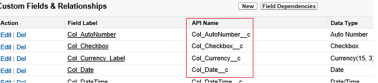

<properties
    pageTitle="Déplacer des données depuis Salesforce à l’aide de Data Factory | Microsoft Azure"
    description="Découvrez comment déplacer des données depuis Salesforce à l’aide de Azure Data Factory."
    services="data-factory"
    documentationCenter=""
    authors="linda33wj"
    manager="jhubbard"
    editor="monicar"/>

<tags
    ms.service="data-factory"
    ms.workload="data-services"
    ms.tgt_pltfrm="na"
    ms.devlang="na"
    ms.topic="article"
    ms.date="10/25/2016"
    ms.author="jingwang"/>

# Déplacer des données depuis Salesforce à l’aide d’usine de données Azure
Cet article explique comment vous pouvez utiliser la copie activité dans une usine de données Azure pour copier des données depuis Salesforce dans le magasin de données qui n’est répertorié sous la colonne récepteur dans la table des [sources et les récepteurs prises en charge](data-factory-data-movement-activities.md#supported-data-stores) . Cet article s’appuie sur l’article [activités de déplacement des données](data-factory-data-movement-activities.md) , qui présente une vue d’ensemble de déplacement de données avec l’activité de copie et les combinaisons de magasin de données prises en charge.

Azure Data Factory prend actuellement en charge uniquement déplacer les données depuis Salesforce [stores]((data-factory-data-movement-activities.md#supported-data-stores) de données récepteur pris en charge, mais ne prend pas en charge le déplacement de données à partir d’autres données stocke à force de vente.

## Conditions préalables
- Vous devez utiliser l’une des éditions suivantes de Salesforce : Developer Edition, Professional Edition, Enterprise Edition ou illimité Edition.
- Autorisation de l’API doit être activée. Voir [comment activer l’accès aux API dans Salesforce par jeu d’autorisations ?](https://www.data2crm.com/migration/faqs/enable-api-access-salesforce-permission-set/)
- Pour copier des données depuis Salesforce sur banques de données locale, vous devez disposer au moins 2.0 de passerelle de gestion des données installés dans votre environnement local.

## Limites des demandes Salesforce
Force de vente comporte les limites de nombre total de demandes API et API de demandes simultanées. Consultez la section « API demander limites » dans l’article [Salesforce développeur limites](http://resources.docs.salesforce.com/200/20/en-us/sfdc/pdf/salesforce_app_limits_cheatsheet.pdf) pour plus d’informations. Remarque Si le nombre de demandes simultanées dépasse la limite, la limitation se produit et vous verrez les échecs aléatoires ; Si le nombre total de demandes dépasse la limite, le compte Salesforce est bloqué pour 24 heures ; Vous pouvez également recevoir l’erreur « REQUEST_LIMIT_EXCEEDED » dans les deux scénarios.

## Copier l’Assistant de données
Pour créer une opportunité qui copie les données depuis Salesforce à n’importe quel récepteur pris en charge banques de données, le plus simple consiste à utiliser l’Assistant de copier les données. Voir [didacticiel : créer une opportunité à l’aide de l’Assistant copie](data-factory-copy-data-wizard-tutorial.md) pour un bref aperçu sur la création d’un pipeline à l’aide de l’Assistant Copier des données.

L’exemple suivant fournit des exemples de définitions JSON que vous pouvez utiliser pour créer une opportunité à l’aide du [portail Azure](data-factory-copy-activity-tutorial-using-azure-portal.md), [Visual Studio](data-factory-copy-activity-tutorial-using-visual-studio.md)ou [Azure PowerShell](data-factory-copy-activity-tutorial-using-powershell.md). Ils montrent comment copier des données depuis Salesforce au stockage d’objets Blob Azure. Toutefois, les données peuvent être copiées à un des récepteurs indiquée [ici](data-factory-data-movement-activities.md#supported-data-stores) à l’aide de l’activité de copie dans Azure Data Factory.   

## Exemple : Copier des données depuis Salesforce dans un blob Azure
Cet exemple copie les données depuis Salesforce à un blob Azure chaque heure. Les propriétés JSON qui sont utilisées dans ces exemples sont décrites dans les sections après les exemples. Vous pouvez copier les données directement à un des récepteurs qui sont répertoriées dans l’article [activités de déplacement des données](data-factory-data-movement-activities.md#supported-data-stores) à l’aide de copie activité dans Azure Data Factory.

Voici les objets Data Factory dont vous aurez besoin pour créer pour implémenter le scénario. Les sections qui suivent la liste fournissent des informations sur ces étapes.

- Un service de type [Salesforce](#salesforce-linked-service-properties) lié
- Un service lié du type [AzureStorage](data-factory-azure-blob-connector.md#azure-storage-linked-service-properties)
- Un [jeu de données](data-factory-create-datasets.md) d’entrée du type [RelationalTable](#salesforce-dataset-properties)
- Un [jeu de données](data-factory-create-datasets.md) de sortie du type [AzureBlob](data-factory-azure-blob-connector.md#azure-blob-dataset-type-properties)
- Un [pipeline](data-factory-create-pipelines.md) avec une activité copie qui utilise [RelationalSource](#relationalsource-type-properties) et [BlobSink](data-factory-azure-blob-connector.md#azure-blob-copy-activity-type-properties)

**Service Salesforce lié**

Cet exemple utilise le service **Salesforce** lié. Voir la section [Salesforce lié service](#salesforce-linked-service-properties) pour les propriétés qui sont prises en charge par ce service lié.  Pour savoir comment réinitialiser/obtenir le jeton de sécurité, consultez [obtenir jeton de sécurité](https://help.salesforce.com/apex/HTViewHelpDoc?id=user_security_token.htm) .

    {
        "name": "SalesforceLinkedService",
        "properties":
        {
            "type": "Salesforce",
            "typeProperties":
            {
                "username": "<user name>",
                "password": "<password>",
                "securityToken": "<security token>"
            }
        }
    }

**Service de stockage lié Azure**

    {
      "name": "AzureStorageLinkedService",
      "properties": {
        "type": "AzureStorage",
        "typeProperties": {
          "connectionString": "DefaultEndpointsProtocol=https;AccountName=<accountname>;AccountKey=<accountkey>"
        }
      }
    }

**Jeu de données d’entrée Salesforce**

    {
        "name": "SalesforceInput",
        "properties": {
            "linkedServiceName": "SalesforceLinkedService",
            "type": "RelationalTable",
            "typeProperties": {
                "tableName": "AllDataType__c"  
            },
            "availability": {
                "frequency": "Hour",
                "interval": 1
            },
            "external": true,
            "policy": {
                "externalData": {
                    "retryInterval": "00:01:00",
                    "retryTimeout": "00:10:00",
                    "maximumRetry": 3
                }
            }
        }
    }

Le fait de définir **externes** **true** indique le service de données par défaut que le jeu de données externe à l’usine de données et n’est pas produit par une activité dans le factory de données.

> [AZURE.IMPORTANT] Le composant « __c » du nom de l’API est nécessaire pour tous les objets personnalisés.

**Jeu de données de sortie blob Azure**

Les données sont écrites dans un nouveau blob toutes les heures (fréquence : heure, l’intervalle : 1).

    {
        "name": "AzureBlobOutput",
        "properties":
        {
            "type": "AzureBlob",
            "linkedServiceName": "AzureStorageLinkedService",
            "typeProperties":
            {
                "folderPath": "adfgetstarted/alltypes_c"
            },
            "availability":
            {
                "frequency": "Hour",
                "interval": 1
            }
        }
    }

**Pipeline avec une activité copie**

Le pipeline contient activité de copie, qui est configuré pour utiliser l’entrée ci-dessus et de sortie des jeux de données, et est planifiée pour exécuter chaque heure. Dans le pipeline de définition de JSON, le type de **source** est défini sur **RelationalSource**et le type de **récepteur** est défini sur **BlobSink**.

Voir [les propriétés de type RelationalSource](#relationalsource-type-properties) pour la liste des propriétés qui sont prises en charge par le RelationalSource.

    {  
        "name":"SamplePipeline",
        "properties":{  
            "start":"2016-06-01T18:00:00",
            "end":"2016-06-01T19:00:00",
            "description":"pipeline with copy activity",
            "activities":[  
            {
                "name": "SalesforceToAzureBlob",
                "description": "Copy from Salesforce to an Azure blob",
                "type": "Copy",
                "inputs": [
                {
                    "name": "SalesforceInput"
                }
                ],
                "outputs": [
                {
                    "name": "AzureBlobOutput"
                }
                ],
                "typeProperties": {
                    "source": {
                        "type": "RelationalSource",
                        "query": "SELECT Id, Col_AutoNumber__c, Col_Checkbox__c, Col_Currency__c, Col_Date__c, Col_DateTime__c, Col_Email__c, Col_Number__c, Col_Percent__c, Col_Phone__c, Col_Picklist__c, Col_Picklist_MultiSelect__c, Col_Text__c, Col_Text_Area__c, Col_Text_AreaLong__c, Col_Text_AreaRich__c, Col_URL__c, Col_Text_Encrypt__c, Col_Lookup__c FROM AllDataType__c"             
                    },
                    "sink": {
                        "type": "BlobSink"
                    }
                },
                "scheduler": {
                    "frequency": "Hour",
                    "interval": 1
                },
                "policy": {
                    "concurrency": 1,
                    "executionPriorityOrder": "OldestFirst",
                    "retry": 0,
                    "timeout": "01:00:00"
                }
            }
            ]
        }
    }

> [AZURE.IMPORTANT] Le composant « __c » du nom de l’API est nécessaire pour tous les objets personnalisés.

## Propriétés du service Salesforce lié

Le tableau suivant décrit les éléments JSON qui sont spécifiques au service Salesforce lié.

| Propriété | Description | Obligatoire |
| -------- | ----------- | -------- |
| type | La propriété doit être définie : **Salesforce**. | Oui |
| nom d’utilisateur |Spécifiez un nom d’utilisateur pour le compte d’utilisateur. | Oui |
| mot de passe | Spécifiez un mot de passe pour le compte d’utilisateur.  | Oui |
| jeton de sécurité | Spécifier un jeton de sécurité du compte d’utilisateur. Pour savoir comment réinitialiser/obtenir un jeton de sécurité, consultez [obtenir jeton de sécurité](https://help.salesforce.com/apex/HTViewHelpDoc?id=user_security_token.htm) . Pour en savoir plus sur les jetons de sécurité en général, voir [sécurité et l’API](https://developer.salesforce.com/docs/atlas.en-us.api.meta/api/sforce_api_concepts_security.htm).  | Oui |

## Propriétés du dataset Salesforce

Pour une liste complète des sections et les propriétés qui sont disponibles pour définir des groupes de données, voir l’article [Création de groupes de données](data-factory-create-datasets.md) . Sections telles que la structure, la disponibilité et stratégie d’un dataset JSON sont similaires pour tous les types de jeu de données (SQL Azure, blob Azure, table Azure et ainsi de suite).

La section **typeProperties** est différente pour chaque type de jeu de données et fournit des informations sur l’emplacement des données dans le magasin de données. La section typeProperties pour un jeu de données de type **RelationalTable** comporte les propriétés suivantes :

| Propriété | Description | Obligatoire |
| -------- | ----------- | -------- |
| tableName | Nom de la table dans Salesforce. | N° (si une **requête** de **RelationalSource** n’est spécifié) |

> [AZURE.IMPORTANT]  Le composant « __c » du nom de l’API est nécessaire pour tous les objets personnalisés.

## Propriétés de type RelationalSource

Pour une liste complète des sections et les propriétés qui sont disponibles pour définir des activités, voir l’article [Création pipelines](data-factory-create-pipelines.md) . Les propriétés comme nom, description, entrée et sortie tables et diverses stratégies sont disponibles pour tous les types d’activités.

Les propriétés qui sont disponibles dans la section typeProperties de l’activité, quant à eux, dépendent de chaque type d’activité. Activité de copie, ils varient selon les types de sources et les récepteurs.

Dans l’activité de copie, lorsque la source est de type **RelationalSource** (y compris Salesforce), les propriétés suivantes sont disponibles dans la section typeProperties :

| Propriété | Description | Valeurs autorisées | Obligatoire |
| -------- | ----------- | -------------- | -------- |
| requête | Utiliser la requête personnalisée pour lire les données. | Une requête SQL-92 ou une requête de [Langage de requête objet Salesforce (SOQL)](https://developer.salesforce.com/docs/atlas.en-us.soql_sosl.meta/soql_sosl/sforce_api_calls_soql.htm) . Par exemple : `select * from MyTable__c`. | N° (si le **tableName** du **jeu de données** n’est spécifié) |

> [AZURE.IMPORTANT] Le composant « __c » du nom de l’API est nécessaire pour tous les objets personnalisés.

## Conseils relatifs aux requêtes

### Récupération des données à l’aide de where clause dans la colonne date/heure
Lorsque vous spécifiez la requête SOQL ou SQL, attention à la différence de format de date/heure. Par exemple :

- **Exemple SOQL**: $$Text.Format (' Sélectionnez Id, nom, BillingCity de compte où LastModifiedDate > = {0 : yyyy-MM-JJThh} LastModifiedDate et < {1:yyyy-MM-JJThh} », WindowStart, WindowEnd)
- **Exemple SQL**: $$Text.Format ('SELECT * à partir de compte à une LastModifiedDate où > = {{ts\'{0 : yyyy-MM-JJ HH : mm :}\'}} LastModifiedDate et < {{ts\'{1:yyyy-MM-JJ HH : mm :}\'}} », WindowStart, WindowEnd) ».

### Extraire des données de rapport Salesforce
Vous pouvez récupérer des données à partir de rapports Salesforce en spécifiant la requête en tant que `{call "<report name>"}`, par exemple, `"query": "{call \"TestReport\"}"`.

### Récupération des enregistrements supprimés à partir de la Corbeille Salesforce
Pour interroger les contours enregistrements supprimés à partir de la Corbeille Salesforce, vous pouvez spécifier **« IsDeleted = 1 »** dans votre requête. Par exemple, 

- Pour rechercher uniquement les enregistrements supprimés, spécifiez « sélectionnez *dans MyTable__c * *où IsDeleted = 1** »
- Pour rechercher tous les enregistrements, y compris les existantes et la supprimés, spécifiez « sélectionnez *dans MyTable__c * *où IsDeleted = 0 ou IsDeleted = 1** »

[AZURE.INCLUDE [data-factory-structure-for-rectangualr-datasets](../../includes/data-factory-structure-for-rectangualr-datasets.md)]

### Mappage du type pour force de vente
Type de force de vente | . Type basé sur un réseau
--------------- | ---------------
Numérotation automatique | Chaîne
Case à cocher | Valeur booléenne
Devise | Double
Date | Date/heure
Date/heure | Date/heure
Messagerie | Chaîne
ID | Chaîne
Relation de liste de choix | Chaîne
Liste déroulante de sélection multiple | Chaîne
Nombre | Double
Pourcentage | Double
Téléphone | Chaîne
Liste de choix | Chaîne
Texte | Chaîne
Zone de texte | Chaîne
Zone de texte (Long) | Chaîne
Zone de texte (RTF) | Chaîne
Texte (c'est-à-dire, chiffré) | Chaîne
URL | Chaîne

[AZURE.INCLUDE [data-factory-column-mapping](../../includes/data-factory-column-mapping.md)]
[AZURE.INCLUDE [data-factory-structure-for-rectangualr-datasets](../../includes/data-factory-structure-for-rectangualr-datasets.md)]

## Performances et réglage  
Voir l' [activité de copie de guide de performances et réglage des périphériques](data-factory-copy-activity-performance.md) pour en savoir plus sur les principaux facteurs impact sur les performances de déplacement de données (copie activité) dans Azure Data Factory et de différentes manières d’optimiser.
