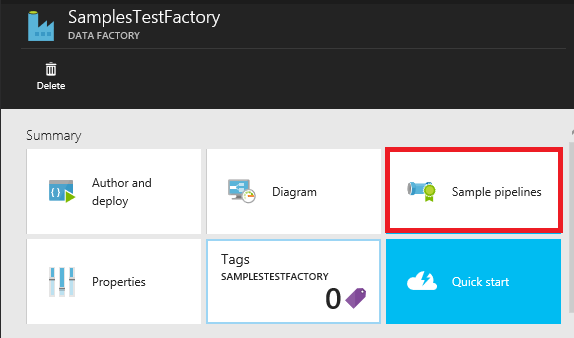
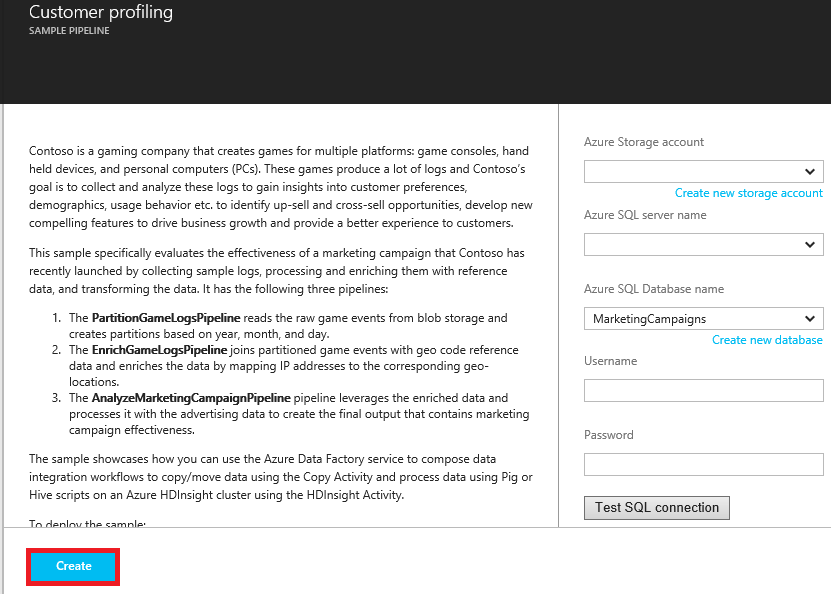
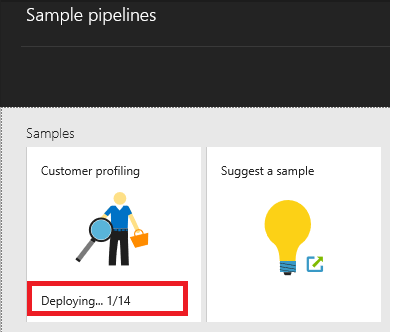
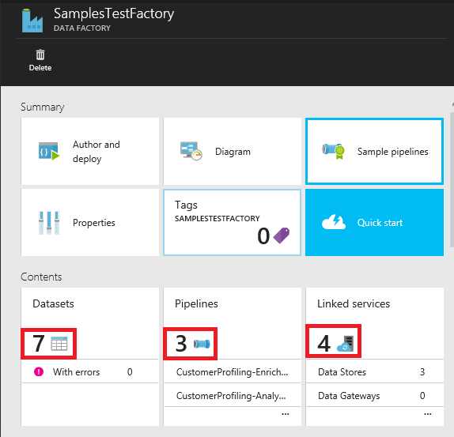

<properties     
    pageTitle="Données Azure Factory - exemples" 
    description="Fournit des détails sur les exemples fournis avec le service Azure Data Factory." 
    services="data-factory" 
    documentationCenter="" 
    authors="sharonlo101" 
    manager="jhubbard" 
    editor="monicar"/>

<tags 
    ms.service="data-factory" 
    ms.workload="data-services" 
    ms.tgt_pltfrm="na" 
    ms.devlang="na" 
    ms.topic="article" 
    ms.date="10/18/2016" 
    ms.author="shlo"/>

# Données Azure Factory - exemples

## Exemples sur GitHub
Le [référentiel GitHub Azure-DataFactory](https://github.com/azure/azure-datafactory) contient plusieurs exemples pour vous aider à rapidement accélération avec le service Azure Data Factory (ou) modifier les scripts et l’utiliser dans l’application propre. Le dossier Samples\JSON contient extraits JSON pour les scénarios courants.

| Exemple | Description |
| :----- | :---------- | 
| [Chargeur procédure pas à pas](https://github.com/Azure/Azure-DataFactory/tree/master/Samples/ADFWalkthrough) | Cet exemple fournit une procédure pas à pas de bout en bout pour le traitement des fichiers journaux à l’aide d’Azure Data Factory transformer les données de fichiers journaux d’analyse.   Dans cette procédure, le pipeline de données usine collecte des journaux d’exemple, processus et enrichit les données à partir des journaux des données de référence et transforme les données pour évaluer l’efficacité d’une campagne marketing qui a été récemment lancée. |
| [Exemples JSON](https://github.com/Azure/Azure-DataFactory/tree/master/Samples/JSON) | Cet exemple fournit des exemples JSON pour des scénarios courants. | 
| [Exemple de module de téléchargement de données HTTP](https://github.com/Azure/Azure-DataFactory/tree/master/Samples/HttpDataDownloaderSample) | Cet exemple présente le téléchargement de données à partir d’un point de terminaison HTTP à Azure Blob Storage à l’aide d’une activité personnalisée .NET. |
| [Cross AppDomain point activité Net exemple](https://github.com/Azure/Azure-DataFactory/tree/master/Samples/CrossAppDomainDotNetActivitySample) | Cet exemple permet de créer une activité personnalisée .NET qui n’est pas limitée à des versions d’assemblys utilisées par le Lanceur de la définition d’application (par exemple, WindowsAzure.Storage v4.3.0, Newtonsoft.Json v6.0.x, etc.). |
| [Exécuter un script R](https://github.com/Azure/Azure-DataFactory/tree/master/Samples/RunRScriptUsingADFSample) |  Cet exemple inclut l’activité personnalisée Data Factory qui peut être utilisée pour appeler RScript.exe. Cet exemple fonctionne uniquement avec votre propre cluster HDInsight (pas à la demande) qui a déjà R installé dessus. |
| [Appeler travaux explosion sur HDInsight Hadoop cluster](https://github.com/Azure/Azure-DataFactory/tree/master/Samples/Spark) | Cet exemple montre comment utiliser MapReduce activité pour appeler un programme explosion. Le programme explosion copie simplement les données d’un seul conteneur Blob Azure vers un autre. |
| [Analyse Twitter à l’aide de Azure Machine apprentissage lot notation activité](https://github.com/Azure/Azure-DataFactory/tree/master/Samples/TwitterAnalysisSample-AzureMLBatchScoringActivity) | Cet exemple montre comment utiliser AzureMLBatchScoringActivity pour appeler un modèle d’apprentissage automatique Azure qui effectue une analyse opinion twitter, score, etc. de prévision. |
| [Analyse de Twitter à l’aide d’une activité personnalisée](https://github.com/Azure/Azure-DataFactory/tree/master/Samples/TwitterAnalysisSample-CustomC%23Activity) |  Cet exemple montre comment utiliser une activité personnalisée .NET pour appeler un modèle d’apprentissage automatique Azure qui effectue une analyse opinion twitter, score, etc. de prévision. |
| [Pipelines paramétrées d’apprentissage automatique Azure](https://github.com/Azure/Azure-DataFactory/tree/master/Samples/ParameterizedPipelinesForAzureML/) | Cet exemple fournit un code c# de bout en bout pour déployer les pipelines N pour le score et reconversion chacune avec un paramètre de zone différente dans laquelle la liste des régions arrive à partir d’un fichier parameters.txt, qui est inclus dans cet exemple. | 
| [Actualisation des données de référence pour les travaux Azure flux Analytique](https://github.com/Azure/Azure-DataFactory/tree/master/Samples/ReferenceDataRefreshForASAJobs) |  Cet exemple montre comment utiliser conjointement Azure Data Factory et Azure flux Analytique pour exécuter les requêtes avec des données de référence et configurer l’actualisation des données de référence sur une planification. |
| [Pipeline hybride avec local Hortonworks Hadoop](https://github.com/Azure/Azure-DataFactory/tree/master/Samples/HybridPipelineWithOnPremisesHortonworksHadoop) | L’exemple utilise un cluster Hadoop local comme cible cluster pour exécuter les travaux dans Data Factory comme vous ajouteriez autres cibles cluster comme un HDInsight en fonction Hadoop cluster dans le cloud. |
| [Outil de Conversion JSON](https://github.com/Azure/Azure-DataFactory/tree/master/Samples/JSONConversionTool) | Cet outil permet de convertir JSONs à partir de la version antérieure à 2015-07-01-aperçu dernière ou 2015-07-01-aperçu (par défaut). |  
| [U-SQL exemple d’entrée de fichier](https://github.com/Azure/Azure-DataFactory/tree/master/Samples/U-SQL%20Sample%20Input%20File) |  Ce fichier est un exemple de fichier utilisé par une activité U-SQL. | 

## Modèles de gestionnaire de ressources Azure
Vous pouvez rechercher les modèles Azure le Gestionnaire de ressources suivantes d’usine de données sur Github. 

| Modèle | Description |
| -------- | ----------- | 
| [Copier depuis le stockage Blob Azure dans la base de données SQL Azure](https://github.com/Azure/azure-quickstart-templates/tree/master/101-data-factory-blob-to-sql-copy) | Déploiement de ce modèle crée une usine de données Azure avec un pipeline qui copie les données à partir du stockage blob Azure spécifiée pour la base de données SQL Azure |    
| [Copiez Salesforce à Azure Blob Storage](https://github.com/Azure/azure-quickstart-templates/tree/master/101-data-factory-salesforce-to-blob-copy) | Déploiement de ce modèle crée une usine de données Azure avec un pipeline qui copie les données à partir du compte Salesforce spécifié dans le stockage blob Azure. |    
| [Transformer les données en exécutant le script Hive sur un cluster Azure HDInsight](https://github.com/Azure/azure-quickstart-templates/tree/master/101-data-factory-hive-transformation) | Déploiement de ce modèle crée une usine de données Azure avec un pipeline qui transforme les données en exécutant le script Hive exemple sur un cluster Azure HDInsight Hadoop. | 

## Exemples de portail Azure
Vous pouvez utiliser la vignette **pipelines exemple** sur la page d’accueil de votre usine de données à déployer exemple pipelines et les entités associées (jeux de données et services liées) dans votre usine de données. 

1. Créez une usine de données ou ouvrez une usine de données existante. Voir [prise en main d’Azure Data Factory](data-factory-copy-data-from-azure-blob-storage-to-sql-database.md#CreateDataFactory) pour obtenir la procédure pour créer une usine de données.
2. Dans la carte de **Données par défaut** pour le factory de données, cliquez sur la vignette **pipelines exemple** .

    

2. Dans la carte **pipelines exemple** , cliquez sur l' **exemple** que vous voulez déployer. 
    
    

3. Spécifier les paramètres de configuration pour l’échantillon. Par exemple, votre clé de compte et de nom de compte de stockage Azure, nom du serveur SQL Azure, base de données, ID d’utilisateur et mot de passe, etc.. 

    

4. Une fois que vous avez terminé pour spécifier les paramètres de configuration, cliquez sur **créer** pour créer/déployer les pipelines exemple et les services/tables liées utilisées par les pipelines.
5. Vous voyez l’état de déploiement sur la vignette d’exemple que vous avez cliqué précédemment sur la carte **pipelines exemple** .

    

6. Lorsque vous voyez le message **réussi déploiement** sur la vignette pour l’échantillon, fermez la carte **pipelines exemple** .  
5. Sur la carte de **Données par défaut** , vous voyez que les services liées, jeux de données et pipelines sont ajoutés à votre usine de données.  

    
   
## Exemples dans Visual Studio

### Conditions préalables

Vous devez disposer des éléments suivants installés sur votre ordinateur : 

- Visual Studio 2013 ou Visual Studio 2015
- Téléchargez Azure SDK pour Visual Studio 2013 ou Visual Studio 2015. Accédez à la [Page de téléchargement Azure](https://azure.microsoft.com/downloads/) , puis cliquez sur **VS 2013** ou **VS 2015** dans la section **.NET** .
- Télécharger le plug-in Azure Data Factory dernière pour Visual Studio : [VS 2013](https://visualstudiogallery.msdn.microsoft.com/754d998c-8f92-4aa7-835b-e89c8c954aa5) ou [VS 2015](https://visualstudiogallery.msdn.microsoft.com/371a4cf9-0093-40fa-b7dd-be3c74f49005). Si vous utilisez Visual Studio 2013, vous pouvez également mettre à jour le plug-in en procédant comme suit : dans le menu, cliquez sur **Outils** -> **mises à jour et Extensions** -> **Online** -> **Galerie Visual Studio** -> **Microsoft Azure données usine Tools pour Visual Studio** -> **mettre à jour**.

### Utiliser les modèles de données par défaut

1. Cliquez sur **fichier** dans le menu, pointez sur **Nouveau**, puis cliquez sur **projet**. 
2. Dans la boîte de dialogue **Nouveau projet** , procédez comme suit : 
    1. Sélectionnez **DataFactory** sous **modèles**. 
    2. Dans le volet droit, sélectionnez **Les modèles de données par défaut** . 
    3. Entrez un **nom** pour le projet. 
    4. Sélectionnez un **emplacement** pour le projet. 
    5. Cliquez sur **OK**. 

    
6. Dans la boîte de dialogue **Par défaut des modèles de données** , sélectionnez l’exemple de modèle dans la section **Modèles de cas d’utilisation** , puis cliquez sur **suivant**. Les étapes suivantes vous guident dans l’aide du modèle de **Profil client** . Étapes sont similaires pour les autres exemples. 

     
7. Dans la boîte de dialogue **Paramètres de données** , cliquez sur **suivant** dans la page **Notions de base de données par défaut** .
8. Dans la page **par défaut de données de configuration** , procédez comme suit : 
    1. Sélectionnez **créer de nouvelles données Factory**. Vous pouvez également sélectionner **factory données existant Utilisation**.
    2. Entrez un **nom** pour le factory de données.
    3. Sélectionnez l' **abonnement Azure** dans lequel vous voulez le factory de données à créer. 
    4. Sélectionnez le **groupe de ressources** pour le factory de données.
    5. Sélectionnez le **US ouest**, **US Extrême-Orient**ou **Europe du Nord** pour la **région**.
    6. Cliquez sur **suivant**. 
9. Dans la page **stocke les données de configuration** , spécifiez une existante **base de données SQL Azure** et **compte de stockage Azure** (ou) créer/stockage de base de données, puis cliquez sur Suivant. 
10. Dans la page **configuration de calcul** , sélectionnez les valeurs par défaut, puis cliquez sur **suivant**. 
11. Dans la page **Résumé** , passez en revue tous les paramètres, puis cliquez sur **suivant**. 
12. Dans la page **État du déploiement** , patientez jusqu'à ce que vous avez terminé le déploiement, puis cliquez sur **Terminer**.
13. Avec le bouton droit de projet dans l’Explorateur de solutions, puis cliquez sur **Publier**. 
19. Si vous voyez la boîte de dialogue **se connecter à votre compte Microsoft** , entrez vos informations d’identification du compte qui dispose d’abonnement Azure, puis cliquez sur **se connecter**.
20. Vous devriez voir la boîte de dialogue suivante :

    

21. Dans la page **par défaut de données de configuration** , procédez comme suit : 
    1. Confirmer cette option **utiliser existant données factory** .
    2. Sélectionnez la **factory de données** que vous aviez sélectionnez lors de l’utilisation du modèle. 
    6. Cliquez sur **suivant** pour passer à la page **Publier des éléments** . (Appuyez sur l' **onglet** pour retirer le champ nom à si le bouton **suivant** est désactivé.) 
23. Dans la page **Publier des éléments** , vérifiez que toutes les références de données entités sont sélectionnées, puis cliquez sur **suivant** pour passer à la page de **Résumé** .     
24. Consultez le résumé, cliquez sur **suivant** pour démarrer le processus de déploiement et afficher le **Statut du déploiement**.
25. Dans la page **État du déploiement** , vous devez voir l’état du processus de déploiement. Une fois que le déploiement est terminé, cliquez sur Terminer. 

Pour plus d’informations sur l’utilisation de Visual Studio pour créer des entités Data Factory et publiant sur Azure, consultez [créer votre première usine de données (Visual Studio)](data-factory-build-your-first-pipeline-using-vs.md) .          