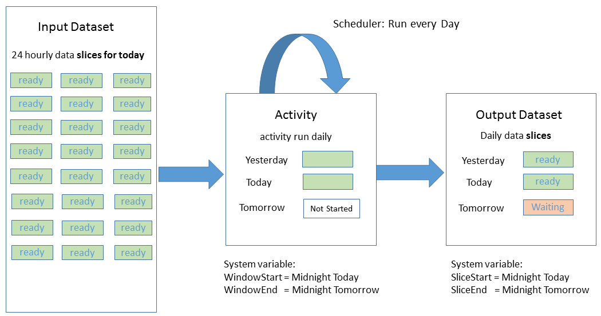

<properties
    pageTitle="Planification et l’exécution des données par défaut | Microsoft Azure"
    description="Découvrez les aspects de la planification et l’exécution du modèle d’application Azure Data Factory."
    services="data-factory"
    documentationCenter=""
    authors="spelluru"
    manager="jhubbard"
    editor="monicar"/>

<tags
    ms.service="data-factory"
    ms.workload="data-services"
    ms.tgt_pltfrm="na"
    ms.devlang="na"
    ms.topic="article"
    ms.date="08/22/2016"
    ms.author="spelluru"/>

# Planification de données par défaut et l’exécution
Cet article décrit les aspects de la planification et l’exécution du modèle d’application Azure Data Factory. 

## Conditions préalables
Cet article suppose que vous comprenez les bases de données usine application modèle concepts de base, y compris activité, les opportunités, services liées et jeux de données. Pour les concepts de base d’Azure Data Factory, voir les articles suivants :

- [Présentation des données par défaut](data-factory-introduction.md)
- [Pipelines](data-factory-create-pipelines.md)
- [Jeux de données](data-factory-create-datasets.md) 

## Planifier une activité

Avec la section Planificateur de l’activité JSON, vous pouvez spécifier une planification d’une activité périodique. Par exemple, vous pouvez planifier une activité chaque heure comme suit :

    "scheduler": {
        "frequency": "Hour",
        "interval": 1
    },  

Comme indiqué dans le diagramme, la définition d’un planning de l’activité crée une série de windows qui s’écroulent. Fenêtres qui s’écroulent sont une série d’intervalles de temps taille fixe, sans chevauchement, contigu. Ces fenêtres qui s’écroulent logique de l’activité sont appelées *windows activité*.

Pour la fenêtre d’activité en cours d’exécution, vous pouvez accéder à l’intervalle de temps associée à la fenêtre d’activité avec [WindowStart](data-factory-functions-variables.md#data-factory-system-variables) et [WindowEnd](data-factory-functions-variables.md#data-factory-system-variables) variables système de l’activité JSON. Vous pouvez utiliser ces variables à des fins différentes dans votre activité JSON. Par exemple, vous pouvez les utiliser pour sélectionner les données de jeux de données d’entrée et de sortie représentant les données de série de date.

La propriété **scheduler** prend en charge les sous-propriétés mêmes en tant que la propriété de **disponibilité** d’un dataset. Pour plus d’informations, voir [la disponibilité du jeu de données](data-factory-create-datasets.md#Availability) . Exemples : planification à un décalage spécifique ou définition du mode pour aligner le traitement au début ou à la fin de l’intervalle de la fenêtre d’activité.

Vous pouvez spécifier les propriétés de **Planificateur** d’une activité, mais cette propriété est **facultative**. Si vous ne spécifiez pas une propriété, elle doit correspondre à la cadence que vous spécifiez dans la définition de jeu de données de sortie. Jeu de données de sortie n’existe actuellement que lecteurs l’Échéancier, vous devez créer un jeu de données de sortie même si l’activité ne génère pas de sortie. Si l’activité n’accepte aucune entrée, vous pouvez ignorer la création du groupe de données d’entrée.

## Secteurs de jeux de données et les données de série de temps

Données de série de temps sont une séquence continue de points de données qui se compose généralement des mesures successives effectuées sur un intervalle de temps. Exemples de données de série de date incluent capteur et aux données de télémétrie d’application.

Avec les données par défaut, vous pouvez traiter exécution de série de données de manière groupée avec une activité. En règle générale, il existe une cadence périodique à partir duquel les données d’entrée arrivent et de sortie de données doit être produit. Cette cadence est modélisation en spécifiant **disponibilité** dans le groupe de données comme suit :

    "availability": {
      "frequency": "Hour",
      "interval": 1
    },

Chaque unité de données consommées et obtenus par une série d’activité s’appelle une tranche de données. Le diagramme suivant montre un exemple d’une activité avec un jeu de données d’entrée et un jeu de données de sortie. Ces jeux de données ont **disponibilité** définie sur une fréquence horaire.

Le schéma ci-dessus illustre les horaires secteurs de données pour le jeu de données d’entrée et de sortie. Le diagramme montre trois sections d’entrée qui sont prêtes pour le traitement. L’activité 10 et 11 AM est en cours, produisant le secteur de sortie 10 et 11 AM.

Vous pouvez accéder à l’intervalle de temps associée à la section active produite dans le groupe de données JSON avec variables [SliceStart](data-factory-functions-variables.md#data-factory-system-variables) et [SliceEnd](data-factory-functions-variables.md#data-factory-system-variables).

Pour l’instant, Data Factory nécessite que la planification spécifiée dans l’activité exactement correspond à la planification spécifiée dans la **disponibilité** du jeu de données de sortie. Par conséquent, **WindowStart**, **WindowEnd**, **SliceStart**et **SliceEnd** sont toujours mappent à la même période et un secteur de sortie unique.

Pour plus d’informations sur les différentes propriétés disponibles pour la section disponibilité, voir [Création de groupes de données](data-factory-create-datasets.md).

## Déplacer des données à partir de la base de données SQL pour le stockage d’objets Blob

Nous allons placer certains éléments ensemble, ainsi qu’en action en créant un pipeline qui copie les données à partir d’une table de base de données SQL Azure à Azure Blob storage chaque heure.

**Entrée : Jeu de données de base de données SQL Azure**

    {
        "name": "AzureSqlInput",
        "properties": {
            "published": false,
            "type": "AzureSqlTable",
            "linkedServiceName": "AzureSqlLinkedService",
            "typeProperties": {
                "tableName": "MyTable"
            },
            "availability": {
                "frequency": "Hour",
                "interval": 1
            },
            "external": true,
            "policy": {}
        }
    }

**Fréquence** est définie sur **heure** et **intervalle** est défini sur **1** dans la section disponibilité.

**Sortie : Dataset de stockage Blob Azure**

    {
        "name": "AzureBlobOutput",
        "properties": {
            "published": false,
            "type": "AzureBlob",
            "linkedServiceName": "StorageLinkedService",
            "typeProperties": {
                "folderPath": "mypath/{Year}/{Month}/{Day}/{Hour}",
                "format": {
                    "type": "TextFormat"
                },
                "partitionedBy": [
                    {
                        "name": "Year",
                        "value": {
                            "type": "DateTime",
                            "date": "SliceStart",
                            "format": "yyyy"
                        }
                    },
                    {
                        "name": "Month",
                        "value": {
                            "type": "DateTime",
                            "date": "SliceStart",
                            "format": "%M"
                        }
                    },
                    {
                        "name": "Day",
                        "value": {
                            "type": "DateTime",
                            "date": "SliceStart",
                            "format": "%d"
                        }
                    },
                    {
                        "name": "Hour",
                        "value": {
                            "type": "DateTime",
                            "date": "SliceStart",
                            "format": "%H"
                        }
                    }
                ]
            },
            "availability": {
                "frequency": "Hour",
                "interval": 1
            }
        }
    }

**Fréquence** est définie sur **heure** et **intervalle** est défini sur **1** dans la section disponibilité.

**: Activité copie**

    {
        "name": "SamplePipeline",
        "properties": {
            "description": "copy activity",
            "activities": [
                {
                    "type": "Copy",
                    "name": "AzureSQLtoBlob",
                    "description": "copy activity",
                    "typeProperties": {
                        "source": {
                            "type": "SqlSource",
                            "sqlReaderQuery": "$$Text.Format('select * from MyTable where timestampcolumn >= \\'{0:yyyy-MM-dd HH:mm}\\' AND timestampcolumn < \\'{1:yyyy-MM-dd HH:mm}\\'', WindowStart, WindowEnd)"
                        },
                        "sink": {
                            "type": "BlobSink",
                            "writeBatchSize": 100000,
                            "writeBatchTimeout": "00:05:00"
                        }
                    },
                    "inputs": [
                        {
                            "name": "AzureSQLInput"
                        }
                    ],
                    "outputs": [
                        {
                            "name": "AzureBlobOutput"
                        }
                    ],
                    "scheduler": {
                        "frequency": "Hour",
                        "interval": 1
                    }
                }
            ],
            "start": "2015-01-01T08:00:00Z",
            "end": "2015-01-01T11:00:00Z"
        }
    }

L’exemple illustre la planification des activités et sections de disponibilité de jeu de données défini sur une fréquence horaire. L’exemple montre comment vous pouvez utiliser **WindowStart** et **WindowEnd** pour sélectionner les données pertinentes pour une activité exécuter et le copier dans un blob avec la **folderPath**approprié. La **folderPath** est paramétrée pour utiliser un dossier distinct pour chaque heure.

Lorsque trois secteurs entre 8 – 11 AM exécutez, les données de base de données SQL Azure sont la suivante :

Une fois le pipeline déploie, le blob Azure est rempli comme suit :

-   Fichier mypath/2015/1/1/8/données. &lt;Guid&gt;.txt avec des données

            10002345,334,2,2015-01-01 08:24:00.3130000
            10002345,347,15,2015-01-01 08:24:00.6570000
            10991568,2,7,2015-01-01 08:56:34.5300000

    > [AZURE.NOTE] &lt;GUID&gt; est remplacé par un guid réel. Exemple de nom de fichier : Data.bcde1348-7620-4f93-bb89-0eed3455890b.txt
-   Fichier mypath/2015/1/1/9/données. &lt;Guid&gt;.txt avec des données :

            10002345,334,1,2015-01-01 09:13:00.3900000
            24379245,569,23,2015-01-01 09:25:00.3130000
            16777799,21,115,2015-01-01 09:47:34.3130000
-   Fichier mypath/2015/1/1/10/données. &lt;Guid&gt;.txt sans données.

## Période active pour pipeline

[Création de canalisations](data-factory-create-pipelines.md) ainsi que le concept d’une période active pour un pipeline spécifié en définissant les propriétés **start** et **end** .

Vous pouvez définir la date de début pour la période active pipeline par le passé. Données usine calcule (remplissages précédent) tous les secteurs de données passée automatiquement et commence à les traiter.

## Traitement en parallèle de secteurs de données
Vous pouvez configurer secteurs données renvoyées à exécuter en parallèle en définissant la propriété **concurrence** dans la section de stratégie de l’activité JSON. Pour plus d’informations sur cette propriété, consultez [pipelines de création](data-factory-create-pipelines.md).

## Réexécuter une tranche de données a échoué 
Vous pouvez surveiller l’exécution de secteurs de façon riche et visuelle. Pour plus d’informations, voir [surveillance et la gestion des pipelines à l’aide de cartes portails Azure](data-factory-monitor-manage-pipelines.md) ou une [application de surveillance et d’administration](data-factory-monitor-manage-app.md) .

Prenons l’exemple suivant affiche deux activités. Activity1 génère un jeu de données de série heure avec secteurs en tant que sortie qui est utilisée comme entrée par Activity2 pour générer le jeu de données série de temps finale.

Le diagramme indique que déconnecter trois secteurs récentes, une défaillance produisant le secteur AM 9 et 10 pour Dataset2 s’est produite. Données usine suit automatiquement dépendance pour le jeu de données de série de temps. Par conséquent, il ne démarre pas l’activité exécutée pour le secteur en aval 9-10 AM.

Outils surveillance et la gestion des données par défaut permettent d’Explorer les journaux de diagnostic pour le secteur échec rechercher l’origine du problème pour le problème et corriger l’erreur facilement. Une fois que vous avez résolu le problème, vous pouvez facilement démarrer l’activité exécutée pour générer le secteur a échoué. Pour plus d’informations sur la façon de réexécuter et la compréhension des transitions d’état pour les sections de données, voir [surveillance et la gestion des pipelines à l’aide de cartes portails Azure](data-factory-monitor-manage-pipelines.md) ou une [application de surveillance et la gestion](data-factory-monitor-manage-app.md).

Une fois que vous exécutez à nouveau le secteur 9-10 AM pour **Dataset2**, Data Factory démarre l’exécution pour le secteur dépendantes AM 9 et 10 sur le dataset final.

## Exécuter les activités dans une séquence
Vous pouvez bicyclette deux activités (exécutée une activité après l’autre) en définissant le jeu de données de sortie d’une activité en tant que le jeu de données d’entrée de l’autre activité. Les activités peuvent être dans le pipeline de même ou dans pipelines différents. La deuxième activité s’exécute uniquement lorsque le premier d'entre eux est terminée avec succès.

Par exemple, considérez le cas suivant :

1.  Pipeline P1 a A1 activité qui requiert dataset d’entrée externe D1 et produit sortie dataset D2.
2.  Pipeline P2 a A2 activité qui nécessite une entrée de dataset D2 et produit sortie dataset D3.

Dans ce scénario, les activités A1 et A2 sont dans pipelines différents. L’activité A1 s’exécute lorsque les données externes soient disponibles et la fréquence de disponibilité planifiée est atteint. L’activité A2 s’exécute lorsque les secteurs planifiées à partir de D2 deviennent disponibles et la fréquence de disponibilité planifiée est atteint. S’il existe une erreur dans un des secteurs de dataset D2, A2 ne fonctionne pas pour cette section qu’il soit disponible.

La vue de diagramme donnera le diagramme suivant :

Comme mentionné précédemment, les activités peuvent se trouver dans le même pipeline. La vue de diagramme avec les deux activités dans le pipeline de même donnera le diagramme suivant :

### Copier dans un ordre séquentiel
Il est possible d’exécuter une après l’autre plusieurs opérations de copie d’une manière séquentielle/commandé. Par exemple, vous pouvez avoir deux activités copier dans un pipeline (CopyActivity1 et CopyActivity2) avec les jeux de données de sortie d’entrée de données suivants :   

CopyActivity1

Entrée : Dataset. Sortie : Dataset2.

CopyActivity2

Entrée : Dataset2.  Sortie : Dataset3.

CopyActivity2 s’exécute uniquement si la CopyActivity1 a exécuté correctement et Dataset2 est disponible.

Voici le pipeline exemple JSON :

    {
        "name": "ChainActivities",
        "properties": {
            "description": "Run activities in sequence",
            "activities": [
                {
                    "type": "Copy",
                    "typeProperties": {
                        "source": {
                            "type": "BlobSource"
                        },
                        "sink": {
                            "type": "BlobSink",
                            "copyBehavior": "PreserveHierarchy",
                            "writeBatchSize": 0,
                            "writeBatchTimeout": "00:00:00"
                        }
                    },
                    "inputs": [
                        {
                            "name": "Dataset1"
                        }
                    ],
                    "outputs": [
                        {
                            "name": "Dataset2"
                        }
                    ],
                    "policy": {
                        "timeout": "01:00:00"
                    },
                    "scheduler": {
                        "frequency": "Hour",
                        "interval": 1
                    },
                    "name": "CopyFromBlob1ToBlob2",
                    "description": "Copy data from a blob to another"
                },
                {
                    "type": "Copy",
                    "typeProperties": {
                        "source": {
                            "type": "BlobSource"
                        },
                        "sink": {
                            "type": "BlobSink",
                            "writeBatchSize": 0,
                            "writeBatchTimeout": "00:00:00"
                        }
                    },
                    "inputs": [
                        {
                            "name": "Dataset2"
                        }
                    ],
                    "outputs": [
                        {
                            "name": "Dataset3"
                        }
                    ],
                    "policy": {
                        "timeout": "01:00:00"
                    },
                    "scheduler": {
                        "frequency": "Hour",
                        "interval": 1
                    },
                    "name": "CopyFromBlob2ToBlob3",
                    "description": "Copy data from a blob to another"
                }
            ],
            "start": "2016-08-25T01:00:00Z",
            "end": "2016-08-25T01:00:00Z",
            "isPaused": false
        }
    }

Notez que dans l’exemple, le jeu de données de sortie de la première activité de copie (Dataset2) est spécifiée comme entrée pour la deuxième activité. Par conséquent, la deuxième activité s’exécute uniquement lorsque le dataset de sortie à partir de la première activité est prêt.  

Dans l’exemple, CopyActivity2 peut avoir une entrée différente, tels que Dataset3, mais que vous spécifiez Dataset2 comme une entrée de CopyActivity2, afin que l’activité ne s’exécute pas avant la fin de CopyActivity1. Par exemple :

CopyActivity1

Entrée : Dataset1. Sortie : Dataset2.

CopyActivity2

Entrées : Dataset3, Dataset2. Sortie : Dataset4.

    {
        "name": "ChainActivities",
        "properties": {
            "description": "Run activities in sequence",
            "activities": [
                {
                    "type": "Copy",
                    "typeProperties": {
                        "source": {
                            "type": "BlobSource"
                        },
                        "sink": {
                            "type": "BlobSink",
                            "copyBehavior": "PreserveHierarchy",
                            "writeBatchSize": 0,
                            "writeBatchTimeout": "00:00:00"
                        }
                    },
                    "inputs": [
                        {
                            "name": "Dataset1"
                        }
                    ],
                    "outputs": [
                        {
                            "name": "Dataset2"
                        }
                    ],
                    "policy": {
                        "timeout": "01:00:00"
                    },
                    "scheduler": {
                        "frequency": "Hour",
                        "interval": 1
                    },
                    "name": "CopyFromBlobToBlob",
                    "description": "Copy data from a blob to another"
                },
                {
                    "type": "Copy",
                    "typeProperties": {
                        "source": {
                            "type": "BlobSource"
                        },
                        "sink": {
                            "type": "BlobSink",
                            "writeBatchSize": 0,
                            "writeBatchTimeout": "00:00:00"
                        }
                    },
                    "inputs": [
                        {
                            "name": "Dataset3"
                        },
                        {
                            "name": "Dataset2"
                        }
                    ],
                    "outputs": [
                        {
                            "name": "Dataset4"
                        }
                    ],
                    "policy": {
                        "timeout": "01:00:00"
                    },
                    "scheduler": {
                        "frequency": "Hour",
                        "interval": 1
                    },
                    "name": "CopyFromBlob3ToBlob4",
                    "description": "Copy data from a blob to another"
                }
            ],
            "start": "2017-04-25T01:00:00Z",
            "end": "2017-04-25T01:00:00Z",
            "isPaused": false
        }
    }

Notez que dans l’exemple, deux jeux de données d’entrée est spécifiées pour la deuxième activité de copie. Lorsque plusieurs entrées sont spécifiées, le premier dataset d’entrée est utilisé pour copier les données, mais les autres jeux de données utilisés comme dépendances. CopyActivity2 devez débuter qu’après que les conditions suivantes sont remplies :

- CopyActivity1 terminée et Dataset2 est disponible. Ce groupe de données n’est pas utilisé lorsque vous copiez des données à Dataset4. Il sert uniquement une dépendance de planification pour CopyActivity2.   
- Dataset3 est disponible. Ce groupe de données représente les données copiées vers la destination.  

## Jeux de données de modèle une fréquence différente

Dans les exemples, la fréquence de jeux de données d’entrée et de sortie et la fenêtre de planification activité est identiques. Certains scénarios requièrent la possibilité pour produire une sortie à une fréquence différente de la fréquence d’une ou plusieurs entrées. Données usine prend en charge ces scénarios de modélisation.

### Exemple 1 : Créer un rapport de sortie quotidien pour les données d’entrée sont disponibles chaque heure

Envisagez un scénario dans lequel vous avez entrées données mesure de capteurs disponibles à toutes les heures dans le stockage Blob Azure. Vous voulez produire un rapport d’agrégation quotidien avec des statistiques telles que minimum, maximum et moyenne pour le jour avec [Data Factory ruche activité](data-factory-hive-activity.md).

Voici comment vous pouvez modéliser ce scénario avec les données par défaut :

**Jeu de données d’entrée**

Les fichiers d’entrée horaires sont supprimés dans le dossier pour le jour donné. Disponibilité pour l’entrée est définie sur **heure** (fréquence : heure, l’intervalle : 1).

    {
      "name": "AzureBlobInput",
      "properties": {
        "type": "AzureBlob",
        "linkedServiceName": "StorageLinkedService",
        "typeProperties": {
          "folderPath": "mycontainer/myfolder/{Year}/{Month}/{Day}/",
          "partitionedBy": [
            { "name": "Year", "value": {"type": "DateTime","date": "SliceStart","format": "yyyy"}},
            { "name": "Month","value": {"type": "DateTime","date": "SliceStart","format": "%M"}},
            { "name": "Day","value": {"type": "DateTime","date": "SliceStart","format": "%d"}}
          ],
          "format": {
            "type": "TextFormat"
          }
        },
        "external": true,
        "availability": {
          "frequency": "Hour",
          "interval": 1
        }
      }
    }

**Jeu de données de sortie**

Un fichier de sortie est créé tous les jours dans le dossier de jour. Disponibilité de sortie est fixée à **jour** (fréquence : jour et l’intervalle : 1).

    {
      "name": "AzureBlobOutput",
      "properties": {
        "type": "AzureBlob",
        "linkedServiceName": "StorageLinkedService",
        "typeProperties": {
          "folderPath": "mycontainer/myfolder/{Year}/{Month}/{Day}/",
          "partitionedBy": [
            { "name": "Year", "value": {"type": "DateTime","date": "SliceStart","format": "yyyy"}},
            { "name": "Month","value": {"type": "DateTime","date": "SliceStart","format": "%M"}},
            { "name": "Day","value": {"type": "DateTime","date": "SliceStart","format": "%d"}}
          ],
          "format": {
            "type": "TextFormat"
          }
        },
        "availability": {
          "frequency": "Day",
          "interval": 1
        }
      }
    }

**: Activité hive dans un pipeline**

Le script hive reçoit les informations de *date/heure* appropriées en tant que paramètres qui utilisent la variable **WindowStart** comme le montre l’extrait de code suivante. Le script hive utilise cette variable pour charger les données à partir du dossier approprié pour le jour et exécuter l’agrégation pour générer la sortie.

        {  
            "name":"SamplePipeline",
            "properties":{  
            "start":"2015-01-01T08:00:00",
            "end":"2015-01-01T11:00:00",
            "description":"hive activity",
            "activities": [
                {
                    "name": "SampleHiveActivity",
                    "inputs": [
                        {
                            "name": "AzureBlobInput"
                        }
                    ],
                    "outputs": [
                        {
                            "name": "AzureBlobOutput"
                        }
                    ],
                    "linkedServiceName": "HDInsightLinkedService",
                    "type": "HDInsightHive",
                    "typeProperties": {
                        "scriptPath": "adftutorial\\hivequery.hql",
                        "scriptLinkedService": "StorageLinkedService",
                        "defines": {
                            "Year": "$$Text.Format('{0:yyyy}',WindowStart)",
                            "Month": "$$Text.Format('{0:%M}',WindowStart)",
                            "Day": "$$Text.Format('{0:%d}',WindowStart)"
                        }
                    },
                    "scheduler": {
                        "frequency": "Day",
                        "interval": 1
                    },          
                    "policy": {
                        "concurrency": 1,
                        "executionPriorityOrder": "OldestFirst",
                        "retry": 2,
                        "timeout": "01:00:00"
                    }
                 }
             ]
           }
        }

Le diagramme suivant illustre le scénario à partir d’un point de vue de données dépendance.

Le secteur de sortie pour chaque jour dépend de 24 secteurs horaires à partir d’un jeu de données d’entrée. Données usine calcule automatiquement ces dépendances en comprendre les données d’entrée secteurs qui se trouvent dans la même période de temps que le secteur de sortie à produire. Si un des 24 secteurs d’entrée n’est pas disponible, Data Factory attend pour le secteur d’entrée soit prêt avant de commencer l’activité quotidienne exécuter.

### Exemple 2 : Spécifiez dépendance les expressions et les fonctions de données par défaut

Prenons l’exemple d’un autre scénario. Supposons que vous disposiez d’une activité hive qui traite les deux jeux de données d’entrée. Un d’eux comporte les nouvelles données tous les jours, mais un d’eux Obtient des nouvelles données toutes les semaines. Supposons que vous souhaitez effectuer une jointure entre les deux entrées et produire un résultat chaque jour.

L’approche simple dans les données usine automatiquement chiffres à droite d’entrée secteurs traitement par l’alignement sur la sortie heure de la section données période ne fonctionne pas.

Vous devez spécifier que pour toutes les activités exécuter, le Factory de données doit utiliser tranche de données de la semaine dernière pour le jeu de données d’entrée hebdomadaire. Vous utilisez fonctions Azure Data Factory comme le montre l’extrait de code suivante pour implémenter ce comportement.

**Input1 : Objets blob Azure**

La première entrée est le blob Azure mis à jour quotidiennement.

    {
      "name": "AzureBlobInputDaily",
      "properties": {
        "type": "AzureBlob",
        "linkedServiceName": "StorageLinkedService",
        "typeProperties": {
          "folderPath": "mycontainer/myfolder/{Year}/{Month}/{Day}/",
          "partitionedBy": [
            { "name": "Year", "value": {"type": "DateTime","date": "SliceStart","format": "yyyy"}},
            { "name": "Month","value": {"type": "DateTime","date": "SliceStart","format": "%M"}},
            { "name": "Day","value": {"type": "DateTime","date": "SliceStart","format": "%d"}}
          ],
          "format": {
            "type": "TextFormat"
          }
        },
        "external": true,
        "availability": {
          "frequency": "Day",
          "interval": 1
        }
      }
    }

**Input2 : Objets blob Azure**

Input2 est le blob Azure mis à jour toutes les semaines.

    {
      "name": "AzureBlobInputWeekly",
      "properties": {
        "type": "AzureBlob",
        "linkedServiceName": "StorageLinkedService",
        "typeProperties": {
          "folderPath": "mycontainer/myfolder/{Year}/{Month}/{Day}/",
          "partitionedBy": [
            { "name": "Year", "value": {"type": "DateTime","date": "SliceStart","format": "yyyy"}},
            { "name": "Month","value": {"type": "DateTime","date": "SliceStart","format": "%M"}},
            { "name": "Day","value": {"type": "DateTime","date": "SliceStart","format": "%d"}}
          ],
          "format": {
            "type": "TextFormat"
          }
        },
        "external": true,
        "availability": {
          "frequency": "Day",
          "interval": 7
        }
      }
    }

**Sortie : Objets blob Azure**

Un fichier de sortie est créé tous les jours dans le dossier pour le jour. Disponibilité de sortie est définie au **jour** (fréquence : jour, l’intervalle : 1).

    {
      "name": "AzureBlobOutputDaily",
      "properties": {
        "type": "AzureBlob",
        "linkedServiceName": "StorageLinkedService",
        "typeProperties": {
          "folderPath": "mycontainer/myfolder/{Year}/{Month}/{Day}/",
          "partitionedBy": [
            { "name": "Year", "value": {"type": "DateTime","date": "SliceStart","format": "yyyy"}},
            { "name": "Month","value": {"type": "DateTime","date": "SliceStart","format": "%M"}},
            { "name": "Day","value": {"type": "DateTime","date": "SliceStart","format": "%d"}}
          ],
          "format": {
            "type": "TextFormat"
          }
        },
        "availability": {
          "frequency": "Day",
          "interval": 1
        }
      }
    }

**: Activité hive dans un pipeline**

L’activité hive accepte les deux entrées et génère un secteur de sortie chaque jour. Vous pouvez spécifier le secteur de sortie de chaque jour pour dépendent secteur d’entrée de la semaine précédente pour l’entrée hebdomadaire comme suit.

    {  
        "name":"SamplePipeline",
        "properties":{  
        "start":"2015-01-01T08:00:00",
        "end":"2015-01-01T11:00:00",
        "description":"hive activity",
        "activities": [
          {
            "name": "SampleHiveActivity",
            "inputs": [
              {
                "name": "AzureBlobInputDaily"
              },
              {
                "name": "AzureBlobInputWeekly",
                "startTime": "Date.AddDays(SliceStart, - Date.DayOfWeek(SliceStart))",
                "endTime": "Date.AddDays(SliceEnd,  -Date.DayOfWeek(SliceEnd))"  
              }
            ],
            "outputs": [
              {
                "name": "AzureBlobOutputDaily"
              }
            ],
            "linkedServiceName": "HDInsightLinkedService",
            "type": "HDInsightHive",
            "typeProperties": {
              "scriptPath": "adftutorial\\hivequery.hql",
              "scriptLinkedService": "StorageLinkedService",
              "defines": {
                "Year": "$$Text.Format('{0:yyyy}',WindowStart)",
                "Month": "$$Text.Format('{0:%M}',WindowStart)",
                "Day": "$$Text.Format('{0:%d}',WindowStart)"
              }
            },
            "scheduler": {
              "frequency": "Day",
              "interval": 1
            },          
            "policy": {
              "concurrency": 1,
              "executionPriorityOrder": "OldestFirst",
              "retry": 2,  
              "timeout": "01:00:00"
            }
           }
         ]
       }
    }

## Fonctions d’usine de données et les variables système   

Pour obtenir la liste des fonctions et des variables système qui prend en charge les données par défaut, voir [fonctions usine de données et les variables système](data-factory-functions-variables.md) .

## Données dépendance approfondie

Pour générer une partie de dataset par une série d’activité, Data Factory utilise le *modèle de dépendance* suivant afin de déterminer les relations entre les groupes de données consommées et produit par une activité.

La plage horaire des jeux de données d’entrée requises pour générer le secteur de jeu de données de sortie est appelée la *période de dépendance*.

Une série d’activité génère une partie de dataset uniquement une fois que les secteurs de données dans des groupes de données d’entrée dans la période de dépendance sont disponibles. En d’autres termes, tous les secteurs d’entrée comprenant la période de dépendance doivent être placé dans l’état **prêt** pour l’activité exécutent pour produire un secteur de jeu de données de sortie.

Pour générer le secteur dataset [**début**, **fin**], une fonction doit mapper le secteur dataset sa période de dépendance. Cette fonction est pour l’essentiel une formule qui convertit le début et fin de la section dataset au début et à la fin de la période de dépendance. De manière plus formelle :

    DatasetSlice = [start, end]
    DependecyPeriod = [f(start, end), g(start, end)]

**F** et **g** mappez les fonctions qui calculent le début et fin de la période de dépendance pour chacune des activités d’entrée.

Comme indiqué dans les exemples, la période de dépendance est identique à la période pour le secteur de données qui se produit. Dans ce cas, Data Factory calcule automatiquement les secteurs d’entrée qui se trouvent dans la période de dépendance.  

Par exemple, dans l’échantillon agrégation où résultat est produit tous les jours et données d’entrée sont disponibles chaque heure, la période de secteur de données est 24 heures. Données Factory recherche l’entrée horaire pertinente coupe pour cet intervalle de temps et rend le secteur de sortie dépendant de la section d’entrée.

Vous pouvez également fournir votre propre mappage pour la période de dépendance comme indiqué dans l’échantillon, où l’une des entrées est hebdomadaire et le secteur de sortie se produit quotidiennement.

## Validation et dépendance de données

Un jeu de données peut avoir une stratégie de validation définie qui spécifie comment les données générées par l’exécution d’un secteur peuvent être validées avant qu’il soit prêt à la consommation. Pour plus d’informations, voir [Création de groupes de données](data-factory-create-datasets.md) .

Dans ce cas, une fois le secteur terminée d’exécution, l’état de secteur de sortie est modifié en **attente** avec un sous-état de **Validation**. Une fois les secteurs sont validées, l’état de secteur devient **prêt**.

Si un secteur de données a été produit mais n’a pas réussi la validation, les séries activité pour secteurs en aval qui dépendent de ce secteur ne sont pas traitées.

[Moniteur et gérer les pipelines](data-factory-monitor-manage-pipelines.md) aborde les différents États des secteurs de données dans les données par défaut.

## Données externes

Un jeu de données peut être marqué comme étant externe (comme illustré dans l’extrait de JSON suivant), ce qui implique qu’il n’a pas été généré avec des données par défaut. Dans ce cas, la stratégie de groupe de données peut avoir un jeu supplémentaire de paramètres qui décrivent validation et réessayez stratégie pour le jeu de données. Consultez les [pipelines de création](data-factory-create-pipelines.md) pour obtenir une description de toutes les propriétés.

Semblable aux groupes de données qui sont produites par des données par défaut, les secteurs de données pour les données externes devront être prêt avant de secteurs dépendantes peuvent être traités.

    {
        "name": "AzureSqlInput",
        "properties":
        {
            "type": "AzureSqlTable",
            "linkedServiceName": "AzureSqlLinkedService",
            "typeProperties":
            {
                "tableName": "MyTable"
            },
            "availability":
            {
                "frequency": "Hour",
                "interval": 1     
            },
            "external": true,
            "policy":
            {
                "externalData":
                {
                    "retryInterval": "00:01:00",
                    "retryTimeout": "00:10:00",
                    "maximumRetry": 3
                }
            }  
        }
    }

## Pipeline unique
Vous pouvez créer et planifier une opportunité pour une exécution périodique (par exemple : toutes les heures ou tous les jours) dans les heures de début et de fin que vous spécifiez dans la définition du pipeline. Pour plus d’informations, voir [les activités de planification](#scheduling-and-execution) . Vous pouvez également créer un pipeline qui s’exécute qu’une seule fois. Pour ce faire, vous définissez la propriété **pipelineMode** dans la définition du pipeline **unique** comme le montre l’exemple suivant JSON. La valeur par défaut de cette propriété est **planifiée**.

    {
        "name": "CopyPipeline",
        "properties": {
            "activities": [
                {
                    "type": "Copy",
                    "typeProperties": {
                        "source": {
                            "type": "BlobSource",
                            "recursive": false
                        },
                        "sink": {
                            "type": "BlobSink",
                            "writeBatchSize": 0,
                            "writeBatchTimeout": "00:00:00"
                        }
                    },
                    "inputs": [
                        {
                            "name": "InputDataset"
                        }
                    ],
                    "outputs": [
                        {
                            "name": "OutputDataset"
                        }
                    ]
                    "name": "CopyActivity-0"
                }
            ]
            "pipelineMode": "OneTime"
        }
    }

Notez les points suivants :

- Heures de **début** et de **fin** pour le pipeline ne sont pas spécifiés.
- **Disponibilité** des jeux de données d’entrée et de sortie est spécifié (**fréquence** et **intervalle**), même si les données par défaut n’utilise pas les valeurs.  
- Vue de diagramme n’affiche pas les pipelines uniques. Ce comportement est voulu par la conception.
- Pipelines ponctuel ne peut pas être mis à jour. Vous pouvez cloner un pipeline ponctuel, renommez-la, mettre à jour les propriétés et déployer pour créer une nouvelle.
