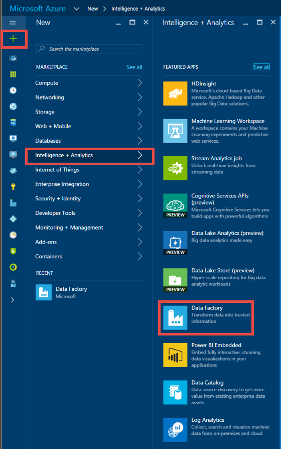
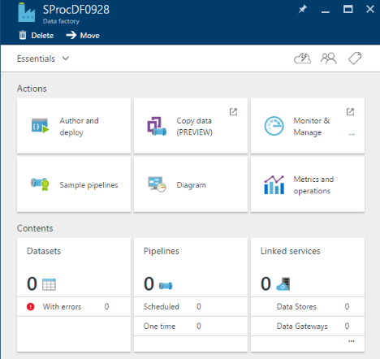
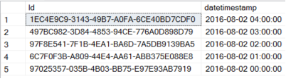

<properties 
    pageTitle="Activité de procédure stockée SQL Server" 
    description="Découvrez comment vous pouvez utiliser l’activité de la procédure stockée SQL Server pour appeler une procédure stockée dans une base de données SQL Azure ou SQL Azure Data Warehouse à partir d’un pipeline de données par défaut." 
    services="data-factory" 
    documentationCenter="" 
    authors="spelluru" 
    manager="jhubbard" 
    editor="monicar"/>

<tags 
    ms.service="data-factory" 
    ms.workload="data-services" 
    ms.tgt_pltfrm="na" 
    ms.devlang="na" 
    ms.topic="article" 
    ms.date="09/30/2016" 
    ms.author="spelluru"/>

# Activité de procédure stockée SQL Server
> [AZURE.SELECTOR]
[Hive](data-factory-hive-activity.md)  
[Cochon](data-factory-pig-activity.md)  
[MapReduce](data-factory-map-reduce.md)  
[Diffusion en continu Hadoop](data-factory-hadoop-streaming-activity.md)
[Apprentissage automatique](data-factory-azure-ml-batch-execution-activity.md) 
[Procédure stockée](data-factory-stored-proc-activity.md)
[Données Lake Analytique U SQL](data-factory-usql-activity.md)
[.NET personnalisé](data-factory-use-custom-activities.md)

Vous pouvez utiliser l’activité de procédure stockée SQL Server dans une usine de données [pipeline](data-factory-create-pipelines.md) pour appeler une procédure stockée dans un des magasins de données suivants : 

- Base de données SQL Azure 
- Data Warehouse SQL Azure  
- Base de données SQL Server dans votre entreprise ou une machine virtuelle Azure. Vous devez installer la passerelle de gestion des données sur le même ordinateur qui héberge la base de données ou sur un ordinateur distinct afin d’éviter la concurrence des ressources avec la base de données. Passerelle de gestion des données est un logiciel qui se connecte données sources/données sources locales hébergés dans Azure machines virtuelles aux services cloud de façon sécurisée et gérée. Voir [déplacer des données entre en local et nuage](data-factory-move-data-between-onprem-and-cloud.md) article pour plus d’informations sur la passerelle de gestion des données. 

Cet article s’appuie sur l’article [activités de transformation de données](data-factory-data-transformation-activities.md) , qui présente une vue d’ensemble de la transformation de données et les activités de transformation pris en charge.

## Procédure pas à pas

### Exemple de tableau et une procédure stockée
1. Créer le **tableau** suivant dans votre base de données SQL Azure avec SQL Server Management Studio ou tout autre outil qui vous maîtrisez. La colonne datetimestamp contient la date et l’heure à laquelle l’ID correspondant est générée. 

        CREATE TABLE dbo.sampletable
        (
            Id uniqueidentifier,
            datetimestamp nvarchar(127)
        )
        GO

        CREATE CLUSTERED INDEX ClusteredID ON dbo.sampletable(Id);
        GO

    ID est identifié uniques et la colonne datetimestamp contient la date et l’heure à laquelle l’ID correspondant est générée.
    

    > [AZURE.NOTE] Cet exemple utilise la base de données SQL Azure mais fonctionne de la même façon pour Azure SQL Data Warehouse et base de données SQL Server. 
2. Créer le suivant **une procédure stockée** qui insère des données dans à la **sampletable**.

        CREATE PROCEDURE sp_sample @DateTime nvarchar(127)
        AS
        
        BEGIN
            INSERT INTO [sampletable]
            VALUES (newid(), @DateTime)
        END

    > [AZURE.IMPORTANT] **Nom** et **la casse** du paramètre (DateTime dans cet exemple) doivent correspondre à celui du paramètre spécifié dans la pipeline/activité JSON. Dans la définition de la procédure stockée, vérifiez que **@** est utilisé comme un préfixe pour le paramètre.
    
### Créer une usine de données  
4. Connectez-vous au [portail Azure](https://portal.azure.com/). 
5. Cliquez sur **Nouveau** dans le menu de gauche, cliquez sur **Intelligence + Analytique**, puis cliquez sur **Data Factory**.
    
       
4.  Dans la carte **nouvelle factory de données** , entrez **SProcDF** pour le nom. Azure Data Factory noms sont **globalement uniques**. Vous devez faire précéder le nom de la factory de données avec votre nom, pour activer la création de réussite d’usine.

          
3.  Sélectionnez votre **abonnement Azure**. 
4.  **Groupe de ressources**, effectuez l’une des opérations suivantes : 
    1.  Cliquez sur **Créer nouveau** et entrez un nom pour le groupe de ressources.
    2.  Cliquez sur **utiliser existant,** puis sélectionnez un groupe de ressources existant.  
5.  Sélectionnez l' **emplacement** pour le factory de données.
6.  Sélectionnez **Ajouter au tableau de bord** afin que vous puissiez voir le factory de données du tableau de bord prochaine fois que vous ouvrez une session. 
6.  Cliquez sur **créer** dans la carte **nouvelle factory de données** .
6.  Vous voyez le factory de données en cours de création dans le **tableau de bord** du portail Azure. Après que le factory de données a été créé avec succès, vous voyez la page par défaut de données, qui indique le contenu de la factory de données.
    

### Création d’un service SQL Azure lié  
Après avoir créé le factory de données, vous créez un service SQL Azure liés entre votre base de données SQL Azure le factory de données. Cette base de données contient la sampletable tableau et sp_sample procédure stockée.

7.  Cliquez sur **auteur et déployer** sur la carte de **Données usine** pour **SProcDF** lancer l’éditeur d’usine de données.
2.  Cliquez sur **nouveau magasin de données** dans la barre de commandes et choisissez la **Base de données SQL Azure**. Vous devriez voir le script JSON pour la création d’un service SQL Azure liées dans l’éditeur. 

    
4. Dans le script JSON, apportez les modifications suivantes : 
    1. Remplacer ** &lt;nom du serveur&gt; ** avec le nom de votre serveur de base de données SQL Azure.
    2. Remplacer ** &lt;databasename&gt; ** avec la base de données dans lequel vous avez créé la table et la procédure stockée.
    3. Remplacer ** &lt; username@servername ** avec le compte d’utilisateur qui a accès à la base de données.
    4. Remplacer ** &lt;mot de passe&gt; ** avec le mot de passe pour le compte d’utilisateur. 

    
5. Dans la barre de commande pour déployer le service lié, cliquez sur **déployer** . Vérifiez que vous voyez la AzureSqlLinkedService dans l’arborescence à gauche. 

    

### Créer un jeu de données de sortie
6. Cliquez sur **... Plus** dans la barre d’outils, cliquez sur **Nouveau groupe de données**, puis cliquez sur **SQL Azure**. **Nouveau groupe de données** dans la barre de commandes et sélectionnez **SQL Azure**.

    
7. Copiez/collez le script JSON suivant dans l’éditeur de JSON.

        {               
            "name": "sprocsampleout",
            "properties": {
                "type": "AzureSqlTable",
                "linkedServiceName": "AzureSqlLinkedService",
                "typeProperties": {
                    "tableName": "sampletable"
                },
                "availability": {
                    "frequency": "Hour",
                    "interval": 1
                }
            }
        }
7. Dans la barre de commande pour déployer le jeu de données, cliquez sur **déployer** . Vérifiez que vous voyez le jeu de données dans l’arborescence. 

    

### Créer un pipeline avec une activité SqlServerStoredProcedure
À présent, nous allons créer une opportunité avec une activité SqlServerStoredProcedure.
 
9. Cliquez sur **... Plus** sur la commande graphiques à barres et cliquez sur **nouveau pipeline**. 
9. Copier/coller l’extrait de JSON suivant. **StoredProcedureName** défini sur **sp_sample**. Nom et la casse du paramètre **DateTime** doivent correspondre au nom et la casse du paramètre dans la définition de la procédure stockée.  

        {
            "name": "SprocActivitySamplePipeline",
            "properties": {
                "activities": [
                    {
                        "type": "SqlServerStoredProcedure",
                        "typeProperties": {
                            "storedProcedureName": "sp_sample",
                            "storedProcedureParameters": {
                                "DateTime": "$$Text.Format('{0:yyyy-MM-dd HH:mm:ss}', SliceStart)"
                            }
                        },
                        "outputs": [
                            {
                                "name": "sprocsampleout"
                            }
                        ],
                        "scheduler": {
                            "frequency": "Hour",
                            "interval": 1
                        },
                        "name": "SprocActivitySample"
                    }
                ],
                "start": "2016-08-02T00:00:00Z",
                "end": "2016-08-02T05:00:00Z",
                "isPaused": false
            }
        }

    Si vous devez passer null pour un paramètre, utilisez la syntaxe : « param1 » : null (tout en minuscules). 
9. Dans la barre d’outils pour déployer le pipeline de, cliquez sur **déployer** .  

### Surveiller le pipeline

6. Cliquez sur **X** pour fermer les cartes de données usine éditeur et pour revenir à la carte de données par défaut, puis cliquez sur **diagramme**.

    
7. Dans la **Vue de diagramme**, vous voyez une vue d’ensemble des pipelines et des jeux de données utilisés dans ce didacticiel. 

    
8. Dans la vue de diagramme, double-cliquez sur le jeu de données **sprocsampleout**. Vous voyez les secteurs dans l’état prêt. Il convient de cinq secteurs, car un secteur est généré pour chaque heure comprise entre le début et heure de fin de la JSON.

     
10. Lorsqu’un secteur est **prête** , exécutez une * *Sélectionnez* dans sampletable** requête sur la base de données SQL Azure pour vérifier que les données a été insérées dans la table par la procédure stockée.

    

    Pour plus d’informations sur l’analyse des pipelines Azure Data Factory, voir [Moniteur du pipeline](data-factory-monitor-manage-pipelines.md) .  

> [AZURE.NOTE] Dans cet exemple, la SprocActivitySample a pas d’entrées. Si vous souhaitez bicyclette cette activité avec une activité en amont (autrement dit, traitement préalable), les résultats de l’activité en amont peuvent être utilisées comme entrées dans cette activité. Dans ce cas, cette activité ne s’exécute pas jusqu'à ce que l’activité en amont est terminée et les sorties des activités en amont sont disponibles (l’état prêt). Les entrées ne peuvent pas être utilisées directement en tant que paramètre à l’activité de procédure stockée

## Format JSON
    {
        "name": "SQLSPROCActivity",
        "description": "description", 
        "type": "SqlServerStoredProcedure",
        "inputs":  [ { "name": "inputtable"  } ],
        "outputs":  [ { "name": "outputtable" } ],
        "typeProperties":
        {
            "storedProcedureName": "<name of the stored procedure>",
            "storedProcedureParameters":  
            {
                "param1": "param1Value"
                …
            }
        }
    }

## Propriétés JSON

Propriété | Description | Obligatoire
-------- | ----------- | --------
nom | Nom de l’activité | Oui
Description | Texte décrivant à quoi sert l’activité | N°
type | SqlServerStoredProcedure | Oui
entrées | Facultatif. Si vous spécifiez un jeu de données d’entrée, il doit être disponible (l’état « Prêt ») pour l’activité de procédure stockée à exécuter. Le jeu de données d’entrée ne peut pas être utilisée dans la procédure stockée en tant que paramètre. Il est utilisé uniquement pour vérifier la dépendance avant le démarrage de l’activité de procédure stockée. | N°
sorties | Vous devez spécifier un jeu de données de sortie d’une activité de procédure stockée. Jeu de données de sortie spécifie la **planification** de l’activité de procédure stockée (toutes les heures, hebdomadaire, mensuelle, etc.).   Le jeu de données de sortie devez utiliser un **service liée** qui fait référence à une base de données SQL Azure ou un magasin de données SQL Azure ou une base de données SQL Server dans lequel vous souhaitez la procédure stockée à exécuter.   Le jeu de données de sortie peut servir d’une manière de passer le résultat de la procédure stockée pour ultérieures par une autre activité ([chaîne activités](data-factory-scheduling-and-execution.md#chaining-activities)) dans le pipeline de traitement. Toutefois, Data Factory n’écrit pas automatiquement de la sortie d’une procédure stockée dans ce groupe de données. Il s’agit de la procédure stockée écrit dans une table SQL vers le jeu de données de sortie.   Dans certains cas, le jeu de données de sortie peut être un **dataset factice**, qui est utilisé uniquement pour spécifier la planification pour l’exécution de l’activité de procédure stockée. | Oui
storedProcedureName | Spécifiez le nom de la procédure stockée dans la base de données SQL Azure ou entrepôt de données SQL Azure qui est représenté par le service lié qui utilise la table de sortie. | Oui
storedProcedureParameters | Spécifier des valeurs pour les paramètres de la procédure stockée. Si vous avez besoin de passer null pour un paramètre, utilisez la syntaxe : « param1 » : null (minuscules). Voir l’exemple suivant pour en savoir plus sur l’utilisation de cette propriété.| N°

## Passage d’une valeur statique 
À présent, nous allons vous pouvez ajouter une autre colonne nommée « Scénario » dans la table contenant une valeur statique appelée « Document exemple ».

    CREATE PROCEDURE sp_sample @DateTime nvarchar(127) , @Scenario nvarchar(127)
    
    AS
    
    BEGIN
        INSERT INTO [sampletable]
        VALUES (newid(), @DateTime, @Scenario)
    END

À présent, passez le paramètre de scénario et la valeur de l’activité de procédure stockée. La section typeProperties dans l’exemple précédent ressemble à l’extrait de code suivante :

    "typeProperties":
    {
        "storedProcedureName": "sp_sample",
        "storedProcedureParameters": 
        {
            "DateTime": "$$Text.Format('{0:yyyy-MM-dd HH:mm:ss}', SliceStart)",
            "Scenario": "Document sample"
        }
    }

