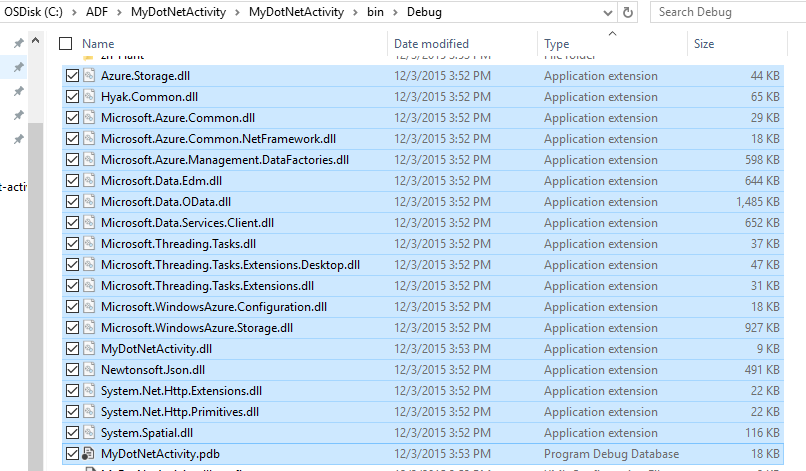

<properties
    pageTitle="Utiliser des activités personnalisées dans un pipeline Azure Data Factory"
    description="Découvrez comment créer des activités personnalisées et les utiliser dans un pipeline Azure Data Factory."
    services="data-factory"
    documentationCenter=""
    authors="spelluru"
    manager="jhubbard"
    editor="monicar"/>

<tags
    ms.service="data-factory"
    ms.workload="data-services"
    ms.tgt_pltfrm="na"
    ms.devlang="na"
    ms.topic="article"
    ms.date="10/17/2016"
    ms.author="spelluru"/>

# Utiliser des activités personnalisées dans un pipeline Azure Data Factory
> [AZURE.SELECTOR]
[Hive](data-factory-hive-activity.md)  
[Cochon](data-factory-pig-activity.md)  
[MapReduce](data-factory-map-reduce.md)  
[Diffusion en continu Hadoop](data-factory-hadoop-streaming-activity.md)
[Apprentissage automatique](data-factory-azure-ml-batch-execution-activity.md) 
[Procédure stockée](data-factory-stored-proc-activity.md)
[Données Lake Analytique U SQL](data-factory-usql-activity.md)
[.NET personnalisé](data-factory-use-custom-activities.md)

Il existe deux types d’activités que vous pouvez utiliser dans un pipeline Azure Data Factory.
 
- [Activités de déplacement des données](data-factory-data-movement-activities.md) pour déplacer des données entre [banques de données de prise en charge](data-factory-data-movement-activities.md#supported-data-stores).
- [Activités de Transformation des données](data-factory-data-transformation-activities.md) à l’aide de données/du processus de transformation calcule tels que Azure HDInsight lot Azure et apprentissage automatique Azure. Par exemple : HDInsight Hive et l’exécution du lot apprentissage Machine.  

Si vous avez besoin déplacer des données vers ou à partir d’un magasin de données qui n’est pas pris en charge par Azure Data Factory, vous pouvez créer une activité personnalisée .NET avec votre propre logique de déplacement de données et utiliser l’activité dans le pipeline. 

De même, si vous avez besoin pour transformation/traiter les données d’une manière qui n’est pas pris en charge par Data Factory, vous pouvez créer une activité personnalisée avec votre propre logique de traitement des données et utiliser l’activité dans le pipeline.

> [AZURE.NOTE] Pour l’instant, passerelle de gestion des données prend en charge uniquement l’activité de copie et l’activité de procédure stockée dans Data Factory. Il n’est pas possible d’utiliser la passerelle à partir d’une activité personnalisée pour accéder aux sources de données locales.
 
Vous pouvez configurer l’activité .NET personnalisée à exécuter à l’aide d’un service **d’Azure lot** ou un cluster **Azure HDInsight** .   

La procédure suivante fournit des instructions détaillées pour créer une activité personnalisée .NET et à l’aide de l’activité personnalisée dans un pipeline. La procédure pas à pas utilise le service **Azure lot** lié. Utiliser la Azure HDInsight lié service au lieu de cela, vous créez un service lié de type **HDInsight** (si vous utilisez votre propre cluster HDInsight) ou **HDInsightOnDemand** (si vous voulez Factory de données pour créer une HDInsight cluster à la demande) et l’utiliser dans la section activité du pipeline JSON (**linkedServiceName**). Consultez la section [utilisation Azure HDInsight lié services](#use-azure-hdinsight-linked-services) pour plus d’informations sur l’utilisation de Azure HDInsight pour exécuter l’activité personnalisée.

> [AZURE.IMPORTANT] Version du jeu 4.5.2 du .NET Framework comme pour votre projet d’une activité personnalisée dans Visual Studio .NET framework cible. Données usine ne reconnaît pas les activités personnalisées compilées par rapport aux versions .NET Framework 4.5.2 au plus tard.   

## Procédure pas à pas 

### Conditions préalables

- Visual Studio 2012/2013/2015
- Téléchargez et installez le [Kit de développement .NET Azure][azure-developer-center]

### Conditions préalables lot Azure
Dans la procédure pas à pas, vous exécutez vos activités .NET personnalisées à l’aide du lot Azure comme une ressource de cluster. Voir [concepts Azure lot] [ batch-technical-overview] pour une vue d’ensemble du lot Azure service et consultez [Prise en main la bibliothèque par lots Azure pour .NET] [ batch-get-started] pour commencer rapidement avec le service lot Azure.

Dans le didacticiel, vous devez créer un compte Azure lot avec un pool de machines virtuelles. Voici les étapes :

1. Créez un **compte Azure lot** à l’aide du [portail Azure](http://manage.windowsazure.com). Voir [créer et gérer un compte Azure lot] [ batch-create-account] article pour obtenir des instructions. Notez la clé de compte et nom de compte Azure lot.

    Vous pouvez également utiliser [New-AzureBatchAccount] [ new-azure-batch-account] applet de commande pour créer un compte Azure lot. Voir [Utilisation de PowerShell pour gérer le compte lot Azure Azure] [ azure-batch-blog] pour obtenir des instructions détaillées sur l’utilisation de cette applet de commande.
2. Créer un **lot Azure pool**.
    1. Dans le [portail Azure](https://portal.azure.com), cliquez sur **Parcourir** dans le menu de gauche, puis cliquez sur **Comptes lot**. 
    2. Sélectionnez votre compte Azure lot pour ouvrir la carte **Lot de compte** . 
    3. Cliquez sur **Pools** vignette.
    4. Dans la carte **des Pools** , sur le bouton Ajouter dans la barre d’outils pour ajouter un regroupement.
        1. Entrez un ID pour le regroupement (**ID du Pool**). Notez l' **ID du pool**; vous avez besoin lorsque vous créez la solution Data Factory. 
        2. Spécifiez **Windows Server 2012 R2** pour le paramètre de famille de systèmes d’exploitation.
        3. Sélectionnez un **niveau de tarification nœud**. 
        3. Entrez **2** en tant que valeur du paramètre **Cible dédié** .
        4. Entrez **2** en tant que valeur du paramètre de **tâches Max par nœud** .
    5. Cliquez sur **OK** pour créer le pool. 
 
    Vous pouvez également utiliser l’applet de commande [New-AzureBatchPool](https://msdn.microsoft.com/library/mt628690.aspx) pour créer un pool lot Azure.    

### Principales étapes à suivre 
1.  **Créer une activité personnalisée** à utiliser un pipeline de données par défaut. L’activité personnalisée dans cet exemple contient la logique de transformation/traitement de données. 
    1.  Dans Visual Studio, créez un projet de bibliothèque de classes .NET, ajoutez le code pour traiter les données d’entrée et compiler le projet. 
    2.  Code postal tous les fichiers binaires et le fichier PDB (facultatif), dans le dossier de sortie.  
    3.  Téléchargez le fichier zip à Azure blob storage. Les étapes détaillées se trouvent dans la créer la section d’une activité personnalisée. 
2. **Créer une usine de données Azure qui utilise l’activité personnalisée**:
    1. Créer une usine de données Azure.
    2. Créer des services liées.
        1. AzureStorageLinkedService : Fournit des informations d’identification de stockage pour accéder à des objets BLOB.
        2. AzureBatchLinkedService : Spécifie Azure lot comme calculer.
    3. Créer des groupes de données.
        1. InputDataset : Spécifie le conteneur de stockage et un dossier pour les objets BLOB d’entrée.
        1. OuputDataset : Spécifie le conteneur de stockage et un dossier pour les objets BLOB de sortie.
    2. Créer un pipeline qui utilise l’activité personnalisée.
    3. Exécutez et testez le pipeline.
    4. Déboguer le pipeline.

## Créer une activité personnalisée
Pour créer une activité personnalisée .NET, créez un projet de **Bibliothèque de classes .NET** avec une classe qui mettent en œuvre, cette interface **IDotNetActivity** . Cette interface comporte une seule méthode : [Execute](https://msdn.microsoft.com/library/azure/mt603945.aspx) et sa signature est :

    public IDictionary<string, string> Execute(
            IEnumerable<LinkedService> linkedServices, 
            IEnumerable<Dataset> datasets, 
            Activity activity, 
            IActivityLogger logger)
        

La méthode prend quatre paramètres :

- **linkedServices**. Cette propriété est une liste énumérable de services liées lier des sources de données d’entrée/sortie (par exemple : stockage d’objets Blob Azure) à l’usine de données. Dans cet exemple, il n'est qu’un seul service lié de type stockage Azure utilisé pour l’entrée et sortie. 
- **jeux de données**. Cette propriété est une liste énumérable des jeux de données. Vous pouvez utiliser ce paramètre pour obtenir les emplacements et les schémas définis par jeux de données d’entrée et de sortie.
- **activité**. Cette propriété représente la cluster entité actuelle - dans ce cas, un lot Azure.
- **Enregistreur d’événements**. Cet objet vous permet d’écrire des commentaires de débogage survenant en tant que le journal « Utilisateurs » pour le pipeline. 

La méthode retourne un dictionnaire qui peut être utilisé pour monter en cascade des activités personnalisées à l’avenir. Cette fonctionnalité n’est pas encore implémentée, aussi retourner un dictionnaire vide à partir de la méthode.  

### Procédure 
1.  Créer un projet de **Bibliothèque de classes .NET** .
    <ol type="a">
        <li>Lancez <b>Visual Studio 2015</b> ou <b>Visual Studio 2013</b> ou <b>Visual Studio 2012</b>.</li>
        <li>Cliquez sur <b>fichier</b>, pointez sur <b>Nouveau</b>, puis cliquez sur <b>projet</b>.</li>
        <li>Développez <b>modèles</b>, puis sélectionnez <b>Visual c#</b>. Dans cette procédure pas à pas, vous utilisez c#, mais vous pouvez utiliser n’importe quelle langue .NET pour développer l’activité personnalisée.</li>
        <li>Sélectionnez la <b>Bibliothèque de classes</b> dans la liste des types de projets à droite.</li>
        <li>Entrez <b>MyDotNetActivity</b> pour le <b>nom</b>.</li>
        <li>Sélectionnez <b>C:\ADFGetStarted</b> à l' <b>emplacement</b>.</li>
        <li>Cliquez sur <b>OK</b> pour créer le projet.</li>
    </ol>
2.  Cliquez sur **Outils**, pointez sur **Gestionnaire de Package NuGet**, puis cliquez sur **Gestionnaire de Package Console**.
3.  Dans la Console Gestionnaire de Package, exécutez la commande suivante pour importer **Microsoft.Azure.Management.DataFactories**.

        Install-Package Microsoft.Azure.Management.DataFactories

4. Importer le package NuGet **Stockage Azure** au projet.

        Install-Package Azure.Storage

5. Ajoutez les instructions suivantes **à l’aide** pour le fichier source dans le projet.

        using System.IO;
        using System.Globalization;
        using System.Diagnostics;
        using System.Linq;

        using Microsoft.Azure.Management.DataFactories.Models;
        using Microsoft.Azure.Management.DataFactories.Runtime;

        using Microsoft.WindowsAzure.Storage;
        using Microsoft.WindowsAzure.Storage.Blob;

6. Modifier le nom de l' **espace de noms** pour **MyDotNetActivityNS**.

        namespace MyDotNetActivityNS

7. Remplacez le nom de la classe **MyDotNetActivity** et il dérivent de l’interface **IDotNetActivity** comme le montre l’extrait de code suivantes :

        public class MyDotNetActivity : IDotNetActivity

8. Implémentez méthode (Ajouter) l' **exécution** de l’interface **IDotNetActivity** à la classe **MyDotNetActivity** et copiez le code suivant à la méthode.

    L’exemple suivant compte le nombre d’occurrences du terme de recherche (« Microsoft ») dans chaque blob associé à un secteur de données. 

        /// 

        /// Execute method is the only method of IDotNetActivity interface you must implement. 
        /// In this sample, the method invokes the Calculate method to perform the core logic.  
        /// 

        public IDictionary<string, string> Execute(
            IEnumerable<LinkedService> linkedServices,
            IEnumerable<Dataset> datasets,
            Activity activity,
            IActivityLogger logger)
        {
            // to get extended properties (for example: SliceStart)
            DotNetActivity dotNetActivity = (DotNetActivity)activity.TypeProperties;
            string sliceStartString = dotNetActivity.ExtendedProperties["SliceStart"];

            // to log all extended properties           
            IDictionary<string, string> extendedProperties = dotNetActivity.ExtendedProperties;
            logger.Write("Logging extended properties if any...");
            foreach (KeyValuePair<string, string> entry in extendedProperties)
            {
                logger.Write("<key:{0}> <value:{1}>", entry.Key, entry.Value);
            }
        
            // declare types for input and output data stores
            AzureStorageLinkedService inputLinkedService;

            // declare dataset types
            CustomDataset inputLocation;
            AzureBlobDataset outputLocation;

            Dataset inputDataset = datasets.Single(dataset => dataset.Name == activity.Inputs.Single().Name);
            inputLocation = inputDataset.Properties.TypeProperties as CustomDataset;

            foreach (LinkedService ls in linkedServices)
                logger.Write("linkedService.Name {0}", ls.Name);

            // using First method instead of Single since we are using the same 
            // Azure Storage linked service for input and output. 
            inputLinkedService = linkedServices.First(
                linkedService =>
                linkedService.Name ==
                inputDataset.Properties.LinkedServiceName).Properties.TypeProperties
                as AzureStorageLinkedService;

            string connectionString = inputLinkedService.ConnectionString; 

            // To create an input storage client.
            string folderPath = GetFolderPath(inputDataset);
            string output = string.Empty; // for use later.

            // create storage client for input. Pass the connection string.
            CloudStorageAccount inputStorageAccount = CloudStorageAccount.Parse(connectionString);
            CloudBlobClient inputClient = inputStorageAccount.CreateCloudBlobClient();

            // initialize the continuation token before using it in the do-while loop.
            BlobContinuationToken continuationToken = null;
            do
            {   // get the list of input blobs from the input storage client object.
                BlobResultSegment blobList = inputClient.ListBlobsSegmented(folderPath,
                                         true,
                                         BlobListingDetails.Metadata,
                                         null,
                                         continuationToken,
                                         null,
                                         null);
                
                // Calculate method returns the number of occurrences of 
                // the search term (“Microsoft”) in each blob associated
                // with the data slice. definition of the method is shown in the next step.
 
                output = Calculate(blobList, logger, folderPath, ref continuationToken, "Microsoft");

            } while (continuationToken != null);

            // get the output dataset using the name of the dataset matched to a name in the Activity output collection.
            Dataset outputDataset = datasets.Single(dataset => dataset.Name == activity.Outputs.Single().Name);
            // convert to blob location object.
            outputLocation = outputDataset.Properties.TypeProperties as AzureBlobDataset;

            folderPath = GetFolderPath(outputDataset);

            logger.Write("Writing blob to the folder: {0}", folderPath);

            // create a storage object for the output blob.
            CloudStorageAccount outputStorageAccount = CloudStorageAccount.Parse(connectionString);
            // write the name of the file. 
            Uri outputBlobUri = new Uri(outputStorageAccount.BlobEndpoint, folderPath + "/" + GetFileName(outputDataset));

            logger.Write("output blob URI: {0}", outputBlobUri.ToString());
            // create a blob and upload the output text.
            CloudBlockBlob outputBlob = new CloudBlockBlob(outputBlobUri, outputStorageAccount.Credentials);
            logger.Write("Writing {0} to the output blob", output);
            outputBlob.UploadText(output);

            // The dictionary can be used to chain custom activities together in the future.
            // This feature is not implemented yet, so just return an empty dictionary.  

            return new Dictionary<string, string>();
        }

9. Ajoutez les méthodes d’assistance suivantes. La méthode **Execute** appelle ces méthodes d’assistance. La méthode **GetConnectionString** récupère la chaîne de connexion de stockage Azure et la méthode **GetFolderPath** récupère l’emplacement d’objets blob. Surtout, la méthode **Calculate** isole le code parcourt chaque blob.

        /// 

        /// Gets the folderPath value from the input/output dataset.
        /// 

        private static string GetFolderPath(Dataset dataArtifact)
        {
            if (dataArtifact == null || dataArtifact.Properties == null)
            {
                return null;
            }

            AzureBlobDataset blobDataset = dataArtifact.Properties.TypeProperties as AzureBlobDataset;
            if (blobDataset == null)
            {
                return null;
            }

            return blobDataset.FolderPath;
        }

        /// 

        /// Gets the fileName value from the input/output dataset.   
        /// 

        private static string GetFileName(Dataset dataArtifact)
        {
            if (dataArtifact == null || dataArtifact.Properties == null)
            {
                return null;
            }

            AzureBlobDataset blobDataset = dataArtifact.Properties.TypeProperties as AzureBlobDataset;
            if (blobDataset == null)
            {
                return null;
            }

            return blobDataset.FileName;
        }

        /// 

        /// Iterates through each blob (file) in the folder, counts the number of instances of search term in the file, 
        /// and prepares the output text that is written to the output blob. 
        /// 

        public static string Calculate(BlobResultSegment Bresult, IActivityLogger logger, string folderPath, ref BlobContinuationToken token, string searchTerm)
        {
            string output = string.Empty;
            logger.Write("number of blobs found: {0}", Bresult.Results.Count<IListBlobItem>());
            foreach (IListBlobItem listBlobItem in Bresult.Results)
            {
                CloudBlockBlob inputBlob = listBlobItem as CloudBlockBlob;
                if ((inputBlob != null) && (inputBlob.Name.IndexOf("$$$.$$$") == -1))
                {
                    string blobText = inputBlob.DownloadText(Encoding.ASCII, null, null, null);
                    logger.Write("input blob text: {0}", blobText);
                    string[] source = blobText.Split(new char[] { '.', '?', '!', ' ', ';', ':', ',' }, StringSplitOptions.RemoveEmptyEntries);
                    var matchQuery = from word in source
                                     where word.ToLowerInvariant() == searchTerm.ToLowerInvariant()
                                     select word;
                    int wordCount = matchQuery.Count();
                    output += string.Format("{0} occurrences(s) of the search term \"{1}\" were found in the file {2}.\r\n", wordCount, searchTerm, inputBlob.Name);
                }
            }
            return output;
        }

    La méthode GetFolderPath renvoie le chemin d’accès au dossier qui dataset pointe vers et la méthode GetFileName retourne le nom de la blob/fichier sur lequel pointe le jeu de données. Si vous havefolderPath définit à l’aide de variables, telles que {Year}, {mois}, renvoie {Day} etc., la méthode la chaîne telle qu’elle est sans remplaçant par des valeurs d’exécution. Pour plus d’informations sur l’accès aux SliceStart, SliceEnd, etc., reportez-vous à la section [accès des propriétés étendues](#access-extended-properties) .    
    
            "name": "InputDataset",
            "properties": {
                "type": "AzureBlob",
                "linkedServiceName": "AzureStorageLinkedService",
                "typeProperties": {
                    "fileName": "file.txt",
                    "folderPath": "adftutorial/inputfolder/",
    
    La méthode Calculate calcule le nombre d’instances du mot clé Microsoft dans les fichiers d’entrée (BLOB dans le dossier). Le terme à rechercher (« Microsoft ») est codé en dur dans le code.

10. Compiler le projet. Cliquez sur **créer** à partir du menu, puis cliquez sur **Générer la Solution**.

    > [AZURE.IMPORTANT] Version du jeu 4.5.2 du .NET Framework comme framework cible pour votre projet : droit sur le projet, puis cliquez sur **Propriétés** pour définir l’infrastructure cible. Données usine ne reconnaît pas les activités personnalisées compilées par rapport aux versions .NET Framework 4.5.2 au plus tard. 
11. Lancez **l’Explorateur Windows**, puis accédez au dossier **bin\debug** ou **bin\release** selon le type de génération.
12. Créer un fichier zip **MyDotNetActivity.zip** qui contient tous les fichiers binaires dans le <project folder>dossier \bin\Debug. Vous souhaiterez peut-être inclure le fichier **MyDotNetActivity.pdb** afin que vous obtenez des détails supplémentaires comme numéro de ligne dans le code source qui a provoqué le problème si une erreur s’est produite. Tous les fichiers dans le fichier zip pour l’activité personnalisée doivent être au **niveau supérieur** avec aucune sous-dossiers.

    
13. Télécharger **MyDotNetActivity.zip** comme un objet blob au conteneur blob : **customactivitycontainer** dans le stockage blob Azure que **AzureStorageLinkedService** lié service dans **ADFTutorialDataFactory** utilise.  Créer le conteneur de blob **customactivitycontainer** s’il n’existe pas déjà.

> [AZURE.NOTE] Si vous ajoutez ce projet activité .NET en une solution dans Visual Studio qui contient un projet de données par défaut et ajoutez une référence au projet d’activité .NET à partir du projet application Data Factory, vous n’avez pas besoin d’effectuer les deux dernières étapes de création du fichier zip et téléchargez-le dans le stockage blob Azure manuellement. Lorsque vous publiez entités Factory de données à l’aide de Visual Studio, ces étapes sont exécutées automatiquement par le processus de publication. Voir les articles [créer votre première pipeline à l’aide de Visual Studio](data-factory-build-your-first-pipeline-using-vs.md) et [copier des données d’objets Blob Azure SQL Azure](data-factory-copy-activity-tutorial-using-visual-studio.md) pour en savoir plus sur la création et la publication entités Factory de données à l’aide de Visual Studio.  

### Exécuter la méthode

Cette section fournit des autres détails et remarques sur le code dans la méthode **Execute** .
 
1. Les membres d’itération au sein de la collection d’entrée sont trouvent dans l’espace de noms [Microsoft.WindowsAzure.Storage.Blob](https://msdn.microsoft.com/library/azure/microsoft.windowsazure.storage.blob.aspx) . Parcourez la collection d’objets blob nécessite l’utilisation de la classe **BlobContinuationToken** . En résumé, vous devez utiliser un-tandis que boucle avec le jeton comme mécanisme pour sortir de la boucle. Pour plus d’informations, voir [comment utiliser le stockage Blob de .NET](../storage/storage-dotnet-how-to-use-blobs.md). Voici une boucle de base :

        // Initialize the continuation token.
        BlobContinuationToken continuationToken = null;
        do
        {   
            // Get the list of input blobs from the input storage client object.
            BlobResultSegment blobList = inputClient.ListBlobsSegmented(folderPath,
                                      true,
                                      BlobListingDetails.Metadata,
                                      null,
                                      continuationToken,
                                      null,
                                      null);
            // Return a string derived from parsing each blob.
            output = Calculate(blobList, logger, folderPath, ref continuationToken, "Microsoft");
        } while (continuationToken != null);

    Consultez la documentation de la méthode [ListBlobsSegmented](https://msdn.microsoft.com/library/jj717596.aspx) pour plus d’informations.

2.  Le code pour l’utilisation de l’ensemble des objets BLOB logiquement accède au sein de la ne-tout en boucle. Dans la méthode **Execute** , ne-alors que boucle passe la liste des objets BLOB à une méthode nommée **Calculate**. La méthode retourne une variable chaîne nommée **sortie** qui est le résultat d’avoir parcouru tous les objets BLOB dans le segment. 

    Elle renvoie le nombre d’occurrences du terme de recherche (**Microsoft**) dans le blob passé à la méthode de **calcul** . 

            output += string.Format("{0} occurrences of the search term \"{1}\" were found in the file {2}.\r\n", wordCount, searchTerm, inputBlob.Name);

3.  Une fois que la méthode **Calculate** a terminé le travail, elle doit être écrite dans un nouveau blob. Donc pour chaque jeu d’objets BLOB traitées, un nouveau blob peut être écrites avec les résultats. Pour écrire dans un nouveau blob, tout d’abord rechercher le jeu de données de sortie. 

            // Get the output dataset using the name of the dataset matched to a name in the Activity output collection.
            Dataset outputDataset = datasets.Single(dataset => dataset.Name == activity.Outputs.Single().Name);

            // Convert to blob location object.
            outputLocation = outputDataset.Properties.TypeProperties as AzureBlobDataset;

4.  Le code appelle également une méthode d’assistance : **GetFolderPath** pour extraire le chemin du dossier (le nom du conteneur stockage).
 
            folderPath = GetFolderPath(outputDataset);

    La **GetFolderPath** effectue un cast de l’objet DataSet pour un AzureBlobDataSet, c'est-à-dire une propriété nommée FolderPath.
            
            AzureBlobDataset blobDataset = dataArtifact.Properties.TypeProperties as AzureBlobDataset;
            
            return blobDataset.FolderPath;

5.  Le code appelle la méthode **GetFileName** pour extraire le nom du fichier (nom d’objets blob).  

            AzureBlobDataset blobDataset = dataArtifact.Properties.TypeProperties as AzureBlobDataset;

            return blobDataset.FileName;

6.  Le nom du fichier est écrit en créant un objet URI. Le constructeur URI utilise la propriété **BlobEndpoint** pour renvoyer le nom du conteneur. Le nom de fichier et le chemin du dossier sont ajoutés à construire le blob de sortie URI.  

            // Write the name of the file. 
            Uri outputBlobUri = new Uri(outputStorageAccount.BlobEndpoint, folderPath + "/" + GetFileName(outputDataset));

7.  Le nom du fichier a été écrit et maintenant vous pouvez écrire la chaîne de sortie à partir de la méthode de calcul dans un nouveau blob :

            // Create a blob and upload the output text.
            CloudBlockBlob outputBlob = new CloudBlockBlob(outputBlobUri, outputStorageAccount.Credentials);
            logger.Write("Writing {0} to the output blob", output);
            outputBlob.UploadText(output);

## Créer le factory de données à l’aide du portail Azure

Dans la section **créer une activité personnalisée** , vous avez créé une activité personnalisée et téléchargé le fichier zip avec des fichiers binaires et le fichier PDB dans un conteneur d’objets blob Azure. Dans cette section, vous créez une **usine de données** Azure avec un **pipeline** qui utilise l' **activité personnalisée**.
 
Le jeu de données d’entrée pour l’activité personnalisée représente les objets BLOB (fichiers) dans le dossier d’entrée (adftutorial\inputfolder) dans le stockage blob. Le dataset de sortie pour l’activité représente les objets BLOB de sortie dans le dossier de sortie (adftutorial\outputfolder) dans le stockage blob. 

Créez un fichier nommé **fichier.txt** avec le contenu suivant et téléchargez-le sur **adftutorial\inputfolder** (adftutorial est le nom du conteneur blob Azure et inputfolder est le nom du dossier dans ce conteneur).

    test custom activity Microsoft test custom activity Microsoft

Le dossier d’entrée correspond à un secteur dans Azure Data Factory même si le dossier comporte deux ou plusieurs fichiers. Lorsque chaque secteur est traité par le pipeline, l’activité personnalisée parcourt tous les objets BLOB dans le dossier d’entrée pour cette section. 

Vous voyez un fichier avec dans le dossier adftutorial\output de sortie avec une ou plusieurs lignes (identique au nombre d’objets BLOB dans le dossier d’entrée) :
 
    2 occurrences(s) of the search term "Microsoft" were found in the file inputfolder/2015-11-16-00/file.txt.

Voici les étapes que vous effectuez dans cette section :

1. Créer une **usine de données**.
2. **Services lié** pour le pool Azure lot de machines virtuelles sur lequel s’exécute l’activité personnalisée et le stockage Azure qui contient les objets BLOB d’entrée/sortie. 
2. Entrée et de sortie **des groupes de données** qui représentent d’entrée et sortie de l’activité personnalisée. 
3. **Pipeline** qui utilise l’activité personnalisée.
4. **Usine de données**. Vous créez une lorsque vous publiez ces entités sur Azure. 

> [AZURE.NOTE] Créer le **fichier.txt** et téléchargez-le sur un conteneur blob si vous n’avez pas déjà fait. Consultez les instructions ci-dessus.  

### Étape 1 : Créer le factory de données

1.  Après la connexion au portail Azure, procédez comme suit :
    1.  Cliquez sur **Nouveau** dans le menu de gauche.
    2.  Cliquez sur **données + Analytique** dans la carte de **Nouveau** .
    3.  Cliquez sur **Data Factory** dans la carte **analytique de données** .
2.  Dans la carte **nouvelle factory de données** , entrez **CustomActivityFactory** pour le nom. Le nom de la factory données Azure doit être globalement unique. Si vous recevez l’erreur : **nom d’usine données « CustomActivityFactory » n’est pas disponible**, modifiez le nom de la factory de données (par exemple, **yournameCustomActivityFactory**) et essayez à nouveau de créer.
3.  Cliquez sur **Nom du groupe ressources**et sélectionnez un groupe de ressources existant ou créer un groupe de ressources. 
4.  Vérifiez que vous utilisez correcte **abonnement** et la **zone** où vous souhaitez le factory de données à créer. 
5.  Cliquez sur **créer** dans la carte **nouvelle factory de données** .
6.  Vous voyez le factory de données en cours de création dans le **tableau de bord** du portail Azure.
7.  Après que le factory de données a été créé avec succès, vous voyez la carte Data Factory, qui indique le contenu de la factory de données.

### Étape 2 : Créer des services liées

Services liés lier banques de données ou le calculent des services à une usine de données Azure. Dans cette étape, vous liez votre compte de stockage Azure et compte Azure lot à votre usine de données.

#### Créer le service de stockage Azure lié

1.  Cliquez sur le **auteur et déployer** vignette sur la carte de **Données par défaut** pour **CustomActivityFactory**. Vous voyez l’éditeur d’usine de données.
2.  Cliquez sur **nouveau magasin de données** dans la barre de commandes et choisissez le **stockage Azure**. Vous devriez voir le script JSON pour la création d’un service de stockage Azure liées dans l’éditeur.
3.  Remplacez le **nom du compte** avec le nom de votre compte de stockage Azure et la **clé de compte** avec la touche d’accès du compte de stockage Azure. Pour savoir comment obtenir votre clé d’accès de stockage, voir [Afficher, copier et stockage régénérer les touches d’accès](../storage/storage-create-storage-account.md#view-copy-and-regenerate-storage-access-keys).
4.  Dans la barre de commande pour déployer le service lié, cliquez sur **déployer** .

#### Créer le lot Azure lié service

2. Dans l’éditeur d’usine de données, cliquez sur **Nouveau calcul** à partir de la barre de commandes et sélectionnez **Azure lot** dans le menu.
3. Apportez les modifications suivantes au script JSON :
    1. Spécifiez le nom du compte Azure lot pour la propriété **nom de compte** . L' **URL** à partir de la **carte de compte Azure lot** est au format suivant : http://**nom de compte**. region.batch.azure.com. Pour la propriété **batchUri** dans le JSON, vous devez **Supprimer « nom de compte ».** à partir de l’URL et utilisez le **nom de compte** pour la propriété JSON **nom de compte** .
    2. Spécifier la clé de compte Azure lot pour la propriété **accessKey** . 
    3. Spécifiez le nom du pool que vous avez créé dans le cadre de conditions préalables pour la propriété **poolName** . Vous pouvez également spécifier l’ID du pool plutôt que le nom du pool.
    4. Spécifiez Azure lot URI pour la propriété **batchUri** . Consultez les remarques au-dessus de propriété **nom de compte** . Exemple : https://westus.batch.azure.com.  
    5. Spécifier **AzureStorageLinkedService** pour la propriété **linkedServiceName** .
        
            {
              "name": "AzureBatchLinkedService",
              "properties": {
                "type": "AzureBatch",
                "typeProperties": {
                  "accountName": "myazurebatchaccount",
                  "batchUri": "https://westus.batch.azure.com",
                  "accessKey": "<yourbatchaccountkey>",
                  "poolName": "myazurebatchpool",
                  "linkedServiceName": "AzureStorageLinkedService"
                }
              }
            }

        Pour la propriété **poolName** , vous pouvez également spécifier l’ID du pool plutôt que le nom du pool.

    > [AZURE.NOTE] Le service de données par défaut ne reconnaît pas une option à la demande pour Azure lot comme nous le faisons pour HDInsight. Vous ne pouvez utiliser votre propre pool Azure lot dans une usine de données Azure.
    
### Étape 3 : Créer des groupes de données
Dans cette étape, vous créez des groupes de données pour représenter les données d’entrée et de sortie.

#### Créer le jeu de données d’entrée
1.  Dans l' **éditeur** pour le Factory de données, cliquez sur **Nouveau groupe de données** dans la barre d’outils, puis sur **stockage d’objets Blob Azure** dans le menu déroulant.
2.  Remplacez le JSON dans le volet droit par l’extrait de JSON suivant :

            {
                "name": "InputDataset",
                "properties": {
                    "type": "AzureBlob",
                    "linkedServiceName": "AzureStorageLinkedService",
                    "typeProperties": {
                        "folderPath": "adftutorial/customactivityinput/",
                        "format": {
                            "type": "TextFormat"
                        }
                    },
                    "availability": {
                        "frequency": "Hour",
                        "interval": 1
                    },
                    "external": true,
                    "policy": {}
                }
            }

    Vous créez un pipeline plus loin dans cette procédure pas à pas avec l’heure de début : 2015-11-heures 16T00:00:00Z et de fin : 2015-11-16T05:00:00Z. Elle est planifiée pour produire des données toutes les heures, ce qui donne 5/sorties secteurs (entre **00**: 00:00 -> **05**: 00:00). 

    La **fréquence** et l' **intervalle** du groupe de données d’entrée est définie sur **heures** et **1**, ce qui signifie que le secteur d’entrée est disponible toutes les heures. Dans cet exemple, il est le même fichier (fichier.txt) dans l’intputfolder. 

    Voici les heures de début pour chaque secteur, qui est représenté par la variable système SliceStart dans l’extrait de code JSON ci-dessus. 

    
3.  Dans la barre d’outils pour créer et déployer **InputDataset**, cliquez sur **déployer** . Vérifiez que vous voyez le message **TABLE réussie** dans la barre de titre de l’éditeur de.

#### Créer un jeu de données de sortie

1. Dans l' **éditeur de données par défaut**, cliquez sur **Nouveau groupe de données**, puis cliquez sur **stockage d’objets Blob Azure** à partir de la barre de commandes.
2. Remplacez le script JSON dans le volet droit par le script JSON suivant :

        {
            "name": "OutputDataset",
            "properties": {
                "type": "AzureBlob",
                "linkedServiceName": "AzureStorageLinkedService",
                "typeProperties": {
                    "fileName": "{slice}.txt",
                    "folderPath": "adftutorial/customactivityoutput/",
                    "partitionedBy": [
                        {
                            "name": "slice",
                            "value": {
                                "type": "DateTime",
                                "date": "SliceStart",
                                "format": "yyyy-MM-dd-HH"
                            }
                        }
                    ]
                },
                "availability": {
                    "frequency": "Hour",
                    "interval": 1
                }
            }
        }

    Emplacement de sortie est **adftutorial/customactivityoutput/** et le nom du fichier de sortie est AAAA-MM-dd-HH.txt où AAAA-MM-JJ-HH est l’année, mois, date et heure de la section en cours de production. Voir [Référence du développeur] [ adf-developer-reference] pour plus d’informations.

    Un fichier sortie blob est généré pour chaque secteur d’entrée. Voici comment un fichier de sortie est nommé pour chaque secteur. Tous les fichiers de sortie sont générées dans un seul dossier de sortie : **adftutorial\customactivityoutput**.

  	| Secteur | Heure de début | Fichier de copie |
  	| :---- | :--------- | :---------- | 
  	| 1 | 2015-11-16T00:00:00 | 2015-11-16-00.txt |
  	| 2 | 2015-11-16T01:00:00 | 2015-11-16-01.txt |
  	| 3 | 2015-11-16T02:00:00 | 2015-11-16-02.txt |
  	| 4 | 2015-11-16T03:00:00 | 2015-11-16-03.txt |
  	| 5 | 2015-11-16T04:00:00 | 2015-11-16-04.txt |

    N’oubliez pas que tous les fichiers dans un dossier d’entrée font partie d’un secteur avec les heures de début présentés ci-dessus. Lors du traitement de cette section, l’activité personnalisée effectue une analyse chaque fichier et génère une ligne dans le fichier de copie avec le nombre d’occurrences du terme de recherche (« Microsoft »). S’il existe trois fichiers dans l’inputfolder, il existe trois lignes dans le fichier de sortie pour chaque secteur horaire : 2015-11-16-00.txt 2015-11-16:01:00:00.txt, etc.. 

2. Dans la barre de commande pour déployer **OutputDataset**, cliquez sur **déployer** .

### Créer et exécuter un pipeline qui utilise l’activité personnalisée

1. Dans l’éditeur d’usine de données, cliquez sur **nouveau pipeline de** dans la barre de commandes. Si vous ne voyez pas la commande, cliquez sur **... (Points de suspension)** pour l’afficher.
2. Remplacez le JSON dans le volet droit par le script JSON suivant. 

        {
          "name": "ADFTutorialPipelineCustom",
          "properties": {
            "description": "Use custom activity",
            "activities": [
              {
                "Name": "MyDotNetActivity",
                "Type": "DotNetActivity",
                "Inputs": [
                  {
                    "Name": "InputDataset"
                  }
                ],
                "Outputs": [
                  {
                    "Name": "OutputDataset"
                  }
                ],
                "LinkedServiceName": "AzureBatchLinkedService",
                "typeProperties": {
                  "AssemblyName": "MyDotNetActivity.dll",
                  "EntryPoint": "MyDotNetActivityNS.MyDotNetActivity",
                  "PackageLinkedService": "AzureStorageLinkedService",
                  "PackageFile": "customactivitycontainer/MyDotNetActivity.zip",
                  "extendedProperties": {
                    "SliceStart": "$$Text.Format('{0:yyyyMMddHH-mm}', Time.AddMinutes(SliceStart, 0))"
                  }
                },
                "Policy": {
                  "Concurrency": 2,
                  "ExecutionPriorityOrder": "OldestFirst",
                  "Retry": 3,
                  "Timeout": "00:30:00",
                  "Delay": "00:00:00"
                }
              }
            ],
            "start": "2015-11-16T00:00:00Z",
            "end": "2015-11-16T05:00:00Z",
            "isPaused": false
          }
        }

    Notez les points suivants :

    - **Concurrence** est défini sur **2** afin que les deux secteurs sont traités en parallèle par 2 machines virtuelles du pool lot Azure.
    - Il existe une activité dans la section activités et il est de type : **DotNetActivity**.
    - **AssemblyName** est défini sur le nom de la DLL : **MyDotnetActivity.dll**.
    - **Point d’entrée** est défini sur **MyDotNetActivityNS.MyDotNetActivity**.
    - **PackageLinkedService** est défini sur **AzureStorageLinkedService** qui pointe vers le stockage blob qui contient le fichier zip une activité personnalisée. Si vous utilisez différents comptes Azure stockage des fichiers d’entrée/sortie du fichier zip une activité personnalisée, vous créez un autre service de stockage Azure lié. Cet article suppose que vous utilisez le même compte de stockage Azure.
    - **PackageFile** est défini sur **customactivitycontainer/MyDotNetActivity.zip**. Il est au format : containerforthezip/nameofthezip.zip.
    - L’activité personnalisée prend **InputDataset** comme entrée et **OutputDataset** sous forme de sortie.
    - La propriété linkedServiceName de l’activité personnalisée pointe vers l' **AzureBatchLinkedService**, qui indique à Azure Data Factory l’activité personnalisée doit s’exécuter sur machines virtuelles lot Azure.
    - propriété **isPaused** est définie sur **false** par défaut. Le pipeline s’exécute immédiatement dans cet exemple, car les secteurs commencer par le passé. Vous pouvez définir cette propriété sur true pour interrompre le pipeline et la valeur false pour redémarrer. 
    - L’heure de **début** et de **fin** sont **cinq** heures cm et secteurs sont produites toutes les heures, afin de cinq secteurs sont obtenus par le pipeline. 

4. Dans la barre de commande pour déployer le pipeline de, cliquez sur **déployer** .

### Surveiller le pipeline
 
8. Dans la carte de données par défaut dans le portail Azure, cliquez sur **le diagramme**.
    
    
 
9. Dans la vue de diagramme, cliquez sur le OutputDataset.
 
    

10. Vous devriez voir que les secteurs cinq sortie sont dans l’état prêt si elles ont déjà été produits.

    
    
12. Vérifiez que les fichiers de sortie sont générées dans le stockage blob dans le conteneur **adftutorial** .

    ![la sortie à partir d’une activité personnalisée][image-data-factory-ouput-from-custom-activity]

9. Si vous ouvrez le fichier de copie, vous devriez voir le résultat similaire à la sortie suivante :

    2 occurrences (s) du terme « Microsoft » ont été trouvés dans le fichier inputfolder/2015-11-16-00/file.txt.

10. Utiliser le [portail Azure] [ azure-preview-portal] ou des applets de commande PowerShell Azure pour surveiller votre usine de données, les pipelines et les jeux de données. Vous pouvez recevoir de messages d' **ActivityLogger** dans le code de l’activité personnalisée dans les journaux (spécifiquement utilisateur-0.log) que vous pouvez télécharger à partir du portail ou à l’aide des applets de commande.

    ![Télécharger les journaux à partir d’une activité personnalisée][image-data-factory-download-logs-from-custom-activity]

Voir [moniteur et gérer les Pipelines](data-factory-monitor-manage-pipelines.md) pour obtenir la procédure détaillée pour l’analyse des jeux de données et pipelines.      

### Intégration de données par défaut et de la feuille
Le service Data Factory crée une tâche dans Azure lot avec le nom : **chargeur-poolname:job-xxx**. 

Une tâche est créée pour chaque exécution de l’activité d’un secteur. S’il existe 10 secteurs prêtes à être traitée, 10 tâches sont créées dans cette tâche. Vous pouvez avoir plusieurs secteur en cours d’exécution en parallèle si vous avez plusieurs nœuds de calcul dans le pool. Vous pouvez également avoir plusieurs secteur en cours d’exécution sur l’ordinateur même si le nombre maximum de tâches par nœud de calcul est défini sur > 1. 

Le diagramme suivant illustre la relation entre deux tâches Azure Data Factory et de la feuille. 

## Déboguer le pipeline
Le débogage se compose de quelques techniques de base :

1.  Si vous voyez le message d’erreur suivant, vérifiez que le nom de la classe dans le fichier SC correspond au nom que vous avez spécifiée pour la propriété de **point d’entrée** dans le pipeline de JSON. Dans la procédure ci-dessus, est nom du cours : MyDotNetActivity et le point d’entrée dans le JSON est : MyDotNetActivityNS. **MyDotNetActivity**. 

            MyDotNetActivity assembly does not exist or doesn't implement the type Microsoft.DataFactories.Runtime.IDotNetActivity properly

    Si les noms ne correspondent pas, vérifiez que tous les fichiers binaires sont dans le **dossier racine** du fichier zip. Autrement dit, lorsque vous ouvrez le fichier zip, vous devez voir tous les fichiers dans le dossier racine, et non dans les sous-dossiers.   
2.  Si le secteur d’entrée n’est pas défini sur **prêt**, vérifiez que l’arborescence d’entrée est correct et **fichier.txt** existe dans les dossiers d’entrée. 
2.  Dans la méthode **Execute** de l’activité personnalisée, utilisez l’objet **IActivityLogger** pour enregistrer les informations qui vous permet de résoudre les problèmes. Les messages enregistrés apparaissant dans les fichiers journaux utilisateur (un ou plusieurs fichiers nommés : utilisateur 0.log, utilisateur 1.log, utilisateur 2.log, etc..). 

    Dans la carte **OutputDataset** , cliquez sur le secteur pour afficher la carte de **Données secteur** pour cette section. Vous voyez **s’exécute à l’activité** pour cette section. Vous devriez voir une activité exécuter pour le secteur. Si vous cliquez sur Exécuter dans la barre de commandes, vous pouvez démarrer une autre activité exécutée pour le secteur même. 

    Lorsque vous cliquez sur l’exécution de l’activité, vous voyez la carte de **Détails de la série activité** contenant la liste des fichiers journaux. Vous voyez des messages enregistrés dans le fichier user_0.log. Lorsqu’une erreur se produit, vous voyez trois activité s’exécute, car le nombre de tentatives est défini sur 3 dans la pipeline/activité JSON. Lorsque vous cliquez sur l’exécution de l’activité, vous consultez les fichiers journaux que vous pouvez consulter pour résoudre l’erreur. 

    Dans la liste des fichiers journaux, cliquez sur l' **utilisateur 0.log**. Dans le volet de droite sont les résultats de l’utilisation de la méthode **IActivityLogger.Write** . Si vous ne voyez pas tous les messages, vérifiez si vous disposez des fichiers journaux plus nommés : user_1.log, user_2.log etc.. Dans le cas contraire, le code peut échouer après que la dernière connexion de message.

    Vous devez également vérifier **système 0.log** pour les messages d’erreur système et les exceptions.

3.  Inclure le fichier **PDB** dans le fichier zip afin que les détails des erreurs ont des informations telles que la **pile d’appels** lorsqu’une erreur se produit.
4.  Tous les fichiers dans le fichier zip pour l’activité personnalisée doivent être au **niveau supérieur** avec aucune sous-dossiers.
5.  Assurez-vous que **assemblyName** (MyDotNetActivity.dll), **point d’entrée**(MyDotNetActivityNS.MyDotNetActivity), **packageFile** (customactivitycontainer/MyDotNetActivity.zip) et **packageLinkedService** (doivent pointer vers le stockage blob Azure qui contient le fichier zip) sont définis pour les valeurs correctes. 
6.  Si vous corrigé une erreur et que vous souhaitez traiter à nouveau le secteur, avec le bouton droit de la section dans la carte **OutputDataset** et cliquez sur **exécuter**. 
7.  L’activité personnalisée n’utilise pas le fichier **app.config** à partir de votre package, afin que si votre code lit les chaînes de connexion dans le fichier de configuration, il ne fonctionne pas lors de l’exécution. Les meilleures pratiques lors de l’utilisation de lot Azure convient à contenir aucun secret dans un **KeyVault Azure**, utiliser une entité de service basé sur le certificat pour protéger la **keyvault**et distribuer le certificat au pool de lot Azure. L’activité personnalisée .NET accessibles puis secrets à partir de la KeyVault en cours d’exécution. Cette solution est une solution générique et peut s’adapter à n’importe quel type de code secret, pas seulement les chaîne de connexion.

    Il existe une solution plus facile (mais pas une meilleure pratique) : vous pouvez créer un **SQL Azure lié service** avec connexion les paramètres de chaîne, créer un jeu de données qui utilise le service lié et bicyclette le jeu de données sous forme d’un jeu de données d’entrée factice à l’activité .NET personnalisée. Vous pouvez accéder à chaîne de connexion du service liées dans le code d’une activité personnalisée et il devrait fonctionner correctement lors de l’exécution.  

## Mise à jour de l’activité personnalisée
Si vous mettez à jour le code de l’activité personnalisée, créez-le et téléchargez le fichier zip qui contient les nouveaux binaires pour le stockage blob.

## Copier/déplacer des données 
Copier des copies d’activité stockent des données à partir d’une **source** de données dans un magasin de données **récepteur** . Voir [banques de données pris en charge](data-factory-data-movement-activities.md#supported-data-stores) pour la liste de banques de données pris en charge en tant que sources et les récepteurs pour l’activité de copie. 

Si vous avez besoin déplacer des données vers ou à partir d’un magasin de données qui n’est pas pris en charge par l' **Activité de copie**, vous pouvez utiliser l' **activité personnalisée** dans Data Factory avec votre propre logique de copie/déplacement des données. Voir des [exemples de module de téléchargement de données HTTP](https://github.com/Azure/Azure-DataFactory/tree/master/Samples/HttpDataDownloaderSample) sur GitHub.  

## Isolement de AppDomain 
Voir [Croisées AppDomain exemple](https://github.com/Azure/Azure-DataFactory/tree/master/Samples/CrossAppDomainDotNetActivitySample) vous montre comment créer une activité personnalisée .NET pour Azure Data Factory n’est pas limités à des versions d’assemblys utilisées par le Lanceur Azure Data Factory (par exemple, WindowsAzure.Storage v4.3.0, Newtonsoft.Json v6.0.x, etc.).

## Accès aux propriétés étendues
Vous pouvez déclarer des propriétés étendues de l’activité JSON comme indiqué ci-dessous : 

    "typeProperties": {
      "AssemblyName": "MyDotNetActivity.dll",
      "EntryPoint": "MyDotNetActivityNS.MyDotNetActivity",
      "PackageLinkedService": "AzureStorageLinkedService",
      "PackageFile": "customactivitycontainer/MyDotNetActivity.zip",
      "extendedProperties": {
        "SliceStart": "$$Text.Format('{0:yyyyMMddHH-mm}', Time.AddMinutes(SliceStart, 0))",
        "DataFactoryName": "CustomActivityFactory"
      }
    },

Dans le code, il existe deux propriétés étendues : **SliceStart** et **DataFactoryName**. La valeur de SliceStart est basée sur la variable système SliceStart. Voir [Variables système](data-factory-scheduling-and-execution.md#data-factory-system-variables) pour obtenir une liste des variables système pris en charge. La valeur de DataFactoryName est codé en dur à « CustomActivityFactory ». 

Pour accéder à ces propriétés étendues dans la méthode **Execute** , utiliser un code semblable au code suivant : 

    // to get extended properties (for example: SliceStart)
    DotNetActivity dotNetActivity = (DotNetActivity)activity.TypeProperties;
    string sliceStartString = dotNetActivity.ExtendedProperties["SliceStart"];

    // to log all extended properties                               
    IDictionary<string, string> extendedProperties = dotNetActivity.ExtendedProperties;
    logger.Write("Logging extended properties if any...");
    foreach (KeyValuePair<string, string> entry in extendedProperties)
    {
        logger.Write("<key:{0}> <value:{1}>", entry.Key, entry.Value);
    }

## Fonctionnalité de mise à l’échelle du lot Azure
Vous pouvez également créer un pool d’Azure lot avec fonctionnalité **d’échelle** . Par exemple, vous pouvez créer un pool lot azure avec 0 machines virtuelles dédiés et une formule échelle automatique en fonction du nombre de tâches en attente :

Une machine virtuelle par en attente de la tâche à la fois (par exemple : cinq tâches en attente -> cinq machines virtuelles) :

    pendingTaskSampleVector=$PendingTasks.GetSample(600 * TimeInterval_Second);
    $TargetDedicated = max(pendingTaskSampleVector);

Nombre maximal d’une machine virtuelle à la fois, quel que soit le nombre de tâches en attente :

    pendingTaskSampleVector=$PendingTasks.GetSample(600 * TimeInterval_Second);
    $TargetDedicated = (max(pendingTaskSampleVector)>0)?1:0;

Pour plus d’informations, voir [automatiquement échelle nœuds dans un pool d’Azure lot de calcul](../batch/batch-automatic-scaling.md) . 

Si le pool utilise valeur par défaut [autoScaleEvaluationInterval](https://msdn.microsoft.com/library/azure/dn820173.aspx), le service du lot peut prendre 15 à 30 minutes pour préparer la machine virtuelle avant l’exécution de l’activité personnalisée.  Si le pool utilise un autre autoScaleEvaluationInterval, le service du lot peut prendre autoScaleEvaluationInterval + 10 minutes.

## Utiliser les services Azure HDInsight lié
Dans la procédure pas à pas, vous avez utilisé cluster Azure lot pour exécuter l’activité personnalisée. Vous pouvez également utiliser votre propre cluster HDInsight ou disposer Data Factory créer un cluster de HDInsight à la demande et que l’activité personnalisée s’exécutée sur le cluster HDInsight. Voici les étapes principales pour l’utilisation d’un cluster HDInsight.  

1. Créer un service Azure HDInsight lié.   
2. Utiliser le service HDInsight lié à la place **AzureBatchLinkedService** dans le pipeline de JSON. 

Vous souhaiterez peut-être modifier les heures de **début** et de **fin** pour le pipeline de sorte que vous pouvez tester le scénario avec le service Azure HDInsight.

#### Créer le service Azure HDInsight lié 
Le service Azure Data Factory prend en charge la création d’un cluster à la demande et utilisez-le pour traiter l’entrée pour produire des données de sortie. Vous pouvez également utiliser votre propre cluster d’effectuer le même. Lorsque vous utilisez cluster de HDInsight à la demande, un cluster est créé pour chaque secteur. Alors que si vous utilisez votre propre cluster HDInsight, le cluster est prêt à traiter le secteur immédiatement. Par conséquent, lorsque vous utilisez cluster à la demande, vous ne voyiez pas les données de sortie aussi rapidement que lorsque vous utilisez votre propre cluster.

> [AZURE.NOTE] En cours d’exécution, une instance d’une activité .NET s’exécute uniquement sur un nœud de travail dans le cluster HDInsight ; Il ne peut pas être mise à l’échelle pour s’exécuter sur plusieurs nœuds. Plusieurs instances d’activité .NET peuvent s’exécuter en parallèle sur différents nœuds du cluster HDInsight.

##### Utiliser un cluster de HDInsight à la demande

1. Dans le **portail Azure**, cliquez sur **auteur et déployer** dans la page d’accueil par défaut de données.
2. Dans l’éditeur d’usine de données, cliquez sur **Nouveau calcul** à partir de la barre de commandes et sélectionnez **cluster HDInsight à la demande** dans le menu.
2. Apportez les modifications suivantes au script JSON :
    1. Pour la propriété **clusterSize** , spécifiez la taille du cluster HDInsight.
    3. Pour la propriété **timeToLive** , spécifiez la durée pendant laquelle le client peut être inactif avant d’être supprimé.
    4. Pour la propriété de **version** , spécifiez la version de HDInsight que vous voulez utiliser. Si vous permet d’exclure cette propriété, la version la plus récente est utilisée.  
    5. Pour le **linkedServiceName**, spécifiez **AzureStorageLinkedService** que vous avez créé à l’obtenir en main didacticiel.

            {
                "name": "HDInsightOnDemandLinkedService",
                "properties": {
                    "type": "HDInsightOnDemand",
                    "typeProperties": {
                        "clusterSize": 4,
                        "timeToLive": "00:05:00",
                        "osType": "Windows",
                        "linkedServiceName": "AzureStorageLinkedService",
                    }
                }
            }

2. Dans la barre de commande pour déployer le service lié, cliquez sur **déployer** .

##### Pour utiliser votre propre cluster HDInsight :

1. Dans le **portail Azure**, cliquez sur **auteur et déployer** dans la page d’accueil par défaut de données.
2. Dans l' **Éditeur de Factory de données**, cliquez sur **Nouveau calcul** à partir de la barre de commandes et sélectionnez **HDInsight cluster** dans le menu.
2. Apportez les modifications suivantes au script JSON :
    1. Pour la propriété **clusterUri** , entrez l’URL de votre HDInsight. Par exemple : https://<clustername>.azurehdinsight.net/     
    2. Pour la propriété **nom d’utilisateur** , entrez le nom d’utilisateur qui a accès au cluster HDInsight.
    3. Pour la propriété de **mot de passe** , entrez le mot de passe pour l’utilisateur.
    4. Pour la propriété **LinkedServiceName** , entrez **AzureStorageLinkedService**. Vous avez créé ce service lié dans le didacticiel mise en route Get.

2. Dans la barre de commande pour déployer le service lié, cliquez sur **déployer** .

Pour plus d’informations, voir [Calculer services liés](data-factory-compute-linked-services.md) . 

Dans le **pipeline de JSON**, utilisez HDInsight (à la demande ou votre propre) lié service : 

    {
      "name": "ADFTutorialPipelineCustom",
      "properties": {
        "description": "Use custom activity",
        "activities": [
          {
            "Name": "MyDotNetActivity",
            "Type": "DotNetActivity",
            "Inputs": [
              {
                "Name": "InputDataset"
              }
            ],
            "Outputs": [
              {
                "Name": "OutputDataset"
              }
            ],
            "LinkedServiceName": "HDInsightOnDemandLinkedService",
            "typeProperties": {
              "AssemblyName": "MyDotNetActivity.dll",
              "EntryPoint": "MyDotNetActivityNS.MyDotNetActivity",
              "PackageLinkedService": "AzureStorageLinkedService",
              "PackageFile": "customactivitycontainer/MyDotNetActivity.zip",
              "extendedProperties": {
                "SliceStart": "$$Text.Format('{0:yyyyMMddHH-mm}', Time.AddMinutes(SliceStart, 0))"
              }
            },
            "Policy": {
              "Concurrency": 2,
              "ExecutionPriorityOrder": "OldestFirst",
              "Retry": 3,
              "Timeout": "00:30:00",
              "Delay": "00:00:00"
            }
          }
        ],
        "start": "2015-11-16T00:00:00Z",
        "end": "2015-11-16T05:00:00Z",
        "isPaused": false
      }
    }

## Exemples

Exemple | Quels activité personnalisée 
------ | ----------- 
[Module de téléchargement de données HTTP](https://github.com/Azure/Azure-DataFactory/tree/master/Samples/HttpDataDownloaderSample). | Télécharge des données à partir d’un point de terminaison HTTP à Azure Blob Storage à l’aide d’une activité personnalisée c# dans Data Factory.
[Exemple d’analyse opinion Twitter](https://github.com/Azure/Azure-DataFactory/tree/master/Samples/TwitterAnalysisSample-CustomC%23Activity) | Appelle un modèle Azure ML et opinion analyse score, prédiction etc..
[Exécuter un Script R](https://github.com/Azure/Azure-DataFactory/tree/master/Samples/RunRScriptUsingADFSample). | Appelle R script en exécutant RScript.exe sur votre cluster HDInsight qui a déjà R installé dessus. 
[Cross AppDomain .NET activité](https://github.com/Azure/Azure-DataFactory/tree/master/Samples/CrossAppDomainDotNetActivitySample) | Utilise des versions d’assemblys différentes de celles utilisées par le Lanceur de données par défaut  
 

## Voir aussi

[Azure données usine mises à jour : activités exécuter chargeur Custom .NET à l’aide de lot Azure](https://azure.microsoft.com/blog/2015/05/01/azure-data-factory-updates-execute-adf-custom-net-activities-using-azure-batch/).

[batch-net-library]: ../batch/batch-dotnet-get-started.md
[batch-create-account]: ../batch/batch-account-create-portal.md
[batch-technical-overview]: ../batch/batch-technical-overview.md
[batch-get-started]: ../batch/batch-dotnet-get-started.md
[use-custom-activities]: data-factory-use-custom-activities.md
[troubleshoot]: data-factory-troubleshoot.md
[data-factory-introduction]: data-factory-introduction.md
[azure-powershell-install]: https://github.com/Azure/azure-sdk-tools/releases

[developer-reference]: http://go.microsoft.com/fwlink/?LinkId=516908
[cmdlet-reference]: http://go.microsoft.com/fwlink/?LinkId=517456

[new-azure-batch-account]: https://msdn.microsoft.com/library/mt125880.aspx
[new-azure-batch-pool]: https://msdn.microsoft.com/library/mt125936.aspx
[azure-batch-blog]: http://blogs.technet.com/b/windowshpc/archive/2014/10/28/using-azure-powershell-to-manage-azure-batch-account.aspx

[nuget-package]: http://go.microsoft.com/fwlink/?LinkId=517478
[azure-developer-center]: http://azure.microsoft.com/develop/net/
[adf-developer-reference]: http://go.microsoft.com/fwlink/?LinkId=516908
[azure-preview-portal]: https://portal.azure.com/

[adfgetstarted]: data-factory-copy-data-from-azure-blob-storage-to-sql-database.md
[hivewalkthrough]: data-factory-data-transformation-activities.md

[image-data-factory-ouput-from-custom-activity]: ./media/data-factory-use-custom-activities/OutputFilesFromCustomActivity.png

[image-data-factory-download-logs-from-custom-activity]: ./media/data-factory-use-custom-activities/DownloadLogsFromCustomActivity.png
