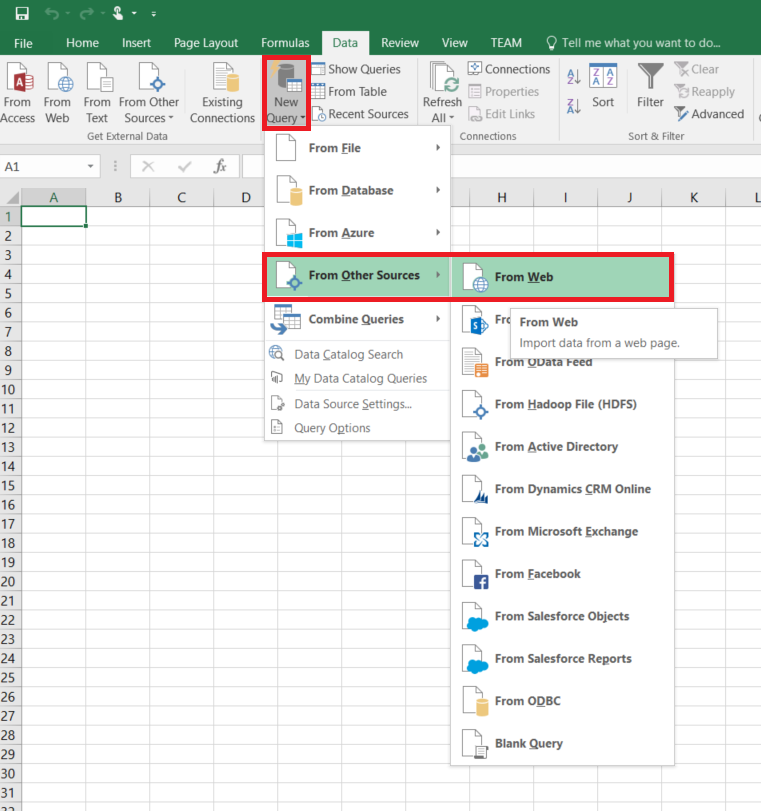
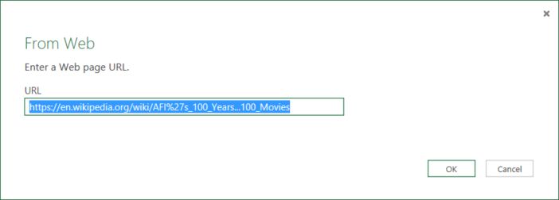

<properties 
    pageTitle="Déplacer des données d’une Table Web | Données Azure usine" 
    description="Découvrez comment déplacer des données locales un tableau dans une page Web à l’aide d’Azure Data Factory." 
    services="data-factory" 
    documentationCenter="" 
    authors="linda33wj" 
    manager="jhubbard" 
    editor="monicar"/>

<tags 
    ms.service="data-factory" 
    ms.workload="data-services" 
    ms.tgt_pltfrm="na" 
    ms.devlang="na" 
    ms.topic="article" 
    ms.date="09/26/2016" 
    ms.author="jingwang"/>

# Déplacer des données d’une source de table Web à l’aide d’usine de données Azure
Cet article explique comment vous pouvez utiliser l’activité de copie dans une usine de données Azure pour copier des données d’un tableau dans une page Web vers une autre banque de données. Cet article s’appuie sur l’article [activités de déplacement des données](data-factory-data-movement-activities.md) , qui présente une vue d’ensemble de déplacement de données avec l’activité de copie et les combinaisons de magasin de données prises en charge.

Usine données prend actuellement en charge uniquement déplacement des données à partir d’une table Web aux autres banques de données, mais ne pas déplacer des données d’autres données stocke vers une destination table Web.

> [AZURE.NOTE] Ce connecteur Web prend actuellement en charge uniquement le contenu tableau extraction d’une page HTML.

## Exemple : Copier des données à partir de la table Web vers Blob Azure

L’exemple ci-dessous montre :

1.  Un service lié de type [Web](#web-linked-service-properties).
2.  Un service de type [AzureStorage](data-factory-azure-blob-connector.md#azure-storage-linked-service-properties)lié.
3.  Un [jeu de données](data-factory-create-datasets.md) d’entrée de type [WebTable](#WebTable-dataset-properties).
4.  Un résultat [jeu de données](data-factory-create-datasets.md) de type [AzureBlob](data-factory-azure-blob-connector.md#azure-blob-dataset-type-properties).
4.  [Pipeline](data-factory-create-pipelines.md) avec une activité copie qui utilise [WebSource](#websource-copy-activity-type-properties) et [BlobSink](data-factory-azure-blob-connector.md#azure-blob-copy-activity-type-properties).

L’exemple copie les données à partir d’une table Web à un blob Azure chaque heure. Les propriétés JSON utilisées dans ces exemples sont décrites dans les sections suivantes les exemples. 

L’exemple suivant montre comment copier des données à partir d’une table Web vers un blob Azure. Toutefois, les données peuvent être copiées directement à un des récepteurs indiqués dans l’article [Activités de déplacement des données](data-factory-data-movement-activities.md) à l’aide de l’activité de copie dans Azure Data Factory. 

**Web lié service** Cet exemple utilise le service Web lié avec l’authentification anonyme. Consultez la section [Web lié service](#web-linked-service-properties) pour différents types d’authentification, vous pouvez utiliser. 

    {
        "name": "WebLinkedService",
        "properties":
        {
            "type": "Web",
            "typeProperties":
            {
                "authenticationType": "Anonymous",
                "url" : "https://en.wikipedia.org/wiki/"
            }
        }
    }

**Service de stockage lié Azure**

    {
      "name": "AzureStorageLinkedService",
      "properties": {
        "type": "AzureStorage",
        "typeProperties": {
          "connectionString": "DefaultEndpointsProtocol=https;AccountName=<accountname>;AccountKey=<accountkey>"
        }
      }
    }

**Jeu de données d’entrée WebTable** Le fait de définir **externes** **true** indique le service de données par défaut que le jeu de données externe à l’usine de données et n’est pas produit par une activité dans le factory de données.

> [AZURE.NOTE] Consultez la section [obtenir index d’un tableau dans une page HTML](#get-index-of-a-table-in-an-html-page) pour obtenir la procédure pour obtenir l’index d’un tableau dans une page HTML.  

    
    {
        "name": "WebTableInput",
        "properties": {
            "type": "WebTable",
            "linkedServiceName": "WebLinkedService",
            "typeProperties": {
                "index": 1,
                "path": "AFI's_100_Years...100_Movies"
            },
            "external": true,
            "availability": {
                "frequency": "Hour",
                "interval":  1
            }
        }
    }

**Jeu de données de sortie Blob Azure**

Les données sont écrites dans un nouveau blob toutes les heures (fréquence : heure, l’intervalle : 1). 

    {
        "name": "AzureBlobOutput",
        "properties":
        {
            "type": "AzureBlob",
            "linkedServiceName": "AzureStorageLinkedService",
            "typeProperties":
            {
                "folderPath": "adfgetstarted/Movies"
            },
            "availability":
            {
                "frequency": "Hour",
                "interval": 1
            }
        }
    }

**Pipeline avec une activité copie**

Le pipeline contient une activité de copie est configuré pour utiliser l’entrée ci-dessus et jeux de données de sortie et planifiée pour chaque heure. Dans le pipeline de définition de JSON, le type de **source** est défini sur **WebSource** et **récepteur de** type est défini sur **BlobSink**. 

Voir [les propriétés de type WebSource](#websource-copy-activity-type-properties) pour la liste des propriétés pris en charge par le WebSource. 
    
    {  
        "name":"SamplePipeline",
        "properties":{  
        "start":"2014-06-01T18:00:00",
        "end":"2014-06-01T19:00:00",
        "description":"pipeline with copy activity",
        "activities":[  
          {
            "name": "WebTableToAzureBlob",
            "description": "Copy from a Web table to an Azure blob",
            "type": "Copy",
            "inputs": [
              {
                "name": "WebTableInput"
              }
            ],
            "outputs": [
              {
                "name": "AzureBlobOutput"
              }
            ],
            "typeProperties": {
              "source": {
                "type": "WebSource"
              },
              "sink": {
                "type": "BlobSink"
              }
            },
           "scheduler": {
              "frequency": "Hour",
              "interval": 1
            },
            "policy": {
              "concurrency": 1,
              "executionPriorityOrder": "OldestFirst",
              "retry": 0,
              "timeout": "01:00:00"
            }
          }
          ]
       }
    }

## Propriétés du Service liées Web

Le tableau suivant fournit la description pour les éléments JSON spécifiques à liées service Web.

| Propriété | Description | Obligatoire |
| -------- | ----------- | -------- | 
| type | La propriété doit être définie : **Web** | Oui | 
| URL | URL pour la recherche Web | Oui |
| authenticationType | Base ou anonyme. | Oui |
| nom d’utilisateur | Nom d’utilisateur pour l’authentification de base. | Oui (pour l’authentification de base)
| mot de passe | Mot de passe pour l’authentification de base. | Oui (pour l’authentification de base)

### À l’aide de l’authentification anonyme

    {
        "name": "web",
        "properties":
        {
            "type": "Web",
            "typeProperties":
            {
                "authenticationType": "Anonymous",
                "url" : "https://en.wikipedia.org/wiki/"
            }
        }
    }

### À l’aide de l’authentification de base
    
    {
        "name": "web",
        "properties":
        {
            "type": "Web",
            "typeProperties":
            {
                "authenticationType": "basic",
                "url" : "http://myit.mycompany.com/",
                "userName": "Administrator",
                "password": "password"
            }
        }
    }

## Propriétés du dataset WebTable

Pour une liste complète des sections et les propriétés disponibles pour la définition des groupes de données, voir l’article [Création de groupes de données](data-factory-create-datasets.md) . Sections telles que la structure, la disponibilité et stratégie d’un dataset JSON sont identiques pour tous les types de jeu de données (SQL Azure, blob Azure, table Azure, etc..).

La section **typeProperties** est différente pour chaque type de jeu de données et fournit des informations sur l’emplacement des données dans le magasin de données. La section typeProperties pour le jeu de données de type **WebTable** possède les propriétés suivantes

Propriété | Description | Obligatoire
:-------- | :----------- | :--------
type    | type de dataset. doit être définie sur **WebTable** | Oui
chemin d’accès | Une URL relative à la ressource qui contient la table. | Non. Lorsque le chemin d’accès n’est pas spécifié, uniquement l’URL spécifiée dans la définition du service liée est utilisé. 
index | L’index de la table dans la ressource. Consultez la section [obtenir index d’un tableau dans une page HTML](#get-index-of-a-table-in-an-html-page) pour obtenir la procédure pour obtenir l’index d’un tableau dans une page HTML. | Oui

**Exemple :**

    {
        "name": "WebTableInput",
        "properties": {
            "type": "WebTable",
            "linkedServiceName": "WebLinkedService",
            "typeProperties": {
                "index": 1,
                "path": "AFI's_100_Years...100_Movies"
            },
            "external": true,
            "availability": {
                "frequency": "Hour",
                "interval":  1
            }
        }
    }

## WebSource - propriétés de type d’activité de copie

Pour une liste complète des sections et les propriétés disponibles pour la définition des activités, voir l’article [Création Pipelines](data-factory-create-pipelines.md) . Propriétés telles que nom, description, entrée et sortie tables et stratégie sont disponibles pour tous les types d’activités. 

Propriétés disponibles dans la section typeProperties de l’activité dépendent quant à eux de chaque type d’activité. Activité de copie, ils varient selon les types de sources et les récepteurs.

Pour l’instant, lorsque la source de l’activité de copie est de type **WebSource**, aucune des propriétés supplémentaires ne sont prises en charge. 

## Obtenir l’index d’un tableau dans une page HTML

1. Lancez **Excel 2016** et accédez à l’onglet **données** .  
2. Cliquez sur **Nouvelle requête** dans la barre d’outils, pointez sur **à partir d’autres Sources** et cliquez sur **à partir du Web**.
    
     
3. Dans la boîte de dialogue **à partir du Web** , entrez **URL** que vous utiliseriez dans service liée JSON (par exemple : https://en.wikipedia.org/wiki/) ainsi que de chemin d’accès que vous spécifiez pour le jeu de données (par exemple : AFI % 27s_100_Years... 100_Movies), puis cliquez sur **OK**. 

     

    URL utilisée dans cet exemple : https://en.wikipedia.org/wiki/AFI%27s_100_Years...100_Movies 
4.  Si vous voyez la boîte de dialogue **contenu Web Access** , sélectionnez la droite **URL**, **l’authentification**, puis cliquez sur **se connecter**. 

    
5.  Cliquez sur un élément de **tableau** dans l’arborescence pour voir le contenu de la table, puis cliquez sur bouton **Modifier** en bas.  

     

5. Dans la fenêtre de **L’éditeur de requête** , cliquez sur bouton **Éditeur avancé** dans la barre d’outils.

    

6. Dans la boîte de dialogue Éditeur avancé, le numéro en regard de « Source » est l’index.

     

Si vous utilisez Excel 2013, utilisez [Microsoft Power Query pour Excel](https://www.microsoft.com/download/details.aspx?id=39379) pour obtenir l’index. Consultez l’article de [se connecter à une page web](https://support.office.com/article/Connect-to-a-web-page-Power-Query-b2725d67-c9e8-43e6-a590-c0a175bd64d8) pour plus d’informations. Les étapes sont similaires si vous utilisez [Microsoft Power BI pour ordinateur de bureau](https://powerbi.microsoft.com/desktop/). 

[AZURE.INCLUDE [data-factory-column-mapping](../../includes/data-factory-column-mapping.md)]

[AZURE.INCLUDE [data-factory-structure-for-rectangualr-datasets](../../includes/data-factory-structure-for-rectangualr-datasets.md)]

## Performances et réglage  
Voir [Guide d’optimisation et des performances d’activité de copie](data-factory-copy-activity-performance.md) pour en savoir plus sur les principaux facteurs impact sur les performances de déplacement de données (copie activité) dans Azure Data Factory et de différentes manières d’optimiser.
