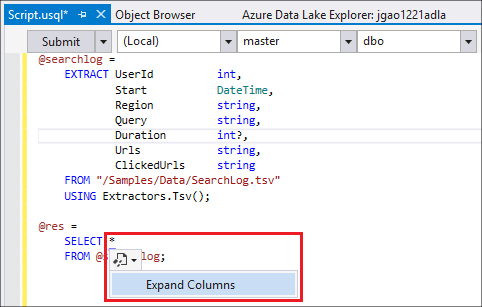
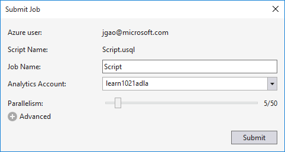
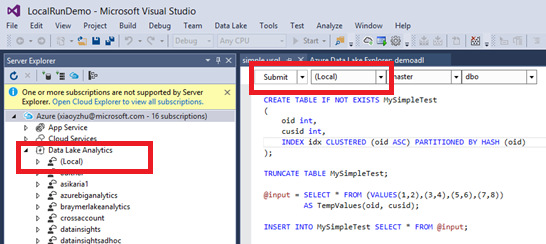

<properties
   pageTitle="Développer des scripts U-SQL à l’aide de Lake Data Tools pour Visual Studio | Azure"
   description="Découvrez comment installer Lake Data Tools pour Visual Studio, le développement et les scripts de test U-SQL. "
   services="data-lake-analytics"
   documentationCenter=""
   authors="edmacauley"
   manager="jhubbard"
   editor="cgronlun"/>

<tags
   ms.service="data-lake-analytics"
   ms.devlang="na"
   ms.topic="get-started-article"
   ms.tgt_pltfrm="na"
   ms.workload="big-data"
   ms.date="05/16/2016"
   ms.author="edmaca"/>

# Didacticiel : développer les scripts U-SQL à l’aide de Lake Data Tools pour Visual Studio

[AZURE.INCLUDE [get-started-selector](../../includes/data-lake-analytics-selector-get-started.md)]

Découvrez comment installer Lake Data Tools pour Visual Studio et utiliser des données Lake Tools pour Visual Studio pour écrire et tester les scripts U-SQL.

U-SQL est une langue hyper scalable, hautement extensible pour préparer, la transformation et l’analyse de toutes les données dans le lake données et versions ultérieures. Pour plus d’informations, voir [référence U-SQL] (http://go.microsoft.com/fwlink/p/?LinkId=691348).

##Conditions préalables

- **Visual Studio 2015 Visual Studio 2013 mise à jour et 4 ou Visual Studio 2012. Entreprise (intégrale/Premium), Professionnel, Communauté éditions sont prises en charge ; Expresse edition n’est pas pris en charge. Visual Studio « 15 » n’est actuellement pas pris en charge et nous travaillons sur ce point.**
- **Kit de développement Microsoft Azure pour .NET version 2.7.1 ou au-dessus**.  Installer à l’aide du [programme d’installation de la plateforme Web](http://www.microsoft.com/web/downloads/platform.aspx).
- **[Données Lake Tools pour Visual Studio](http://aka.ms/adltoolsvs)**.

    Une fois que les données Lake Tools pour Visual Studio est installé, vous verrez un nœud « Données Lake Analytique » dans l’Explorateur de serveurs sous le nœud « Azure » (vous pouvez ouvrir Explorateur de serveurs en appuyant sur Ctrl + Alt + S).

- **Parcourez les deux sections suivantes dans [prise en main Azure données Lake Analytique à l’aide de portail Azure](data-lake-analytics-get-started-portal.md)**.

    - [Créer un compte Azure données Lake Analytique](data-lake-analytics-get-started-portal.md#create_adl_analytics_account).
    - [Télécharger SearchLog.tsv sur le compte de stockage des données Lake par défaut](data-lake-analytics-get-started-portal.md#update-data-to-the-default-adl-storage-account).

    Votre convenance, un exemple de script PowerShell pour la création d’un service de données Lake analytique et le téléchargement de fichier de source de données sont accessibles dans [échantillon Appx-A PowerShell pour préparer le didacticiel](data-lake-analytics-data-lake-tools-get-started.md#appx-a-powershell-sample-for-preparing-the-tutorial).

    Les outils de Lake données non prises en charge la création de comptes données Lake Analytique. Vous devez donc créer à l’aide du portail Azure, Azure PowerShell, Kit de développement .NET ou Azure infrastructure du langage commun. Pour exécuter une tâche de données Lake Analytique, vous avez besoin des données. Même si les outils de Lake données prend en charge télécharger les données, vous allez utiliser le portail pour charger les exemples de données pour faciliter la suivez ce didacticiel.

## Se connecter à Azure

**Pour vous connecter à des données Lake Analytique**

1. Ouvrez Visual Studio.
2. Dans le menu **affichage** , cliquez sur **Explorateur de serveurs** pour ouvrir l’Explorateur de serveurs. Ou appuyez sur **[CTRL] + [ALT] + S**.
3. Avec le bouton droit **Azure**et cliquez sur « Se connecter à Microsoft Azure abonnement », puis suivez les instructions.
4. Dans l' **Explorateur de serveurs**, puis développez **Azure**et **Données Lake Analytique**. Vous doit afficher la liste de vos comptes de données Lake Analytique le cas échéant. Vous ne pouvez pas créer des comptes de données Lake Analytique dans Visual Studio. Pour créer un compte, voir [prise en main Azure données Lake Analytique à l’aide de portail Azure](data-lake-analytics-get-started-portal.md) ou [Prise en main Azure données Lake Analytique à l’aide de PowerShell Azure](data-lake-analytics-get-started-powershell.md).

## Télécharger des fichiers de données sources

Vous avez téléchargé des données dans la section **prérequises** précédemment dans le didacticiel.  

Au cas où vous souhaitez utiliser vos propres données, voici les procédures de chargement des données à partir des données Lake outils.

**Télécharger des fichiers sur le compte Azure données Lake dépendant**

1. Dans l' **Explorateur de serveurs**, développez **Azure**, développez **Données Lake Analytique**, votre compte de données Lake Analytique, **Comptes de stockage**. Doit s’affiche le compte de stockage des données Lake par défaut et les comptes de stockage des données Lake liées et les comptes de stockage Azure liées. Le compte de données Lake par défaut a une étiquette « Compte de stockage par défaut ».
2. Double-cliquez sur le compte de stockage des données Lake par défaut, puis cliquez sur **Explorer**.  Les outils de Lake de données pour le volet Explorateur de Visual Studio s’ouvre.  Dans la gauche, il affiche une arborescence, que l’affichage du contenu se trouve à droite.
3. Accédez au dossier dans lequel vous souhaitez télécharger des fichiers,
4. Avec le bouton droit n’importe quel espace vide, puis cliquez sur **Télécharger**.

    

**Télécharger des fichiers à un compte de stockage Blob Azure lié**

1. Dans l' **Explorateur de serveurs**, développez **Azure**, développez **Données Lake Analytique**, votre compte de données Lake Analytique, **Comptes de stockage**. Doit s’affiche le compte de stockage des données Lake par défaut et les comptes de stockage des données Lake liées et les comptes de stockage Azure liées.
2. Développez le compte de stockage Azure.
3. Cliquez sur le conteneur dans lequel vous souhaitez télécharger des fichiers, puis cliquez sur **Explorer**. Si vous n’avez pas un conteneur, vous devez tout d’abord créer un à l’aide du portail Azure, PowerShell Azure ou autres outils.
4. Accédez au dossier dans lequel vous souhaitez télécharger des fichiers,
5. Avec le bouton droit n’importe quel espace vide, puis cliquez sur **Télécharger**.

## Développer des scripts U-SQL

Les tâches de données Lake Analytique sont écrits en langage SQL-U. Pour en savoir plus sur U-SQL, voir [prise en main U-SQL langue](data-lake-analytics-u-sql-get-started.md) et [référence du langage SQL-U](http://go.microsoft.com/fwlink/?LinkId=691348).

**Pour créer et soumettre une tâche de données Lake Analytique**

1. Dans le menu **fichier** , cliquez sur **Nouveau**, puis cliquez sur **projet**.
2. Sélectionnez le type de **Projet U-SQL** .

    

3. Cliquez sur **OK**. Visual studio crée une solution avec un fichier **Script.usql** .
4. Entrez le script suivant dans **Script.usql**:

        @searchlog =
            EXTRACT UserId          int,
                    Start           DateTime,
                    Region          string,
                    Query           string,
                    Duration        int?,
                    Urls            string,
                    ClickedUrls     string
            FROM "/Samples/Data/SearchLog.tsv"
            USING Extractors.Tsv();

        @res =
            SELECT *
            FROM @searchlog;        

        OUTPUT @res   
            TO "/Output/SearchLog-from-Data-Lake.csv"
        USING Outputters.Csv();

    Ce script U SQL lit le fichier de données source à l’aide de **Extractors.Tsv()**, puis crée un fichier csv à l’aide de **Outputters.Csv()**.

    Ne modifiez pas les deux chemins d’accès, sauf si vous avez copié le fichier source dans un autre emplacement.  Données Lake Analytique créera le dossier de sortie s’il n’existe pas.

    Il est plus simple d’utiliser les chemins d’accès relatifs pour les fichiers stockés par défaut données comptes Lake. Vous pouvez également utiliser les chemins d’accès absolus.  Par exemple

        adl://<Data LakeStorageAccountName>.azuredatalakestore.net:443/Samples/Data/SearchLog.tsv

    Vous devez utiliser des chemins d’accès absolus pour accéder aux fichiers dans les comptes de stockage liés.  La syntaxe pour les fichiers stockés dans un compte de stockage Azure lié est la suivante :

        wasb://<BlobContainerName>@<StorageAccountName>.blob.core.windows.net/Samples/Data/SearchLog.tsv

    >[AZURE.NOTE] Conteneur Blob Azure disposant d’autorisations d’accès conteneurs public ou des objets BLOB publics ne sont actuellement pas pris en charge.  

    Notez les fonctionnalités suivantes :

    - **IntelliSense**

        Automatique de nom terminé et que les membres seront affichés pour les lignes, Classes, bases de données, schémas et objets définis par l’utilisateur (UDOs).

        IntelliSense pour entités du catalogue (bases de données, schémas, Tables, UDOs etc.) est lié à votre compte cluster. Vous pouvez vérifier le compte actif cluster actuel, base de données et le schéma dans la barre d’outils supérieure et remplacez les via les listes déroulantes.

    - *Colonnes de *développement***

        Cliquez sur la droite de *, s’affiche pas un trait de soulignement bleu sous la *. Placez le pointeur sur le trait de soulignement bleu, puis cliquez sur la flèche vers le bas.
        

        Cliquez sur **Développer les colonnes**, l’outil remplacera le * avec les noms de colonne.

    - **Mise en forme automatique**

        Les utilisateurs peuvent modifier la mise en retrait du script U-SQL en fonction du code structure sous Modifier -> Avancé :

        - Format Document (Ctrl + E, D) : Met en forme l’ensemble du document   
        - Sélection du format (Ctrl + K, Ctrl + F) : Met en forme la sélection. Si aucune sélection a été effectuée, ce raccourci met en forme la ligne que se trouve le curseur.  

        La mise en forme des règles peuvent être configurées sous Outils -> Options -> Éditeur de texte - > SIP -> mise en forme.  
    - **Retrait intelligent**

        Données Lake Tools pour Visual Studio est en mesure de mettre en retrait expressions automatiquement lors de l’écriture de scripts. Cette fonctionnalité est désactivée par défaut, les utilisateurs ont besoin permettre à vérifier U-SQL -> Options et paramètres -> commutateurs -> activer le retrait actives.

    - **Atteindre la définition et rechercher toutes les références**

        Clic droit sur le nom d’un jeu de lignes/paramètre/colonne/UDO, etc. et en cliquant sur Atteindre la définition (F12) permet de vous permettant d’accéder à sa définition. En cliquant sur Rechercher toutes les références (MAJ + F12), affiche toutes les références.

    - **Insérer le chemin d’accès Azure**

        Plutôt que de mémoriser Azure chemin d’accès et le type il manuellement lors de l’écriture de script, données Lake Tools pour Visual Studio offre un moyen facile : avec le bouton droit dans l’éditeur, cliquez sur Insérer le tracé Azure. Accédez au fichier dans la boîte de dialogue navigateur d’objets Blob Azure. Cliquez sur **OK**. le chemin d’accès du fichier est insérée à votre code.

5. Spécifier le compte, une base de données et un schéma de données Lake Analytique. Vous pouvez sélectionner **(local)** pour exécuter le script localement dans le but de test. Pour plus d’informations, voir [Exécuter U-SQL localement](#run-u-sql-locally).

    

    Pour plus d’informations, voir [utiliser U-SQL catalogue](data-lake-analytics-use-u-sql-catalog.md).

5. À partir **L’Explorateur de solutions**, avec le bouton droit **Script.usql**, puis cliquez sur **Créer un Script**. Vérifier le résultat dans le volet résultat.
6. À partir **L’Explorateur de solutions**, avec le bouton droit **Script.usql**, puis cliquez sur **Envoyer le Script**. Si vous le souhaitez, vous pouvez également cliquer sur **Envoyer** à partir du volet Script.usql.  Voir la capture d’écran précédent.  Cliquez sur la flèche vers le bas en regard du bouton Envoyer pour envoyer en utilisant les options d’avance :
7. Spécifiez **Le nom du travail**, vérifiez que le **Compte Analytique**, puis cliquez sur **Envoyer**. Résultats de l’envoi et de liaison de tâche sont disponibles dans les données Lake fenêtre Tools for Visual Studio se traduit par lorsque la présentation est terminée.

    

8. Vous devez cliquer sur le bouton Actualiser pour afficher l’état du travail dernière et actualiser l’écran. Lorsque les succès de la tâche, il vous montrent le **Travail Graph**, **Opérations sur les métadonnées**, **Historique de l’état**, **Diagnostics**:

    

    * Résumé de la tâche. Afficher les informations de synthèse du travail en cours, par exemple : état, l’avancement, temps d’exécution, nom d’exécution, etc. déposant.   
    * Détails de la tâche. Des informations détaillées sur cette tâche sont fournies, y compris le script, ressources, vue de l’exécution de sommet.
    * Graphique de travail. Quatre graphiques vous permettent de visualiser les informations de la tâche : l’avancement, lecture de données, les données écrites, temps d’exécution, durée d’exécution moyenne par nœud, débit d’entrée, débit sortie.
    * Opérations de métadonnées. Il affiche toutes les opérations de métadonnées.
    * L’état d’historique.
    * Diagnostics. Données Lake Tools pour Visual Studio sera diagnostiquer automatiquement l’exécution du travail. Vous recevrez les alertes lorsqu’il y a des erreurs ou problèmes de performances dans leur travail. Voir travail Diagnostics (lien à déterminer) partie pour plus d’informations.

**Pour vérifier l’état du travail**

1. À partir de l’Explorateur de serveurs, développez **Azure**, **Données Lake Analytique**, le nom du compte données Lake Analytique
2. Double-cliquez sur **travaux** pour répertorier les travaux.
2. Cliquez sur une tâche pour afficher l’état.

**Pour afficher la sortie des tâches**

1. Dans l' **Explorateur de serveurs**, développez **Azure**, développez **Données Lake Analytique**, développer votre compte données Lake Analytique, développer des **Comptes de stockage**, double-cliquez sur le compte de stockage des données Lake par défaut, puis cliquez sur **Explorer**.
2.  Double-cliquez sur la **sortie** pour ouvrir le dossier
3.  Double-cliquez sur **SearchLog de adltools.csv**.

###Lecture de travail

Lecture de la tâche vous permet de surveiller l’avancement de l’exécution de tâche et visuellement détecter les engorgements et anomalies de performance. Cette fonctionnalité peut être utilisée avant la fin du travail d’exécution (c'est-à-dire la période pendant que le travail s’exécute activement), ainsi que la fin de l’exécution. Effectuant lecture pendant l’exécution du travail permet à l’utilisateur lire la progression jusqu'à l’heure actuelle.

**Pour afficher la progression de l’exécution de tâche**  

1. Cliquez sur **Profil de charge** dans le coin supérieur droit. Afficher l’écran précédent capture.
2. Cliquez sur le bouton lecture dans le coin inférieur gauche pour suivre l’évolution de l’exécution de tâche.
3. Pendant la lecture, cliquez sur **Pause** pour l’arrêter ou directement faites glisser la barre de progression vers des emplacements spécifiques.

###Carte thermique

Données Lake Tools pour Visual Studio fournit des superpositions de couleur sélectionnable par l’utilisateur sur mode de travail pour indiquer l’avancement, données e/s, durée d’exécution, débit e/s de chaque étape. Grâce à cela, les utilisateurs peuvent identifier le problèmes potentiels et de distribution des propriétés des tâches directement simple et intuitive. Vous pouvez choisir une source de données à afficher dans la liste déroulante.  

## Exécuter localement U-SQL

À l’aide de l’ordinateur local U-SQL mise en route dans Visual Studio, vous pouvez :

- Exécuter des scripts U-SQL localement, ainsi que c# assemblys.
- Déboguer c# assemblys localement.
- Créer et supprimer/afficher les bases de données locales, assemblys, schémas et tables dans l’Explorateur de serveurs comme vous peuvent le faire pour le service Azure données Lake Analytique.

Vous verrez un compte *Local* dans Visual Studio, et le programme d’installation crée un *DataRoot* dossier trouve *C:\LocalRunRoot*. Le dossier DataRoot sera utilisé :

- Métadonnées de banque d’informations, y compris les tables, bases de données, les TVF, etc..
- Pour obtenir un script certain : si un chemin d’accès relatif référencée dans les chemins d’accès d’entrée/sortie, nous allons vers le haut le DataRoot (ainsi que le chemin du script si le service informatique d’entrée)
- Le dossier DataRoot ne sera pas référencé si vous essayez d’enregistrer un assembly et utiliser un chemin d’accès relatif (voir partie « utiliser assemblys lors de l’exécution exécution locale » pour plus d’informations)

La vidéo suivante montre la fonctionnalité d’exécution locale U-SQL :

>[AZURE.VIDEO usql-localrun]

### Problèmes connus et limitations

- Impossible de créer la table/DB etc. dans l’Explorateur de serveurs pour le compte local.
- Lorsqu’un chemin d’accès relatif est référencée :

    - Dans l’entrée de script (extraire * FROM « / chemin d’accès/abc »)-le chemin d’accès DataRoot et le chemin d’accès de script seront recherchées.
    - Produit une sortie script (sortie à « chemin d’accès/abc ») : le chemin d’accès DataRoot sera utilisé comme le dossier de sortie.
    - Dans l’enregistrement assembly (xyz CREATE ASSEMBLY de « / chemin d’accès/abc ») : le chemin d’accès de script sera recherchée, mais pas la DataRoot.
    - Dans enregistré table/affichage ou autres entités de métadonnées : le chemin d’accès DataRoot sera recherchée, mais pas le chemin d’accès de script.

    Pour les scripts exécuté sur le service de données Lake, le compte de stockage par défaut sera utilisé comme dossier racine et sera recherché en conséquence.

### Tester les scripts U-SQL localement
Pour plus d’informations sur le développement de scripts U-SQL, voir [scripts développer U-SQL](#develop-and-test-u-sql-scripts). Créer et exécuter U-SQL scripts localement, sélectionnez **(Local)** dans la liste déroulante cluster, puis cliquez sur **Envoyer**. Vérifiez que vous avez les bonnes données référencées - soit référez-vous le chemin d’accès absolu ou insérer les données sous le dossier DataRoot.

Vous pouvez également avec le bouton droit un script puis cliquez sur **Exécuter le Plan Local** dans le menu contextuel ou appuyez sur **CTRL + F5** pour local déclencheur exécuter.

### Utiliser des assemblys de série locale

Il existe deux manières d’exécuter les fichiers c# personnalisées :

- Écrire des assemblys dans le fichier code-behind et les assemblys seront automatiquement enregistrées et supprimées une fois le script exécuté.
- Créer un projet d’assemblage c# et enregistrer la dll sortie au compte local via un script comme ci-dessous. Notez que le chemin d’accès est relatif le script plutôt que le dossier DataRoot.

### Déboguer des scripts et c# assemblys localement

Vous pouvez déboguer c# assemblys sans l’envoi et l’inscription au Service d’Analytique données Lake Azure. Vous pouvez définir des points d’arrêt dans les deux le fichier code-behind et dans un projet c# référencé.

**Déboguer le code local dans le fichier code-behind**
1.  Définir les points d’arrêt dans le fichier code-behind.
2.  Appuyez sur **F5** pour déboguer le script localement.

La procédure suivante fonctionne uniquement dans Visual Studio 2015. Dans Visual Studio plus anciens, vous devrez peut-être ajouter manuellement les fichiers pdb.

**Déboguer le code local dans un projet c# référencé**
1.  Créer un projet Assembly c# et créer pour générer la dll de sortie.
2.  Enregistrer la dll à l’aide d’une instruction SQL-U :

        CREATE ASSEMBLY assemblyname FROM @"..\..\path\to\output\.dll";
3.  Définir les points d’arrêt dans le code c#.
4.  Appuyez sur **F5** pour déboguer le script avec faisant référence à la dll c# localement.  

##Voir aussi

Pour commencer à utiliser les données Lake Analytique à l’aide des différents outils, voir :

- [Prise en main données Lake Analytique à l’aide du portail Azure](data-lake-analytics-get-started-portal.md)
- [Prise en main données Lake Analytique à l’aide de PowerShell Azure](data-lake-analytics-get-started-powershell.md)
- [Prise en main données Lake Analytique à l’aide du Kit de développement .NET](data-lake-analytics-get-started-net-sdk.md)
- [Déboguer le code c# dans travaux U-SQL](data-lake-analytics-debug-u-sql-jobs.md)

Pour afficher d’autres rubriques de développement :

- [Analyser les blogs à l’aide de données Lake Analytique](data-lake-analytics-analyze-weblogs.md)
- [Développer des scripts U-SQL à l’aide de Lake Data Tools pour Visual Studio](data-lake-analytics-data-lake-tools-get-started.md)
- [Prise en main langue données Lake Analytique U-SQL Azure](data-lake-analytics-u-sql-get-started.md)
- [Développer des opérateurs U-SQL sont définis par l’utilisateur pour les tâches de données Lake Analytique](data-lake-analytics-u-sql-develop-user-defined-operators.md)

##Exemple de PowerShell AppX A pour préparer le didacticiel

Le script PowerShell suivant prépare un compte Azure données Lake Analytique et la source de données à votre place, vous pouvez donc passer à [scripts développer U-SQL](data-lake-analytics-data-lake-tools-get-started.md#develop-u-sql-scripts).

    #region - used for creating Azure service names
    $nameToken = "<Enter an alias>"
    $namePrefix = $nameToken.ToLower() + (Get-Date -Format "MMdd")
    #endregion

    #region - service names
    $resourceGroupName = $namePrefix + "rg"
    $dataLakeStoreName = $namePrefix + "adas"
    $dataLakeAnalyticsName = $namePrefix + "adla"
    $location = "East US 2"
    #endregion

    # Treat all errors as terminating
    $ErrorActionPreference = "Stop"

    #region - Connect to Azure subscription
    Write-Host "`nConnecting to your Azure subscription ..." -ForegroundColor Green
    try{Get-AzureRmContext}
    catch{Login-AzureRmAccount}
    #endregion

    #region - Create an Azure Data Lake Analytics service account
    Write-Host "Create a resource group ..." -ForegroundColor Green
    New-AzureRmResourceGroup `
        -Name  $resourceGroupName `
        -Location $location

    Write-Host "Create a Data Lake account ..."  -ForegroundColor Green
    New-AzureRmDataLakeStoreAccount `
        -ResourceGroupName $resourceGroupName `
        -Name $dataLakeStoreName `
        -Location $location

    Write-Host "Create a Data Lake Analytics account ..."  -ForegroundColor Green
    New-AzureRmDataLakeAnalyticsAccount `
        -Name $dataLakeAnalyticsName `
        -ResourceGroupName $resourceGroupName `
        -Location $location `
        -DefaultDataLake $dataLakeStoreName

    Write-Host "The newly created Data Lake Analytics account ..."  -ForegroundColor Green
    Get-AzureRmDataLakeAnalyticsAccount `
        -ResourceGroupName $resourceGroupName `
        -Name $dataLakeAnalyticsName  
    #endregion

    #region - prepare the source data
    Write-Host "Import the source data ..."  -ForegroundColor Green
    $localFolder = "C:\Tutorials\Downloads\" # A temp location for the file.
    $storageAccount = "adltutorials"  # Don't modify this value.
    $container = "adls-sample-data"  #Don't modify this value.

    # Create the temp location  
    New-Item -Path $localFolder -ItemType Directory -Force

    # Download the sample file from Azure Blob storage
    $context = New-AzureStorageContext -StorageAccountName $storageAccount -Anonymous
    $blobs = Azure\Get-AzureStorageBlob -Container $container -Context $context
    $blobs | Get-AzureStorageBlobContent -Context $context -Destination $localFolder

    # Upload the file to the default Data Lake Store account    
    Import-AzureRmDataLakeStoreItem -AccountName $dataLakeStoreName -Path $localFolder"SearchLog.tsv" -Destination "/Samples/Data/SearchLog.tsv"

    Write-Host "List the source data ..."  -ForegroundColor Green
    Get-AzureRmDataLakeStoreChildItem -Account $dataLakeStoreName -Path  "/Samples/Data/"
    #endregion
