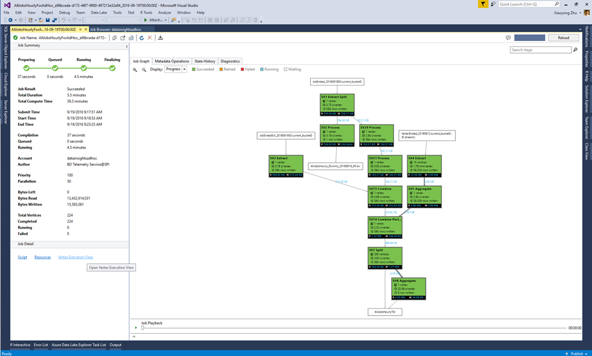
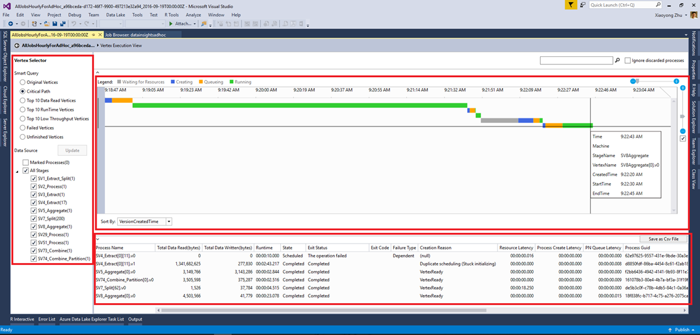

<properties 
   pageTitle="Utiliser l’affichage de l’exécution sommet dans données Lake Tools pour Visual Studio | Microsoft Azure" 
   description="Découvrez comment utiliser le mode d’exécution sommet à des projets de données Lake Analytique examen." 
   services="data-lake-analytics" 
   documentationCenter="" 
   authors="mumian" 
   manager="jhubbard" 
   editor="cgronlun"/>
 
<tags
   ms.service="data-lake-analytics"
   ms.devlang="na"
   ms.topic="article"
   ms.tgt_pltfrm="na"
   ms.workload="big-data" 
   ms.date="10/13/2016"
   ms.author="jgao"/>

# Utiliser l’affichage de l’exécution sommet dans données Lake Tools pour Visual Studio

Découvrez comment utiliser le mode d’exécution sommet à des projets de données Lake Analytique examen.

## Conditions préalables

- Des connaissances de base de l’utilisation de données Lake Tools pour Visual Studio pour développer des scripts U-SQL.  Voir [didacticiel : développer les scripts U-SQL à l’aide de Lake Data Tools pour Visual Studio](data-lake-analytics-data-lake-tools-get-started.md).

## Ouvrir le mode d’exécution sommet

Pour effectuer une tâche précise, vous pouvez cliquer sur le lien « Sommet d’exécution View » dans le coin inférieur gauche. Vous pouvez être invité à charger tout d’abord les profils et il peut prendre un certain temps en fonction de la connectivité réseau.

## Présentation du mode d’exécution de sommet

Après avoir entré la vue de l’exécution de sommet, il existe trois parties :

- Sélecteur de sommet : gauche est le sélecteur de sommet.  Vous pouvez sélectionner les sommets par fonctions (telles que les données de 10 premiers lire ou choisissez par étape).

    Un des filtres courants utilisés est les sommets sur le chemin critique. Chemin critique est la plus longue chemin d’accès d’un travail U-SQL. Il est utile pour l’optimisation de vos projets en cochant le sommet prend le plus de temps.

- Le volet central supérieur :

    

    Cette vue affiche également l’état en cours d’exécution de toutes les sommets. Elle convertit l’heure en conséquence à votre ordinateur local et indique l’état différents dans différentes couleurs.

- Le volet central bas :

    

    - Nom du processus : Nom de l’instance sommet. Il se compose de différentes parties dans StageName | VertexName | VertexRunInstance. Par exemple, le sommet .v1 [62] SV7_Split représente la seconde instance en cours d’exécution (.v1, index en commençant par 0) sommet numéro de 62 en phase SV7_Split.
    - Total des données en lecture/écriture : Les données ont été lus/modifiés par ce sommet.
    - Statut de sortie/état : L’état final lorsque le sommet est terminé.
    - Type de Code/échec quitter : L’erreur lorsque le sommet a échoué.
    - Raison n ° création : Pourquoi le sommet a été créé.
    - Ressource latence/processus latence/PN file d’attente latence : temps nécessaire pour que le sommet attendre que les ressources, traitement des données et afin de rester dans la file d’attente.
    - GUID/créateur de processus : GUID le sommet en cours d’exécution en cours ou son créateur.
    - Version : le N-ème instance du sommet en cours d’exécution (le système peut-être planifier des nouvelles instances d’un sommet de nombreuses raisons, par exemple le basculement, calculent redondance, etc..)
    - Version créée.
    - Traiter créer début/processus date/heure en file d’attente/processus date/heure début heure/processus achevé heure : lorsque le processus de sommet démarre création ; Lorsque le processus de sommet démarre en file d’attente ; Lorsque le processus de sommet donné démarre ; Lorsque le sommet certaines est terminée.

## Étapes suivantes

- Pour obtenir une vue d’ensemble de données Lake Analytique, voir [vue d’ensemble Azure données Lake Analytique](data-lake-analytics-overview.md).
- Pour commencer à développer des applications U-SQL, voir [scripts U-SQL développer à l’aide de données Lake Tools pour Visual Studio](data-lake-analytics-data-lake-tools-get-started.md).
- Pour plus d’U-SQL, voir [prise en main langue données Lake Analytique U-SQL Azure](data-lake-analytics-u-sql-get-started.md).
- Pour des tâches de gestion, voir [Gérer Azure données Lake Analytique à l’aide de portail Azure](data-lake-analytics-manage-use-portal.md).
- Pour enregistrer les informations de diagnostic, consultez [accès à des journaux de diagnostics pour Azure données Lake Analytique](data-lake-analytics-diagnostic-logs.md)
- Pour plus d’une requête plus complexe, voir [journaux d’analyse Web à l’aide de Azure données Lake Analytique](data-lake-analytics-analyze-weblogs.md).
- Pour afficher les détails d’une tâche, voir [utiliser le navigateur et affichage de travail pour les travaux Azure données lake Analytique](data-lake-analytics-data-lake-tools-view-jobs.md)