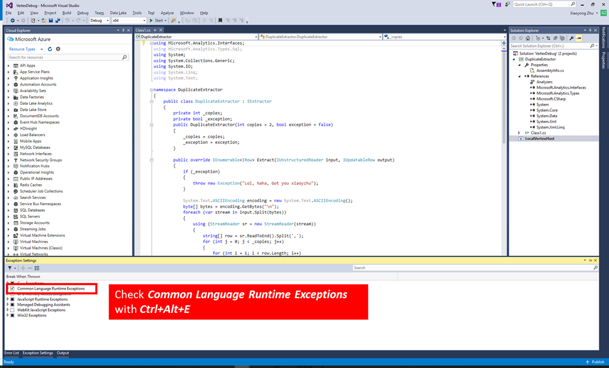

<properties 
   pageTitle="Déboguer travaux U-SQL | Microsoft Azure" 
   description="Découvrez comment déboguer le sommet échec U-SQL à l’aide de Visual Studio. " 
   services="data-lake-analytics" 
   documentationCenter="" 
   authors="mumian" 
   manager="jhubbard" 
   editor="cgronlun"/>
 
<tags
   ms.service="data-lake-analytics"
   ms.devlang="na"
   ms.topic="article"
   ms.tgt_pltfrm="na"
   ms.workload="big-data" 
   ms.date="09/02/2016"
   ms.author="jgao"/>

#Déboguer le code c# dans U-SQL pour les tâches de données Lake Analytique 

Apprenez à utiliser les outils Azure données Lake Visual Studio pour déboguer des travaux U-SQL a échoué en raison de bogues dans le code de l’utilisateur. 

L’outil Visual Studio vous permet de télécharger code compilé et données nécessaires sommet à partir de cluster pour suivi et débogage échec des travaux.

Les systèmes de données volumineux offrent généralement modèle d’extensibilité via langues comme Java, c#, Python, etc.. Nombre de ces systèmes fournissent limité runtime débogage d’informations, qui vous paraît difficile à déboguer les erreurs d’exécution dans le code personnalisé. Les derniers outils Visual Studio est fourni avec une fonctionnalité appelée « Échec de la déboguer le sommet ». À l’aide de cette fonctionnalité, vous pouvez télécharger les données d’exécution à partir d’Azure sur Poste de travail local à afin que vous puissiez déboguer échec c# code personnalisé à l’aide de la même runtime et exactement les données d’entrée à partir du cloud.  Une fois que les problèmes sont résolus, vous pouvez réexécuter le code révisé dans Azure à partir des outils.

Pour une présentation vidéo de cette fonctionnalité, voir [Déboguer votre code personnalisé dans Azure données Lake Analytique](https://mix.office.com/watch/1bt17ibztohcb).

>[AZURE.NOTE] Visual Studio peut se bloquer ou se bloquer si vous n’avez pas les mises à jour deux windows suivants : [Microsoft Visual C++ 2015 redistribuable mise à jour 2](https://www.microsoft.com/download/details.aspx?id=51682), [Universel Runtime C pour Windows](https://www.microsoft.com/download/details.aspx?id=50410&wa=wsignin1.0).

##Conditions préalables
-   Ont été via l’article [prise en main](data-lake-analytics-data-lake-tools-get-started.md) .

## Créer et configurer des projets de débogage

Lorsque vous ouvrez Échec d’un travail dans l’outil de données Lake Visual Studio, vous obtenez une alerte. Les informations d’erreur détaillées seront affichées dans l’onglet erreur et la barre d’alerte jaune en haut de la fenêtre. 

**Pour télécharger sommet et créer une solution débogage**

1.  Ouvrir une tâche U-SQL échec dans Visual Studio.
2.  Cliquez sur **Télécharger** pour télécharger tous les ressources nécessaires et les flux d’entrée. Cliquez sur **recommencer** si le téléchargement a échoué.
3.  Cliquez sur **Ouvrir** lorsque le téléchargement est terminé pour créer un projet de débogage local. Une nouvelle solution Visual Studio appelée **VertexDebug** avec un projet vide appelé **LocalVertexHost** est créée.

Si les opérateurs définis par l’utilisateur sont utilisés dans le code SQL-U derrière (Script.usql.cs), vous devez créer un projet de classe bibliothèque c# avec le code d’opérateurs définis par l’utilisateur et inclure le projet dans la VertexDebug Solution.

Si vous avez enregistré assemblys .dll à votre base de données Lake Analytique, vous devez ajouter le code source des assemblys à la VertexDebug Solution.
 
Si vous avez créé une distinct c# bibliothèque de classes pour votre code U SQL et assemblys .dll enregistrée à votre base de données Lake Analytique, vous devez ajouter le projet source c# des assemblys à la VertexDebug Solution.

Dans certains cas rares, utilisez les opérateurs définis par l’utilisateur dans U-SQL fichier code-behind (Script.usql.cs) dans la solution d’origine. Si vous voulez qu’il fonctionne, vous devez créer une bibliothèque c# contenant le code source et modifier le nom d’assembly à celle enregistrée dans le cluster. Vous pouvez obtenir le nom d’assembly enregistré dans le cluster en activant le script est en cours d’exécution dans le cluster. Vous pouvez le faire en ouvrant le travail U SQL et cliquez sur « script » dans le panneau de travail. 

**Pour configurer la solution**

1.  À partir de l’Explorateur de solutions, droit sur le projet c# que vous venez de créer, puis cliquez sur **Propriétés**.
2.  Définir le chemin d’accès de sortie en tant que projet LocalVertexHost chemin répertoire de travail. Vous pouvez obtenir le chemin d’accès du répertoire de travail de projet LocalVertexHost via LocalVertexHost propriétés.
3.  Créer votre projet c# afin de placer le fichier .pdb dans le projet LocalVertexHost répertoire de travail, ou vous pouvez copier le fichier .pdb dans ce dossier manuellement.
4.  Dans les **Paramètres d’Exception**, vérifiez les Exceptions Runtime langue :

 
##Déboguer le travail

Une fois que vous avez créé une solution débogage en téléchargeant le sommet et que vous avez configuré l’environnement, vous pouvez commencer le débogage du code U-SQL.

1.  À partir de l’Explorateur de solutions, droit sur le projet **LocalVertexHost** que vous venez de créer, pointez sur **Déboguer**, puis cliquez sur **Démarrer une nouvelle instance**. La LocalVertexHost doit être définie comme projet de démarrage. Le message suivant peut s’afficher pour la première fois que vous pouvez ignorer. Il peut prendre jusqu'à une minute pour accéder à l’écran de débogage.
 
    

4.  Utilisez Visual Studio selon l’expérience de débogage (espion, variables, etc.) pour résoudre le problème. 
5.  Une fois que vous avez identifié un problème, corrigez le code et puis recréez le projet c# avant de tester jusqu'à ce que tous les problèmes sont résolus. Après le débogage a réussi, la fenêtre de sortie affichant le message suivant 

        The Program ‘LocalVertexHost.exe’ has exited with code 0 (0x0).
 
##Renvoyez le travail

Lorsque vous avez terminé de débogage votre code U-SQL, vous pouvez renvoyer le travail a échoué.

1. Enregistrer les nouveaux assemblys .dll à votre base de données ADLA.

    1.  Explorateur de serveurs Explorer/Cloud dans l’outil de données Lake Visual Studio, développez le nœud **bases de données** 
    2.  Menu contextuel assemblys aux assemblys de Registre. 
    3.  Enregistrer votre nouveau assemblys .dll à la base de données ADLA.
 
2.  Ou copiez votre code c# dans script.usql.cs--c# fichier code-behind.
3.  Renvoyez votre travail.

##Étapes suivantes

- [Didacticiel : Prise en main langue données Lake Analytique U-SQL Azure](data-lake-analytics-u-sql-get-started.md)
- [Didacticiel : développer les scripts U-SQL à l’aide de Lake Data Tools pour Visual Studio](data-lake-analytics-data-lake-tools-get-started.md)
- [Développer des opérateurs U-SQL définies par l’utilisateur pour les travaux Azure données Lake Analytique](data-lake-analytics-u-sql-develop-user-defined-operators.md)

