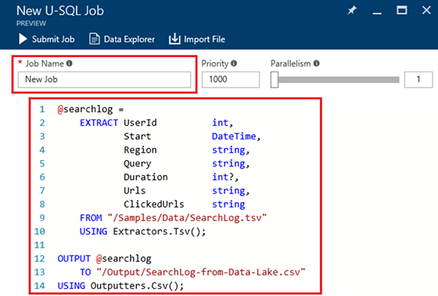

<properties 
   pageTitle="Prise en main Azure données Lake Analytique à l’aide du portail Azure | Azure" 
   description="Découvrez comment utiliser le portail Azure pour créer un compte de données Lake Analytique, créez une tâche de données Lake Analytique à l’aide de U SQL et soumettre la tâche. " 
   services="data-lake-analytics" 
   documentationCenter="" 
   authors="edmacauley" 
   manager="jhubbard" 
   editor="cgronlun"/>
 
<tags
   ms.service="data-lake-analytics"
   ms.devlang="na"
   ms.topic="hero-article"
   ms.tgt_pltfrm="na"
   ms.workload="big-data" 
   ms.date="10/06/2016"
   ms.author="edmaca"/>

# Didacticiel : prise en main Azure données Lake Analytique à l’aide du portail Azure

[AZURE.INCLUDE [get-started-selector](../../includes/data-lake-analytics-selector-get-started.md)]

Découvrez comment utiliser le portail Azure pour créer des comptes Azure données Lake Analytique, définir des tâches de données Lake Analytique en [U-SQL](data-lake-analytics-u-sql-get-started.md)et soumettre des travaux du service de données Lake Analytique. Pour plus d’informations sur les données Lake Analytique, voir [vue d’ensemble Azure données Lake Analytique](data-lake-analytics-overview.md).

Dans ce didacticiel, vous développez une tâche qui lit un onglet fichier CSV (TSV) et la convertit dans un fichier CSV (valeurs) séparées par des virgules. Pour ouvrir le même didacticiel à l’aide d’autres outils pris en charge, cliquez sur les onglets situés en haut de cette section. Une fois que votre première tâche a réussi, vous pouvez commencer à écrire des transformations de données plus complexes avec U-SQL.

##Conditions préalables

Avant de commencer ce didacticiel, vous devez disposer des éléments suivants :

- **Azure un abonnement**. Voir [Azure obtenir la version d’évaluation gratuite](https://azure.microsoft.com/pricing/free-trial/).

##Créer le compte de données Lake Analytique

Vous devez disposer un compte données Lake Analytique avant de pouvoir exécuter toutes les tâches.

Chaque compte données Lake Analytique comporte une dépendance de compte [Azure données Lake Store]() .  Ce compte est désigné comme compte par défaut données Lake Store.  Vous pouvez créer le compte de données Lake Store au préalable ou lorsque vous créez votre compte de données Lake Analytique. Dans ce didacticiel, vous allez créer le compte données Lake avec le compte de données Lake Analytique.

**Pour créer un compte de données Lake Analytique**

1. Ouverture de session sur le [portail Azure](https://portal.azure.com).
2. Cliquez sur **Nouveau**et cliquez sur **Intelligence + analytique**, puis cliquez sur **Données Lake Analytique**.
3. Tapez ou sélectionnez les valeurs suivantes :

    

    - **Nom**: nom du compte de données Lake Analytique.
    - **Abonnement**: sélectionnez l’abonnement Azure utilisé pour le compte Analytique.
    - **Groupe de ressources**. Sélectionnez un groupe de ressources Azure existant ou créez-en un. Le Gestionnaire de ressources Azure permet de vous permettent de travailler avec les ressources dans votre application en tant que groupe. Pour plus d’informations, voir [Vue d’ensemble du Gestionnaire de ressources Azure](resource-group-overview.md). 
    - **Emplacement**. Sélectionnez un centre de données Azure pour le compte de données Lake Analytique. 
    - **Données Lake Store**: chaque données Lake Analytique compte possède un compte de données Lake Store dépendant. Les données Lake Analytique et au compte de données Lake Store dépendant doivent se trouver dans le centre de données Azure même. Suivez les instructions pour créer un nouveau compte de données Lake Store, ou sélectionnez-en un.

8. Cliquez sur **créer**. Il vous permet d’accéder à l’écran d’accueil du portail. Une vignette est ajoutée à la StartBoard avec l’étiquette indiquant « Déploiement d’Azure données Lake Analytique ». Il faut quelques instants pour créer un compte de données Lake Analytique. Lorsque le compte est créé, le portail s’ouvre le compte sur une nouvelle carte.

Après la création d’un compte de données Lake Analytique, vous pouvez ajouter des comptes données Lake Store supplémentaires et le stockage Azure. Pour plus d’informations, voir [Gérer les données lake Analytique du compte des sources de données](data-lake-analytics-manage-use-portal.md#manage-account-data-sources).

##Préparer des données sources

Dans ce didacticiel, vous traitez certains journaux de recherche.  Le journal de recherche peut être stocké dans dData Lake magasin ou stockage d’objets Blob Azure. 

Le portail Azure fournit une interface utilisateur de copie de certains fichiers d’exemples de données pour le compte de données Lake Store par défaut, qui incluent un fichier journal de recherche.

**Pour copier les fichiers d’exemples de données**

1. À partir du [portail Azure](https://portal.azure.com), ouvrez votre compte de données Lake Analytique.  Voir [Gérer les données Lake Analytique comptes](data-lake-analytics-get-started-portal.md#manage-accounts) en créer une et ouvrez le compte dans le portail.
3. Développer le volet **Essentials** , puis cliquez sur **Explorer exemples de scripts**. Il s’ouvre une autre carte appelé **Exemples de Scripts**.

    

4. Cliquez sur **Données exemple manquantes** pour copier les fichiers d’exemples de données. Lorsqu’il est terminé, le portail affiche des **exemples de données correctement mis à jour**.
7. À partir de la carte de compte analytique Lake de données, cliquez sur **Explorateur de données** dans la partie supérieure. 

    

    Il s’ouvre deux cartes. Une est **Explorateur de données**et l’autre est le compte par défaut données Lake.
8. Dans la carte de compte données Lake Store par défaut, cliquez sur **exemples** pour développer le dossier, puis cliquez sur **données** pour développer le dossier. S’affiche pas les fichiers et dossiers suivants :

    - AmbulanceData /
    - AdsLog.tsv
    - SearchLog.tsv
    - version.txt
    - WebLog.log
    
    Dans ce didacticiel, vous utilisez SearchLog.tsv.

Dans la pratique, vous programmez soit vos applications pour écrire des données dans un compte de stockage liées ou télécharger des données. Pour le téléchargement de fichiers, voir [télécharger les données au magasin des données Lake](data-lake-analytics-manage-use-portal.md#upload-data-to-adls) ou [télécharger des données vers le stockage Blob](data-lake-analytics-manage-use-portal.md#upload-data-to-wasb).

##Créer et soumettre des travaux de données Lake Analytique

Une fois que vous avez préparé la source de données, vous pouvez commencer à développer un script U-SQL.  

**Soumettre une tâche**

1. À partir de la carte de compte Lake données analytique dans le portail, cliquez sur **Nouvelle tâche**. 

    

    Si vous ne voyez pas la carte, voir [Ouvrir un compte Analytique Lake de données à partir du portail](data-lake-analytics-manage-use-portal.md#access-adla-account).
2. Entrez le **Nom de la tâche**et le script U SQL suivant :

        @searchlog =
            EXTRACT UserId          int,
                    Start           DateTime,
                    Region          string,
                    Query           string,
                    Duration        int?,
                    Urls            string,
                    ClickedUrls     string
            FROM "/Samples/Data/SearchLog.tsv"
            USING Extractors.Tsv();
        
        OUTPUT @searchlog   
            TO "/Output/SearchLog-from-Data-Lake.csv"
        USING Outputters.Csv();

    

    Ce script U SQL lit le fichier de données source à l’aide de **Extractors.Tsv()**, puis crée un fichier csv à l’aide de **Outputters.Csv()**. 
    
    Ne modifiez pas les deux chemins d’accès, sauf si vous copiez le fichier source dans un autre emplacement.  Données Lake Analytique crée le dossier de sortie s’il n’existe pas.  Dans ce cas, nous utilisons simples, relatives chemins d’accès.  
    
    Il est plus simple d’utiliser les chemins d’accès relatifs pour les fichiers stockés sur les comptes Lake de données par défaut. Vous pouvez également utiliser les chemins d’accès absolus.  Par exemple 
    
        adl://<Data LakeStorageAccountName>.azuredatalakestore.net:443/Samples/Data/SearchLog.tsv
      

    Pour plus d’informations sur U-SQL, voir [prise en main langue données Lake Analytique U-SQL Azure](data-lake-analytics-u-sql-get-started.md) et [référence du langage SQL-U](http://go.microsoft.com/fwlink/?LinkId=691348).
     
3. Cliquez sur **Soumettre une tâche** à partir du haut.   
4. Patientez jusqu'à ce que l’état du travail est modifié pour **a réussi**. Vous pouvez afficher que le travail pris environ une minute pour s’exécuter.
    
    En cas d’échec de la tâche, voir [moniteur et résoudre les problèmes de travaux données Lake Analytique](data-lake-analytics-monitor-and-troubleshoot-jobs-tutorial.md).

5. Dans la partie inférieure de la cuillère, cliquez sur l’onglet **sortie** , puis cliquez sur **Lake.csv SearchLog à partir de données**. Vous pouvez afficher un aperçu, télécharger, renommer et supprimer le fichier de copie.

    

##Voir aussi

- Pour plus d’une requête plus complexe, voir [journaux d’analyse Web à l’aide de Azure données Lake Analytique](data-lake-analytics-analyze-weblogs.md).
- Pour commencer à développer des applications U-SQL, voir [scripts U-SQL développer à l’aide de données Lake Tools pour Visual Studio](data-lake-analytics-data-lake-tools-get-started.md).
- Pour plus d’U-SQL, voir [prise en main langue données Lake Analytique U-SQL Azure](data-lake-analytics-u-sql-get-started.md).
- Pour des tâches de gestion, voir [Gérer Azure données Lake Analytique à l’aide de portail Azure](data-lake-analytics-manage-use-portal.md).
- Pour obtenir une vue d’ensemble de données Lake Analytique, voir [vue d’ensemble Azure données Lake Analytique](data-lake-analytics-overview.md).
- Pour afficher le même didacticiel à l’aide d’autres outils, cliquez sur les sélecteurs onglet en haut de la page.
- Pour enregistrer les informations de diagnostic, consultez [accès à des journaux de diagnostics pour Azure données Lake Analytique](data-lake-analytics-diagnostic-logs.md)
