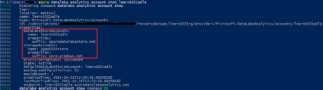

<properties 
   pageTitle="Gérer les Azure données Lake Analytique à l’aide d’Azure de ligne de commande Interface | Azure" 
   description="Découvrez comment gérer les comptes données Lake Analytique, les sources de données, les travaux et les utilisateurs à l’aide d’Azure infrastructure du langage commun" 
   services="data-lake-analytics" 
   documentationCenter="" 
   authors="edmacauley" 
   manager="jhubbard" 
   editor="cgronlun"/>
 
<tags
   ms.service="data-lake-analytics"
   ms.devlang="na"
   ms.topic="article"
   ms.tgt_pltfrm="na"
   ms.workload="big-data" 
   ms.date="05/16/2016"
   ms.author="edmaca"/>

# Gérer les Azure données Lake Analytique à l’aide d’Azure Interface de ligne de commande (CLI)

[AZURE.INCLUDE [manage-selector](../../includes/data-lake-analytics-selector-manage.md)]

Découvrez comment gérer les comptes Azure données Lake Analytique, des sources de données, des utilisateurs et des tâches à l’aide de la Azure. Pour afficher la rubrique Gestion à l’aide d’autres outils, cliquez sur l’onglet, sélectionnez ci-dessus.

**Conditions préalables**

Avant de commencer ce didacticiel, vous devez disposer des éléments suivants :

- **Azure un abonnement**. Voir [Azure obtenir la version d’évaluation gratuite](https://azure.microsoft.com/pricing/free-trial/).
- **Azure infrastructure du langage commun**. Voir [installer et configurer Azure infrastructure du langage commun](../xplat-cli-install.md).
    - Téléchargez et installez la **version précommerciale** [Azure infrastructure du langage commun outils](https://github.com/MicrosoftBigData/AzureDataLake/releases) pour effectuer cette démonstration.
- **Authentification**, en utilisant la commande suivante :

        azure login
    Pour plus d’informations sur l’authentification à l’aide d’un compte professionnel ou scolaire, voir [se connecter à un abonnement Azure depuis l’interface Azure](../xplat-cli-connect.md).
- **Basculer vers le mode directeur des ressources Azure**, en utilisant la commande suivante :

        azure config mode arm

**Pour répertorier les commandes données Lake Store et données Lake Analytique :**

    azure datalake store
    azure datalake analytics

<!-- ################################ -->
<!-- ################################ -->
## Gérer les comptes

Avant l’exécution de toutes les tâches données Lake Analytique, vous devez disposer d’un compte de données Lake Analytique. Contrairement à Azure HDInsight, vous ne pas payer pour un compte Analytique lorsqu’elle s’exécute pas une tâche.  Vous payez uniquement l’heure lorsqu’il s’exécute une tâche.  Pour plus d’informations, voir [Vue d’ensemble du Analytique Lake données Azure](data-lake-analytics-overview.md).  

###Créer des comptes

    azure datalake analytics account create "<Data Lake Analytics Account Name>" "<Azure Location>" "<Resource Group Name>" "<Default Data Lake Account Name>"

###Mettre à jour des comptes

La commande suivante met à jour les propriétés d’un compte d’Analytique Lake données existant
    
    azure datalake analytics account set "<Data Lake Analytics Account Name>"

###Liste des comptes

Comptes d’Analytique Lake de données de liste 

    azure datalake analytics account list

Comptes d’Analytique Lake de données de liste dans un groupe de ressources spécifique

    azure datalake analytics account list -g "<Azure Resource Group Name>"

Obtenir des détails d’un compte de données Lake Analytique spécifique

    azure datalake analytics account show -g "<Azure Resource Group Name>" -n "<Data Lake Analytics Account Name>"

###Supprimer des comptes de données Lake Analytique

    azure datalake analytics account delete "<Data Lake Analytics Account Name>"

<!-- ################################ -->
<!-- ################################ -->
## Gérer les sources de données de compte

Données Lake Analytique prend actuellement en charge les sources de données suivantes :

- [Magasin de Lake données Azure](../data-lake-store/data-lake-store-overview.md)
- [Stockage Azure](../storage/storage-introduction.md)

Lorsque vous créez un compte Analytique, vous devez désigner un compte de stockage Lake des données Azure le compte de stockage par défaut. Le compte de stockage par défaut ADL permet de stocker le travail métadonnées et tâche les journaux d’audit. Après avoir créé un compte Analytique, vous pouvez ajouter des comptes supplémentaires de stockage des données Lake et/ou compte de stockage Azure. 

### Trouver le compte de stockage ADL par défaut

    azure datalake analytics account show "<Data Lake Analytics Account Name>"

La valeur est répertoriée sous propriétés : datalakeStoreAccount:name.

### Ajouter d’autres comptes de stockage Blob Azure

    azure datalake analytics account datasource add -n "<Data Lake Analytics Account Name>" -b "<Azure Blob Storage Account Short Name>" -k "<Azure Storage Account Key>"

>[AZURE.NOTE] Que Blob stockage des noms courts sont prises en charge.  N’utilisez pas nom de domaine complet, par exemple « myblob.blob.core.windows.net ».

### Ajouter d’autres comptes de données Lake Store

    azure datalake analytics account datasource add -n "<Data Lake Analytics Account Name>" -l "<Data Lake Store Account Name>" [-d]

[-d] est un commutateur facultatif pour indiquer si la Lake données ajouté est le compte Lake de données par défaut. 

### Mettre à jour de la source de données existante

Pour configurer un compte existant magasin Lake de données par défaut :

    azure datalake analytics account datasource set -n "<Data Lake Analytics Account Name>" -l "<Azure Data Lake Store Account Name>" -d
      
Pour mettre à jour une clé de compte de stockage Blob existante :

    azure datalake analytics account datasource set -n "<Data Lake Analytics Account Name>" -b "<Blob Storage Account Name>" -k "<New Blob Storage Account Key>"

### Liste des sources de données :

    azure datalake analytics account show "<Data Lake Analytics Account Name>"
    

### Supprimer des sources de données :

Pour supprimer un compte de données Lake Store :

    azure datalake analytics account datasource delete "<Data Lake Analytics Account Name>" "<Azure Data Lake Store Account Name>"

Pour supprimer un compte de stockage Blob :

    azure datalake analytics account datasource delete "<Data Lake Analytics Account Name>" "<Blob Storage Account Name>"

## Gérer les travaux

Vous devez disposer un compte données Lake Analytique avant de pouvoir créer une tâche.  Pour plus d’informations, voir [Gérer les données Lake Analytique comptes](#manage-accounts).

### Répertorier les tâches

    azure datalake analytics job list -n "<Data Lake Analytics Account Name>"

### Obtenir des détails d’une tâche

    azure datalake analytics job show -n "<Data Lake Analytics Account Name>" -j "<Job ID>"
    
### Soumettre des tâches

> [AZURE.NOTE] La priorité par défaut d’une tâche est de 1 000 et degré de parallélisme pour une tâche par défaut est 1.

    azure datalake analytics job create  "<Data Lake Analytics Account Name>" "<Job Name>" "<Script>"

### Annuler les travaux

Utilisez la commande de liste pour trouver l’id de la tâche, puis utilisez Annuler pour annuler la tâche.

    azure datalake analytics job list -n "<Data Lake Analytics Account Name>"
    azure datalake analytics job cancel "<Data Lake Analytics Account Name>" "<Job ID>"

## Gérer le catalogue

Le catalogue U-SQL est utilisé pour structurer des données et le code afin qu’ils peuvent être partagés par les scripts U-SQL. Le catalogue permet les meilleures performances possibles avec des données dans Azure données Lake. Pour plus d’informations, voir [utiliser U-SQL catalogue](data-lake-analytics-use-u-sql-catalog.md).
 
###Liste des éléments du catalogue

    #List databases
    azure datalake analytics catalog list -n "<Data Lake Analytics Account Name>" -t database

    #List tables
    azure datalake analytics catalog list -n "<Data Lake Analytics Account Name>" -t table
    
Les types d’incluent la base de données, schéma, assemblage, source de données externe, tableau, fonction table ou une statistiques de la table.

###Créer le code secret de catalogue

    azure datalake analytics catalog secret create -n "<Data Lake Analytics Account Name>" <databaseName> <hostUri> <secretName>

### Modifier le code secret catalogue

    azure datalake analytics catalog secret set -n "<Data Lake Analytics Account Name>" <databaseName> <hostUri> <secretName>

###Supprimer le code secret de catalogue

    azure datalake analytics catalog secrete delete -n "<Data Lake Analytics Account Name>" <databaseName> <hostUri> <secretName>

<!-- ################################ -->
<!-- ################################ -->
## Utiliser des groupes de processeur

Applications sont généralement constituées de nombreux composants, par exemple une application web, base de données, serveur de base de données, stockage et 3e partie services. Azure Resource Manager (ARM) vous permet de travailler avec les ressources dans votre application en tant que groupe, appelée un groupe de ressources Azure. Vous pouvez déployer, mettre à jour, surveiller ou supprimer toutes les ressources pour votre application dans une seule opération coordonnée. Vous utilisez un modèle pour le déploiement et ce modèle peut utiliser pour les différents environnements telles que le test, intermédiaire et production. Vous pouvez clarifier facturation pour votre organisation en affichant les coûts reportées pour l’ensemble du groupe. Pour plus d’informations, voir [Vue d’ensemble du Gestionnaire de ressources Azure](../azure-resource-manager/resource-group-overview.md). 

Un service de données Lake Analytique peut inclure les éléments suivants :

- Compte d’Analytique Lake de données Azure
- Compte de stockage Lake des données Azure requis par défaut
- Comptes de stockage supplémentaire Azure données Lake
- Autres comptes de stockage Azure

Vous pouvez créer tous ces composants sous un seul groupe processeur afin de les retrouver plus facile à gérer.

Un compte de données Lake Analytique et les comptes de stockage dépendant doivent être placés dans le centre de données Azure même.
Le groupe processeur peut toutefois résider dans un centre de données différents.  

##Voir aussi 

- [Vue d’ensemble de Microsoft Azure données Lake Analytique](data-lake-analytics-overview.md)
- [Prise en main données Lake Analytique à l’aide du portail Azure](data-lake-analytics-get-started-portal.md)
- [Gérer les Azure données Lake Analytique à l’aide du portail Azure](data-lake-analytics-manage-use-portal.md)
- [Surveiller et résoudre les problèmes de travaux Azure données Lake Analytique à l’aide du portail Azure](data-lake-analytics-monitor-and-troubleshoot-jobs-tutorial.md)

