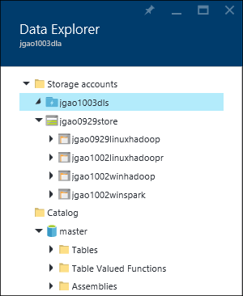
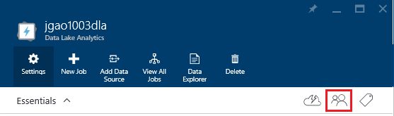
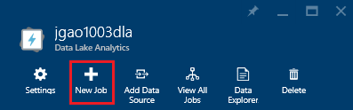
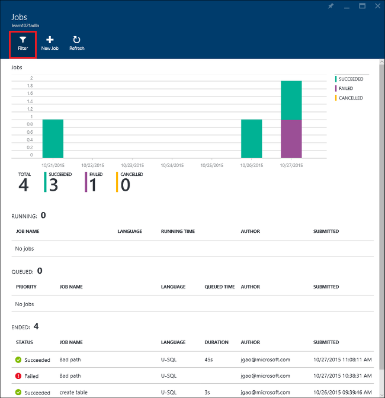
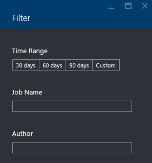

<properties 
   pageTitle="Gérer les Azure données Lake Analytique à l’aide du portail Azure | Azure" 
   description="Découvrez comment gérer acounts données Lake Analytique, des sources de données, des utilisateurs et des tâches." 
   services="data-lake-analytics" 
   documentationCenter="" 
   authors="edmacauley" 
   manager="jhubbard" 
   editor="cgronlun"/>
 
<tags
   ms.service="data-lake-analytics"
   ms.devlang="na"
   ms.topic="article"
   ms.tgt_pltfrm="na"
   ms.workload="big-data" 
   ms.date="10/06/2016"
   ms.author="edmaca"/>

# Gérer les Azure données Lake Analytique à l’aide du portail Azure

[AZURE.INCLUDE [manage-selector](../../includes/data-lake-analytics-selector-manage.md)]

Découvrez comment gérer les comptes Azure données Lake Analytique, des sources de données de compte, des utilisateurs et des tâches à l’aide du portail Azure. Pour afficher les rubriques gestion à l’aide d’autres outils, cliquez sur le sélecteur d’onglet en haut de la page.

**Conditions préalables**

Avant de commencer ce didacticiel, vous devez disposer des éléments suivants :

- **Azure un abonnement**. Voir [Azure obtenir la version d’évaluation gratuite](https://azure.microsoft.com/pricing/free-trial/).

<!-- ################################ -->
<!-- ################################ -->
## Gérer les comptes

Avant l’exécution de toutes les tâches données Lake Analytique, vous devez disposer d’un compte de données Lake Analytique. Contrairement à Azure HDInsight, vous ne payez pour un compte de données Lake Analytique lorsque vous exécutez une tâche.  Vous payez uniquement l’heure lorsqu’il s’exécute une tâche.  Pour plus d’informations, voir [Vue d’ensemble du Analytique Lake données Azure](data-lake-analytics-overview.md).  

**Pour créer un compte de données Lake Analytique**

1. Ouverture de session sur le [portail Azure](https://portal.azure.com).
2. Cliquez sur **Nouveau**et cliquez sur **Intelligence + analytique**, puis cliquez sur **Données Lake Analytique**.
3. Tapez ou sélectionnez les valeurs suivantes :

    

    - **Nom**: nom du compte de données Lake Analytique.
    - **Abonnement**: sélectionnez l’abonnement Azure utilisé pour le compte Analytique.
    - **Groupe de ressources**. Sélectionnez un groupe de ressources Azure existant ou créez-en un. Le Gestionnaire de ressources Azure permet de vous permettent de travailler avec les ressources dans votre application en tant que groupe. Pour plus d’informations, voir [Vue d’ensemble du Gestionnaire de ressources Azure](resource-group-overview.md). 
    - **Emplacement**. Sélectionnez un centre de données Azure pour le compte de données Lake Analytique. 
    - **Données Lake Store**: chaque données Lake Analytique compte possède un compte de données Lake Store dépendant. Les données Lake Analytique et au compte de données Lake Store dépendant doivent se trouver dans le centre de données Azure même. Suivez les instructions pour créer un nouveau compte de données Lake Store, ou sélectionnez-en un.

8. Cliquez sur **créer**. Il vous permet d’accéder à l’écran d’accueil du portail. Une vignette est ajoutée à la StartBoard avec l’étiquette indiquant « Déploiement d’Azure données Lake Analytique ». Il faut quelques instants pour créer un compte de données Lake Analytique. Lorsque le compte est créé, le portail s’ouvre le compte sur une nouvelle carte.

Après la création d’un compte de données Lake Analytique, vous pouvez ajouter des comptes données Lake Store supplémentaires et le stockage Azure. Pour plus d’informations, voir [Gérer les données lake Analytique du compte des sources de données](data-lake-analytics-manage-use-portal.md#manage-account-data-sources).

**Accès/Ouvrir un compte de données Lake Analytique**

1. Ouverture de session sur le [portail Azure](https://portal.azure.com/).
2. Dans le menu de gauche, cliquez sur **Données Lake Analytique** .  Si vous ne voyez pas, cliquez sur **plusieurs services**, puis cliquez sur **Données Lake Analytique** sous **Intelligence + Analytique**.
3. Cliquez sur le compte de données Lake Analytique auquel vous souhaitez accéder. Il s’ouvre le compte dans une nouvelle carte.

**Pour supprimer un compte de données Lake Analytique**

1. Ouvrez le compte Analytique Lake de données que vous voulez supprimer. Pour plus d’informations, voir [comptes d’accès aux données Lake Analytique](#access-adla-account).
2. Cliquez sur **Supprimer** dans le menu du bouton en haut de la carte.
3. Tapez le nom du compte, puis cliquez sur **Supprimer**.

Suppression d’un compte de données Lake Analytique ne supprime pas les comptes de données Lake Store dépendantes. Pour obtenir des instructions de suppression d’un compte de stockage des données Lake, voir [Supprimer données Lake Store compte](data-lake-store-get-started-portal.md#delete-azure-data-lake-store-account).

<!-- ################################ -->
<!-- ################################ -->
## Gérer les sources de données de compte

Données Lake Analytique prend actuellement en charge les sources de données suivantes :

- [Magasin de Lake données Azure](../data-lake-store/data-lake-store-overview.md)
- [Stockage Azure](../storage/storage-introduction.md)

Lorsque vous créez un compte de données Lake Analytique, vous devez désigner un compte Azure données Lake Store à être le compte de stockage par défaut. Le compte par défaut données Lake permet de stocker le travail métadonnées et tâche les journaux d’audit. Après avoir créé un compte de données Lake Analytique, vous pouvez ajouter des comptes supplémentaires données Lake Store et/ou compte de stockage Azure. 

**Pour trouver le compte de stockage de données Lake par défaut**

- Ouvrez le compte Analytique Lake de données que vous voulez gérer. Pour plus d’informations, voir [comptes d’accès aux données Lake Analytique](#access-adla-account). La banque de données Lake par défaut est montrée dans **essentiels**:

    

**Pour ajouter des sources de données supplémentaires**

1. Ouvrez le compte Analytique Lake de données que vous voulez gérer. Pour plus d’informations, voir [comptes d’accès aux données Lake Analytique](#access-adla-account).
2. Cliquez sur **paramètres** , puis sur **Sources de données**. Doit s’affiche le compte de données Lake magasin par défaut dans la liste. 
3. Cliquez sur **Ajouter une Source de données**.

    

    Pour ajouter un compte Azure données Lake Store, vous devez le compte, accès et le nom à ce compte doivent pouvoir interroger.
    Pour ajouter un stockage d’objets Blob Azure, vous devez le compte de stockage et de la clé de compte, qui se trouve en accédant au compte de stockage dans le portail.

**Pour Explorer les sources de données**  

1. Ouvrez le compte Analytique que vous voulez gérer. Pour plus d’informations, voir [comptes d’accès aux données Lake Analytique](#access-adla-account).
2. Cliquez sur **paramètres** , puis sur **Explorateur de données**. 
 
    
    
3. Cliquez sur un compte de données Lake Store pour ouvrir le compte.

    
    
    Pour chaque compte magasin Lake de données, vous pouvez
    
    - **Nouveau dossier**: ajouter le nouveau dossier.
    - **Télécharger**: télécharger des fichiers sur le compte de stockage à partir de votre poste de travail.
    - **Access**: configurer l’accès aux autorisations.
    - **Renommer un dossier**: renommer un dossier.
    - **Propriétés des dossiers**: afficher les propriétés de fichier ou un dossier, telles que le chemin WASB, WEBHDFS, heure de dernière modification et ainsi de suite.
    - **Supprimer le dossier**: supprimer un dossier.

**Télécharger des fichiers à compte données Lake Store**

1. À partir du portail, cliquez sur **Parcourir** dans le menu de gauche, puis cliquez sur **Données Lake Store**.
2. Cliquez sur le compte magasin Lake de données que vous souhaitez télécharger des données. Pour trouver le compte de stockage des données Lake par défaut, voir [ici](#default-adl-account).
3. Cliquez sur **Explorateur de données** dans le menu supérieur.
4. Cliquez sur **Nouveau répertoire** pour créer un dossier, ou cliquez sur nom du dossier pour changer de dossier.
6. Dans le menu supérieur pour télécharger un fichier, cliquez sur **Télécharger** .

**Télécharger des fichiers à compte de stockage Blob Azure**

Voir [télécharger des données pour les projets Hadoop de HDInsight](../hdinsight/hdinsight-upload-data.md).  Les informations s’appliquent aux données Lake Analytique.

## Gérer les utilisateurs

Données Lake Analytique utilise le contrôle d’accès basé sur un rôle avec Azure Active Directory. Lorsque vous créez un compte de données Lake Analytique, un rôle « Administrateurs de l’abonnement » est ajouté à ce compte. Vous pouvez ajouter des utilisateurs et groupes de sécurité avec les rôles suivants :

|Rôle|Description|
|----|-----------|
|Propriétaire|Vous permettent de gérer tous les éléments, y compris l’accès aux ressources.|
|Collaboration|Accéder au portail ; envoyer et surveiller les tâches. Pour pouvoir à soumettre des tâches, un collaborateur doit l’autorisation de lecture ou d’écriture pour les comptes de données Lake Store.|
|DataLakeAnalyticsDeveloper | Soumettre, surveiller et annuler les travaux.  Ces utilisateurs peuvent annuler uniquement leurs propres travaux. Ils ne peuvent pas gérer leur propre compte, par exemple, ajouter des utilisateurs, modifier les autorisations ou supprimer le compte. Pour pouvoir exécuter des tâches, dont elles ont besoin d’accès en lecture ou écriture aux comptes données Lake Store     | 
|Reader|Vous permet de vous permet d’afficher tout le contenu, mais pas apporter des modifications.|  
|DevTest ateliers utilisateur|Permet d’afficher tous les éléments et vous connecter, machines virtuelles début, de redémarrage et d’arrêt.|  
|Administrateur de l’accès utilisateur|Vous permet de gérer l’accès utilisateur aux ressources Azure.|  

Pour plus d’informations sur la création de groupes de sécurité et les utilisateurs Azure Active Directory, consultez [Nouveautés Azure Active Directory](../active-directory/active-directory-whatis.md).

**Pour ajouter des utilisateurs ou groupes de sécurité à un compte de données Lake Analytique**

1. Ouvrez le compte Analytique que vous voulez gérer. Pour plus d’informations, voir [comptes d’accès aux données Lake Analytique](#access-adla-account).
2. Cliquez sur **paramètres**, puis cliquez sur **utilisateurs**. Vous pouvez également cliquer sur **accès** dans la barre de titre **Essentials** comme le montre la capture d’écran suivante :

    
3. Dans la carte de **l’utilisateur** , cliquez sur **Ajouter**.
4. Sélectionnez un rôle et ajouter un utilisateur, puis cliquez sur **OK**.

**Remarque : Si cet utilisateur ou groupe de sécurité doit à soumettre des tâches, ils doivent être autorisés dans le magasin de Lake données également. Pour plus d’informations, voir [sécuriser les données stockées dans données Lake sécurisée](../data-lake-store/data-lake-store-secure-data.md).**

<!-- ################################ -->
<!-- ################################ -->
## Gérer les travaux

Vous devez disposer un compte données Lake Analytique avant de pouvoir exécuter toutes les tâches U-SQL.  Pour plus d’informations, voir [Gérer les données Lake Analytique comptes](#manage-data-lake-analytics-accounts).

**Pour créer une tâche**

1. Ouvrez le compte Analytique que vous voulez gérer. Pour plus d’informations, voir [comptes d’accès aux données Lake Analytique](#access-adla-account).
2. Cliquez sur **nouvelle tâche**.

    

    Vous doit afficher une nouvelle carte semblable à :

    

    Pour chaque tâche, vous pouvez configurer

  	|Nom|Description|
  	|----|-----------|
  	|Nom de la tâche|Entrez le nom de la tâche.|
  	|Priorité|Nombre inférieur comporte une priorité plus élevée. Si deux tâches sont les deux en file d’attente, une équipée de basse priorité s’exécute en premier|
  	|Parallélisme |Nombre maximal de processus cluster qui peut se produire en même temps. Augmentation de cette valeur peut améliorer les performances, mais peut également augmenter le coût.|
  	|Script|Entrez le script U-SQL pour la tâche.|

    À l’aide de la même interface, vous pouvez également Explorer les sources de données lien et ajouter des fichiers supplémentaires aux sources de données liées. 
3. Cliquez sur **Envoyer le travail** si vous souhaitez soumettre la tâche.

**Soumettre une tâche**

Voir [créer des données Lake Analytique des travaux](#create-job).

**Pour contrôler les tâches**

1. Ouvrez le compte Analytique que vous voulez gérer. Pour plus d’informations, voir [comptes d’accès aux données Lake Analytique](#access-adla-account). Le panneau de gestion des tâches affiche les informations de projet simple :

    

3. Cliquez sur **Gestion des tâches** comme le montre la capture d’écran précédent.

    

4. Cliquez sur une tâche dans les listes. Ou cliquez sur **filtre** pour vous aider à trouver les tâches :

    

    Vous pouvez filtrer les tâches par **Période**, **Nom de la tâche**et **l’auteur**.
5. Si vous voulez renvoyer la tâche, cliquez sur **soumettre à nouveau** .

**Soumettre une tâche**

Voir [des travaux moniteur données Lake Analytique](#monitor-jobs).

##Surveillez l’utilisation du compte

**Surveiller l’utilisation du compte**

1. Ouvrez le compte Analytique que vous voulez gérer. Pour plus d’informations, voir [comptes d’accès aux données Lake Analytique](#access-adla-account). Le panneau d’utilisation affiche l’utilisation :

    

2. Double-cliquez sur le volet pour afficher plus de détails.

##Afficher le catalogue U-SQL

Le [catalogue U SQL](data-lake-analytics-use-u-sql-catalog.md) est utilisé pour structurer des données et le code afin qu’ils peuvent être partagés par les scripts U-SQL. Le catalogue permet les meilleures performances possibles avec des données dans Azure données Lake. À partir du portail Azure, vous êtes en mesure d’afficher le catalogue U-SQL.

**Pour parcourir le catalogue U SQL**

1. Ouvrez le compte Analytique que vous voulez gérer. Pour plus d’informations, voir [comptes d’accès aux données Lake Analytique](#access-adla-account).
2. Cliquez sur **Explorateur de données** dans le menu supérieur.
3. Développez **catalogue**, **maître**, **Tables, ou **fonctions Table**, ou **assemblys **. La capture d’écran suivante montre une fonction table.

    

<!-- ################################ -->
<!-- ################################ -->
## Utiliser des groupes de gestionnaire de ressources Azure

Applications sont généralement constituées de nombreux composants, par exemple une application web, base de données, serveur de base de données, stockage et les services tiers. Le Gestionnaire de ressources Azure permet de vous permettent de travailler avec les ressources dans votre application en tant que groupe, appelée un groupe de ressources Azure. Vous pouvez déployer, mettre à jour, surveiller ou supprimer toutes les ressources pour votre application dans une seule opération coordonnée. Vous utilisez un modèle pour le déploiement et ce modèle peut utiliser pour les différents environnements tels que le test, intermédiaire et de production. Vous pouvez clarifier facturation pour votre organisation en affichant les coûts reportées pour l’ensemble du groupe. Pour plus d’informations, voir [Vue d’ensemble du Gestionnaire de ressources Azure](../azure-resource-manager/resource-group-overview.md). 

Un service de données Lake Analytique peut inclure les éléments suivants :

- Compte d’Analytique Lake de données Azure
- Requis par défaut compte Azure données Lake Store
- Comptes complémentaire Azure données Lake Store
- Autres comptes de stockage Azure

Vous pouvez créer tous ces composants dans un groupe de gestion des ressources pour les rendre plus facile à gérer.

Un compte de données Lake Analytique et les comptes de stockage dépendant doivent être placés dans le centre de données Azure même.
Le groupe de gestion des ressources peut toutefois résider dans un centre de données différents.  

##Voir aussi 

- [Vue d’ensemble de Microsoft Azure données Lake Analytique](data-lake-analytics-overview.md)
- [Prise en main données Lake Analytique à l’aide du portail Azure](data-lake-analytics-get-started-portal.md)
- [Gérer les Azure données Lake Analytique à l’aide de PowerShell Azure](data-lake-analytics-manage-use-powershell.md)
- [Surveiller et résoudre les problèmes de travaux Azure données Lake Analytique à l’aide du portail Azure](data-lake-analytics-monitor-and-troubleshoot-jobs-tutorial.md)

