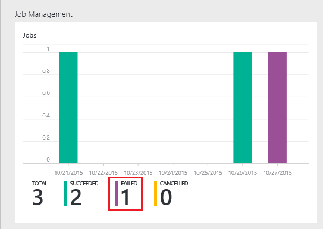

<properties 
   pageTitle="Résoudre les problèmes de travaux Azure données Lake Analytique à l’aide du portail Azure | Azure" 
   description="Découvrez comment utiliser le portail Azure pour résoudre les travaux de données Lake Analytique. " 
   services="data-lake-analytics" 
   documentationCenter="" 
   authors="edmacauley" 
   manager="jhubbard" 
   editor="cgronlun"/>
 
<tags
   ms.service="data-lake-analytics"
   ms.devlang="na"
   ms.topic="article"
   ms.tgt_pltfrm="na"
   ms.workload="big-data" 
   ms.date="05/16/2016"
   ms.author="edmaca"/>

# Résoudre les problèmes de travaux Azure données Lake Analytique à l’aide du portail Azure

Découvrez comment utiliser le portail Azure pour résoudre les travaux de données Lake Analytique.

Dans ce didacticiel, vous configurer un problème de fichier source manquant et le portail Azure permet de résoudre le problème.

**Conditions préalables**

Avant de commencer ce didacticiel, vous devez disposer des éléments suivants :

- **Processus de tâche de connaissances de base de données Lake Analytique**. Voir [prise en main Azure données Lake Analytique à l’aide du portail Azure](data-lake-analytics-get-started-portal.md).
- **Compte A données Lake Analytique**. Voir [prise en main Azure données Lake Analytique à l’aide du portail Azure](data-lake-analytics-get-started-portal.md#create-adl-analytics-account).
- **Copier les données d’exemple pour le compte de données Lake Store par défaut**.  Voir [préparer des données source](data-lake-analytics-get-started-portal.md#prepare-source-data)

##Soumettre une tâche de données Lake Analytique

Maintenant, vous allez créer un travail U-SQL avec un nom de fichier source incorrectes.  

**Soumettre le travail**

1. À partir du portail Azure, cliquez sur **Microsoft Azure** dans le coin supérieur gauche.
2. Cliquez sur la vignette avec votre nom de compte données Lake Analytique.  Il a été épinglée ici lorsque le compte a été créé.
Si le compte n’est pas épinglé il, voir [Ouvrir un compte Analytique à partir du portail](data-lake-analytics-manage-use-portal.md#access-adla-account).
3. Cliquez sur **Nouvelle tâche** dans le menu supérieur.
4. Entrez un nom de travail et le script U SQL suivant :

        @searchlog =
            EXTRACT UserId          int,
                    Start           DateTime,
                    Region          string,
                    Query           string,
                    Duration        int?,
                    Urls            string,
                    ClickedUrls     string
            FROM "/Samples/Data/SearchLog.tsv1"
            USING Extractors.Tsv();
        
        OUTPUT @searchlog   
            TO "/output/SearchLog-from-adls.csv"
        USING Outputters.Csv();

    Le fichier source défini dans le script est **/Samples/Data/SearchLog.tsv1**, où il doit être **/Samples/Data/SearchLog.tsv**.
     
5. Cliquez sur **Soumettre une tâche** à partir du haut. Un nouveau volet de détails de la tâche s’ouvre. Dans la barre de titre, il affiche l’état du travail. Il faut quelques minutes pour terminer. Vous pouvez cliquer sur **Actualiser** pour obtenir le dernier état.
6. Attendez que l’état du travail est modifié en **Échec**.  Si la tâche est **a réussi**, c’est parce que vous n’avez pas supprimer le dossier /Samples.. Consultez la section **prérequises** au début de ce didacticiel.

Vous vous demandez peut-être - raison pour laquelle si longue pour une tâche de petite.  N’oubliez pas de que données Lake Analytique est conçu pour traiter des données volumineuses.  Il éclaire lors du traitement d’une grande quantité de données à l’aide de son système distribué.

Nous allons Supposons que vous avez envoyé le travail, puis fermez le portail.  Dans la section suivante, vous allez apprendre à résoudre les problèmes de la tâche.

## Résoudre les problèmes de la tâche

Dans la dernière section, vous avez envoyé un travail et le travail a échoué.  

**Pour afficher toutes les tâches**

1. À partir du portail Azure, cliquez sur **Microsoft Azure** dans le coin supérieur gauche.
2. Cliquez sur la vignette avec votre nom de compte données Lake Analytique.  La tâche récapitulative est affichée sur la vignette de **Gestion des tâches** .

    
    
    La gestion de projet vous donne un coup de œil de l’état du travail. Notez qu’il existe une tâche a échoué.
   
3. Cliquez sur la vignette de **Gestion des tâches** pour afficher les tâches. Les tâches sont classées dans **en cours d’exécution**, **en attente**et **terminé**. Vous doit afficher votre tâche Échec dans la section **terminé** . Il doit être le premier d'entre eux dans la liste. Lorsque vous avez un grand nombre de tâches, vous pouvez cliquer sur **filtre** pour vous aider à trouver des travaux.

    

4. Cliquez sur la tâche dans la liste pour ouvrir les détails d’une tâche dans une nouvelle carte Échec :

    
    
    Notez le bouton **Envoyer à nouveau** . Après avoir résolu le problème, vous pouvez renvoyer la tâche.

5. Cliquez sur composant WebPart mis en surbrillance à partir de la capture d’écran précédente pour ouvrir les détails de l’erreur.  Vous doit ressembler à :

    

    Elle vous indique le dossier source n’est pas trouvé.
    
6. Cliquez sur **Dupliquer Script**.
7. Mettre à jour le chemin d’accès **FROM** à ce qui suit :

    « / Samples/Data/SearchLog.tsv »

8. Cliquez sur **Envoyer la tâche**.

##Voir aussi

- [Vue d’ensemble des Analytique Lake de données Azure](data-lake-analytics-overview.md)
- [Prise en main Azure données Lake Analytique à l’aide de PowerShell Azure](data-lake-analytics-get-started-powershell.md)
- [Prise en main Azure données Lake Analytique et U-SQL à l’aide de Visual Studio](data-lake-analytics-u-sql-get-started.md)
- [Gérer les Azure données Lake Analytique à l’aide du portail Azure](data-lake-analytics-manage-use-portal.md)

