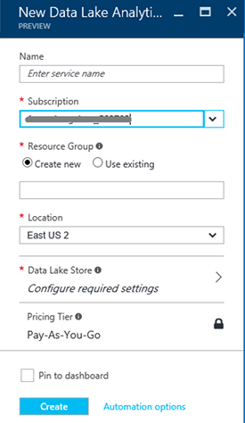

<properties 
   pageTitle="Découvrez données Lake Analytique et U-SQL en utilisant les didacticiels Azure Portal interactifs | Azure" 
   description="Démarrage rapide d’apprentissage des données Lake Analytique et U-SQL. " 
   services="data-lake-analytics" 
   documentationCenter="" 
   authors="edmacauley" 
   manager="jhubbard" 
   editor="cgronlun"/>
 
<tags
   ms.service="data-lake-analytics"
   ms.devlang="na"
   ms.topic="get-started-article"
   ms.tgt_pltfrm="na"
   ms.workload="big-data" 
   ms.date="05/16/2016"
   ms.author="edmaca"/>

# Utiliser les didacticiels interactifs Azure données Lake Analytique

Le portail Azure fournit un didacticiel interactif pour vous familiariser avec les données Lake Analytique. Cet article vous montre comment parcourir le didacticiel pour analyser les journaux de site Web.

>[AZURE.NOTE]Si vous voulez parcourir le même didacticiel à l’aide de Visual Studio, voir [analyser les journaux de site Web à l’aide de données Lake Analytique](data-lake-analytics-analyze-weblogs.md).
>Didacticiels plus interactifs à ajouter au portail.

Pour d’autres didacticiels, voir :

- [Prise en main données Lake Analytique à l’aide du portail Azure](data-lake-analytics-get-started-portal.md)
- [Prise en main données Lake Analytique à l’aide de PowerShell Azure](data-lake-analytics-get-started-powershell.md)
- [Prise en main données Lake Analytique à l’aide du Kit de développement .NET](data-lake-analytics-get-started-net-sdk.md)
- [Développer des scripts U-SQL à l’aide de Lake Data Tools pour Visual Studio](data-lake-analytics-data-lake-tools-get-started.md) 

**Conditions préalables**

Avant de commencer ce didacticiel, vous devez disposer des éléments suivants :

- **Compte A données Lake Analytique**.  Voir [Prise en main Azure données Lake Analytique à l’aide du portail Azure](data-lake-analytics-get-started-portal.md).

##Créer le compte de données Lake Analytique 

Vous devez disposer un compte données Lake Analytique avant de pouvoir exécuter toutes les tâches.

Chaque compte données Lake Analytique comporte une dépendance de compte [Azure données Lake Store](../data-lake-store/data-lake-store-overview.md) .  Ce compte est désigné comme compte par défaut données Lake Store.  Vous pouvez créer le compte de données Lake Store au préalable ou lorsque vous créez votre compte de données Lake Analytique. Dans ce didacticiel, vous allez créer le compte données Lake avec le compte Analytique

**Pour créer un compte de données Lake Analytique**

1. Ouvrez une session sur le [portail Azure](https://portal.azure.com/signin/index/?Microsoft_Azure_Kona=true&Microsoft_Azure_DataLake=true&hubsExtension_ItemHideKey=AzureDataLake_BigStorage%2cAzureKona_BigCompute).
2. Cliquez sur **Microsoft Azure** dans le coin supérieur gauche pour ouvrir le StartBoard.
3. Cliquez sur la vignette **Marketplace** .  
3. Tapez **Azure données Lake Analytique** dans la zone de recherche sur la carte **tous les éléments** , puis appuyez sur **entrée**. Vous sont voir **Azure données Lake Analytique** dans la liste.
4. Dans la liste, cliquez sur **Azure données Lake Analytique** .
5. Cliquez sur **créer** en bas de la carte.
6. Tapez ou sélectionnez les options suivantes :

    

    - **Nom**: nom du compte Analytique.
    - **Données Lake Store**: chaque données Lake Analytique compte possède un compte de données Lake Store dépendant. Les données Lake Analytique et au compte de données Lake Store dépendant doivent se trouver dans le centre de données Azure même. Suivez les instructions pour créer un nouveau compte de données Lake Store, ou sélectionnez-en un.
    - **Abonnement**: sélectionnez l’abonnement Azure utilisé pour le compte Analytique.
    - **Groupe de ressources**. Sélectionnez un groupe de ressources Azure existant ou créez-en un. Applications sont généralement constituées de nombreux composants, par exemple une application web, base de données, serveur de base de données, stockage et 3e partie services. Azure Resource Manager (ARM) vous permet de travailler avec les ressources dans votre application en tant que groupe, appelée un groupe de ressources Azure. Vous pouvez déployer, mettre à jour, surveiller ou supprimer toutes les ressources pour votre application dans une seule opération coordonnée. Vous utilisez un modèle pour le déploiement et ce modèle peut utiliser pour les différents environnements telles que le test, intermédiaire et production. Vous pouvez clarifier facturation pour votre organisation en affichant les coûts reportées pour l’ensemble du groupe. Pour plus d’informations, voir [Vue d’ensemble du Gestionnaire de ressources Azure](azure-resource-manager/resource-group-overview.md). 
    - **Emplacement**. Sélectionnez un centre de données Azure pour le compte de données Lake Analytique. 
7. Sélectionnez **attacher aux Startboard**. Cela est nécessaire pour suivre ce didacticiel.
8. Cliquez sur **créer**. Il vous permet d’accéder au portail StartBoard. Une vignette est ajoutée à la page d’accueil avec l’étiquette indiquant « Déploiement d’Azure données Lake Analytique ». Il faut quelques instants pour créer un compte de données Lake Analytique. Lorsque le compte est créé, le portail s’ouvre le compte sur une nouvelle carte.

    

##Exécuter le didacticiel interactif de l’analyse des journaux site Web

**Pour ouvrir le didacticiel interactif Analytique journal de site Web**

1. À partir du portail, cliquez sur **Microsoft Azure** dans le menu de gauche pour ouvrir le StartBoard.
2. Cliquez sur la vignette est liée à votre compte de données Lake Analytique.
3. Cliquez sur **Explorer des didacticiels interactifs** à partir de la barre **Essentials** .

    

4. Si vous voyez un message d’avertissement orange » exemples n’est pas configurée, cliquez sur... », cliquez sur **Exemples de données copier** pour copier les données d’exemple pour le compte de données Lake Store par défaut. Le didacticiel interactif doit les données à exécuter.
5. À partir de la carte **Didacticiels interactifs** , cliquez sur **Site Web journal Analytique**. Le portail ouvre le didacticiel dans une nouvelle carte portail.
5. Cliquez sur **1 Introduction** , puis suivez les instructions

##Voir aussi

- [Vue d’ensemble de Microsoft Azure données Lake Analytique](data-lake-analytics-overview.md)
- [Prise en main données Lake Analytique à l’aide du portail Azure](data-lake-analytics-get-started-portal.md)
- [Prise en main données Lake Analytique à l’aide de PowerShell Azure](data-lake-analytics-get-started-powershell.md)
- [Développer des scripts U-SQL à l’aide de Lake Data Tools pour Visual Studio](data-lake-analytics-data-lake-tools-get-started.md)
- [Analyser les journaux de site Web à l’aide d’Azure données Lake Analytique](data-lake-analytics-analyze-weblogs.md)
