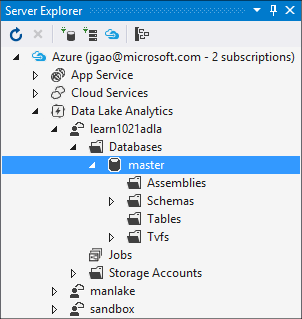

<properties
   pageTitle="Présenter le catalogue de données Lake Analytique U-SQL Azure | Azure"
   description="Présenter le catalogue de données Lake Analytique U-SQL Azure"
   services="data-lake-analytics"
   documentationCenter=""
   authors="edmacauley"
   manager="jhubbard"
   editor="cgronlun"/>

<tags
   ms.service="data-lake-analytics"
   ms.devlang="na"
   ms.topic="article"
   ms.tgt_pltfrm="na"
   ms.workload="big-data"
   ms.date="05/16/2016"
   ms.author="edmaca"/>

# Ouvrir le catalogue U-SQL

Le catalogue U-SQL est utilisé pour structurer des données et le code afin qu’ils peuvent être partagés par les scripts U-SQL. Le catalogue permet les meilleures performances possibles avec des données dans Azure données Lake.

Chaque compte Azure données Lake Analytique possède exactement un catalogue U-SQL associé. Vous ne pouvez pas supprimer le catalogue U-SQL. Actuellement catalogues U SQL ne peut pas être partagés entre des comptes de données Lake Store.

Chaque catalogue U-SQL contient une base de données appelée **masque**. Impossible de supprimer la base de données principale.  Chaque catalogue U-SQL peut contenir plusieurs bases de données supplémentaires.

Base de données SQL-U contient :

- Assemblys – partager le code .NET entre les scripts U-SQL.
- Fonctions de valeurs de la table – partager code U-SQL parmi les scripts U-SQL.
- Tables – partager des données entre les scripts U-SQL.
- Schémas - partagent des schémas de table entre les scripts U-SQL.

## Gérer les catalogues
Chaque compte Azure données Lake Analytique possède un compte Azure données Lake Store par défaut associé. Ce compte données Lake Store est désigné comme compte par défaut données Lake Store. U-SQL catalogue est stocké dans le compte de données Lake Store par défaut sous le dossier /catalog. Ne supprimez pas les fichiers dans le dossier /catalog.

### Utiliser le portail Azure

Voir [Gérer les données Lake Analytique à l’aide de portail](data-lake-analytics-manage-use-portal.md#view-u-sql-catalog)

### Utilisez Lake Data Tools pour Visual Studio.

Vous pouvez utiliser Data Lake Tools pour Visual Studio pour gérer le catalogue.  Pour plus d’informations sur les outils, consultez [à l’aide de données Lake Tools pour Visual Studio](data-lake-analytics-data-lake-tools-get-started.md).

**Pour gérer le catalogue**

1. Ouvrez Visual Studio et vous connecter à azure. Pour obtenir des instructions, voir [se connecter à Azure](data-lake-analytics-data-lake-tools-get-started.md#connect-to-azure).
1. Ouvrez **l’Explorateur de serveur** par appuyer sur **CTRL + ALT + S**.
2. Dans l' **Explorateur de serveurs**, développez **Azure**, développez **Données Lake Analytique**, développez votre compte données Lake Analytique, développez **bases de données**, puis puis **maître**.

    - Pour ajouter une nouvelle base de données, cliquez sur **base de données**, puis cliquez sur **Créer une base de données**.
    - Pour ajouter un nouvel assembly, **assemblys**d’avec le bouton droit, puis cliquez sur **Enregistrer un Assembly**.
    - Pour ajouter un nouveau schéma, **schémas**d’avec le bouton droit, puis cliquez sur « Créer schéma **.
    - Pour ajouter une nouvelle table, avec le bouton droit de **Tables**, puis cliquez sur « « Créer tableau **.
    - Pour ajouter une nouvelle fonction de table, voir [opérateurs pour les tâches de données Lake Analytique définis par l’utilisateur de développer U-SQL](data-lake-analytics-u-sql-develop-user-defined-operators.md).

## Voir aussi

- Prise en main
    - [Prise en main données Lake Analytique à l’aide du portail Azure](data-lake-analytics-get-started-portal.md)
    - [Prise en main données Lake Analytique à l’aide de PowerShell Azure](data-lake-analytics-get-started-powershell.md)
    - [Prise en main données Lake Analytique à l’aide du Kit de développement .NET Azure](data-lake-analytics-get-started-net-sdk.md)
    - [Développer des scripts U-SQL à l’aide de Lake Data Tools pour Visual Studio](data-lake-analytics-data-lake-tools-get-started.md)
    - [Prise en main langue données Lake Analytique U-SQL Azure](data-lake-analytics-u-sql-get-started.md)

- Développement et U-SQL
    - [Prise en main langue données Lake Analytique U-SQL Azure](data-lake-analytics-u-sql-get-started.md)
    - [Utiliser les fonctions de fenêtre U-SQL pour les tâches de Azure données Lake Analytique](data-lake-analytics-use-window-functions.md)
    - [Développer des opérateurs U-SQL sont définis par l’utilisateur pour les tâches de données Lake Analytique](data-lake-analytics-u-sql-develop-user-defined-operators.md)

- Gestion des
    - [Gérer les Azure données Lake Analytique à l’aide du portail Azure](data-lake-analytics-manage-use-portal.md)
    - [Gérer les Azure données Lake Analytique à l’aide de PowerShell Azure](data-lake-analytics-manage-use-powershell.md)
    - [Surveiller et résoudre les problèmes de travaux Azure données Lake Analytique à l’aide du portail Azure](data-lake-analytics-monitor-and-troubleshoot-jobs-tutorial.md)

- Didacticiel de bout en bout
    - [Utiliser les didacticiels interactifs Azure données Lake Analytique](data-lake-analytics-use-interactive-tutorials.md)
    - [Analyser les journaux de site Web à l’aide d’Azure données Lake Analytique](data-lake-analytics-analyze-weblogs.md)
