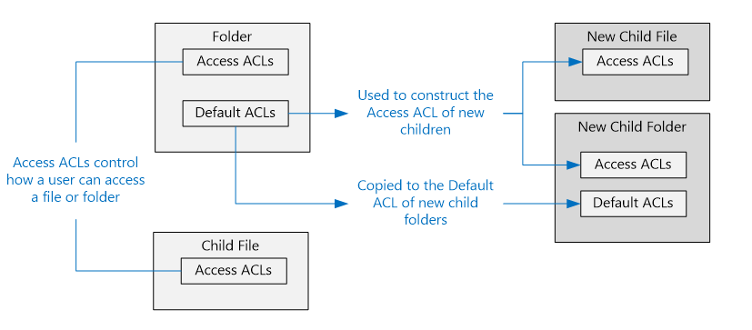
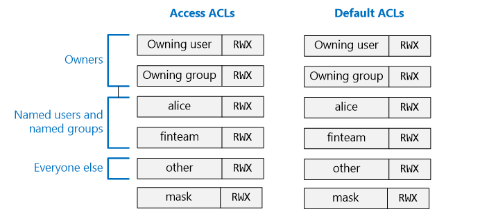

<properties
   pageTitle="Vue d’ensemble du contrôle d’accès données Lake Store | Microsoft Azure"
   description="Comprendre comment accéder contrôle dans le magasin de Lake données Azure"
   services="data-lake-store"
   documentationCenter=""
   authors="nitinme"
   manager="jhubbard"
   editor="cgronlun"/>

<tags
   ms.service="data-lake-store"
   ms.devlang="na"
   ms.topic="get-started-article"
   ms.tgt_pltfrm="na"
   ms.workload="big-data"
   ms.date="09/06/2016"
   ms.author="nitinme"/>

# Contrôle d’accès dans le magasin de Lake données Azure

Données Lake Store met en œuvre un modèle de contrôle d’accès qui est dérivée de HADOOP et à son tour, le modèle de contrôle d’accès POSIX. Cet article présente les notions de base du modèle de contrôle d’accès de données Lake Store. Pour en savoir plus sur la HADOOP contrôle d’accès au modèle de voir [Guide d’autorisations HADOOP](https://hadoop.apache.org/docs/current/hadoop-project-dist/hadoop-hdfs/HdfsPermissionsGuide.html).

## Listes de contrôle d’accès aux fichiers et dossiers

Il existe deux types d’accès aux listes de contrôle () - **Accès aux utilisateurs** et **Utilisateurs par défaut**.

* **Accès aux utilisateurs** – ces contrôle accès à un objet. Fichiers et dossiers ont accès.

* **Utilisateurs par défaut** – un « modèle « listes d’associé à un dossier qui déterminent les utilisateurs d’Access pour tous les éléments enfants créés sous ce dossier. Fichiers n’ont pas d’utilisateurs par défaut.

Accès aux utilisateurs et utilisateurs par défaut ont la même structure.

>[AZURE.NOTE] Modification du et par défaut sur un parent n’affecte pas l’accès ou par défaut et des éléments enfants qui existent déjà.

## Utilisateurs et des identités

Tous les fichiers et dossiers contient des autorisations distinctes pour les identités non gérées :

* L’utilisateur propriétaire du fichier
* Le propriétaire du groupe
* Utilisateurs nommés
* Groupes nommés
* Tous les autres utilisateurs

Les identités des utilisateurs et groupes sont donc identités Azure Active Directory (DAS), sauf indication contraire un « utilisateurs », dans le contexte de données Lake Store, soit signifie un utilisateur AAD ou un groupe de sécurité AAD.

## Autorisations

Les autorisations sur un objet système de fichiers sont **en lecture**, **écriture**, et **Execute** et ils peuvent être utilisés sur des fichiers et dossiers comme indiqué dans le tableau ci-dessous.

|            |    Fichier     |   Dossier |
|------------|-------------|----------|
| **Read (R)** | Peut lire le contenu d’un fichier | Nécessite la **lecture** et **exécution** répertorier le contenu du dossier.|
| **Écrire (W)** | Pouvez écrire ou ajouter à un fichier | Nécessite **écrire & exécuter** créer des éléments enfants dans un dossier. |
| **Exécuter (X)** | N’est pas signifie rien dans le contexte Lake de données. | Nécessaire pour parcourir les éléments enfants d’un dossier. |

### Formes abrégées des autorisations

**RWX**est utilisée pour indiquer les **lire + écrire + exécuter**. Il existe un formulaire numérique plus concentré dans lequel **lecture = 4**, **écrire = 2**, et **Execute = 1** et leur somme représente les autorisations. Voici quelques exemples.

| Forme numérique | Forme abrégée |      Signification     |
|--------------|------------|------------------------|
| 7            | RWX        | Lire + écrire + exécuter |
| 5            | R-X        | Accès en lecture / exécuter         |
| 4            | R :        | Lecture                   |
| 0            | ---        | Aucune autorisation         |

### N’héritent pas des autorisations

Dans le modèle POSIX-style utilisé par magasin Lake de données, les autorisations pour un élément sont stockées sur l’élément lui-même. En d’autres termes, les autorisations pour un élément ne peut pas être héritées les éléments parents.

## Scénarios courants liés aux autorisations

Voici quelques scénarios courants pour mieux comprendre les autorisations requises pour effectuer certaines opérations sur un compte de données Lake Store.

### Autorisations nécessaires pour lire un fichier

* Pour le fichier à lire - l’appelant a besoin des autorisations de **lecture**
* Pour tous les dossiers dans la structure du dossier contenant le fichier - l’appelant a besoin des autorisations **d’exécution**

### Autorisations nécessaires pour ajouter à un fichier

* Pour le fichier à ajouter à la - l’appelant doit **écrire des** autorisations
* Pour tous les dossiers qui contiennent le fichier - l’appelant a besoin des autorisations **d’exécution**

### Autorisations nécessaires pour supprimer un fichier

* Pour le dossier parent - l’appelant doit **écrire + exécuter** autorisations
* Pour tous les autres dossiers dans le chemin du fichier - l’appelant a besoin des autorisations **d’exécution**

>[AZURE.NOTE] Écrire des autorisations sur le fichier n’est pas nécessaire de supprimer le fichier dans la mesure où les deux conditions ci-dessus sont remplies.

### Autorisations nécessaires pour énumérer un dossier

* Pour le dossier énumérer - l’appelant a besoin des autorisations de **lecture + Execute**
* Pour tous les dossiers ancêtre - l’appelant a besoin des autorisations **d’exécution**

## Autorisations d’affichage dans le portail Azure

À partir de la carte de **L’Explorateur de données** d’un compte Data Lake Store, cliquez sur **Access** pour afficher les utilisateurs d’un fichier ou un dossier. Dans la capture d’écran ci-dessous, cliquez sur accès pour afficher les utilisateurs pour le dossier **catalogue** sous le compte **mydatastore** .

Ensuite, à partir de la carte **d’accès** , cliquez sur **Affichage Simple** pour afficher la plus simple.

Cliquez sur **Affichage avancé** pour afficher la vue plus avancée.

## L’utilisateur super

Un utilisateur super a le plus de droits de tous les utilisateurs du magasin de données Lake. Un utilisateur super :

* dispose des autorisations RWX pour **tous les** fichiers et dossiers
* peut modifier les autorisations sur un fichier ou un dossier.
* modifier les propriétaire utilisateur ou groupe propriétaire d’un fichier ou un dossier.

Dans Azure, un compte de données Lake Store comporte plusieurs rôles Azure :

* Propriétaires
* Collaborateurs
* Lecteurs
* Etc..

Tout le monde dans le rôle **propriétaires** pour un compte de données Lake Store est automatiquement un super utilisateur pour ce compte. Pour en savoir plus sur Azure rôle en fonction de contrôle d’accès (RBAC), voir [contrôle d’accès basé sur un rôle](../active-directory/role-based-access-control-configure.md).

## L’utilisateur propriétaire

L’utilisateur qui a créé l’élément est automatiquement l’utilisateur propriétaire de l’élément. Un utilisateur propriétaire peut :

* Modifier les autorisations d’un fichier qui est propriétaire
* Modifier le groupe propriétaire d’un fichier qui est la propriété, dans la mesure où l’utilisateur propriétaire est également un membre du groupe cible.

>[AZURE.NOTE] Le propriétaire utilisateur **ne peut pas** modifier l’utilisateur propriétaire d’un autre fichier propriétaire. Seuls les utilisateurs super peuvent modifier l’utilisateur propriétaire d’un fichier ou un dossier.

## Le propriétaire du groupe

Dans les utilisateurs POSIX, chaque utilisateur est associé à un « groupe principal ». Par exemple, « alice » utilisateur peut-être appartenir au groupe « finance ». Alice peut-être appartenir à plusieurs groupes, mais un seul groupe est toujours désigné comme son groupe principal. Dans POSIX, lorsque Alice crée un fichier, le groupe propriétaire de ce fichier est défini sur son groupe principal, c'est-à-dire dans ce cas « finance ».
 
Création d’un élément du système de fichiers, données Lake Store assigne une valeur au propriétaire du groupe. 

* **Cas 1** : le dossier racine « / ». Ce dossier est créé lors de la création d’un compte de données Lake Store. Dans ce cas, le propriétaire du groupe est défini à l’utilisateur qui a créé le compte.
* **Cas n ° 2** (chaque autres cas) - lorsqu’un nouvel élément est créé, le propriétaire du groupe est copié à partir du dossier parent.

Le propriétaire du groupe peut être modifié par :
* Tous les utilisateurs super
* L’utilisateur propriétaire, si l’utilisateur propriétaire est également un membre du groupe cible.

## Algorithme de vérification d’accès

L’illustration suivante représente l’algorithme de vérification accès pour les comptes données Lake Store.

## Le masque et « autorisations effectives »

Le **masque** est une valeur RWX qui est utilisée pour limiter l’accès de **nommé utilisateurs**, le **propriétaire du groupe**et **nommé groupes** lors de l’exécution de l’algorithme Access Check. Voici les concepts clés pour le masque. 

* Le masque crée « autorisations effectives », c'est-à-dire qu’il modifie les autorisations au moment de contrôle d’accès aux.
* Le masque peut être modifié directement par le propriétaire du fichier et les utilisateurs super.
* Le masque a la possibilité de supprimer des autorisations pour créer l’autorisation efficace. Le masque **ne peut pas** ajouter des autorisations à l’autorisation effective. 

Examinons quelques exemples. Ci-dessous, le masque est défini sur **RWX**, ce qui signifie que le masque ne supprime pas toutes les autorisations. Notez que les autorisations effectives d’utilisateur nommé, groupe propriétaire et groupe nommé ne soient pas modifiées pendant la vérification d’accès.

Dans l’exemple ci-dessous, le masque est défini sur **R-X**. Par conséquent, il **désactive l’autorisation d’écriture** pour **nommé utilisateur**, **groupe propriétaire**et **groupe nommé** au moment de l’accès vérifier.

Pour référence, ce qui est l’endroit où le masque pour un fichier ou un dossier s’affiche dans le portail Azure.

>[AZURE.NOTE] Créer un compte de données Lake Store, le masque pour l’accès et par défaut et du dossier racine (« / ») sont remises à RWX.

## Autorisations sur les nouveaux fichiers et dossiers

Lorsqu’un nouveau fichier ou un dossier est créé sous un dossier existant, l’et par défaut sur le dossier parent détermine :

* Un dossier enfant et par défaut et accès
* ACCÈS d’un fichier enfant (fichiers n’ont pas un et par défaut)

### Un fichier enfant ou accès du dossier

Lorsqu’un fichier enfant ou un dossier est créé, et par défaut du parent est copiée en tant que fichier enfant ou d’accès du dossier. En outre, si **l’autre** utilisateur dispose d’autorisations RWX dans par défaut du parent et, celui-ci est supprimé complètement d’accès de l’élément enfant.

Dans la plupart des scénarios, les informations ci-dessus sont tous que vous devez savoir sur la façon dont l’accès d’un élément enfant est déterminé. Toutefois, si vous connaissez les systèmes POSIX et veulent comprendre approfondie comment cette transformation est atteint, consultez la section [rôles de Umask lors de la création de l’accès pour les nouveaux fichiers et dossiers](#umasks-role-in-creating-the-access-acl-for-new-files-and-folders) plus loin dans cet article.
 

### ET par défaut d’un dossier enfant

Lorsqu’un dossier enfant est créé sous un dossier parent, et par défaut du dossier parent est copié, tel qu’il doit, et par défaut du dossier enfant.

## Rubriques avancées pour comprendre les utilisateurs données Lake Store

Voici quelques rubriques avancées afin de mieux comprendre comment les utilisateurs sont déterminées les données Lake stocker les fichiers ou les dossiers.

### Rôle de umask lors de la création de l’accès des fichiers et des dossiers

Dans un système compatible POSIX, le concept général est qu’umask est une valeur 9 bits sur le dossier parent permet de transformer l’autorisation pour **utilisateur propriétaire**, **groupe propriétaire**et d' **autres** sur un nouveau fichier enfant ou accès du dossier. Les bits d’un umask identifient les bits pour activer / en accès de l’élément enfant. Par conséquent, il est utilisé pour empêcher la propagation d’autorisations d’utilisateur, groupe, propriétaire propriétaire de façon sélective et autres.
  
Dans un système HDFS, l’umask est généralement une option de configuration au niveau du site qui est contrôlée par les administrateurs. Données Lake banque utilise un **compte à l’échelle umask** qui ne peuvent pas être modifiés. Le tableau suivant montre umask du magasin de données Lake.

| Groupe d’utilisateurs  | Paramètre | Effet sur accès du nouvel élément enfant |
|------------ |---------|---------------------------------------|
| Utilisateur propriétaire | ---     | Aucun effet                             |
| Propriétaire de groupe| ---     | Aucun effet                             |
| Autres       | RWX     | Supprimer en lecture + écrire + exécuter         | 

L’illustration suivante montre ce umask en action. L’effet net consiste à supprimer **lire + écrire + exécuter** pour **tout autre** utilisateur. Dans la mesure où l’umask n’avez pas spécifié bits **utilisateur** ou **groupe propriétaire**, ces autorisations ne sont pas transformées.

 

### Le bit pense-bête

Le bit pense-bête est une fonctionnalité d’un système de fichiers POSIX plus avancée. Dans le contexte de données Lake Store, il est probable que le bit pense-bête soient nécessaires.

Le tableau ci-dessous indique comment le bit pense-bête fonctionne données Lake Store.

| Groupe d’utilisateurs         | Fichier    | Dossier |
|--------------------|---------|-------------------------|
| Pense-bête bit **désactivé** | Aucun effet   | Aucun effet           |
| Pense-bête bit **activé**  | Aucun effet   | Empêche tout le monde sauf les **utilisateurs super** et l' **utilisateur propriétaire** d’un élément enfant à partir de supprimer ou renommer cet élément enfant.               |

Le bit pense-bête n’apparaît pas dans le portail Azure.

## Questions les plus fréquentes pour les utilisateurs données Lake Store

Voici quelques-unes des questions poser souvent en ce qui concerne les utilisateurs données Lake Store.

### Dois-je activer la prise en charge des utilisateurs ?

Non. Contrôle d’accès via utilisateurs est toujours activée pour un compte de données Lake Store.

### Quelles sont les autorisations requises pour supprimer de manière récursive un dossier et son contenu ?

* Le dossier parent doivent **écrire + exécuter**.
* Le dossier à supprimer et tous les dossiers qu’il contient, nécessitent **lire + écrire + exécuter**.
>[AZURE.NOTE] Supprimer les fichiers dans des dossiers ne nécessite pas d’écriture sur ces fichiers. En outre, le dossier racine « / » ne peuvent **jamais** être supprimés.

### Qui est définie comme le propriétaire d’un fichier ou un dossier ?

Le créateur d’un fichier ou dossier devient le propriétaire.

### Qui est définie comme groupe propriétaire d’un fichier ou dossier lors de la création ?

Il est copié à partir du groupe propriétaire du dossier parent sous lequel le nouveau fichier ou le dossier est créé.

### Je suis l’utilisateur propriétaire d’un fichier, mais je n’ai pas les autorisations RWX que j’ai besoin. Que dois-je faire ?

L’utilisateur propriétaire peut modifier simplement les autorisations du fichier s’octroyer des autorisations RWX que dont elles ont besoin.

### Données Lake Store ne prend en charge l’héritage des listes de ?

Non.

### Quelle est la différence entre le masque et umask ?

| masque | umask|
|------|------|
| La propriété **masque** est disponible dans tous les fichiers et dossiers. | L' **umask** est une propriété du compte données Lake Store. Dès lors, il est uniquement un seul umask du magasin de données Lake.    |
| La propriété masque sur un fichier ou un dossier peut être modifiée par l’utilisateur propriétaire ou groupe propriétaire d’un fichier ou un super utilisateur. | La propriété umask ne peut pas être modifiée par les utilisateurs, même un utilisateur super. Il est une valeur constante, non modifiable.|
| La propriété masque est utilisée lors de l’algorithme de contrôle d’accès aux lors de l’exécution pour déterminer si un utilisateur a le droit d’effectuer sur opérations effectuées sur un fichier ou un dossier. Le rôle du masque consiste à créer des « autorisations effectives » au moment de la vérification d’accès. | L’umask n’est pas utilisée pendant Access Check du tout. L’umask est utilisée pour déterminer l’accès des nouveaux éléments enfants d’un dossier. |
| Le masque est une valeur RWX 3 bits qui s’applique à utilisateur nommé, groupe nommé et utilisateur propriétaire au moment de la vérification d’accès.| L’umask est une valeur de bit 9 qui s’applique à l’utilisateur propriétaire, groupe propriétaire et d’autres d’un nouvel enfant.| 

### Où puis-je obtenir plus d’informations sur le modèle de contrôle d’accès POSIX ?

* [http://www.vanemery.com/Linux/ACL/POSIX_ACL_on_Linux.HTML](http://www.vanemery.com/Linux/ACL/POSIX_ACL_on_Linux.html)

* [Guide d’autorisation HADOOP](http://hadoop.apache.org/docs/current/hadoop-project-dist/hadoop-hdfs/HdfsPermissionsGuide.html) 

* [FORUM AUX QUESTIONS POSIX](http://www.opengroup.org/austin/papers/posix_faq.html)

* [POSIX 1003.1 2008](http://standards.ieee.org/findstds/standard/1003.1-2008.html)

* [POSIX 1003.1e 1997](http://users.suse.com/~agruen/acl/posix/Posix_1003.1e-990310.pdf)

* [ET POSIX sous Linux](http://users.suse.com/~agruen/acl/linux-acls/online/)

* [ET à l’aide de listes de contrôle d’accès sous Linux](http://bencane.com/2012/05/27/acl-using-access-control-lists-on-linux/)

## Voir aussi

* [Vue d’ensemble Azure Lake de magasin de données](data-lake-store-overview.md)

* [Prise en main des données Azure Lake Analytique](../data-lake-analytics/data-lake-analytics-get-started-portal.md)

