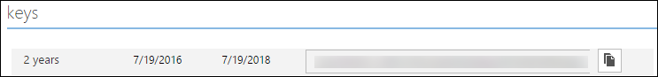

<properties
   pageTitle="Vous authentifier avec données Lake Store à l’aide d’Active Directory | Microsoft Azure"
   description="Découvrez comment vous authentifier avec données Lake Store à l’aide d’Active Directory"
   services="data-lake-store"
   documentationCenter=""
   authors="nitinme"
   manager="jhubbard"
   editor="cgronlun"/>

<tags
   ms.service="data-lake-store"
   ms.devlang="na"
   ms.topic="article"
   ms.tgt_pltfrm="na"
   ms.workload="big-data"
   ms.date="10/17/2016"
   ms.author="nitinme"/>

# Authentification de service au service avec données Lake Store à l’aide d’Azure Active Directory

> [AZURE.SELECTOR]
- [Authentification de service à service](data-lake-store-authenticate-using-active-directory.md)
- [Authentification de l’utilisateur final](data-lake-store-end-user-authenticate-using-active-directory.md)

Magasin de Lake données Azure utilise Azure Active Directory pour l’authentification. Avant la création d’une application qui fonctionne avec Azure Data Lake Store ou Azure données Lake Analytique, vous devez d’abord déterminer comment vous voulez authentifier votre application avec Azure Active Directory (AD Azure). Les deux options principales disponibles sont :

* Authentification de l’utilisateur final, et 
* Authentification de service à service. 

Ces deux options à l’origine dans votre application est fournie avec un jeton OAuth 2.0 qui obtient associé à chaque demande apportée au Azure Data Lake Store ou Azure données Lake Analytique.

Cette parle article comment créer une application web Azure AD pour l’authentification de service à service. Pour obtenir des instructions sur la configuration de l’application Azure AD pour l’authentification de l’utilisateur final voir [authentification de l’utilisateur final avec données Lake Store à l’aide de Azure Active Directory](data-lake-store-end-user-authenticate-using-active-directory.md).

## Conditions préalables

* Un abonnement Azure. Voir [Azure obtenir la version d’évaluation gratuite](https://azure.microsoft.com/pricing/free-trial/).
* Votre ID d’abonnement. Vous pouvez le récupérer à partir du portail Azure. Par exemple, il est disponible à partir de la carte de compte données Lake Store.

    

* Votre nom de domaine Active Directory Azure. Vous pourrez le retrouver en pointant la souris en haut à droite du portail Azure. À partir de la capture d’écran ci-dessous, le nom de domaine est **contoso.microsoft.com**, et le GUID entre crochets est l’ID de client. 

    

## Authentification de service à service

Il s’agit de l’approche recommandée si vous souhaitez que votre application pour vous authentifier automatiquement avec Azure AD, sans qu’il soit nécessaire pour l’utilisateur final à fournir leurs informations d’identification. Votre application pourra authentifier pour tant que ses informations d’identification sont valides, qui peut être personnalisé pour être dans l’ordre des années.

### Que dois-je utiliser cette approche ?

* Nom de domaine Active Directory Azure. Il est déjà répertorié dans les conditions préalables de cet article.

* Azure AD **application web**.

* ID de client pour l’application web Azure AD.

* Secret client pour l’application web Azure AD.

* Point de terminaison jeton de l’application web Azure AD.

* Activer l’accès de l’application web Azure AD sur le le fichier/dossier données Lake Store ou le compte Analytique Lake de données que vous souhaitez utiliser.

Pour obtenir des instructions sur la création d’une application web Azure AD et configurez-le pour les conditions ci-dessus, consultez la section [Création d’une application Active Directory](#create-an-active-directory-application) ci-dessous.

>[AZURE.NOTE] Par défaut, l’application Azure AD est configurée pour utiliser le code secret client, que vous pouvez récupérer à partir de l’application Azure AD. Toutefois, si vous souhaitez que l’application Azure AD pour utiliser un certificat à la place, vous devez créer l’application web Azure AD à l’aide de PowerShell Azure, tels que décrits sur [créer un service principal avec le certificat](../resource-group-authenticate-service-principal.md#create-service-principal-with-certificate).

## Créer une application Active Directory

Dans cette section nous Découvrez comment créer et configurer une application web Azure AD pour l’authentification de service à service avec Azure données Lake Store à l’aide d’Azure Active Directory. 

### Étape 1 : Créer une application Azure Active Directory

>[AZURE.NOTE] Les étapes suivantes utilisent le portail Azure. Vous pouvez également créer une application Azure AD à l’aide de [PowerShell Azure](../resource-group-authenticate-service-principal.md) ou [Azure infrastructure du langage commun](../resource-group-authenticate-service-principal-cli.md).

1. Connectez-vous à votre compte Azure via le [portail classique](https://manage.windowsazure.com/).

2. Sélectionnez **Active Directory** dans le volet gauche.

     
     
3. Sélectionnez l’annuaire Active Directory que vous souhaitez utiliser pour la création de la nouvelle application. Si vous avez plusieurs Active Directory, vous souhaitez généralement créer l’application dans le répertoire où réside votre abonnement. Vous pouvez uniquement accorder l’accès aux ressources dans votre abonnement pour les applications dans le même répertoire que votre abonnement.  

     
    
    
3. Pour afficher les applications dans votre annuaire, cliquez sur **Applications**.

     

4. Si vous n’avez pas créé une application dans ce répertoire avant que vous devriez voir quelque chose similaire à l’image suivante. Cliquez sur **Ajouter une APPLICATION**

     

     Ou, cliquez sur **Ajouter** dans le volet inférieur.

     

6. Indiquez un nom pour l’application, puis sélectionnez le type d’application que vous voulez créer. Pour ce didacticiel, créez un **WEB APPLICATION et/ou WEB API** et cliquez sur le bouton suivant.

     

7. Renseignez les propriétés pour votre application. Pour l' **URL de session**, fournissent URI à un site web qui décrit votre application. L’existence du site web n’est pas validée. Pour l' **Application ID URI**, fournissent l’URI qui identifie votre application.

     

    Activez la case à cocher pour terminer l’Assistant et créer l’application.

### Étape 2 : Prendre id client, secret client et point de terminaison de jeton

Lorsque vous vous connectez par programme, vous devez l’id de votre application. Si l’application est exécutée sous ses propres informations d’identification, vous devez également une clé d’authentification.

1. Cliquez sur l’onglet **configurer** pour configurer votre mot de passe de votre application.

     

2. Copiez l' **ID de CLIENT**.
  
     

3. Si l’application s’exécutera sous ses propres informations d’identification, faites défiler jusqu'à la section **clés** et sélectionnez la durée pendant laquelle vous voulez que votre mot de passe pour être valide.

     

4. Sélectionnez **Enregistrer** pour créer votre clé.

    

    La clé enregistrée s’affiche et vous pouvez la copier. Vous ne serez pas en mesure de récupérer la clé ultérieurement afin que doit copier maintenant.

    

5. Récupérer le point de terminaison jeton en sélectionnant des **points de terminaison de mode** dans la partie inférieure de l’écran et extraction de la valeur du champ de **Point de terminaison jeton OAuth 2.0** , comme illustré ci-dessous.  

    

### Étape 3 : Attribuer l’application Azure AD pour le fichier de compte Azure données Lake Store ou le dossier (uniquement pour l’authentification de service à service)

1. Ouvrez une session sur le nouveau [Portail Azure](https://portal.azure.com) et ouvrez le compte Azure données Lake magasin que vous souhaitez associer à l’application Azure Active Directory que vous avez créée.

1. Dans votre carte de compte données Lake Store, cliquez sur **Explorateur de données**.

    ![Créer les répertoires dans compte données Lake] (./media/data-lake-store-authenticate-using-active-directory/adl.start.data.explorer.png "Créer les répertoires dans un compte Lake de données")

2. Dans la carte de **L’Explorateur de données** , cliquez sur le fichier ou dossier pour lequel vous souhaitez fournir un accès à l’application Azure AD, puis cliquez sur **Access**. Pour configurer l’accès à un fichier, vous devez cliquer sur **accès** à partir de la carte **d’Aperçu du fichier** .

    ![Définir les utilisateurs sur le système de fichiers de données Lake] (./media/data-lake-store-authenticate-using-active-directory/adl.acl.1.png "Définir les utilisateurs sur le système de fichiers de données Lake")

3. La carte **accès** répertorie l’accès standard et personnalisé de déjà affectées à la racine. Cliquez sur l’icône **Ajouter** pour ajouter des utilisateurs de personnaliser le niveau.

    ![Accès à la liste standard et personnalisé] (./media/data-lake-store-authenticate-using-active-directory/adl.acl.2.png "Accès à la liste standard et personnalisé")

4. Cliquez sur l’icône **Ajouter** pour ouvrir la carte **D’ajout d’accès personnalisés** . Dans cette carte, cliquez sur **Sélectionner un utilisateur ou groupe**et puis dans la carte de **Sélectionner un utilisateur ou groupe** , recherchez le groupe de sécurité que vous avez créée précédemment dans Azure Active Directory. Si vous avez un grand nombre de groupes de recherche à partir de, utilisez la zone de texte dans la partie supérieure pour filtrer sur le nom du groupe. Cliquez sur le groupe que vous voulez ajouter, puis cliquez sur **Sélectionner**.

    ![Ajouter un groupe] (./media/data-lake-store-authenticate-using-active-directory/adl.acl.3.png "Ajouter un groupe")

5. Cliquez sur **Sélectionner les autorisations**, sélectionnez les autorisations et si vous voulez affecter les autorisations par défaut et, accéder et ou les deux. Cliquez sur **OK**.

    ![Attribuer des autorisations au groupe] (./media/data-lake-store-authenticate-using-active-directory/adl.acl.4.png "Attribuer des autorisations au groupe")

    Pour plus d’informations sur les autorisations dans les données Lake Store et utilisateurs/accès par défaut, voir [Contrôle d’accès données Lake Store](data-lake-store-access-control.md).

6. Dans la carte **D’ajout d’accès personnalisés** , cliquez sur **OK**. Le groupe nouvellement ajouté, avec les autorisations associées, sera désormais répertorié dans la carte **d’accès** .

    ![Attribuer des autorisations au groupe] (./media/data-lake-store-authenticate-using-active-directory/adl.acl.5.png "Attribuer des autorisations au groupe") 

## Étapes suivantes

Dans cet article, vous avez créé une application web Azure AD et avez recueilli les informations que nécessaires dans vos applications clientes que vous créez à l’aide du Kit de développement .NET, Java SDK, etc.. Vous pouvez maintenant poursuivre les articles suivants à propos de l’utilisation de l’application web Azure AD pour tout d’abord vous authentifier avec données Lake Store et d’autres opérations dans le magasin.

- [Prise en main Azure données Lake Store à l’aide du Kit de développement .NET](data-lake-store-get-started-net-sdk.md)
- [Prise en main Azure données Lake Store à l’aide du SDK Java](data-lake-store-get-started-java-sdk.md)
