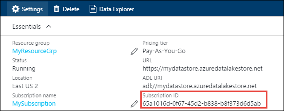
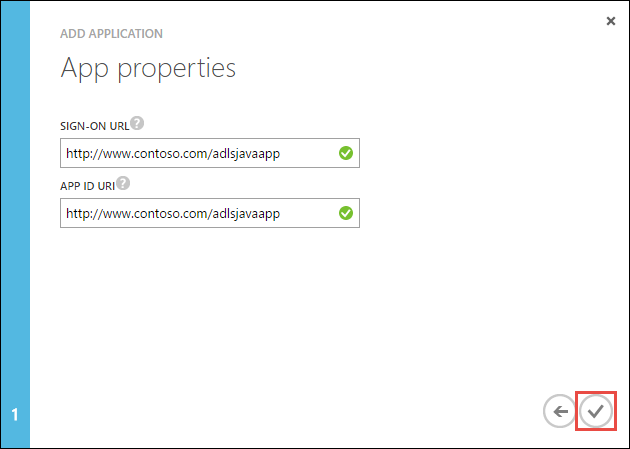
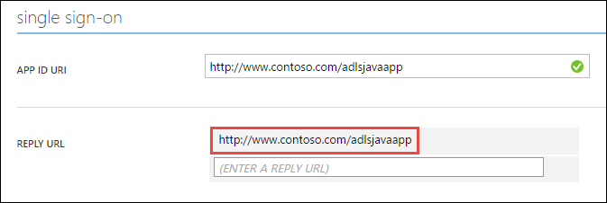
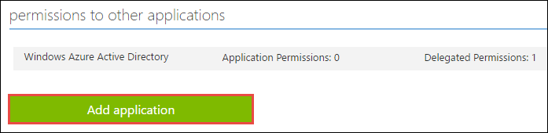

<properties
   pageTitle="Vous authentifier avec données Lake Store à l’aide d’Active Directory | Microsoft Azure"
   description="Découvrez comment vous authentifier avec données Lake Store à l’aide d’Active Directory"
   services="data-lake-store"
   documentationCenter=""
   authors="nitinme"
   manager="jhubbard"
   editor="cgronlun"/>

<tags
   ms.service="data-lake-store"
   ms.devlang="na"
   ms.topic="article"
   ms.tgt_pltfrm="na"
   ms.workload="big-data"
   ms.date="10/17/2016"
   ms.author="nitinme"/>

# Authentification de l’utilisateur final avec données Lake Store à l’aide d’Azure Active Directory

> [AZURE.SELECTOR]
- [Authentification de service à service](data-lake-store-authenticate-using-active-directory.md)
- [Authentification de l’utilisateur final](data-lake-store-end-user-authenticate-using-active-directory.md)

Magasin de Lake données Azure utilise Azure Active Directory pour l’authentification. Avant la création d’une application qui fonctionne avec Azure Data Lake Store ou Azure données Lake Analytique, vous devez d’abord déterminer comment vous voulez authentifier votre application avec Azure Active Directory (AD Azure). Les deux options principales disponibles sont :

* Authentification de l’utilisateur final, et 
* Authentification de service à service. 

Ces deux options à l’origine dans votre application est fournie avec un jeton OAuth 2.0 qui obtient associé à chaque demande apportée au Azure Data Lake Store ou Azure données Lake Analytique.

Cette parle article comment créer une application web Azure AD pour l’authentification de l’utilisateur final. Pour obtenir des instructions sur la configuration de l’application Azure AD pour l’authentification de service à service voir [authentification de Service à service avec données Lake Store à l’aide de Azure Active Directory](data-lake-store-authenticate-using-active-directory.md).

## Conditions préalables

* Un abonnement Azure. Voir [Azure obtenir la version d’évaluation gratuite](https://azure.microsoft.com/pricing/free-trial/).
* Votre ID d’abonnement. Vous pouvez le récupérer à partir du portail Azure. Par exemple, il est disponible à partir de la carte de compte données Lake Store.

    

* Votre nom de domaine Active Directory Azure. Vous pourrez le retrouver en pointant la souris en haut à droite du portail Azure. À partir de la capture d’écran ci-dessous, le nom de domaine est **contoso.microsoft.com**, et le GUID entre crochets est l’ID de client. 

    

## Authentification de l’utilisateur final

Il s’agit de l’approche recommandée si vous souhaitez que l’utilisateur final pour vous connecter à votre application via Azure AD. Votre application seront en mesure d’accéder aux ressources Azure avec le même niveau d’accès en tant que l’utilisateur final connecté. L’utilisateur final devrez fournir leurs informations d’identification régulièrement dans l’ordre de votre application de conserver l’accès.

Le résultat d’avoir à l’utilisateur final de se connecter est que votre application reçoit un jeton d’accès et un jeton d’actualisation. Le jeton d’accès obtient associé à chaque demande apportée aux données Lake Store ou données Lake Analytique, et il est valide pour une heure par défaut. Le jeton d’actualisation peut être utilisé pour obtenir un nouveau jeton d’accès, et il est valide pour jusqu'à deux semaines par défaut, si utilisés régulièrement. Vous pouvez utiliser deux approches différentes pour la connexion utilisateur final.

### À l’aide de la fenêtre contextuelle OAuth 2.0

Votre application peut déclencher une 2.0 OAuth d’autorisation de la fenêtre contextuelle, dans lequel l’utilisateur final peut entrer ses informations d’identification. Ce menu contextuel fonctionne également avec le processus d’authentification à deux facteurs Azure AD (2FA), si nécessaire. 

>[AZURE.NOTE] Cette méthode n'est pas encore prise en charge dans la bibliothèque terme (Azure AD authentification ADAL) Python ou Java.

### Passer directement dans les informations d’identification utilisateur

Votre application peut fournir directement les informations d’identification utilisateur à Azure Active Directory. Cette méthode fonctionne uniquement avec les comptes d’utilisateur ID d’organisation ; Il n’est pas compatible avec personnel / comptes d’utilisateurs « live ID », y compris ceux se terminant par @outlook.com ou @live.com. Par ailleurs, cette méthode n’est pas compatible avec les comptes d’utilisateurs nécessitant une authentification à deux facteurs Azure AD (2FA).

### Que dois-je utiliser cette approche ?

* Nom de domaine Active Directory Azure. Il est déjà répertorié dans les conditions préalables de cet article.

* Azure AD **application web**

* ID client pour l’application web Azure AD

* Réponse URI pour l’application web Azure AD

* Délégué de définir des autorisations

Pour obtenir des instructions sur la création d’une application web Azure AD et configurez-le pour les conditions ci-dessus, consultez la section [Création d’une application Active Directory](#create-an-active-directory-application) ci-dessous. 

## Créer une application Active Directory

Dans cette section nous Découvrez comment créer et configurer une application web Azure AD pour l’authentification de l’utilisateur final avec Azure données Lake Store à l’aide d’Azure Active Directory.

### Étape 1 : Créer une application Azure Active Directory

>[AZURE.NOTE] Les étapes suivantes utilisent le portail Azure. Vous pouvez également créer une application Azure AD à l’aide de [PowerShell Azure](../resource-group-authenticate-service-principal.md) ou [Azure infrastructure du langage commun](../resource-group-authenticate-service-principal-cli.md).

1. Connectez-vous à votre compte Azure via le [portail classique](https://manage.windowsazure.com/).

2. Sélectionnez **Active Directory** dans le volet gauche.

     
     
3. Sélectionnez l’annuaire Active Directory que vous souhaitez utiliser pour la création de la nouvelle application. Si vous avez plusieurs Active Directory, vous souhaitez généralement créer l’application dans le répertoire où réside votre abonnement. Vous pouvez uniquement accorder l’accès aux ressources dans votre abonnement pour les applications dans le même répertoire que votre abonnement.  

     
    
    
3. Pour afficher les applications dans votre annuaire, cliquez sur **Applications**.

     

4. Si vous n’avez pas créé une application dans ce répertoire avant que vous devriez voir quelque chose similaire à l’image suivante. Cliquez sur **Ajouter une APPLICATION**

     

     Ou, cliquez sur **Ajouter** dans le volet inférieur.

     

6. Indiquez un nom pour l’application, puis sélectionnez le type d’application que vous voulez créer. Pour ce didacticiel, créez un **WEB APPLICATION et/ou WEB API** et cliquez sur le bouton suivant.

     

7. Renseignez les propriétés pour votre application. Pour l' **URL de session**, fournissent URI à un site web qui décrit votre application. L’existence du site web n’est pas validée. Pour l' **Application ID URI**, fournissent l’URI qui identifie votre application.

     

    Activez la case à cocher pour terminer l’Assistant et créer l’application.

### Étape 2 : Obtenir l’id de client, répondre URI et définir des autorisations déléguées

1. Cliquez sur l’onglet **configurer** pour configurer votre mot de passe de votre application.

     

2. Copiez l' **ID de CLIENT**.
  
     

3. Sous la section **authentification unique** , copiez **Réponse URI**.

    

4. Sous **autorisations à d’autres applications**, cliquez sur **Ajouter l’application**

    

5. Dans l’Assistant **autorisations à d’autres applications** , sélectionnez **Lake de données Azure** et **Windows** **Azure API de gestion des services**, puis cliquez sur la coche.

6. Par défaut, les **Délégués des autorisations** pour les services nouvellement ajoutés est défini sur zéro. Cliquez sur **Délégué les autorisations** déroulante pour Azure données Lake et Service de gestion de Windows Azure, activez les cases à cocher disponibles pour définir les valeurs à 1. Le résultat doit ressembler à ceci.

     

7. Cliquez sur **Enregistrer**.

## Étapes suivantes

Dans cet article, vous avez créé une application web Azure AD et avez recueilli les informations que nécessaires dans vos applications clientes que vous créez à l’aide du Kit de développement .NET, Java SDK, etc.. Vous pouvez maintenant poursuivre les articles suivants à propos de l’utilisation de l’application web Azure AD pour tout d’abord vous authentifier avec données Lake Store et d’autres opérations dans le magasin.

- [Prise en main Azure données Lake Store à l’aide du Kit de développement .NET](data-lake-store-get-started-net-sdk.md)
- [Prise en main Azure données Lake Store à l’aide du SDK Java](data-lake-store-get-started-java-sdk.md)
