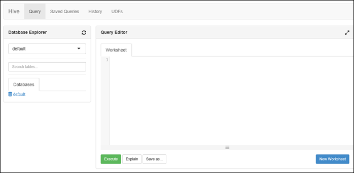

<properties
   pageTitle="Créer des clusters HDInsight avec Azure données Lake Store à l’aide du portail | Azure"
   description="Portail Azure permet de créer et utiliser des clusters HDInsight avec Azure données Lake Store"
   services="data-lake-store,hdinsight" 
   documentationCenter=""
   authors="nitinme"
   manager="jhubbard"
   editor="cgronlun"/>

<tags
   ms.service="data-lake-store"
   ms.devlang="na"
   ms.topic="article"
   ms.tgt_pltfrm="na"
   ms.workload="big-data"
   ms.date="10/21/2016"
   ms.author="nitinme"/>

# Créer un cluster HDInsight avec données Lake Store à l’aide du portail Azure

> [AZURE.SELECTOR]
- [À l’aide du portail](data-lake-store-hdinsight-hadoop-use-portal.md)
- [À l’aide de PowerShell](data-lake-store-hdinsight-hadoop-use-powershell.md)
- [À l’aide du Gestionnaire de ressources](data-lake-store-hdinsight-hadoop-use-resource-manager-template.md)

Découvrez comment utiliser Azure portail pour créer un cluster HDInsight (Hadoop, HBase, explosion ou vague de) avec accès au magasin Lake des données Azure. Certaines considérations importantes pour cette version :

* **Explosion pour clusters (Linux) et clusters Hadoop (Windows et Linux)**, le magasin de Lake données uniquement utilisable comme un compte de stockage supplémentaire. Le compte de stockage par défaut pour les groupes ces seront toujours Azure stockage BLOB (WASB).

* **Vague de pour clusters (Windows et Linux)**, le magasin de Lake données peut servir à écrire des données à partir d’une topologie vague. Magasin de Lake de données peut également être utilisé pour stocker les données de référence qui peuvent ensuite être lu par une topologie vague. Pour plus d’informations, voir [Utiliser le magasin de données Lake dans une topologie vague](#use-data-lake-store-in-a-storm-topology).

* **Pour HBase clusters (Windows et Linux)**, le magasin de Lake données peut être utilisé comme un espace de stockage par défaut, ainsi qu’espace de stockage supplémentaire. Pour plus d’informations, voir [Utiliser le magasin de données Lake avec clusters HBase](#use-data-lake-store-with-hbase-clusters).

> [AZURE.NOTE] Quelques points importants à noter. 
> 
> * Option permettant de créer des clusters HDInsight avec accès aux données Lake Store est disponible uniquement pour les versions HDInsight 3.2 et 3.4 (pour les clusters Hadoop, HBase et vague de sous Windows, ainsi que Linux). Pour clusters explosion sous Linux, cette option n’est disponible sur les clusters HDInsight 3.4.
>
> * Comme indiqué ci-dessus, Data Lake Store est disponible sous forme de stockage par défaut pour certains types de cluster (HBase) et d’espace de stockage supplémentaire pour les autres types de cluster (Hadoop, explosion, vague de). À l’aide de données Lake Store en tant que compte de l’espace de stockage supplémentaire n’influe pas sur les performances ou la fonctionnalité permettant d’en lecture/écriture à l’espace de stockage du cluster. Dans un scénario où les données Lake Store est utilisé comme espace de stockage supplémentaire, les fichiers liés au cluster (par exemple, les journaux, etc.) sont écrits sur le stockage par défaut (BLOB Azure), tandis que les données que vous souhaitez traiter peuvent être stockées dans un compte de données Lake Store.

## Conditions préalables

Avant de commencer ce didacticiel, vous devez disposer des éléments suivants :

- **Azure un abonnement**. Voir [Azure obtenir la version d’évaluation gratuite](https://azure.microsoft.com/pricing/free-trial/).

- **Compte azure données Lake Store**. Suivez les instructions sur la [prise en main Azure données Lake Store à l’aide du portail Azure](data-lake-store-get-started-portal.md). 

- **Télécharger des exemples de données à votre compte Azure données Lake Store**. Une fois que vous avez créé le compte, procédez comme suit pour télécharger des exemples de données. Vous devez ces données plus loin dans le didacticiel à l’exécution des tâches à partir d’un cluster HDInsight qui accèdent aux données du magasin de données Lake.

    * [Créer un dossier dans votre magasin Lake de données](data-lake-store-get-started-portal.md#createfolder).
    * [Télécharger un fichier vers votre magasin Lake de données](data-lake-store-get-started-portal.md#uploaddata). Si vous cherchez des exemples de données à télécharger, vous pouvez obtenir le dossier **Ambulance données** à partir du [Référentiel de Git Azure données Lake](https://github.com/Azure/usql/tree/master/Examples/Samples/Data/AmbulanceData).

- **Azure Active Directory Service Principal**. Étapes de ce didacticiel fournissent des instructions sur la façon de créer une entité de service dans Azure AD. Toutefois, vous devez être un administrateur Azure AD doit être en mesure de créer une entité de service. Si vous êtes un administrateur Azure AD, vous pouvez ignorer ces conditions préalables et poursuivre le didacticiel.
    
    **Si vous n’êtes pas administrateur Azure AD**, vous ne serez pas en mesure d’effectuer les étapes nécessaires pour créer une entité de service. Dans ce cas, votre administrateur Azure AD devez d’abord créer une entité de service avant de pouvoir créer un cluster HDInsight avec données Lake Store. En outre, l’entité de service doit être créée à l’aide d’un certificat, tels que décrits sur la [Création d’un service principal avec le certificat](../resource-group-authenticate-service-principal.md#create-service-principal-with-certificate).

## Procédez comme vous plus rapidement avec vidéos ?

Regardez les vidéos suivantes pour mieux comprendre la mise en service de clusters HDInsight avec l’accès aux données Lake Store.

* [Créer un cluster HDInsight avec accès aux données Lake Store](https://mix.office.com/watch/l93xri2yhtp2)
* Une fois que le cluster a été configurée, [accéder aux données de magasin de Lake de données à l’aide des scripts Hive et cochon](https://mix.office.com/watch/1n9g5w0fiqv1q)

## Créer un cluster HDInsight avec accès au magasin Lake des données Azure

Dans cette section, vous créez un cluster HDInsight Hadoop qui utilise le magasin de Lake données comme un espace de stockage supplémentaire. Dans cette version, pour un cluster Hadoop, données Lake magasin peut uniquement être utilisé comme un espace de stockage supplémentaire pour le cluster. Le stockage par défaut sera toujours les objets BLOB Azure stockage (WASB). Par conséquent, nous allons tout d’abord créer le compte de stockage et les conteneurs de stockage requis pour le cluster.

1. Ouverture de session au nouveau [Portail Azure](https://portal.azure.com).

2. Suivez les étapes présentées [Hadoop créer des groupes dans un HDInsight](../hdinsight/hdinsight-provision-clusters.md#create-using-the-preview-portal) pour démarrer un cluster HDInsight de mise en service.

3. Dans la carte de **Configuration facultatives** , cliquez sur **Source de données**. Dans la carte de la **Source de données** , spécifiez les détails pour le compte de stockage et le conteneur de stockage, spécifier un **emplacement** comme **Extrême-Orient US 2**, puis cliquez sur **Cluster AAD identité**.

    ![Ajouter service principal à cluster HDInsight] (./media/data-lake-store-hdinsight-hadoop-use-portal/hdi.adl.1.png "Ajouter service principal à cluster HDInsight")

4. Sur la carte **Cluster AAD identité** , vous pouvez choisir sélectionner un Principal du Service existant ou créez-en un.

    * **Créer une nouvelle entité de Service**

        * Dans la carte **Cluster AAD identité** , cliquez sur **Créer nouveau**et cliquez sur **Principal du Service**, puis dans la carte de **créer une entité de Service** , indiquez les valeurs pour créer une nouvelle entité de service. Dans le cadre de cette, un certificat et une application Azure Active Directory est également créé. Cliquez sur **créer**.

            ![Ajouter service principal à cluster HDInsight] (./media/data-lake-store-hdinsight-hadoop-use-portal/hdi.adl.2.png "Ajouter service principal à cluster HDInsight")

        * Dans la carte **Cluster AAD identité** , cliquez sur **Gérer l’accès à ADLS**. Le volet affiche les comptes de données Lake Store associés à l’abonnement. Toutefois, vous pouvez définir les autorisations que pour le compte que vous avez créé. Sélectionnez le compte que vous souhaitez associer le cluster HDInsight, puis cliquez sur **Enregistrer les autorisations**en lecture/écriture/EXECUTE autorisations.

            ![Ajouter service principal à cluster HDInsight] (./media/data-lake-store-hdinsight-hadoop-use-portal/hdi.adl.3.png "Ajouter service principal à cluster HDInsight")

        * Dans la carte **Cluster AAD identité** , cliquez sur **Télécharger le certificat** pour télécharger le certificat associé au service principal que vous avez créé. Ceci est utile si vous souhaitez utiliser la même entité de service à l’avenir, lors de la création de clusters HDInsight supplémentaires. Cliquez sur **Sélectionner**.

            ![Ajouter service principal à cluster HDInsight] (./media/data-lake-store-hdinsight-hadoop-use-portal/hdi.adl.4.png "Ajouter service principal à cluster HDInsight")

    * **Sélectionnez un Principal de Service existante**

        * Dans la carte **Cluster AAD identité** , cliquez sur **utiliser existant**et cliquez sur **Principal du Service**, puis dans la carte **Sélectionnez un Principal de Service** , recherchez un principal de service existante. Cliquez sur un nom principal de service, puis sur **Sélectionner**.

            ![Ajouter service principal à cluster HDInsight] (./media/data-lake-store-hdinsight-hadoop-use-portal/hdi.adl.5.png "Ajouter service principal à cluster HDInsight")

        * Sur la carte **Cluster AAD identité** , téléchargez le certificat (.pfx) associé à l’entité de service que vous avez sélectionné et puis entrez le mot de passe de certificat.

5. Cliquez sur **Gérer l’accès à ADLS** , puis **Sélectionnez autorisations de fichier**. 

    ![Ajouter service principal à cluster HDInsight] (./media/data-lake-store-hdinsight-hadoop-use-portal/hdi.adl.5.existing.save.png "Ajouter service principal à cluster HDInsight")

6. Dans la carte **Sélectionnez autorisations de fichier** , dans la liste déroulante **compte** , sélectionnez le compte magasin Lake de données que vous souhaitez associé au cluster HDInsight. La carte répertorie les fichiers et dossiers disponibles dans le compte données Lake sélectionné. 
 
    ![Garantissez un accès aux données Lake Store] (./media/data-lake-store-hdinsight-hadoop-use-portal/hdi-adl-permission-1.png "Garantissez un accès aux données Lake Store")

    Après cela, déterminer les autorisations à fournir pour la les fichiers et dossiers sélectionnés. Pour les dossiers, également spécifier si les autorisations s’appliquent au dossier uniquement ou pour le dossier et tous les éléments enfants dans le dossier. Vous pouvez apporter cette sélection en sélectionnant la valeur appropriée à partir de l' **Appliquer à** liste déroulante. Pour supprimer une autorisation, cliquez sur l’icône **Supprimer**

    ![Garantissez un accès aux données Lake Store] (./media/data-lake-store-hdinsight-hadoop-use-portal/hdi-adl-permission-2.png "Garantissez un accès aux données Lake Store")

    Répétez ces étapes pour les fichiers associés et les dossiers d’autres comptes de données Lake Store également. Lorsque vous avez terminé l’attribution des autorisations, cliquez sur **Sélectionner** dans la partie inférieure de la carte.

7. Dans la carte **affecter les autorisations sélectionnées** , passez en revue les autorisations que vous avez fournie, puis sur **exécuter** pour accorder des autorisations.

    ![Garantissez un accès aux données Lake Store] (./media/data-lake-store-hdinsight-hadoop-use-portal/hdi-adl-permission-3.png "Garantissez un accès aux données Lake Store")

    La colonne Statut affiche la progression. Une fois que toutes les autorisations sont affectées avec succès, cliquez sur **terminé**. 

6. Cliquez sur **Sélectionner** dans les cartes **Cluster AAD identité** et de la **Source de données** et à poursuivre puis créations cluster tels que décrits sur [Hadoop créer des groupes dans un HDInsight](../hdinsight/hdinsight-hadoop-create-linux-clusters-portal.md).

7. Une fois que le cluster est configuré, vous pouvez vérifier que l’entité de Service est associée au cluster HDInsight. Pour cela, à partir de la carte cluster, cliquez sur **Cluster AAD identité** pour afficher l’identité de Service correspondante.

    ![Ajouter service principal à cluster HDInsight] (./media/data-lake-store-hdinsight-hadoop-use-portal/hdi.adl.6.png "Ajouter service principal à cluster HDInsight")

## Exécution de tâches de test sur le cluster HDInsight à utiliser le magasin de Lake données Azure

Une fois que vous avez configuré un cluster de HDInsight, vous pouvez exécuter des tâches d’essai sur le cluster pour vérifier que le cluster HDInsight peut accéder aux données Azure données Lake Store. Pour ce faire, nous allons exécuter des requêtes hive cette cible du magasin Lake de données.

### Pour un cluster Linux

1. Ouvrir la carte de cluster pour le cluster que vous avez configuré uniquement, puis sur **tableau de bord**. Cette action ouvre Ambari pour le cluster Linux. Lorsque vous accédez à Ambari, vous devrez s’authentifier sur le site. Entrez l’administrateur (administrateur par défaut), nom de compte et mot de passe utilisé lors de la création du cluster.

    ![Lancer tableau de bord cluster] (./media/data-lake-store-hdinsight-hadoop-use-portal/hdiadlcluster1.png "Lancer tableau de bord cluster")

    Vous pouvez également accéder directement à Ambari en accédant à https://CLUSTERNAME.azurehdinsight.net dans un navigateur web (où **CLUSTERNAME** est le nom de votre cluster HDInsight).

2. Ouvrez la vue Hive. Sélectionnez l’ensemble des carrés à partir du menu de la page (à côté du bouton à droite de la page et un lien **d’administration** ) des affichages liste disponible. Sélectionnez l’affichage **ruche** .

    

3. Vous devriez voir une page semblable à ce qui suit :

    

4. Dans la section de **L’éditeur de requête** de la page, collez l’instruction HiveQL suivante dans la feuille de calcul :

        CREATE EXTERNAL TABLE vehicles (str string) LOCATION 'adl://mydatalakestore.azuredatalakestore.net:443/mynewfolder'

5. Cliquez sur le bouton **exécuter** en bas de l' **Éditeur de requête** pour démarrer la requête. Une section de **Résultats de processus de la requête** doit s’affichent en dessous de l' **Éditeur de requête** et afficher des informations sur la tâche.

6. Une fois la requête terminée, la section **Requête processus résultats** affiche les résultats de l’opération. L’onglet **résultats** doit contenir les informations suivantes :

7. Exécutez la requête suivante pour vérifier que la table a été créée.

        SHOW TABLES;

    L’onglet **résultats** doit afficher ce qui suit :

        hivesampletable
        vehicles

    **véhicules** est la table que vous avez créée. **hivesampletable** est un exemple de tableau disponible dans tous les clusters HDInsight par défaut.

8. Vous pouvez également exécuter une requête pour extraire des données de la table **véhicules** .

        SELECT * FROM vehicles LIMIT 5;

### Pour un cluster de Windows

1. Ouvrir la carte de cluster pour le cluster que vous avez configuré uniquement, puis sur **tableau de bord**.

    ![Lancer tableau de bord cluster] (./media/data-lake-store-hdinsight-hadoop-use-portal/hdiadlcluster1.png "Lancer tableau de bord cluster")

    Lorsque vous y êtes invité, entrez les informations d’identification d’administrateur pour le cluster.

2. Cette action ouvre la Console de requête Microsoft Azure HDInsight. Cliquez sur **ruche éditeur**.

    ![Éditeur de ruche ouvert] (./media/data-lake-store-hdinsight-hadoop-use-portal/hdiadlcluster2.png "Éditeur de ruche ouvert")

3. Dans l’éditeur ruche, entrez la requête suivante, puis cliquez sur **Envoyer**.

        CREATE EXTERNAL TABLE vehicles (str string) LOCATION 'adl://mydatalakestore.azuredatalakestore.net:443/mynewfolder'

    Dans cette requête Hive, nous créer une table à partir des données stockées dans le magasin de Lake de données à `adl://mydatalakestore.azuredatalakestore.net:443/mynewfolder`. Cet emplacement comporte un exemple de fichier de données que vous devez avez téléchargées précédemment.

    La table des **Sessions de travail** dans la partie inférieure affiche l’état de la tâche de la modification d' **initialisation**, en **en cours d’exécution**, **terminé**. Vous pouvez également cliquer sur **Afficher les détails** pour afficher plus d’informations sur la tâche achevée.

    ![Créer une table] (./media/data-lake-store-hdinsight-hadoop-use-portal/hdiadlcluster3.png "Créer une table")

4. Exécutez la requête suivante pour vérifier que la table a été créée.

        SHOW TABLES;

    Cliquez sur **Afficher les détails** correspondant à la requête et la sortie doit afficher les éléments suivants :

        hivesampletable
        vehicles

    **véhicules** est la table que vous avez créée. **hivesampletable** est un exemple de tableau disponible dans tous les clusters HDInsight par défaut.

5. Vous pouvez également exécuter une requête pour extraire des données de la table **véhicules** .

        SELECT * FROM vehicles LIMIT 5;

## Accès aux données Lake Store à l’aide des commandes HADOOP

Une fois que vous avez configuré le cluster HDInsight pour utiliser des données Lake Store, vous pouvez utiliser les commandes de shell HADOOP pour accéder au magasin.

### Pour un cluster Linux

Dans cette section vous sera SSH dans le cluster et exécuter les commandes HADOOP. Windows ne fournit pas un clientSSH intégré. Nous vous recommandons d’utiliser **PuTTY**, qui peut être téléchargé à partir de [http://www.chiark.greenend.org.uk/~sgtatham/putty/download.html](http://www.chiark.greenend.org.uk/~sgtatham/putty/download.html).

Pour plus d’informations sur l’utilisation de PuTTY, voir [Utiliser SSH avec basé sur Linux Hadoop sur HDInsight à partir de Windows](../hdinsight/hdinsight-hadoop-linux-use-ssh-windows.md).

Une fois connecté, utilisez la commande de système de fichiers HADOOP suivante pour répertorier les fichiers du magasin de données Lake.

    hdfs dfs -ls adl://<Data Lake Store account name>.azuredatalakestore.net:443/

Cette opération doit répertorier le fichier que vous avez téléchargée précédemment au magasin Lake de données.

    15/09/17 21:41:15 INFO web.CaboWebHdfsFileSystem: Replacing original urlConnectionFactory with org.apache.hadoop.hdfs.web.URLConnectionFactory@21a728d6
    Found 1 items
    -rwxrwxrwx   0 NotSupportYet NotSupportYet     671388 2015-09-16 22:16 adl://mydatalakestore.azuredatalakestore.net:443/mynewfolder

Vous pouvez également utiliser la `hdfs dfs -put` commande pour télécharger des fichiers au magasin Lake de données, puis utilisez `hdfs dfs -ls` pour vérifier si les fichiers téléchargés avec succès.

### Pour un cluster de Windows

1. Ouverture de session au nouveau [Portail Azure](https://portal.azure.com).

2. Cliquez sur **Parcourir**et cliquez sur **clusters HDInsight**, puis cliquez sur le cluster HDInsight que vous avez créé.

3. Dans la carte cluster, cliquez sur **Bureau à distance**et puis, dans la carte de **Bureau à distance** , cliquez sur **se connecter**.

    ![À distance en cluster HDI] (./media/data-lake-store-hdinsight-hadoop-use-portal/ADL.HDI.PS.Remote.Desktop.png "Créer un groupe de ressources Azure")

    Lorsque vous y êtes invité, entrez les informations d’identification que vous avez fourni pour l’utilisateur de bureau à distance.

4. Dans la session distante, démarrez Windows PowerShell et utilisez les commandes de système de fichiers HADOOP pour répertorier les fichiers dans le magasin de Lake données Azure.

        hdfs dfs -ls adl://<Data Lake Store account name>.azuredatalakestore.net:443/

    Cette opération doit répertorier le fichier que vous avez téléchargée précédemment au magasin Lake de données.

        15/09/17 21:41:15 INFO web.CaboWebHdfsFileSystem: Replacing original urlConnectionFactory with org.apache.hadoop.hdfs.web.URLConnectionFactory@21a728d6
        Found 1 items
        -rwxrwxrwx   0 NotSupportYet NotSupportYet     671388 2015-09-16 22:16 adl://mydatalakestore.azuredatalakestore.net:443/mynewfolder

    Vous pouvez également utiliser la `hdfs dfs -put` commande pour télécharger des fichiers au magasin Lake de données, puis utilisez `hdfs dfs -ls` pour vérifier si les fichiers téléchargés avec succès.

## Utiliser le magasin de données Lake avec cluster d’explosion

Dans cette section, vous utilisez Jupyter bloc-notes disponible avec clusters HDInsight Spark d’exécuter une tâche qui lit les données d’un compte magasin Lake de données que vous avez associé un cluster HDInsight Spark, plutôt que le compte Azure stockage Blob par défaut.

1. Copier sur des exemples de données à partir du compte de stockage par défaut (WASB) associé au cluster explosion au compte Azure données Lake store associé au cluster. Vous pouvez utiliser l' [outil ADLCopy](http://aka.ms/downloadadlcopy) pour le faire. Téléchargez et installez l’outil à partir du lien.

2. Ouvrez une invite de commandes et accédez au répertoire où AdlCopy est installé, généralement `%HOMEPATH%\Documents\adlcopy`.

3. Exécutez la commande suivante pour copier un blob spécifique du conteneur source dans un magasin Lake données :

        AdlCopy /source https://<source_account>.blob.core.windows.net/<source_container>/<blob name> /dest swebhdfs://<dest_adls_account>.azuredatalakestore.net/<dest_folder>/ /sourcekey <storage_account_key_for_storage_container>

    Pour ce didacticiel, copiez le fichier de données d’exemple **HVAC.csv** à **/HdiSamples/HdiSamples/SensorSampleData/hvac/** au compte Azure données Lake Store. L’extrait de code doit ressembler à :

        AdlCopy /Source https://mydatastore.blob.core.windows.net/mysparkcluster/HdiSamples/HdiSamples/SensorSampleData/hvac/HVAC.csv /dest swebhdfs://mydatalakestore.azuredatalakestore.net/hvac/ /sourcekey uJUfvD6cEvhfLoBae2yyQf8t9/BpbWZ4XoYj4kAS5Jf40pZaMNf0q6a8yqTxktwVgRED4vPHeh/50iS9atS5LQ==

    >[AZURE.WARNING] Vérifiez que vous que les noms de fichier et le chemin d’accès sont en utilisant une majuscule initiale.

4. Vous devrez entrer les informations d’identification pour l’abonnement Azure sous lequel vous avez votre compte données Lake Store. Vous verrez un résultat semblable à ce qui suit :

        Initializing Copy.
        Copy Started.
        100% data copied.
        Copy Completed. 1 file copied.

    Le fichier de données (**HVAC.csv**) est copié sous un dossier **/hvac** dans le compte données Lake.

4. À partir du [Portail Azure](https://portal.azure.com/), à partir de la startboard, cliquez sur la vignette pour votre cluster explosion (si vous l’épinglées à la startboard). Vous pouvez également accéder à votre cluster sous **Rechercher tout** > **Clusters HDInsight**.   

2. À partir de la carte de cluster explosion, cliquez sur **Liens rapides**, puis à partir de la carte **Du tableau de bord Cluster** , **Jupyter bloc-notes**. Si vous y êtes invité, entrez les informations d’identification d’administration pour le cluster.

    > [AZURE.NOTE] Vous pouvez également atteigne le bloc-notes Jupyter pour votre cluster en ouvrant l’URL suivante dans votre navigateur. Remplacez __NOMDUCLUSTER__ par le nom de votre cluster :
    >
    > `https://CLUSTERNAME.azurehdinsight.net/jupyter`

2. Créer un bloc-notes. Cliquez sur **Nouveau**, puis cliquez sur **PySpark**.

    ![Créer un bloc-notes Jupyter] (./media/data-lake-store-hdinsight-hadoop-use-portal/hdispark.note.jupyter.createnotebook.png "Créer un bloc-notes Jupyter")

3. Un bloc-notes est créé et ouvert avec le nom **Untitled.pynb**. 

4. Étant donné que vous avez créé un bloc-notes à l’aide du noyau PySpark, vous n’avez pas besoin créer les contextes explicitement. Les contextes explosion et Hive est automatiquement créées pour vous lors de l’exécution de la première cellule de code. Vous pouvez commencer en important les types requis pour ce scénario. Pour ce faire, collez l’extrait de code suivantes dans une cellule et appuyez sur **MAJ + ENTRÉE**.

        from pyspark.sql.types import *
        
    Chaque fois que vous exécutez une tâche dans Jupyter, votre titre de fenêtre de navigateur web affiche un état **(occupé)** ainsi que le titre. Vous verrez également un cercle plein en regard du texte **PySpark** dans le coin supérieur droit. Une fois que la tâche est terminée, il se transforme en un cercle vide.

     ![Statut d’une tâche de bloc-notes Jupyter] (./media/data-lake-store-hdinsight-hadoop-use-portal/hdispark.jupyter.job.status.png "Statut d’une tâche de bloc-notes Jupyter")

4. Charger les exemples de données dans une table temporaire en utilisant le fichier **HVAC.csv** que vous avez copié sur le compte de données Lake Store. Vous pouvez accéder aux données dans le compte de données Lake Store à l’aide du modèle d’URL suivant.

        adl://<data_lake_store_name>.azuredatalakestore.net/<path_to_file>

    Dans une cellule vide, collez le code suivant, remplacez **MYDATALAKESTORE** par votre nom de compte données Lake Store et appuyez sur **MAJ + ENTRÉE**. Cet exemple de code enregistre les données dans une table temporaire appelée **hvac**.

        # Load the data
        hvacText = sc.textFile("adl://MYDATALAKESTORE.azuredatalakestore.net/hvac/HVAC.csv")
        
        # Create the schema
        hvacSchema = StructType([StructField("date", StringType(), False),StructField("time", StringType(), False),StructField("targettemp", IntegerType(), False),StructField("actualtemp", IntegerType(), False),StructField("buildingID", StringType(), False)])
        
        # Parse the data in hvacText
        hvac = hvacText.map(lambda s: s.split(",")).filter(lambda s: s[0] != "Date").map(lambda s:(str(s[0]), str(s[1]), int(s[2]), int(s[3]), str(s[6]) ))
        
        # Create a data frame
        hvacdf = sqlContext.createDataFrame(hvac,hvacSchema)
        
        # Register the data fram as a table to run queries against
        hvacdf.registerTempTable("hvac")

5. Étant donné que vous utilisez un noyau PySpark, vous pouvez maintenant directement exécuter une requête SQL dans la table temporaire **hvac** que vous venez de créer à l’aide de la `%%sql` magie. Pour plus d’informations sur la `%%sql` magie, ainsi que d’autres magics disponibles avec le noyau PySpark, voir [noyaux disponibles sur les ordinateurs portables Jupyter avec clusters explosion HDInsight](hdinsight-apache-spark-jupyter-notebook-kernels.md#why-should-i-use-the-new-kernels).
        
        %%sql
        SELECT buildingID, (targettemp - actualtemp) AS temp_diff, date FROM hvac WHERE date = \"6/1/13\"

5. Une fois que la tâche est terminée avec succès, le résultat sous forme de tableau suivant est affiché par défaut.

    ![Tableau résultant du résultat de la requête] (./media/data-lake-store-hdinsight-hadoop-use-portal/tabular.output.png "Tableau résultant du résultat de la requête")

    Vous pouvez également afficher les résultats dans ainsi que d’autres visualisations. Par exemple, un graphique en aires pour le même résultat ressemblera à ce qui suit.

    ![Graphique en aires du résultat de la requête] (./media/data-lake-store-hdinsight-hadoop-use-portal/area.output.png "Graphique en aires du résultat de la requête")

6. Une fois que vous avez terminé d’exécuter l’application, vous devez arrêter le bloc-notes pour libérer les ressources. Pour ce faire, dans le menu **fichier** sur le bloc-notes, cliquez sur **Fermer et arrêter**. Cette s’arrêter et fermer le bloc-notes.

## Utiliser le magasin de données Lake dans une topologie vague

Vous pouvez utiliser le magasin de Lake de données pour écrire des données à partir d’une topologie vague. Pour obtenir des instructions sur la façon d’atteindre ce scénario, voir [Utiliser le magasin de Lake de données Azure avec vague d’Apache avec HDInsight](../hdinsight/hdinsight-storm-write-data-lake-store.md).

## Utiliser le magasin de données Lake avec clusters HBase

HBase clusters, vous pouvez utiliser des données Lake Store un espace de stockage par défaut ainsi que d’espace de stockage supplémentaire. Pour le faire :

1.  Dans la carte de la **Source de données** , pour l' **Emplacement des données HBase**, sélectionnez **Données Lake Store** .
2.  Sélectionnez le nom de la banque Lake de données que vous souhaitez utiliser, ou créez-en une.
3.  Enfin, spécifiez le **Dossier racine HBase** du magasin de données Lake. Si le compte données Lake ne comporte pas un dossier racine, créez un nouvel identifiant.

    ![HBase avec données Lake Store] (./media/data-lake-store-hdinsight-hadoop-use-portal/hbase-data-lake-store.png "Créer un groupe de ressources Azure")

### Considérations relatives à l’aide de données Lake Store comme espace de stockage par défaut pour les clusters HBase

* Vous pouvez utiliser le même compte données Lake Store pour plusieurs HBase cluster. Toutefois, le **Dossier racine HBase** que vous fournissez pour le cluster (étape n ° 4 dans la capture d’écran ci-dessus) doit être unique. Vous **ne doit pas** utiliser le même dossier racine entre deux clusters HBase différents.
* Même si vous utilisez un compte de données Lake Store comme espace de stockage par défaut, les fichiers journaux de cluster HBase sont toujours stockés dans les objets BLOB (WASB Azure stockage) associé au cluster. Cela est mis en surbrillance dans la zone de bleu dans la capture d’écran ci-dessus.

## Voir aussi

* [PowerShell : Créez un cluster HDInsight pour utiliser des données Lake Store](data-lake-store-hdinsight-hadoop-use-powershell.md)

[makecert]: https://msdn.microsoft.com/library/windows/desktop/ff548309(v=vs.85).aspx
[pvk2pfx]: https://msdn.microsoft.com/library/windows/desktop/ff550672(v=vs.85).aspx
