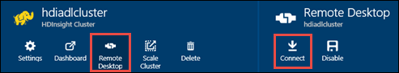

<properties
   pageTitle="Créer des clusters HDInsight avec Azure données Lake Store à l’aide du Gestionnaire de ressources modèles | Microsoft Azure"
   description="Utiliser des modèles Azure le Gestionnaire de ressources pour créer et utiliser des clusters HDInsight avec Azure données Lake Store"
   services="data-lake-store,hdinsight"
   documentationCenter=""
   authors="nitinme"
   manager="jhubbard"
   editor="cgronlun"/>

<tags
   ms.service="data-lake-store"
   ms.devlang="na"
   ms.topic="article"
   ms.tgt_pltfrm="na"
   ms.workload="big-data"
   ms.date="10/21/2016"
   ms.author="nitinme"/>

# <a name="create-an-hdinsight-cluster-with-data-lake-store-using-azure-resource-manager-template"></a>Créer un cluster HDInsight avec données Lake Store à l’aide du Gestionnaire de ressources Azure modèle

> [AZURE.SELECTOR] - [À l’aide du portail](data-lake-store-hdinsight-hadoop-use-portal.md) - [à l’aide de PowerShell](data-lake-store-hdinsight-hadoop-use-powershell.md) - [à l’aide du Gestionnaire de ressources](data-lake-store-hdinsight-hadoop-use-resource-manager-template.md)

Découvrez comment utiliser un modèle Azure le Gestionnaire de ressources pour configurer un cluster HDInsight avec accès au magasin Lake des données Azure. Certaines considérations importantes pour cette version :

-   **Explosion pour clusters (Linux) et clusters/vague d’Hadoop (Windows et Linux)**, le magasin de Lake données uniquement utilisable comme un compte de stockage supplémentaire. Le compte de stockage par défaut pour les groupes ces seront toujours Azure stockage BLOB (WASB).

-   **Pour HBase clusters (Windows et Linux)**, le magasin de Lake données peut être utilisé comme un espace de stockage par défaut ou un espace de stockage supplémentaire.

> [AZURE.NOTE] Quelques points importants à noter.
>
> - Option permettant de créer des clusters HDInsight avec accès aux données Lake Store est disponible uniquement pour les versions HDInsight 3.2 et 3.4 (pour les clusters Hadoop, HBase et vague de sous Windows, ainsi que Linux). Pour clusters explosion sous Linux, cette option n’est disponible sur les clusters HDInsight 3.4.
>
> - Comme indiqué ci-dessus, Data Lake Store est disponible sous forme de stockage par défaut pour certains types de cluster (HBase) et d’espace de stockage supplémentaire pour les autres types de cluster (Hadoop, explosion, vague de). À l’aide de données Lake Store en tant que compte de l’espace de stockage supplémentaire n’influe pas sur les performances ou la fonctionnalité permettant d’en lecture/écriture à l’espace de stockage du cluster. Dans un scénario où les données Lake Store est utilisé comme espace de stockage supplémentaire, les fichiers liés au cluster (par exemple, les journaux, etc.) sont écrits sur le stockage par défaut (BLOB Azure), tandis que les données que vous souhaitez traiter peuvent être stockées dans un compte de données Lake Store.
>

Dans cet article, nous mise en service un cluster Hadoop avec données Lake Store comme espace de stockage supplémentaire.

## <a name="prerequisites"></a>Conditions préalables

Avant de commencer ce didacticiel, vous devez disposer des éléments suivants :

-   **Azure un abonnement**. Voir [Azure obtenir la version d’évaluation gratuite](https://azure.microsoft.com/pricing/free-trial/).

-   **Azure PowerShell 1.0 ou version ultérieure**. Découvrez [comment installer et configurer Azure PowerShell](../powershell-install-configure.md).

- **Azure Active Directory Service Principal**. Étapes de ce didacticiel fournissent des instructions sur la façon de créer une entité de service dans Azure AD. Toutefois, vous devez être un administrateur Azure AD doit être en mesure de créer une entité de service. Si vous êtes un administrateur Azure AD, vous pouvez ignorer ces conditions préalables et poursuivre le didacticiel.
    
    **Si vous n’êtes pas administrateur Azure AD**, vous ne serez pas en mesure d’effectuer les étapes nécessaires pour créer une entité de service. Dans ce cas, votre administrateur Azure AD devez d’abord créer une entité de service avant de pouvoir créer un cluster HDInsight avec données Lake Store. En outre, l’entité de service doit être créée à l’aide d’un certificat, tels que décrits sur la [Création d’un service principal avec le certificat](../resource-group-authenticate-service-principal.md#create-service-principal-with-certificate).

## <a name="create-an-hdinsight-cluster-with-azure-data-lake-store"></a>Créer un cluster HDInsight avec Azure données Lake Store

Le modèle de gestionnaire de ressources et les conditions préalables à l’aide du modèle, sont disponibles sur GitHub à [déployer un cluster HDInsight Linux avec les nouvelles données Lake Store](https://github.com/Azure/azure-quickstart-templates/tree/master/201-hdinsight-datalake-store-azure-storage). Suivez les instructions fournies sur ce lien pour créer un cluster HDInsight avec Azure données Lake Store comme le stockage supplémentaire.

Les instructions en cliquant sur le lien présentés ci-dessus requièrent PowerShell. Avant de commencer avec ces instructions, vérifiez que vous vous connectez à votre compte Azure. À partir de votre bureau, ouvrez une nouvelle fenêtre PowerShell Azure et entrez les extraits suivants. Lorsque vous êtes invité à se connecter, vérifiez que vous ouvrez une session dans l’un des admininistrators/propriétaire de l’abonnement :

```
# Log in to your Azure account
Login-AzureRmAccount

# List all the subscriptions associated to your account
Get-AzureRmSubscription

# Select a subscription
Set-AzureRmContext -SubscriptionId <subscription ID>
```

## <a name="upload-sample-data-to-the-azure-data-lake-store"></a>Télécharger des exemples de données dans le magasin de Lake données Azure

Le modèle de gestionnaire de ressources crée un nouveau compte de données Lake Store et associe le cluster HDInsight. Vous devez maintenant télécharger des exemples de données au magasin Lake de données. Vous devez ces données plus loin dans le didacticiel à l’exécution des tâches à partir d’un cluster HDInsight qui accèdent aux données du magasin de données Lake. Pour obtenir des instructions sur la façon de télécharger des données, voir [télécharger un fichier vers votre magasin Lake de données](data-lake-store-get-started-portal.md#uploaddata). Si vous cherchez des exemples de données à télécharger, vous pouvez obtenir le dossier **Ambulance données** à partir du [Référentiel de Git Azure données Lake](https://github.com/Azure/usql/tree/master/Examples/Samples/Data/AmbulanceData).

## <a name="set-relevant-acls-on-the-sample-data"></a>Configuration de la liste pertinents sur les données d’exemple

Pour vous assurer que les données d’exemple que vous téléchargez sont accessibles à partir du cluster HDInsight, vous devez vous assurer que l’application Azure AD servant à établir l’identité entre le cluster HDInsight et données Lake Store a accès au fichier/dossier que vous essayez d’accéder. Pour ce faire, procédez comme suit.

1.  Recherchez le nom de l’application Azure AD associé à HDInsight cluster et la banque Lake de données. Permet de rechercher le nom consiste à ouvrir la carte de cluster HDInsight que vous avez créé à l’aide du modèle de gestionnaire de ressources, cliquez sur l’onglet **Cluster AAD identité** et recherchez la valeur de **Nom d’affichage Principal du Service**.

2.  À présent, fournir un accès à cette application Azure AD sur le fichier/dossier que vous souhaitez accéder à partir du cluster HDInsight. Pour définir les utilisateurs droit sur le fichier/dossier données Lake Store, voir [données sécurisation données Lake Store](data-lake-store-secure-data.md#assign-users-or-security-group-as-acls-to-the-azure-data-lake-store-file-system).

## <a name="run-test-jobs-on-the-hdinsight-cluster-to-use-the-data-lake-store"></a>Exécution de tâches de test sur le cluster HDInsight à utiliser le magasin de Lake de données

Une fois que vous avez configuré un cluster de HDInsight, vous pouvez exécuter des tâches d’essai sur le cluster pour vérifier que le cluster HDInsight peut accéder à des données Lake Store. Pour ce faire, nous allons exécuter une tâche Hive exemple qui crée une table avec les données que vous avez précédemment téléchargée vers votre Boutique Lake de données.

### <a name="for-a-linux-cluster"></a>Pour un cluster Linux

Dans cette section, vous allez SSH dans le cluster et exécuter l’exemple de requête Hive. Windows ne fournit pas un clientSSH intégré. Nous vous recommandons d’utiliser **PuTTY**, qui peut être téléchargé à partir de [http://www.chiark.greenend.org.uk/~sgtatham/putty/download.html](http://www.chiark.greenend.org.uk/~sgtatham/putty/download.html).

Pour plus d’informations sur l’utilisation de PuTTY, voir [Utiliser SSH avec basé sur Linux Hadoop sur HDInsight à partir de Windows ](../hdinsight/hdinsight-hadoop-linux-use-ssh-windows.md).

1.  Une fois connecté, démarrez l’infrastructure du langage commun ruche en utilisant la commande suivante :

    ```
    hive
    ```

2.  À l’aide de l’infrastructure du langage commun, entrez les instructions suivantes pour créer une table nommée **véhicules** en utilisant les exemples de données du magasin de données Lake :

    ```
    DROP TABLE vehicles;
    CREATE EXTERNAL TABLE vehicles (str string) LOCATION 'adl://<mydatalakestore>.azuredatalakestore.net:443/';
    SELECT * FROM vehicles LIMIT 10;
    ```

    Vous devriez voir un résultat semblable à ce qui suit :

    ```
    1,1,2014-09-14 00:00:03,46.81006,-92.08174,51,S,1
    1,2,2014-09-14 00:00:06,46.81006,-92.08174,13,NE,1
    1,3,2014-09-14 00:00:09,46.81006,-92.08174,48,NE,1
    1,4,2014-09-14 00:00:12,46.81006,-92.08174,30,W,1
    1,5,2014-09-14 00:00:15,46.81006,-92.08174,47,S,1
    1,6,2014-09-14 00:00:18,46.81006,-92.08174,9,S,1
    1,7,2014-09-14 00:00:21,46.81006,-92.08174,53,N,1
    1,8,2014-09-14 00:00:24,46.81006,-92.08174,63,SW,1
    1,9,2014-09-14 00:00:27,46.81006,-92.08174,4,NE,1
    1,10,2014-09-14 00:00:30,46.81006,-92.08174,31,N,1
    ```

### <a name="for-a-windows-cluster"></a>Pour un cluster de Windows

Utiliser les applets de commande pour exécuter la requête Hive. Dans cette requête nous créer une table à partir des données dans le magasin de Lake de données, puis exécutez une requête sélection dans la table créée.

```
$queryString = "DROP TABLE vehicles;" + "CREATE EXTERNAL TABLE vehicles (str string) LOCATION 'adl://$dataLakeStoreName.azuredatalakestore.net:443/';" + "SELECT * FROM vehicles LIMIT 10;"

$hiveJobDefinition = New-AzureRmHDInsightHiveJobDefinition -Query $queryString

$hiveJob = Start-AzureRmHDInsightJob -ResourceGroupName $resourceGroupName -ClusterName $clusterName -JobDefinition $hiveJobDefinition -ClusterCredential $httpCredentials

Wait-AzureRmHDInsightJob -ResourceGroupName $resourceGroupName -ClusterName $clusterName -JobId $hiveJob.JobId -ClusterCredential $httpCredentials
```

Cela aura le résultat suivant. **ExitValue** de 0 dans le résultat suggère que le travail a réussi.

```
Cluster         : hdiadlcluster.
HttpEndpoint    : hdiadlcluster.azurehdinsight.net
State           : SUCCEEDED
JobId           : job_1445386885331_0012
ParentId        :
PercentComplete :
ExitValue       : 0
User            : admin
Callback        :
Completed       : done
```

Extraire le résultat de la tâche à l’aide de l’applet de commande suivante :

```
Get-AzureRmHDInsightJobOutput -ClusterName $clusterName -JobId $hiveJob.JobId -DefaultContainer $containerName -DefaultStorageAccountName $storageAccountName -DefaultStorageAccountKey $storageAccountKey -ClusterCredential $httpCredentials
```

La sortie des tâches ressemble à ceci :

```
1,1,2014-09-14 00:00:03,46.81006,-92.08174,51,S,1
1,2,2014-09-14 00:00:06,46.81006,-92.08174,13,NE,1
1,3,2014-09-14 00:00:09,46.81006,-92.08174,48,NE,1
1,4,2014-09-14 00:00:12,46.81006,-92.08174,30,W,1
1,5,2014-09-14 00:00:15,46.81006,-92.08174,47,S,1
1,6,2014-09-14 00:00:18,46.81006,-92.08174,9,S,1
1,7,2014-09-14 00:00:21,46.81006,-92.08174,53,N,1
1,8,2014-09-14 00:00:24,46.81006,-92.08174,63,SW,1
1,9,2014-09-14 00:00:27,46.81006,-92.08174,4,NE,1
1,10,2014-09-14 00:00:30,46.81006,-92.08174,31,N,1
```

## <a name="access-data-lake-store-using-hdfs-commands"></a>Accès aux données Lake Store à l’aide des commandes HADOOP

Une fois que vous avez configuré le cluster HDInsight pour utiliser des données Lake Store, vous pouvez utiliser les commandes de shell HADOOP pour accéder au magasin.

### <a name="for-a-linux-cluster"></a>Pour un cluster Linux

Dans cette section vous sera SSH dans le cluster et exécuter les commandes HADOOP. Windows ne fournit pas un clientSSH intégré. Nous vous recommandons d’utiliser **PuTTY**, qui peut être téléchargé à partir de [http://www.chiark.greenend.org.uk/~sgtatham/putty/download.html](http://www.chiark.greenend.org.uk/~sgtatham/putty/download.html).

Pour plus d’informations sur l’utilisation de PuTTY, voir [Utiliser SSH avec basé sur Linux Hadoop sur HDInsight à partir de Windows ](../hdinsight/hdinsight-hadoop-linux-use-ssh-windows.md).

Une fois connecté, utilisez la commande de système de fichiers HADOOP suivante pour répertorier les fichiers du magasin de données Lake.

```
hdfs dfs -ls adl://<Data Lake Store account name>.azuredatalakestore.net:443/
```

Cette opération doit répertorier le fichier que vous avez téléchargée précédemment au magasin Lake de données.

```
15/09/17 21:41:15 INFO web.CaboWebHdfsFileSystem: Replacing original urlConnectionFactory with org.apache.hadoop.hdfs.web.URLConnectionFactory@21a728d6
Found 1 items
-rwxrwxrwx   0 NotSupportYet NotSupportYet     671388 2015-09-16 22:16 adl://mydatalakestore.azuredatalakestore.net:443/mynewfolder
```

Vous pouvez également utiliser la `hdfs dfs -put` commande pour télécharger des fichiers au magasin Lake de données, puis utilisez `hdfs dfs -ls` pour vérifier si les fichiers téléchargés avec succès.

### <a name="for-a-windows-cluster"></a>Pour un cluster de Windows

1.  Ouverture de session au nouveau [Portail Azure](https://portal.azure.com).

2.  Cliquez sur **Parcourir**et cliquez sur **clusters HDInsight**, puis cliquez sur le cluster HDInsight que vous avez créé.

3.  Dans la carte cluster, cliquez sur **Bureau à distance**et puis, dans la carte de **Bureau à distance** , cliquez sur **se connecter**.

    

    Lorsque vous y êtes invité, entrez les informations d’identification que vous avez fourni pour l’utilisateur de bureau à distance.

4.  Dans la session distante, démarrez Windows PowerShell et utilisez les commandes de système de fichiers HADOOP pour répertorier les fichiers dans le magasin de Lake données Azure.

    ```
    hdfs dfs -ls adl://<Data Lake Store account name>.azuredatalakestore.net:443/
    ```

    Cette opération doit répertorier le fichier que vous avez téléchargée précédemment au magasin Lake de données.

    ```
    15/09/17 21:41:15 INFO web.CaboWebHdfsFileSystem: Replacing original urlConnectionFactory with org.apache.hadoop.hdfs.web.URLConnectionFactory@21a728d6
    Found 1 items
    -rwxrwxrwx   0 NotSupportYet NotSupportYet     671388 2015-09-16 22:16 adl://mydatalakestore.azuredatalakestore.net:443/vehicle1_09142014.csv
    ```

    Vous pouvez également utiliser la `hdfs dfs -put` commande pour télécharger des fichiers au magasin Lake de données, puis utilisez `hdfs dfs -ls` pour vérifier si les fichiers téléchargés avec succès.

## <a name="next-steps"></a>Étapes suivantes

-   [Copier des données d’objets BLOB Azure stockage au magasin Lake des données](data-lake-store-copy-data-wasb-distcp.md)
