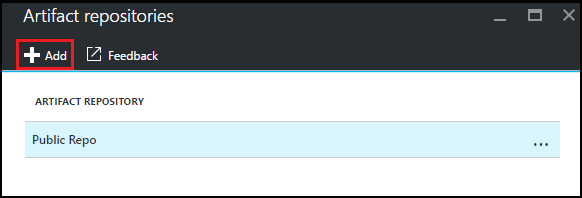

<properties
    pageTitle="Ajouter un référentiel objet Git à un laboratoire dans Azure DevTest ateliers | Microsoft Azure"
    description="Ajouter un référentiel GitHub ou Visual Studio Team Services Git de votre source d’objets personnalisés dans Azure DevTest ateliers"
    services="devtest-lab,virtual-machines,visual-studio-online"
    documentationCenter="na"
    authors="tomarcher"
    manager="douge"
    editor=""/>

<tags
    ms.service="devtest-lab"
    ms.workload="na"
    ms.tgt_pltfrm="na"
    ms.devlang="na"
    ms.topic="article"
    ms.date="09/06/2016"
    ms.author="tarcher"/>

# Ajouter un référentiel objet Git à un laboratoire dans Azure DevTest ateliers

> [AZURE.VIDEO how-to-add-your-private-artifacts-repository-in-a-devtest-lab]

Dans Azure DevTest ateliers, objets sont des *actions* - telles que l’installation des logiciels ou en cours d’exécution des scripts et des commandes - lorsqu’une machine virtuelle est créée. Par défaut, un laboratoire inclut des objets à partir du référentiel objet Azure DevTest ateliers officiel. Vous pouvez ajouter un référentiel objet Git à votre laboratoire pour inclure les objets créés par votre équipe. Le référentiel peut être hébergé sur [GitHub](https://github.com) ou sur [Visual Studio Team Services (VSTS)](https://visualstudio.com).

- Pour apprendre à créer un référentiel GitHub, consultez les [Cours d’initiation sur GitHub](https://help.github.com/categories/bootcamp/).
- Pour apprendre à créer un projet Team Services grâce à un référentiel Git, voir [se connecter à Visual Studio Team Services](https://www.visualstudio.com/get-started/setup/connect-to-visual-studio-online).

La capture d’écran suivante montre un exemple de la façon dont un référentiel contenant des objets peut se présenter dans GitHub :  

## Obtenir les informations du référentiel et les informations d’identification

Pour ajouter un référentiel de l’objet à votre laboratoire, vous devez d’abord obtenir certaines informations à partir de votre référentiel. Les sections suivantes vous guident dans l’obtention de ces informations pour les référentiels objet hébergés sur GitHub et Visual Studio Team Services.

### Obtenir l’URL du cloner référentiel GitHub et l’accès personnel jeton

Pour obtenir la cloner référentiel GitHub URL et jeton d’accès personnel, procédez comme suit :

1. Accédez à la page d’accueil du référentiel GitHub qui contient les définitions d’objet.

1. Sélectionnez **cloner ou téléchargement**.

1. Sélectionnez le bouton pour copier la **HTTPS cloner url** dans le Presse-papiers, puis enregistrer l’URL pour le réutiliser ultérieurement.

1. Sélectionnez l’image de profil dans le coin supérieur droit de GitHub, puis sélectionnez **paramètres**.

1. Dans le menu **paramètres personnels** sur la gauche, sélectionnez **jetons d’accès personnel**.

1. Sélectionnez **nouveau jeton de générer**.

1. Dans la page **nouveau jeton d’accès personnel** , entrez une **description du jeton**, acceptez les éléments par défaut dans les **Sélectionnez étendues**, puis **Générer des jetons**.

1. Enregistrer le jeton généré que nécessaire ultérieurement.

1. Vous pouvez fermer GitHub maintenant.   

1. Passez à la section [connecter votre laboratoire vers le référentiel de l’objet](#connect-your-lab-to-the-artifact-repository) .

### Obtenir l’URL du cloner référentiel Visual Studio Team Services et l’accès personnel jeton

Pour obtenir l’URL de cloner référentiel de Visual Studio Team Services et le jeton d’accès personnel, procédez comme suit :

1. Ouvrez la page d’accueil de votre collection de sites d’équipe (par exemple, `https://contoso-web-team.visualstudio.com`), puis sélectionnez le projet de l’objet.

1. Dans la page d’accueil de project, sélectionnez **Code**.

1. Pour afficher l’URL cloner, dans la page de **Code** du projet, sélectionnez **cloner**.

1. Enregistrer l’URL que vous le souhaitez plus loin dans ce didacticiel.

1. Pour créer un jeton d’accès personnel, sélectionnez **Mon profil** dans le menu déroulant de compte utilisateur.

1. Dans la page informations de profil, sélectionnez **sécurité**.

1. Sous l’onglet **sécurité** , sélectionnez **Ajouter**.

1. Dans la page **créer un jeton d’accès personnels** :

    - Entrez une **Description** pour le jeton.
    - Sélectionnez **180 jours** dans la liste **Expire dans** .
    - Cliquez sur **tous les comptes accessibles** à partir de la liste des **comptes** .
    - Choisissez l’option **toutes les étendues** .
    - Choisissez **créer jeton**.

1. Lorsque vous avez terminé, le nouveau jeton apparaît dans la liste **Personnel jetons d’accès** . Sélectionnez **Copier jeton**, puis enregistrez la valeur du jeton pour une utilisation ultérieure.

1. Passez à la section [connecter votre laboratoire vers le référentiel de l’objet](#connect-your-lab-to-the-artifact-repository) .

##Connecter votre laboratoire vers le référentiel objet

1. Connectez-vous au [portail Azure](http://go.microsoft.com/fwlink/p/?LinkID=525040).

1. Sélectionnez **Autres Services**, puis **Ateliers DevTest** dans la liste.

1. Dans la liste des ateliers, sélectionnez le laboratoire souhaité.   

1. Dans la carte du laboratoire, sélectionnez **Configuration**.

1. Sur la carte de **Configuration** de l’atelier, sélectionnez **Référentiels d’objets**.

1. Dans la carte de **Référentiels d’objets** , sélectionnez **+ Ajouter**.

    
 
1. Sur la deuxième carte **Objets référentiels** , spécifiez les éléments suivants :

    - **Nom** : entrez un nom pour le référentiel.
    - **Url de cloner Git** - Entrez l’URL de cloner Git HTTPS que vous avez copiée précédemment dans GitHub ou Visual Studio Team Services. 
    - **Chemin du dossier** : entrez le chemin du dossier par rapport à l’URL cloner qui contient des définitions de votre objet.
    - **Branche** - Entrez la branche pour obtenir des définitions de votre objet.
    - **Jeton d’accès personnel** - Entrez le jeton d’accès personnel obtenues précédemment à partir de GitHub ou Visual Studio Team Services. 
     
    

1. Cliquez sur **Enregistrer**.

[AZURE.INCLUDE [devtest-lab-try-it-out](../../includes/devtest-lab-try-it-out.md)]

## Billets de blog connexes
- [Comment résoudre les problèmes ignore les objets AzureDevTestLabs](http://www.visualstudiogeeks.com/blog/DevOps/How-to-troubleshoot-failing-artifacts-in-AzureDevTestLabs)
- [Participer à une machine virtuelle à domaine Active Directory existant à l’aide de modèle de processeur dans un environnement de Test de développement Azure](http://www.visualstudiogeeks.com/blog/DevOps/Join-a-VM-to-existing-AD-domain-using-ARM-template-AzureDevTestLabs)