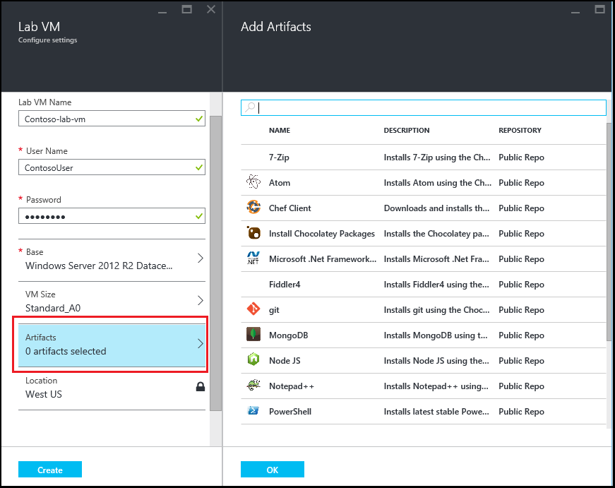

<properties
    pageTitle="Ajouter une machine virtuelle avec des objets à un laboratoire dans Azure DevTest ateliers | Microsoft Azure"
    description="Découvrez comment ajouter une machine virtuelle avec des objets dans Azure DevTest ateliers"
    services="devtest-lab,virtual-machines"
    documentationCenter="na"
    authors="tomarcher"
    manager="douge"
    editor=""/>

<tags
    ms.service="devtest-lab"
    ms.workload="na"
    ms.tgt_pltfrm="na"
    ms.devlang="na"
    ms.topic="article"
    ms.date="08/30/2016"
    ms.author="tarcher"/>

# Ajouter une machine virtuelle avec des objets à un laboratoire dans Azure DevTest ateliers

> [AZURE.VIDEO how-to-create-vms-with-artifacts-in-a-devtest-lab]

Vous créez une machine virtuelle dans un environnement à partir d’une *base* qui est une [image personnalisée](./devtest-lab-create-template.md), une [formule](./devtest-lab-manage-formulas.md)ou une [image Marketplace](./devtest-lab-configure-marketplace-images.md).

Ateliers DevTest *objets* vous permettent de spécifier les *actions* qui sont effectuées lors de la machine virtuelle est créée. 

Actions de l’objet peuvent effectuer les procédures comme en cours d’exécution de scripts Windows PowerShell, Bash commandes en cours d’exécution et installer le logiciel. 

Objet *paramètres* vous permettent de personnaliser l’objet pour votre scénario particulier.

Cet article vous explique comment créer une machine virtuelle dans votre laboratoire avec les objets.

## Ajouter une machine virtuelle avec des objets

1. Connectez-vous au [portail Azure](http://go.microsoft.com/fwlink/p/?LinkID=525040).

1. Sélectionnez **Autres Services**, puis **Ateliers DevTest** dans la liste.

1. Dans la liste des ateliers, sélectionnez le laboratoire dans lequel vous souhaitez créer la machine virtuelle.  

1. Dans la carte de **vue d’ensemble** du laboratoire, sélectionnez **+ Machine virtuelle**.  
    

1. Dans la carte de **Choisir une base** , sélectionnez une base de la machine virtuelle.

1. Sur la carte **machine virtuelle** , entrez un nom pour le nouvel ordinateur virtuel dans la zone de texte **nom de la machine virtuelle** .

    

1. Entrez un **Nom d’utilisateur** qui seront accordées des privilèges d’administrateur sur l’ordinateur virtuel.  

1. Si vous souhaitez utiliser un mot de passe stocké dans votre *magasin secrète*, sélectionnez **utiliser secrets à partir de mon store secret**et spécifiez une valeur clé qui correspond à votre mot de passe. Dans le cas contraire, entrez simplement un mot de passe dans le champ de texte appelé **Type d’une valeur**.
 
1. Sélectionnez la **taille de la machine virtuelle** et sélectionnez une des éléments prédéfinis qui spécifient les cœurs, la taille de RAM et la taille du disque dur de la machine virtuelle à créer.

1. Sélectionnez **virtuelle réseau** et sélectionnez le réseau virtuel souhaité.

1. Sélectionnez **sous-réseau** , puis sélectionnez sous-réseau.

1. Si la stratégie laboratoire est configurée pour autoriser les adresses IP publiques pour le sous-réseau sélectionné, spécifiez si vous souhaitez que l’adresse IP soit public en cliquant sur **Oui** ou **non**. Dans le cas contraire, cette option est désactivée et sélectionnée comme **non**. 

1. Sélectionner des **objets** - dans la liste des objets - et sélectionnez Configurer les objets que vous voulez ajouter à l’image de base. 
**Remarque :** Si vous débutez avec ateliers DevTest ou objets configuration, passez à la section [Ajouter un objet existant à une machine virtuelle](#add-an-existing-artifact-to-a-vm) et puis revenez à cet écran lorsque vous avez terminé.

1. Si vous souhaitez afficher ou copiez le modèle de gestionnaire de ressources Azure, passez à la section [modèle enregistrer le Gestionnaire de ressources Azure](#save-arm-template) et revenez à cet écran lorsque vous avez terminé.

1. Sélectionnez **créer** pour ajouter la machine virtuelle spécifiée à l’atelier.

1. La carte d’atelier affiche l’état de la création de la machine virtuelle ; tout d’abord en tant que **Création**, puis comme **en cours d’exécution** après la machine virtuelle a été démarré.

1. Accédez à la section [Étapes suivantes](#next-steps) . 

## Ajouter un objet existant pour une machine virtuelle

Lorsque vous créez une machine virtuelle, vous pouvez ajouter des objets existants. Chaque laboratoire comprend des objets à partir du Public DevTest ateliers objet référentiel, ainsi que les composants que vous avez créés et ajoutés à votre propre référentiel objet.
Pour découvrir comment créer des objets, voir l’article, [Découvrez comment créer vos propres objets pour une utilisation avec ateliers DevTest](devtest-lab-artifact-author.md).

1. Dans la carte **machine virtuelle** , sélectionnez **objets**. 

1. Sur la carte **Ajouter objets** , sélectionnez l’objet souhaité.  

    

1. Entrez les valeurs de paramètre requis et tous les paramètres facultatifs dont vous avez besoin.  

1. Sélectionnez **Ajouter** pour ajouter l’objet et revenir à la carte **d’Ajouter des objets** .

1. Continuez d’ajouter des objets selon vos besoins pour votre ordinateur virtuel.

1. Une fois que vous avez ajouté vos objets, vous pouvez [Modifier l’ordre dans lequel les objets sont exécutées](#change-the-order-in-which-artifacts-are-run). Vous pouvez également revenir pour [Afficher ou modifier un objet](#view-or-modify-an-artifact).

## Modifier l’ordre dans lequel les objets sont exécutées

Par défaut, les actions des objets sont exécutées dans l’ordre dans lequel elles sont ajoutées à la machine virtuelle. Les étapes suivantes illustrent comment modifier l’ordre dans lequel les objets sont exécutées.

1. En haut de la cuillère **Ajouter des objets** , sélectionnez le lien indiquant le nombre d’objets qui ont été ajoutés à la machine virtuelle.

    

1. Pour spécifier l’ordre dans lequel les objets sont exécutées, faites glisser et déposez les objets dans l’ordre souhaité. **Remarque :** Si vous avez des difficultés à faire glisser l’objet, vérifiez que vous faites glisser du côté gauche de l’objet. 

1. Sélectionnez **OK** lorsque vous avez terminé.  

## Afficher ou modifier un objet

Les étapes suivantes expliquent comment afficher ou modifier les paramètres d’un objet :

1. En haut de la cuillère **Ajouter des objets** , sélectionnez le lien indiquant le nombre d’objets qui ont été ajoutés à la machine virtuelle.

    

1. Sur la carte **Sélectionnée des objets** , sélectionnez l’objet que vous souhaitez afficher ou le modifier.  

1. Sur la carte **Ajouter un objet** , apportez les modifications nécessaires, puis sélectionnez **OK** pour fermer la carte **Ajouter un objet** .

1. Sélectionnez **OK** pour fermer la carte **Objets sélectionnés** .

## Enregistrer le modèle de gestionnaire de ressources Azure

Un modèle de gestionnaire de ressources Azure fournit déclarative pour définir un déploiement répétitif. Les étapes suivantes expliquent comment enregistrer le modèle Azure le Gestionnaire de ressources de la machine virtuelle en cours de création.
Une fois enregistré, vous pouvez utiliser le modèle Azure le Gestionnaire de ressources pour [déployer des nouvelles machines virtuelles avec Azure PowerShell](../azure-resource-manager/resource-group-overview.md#template-deployment).

1. Dans la carte **machine virtuelle** , sélectionnez **Modèle d’affichage de processeur**.

1. Dans le **modèle d’affichage de gestionnaire de ressources Azure carte**, sélectionnez le texte du modèle.

1. Copier le texte sélectionné dans le Presse-papiers.

1. Sélectionnez **OK** pour fermer la **carte de modèle d’affichage de gestionnaire de ressources Azure**.

1. Ouvrez un éditeur de texte.

1. Collez le texte du modèle à partir du Presse-papiers.

1. Enregistrez le fichier pour une utilisation ultérieure.

[AZURE.INCLUDE [devtest-lab-try-it-out](../../includes/devtest-lab-try-it-out.md)]

## Étapes suivantes

- Une fois que la machine virtuelle a été créée, vous pouvez vous connecter à la machine virtuelle en sélectionnant **se connecter** dans la carte de l’ordinateur.
- Découvrez comment [créer des objets personnalisés pour votre machine virtuelle ateliers DevTest](devtest-lab-artifact-author.md).
- Explorer la [Galerie de modèles de démarrage rapide de DevTest ateliers processeur](https://github.com/Azure/azure-devtestlab/tree/master/ARMTemplates)