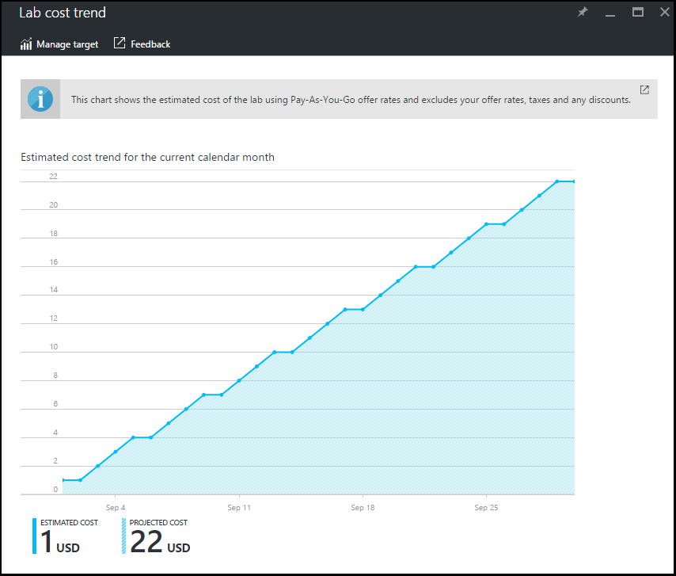

<properties
    pageTitle="Afficher la tendance de coût mensuel atelier estimée dans Azure DevTest ateliers | Microsoft Azure"
    description="En savoir plus sur le graphique de tendance estimée coût mensuel Azure DevTest ateliers."
    services="devtest-lab,virtual-machines"
    documentationCenter="na"
    authors="tomarcher"
    manager="douge"
    editor=""/>

<tags
    ms.service="devtest-lab"
    ms.workload="na"
    ms.tgt_pltfrm="na"
    ms.devlang="na"
    ms.topic="article"
    ms.date="09/06/2016"
    ms.author="tarcher"/>

# Afficher la tendance de coût mensuel atelier estimée dans Azure DevTest ateliers

La fonctionnalité de gestion des coûts d’ateliers DevTest vous permet de suivre le coût de votre laboratoire. Cet article montre comment utiliser le graphique **Mensuel tendance coût estimée** affiche estimée coût à date du mois de calendrier en cours et le coût prévu de fin de mois pour le mois de calendrier en cours. Dans cet article, vous allez apprendre à afficher le graphique de tendance estimée coût mensuel dans le portail Azure.

## Affichage du graphique de l’évolution du coût mensuel estimée

Pour afficher le graphique de l’évolution du coût mensuel estimée, procédez comme suit : 

1. Connectez-vous au [portail Azure](http://go.microsoft.com/fwlink/p/?LinkID=525040).

1. Sélectionnez **Autres Services**, puis **Ateliers DevTest** dans la liste.

1. Dans la liste des ateliers, sélectionnez le laboratoire souhaité.   

1. Sur la carte du laboratoire, sélectionnez **paramètres de coût**.

1. Dans la carte de **Paramètres des coûts** du laboratoire, sélectionnez **atelier coût tendance**.

1. La capture d’écran suivante montre un exemple d’un graphique de coût. 

    

La valeur de **coût estimé** est estimée coût à jour du mois en cours calendrier. Le **coût projeté** est la valeur estimée pour le mois de calendrier en cours entier, calculé à l’aide du coût atelier des cinq jours précédents.
 
Les montants de coût sont arrondis au nombre entier immédiatement supérieur. Par exemple : 

- 5.01 arrondit jusqu'à 6 
- 5.50 arrondit jusqu'à 6
- 5.99 arrondit jusqu'à 6

Comme il statuts au-dessus du graphique, les coûts que vous voyez dans le graphique doivent coûts *estimée* à l’aide de [paiement](https://azure.microsoft.com/offers/ms-azr-0003p/) offrent des taux.
En outre, les conditions suivantes sont *pas* inclus dans le calcul du coût :

- Abonnements fournisseur et Dreamspark ne sont actuellement pas pris en charge comme Azure DevTest ateliers utilise les [Azure API de facturation](../billing-usage-rate-card-overview.md) pour calculer le coût atelier, qui ne prend pas en charge les abonnements fournisseur ou Dreamspark.
- Taux de votre offre. Pour l’instant, nous ne sont pas en mesure d’utiliser votre offre les taux (affichées sous votre abonnement) que vous avez négociation avec Microsoft ou Microsoft partenaires. Nous utilisons taux de paiement.
- Vos impôts
- Vos réductions
- Devise de facturation. Pour l’instant, le coût atelier s’affiche uniquement dans la devise euros.

[AZURE.INCLUDE [devtest-lab-try-it-out](../../includes/devtest-lab-try-it-out.md)]

## Billets de blog connexes

- [Deux autres opérations à conserver votre coût sur la bonne voie dans ateliers DevTest](https://blogs.msdn.microsoft.com/devtestlab/2016/06/21/keep-your-cost-on-track/)
- [Pourquoi coût seuils ?](https://blogs.msdn.microsoft.com/devtestlab/2016/04/11/why-cost-thresholds/)

## Étapes suivantes

Voici quelques actions à entreprendre suivant :

- [Définir des stratégies de laboratoire](./devtest-lab-set-lab-policy.md) - découvrir comment définir les diverses stratégies utilisées pour déterminer la façon dont votre laboratoire et ses machines virtuelles sont utilisés. 
- [Créer une image personnalisée](./devtest-lab-create-template.md) - lorsque vous créez une machine virtuelle, vous spécifiez une base, qui peut être une image personnalisée ou une image Marketplace. Cet article explique comment créer une image personnalisée à partir d’un fichier de disque dur virtuel.
- [Configurer Marketplace images](./devtest-lab-configure-marketplace-images.md) - ateliers DevTest prend en charge la création de machines virtuelles basés sur des images Azure Marketplace. Cet article explique comment spécifier qui, le cas échéant, images Azure Marketplace peuvent être utilisé lors de la création des machines virtuelles dans un environnement.
- [Créer une machine virtuelle dans un environnement](./devtest-lab-add-vm-with-artifacts.md) - montre comment créer une machine virtuelle à partir d’une image de base (soit personnalisé ou Marketplace) et l’utilisation des objets dans votre machine virtuelle.