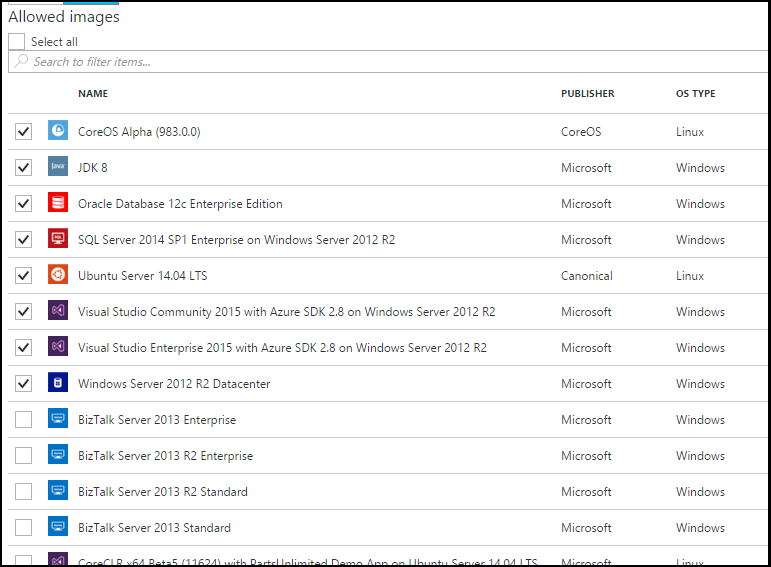

<properties
    pageTitle="Configurer les paramètres de l’image Azure Marketplace dans Azure DevTest ateliers | Microsoft Azure"
    description="Configurer les images Azure Marketplace peuvent être utilisées lorsque vous créez une machine virtuelle dans Azure DevTest ateliers"
    services="devtest-lab,virtual-machines"
    documentationCenter="na"
    authors="tomarcher"
    manager="douge"
    editor=""/>

<tags
    ms.service="devtest-lab"
    ms.workload="na"
    ms.tgt_pltfrm="na"
    ms.devlang="na"
    ms.topic="article"
    ms.date="09/06/2016"
    ms.author="tarcher"/>

# Configurer les paramètres de l’image Azure Marketplace dans Azure DevTest ateliers

Ateliers DevTest prend en charge la création machines virtuelles basés sur des images Azure Marketplace selon la façon dont vous avez configuré les images Azure Marketplace à utiliser dans votre laboratoire. Cet article vous explique comment spécifier qui, le cas échéant, images Azure Marketplace peuvent être utilisé lors de la création des machines virtuelles dans un environnement.

## Sélectionnez les images Azure Marketplace sont autorisées lorsque vous créez une machine virtuelle

1. Connectez-vous au [portail Azure](http://go.microsoft.com/fwlink/p/?LinkID=525040).

1. Sélectionnez **Autres Services**, puis **Ateliers DevTest** dans la liste.

1. Dans la liste des ateliers, sélectionnez le laboratoire souhaité. 

1. Dans la carte du laboratoire, sélectionnez **Configuration**.
    
1. Dans la carte de **Configuration** du laboratoire, sélectionnez **images Marketplace**

1. Indiquez si vous souhaitez toutes les images Azure Marketplace complet soit disponible à utiliser comme base d’un nouvel ordinateur virtuel. Si vous sélectionnez **Oui**, toutes les images Azure Marketplace qui répondent à tous les critères suivants sont autorisés dans le laboratoire :

    - L’image crée une machine virtuelle unique **et**
    - L’image utilise le Gestionnaire de ressources Azure mise en service machines virtuelles **et**
    - L’image ne nécessite l’achat d’un plan de gestion des licences supplémentaires
    
    Si vous ne voulez aucune image à autoriser ou que vous souhaitez spécifier les images peuvent être utilisées, sélectionnez **non**.
 
    
 
1. Si vous sélectionnez **non** à l’étape précédente, la case à cocher **Autorisés images/sélectionner tout** est activée. Vous pouvez utiliser cette option avec la zone de recherche pour rapidement sélectionner ou désélectionner tous les éléments affichés dans la liste.
Vous pouvez également sélectionner les images Azure Marketplace que vous voulez autoriser pour la création de machine virtuelle individuellement en cochant les cases à cocher correspondantes de chaque image.
Sélectionnez rien dans la liste si vous ne voulez pas autoriser toutes les images à utiliser dans le laboratoire Azure Marketplace.

    

[AZURE.INCLUDE [devtest-lab-try-it-out](../../includes/devtest-lab-try-it-out.md)]

## Étapes suivantes

Une fois que vous avez configuré la façon dont les images de Azure Marketplace sont autorisées lorsque vous créez une machine virtuelle, l’étape suivante consiste à [Ajouter une machine virtuelle à votre laboratoire](./devtest-lab-add-vm-with-artifacts.md).