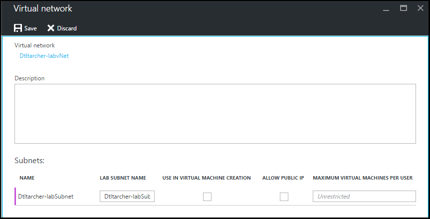

<properties
    pageTitle="Configurer un réseau virtuel dans Azure DevTest ateliers | Microsoft Azure"
    description="Découvrez comment configurer un réseau virtuel existant et sous-réseau et les utiliser dans une machine virtuelle avec Azure DevTest pratiques"
    services="devtest-lab,virtual-machines"
    documentationCenter="na"
    authors="tomarcher"
    manager="douge"
    editor=""/>

<tags
    ms.service="devtest-lab"
    ms.workload="na"
    ms.tgt_pltfrm="na"
    ms.devlang="na"
    ms.topic="article"
    ms.date="09/06/2016"
    ms.author="tarcher"/>

# Configurer un réseau virtuel dans Azure DevTest ateliers

Comme indiqué dans l’article, [Ajouter une machine virtuelle avec des objets à un laboratoire](devtest-lab-add-vm-with-artifacts.md), lorsque vous créez une machine virtuelle dans un laboratoire, vous pouvez spécifier un réseau virtuel configuré. Un scénario pour cela est si vous devez accéder aux ressources de votre réseau d’entreprise à partir de vos ordinateurs virtuels à l’aide de l’ordinateur virtuel qui a été configuré avec ExpressRoute ou VPN de site à. Les sections suivantes montrent comment ajouter votre réseau virtuel existant dans Paramètres du réseau virtuel d’un laboratoire afin qu’il soit disponible pour choisir lors de la création des machines virtuelles.

## Configurer un réseau virtuel pour un laboratoire à l’aide du portail Azure
La procédure suivante explique comment ajouter un réseau virtuel existant (et sous-réseau) à un laboratoire afin qu’il puisse être utilisé lorsque vous créez une machine virtuelle dans le même laboratoire. 

1. Connectez-vous au [portail Azure](http://go.microsoft.com/fwlink/p/?LinkID=525040).

1. Sélectionnez **Autres Services**, puis **Ateliers DevTest** dans la liste.

1. Dans la liste des ateliers, sélectionnez le laboratoire souhaité. 

1. Dans la carte du laboratoire, sélectionnez **Configuration**.

1. Dans la carte de **Configuration** de l’atelier, sélectionnez **réseaux virtuels**.

1. Sur la carte de **réseaux virtuels** , vous voyez une liste de réseaux virtuels configuré pour l’atelier actuel ainsi que le réseau virtuel par défaut créé pour votre laboratoire. 

1. Sélectionnez **+ Ajouter**.

    
    
1. Dans la carte **réseau virtuelle** , sélectionnez **[Sélectionnez réseau virtuel]**.

    
    
1. Sur la carte **réseau virtuel choisir** , sélectionnez le réseau virtuel souhaité. La carte indique tous les réseaux virtuels qui se trouvent sous la même région dans l’abonnement en tant que le laboratoire.  

1. Après avoir sélectionné un réseau virtuel, vous revenez à la carte **réseau virtuelle** et plusieurs champs sont activées.  

    

1. Entrez une description pour votre réseau virtuel / combinaison atelier.

1. Pour permettre à un sous-réseau pour être utilisés dans laboratoire création d’une machine virtuelle, sélectionnez **Utiliser la création de MACHINE virtuelle IN**.

1. Pour autoriser les adresses IP publiques dans un sous-réseau, sélectionnez **Autoriser PUBLIC IP**.

1. Dans le champ **MACHINES virtuelles MAXIMUM par utilisateur** , spécifiez les ordinateurs virtuels maximum par utilisateur de chaque sous réseau. Si vous souhaitez qu’un nombre illimité de machines virtuelles, laissez ce champ vide.

1. Cliquez sur **Enregistrer**.

1. Maintenant que le réseau virtuel est configuré, il peut être sélectionné lorsque vous créez une machine virtuelle. Pour apprendre à créer une machine virtuelle et spécifier un réseau virtuel, reportez-vous à l’article, [Ajouter une machine virtuelle avec des objets à un laboratoire](devtest-lab-add-vm-with-artifacts.md). 

[AZURE.INCLUDE [devtest-lab-try-it-out](../../includes/devtest-lab-try-it-out.md)]

## Étapes suivantes

Une fois que vous avez ajouté le réseau virtuel souhaité à votre laboratoire, l’étape suivante consiste à [Ajouter une machine virtuelle à votre laboratoire](devtest-lab-add-vm-with-artifacts.md).