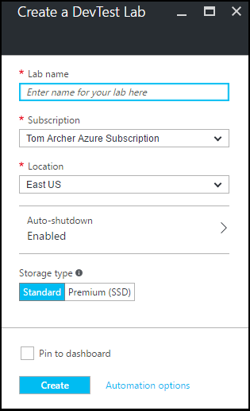

<properties
    pageTitle="Création d’un atelier dans Azure DevTest ateliers | Microsoft Azure"
    description="Créer un laboratoire dans Azure DevTest ateliers pour machines virtuelles"
    services="devtest-lab,virtual-machines"
    documentationCenter="na"
    authors="tomarcher"
    manager="douge"
    editor=""/>

<tags
    ms.service="devtest-lab"
    ms.workload="na"
    ms.tgt_pltfrm="na"
    ms.devlang="na"
    ms.topic="get-started-article"
    ms.date="09/12/2016"
    ms.author="tarcher"/>

# Création d’un atelier dans Azure DevTest ateliers

## Conditions préalables

Pour créer un laboratoire, vous devez :

- Un abonnement Azure. Pour en savoir plus sur les options d’achat Azure, voir [Comment acheter Azure](https://azure.microsoft.com/pricing/purchase-options/) ou [version d’évaluation gratuite d’un mois](https://azure.microsoft.com/pricing/free-trial/). Vous devez être le propriétaire de l’abonnement à créer l’atelier.

## Étapes de création d’un laboratoire dans Azure DevTest ateliers

Les étapes suivantes illustrent comment utiliser le portail Azure pour créer un laboratoire dans Azure DevTest ateliers. 

1. Connectez-vous au [portail Azure](http://go.microsoft.com/fwlink/p/?LinkID=525040).

1. Sélectionnez **plusieurs services**, puis **Ateliers DevTest** dans la liste.

1. Dans la carte **Ateliers DevTest** , sélectionnez **Ajouter**.

    

1. Sur la carte de **créer un laboratoire DevTest** :

    1. Entrez un **Nom de laboratoire** pour le nouveau laboratoire.
    
    1. Sélectionnez l' **abonnement** à associer à l’atelier.
    
    1. Sélectionnez un **emplacement** dans lequel stocker le laboratoire.
    
    1. Sélectionnez **arrêt automatique** pour spécifier si vous voulez activer - et définir les paramètres de - automatique arrêt de tous les atelier est machines virtuelles.
    
    1. Sélectionnez le **type de stockage** pour indiquer le type de disque de stockage pour les machines virtuelles du laboratoire. 
    
    1. Sélectionnez **créer**.

    

[AZURE.INCLUDE [devtest-lab-try-it-out](../../includes/devtest-lab-try-it-out.md)]

## Étapes suivantes

Une fois que vous avez créé votre laboratoire, voici quelques étapes suivantes à prendre en compte :

- [Sécuriser l’accès à un laboratoire](devtest-lab-add-devtest-user.md).

- [Définir des stratégies de laboratoire](devtest-lab-set-lab-policy.md).

- [Créer un modèle de laboratoire](devtest-lab-create-template.md).

- [Créer des objets personnalisés pour vos ordinateurs virtuels](devtest-lab-artifact-author.md).

- [Ajouter une machine virtuelle avec des objets à un laboratoire](devtest-lab-add-vm-with-artifacts.md).