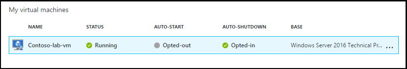
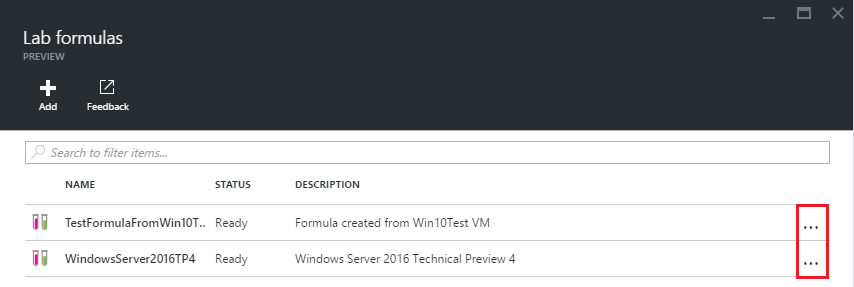

<properties
    pageTitle="Gérer les formules dans Azure DevTest ateliers pour créer des machines virtuelles | Microsoft Azure"
    description="Découvrez comment créer, mettre à jour et supprimer des formules Azure DevTest ateliers et les utiliser pour créer de nouvelles machines virtuelles."
    services="devtest-lab,virtual-machines"
    documentationCenter="na"
    authors="tomarcher"
    manager="douge"
    editor=""/>

<tags
    ms.service="devtest-lab"
    ms.workload="na"
    ms.tgt_pltfrm="na"
    ms.devlang="na"
    ms.topic="article"
    ms.date="08/30/2016"
    ms.author="tarcher"/>

# Gérer les formules DevTest ateliers pour créer des ordinateurs virtuels

Une formule dans Azure DevTest ateliers est une liste de valeurs de propriété par défaut utilisé pour créer une machine virtuelle (). Lorsque vous créez une machine virtuelle à partir d’une formule, les valeurs par défaut utilisable comme-sont ou modifié. Comme [des images personnalisées](./devtest-lab-create-template.md) et les [images Marketplace](./devtest-lab-configure-marketplace-images.md), formules permettent de machine virtuelle rapide mise en service.  

Dans cet article, vous allez apprendre à effectuer les tâches suivantes :

- [Créer une formule](#create-a-formula)
- [Utiliser une formule pour une machine virtuelle de mise en service](#use-a-formula-to-provision-a-vm)
- [Modifier une formule](#modify-a-formula)
- [Supprimer une formule](#delete-a-formula)

> [AZURE.NOTE] Formules - tels que des [images personnalisées](./devtest-lab-create-template.md) - permettent de créer une image de base à partir d’un fichier de disque dur virtuel. L’image de base, peut être utilisé pour configurer un nouvel ordinateur virtuel. Pour aider à déterminer qui est adapté à votre environnement particulier, reportez-vous à l’article de la [comparaison des images personnalisées et les formules dans DevTest ateliers](./devtest-lab-comparing-vm-base-image-types.md).

## Créer une formule
Toute personne disposant d’autorisations ateliers DevTest *utilisateurs* est en mesure de créer des machines virtuelles à l’aide d’une formule comme base. Il existe deux manières de créer des formules : 

- À partir d’une base - utiliser lorsque vous voulez définir toutes les caractéristiques de la formule.
- À partir d’un laboratoire existant machine virtuelle - utiliser lorsque vous voulez créer une formule en fonction des paramètres d’un ordinateur virtuel existant.

### Créer une formule à partir d’une base
La procédure suivante vous guide dans le processus de création d’une formule à partir d’une image personnalisée, Marketplace image ou une autre formule.

1. Connectez-vous au [portail Azure](http://go.microsoft.com/fwlink/p/?LinkID=525040).

1. Sélectionnez **Autres Services**, puis **Ateliers DevTest** dans la liste.

1. Dans la liste des ateliers, sélectionnez le laboratoire souhaité.  

1. Sur la carte du laboratoire, sélectionnez **formules (bases réutilisables)**.

    

1. Dans la carte de **formules atelier** , sélectionnez **+ Ajouter**.

    

1. Dans la carte de **Choisir une base** , sélectionnez la base (image personnalisée, image Marketplace ou formule) à partir de laquelle vous souhaitez créer la formule.

    

1. Sur la carte de la **formule de créer** , spécifiez les valeurs suivantes :

    - **Nom de la formule** : entrez un nom pour votre formule. Cette valeur s’affichera dans la liste des images de base lorsque vous créez une machine virtuelle. Le nom est validé comme vous le tapez, si n’est pas valide, un message indique la configuration requise pour un nom valide.
    - **Description** : entrez une description significative de votre formule. Cette valeur est disponible à partir du menu contextuel de la formule lorsque vous créez une machine virtuelle.
    - **Nom d’utilisateur** : entrez un nom d’utilisateur qui est accordé des privilèges d’administrateur.
    - **Mot de passe** - Entrez - ou sélectionnez dans la liste déroulante - une valeur qui est associée avec le code secret (mot de passe) que vous voulez utiliser pour l’utilisateur spécifié.  
    - **Image** – ce champ affiche le nom de l’image de base que vous avez sélectionné dans la carte précédente. 
    - **Machine virtuelle taille** : sélectionnez une des éléments prédéfinis qui spécifient les cœurs, la taille de RAM et la taille du disque dur de la machine virtuelle à créer.
    - **Réseau virtuel** - spécifier le réseau virtuel souhaité.
    - **Sous-réseau** - Spécifie le sous réseau de votre choix.
    - **Adresse IP publique** : si la stratégie laboratoire est configurée pour autoriser les adresses IP publiques pour le sous-réseau sélectionné, indiquez si vous souhaitez l’adresse IP soit public en ne cliquant sur **Oui** ou ****. Dans le cas contraire, cette option est désactivée et sélectionnée comme **non**.
    - **Objets** - sélectionner et configurer les objets que vous voulez ajouter à l’image de base. Sécuriser la chaîne de valeurs ne sont pas enregistrées avec la formule. Par conséquent, les paramètres d’objet qui sont des chaînes sécurisés ne sont pas affichées. 

        

1. Sélectionnez **créer** pour créer la formule.

### Créer une formule à partir d’une machine virtuelle
La procédure suivante vous guide dans le processus de création d’une formule basée sur un ordinateur virtuel existant. 

> [AZURE.NOTE] Pour créer une formule à partir d’un ordinateur virtuel, la machine virtuelle doit avoir été créée après le 30 mars 2016. 

1. Connectez-vous au [portail Azure](http://go.microsoft.com/fwlink/p/?LinkID=525040).

1. Sélectionnez **Autres Services**, puis **Ateliers DevTest** dans la liste.

1. Dans la liste des ateliers, sélectionnez le laboratoire souhaité.  

1. Dans la carte de **vue d’ensemble** du laboratoire, sélectionnez la machine virtuelle à partir de laquelle vous souhaitez créer la formule.

    

1. Sur la carte de la machine virtuelle, sélectionnez **créer formule (base réutilisable)**.

    

1. Sur la carte **créer formule** , entrez un **nom** et une **Description** pour votre nouvelle formule.

    

1. Cliquez sur **OK** pour créer la formule.

## Utiliser une formule pour une machine virtuelle de mise en service
Une fois que vous avez créé une formule, vous pouvez créer une machine virtuelle en fonction de cette formule. La section [Ajouter une machine virtuelle avec objets](devtest-lab-add-vm-with-artifacts.md#add-a-vm-with-artifacts) vous guide tout au long du processus.

## Modifier une formule
Pour modifier une formule, procédez comme suit :

1. Connectez-vous au [portail Azure](http://go.microsoft.com/fwlink/p/?LinkID=525040).

1. Sélectionnez **Autres Services**, puis **Ateliers DevTest** dans la liste.

1. Dans la liste des ateliers, sélectionnez le laboratoire souhaité.  

1. Sur la carte du laboratoire, sélectionnez **formules (bases réutilisables)**.

    

1. Dans la carte de **formules atelier** , sélectionnez la formule que vous souhaitez modifier.

1. Sur la carte **mise à jour de la formule** , apportez les modifications souhaitées, puis sélectionnez **mise à jour**.

## Supprimer une formule 
Pour supprimer une formule, procédez comme suit :

1. Connectez-vous au [portail Azure](http://go.microsoft.com/fwlink/p/?LinkID=525040).

1. Sélectionnez **Autres Services**, puis **Ateliers DevTest** dans la liste.

1. Dans la liste des ateliers, sélectionnez le laboratoire souhaité.  

1. Sur la carte de **paramètres** atelier, sélectionner **des formules**.

    

1. Dans la carte de **formules atelier** , sélectionnez les points de suspension à droite de la formule que vous voulez supprimer.

    

1. Dans le menu contextuel de la formule, cliquez sur **Supprimer**.

    

1. Sélectionnez **Oui** pour la boîte de dialogue de confirmation de suppression.

[AZURE.INCLUDE [devtest-lab-try-it-out](../../includes/devtest-lab-try-it-out.md)]

## Billets de blog connexes

- [Images personnalisées ou des formules ?](https://blogs.msdn.microsoft.com/devtestlab/2016/04/06/custom-images-or-formulas/)

## Étapes suivantes
Une fois que vous avez créé une formule à utiliser lors de la création d’une machine virtuelle, l’étape suivante consiste à [Ajouter une machine virtuelle à votre laboratoire](./devtest-lab-add-vm-with-artifacts.md).