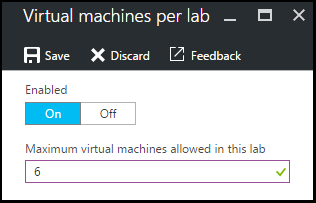

<properties
    pageTitle="Définir les stratégies de laboratoire dans Azure DevTest ateliers | Microsoft Azure"
    description="Découvrez comment définir les stratégies de laboratoire tels que des tailles de machine virtuelle, machines virtuelles maximum par utilisateur et automatisation arrêt."
    services="devtest-lab,virtual-machines"
    documentationCenter="na"
    authors="tomarcher"
    manager="douge"
    editor=""/>

<tags
    ms.service="devtest-lab"
    ms.workload="na"
    ms.tgt_pltfrm="na"
    ms.devlang="na"
    ms.topic="article"
    ms.date="09/12/2016"
    ms.author="tarcher"/>

# Définir les stratégies de laboratoire dans Azure DevTest ateliers

> [AZURE.VIDEO how-to-set-vm-policies-in-a-devtest-lab]

Ateliers DevTest Azure permet de spécifier des stratégies de clé qui vous aident à contrôler les coûts et réduire les rebuts dans votre ateliers. Ces politiques atelier incluent le nombre maximal de machines virtuelles par utilisateur et par atelier et différentes options arrêt automatique et un démarrage automatique. 

## L’accès à des stratégies d’un laboratoire dans Azure DevTest ateliers

La procédure suivante vous guide dans la configuration des stratégies pour un laboratoire dans Azure DevTest ateliers :

Pour afficher (et modifier) les stratégies pour un laboratoire, procédez comme suit :

1. Connectez-vous au [portail Azure](http://go.microsoft.com/fwlink/p/?LinkID=525040).

1. Sélectionnez **plusieurs services**, puis **Ateliers DevTest** dans la liste.

1. Dans la liste des ateliers, sélectionnez le laboratoire souhaité.   

1. Sélectionnez **paramètres de la stratégie**.

1. La carte de **paramètres de stratégie** contienne un menu des paramètres que vous pouvez spécifier : 

    

    Pour plus d’informations sur la définition d’une stratégie, sélectionnez-le dans la liste suivante :

    - [Tailles de machine virtuelle autorisées](#set-allowed-virtual-machine-sizes) , sélectionnez la liste de tailles de mémoire virtuelle autorisée dans l’atelier. Un utilisateur peut créer des machines virtuelles uniquement à partir de cette liste.

    - [Machines virtuelles par utilisateur](#set-virtual-machines-per-user) - spécifier le nombre maximal de machines virtuelles pouvant être créées par un utilisateur. 

    - [Machines virtuelles par atelier](#set-virtual-machines-per-lab) - spécifier le nombre maximal de machines virtuelles pouvant être créées pour un laboratoire. 

    - [Arrêt automatique](#set-auto-shutdown) - spécifier l’heure lorsque pratiques de machines virtuelles s’arrête automatiquement.

    - [Démarrage automatique](#set-auto-start) : indiquez l’heure lorsque machines virtuelles de pratiques démarrent automatiquement vers le haut.

## Jeu de tailles machine virtuelle autorisée

La stratégie de configuration de la taille de mémoire virtuelle autorisée vous aide à réduire les rebuts laboratoire en ce qui vous permet de spécifier les formats de machine virtuelle sont autorisés dans le laboratoire. Si cette stratégie est activée, seules les tailles de mémoire virtuelle à partir de cette liste pouvant être utilisées pour créer des machines virtuelles.

1. Dans la carte de **paramètres de stratégie** du laboratoire, sélectionnez **tailles machines virtuelles autorisées**.

    
 
1. Sélectionnez **sur** à cette stratégie est activée et **désactiver** pour désactiver l’option.

1. Si vous activez cette stratégie, sélectionnez une ou plusieurs des tailles machine virtuelle pouvant être créées dans votre laboratoire.

1. Cliquez sur **Enregistrer**.

## Machines virtuelles à définir chaque utilisateur

La stratégie pour les **machines virtuelles par utilisateur** permet de spécifier le nombre maximal de machines virtuelles pouvant être créées par un utilisateur individuel. Si un utilisateur tente de créer une machine virtuelle lorsque la limite de l’utilisateur a été rencontrée, un message d’erreur indique que la machine virtuelle ne peut pas être créée. 

1. Dans la carte de **paramètres de stratégie** du laboratoire, sélectionnez **machines virtuelles à chaque utilisateur**.

    

1. Sélectionnez **sur** à cette stratégie est activée et **désactiver** pour désactiver l’option.

1. Si vous activez cette stratégie, entrez une valeur numérique qui indique le nombre maximal de machines virtuelles pouvant être créées par un utilisateur. Si vous entrez un numéro qui n’est pas valide, l’interface utilisateur affiche le nombre maximal autorisé pour ce champ.

1. Cliquez sur **Enregistrer**.

## Machines virtuelles à définir chaque atelier

La stratégie pour **machines virtuelles par atelier** autorise vous permettent de spécifier le nombre maximal de machines virtuelles pouvant être créées pour le laboratoire en cours. Si un utilisateur tente de créer une machine virtuelle lorsque la limite de laboratoire a été rencontrée, un message d’erreur indique que la machine virtuelle ne peut pas être créée. 

1. Sur la carte de **paramètres de stratégie** du laboratoire, sélectionnez **machines virtuelles par atelier**.

    

1. Sélectionnez **sur** à cette stratégie est activée et **désactiver** pour désactiver l’option.

1. Si vous activez cette stratégie, entrez une valeur numérique qui indique le nombre maximal de machines virtuelles pouvant être créées pour le laboratoire en cours. Si vous entrez un numéro qui n’est pas valide, l’interface utilisateur affiche le nombre maximal autorisé pour ce champ.

1. Cliquez sur **Enregistrer**.

## Arrêt jeu automatique

La stratégie d’arrêt automatique vous aide à réduire les rebuts laboratoire en ce qui vous permet de spécifier l’heure machines virtuelles de cet atelier arrêtés.

1. Dans la carte de **paramètres de stratégie** du laboratoire, sélectionnez **arrêt automatique**.

    

1. Sélectionnez **sur** à cette stratégie est activée et **désactiver** pour désactiver l’option.

1. Si vous activez cette stratégie, spécifiez l’heure locale pour arrêter tous les ordinateurs virtuels dans le laboratoire en cours.

1. Cliquez sur **Enregistrer**.

1. Par défaut, une fois activé, cette stratégie s’applique à tous les ordinateurs virtuels dans le laboratoire en cours. Pour supprimer ce paramètre à partir d’un ordinateur virtuel spécifique, ouvrez la carte de la machine virtuelle et modifier son paramètre **arrêt automatique** 

## Définir un démarrage automatique

La stratégie de démarrage automatique vous permet de spécifier quand les ordinateurs virtuels dans le laboratoire actuel doivent être démarrés.  

1. Dans la carte de **paramètres de stratégie** du laboratoire, sélectionnez **démarrage automatique**.

    

1. Sélectionnez **sur** à cette stratégie est activée et **désactiver** pour désactiver l’option.

1. Si vous activez cette stratégie, spécifiez l’ordinateur local planifié heure de début et les jours de la semaine pour laquelle s’applique l’heure. 

1. Cliquez sur **Enregistrer**.

1. Une fois activée, cette stratégie n’est pas appliquée automatiquement aux ordinateurs virtuels dans le laboratoire en cours. Pour appliquer ce paramètre à une machine virtuelle spécifique, ouvrez la carte de la machine virtuelle et modifier son paramètre de **démarrage automatique** 

[AZURE.INCLUDE [devtest-lab-try-it-out](../../includes/devtest-lab-try-it-out.md)]

## Étapes suivantes

Une fois que vous avez défini et appliqué les différents paramètres de stratégie machine virtuelle pour votre laboratoire, voici quelques actions à entreprendre suivant :

- [Gestion des coûts configurer](./devtest-lab-configure-cost-management.md) - illustre comment utiliser le graphique **Mensuel tendance estimée coût.**  
Pour afficher le mois en cours est estimée coût-to-date et le coût prévu de la fin du mois.
- [Créer une image personnalisée](./devtest-lab-create-template.md) - lorsque vous créez une machine virtuelle, vous spécifiez une base, qui peut être une image personnalisée ou une image Marketplace. Cet article explique comment créer une image personnalisée à partir d’un fichier de disque dur virtuel.
- [Configurer Marketplace images](./devtest-lab-configure-marketplace-images.md) - Azure DevTest ateliers prend en charge la création de machines virtuelles basés sur des images Azure Marketplace. Cet article explique comment spécifier qui, le cas échéant, images Azure Marketplace peuvent être utilisé lors de la création des machines virtuelles dans un environnement.
- [Créer une machine virtuelle dans un environnement](./devtest-lab-add-vm-with-artifacts.md) - montre comment créer une machine virtuelle à partir d’une image de base (soit personnalisé ou Marketplace) et l’utilisation des objets dans votre machine virtuelle.
