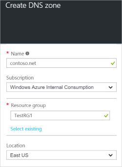
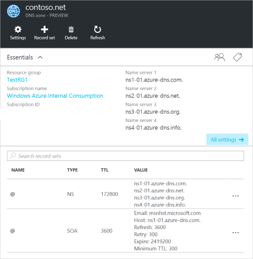

<properties
   pageTitle="Comment créer et gérer une zone DNS dans le portail Azure | Microsoft Azure"
   description="Apprenez à créer des zones DNS pour Azure DNS. Il s’agit d’un guide étape par étape pour créer et gérer votre DNS première et démarrer d’hébergement de votre domaine DNS à l’aide du portail Azure."
   services="dns"
   documentationCenter="na"
   authors="sdwheeler"
   manager="carmonm"
   editor=""
   tags="azure-resource-manager"/>

<tags
   ms.service="dns"
   ms.devlang="na"
   ms.topic="article"
   ms.tgt_pltfrm="na"
   ms.workload="infrastructure-services"
   ms.date="08/16/2016"
   ms.author="sewhee"/>

# Créer une zone DNS dans le portail Azure

> [AZURE.SELECTOR]
- [Portail Azure](dns-getstarted-create-dnszone-portal.md)
- [PowerShell](dns-getstarted-create-dnszone.md)
- [Azure infrastructure du langage commun](dns-getstarted-create-dnszone-cli.md)

Cet article vous guidera tout au long de la procédure pour créer une zone DNS à l’aide du portail Azure. Vous pouvez également créer une zone DNS à l’aide de PowerShell ou infrastructure du langage commun.

[AZURE.INCLUDE [dns-create-zone-about](../../includes/dns-create-zone-about-include.md)]

### À propos des balises pour DNS Azure

Les balises sont une liste de paires nom-valeur et sont utilisées par le Gestionnaire de ressources Azure aux ressources étiquette fins de facturation ou de regroupement. Pour plus d’informations sur les balises, voir l’article [en utilisant des balises pour organiser vos ressources Azure](../resource-group-using-tags.md).

Vous pouvez ajouter des indicateurs dans le portail Azure à l’aide de la carte de **paramètres** pour votre zone DNS.

## Créer une zone DNS

1. Connectez-vous au portail Azure

2. Dans le menu concentrateur, cliquez sur, sur **Nouveau > réseau >** , puis cliquez sur la **zone DNS** pour ouvrir la carte de zone DNS.

    

3. Dans la carte de **zone DNS** , cliquez sur **créer** en bas. Cette action ouvre la carte de **zone DNS créer** .

    

4. Sur la carte de **zone DNS créer** , nommez votre zone DNS. Par exemple, *contoso.com*. Voir [Sur les noms de Zone DNS](#names) dans la section ci-dessus.

5. Ensuite, spécifiez le groupe de ressources que vous voulez utiliser. Vous pouvez créer un nouveau groupe de ressources, ou sélectionnez celui qui existe déjà.

6. Dans le menu déroulant **emplacement** , spécifiez l’emplacement du groupe de ressources. Notez que ce paramètre fait référence à l’emplacement du groupe de ressources, et non à l’emplacement pour la zone DNS. Les ressources de la zone DNS réel est automatiquement « global » et n’est pas quelque chose que vous pouvez (ou devez) spécifiez dans le portail.

7. Vous pouvez laisser la case à cocher **Ajouter au tableau de bord** sélectionné si vous souhaitez trouver facilement votre nouvelle zone dans votre tableau de bord. Puis cliquez sur **créer**.

    

8. Après avoir cliqué sur Créer, vous verrez votre nouvelle zone en cours de configuration du tableau de bord.

    

9. Lorsque votre nouvelle zone a été créé, la carte pour votre nouvelle zone s’ouvre sur le tableau de bord.

## Afficher les enregistrements

Création d’une zone DNS crée également les enregistrements suivants :

- L’enregistrement « De SOA » (). L’architecture orientée services est présent à la racine de chaque zone DNS.
- Les enregistrements de serveur de (noms NS) nom faisant autorité. Ces affichent les serveurs de noms sont qui héberge la zone. DNS Azure utilise un pool de serveurs de noms, et si différents serveurs peuvent être affectées à différentes zones dans Azure DNS. Pour plus d’informations, consultez [délégué un domaine à Azure DNS](dns-domain-delegation.md) .

Vous pouvez afficher les enregistrements à partir du portail Azure

1. À partir de votre carte de **zone DNS** , cliquez sur **tous les paramètres** pour ouvrir la **carte de paramètres** pour la zone DNS.

    

2. Dans la partie inférieure du volet Essentials, vous pouvez voir que l’enregistrement définit pour la zone DNS.

    

## Test

Vous pouvez tester votre zone DNS à l’aide d’outils DNS comme nslookup, Creusez ou l' [applet de commande PowerShell résoudre NomDNS](https://technet.microsoft.com/library/jj590781.aspx).

Si vous n’avez pas encore reçu votre domaine à utiliser la nouvelle zone dans le système DNS Azure, vous avez besoin diriger la requête DNS directement à l’un des serveurs de noms pour votre zone. Les serveurs de noms pour votre zone figurent dans les enregistrements de serveur de noms, comme indiqué par `Get-AzureRmDnsRecordSet` ci-dessus. Assurez-vous que la remplacer les valeurs correctes pour votre zone dans la ligne de commande ci-dessous.

    nslookup
    > set type=SOA
    > server ns1-01.azure-dns.com
    > contoso.com

    Server: ns1-01.azure-dns.com
    Address:  208.76.47.1

    contoso.com
            primary name server = ns1-01.azure-dns.com
            responsible mail addr = msnhst.microsoft.com
            serial  = 1
            refresh = 900 (15 mins)
            retry   = 300 (5 mins)
            expire  = 604800 (7 days)
            default TTL = 300 (5 mins)

## Supprimer une zone DNS

Vous pouvez supprimer la zone DNS directement à partir du portail. Avant de supprimer une zone DNS dans DNS Azure, vous devez supprimer tous les jeux d’enregistrements, à l’exception des enregistrements NS et SOA à la racine de la zone qui ont été créés automatiquement lorsque la zone a été créée.

1. Recherchez la carte de **zone DNS** pour la zone à supprimer, puis cliquez sur **Supprimer** dans la partie supérieure de la cuillère.

2. Un message s’affiche et vous informe que vous devez supprimer tous les ensembles d’enregistrements, sauf les enregistrements NS et SOA qui ont été créés automatiquement. Si vous avez supprimé votre jeux d’enregistrements, cliquez sur **Oui**. Notez que lorsque vous supprimez une zone DNS à partir du portail, le groupe de ressources est associée à la zone DNS ne sont pas supprimé.

## Étapes suivantes

Après avoir créé une zone DNS, créer des [ensembles d’enregistrements et des enregistrements](dns-getstarted-create-recordset-portal.md) pour démarrer la résolution de noms pour votre domaine Internet.
