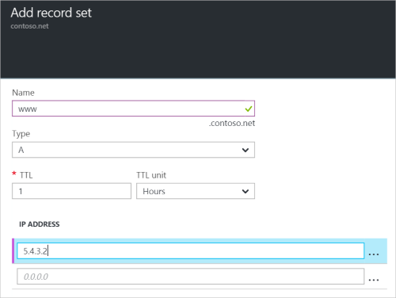

<properties
   pageTitle="Créer un jeu d’enregistrements et des enregistrements pour une Zone DNS à l’aide du portail Azure | Microsoft Azure"
   description="Comment créer des enregistrements d’hôte pour DNS Azure et créer des jeux d’enregistrements et des enregistrements à l’aide du portail Azure"
   services="dns"
   documentationCenter="na"
   authors="sdwheeler"
   manager="carmonm"
   editor=""
   tags="azure-resource-manager"/>

<tags
   ms.service="dns"
   ms.devlang="na"
   ms.topic="article"
   ms.tgt_pltfrm="na"
   ms.workload="infrastructure-services"
   ms.date="08/16/2016"
   ms.author="sewhee"/>

# Créer des enregistrements et des jeux d’enregistrements DNS à l’aide du portail Azure

> [AZURE.SELECTOR]
- [Portail Azure](dns-getstarted-create-recordset-portal.md)
- [PowerShell](dns-getstarted-create-recordset.md)
- [Azure infrastructure du langage commun](dns-getstarted-create-recordset-cli.md)

Cet article vous guide tout au long du processus de création des enregistrements et des jeux d’enregistrements à l’aide du portail Azure. Après avoir créé votre zone DNS, vous ajoutez les enregistrements DNS pour votre domaine. Pour ce faire, vous devez tout d’abord comprendre les enregistrements DNS et des jeux d’enregistrements.

[AZURE.INCLUDE [dns-about-records-include](../../includes/dns-about-records-include.md)]

## Créer un jeu d’enregistrements et enregistrement

L’exemple suivant vous guide tout au long du processus de création d’un jeu d’enregistrements et un enregistrement à l’aide du portail Azure. Nous allons utiliser le type d’enregistrement DNS « A ».

1. Connectez-vous au portail.

2. Accédez à la carte de **zone DNS** dans laquelle vous voulez créer un jeu d’enregistrements.

3. En haut de la cuillère de **zone DNS** , sélectionnez le **jeu d’enregistrements** pour ouvrir la carte de **jeu d’enregistrements d’ajouter** .

    

4. Sur la carte **jeu d’enregistrements ajouter** , nommez votre jeu d’enregistrements. Par exemple, vous pouvez nommer votre jeu d’enregistrements «**www**».

    

5. Sélectionnez le type d’enregistrement que vous voulez créer. Par exemple, sélectionnez **A**.

6. Définir la **durée de vie**. La durée de vie dans le portail défaut est d’une heure.

7. Ajoutez les adresses IP, une adresse IP par ligne. Lorsque vous utilisez le nom du jeu d’enregistrements suggéré et le type d’enregistrement décrites précédemment, vous ajoutez les adresses IP IPv4 vers l’enregistrement **A** pour le jeu d’enregistrements www.

8. Une fois que vous avez terminé d’ajouter des adresses IP, sélectionnez **OK** en bas de la carte. Le jeu d’enregistrements DNS est créé.

## Étapes suivantes

Pour gérer votre jeu d’enregistrements et les enregistrements, voir [enregistrements DNS gérer et enregistrement définit à l’aide du portail Azure](dns-operations-recordsets-portal.md).

Pour plus d’informations sur le système DNS Azure, consultez la [vue d’ensemble de DNS Azure](dns-overview.md).
