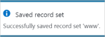
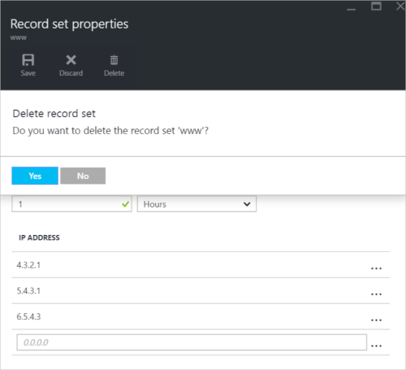

<properties
   pageTitle="Gérer des jeux d’enregistrements DNS et des enregistrements à l’aide du portail Azure | Microsoft Azure"
   description="Enregistrement gestion du système DNS définit et enregistrements lors de l’hébergement de votre domaine sur Azure DNS."
   services="dns"
   documentationCenter="na"
   authors="sdwheeler"
   manager="carmonm"
   editor=""
   tags="azure-resource-manager"/>

<tags
   ms.service="dns"
   ms.devlang="na"
   ms.topic="article"
   ms.tgt_pltfrm="na"
   ms.workload="infrastructure-services"
   ms.date="08/16/2016"
   ms.author="sewhee"/>

# Gérer les enregistrements DNS et jeux d’enregistrement à l’aide du portail Azure

> [AZURE.SELECTOR]
- [Portail Azure](dns-operations-recordsets-portal.md)
- [Azure infrastructure du langage commun](dns-operations-recordsets-cli.md)
- [PowerShell](dns-operations-recordsets.md)

Cet article vous explique comment gérer les ensembles d’enregistrements et des enregistrements pour votre zone DNS à l’aide du portail Azure.

Il est important de comprendre la différence entre les jeux d’enregistrements DNS et des enregistrements DNS. Un jeu d’enregistrements est un ensemble d’enregistrements dans une zone qui ont le même nom et sont du même type. Pour plus d’informations, voir [jeux d’enregistrements DNS créer et enregistrements à l’aide du portail Azure](dns-getstarted-create-recordset-portal.md).

## Créer un nouveau jeu d’enregistrements et enregistrement

Pour créer un jeu dans le portail Azure d’enregistrements, voir [créer des enregistrements DNS à l’aide du portail Azure](dns-getstarted-create-recordset-portal.md).

## Afficher un jeu d’enregistrements

1. Dans le portail Azure, accédez à la carte de **zone DNS** .

2. Recherchez le jeu d’enregistrements et sélectionnez-le. Cette action ouvre les propriétés du jeu d’enregistrements.

    

## Ajouter un enregistrement à un jeu d’enregistrements

Vous pouvez ajouter jusqu'à 20 enregistrements à n’importe quel jeu d’enregistrements. Un jeu d’enregistrements ne peut pas contenir deux enregistrements identiques. Jeux d’enregistrements vide (avec zéro records) peut être créée, mais n’apparaisse pas sur les serveurs de noms DNS Azure. Jeux d’enregistrements de type CNAME peut contenir un enregistrement au maximum.

1. Dans la carte **enregistrement définie les propriétés** pour votre zone DNS, cliquez sur le jeu d’enregistrements que vous souhaitez ajouter un enregistrement à.

    

2. Spécifier que l’enregistrement de définie les propriétés en renseignant les champs.

    

2. Cliquez sur **Enregistrer** dans la partie supérieure de la cuillère pour enregistrer vos paramètres. Fermez puis la carte.

3. Dans le coin, vous verrez l’enregistrement de l’enregistrement.

    

Une fois que l’enregistrement a été enregistré, les valeurs de la carte de **zone DNS** refléteront du nouvel enregistrement.

## Mettre à jour un enregistrement

Lorsque vous mettez à jour un enregistrement dans un jeu d’enregistrements existant, les champs que vous pouvez mettre à jour dépendent du type d’enregistrement avec lequel vous travaillez.

1. Sur la carte **enregistrement définie les propriétés** pour votre jeu d’enregistrements, recherchez l’enregistrement.

2. Modifier l’enregistrement. Lorsque vous modifiez un enregistrement, vous pouvez modifier les paramètres disponibles pour l’enregistrement. Dans l’exemple suivant, le champ **adresse IP** est sélectionné et l’adresse IP travaille actuellement en cours de modification.

    

3. Cliquez sur **Enregistrer** dans la partie supérieure de la cuillère pour enregistrer vos paramètres. Dans le coin supérieur droit, vous verrez la notification indiquant que l’enregistrement a été enregistré.

    

Une fois que l’enregistrement a été enregistré, les valeurs de l’ensemble sur la carte de **zone DNS** des enregistrements refléteront l’enregistrement mis à jour.

## Supprimer un enregistrement d’un jeu d’enregistrements

Vous pouvez utiliser le portail Azure pour supprimer les enregistrements à partir d’un jeu d’enregistrements. Notez que la suppression du dernier enregistrement d’un jeu d’enregistrements ne supprime pas le jeu d’enregistrements.

1. Sur la carte **enregistrement définie les propriétés** pour votre jeu d’enregistrements, recherchez l’enregistrement.

2. Cliquez sur l’enregistrement que vous voulez supprimer. Puis sélectionnez **Supprimer**.

    

3. Cliquez sur **Enregistrer** dans la partie supérieure de la cuillère pour enregistrer vos paramètres.

3. Une fois que l’enregistrement a été supprimé, les valeurs de l’enregistrement sur la carte de **zone DNS** refléteront la suppression.

## Supprimer un jeu d’enregistrements

1. Dans l' **enregistrement de définie les propriétés de** carte pour votre enregistrement définir, puis sur **Supprimer**.

    

2. Un message s’affiche et vous demande si vous souhaitez supprimer le jeu d’enregistrements.

3. Vérifiez que le nom correspond le jeu d’enregistrements que vous voulez supprimer, puis cliquez sur **Oui**.

4. Dans la carte de **zone DNS** , vérifiez que le jeu d’enregistrements n’est plus visible.

## Utiliser les enregistrements NS et SOA

Enregistrements NS et SOA qui sont automatiquement créés sont gérées différemment à partir d’autres types d’enregistrements.

### Modifier les enregistrements SOA

Vous ne pouvez pas ajouter ou supprimer des enregistrements à partir de l’ensemble au sommet zone des enregistrements SOA créées automatiquement (nom = "@"). Toutefois, vous pouvez modifier les paramètres dans l’enregistrement SOA (à l’exception de « hôte ») et l’enregistrement de la valeur TTL.

### Modifier les enregistrements de serveur de noms au sommet zone

Vous ne pouvez pas ajouter, pour supprimer ou modifier les enregistrements dans l’ensemble au sommet zone des enregistrements NS créés automatiquement (nom = "@"). La seule modification est autorisée consiste à modifier le jeu d’enregistrements TTL.

### Supprimer des jeux d’enregistrements SOA ou serveur de noms

Vous ne pouvez pas supprimer l’architecture orientée services et jeux d’enregistrement NS au sommet zone (nom = "@") qui sont créés automatiquement lorsque la zone est créée. Ils sont automatiquement supprimés lorsque vous supprimez la zone.

## Étapes suivantes

-   Pour plus d’informations sur le système DNS Azure, consultez la [vue d’ensemble de DNS Azure](dns-overview.md).
-   Pour plus d’informations sur l’automatisation DNS, voir [zones DNS création et enregistrement jeux en utilisant le Kit de développement .NET](dns-sdk.md).
-   Pour plus d’informations sur les enregistrements DNS inverses, voir [comment gérer les enregistrements DNS inverses pour vos services à l’aide de PowerShell](dns-reverse-dns-record-operations-ps.md).
