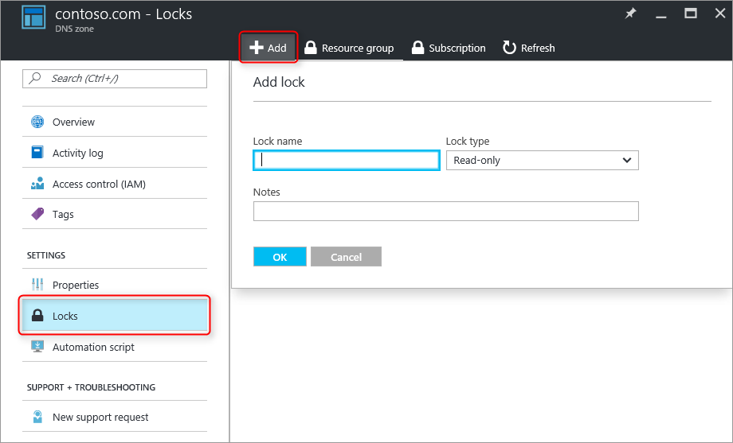

<properties 
   pageTitle="Protection des Zones DNS et des enregistrements | Microsoft Azure" 
   description="Découvrez comment protéger des zones DNS et des jeux d’enregistrements dans le système DNS de Microsoft Azure." 
   services="dns" 
   documentationCenter="na" 
   authors="jtuliani" 
   manager="carmonm" 
   editor=""/>

<tags
   ms.service="dns"
   ms.devlang="na"
   ms.topic="article"
   ms.tgt_pltfrm="na"
   ms.workload="infrastructure-services" 
   ms.date="10/20/2016"
   ms.author="jtuliani"/>

# Comment faire pour protéger des enregistrements et des zones DNS

Enregistrements et zones DNS sont des ressources critiques. Suppression d’une zone DNS ou simplement un seul enregistrement DNS peut entraîner une interruption de service total.  Il est donc important que des zones DNS et des enregistrements critiques sont protégées contre les modifications accidentelles ou non autorisées.

Cet article explique comment Azure DNS vous permet de protéger vos zones DNS et enregistrements basés sur ces modifications.  Nous appliquer deux fonctions de sécurité puissantes fournies par le Gestionnaire de ressources Azure : [contrôle d’accès basée sur les rôles](../active-directory/role-based-access-control-what-is.md) et les [verrous des ressources](../resource-group-lock-resources.md).

## Contrôle d’accès basé sur un rôle

Azure contrôle d’accès basé sur un rôle (RBAC) permet de gestion des permissions accès pour les utilisateurs Azure, des groupes et des ressources. L’utilisation de RBAC, vous pouvez accorder précisément la quantité d’accès que les utilisateurs ont besoin pour effectuer leur travail. Pour plus d’informations sur la façon dont RBAC vous permet de gérer l’accès, voir [Nouveautés de contrôle d’accès basé sur un rôle](../active-directory/role-based-access-control-what-is.md).

### Le rôle de « DNS Zone collaborateur »

Le rôle de « DNS Zone collaborateur » est un rôle intégré fourni par Azure pour la gestion des ressources DNS.  Attribution d’autorisations collaborateur de Zone DNS à un utilisateur ou groupe permet de ce groupe Gérer les ressources DNS, mais pas les ressources d’un autre type.

Par exemple, supposons que le groupe de ressources 'myzones' contient cinq zones pour Contoso Corporation. Accorder des autorisations de « DNS Zone collaboration » pour ce groupe de ressources de l’administrateur DNS, permet de contrôle total sur ces zones DNS. Il évite également accorder des autorisations inutiles, par exemple l’administrateur DNS ne peut pas créer ou arrêter Machines virtuelles.

Le moyen le plus simple d’attribuer des autorisations RBAC est [via le portail Azure](../active-directory/role-based-access-control-configure.md).  Ouvrir la carte '' contrôle d’accès (IAM) pour le groupe de ressources, puis cliquez sur « Ajouter », puis sélectionnez le rôle de « DNS Zone collaborateur » et les utilisateurs requis ou les groupes pour accorder des autorisations.

Autorisations peuvent également être [accordée à l’aide de PowerShell Azure](../active-directory/role-based-access-control-manage-access-powershell.md):

    # Grant 'DNS Zone Contributor' permissions to all zones in a resource group
    New-AzureRmRoleAssignment -SignInName <user email address> -RoleDefinitionName "DNS Zone Contributor" -ResourceGroupName <resource group name>

La commande équivalente est également [disponible via l’infrastructure du langage commun Azure](../active-directory/role-based-access-control-manage-access-azure-cli.md):

    # Grant 'DNS Zone Contributor' permissions to all zones in a resource group
    azure role assignment create --signInName  <user email address> --roleName "DNS Zone Contributor" --resourceGroup <resource group name>

### Niveau de zone RBAC

Azure RBAC règles peuvent être appliquées à un abonnement, un groupe de ressources ou à une ressource individuelle. Dans le cas d’Azure DNS, cette ressource peut être une zone DNS individuelle, ou encore un jeu d’enregistrements individuel.

Par exemple, supposons que le groupe de ressources 'myzones' contient la zone contoso.com et sous-zone « customers.contoso.com » dans lequel les enregistrements CNAME sont créés pour chaque compte client.  Le compte utilisé pour gérer ces enregistrements CNAME doit avoir les autorisations pour créer des enregistrements dans la zone « customers.contoso.com » uniquement, il ne doit pas avoir accès aux autres zones.

Niveau de zone RBAC autorisations peut être accordé via le portail Azure.  Ouvrir la carte '' contrôle d’accès (IAM) pour la zone, puis cliquez sur « Ajouter », puis sélectionnez le rôle de « DNS Zone collaborateur » et les utilisateurs requis ou les groupes pour accorder des autorisations.

Autorisations peuvent également être [accordée à l’aide de PowerShell Azure](../active-directory/role-based-access-control-manage-access-powershell.md):

    # Grant 'DNS Zone Contributor' permissions to a specific zone
    New-AzureRmRoleAssignment -SignInName <user email address> -RoleDefinitionName "DNS Zone Contributor" -ResourceGroupName <resource group name> -ResourceName <zone name> -ResourceType Microsoft.Network/DNSZones

La commande équivalente est également [disponible via l’infrastructure du langage commun Azure](../active-directory/role-based-access-control-manage-access-azure-cli.md):

    # Grant 'DNS Zone Contributor' permissions to a specific zone
    azure role assignment create --signInName <user email address> --roleName "DNS Zone Contributor" --resource-name <zone name> --resource-type Microsoft.Network/DNSZones --resource-group <resource group name>

### Jeu d’enregistrements de niveau RBAC

Nous pouvons aller plus loin. Pensez à l’administrateur de messagerie pour Contoso Corporation, qui a besoin d’accéder aux enregistrements MX et TXT au sommet de la zone « contoso.com ».  Elle ne doit pas accès à tous les autres enregistrements MX ou TXT, ou à tous les enregistrements d’un autre type.  DNS Azure permet d’attribuer des autorisations au niveau du jeu d’enregistrements, à précisément les enregistrements que l’administrateur de messagerie a besoin d’accéder à.  L’administrateur de messagerie est accordé précisément le contrôle elle doit et ne peut pas apporter d’autres modifications.
  
Autorisations RBAC au niveau de jeu d’enregistrements peuvent être configurées via le portail Azure, à l’aide du bouton « Utilisateurs » dans la carte de jeu d’enregistrements :

Autorisations RBAC au niveau de jeu d’enregistrements peuvent également être [accordée à l’aide de PowerShell Azure](../active-directory/role-based-access-control-manage-access-powershell.md):

    # Grant permissions to a specific record set
    New-AzureRmRoleAssignment -SignInName <user email address> -RoleDefinitionName "DNS Zone Contributor" -Scope "/subscriptions/<subscription id>/resourceGroups/<resource group name>/providers/Microsoft.Network/dnszones/<zone name>/<record type>/<record name>" 

La commande équivalente est également [disponible via l’infrastructure du langage commun Azure](../active-directory/role-based-access-control-manage-access-azure-cli.md):

    # Grant permissions to a specific record set
    azure role assignment create --signInName <user email address> --roleName "DNS Zone Contributor" --scope "/subscriptions/<subscription id>/resourceGroups/<resource group name>/providers/Microsoft.Network/dnszones/<zone name>/<record type>/<record name>"

### Rôles personnalisés

Le rôle « DNS Zone collaboration » intégré permet de contrôle total sur une ressource DNS. Il est également possible de créer votre propre client Azure rôles, pour fournir un contrôle même fine.

Reprenons l’exemple dans lequel un enregistrement CNAME dans la zone « customers.contoso.com » est créé pour chaque compte client Contoso Corporation.  Le compte utilisé pour gérer ces enregistrements CNAME doit être autorisé à gérer les enregistrements CNAME uniquement.  Il est alors impossible de modifier les enregistrements d’autres types (par exemple, la modification des enregistrements MX) ou d’effectuer les opérations de niveau de zone telles que la suppression de la zone.

L’exemple suivant montre une définition de rôle personnalisée pour la gestion des enregistrements CNAME uniquement :

    {
        "Name": "DNS CNAME Contributor",
        "Id": "",
        "IsCustom": true,
        "Description": "Can manage DNS CNAME records only.",
        "Actions": [
            "Microsoft.Network/dnsZones/CNAME/*",
            "Microsoft.Network/dnsZones/read",
            "Microsoft.Authorization/*/read",
            "Microsoft.Insights/alertRules/*",
            "Microsoft.ResourceHealth/availabilityStatuses/read",
            "Microsoft.Resources/deployments/*",
            "Microsoft.Resources/subscriptions/resourceGroups/read",
            "Microsoft.Support/*"
        ],
        "NotActions": [
        ],
        "AssignableScopes": [
            "/subscriptions/ c276fc76-9cd4-44c9-99a7-4fd71546436e"
        ]
    }

La propriété Actions définit les autorisations spécifiques à DNS suivantes :

- `Microsoft.Network/dnsZones/CNAME/*`accorde un contrôle total sur les enregistrements CNAME
- `Microsoft.Network/dnsZones/read`accorde l’autorisation pour lire les zones DNS, mais ne pas à les modifier, ce qui vous permet d’afficher la zone dans laquelle l’enregistrement CNAME est créée.

Les Actions restantes sont copiées depuis le [rôle intégré de collaboration de Zone DNS](../active-directory/role-based-access-built-in-roles.md#dns-zone-contributor).

>[AZURE.NOTE] À l’aide d’un rôle RBAC personnalisé pour empêcher la suppression de jeux d’enregistrements pendant que toujours leur permettant de mettre à jour n’est pas un contrôle efficace. Il empêche ensembles d’enregistrements d’être supprimé, mais il n’empêche pas les contre la modification.  Modifications autorisées incluent Ajout et suppression des enregistrements dans le jeu d’enregistrements, notamment supprimer tous les enregistrements pour transmettre un jeu d’enregistrements « empty ». Cela a le même effet que la suppression de l’ensemble d’un point de vue de résolution DNS des enregistrements.

Les définitions de rôle personnalisé ne peut pas actuellement être définies via le portail Azure. Un rôle personnalisé en fonction de cette définition de rôle peut être créé à l’aide de PowerShell Azure :

    # Create new role definition based on input file
    New-AzureRmRoleDefinition -InputFile <file path>

Il peut également être créé via l’infrastructure du langage commun Azure :

    # Create new role definition based on input file
    azure role create –inputfile <file path>

Le rôle peut ensuite être attribué dans la même façon que les rôles intégrés, comme décrit plus haut dans cet article.

Pour plus d’informations sur la façon de créer, gérer et affecter des rôles personnalisés, voir [Rôles personnalisés dans Azure RBAC](../active-directory/role-based-access-control-custom-roles.md).

## Verrouillages des ressources

Outre RBAC, le Gestionnaire de ressources Azure prend en charge un autre type de contrôle de sécurité, à savoir la possibilité de ressources 'lock'. Où les règles RBAC permettent de contrôler les actions des utilisateurs et groupes spécifiques, verrouillages des ressources sont appliquées à la ressource et sont effectives sur tous les utilisateurs et les rôles. Pour plus d’informations, consultez [ressources de verrouillage avec le Gestionnaire de ressources Azure](../resource-group-lock-resources.md).

Il existe deux types de verrouillage de la ressource : **DoNotDelete** et **en lecture seule**. Ils peuvent être appliqués à une zone DNS, ou à un jeu d’enregistrements individuel.  Les sections suivantes décrivent plusieurs scénarios courants et comment les prennent en charge à l’aide de verrouillages des ressources.

### Protection contre les modifications

Pour empêcher toute modification apportée, appliquer un verrou en lecture seule à la zone.  Cela empêche nouveaux jeux d’enregistrements de jeux d’enregistrements créés et existants soient modifiés ou supprimés.

Verrouillages des ressources au niveau de zone peuvent être créés via le portail Azure.  À partir de la carte de zone DNS, cliquez sur « Verrous », puis « ajouter » :

Niveau de zone ressource verrous peuvent également être créés via PowerShell Azure :

    # Lock a DNS zone
    New-AzureRmResourceLock -LockLevel <lock level> -LockName <lock name> -ResourceName <zone name> -ResourceType Microsoft.Network/DNSZones -ResourceGroupName <resource group name> 

Configuration des verrouillages des ressources Azure n’est pas actuellement pris en charge via l’infrastructure du langage commun Azure.

### Protection des enregistrements individuels
Pour empêcher un enregistrement DNS existant définir contre les modifications, appliquez un verrou en lecture seule pour le jeu d’enregistrements.

>[AZURE.NOTE] Appliquer un verrou DoNotDelete à un jeu d’enregistrements n’est pas un contrôle efficace. Il empêche l’ensemble d’être supprimé des enregistrements, mais elle ne l’empêche pas d’en cours de modification.  Modifications autorisées incluent Ajout et suppression des enregistrements dans le jeu d’enregistrements, notamment supprimer tous les enregistrements pour transmettre un jeu d’enregistrements « empty ». Cela a le même effet que la suppression de l’ensemble d’un point de vue de résolution DNS des enregistrements.

Jeu d’enregistrements au niveau ressource verrous peuvent actuellement uniquement être configurés à l’aide de PowerShell Azure.  Ils ne sont pas pris en charge dans le portail Azure ou Azure infrastructure du langage commun.

    # Lock a DNS record set
    New-AzureRmResourceLock -LockLevel <lock level> -LockName <lock name> -ResourceName <zone name>/<record set name> -ResourceType Microsoft.Network/DNSZones/<record type> -ResourceGroupName <resource group name> 

### Protection contre la suppression de zone

Lorsqu’une zone est supprimée dans le système DNS Azure, tous les jeux d’enregistrements dans la zone sont également supprimés.  Cette opération ne peut pas être annulée.  Suppression accidentelle d’une zone critique est susceptible d’avoir un impact sur l’activité significative.  Il est donc très important pour vous protéger contre la suppression de zone accidentel.

Application d’un verrou DoNotDelete à une zone empêche la zone d’être supprimé.  Toutefois, étant donné que les verrous sont héritées par des ressources enfant, elle empêche également les jeux d’enregistrements dans la zone d’être supprimé, laquelle peut être indésirable.  En outre, comme décrit dans la Remarque ci-dessus, il est également inefficace dans la mesure où les enregistrements peuvent toujours être supprimés des jeux d’enregistrements existants.

Comme alternative, envisagez d’appliquer un verrou DoNotDelete à un enregistrement défini dans la zone, tels que le jeu d’enregistrements SOA.  Étant donné que la zone ne peut pas être supprimée sans supprimer également les jeux d’enregistrements, cette option empêche la suppression de zone, tout en permettant aux jeux d’enregistrements dans la zone à modifier librement. Si tenté de supprimer la zone, le Gestionnaire de ressources Azure détecte cette aurait également supprimer le jeu d’enregistrements SOA et bloque l’appel, car l’architecture orientée services est verrouillée.  Aucun jeux d’enregistrements n’est supprimés.

La commande PowerShell suivante crée un verrou DoNotDelete par rapport à l’enregistrement SOA de la zone donnée :

    # Protect against zone delete with DoNotDelete lock on the record set
    New-AzureRmResourceLock -LockLevel DoNotDelete -LockName <lock name> -ResourceName <zone name>/@ -ResourceType Microsoft.Network/DNSZones/SOA -ResourceGroupName <resource group name> 

Autre procédure pour éviter toute suppression accidentelle zone est à l’aide d’un rôle personnalisé afin de l’opérateur et comptes de service permet de gérer vos zones n’ont pas de supprimer les autorisations de zone. Lorsque vous n’avez pas besoin de supprimer une zone, vous pouvez appliquer une suppression en deux étapes, première qui accorde zone Supprimer les autorisations (en l’étendue de la zone, afin d’empêcher la suppression d’une zone de) et secondes pour supprimer la zone.

Cette deuxième approche a l’avantage qu’il fonctionne pour toutes les zones accessibles par ces comptes, sans avoir à vous souvenir créer les verrous. Il présente les inconvénients que tous les comptes avec les autorisations de supprimer la zone, tels que le propriétaire de l’abonnement, peuvent toujours accidentellement supprimer une zone critique.

Il est possible d’utiliser les deux approches - verrouillages des ressources et des rôles personnalisés - en même temps, comme une approche de défense en profondeur pour la protection de zone DNS.

## Étapes suivantes

- Pour plus d’informations sur l’utilisation de RBAC, voir [prise en main la gestion des accès dans le portail Azure](../active-directory/role-based-access-control-what-is.md). 
- Pour plus d’informations sur l’utilisation des verrouillages des ressources, consultez [ressources de verrouillage avec le Gestionnaire de ressources Azure](../resource-group-lock-resources.md).
- Pour plus d’informations sur la sécurisation de vos ressources Azure, consultez [Considérations relatives à la sécurité pour le Gestionnaire de ressources Azure](../best-practices-resource-manager-security.md).
