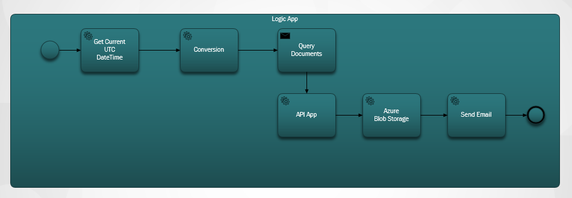
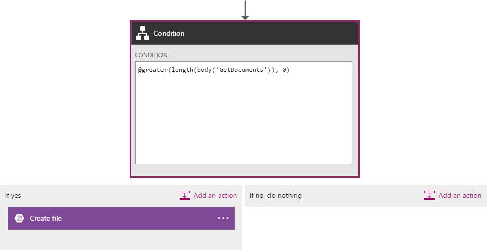
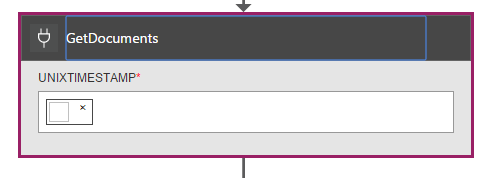
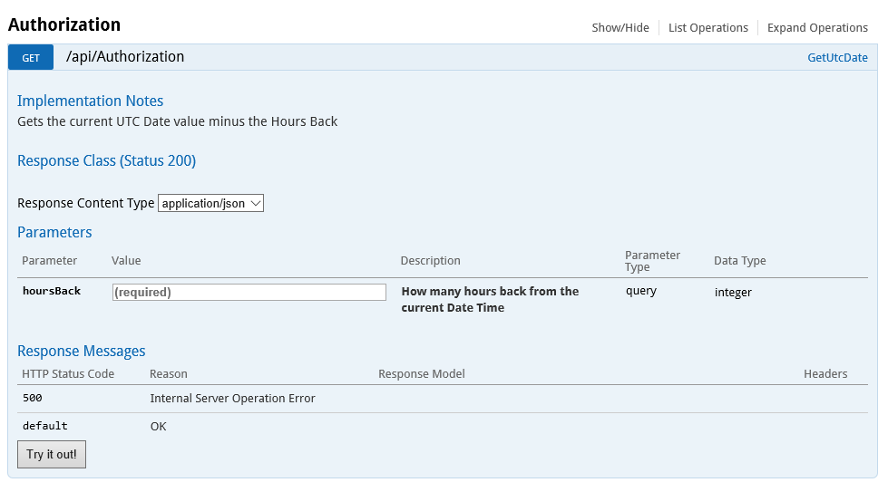
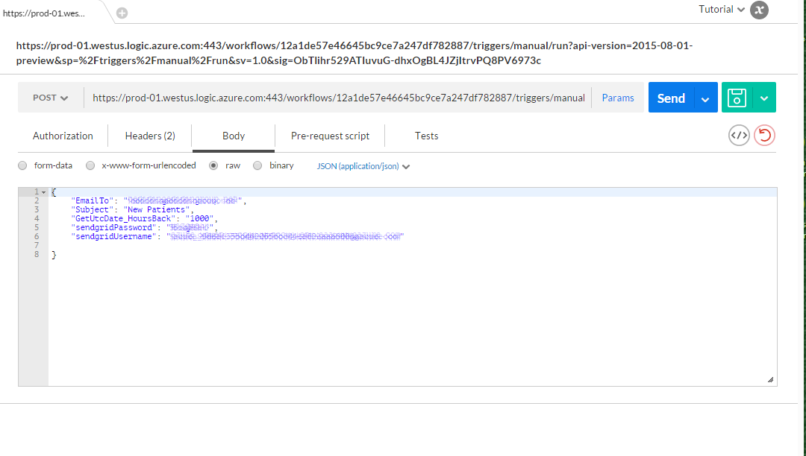
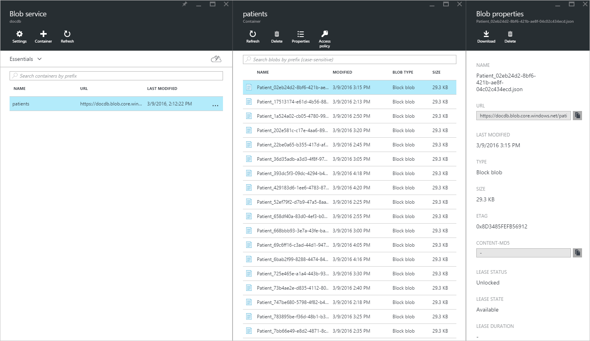

<properties 
    pageTitle="DocumentDB modifier les notifications d’utilisation des applications logique | Microsoft Azure" 
    description="." 
    keywords="notification de modification"
    services="documentdb" 
    authors="hedidin" 
    manager="jhubbard" 
    editor="mimig" 
    documentationCenter=""/>

<tags 
    ms.service="documentdb" 
    ms.workload="data-services" 
    ms.tgt_pltfrm="na" 
    ms.devlang="rest-api" 
    ms.topic="article" 
    ms.date="09/23/2016" 
    ms.author="b-hoedid"/>

# <a name="notifications-for-new-or-changed-documentdb-resources-using-logic-apps"></a>Notifications pour les ressources DocumentDB nouvelles ou modifiées à l’aide de la logique d’applications

Cet article a été développé à partir d’une question que j’ai vu un des forums de la Communauté DocumentDB Azure publié. La question a été **DocumentDB signifie prend en charge les notifications pour les ressources modifiées**?

J’ai travaillé avec BizTalk Server des années, et il s’agit d’un scénario très courant lors de l’utilisation de la [Carte de département WCF](https://msdn.microsoft.com/library/bb798128.aspx). J’ai donc décidé voir si je peux dupliquer cette fonctionnalité dans DocumentDB pour les documents nouvelles / modifiées.

Cet article fournit une vue d’ensemble des composants de la solution de notification de modification, qui inclut un [déclencheur](documentdb-programming.md#trigger) et une [Logique de l’application](../app-service-logic/app-service-logic-what-are-logic-apps.md). Important extraits de code sont fournis en ligne et la solution entière est disponible sous [GitHub](https://github.com/HEDIDIN/DocDbNotifications).

## <a name="use-case"></a>Cas d’utilisation

L’article suivant est le cas d’utilisation de cet article.

DocumentDB est le référentiel de documents santé niveau sept International (HL7) rapidement la santé interopérabilité ressources (FHIR). Supposons que votre base de données DocumentDB combiné avec votre API et logique App constituent un serveur FHIR HL7.  Un établissement de santé est le stockage de données patients dans la DocumentDB base de données « Patients ». Il existe plusieurs collections au sein de la base de données patients ; Clinique, Identification, etc. Informations sur les patients tombent sous identification.  Vous disposez d’une collection nommée « Patients ».

Le service cardiologie effectue le suivi des données personnelles de l’intégrité et d’exercice. Recherche d’enregistrements patients nouvellement créés ou modifiés prend beaucoup de temps. Ils invité le service informatique si il y a un moyen que qu’ils peuvent recevoir une notification pour patients nouvellement créés ou modifiés.  

Le service informatique dit que qu’ils pourraient facilement fournir ce. Ils dit également qu’ils pourraient transmission les documents à [Azure Blob Storage](https://azure.microsoft.com/services/storage/) afin que le service cardiologie peut y accéder facilement.

## <a name="how-the-it-department-solved-the-problem"></a>Comment le service informatique résolu le problème

Afin de créer cette application, le service informatique a décidé de modéliser tout d’abord.  Agréable à l’aide du modèle de processus métier et Notation (BPMN) est que les personnes techniques et non techniques peuvent être compris facilement il. Ce processus notification entière est considéré comme un processus d’entreprise. 

## <a name="high-level-view-of-notification-process"></a>Vue d’ensemble du processus de notification

1. Vous commencez avec une application logique qui comporte un déclencheur minuteur. Par défaut, le déclencheur s’exécute chaque heure.
2. Ensuite vous effectuez une publication HTTP à l’application logique.
3. L’application logique effectue tout le travail.


### <a name="lets-take-a-look-at-what-this-logic-app-does"></a>Examinons à présent que signifie cette application logique
Si vous observez l’illustration suivante il existe plusieurs étapes dans le flux de travail LogicApp.



La procédure est la suivante :

1. Vous devez obtenir la date/heure au format UTC actuelle à partir d’une application API.  La valeur par défaut est une heure précédente.

2. La date/heure au format UTC est convertie en un format Unix horodatage. Il s’agit le format par défaut pour les horodatages dans DocumentDB.

3. Que vous publiez la valeur sur une application API, qui effectue une DocumentDB requête. La valeur est utilisée dans une requête.

    ```SQL
        SELECT * FROM Patients p WHERE (p._ts >= @unixTimeStamp)
    ```

    > [AZURE.NOTE] Le DTS représente les métadonnées d’horodatage pour toutes les ressources DocumentDB.

4. S’il existe des documents trouvés, le corps de réponse est envoyé à votre stockage d’objets Blob Azure.

    > [AZURE.NOTE] Stockage d’objets BLOB requiert un compte de stockage Azure. Vous devez configurer un compte de stockage Blob Azure et ajouter un nouveau Blob nommé patients. Pour plus d’informations, voir [comptes de stockage sur Azure](../storage/storage-create-storage-account.md) et [prise en main stockage d’objets Blob Azure](../storage/storage-dotnet-how-to-use-blobs.md).

5. Enfin, un message électronique est envoyé qui vous avertit le destinataire du nombre de documents trouvés. Si aucun document n’est détectés, le corps du message électronique est « 0 Documents trouvé ». 

Maintenant que vous avez une idée de ce que le flux de travail fait, examinons une façon de l’implémenter.

### <a name="lets-start-with-the-main-logic-app"></a>Commençons par l’application logique principale

Si vous ne connaissez pas logique d’applications, qu’elles sont disponibles sur le [Azure Marketplace](https://portal.azure.com/)et vous pouvez en savoir plus sur les [que sont les applications logique ?](../app-service-logic/app-service-logic-what-are-logic-apps.md)

Lorsque vous créez une nouvelle application logique, vous êtes invité **Comment souhaitez-vous démarrer ?**

Lorsque vous cliquez à l’intérieur de la zone de texte, vous avez le choix d’événements. Pour cette application logique, sélectionnez **manuel - demande HTTP un lors de la réception** , comme illustré ci-dessous.


### <a name="design-view-of-your-completed-logic-app"></a>Mode Création de votre application logique terminé
Nous allons passer directement et examinons la vue programme de conception pour l’application logique, qui est nommé DocDB.


Lorsque vous modifiez les actions dans le Concepteur d’application logique, vous avez la possibilité de sélectionner **des sorties** à partir de la requête HTTP ou de l’action précédente comme indiqué dans l’action d’envoi de courrier ci-dessous.


Avant de chaque action dans votre flux de travail, vous pouvez prendre une décision ; **Ajouter une action** ou **Ajouter une condition** comme indiqué dans l’illustration suivante.


Si vous sélectionnez **Ajouter une condition**, vous sont présentées avec un formulaire, comme indiqué dans l’illustration suivante, pour entrer votre logique.  Il s’agit en gros, une règle d’entreprise.  Si vous avez cliqué dans un champ, vous avez la possibilité de sélection des paramètres de l’action précédente. Vous pouvez également entrer directement les valeurs.



> [AZURE.NOTE] Vous avez également la possibilité d’entrez toutes les informations en mode Code.

Examinons l’application logique achevée en mode code.  

```JSON
   
    "$schema": "https://schema.management.azure.com/providers/Microsoft.Logic/schemas/2015-08-01-preview/workflowdefinition.json#",
    "actions": {
        "Conversion": {
            "conditions": [
                {
                    "dependsOn": "GetUtcDate"
                }
            ],
            "inputs": {
                "method": "post",
                "queries": {
                    "currentdateTime": "@{body('GetUtcDate')}"
                },
                "uri": "https://docdbnotificationapi-debug.azurewebsites.net/api/Conversion"
            },
            "metadata": {
                "apiDefinitionUrl": "https://docdbnotificationapi-debug.azurewebsites.net/swagger/docs/v1",
                "swaggerSource": "custom"
            },
            "type": "Http"
        },
        "Createfile": {
            "conditions": [
                {
                    "expression": "@greater(length(body('GetDocuments')), 0)"
                },
                {
                    "dependsOn": "GetDocuments"
                }
            ],
            "inputs": {
                "body": "@body('GetDocuments')",
                "host": {
                    "api": {
                        "runtimeUrl": "https://logic-apis-westus.azure-apim.net/apim/azureblob"
                    },
                    "connection": {
                        "name": "@parameters('$connections')['azureblob']['connectionId']"
                    }
                },
                "method": "post",
                "path": "/datasets/default/files",
                "queries": {
                    "folderPath": "/patients",
                    "name": "Patient_@{guid()}.json"
                }
            },
            "type": "ApiConnection"
        },
        "GetDocuments": {
            "conditions": [
                {
                    "dependsOn": "Conversion"
                }
            ],
            "inputs": {
                "method": "post",
                "queries": {
                    "unixTimeStamp": "@body('Conversion')"
                },
                "uri": "https://docdbnotificationapi-debug.azurewebsites.net/api/Patient"
            },
            "metadata": {
                "apiDefinitionUrl": "https://docdbnotificationapi-debug.azurewebsites.net/swagger/docs/v1",
                "swaggerSource": "custom"
            },
            "type": "Http"
        },
        "GetUtcDate": {
            "conditions": [],
            "inputs": {
                "method": "get",
                "queries": {
                    "hoursBack": "@{int(triggerBody()['GetUtcDate_HoursBack'])}"
                },
                "uri": "https://docdbnotificationapi-debug.azurewebsites.net/api/Authorization"
            },
            "metadata": {
                "apiDefinitionUrl": "https://docdbnotificationapi-debug.azurewebsites.net/swagger/docs/v1",
                "swaggerSource": "custom"
            },
            "type": "Http"
        },
        "sendMail": {
            "conditions": [
                {
                    "dependsOn": "GetDocuments"
                }
            ],
            "inputs": {
                "body": "api_user=@{triggerBody()['sendgridUsername']}&api_key=@{triggerBody()['sendgridPassword']}&from=@{parameters('fromAddress')}&to=@{triggerBody()['EmailTo']}&subject=@{triggerBody()['Subject']}&text=@{int(length(body('GetDocuments')))} Documents Found",
                "headers": {
                    "Content-type": "application/x-www-form-urlencoded"
                },
                "method": "POST",
                "uri": "https://api.sendgrid.com/api/mail.send.json"
            },
            "type": "Http"
        }
    },
    "contentVersion": "1.0.0.0",
    "outputs": {
        "Results": {
            "type": "String",
            "value": "@{int(length(body('GetDocuments')))} Records Found"
        }
    },
    "parameters": {
        "$connections": {
            "defaultValue": {},
            "type": "Object"
        },
        "fromAddress": {
            "defaultValue": "user@msn.com",
            "type": "String"
        },
        "toAddress": {
            "defaultValue": "XXXXX@XXXXXXX.net",
            "type": "String"
        }
    },
    "triggers": {
        "manual": {
            "inputs": {
                "schema": {
                    "properties": {},
                    "required": [],
                    "type": "object"
                }
            },
            "type": "Manual"
        }
    
```

Si vous n’êtes pas familiarisé avec ce que représentent les différentes sections dans le code, vous pouvez afficher la documentation de [Langage de définition de flux de travail application logique](http://aka.ms/logicappsdocs) .

Pour ce flux de travail, vous utilisez un [Déclencheur de Webhook HTTP](https://sendgrid.com/blog/whats-webhook/). Si vous examinez le code ci-dessus, vous verrez les paramètres à l’exemple suivant.

```C#

    =@{triggerBody()['Subject']}

```

La `triggerBody()` représente les paramètres qui sont inclus dans le corps d’un billet reste à l’API REST d’application logique. La `()['Subject']` représente le champ. Toutes ces paramètres constituent le JSON mises en forme corps. 

> [AZURE.NOTE] En utilisant un crochet Web, vous pouvez avoir accès complet à l’en-tête et le corps de demande du déclencheur. Dans cette application que vous voulez que le corps.

Comme indiqué précédemment, vous pouvez utiliser le concepteur pour attribuer des paramètres ou le faire en mode code.
Si vous le faites en mode code, vous définissez les propriétés qui requièrent une valeur comme indiqué dans l’exemple suivant. 

```JSON

    "triggers": {
        "manual": {
            "inputs": {
            "schema": {
                "properties": {
            "Subject": {
                "type" : "String"   

            }
            },
                "required": [
            "Subject"
                 ],
                "type": "object"
            }
            },
            "type": "Manual"
        }
        }
```

Ce que vous faites consiste à créer un schéma JSON qui est passé dans à partir du corps du billet HTTP.
Pour déclencher votre déclencheur, vous avez besoin d’une URL de rappel.  Vous allez apprendre à générer plus loin dans le didacticiel.  

## <a name="actions"></a>Actions
Voyons que signifie chaque action dans notre application logique.

### <a name="getutcdate"></a>GetUTCDate

**Affichage Concepteur**


**Mode code**

```JSON

    "GetUtcDate": {
            "conditions": [],
            "inputs": {
            "method": "get",
            "queries": {
                "hoursBack": "@{int(triggerBody()['GetUtcDate_HoursBack'])}"
            },
            "uri": "https://docdbnotificationapi-debug.azurewebsites.net/api/Authorization"
            },
            "metadata": {
            "apiDefinitionUrl": "https://docdbnotificationapi-debug.azurewebsites.net/swagger/docs/v1"
            },
            "type": "Http"
        },

```

Cette action HTTP exécute une opération GET.  Il appelle la méthode de l’API application GetUtcDate. L’Uri utilise la propriété 'GetUtcDate_HoursBack' passée dans le corps du déclencheur.  La valeur « GetUtcDate_HoursBack » est définie dans l’application logique première. Vous allez apprendre plus sur l’application d’une logique de déclencheur plus loin dans le didacticiel.

Cette action appelle votre application API pour renvoyer la valeur de chaîne de Date UTC.

#### <a name="operations"></a>Opérations

**Demande**

```JSON

    {
        "uri": "https://docdbnotificationapi-debug.azurewebsites.net/api/Authorization",
        "method": "get",
        "queries": {
          "hoursBack": "24"
        }
    }

```

**Réponse**

```JSON

    {
        "statusCode": 200,
        "headers": {
          "pragma": "no-cache",
          "cache-Control": "no-cache",
          "date": "Fri, 26 Feb 2016 15:47:33 GMT",
          "server": "Microsoft-IIS/8.0",
          "x-AspNet-Version": "4.0.30319",
          "x-Powered-By": "ASP.NET"
        },
        "body": "Fri, 15 Jan 2016 23:47:33 GMT"
    }

```

L’étape suivante consiste pour convertir la valeur de date/heure au format UTC l’horodatage Unix, ce qui correspond à un type de double .NET.

### <a name="conversion"></a>Conversion

##### <a name="designer-view"></a>Affichage Concepteur


##### <a name="code-view"></a>Mode code

```JSON

    "Conversion": {
        "conditions": [
        {
            "dependsOn": "GetUtcDate"
        }
        ],
        "inputs": {
        "method": "post",
        "queries": {
            "currentDateTime": "@{body('GetUtcDate')}"
        },
        "uri": "https://docdbnotificationapi-debug.azurewebsites.net/api/Conversion"
        },
        "metadata": {
        "apiDefinitionUrl": "https://docdbnotificationapi-debug.azurewebsites.net/swagger/docs/v1"
        },
        "type": "Http"
    },

```

Dans cette étape vous passez la valeur renvoyée par la GetUTCDate.  Il existe une condition dependsOn, ce qui signifie que l’action GetUTCDate doit se terminer normalement. Dans le cas contraire, puis cette action est ignorée. 

Cette action appelle votre application API pour gérer la conversion.

#### <a name="operations"></a>Opérations

##### <a name="request"></a>Demande

```JSON

    {
        "uri": "https://docdbnotificationapi-debug.azurewebsites.net/api/Conversion",
        "method": "post",
        "queries": {
        "currentDateTime": "Fri, 15 Jan 2016 23:47:33 GMT"
        }
    }   
```

##### <a name="response"></a>Réponse

```JSON

    {
        "statusCode": 200,
        "headers": {
          "pragma": "no-cache",
          "cache-Control": "no-cache",
          "date": "Fri, 26 Feb 2016 15:47:33 GMT",
          "server": "Microsoft-IIS/8.0",
          "x-AspNet-Version": "4.0.30319",
          "x-Powered-By": "ASP.NET"
        },
        "body": 1452901653
    }
```

Dans l’action suivante, vous effectuez une opération de publication à notre application API.

### <a name="getdocuments"></a>GetDocuments 

##### <a name="designer-view"></a>Affichage Concepteur



##### <a name="code-view"></a>Mode code

```JSON

    "GetDocuments": {
        "conditions": [
        {
            "dependsOn": "Conversion"
        }
        ],
        "inputs": {
        "method": "post",
        "queries": {
            "unixTimeStamp": "@{body('Conversion')}"
        },
        "uri": "https://docdbnotificationapi-debug.azurewebsites.net/api/Patient"
        },
        "metadata": {
        "apiDefinitionUrl": "https://docdbnotificationapi-debug.azurewebsites.net/swagger/docs/v1"
        },
        "type": "Http"
    },

```

Pour l’action GetDocuments vous vous apprêtez à passer dans le corps de réponse à partir de l’action de Conversion. Il s’agit d’un paramètre dans l’Uri :

 
```C#

    unixTimeStamp=@{body('Conversion')}

```

L’action QueryDocuments effectue une opération de HTTP POST à l’API application. 

La méthode appelée est **QueryForNewPatientDocuments**.

#### <a name="operations"></a>Opérations

##### <a name="request"></a>Demande

```JSON

    {
        "uri": "https://docdbnotificationapi-debug.azurewebsites.net/api/Patient",
        "method": "post",
        "queries": {
        "unixTimeStamp": "1452901653"
        }
    }
```

##### <a name="response"></a>Réponse

```JSON

    {
        "statusCode": 200,
        "headers": {
        "pragma": "no-cache",
        "cache-Control": "no-cache",
        "date": "Fri, 26 Feb 2016 15:47:35 GMT",
        "server": "Microsoft-IIS/8.0",
        "x-AspNet-Version": "4.0.30319",
        "x-Powered-By": "ASP.NET"
        },
        "body": [
        {
            "id": "xcda",
            "_rid": "vCYLAP2k6gAXAAAAAAAAAA==",
            "_self": "dbs/vCYLAA==/colls/vCYLAP2k6gA=/docs/vCYLAP2k6gAXAAAAAAAAAA==/",
            "_ts": 1454874620,
            "_etag": "\"00007d01-0000-0000-0000-56b79ffc0000\"",
            "resourceType": "Patient",
            "text": {
            "status": "generated",
            "div": "<div>\n      \n      <p>Henry Levin the 7th</p>\n    \n    </div>"
            },
            "identifier": [
            {
                "use": "usual",
                "type": {
                "coding": [
                    {
                    "system": "http://hl7.org/fhir/v2/0203",
                    "code": "MR"
                    }
                ]
                },
                "system": "urn:oid:2.16.840.1.113883.19.5",
                "value": "12345"
            }
            ],
            "active": true,
            "name": [
            {
                    "family": [
                        "Levin"
                    ],
                    "given": [
                        "Henry"
                    ]
                }
            ],
            "gender": "male",
            "birthDate": "1932-09-24",
            "managingOrganization": {
                "reference": "Organization/2.16.840.1.113883.19.5",
                "display": "Good Health Clinic"
            }
        },

```

La prochaine action sera d’enregistrer les documents dans [un stockage Azure Blog](https://azure.microsoft.com/services/storage/). 

> [AZURE.NOTE] Stockage d’objets BLOB requiert un compte de stockage Azure. Vous devez configurer un compte de stockage Blob Azure et ajouter un nouveau Blob nommé patients. Pour plus d’informations, voir [prise en main stockage d’objets Blob Azure](../storage/storage-dotnet-how-to-use-blobs.md).

### <a name="create-file"></a>Créer le fichier

##### <a name="designer-view"></a>Affichage Concepteur


##### <a name="code-view"></a>Mode code

```JSON

    {
    "host": {
        "api": {
            "runtimeUrl": "https://logic-apis-westus.azure-apim.net/apim/azureblob"
        },
        "connection": {
            "name": "subscriptions/fxxxxxc079-4e5d-b002-xxxxxxxxxx/resourceGroups/Api-Default-Central-US/providers/Microsoft.Web/connections/azureblob"
        }
    },
    "method": "post",
    "path": "/datasets/default/files",
    "queries": {
        "folderPath": "/patients",
        "name": "Patient_17513174-e61d-4b56-88cb-5cf383db4430.json"
    },
    "body": [
        {
            "id": "xcda",
            "_rid": "vCYLAP2k6gAXAAAAAAAAAA==",
            "_self": "dbs/vCYLAA==/colls/vCYLAP2k6gA=/docs/vCYLAP2k6gAXAAAAAAAAAA==/",
            "_ts": 1454874620,
            "_etag": "\"00007d01-0000-0000-0000-56b79ffc0000\"",
            "resourceType": "Patient",
            "text": {
                "status": "generated",
                "div": "<div>\n      \n      <p>Henry Levin the 7th</p>\n    \n    </div>"
            },
            "identifier": [
                {
                    "use": "usual",
                    "type": {
                        "coding": [
                            {
                                "system": "http://hl7.org/fhir/v2/0203",
                                "code": "MR"
                            }
                        ]
                    },
                    "system": "urn:oid:2.16.840.1.113883.19.5",
                    "value": "12345"
                }
            ],
            "active": true,
            "name": [
                {
                    "family": [
                        "Levin"
                    ],
                    "given": [
                        "Henry"
                    ]
                }
            ],
            "gender": "male",
            "birthDate": "1932-09-24",
            "managingOrganization": {
                "reference": "Organization/2.16.840.1.113883.19.5",
                "display": "Good Health Clinic"
            }
        },

```

Le code est généré à partir d’action dans le concepteur. Vous n’êtes pas obligé de modifier le code.

Si vous n’êtes pas familiarisé avec à l’aide de l’API Blob Azure, voir [prise en main du stockage d’objets blob Azure API](../connectors/connectors-create-api-azureblobstorage.md).

#### <a name="operations"></a>Opérations

##### <a name="request"></a>Demande

```JSON

    "host": {
        "api": {
            "runtimeUrl": "https://logic-apis-westus.azure-apim.net/apim/azureblob"
        },
        "connection": {
            "name": "subscriptions/fxxxxxc079-4e5d-b002-xxxxxxxxxx/resourceGroups/Api-Default-Central-US/providers/Microsoft.Web/connections/azureblob"
        }
    },
    "method": "post",
    "path": "/datasets/default/files",
    "queries": {
        "folderPath": "/patients",
        "name": "Patient_17513174-e61d-4b56-88cb-5cf383db4430.json"
    },
    "body": [
        {
            "id": "xcda",
            "_rid": "vCYLAP2k6gAXAAAAAAAAAA==",
            "_self": "dbs/vCYLAA==/colls/vCYLAP2k6gA=/docs/vCYLAP2k6gAXAAAAAAAAAA==/",
            "_ts": 1454874620,
            "_etag": "\"00007d01-0000-0000-0000-56b79ffc0000\"",
            "resourceType": "Patient",
            "text": {
                "status": "generated",
                "div": "<div>\n      \n      <p>Henry Levin the 7th</p>\n    \n    </div>"
            },
            "identifier": [
                {
                    "use": "usual",
                    "type": {
                        "coding": [
                            {
                                "system": "http://hl7.org/fhir/v2/0203",
                                "code": "MR"
                            }
                        ]
                    },
                    "system": "urn:oid:2.16.840.1.113883.19.5",
                    "value": "12345"
                }
            ],
            "active": true,
            "name": [
                {
                    "family": [
                        "Levin"
                    ],
                    "given": [
                        "Henry"
                    ]
                }
            ],
            "gender": "male",
            "birthDate": "1932-09-24",
            "managingOrganization": {
                "reference": "Organization/2.16.840.1.113883.19.5",
                "display": "Good Health Clinic"
            }
        },….


```

##### <a name="response"></a>Réponse

```JSON

    {
        "statusCode": 200,
        "headers": {
        "pragma": "no-cache",
        "x-ms-request-id": "2b2f7c57-2623-4d71-8e53-45c26b30ea9d",
        "cache-Control": "no-cache",
        "date": "Fri, 26 Feb 2016 15:47:36 GMT",
        "set-Cookie": "ARRAffinity=29e552cea7db23196f7ffa644003eaaf39bc8eb6dd555511f669d13ab7424faf;Path=/;Domain=127.0.0.1",
        "server": "Microsoft-HTTPAPI/2.0",
        "x-AspNet-Version": "4.0.30319",
        "x-Powered-By": "ASP.NET"
        },
        "body": {
        "Id": "0B0nBzHyMV-_NRGRDcDNMSFAxWFE",
        "Name": "Patient_47a2a0dc-640d-4f01-be38-c74690d085cb.json",
        "DisplayName": "Patient_47a2a0dc-640d-4f01-be38-c74690d085cb.json",
        "Path": "/Patient/Patient_47a2a0dc-640d-4f01-be38-c74690d085cb.json",
        "LastModified": "2016-02-26T15:47:36.215Z",
        "Size": 65647,
        "MediaType": "application/octet-stream",
        "IsFolder": false,
        "ETag": "\"c-g_a-1OtaH-kNQ4WBoXLp3Zv9s/MTQ1NjUwMTY1NjIxNQ\"",
        "FileLocator": "0B0nBzHyMV-_NRGRDcDNMSFAxWFE"
        }
    }
```

La dernière étape consiste à envoyer une notification par courrier électronique

### <a name="sendemail"></a>sendEmail

##### <a name="designer-view"></a>Affichage Concepteur


##### <a name="code-view"></a>Mode code

```JSON


    "sendMail": {
        "conditions": [
        {
            "dependsOn": "GetDocuments"
        }
        ],
        "inputs": {
        "body": "api_user=@{triggerBody()['sendgridUsername']}&api_key=@{triggerBody()['sendgridPassword']}&from=@{parameters('fromAddress')}&to=@{triggerBody()['EmailTo']}&subject=@{triggerBody()['Subject']}&text=@{int(length(body('GetDocuments')))} Documents Found",
        "headers": {
            "Content-type": "application/x-www-form-urlencoded"
        },
        "method": "POST",
        "uri": "https://api.sendgrid.com/api/mail.send.json"
        },
        "type": "Http"
    }
```

Dans cette action vous envoyez une notification par courrier électronique.  Vous utilisez [SendGrid](https://sendgrid.com/marketing/sendgrid-services?cvosrc=PPC.Bing.sendgrib&cvo_cid=SendGrid%20-%20US%20-%20Brand%20-%20&mc=Paid%20Search&mcd=BingAds&keyword=sendgrib&network=o&matchtype=e&mobile=&content=&search=1&utm_source=bing&utm_medium=cpc&utm_term=%5Bsendgrib%5D&utm_content=%21acq%21v2%2134335083397-8303227637-1649139544&utm_campaign=SendGrid+-+US+-+Brand+-+%28English%29).   

Le code a été généré à l’aide d’un modèle pour une logique de l’application et SendGrid qui se trouve dans le [référentiel de Github 101-logique-application-sendgrid](https://github.com/Azure/azure-quickstart-templates/tree/master/101-logic-app-sendgrid).
 
L’opération HTTP est une publication. 

Les paramètres d’autorisation sont dans les propriétés du déclencheur

```JSON

    },
        "sendgridPassword": {
             "type": "SecureString"
         },
         "sendgridUsername": {
            "type": "String"
         }

        In addition, other parameters are static values set in the Parameters section of the Logic App. These are:
        },
        "toAddress": {
            "defaultValue": "XXXX@XXXX.com",
            "type": "String"
        },
        "fromAddress": {
            "defaultValue": "XXX@msn.com",
            "type": "String"
        },
        "emailBody": {
            "defaultValue": "@{string(concat(int(length(actions('QueryDocuments').outputs.body)) Records Found),'/n', actions('QueryDocuments').outputs.body)}",
            "type": "String"
        },

```

L’emailBody est concaténant le nombre de documents renvoyées par la requête, qui peut être plus, avec ou « 0 », « Enregistrements trouvé ». Le reste des paramètres sont définis dans les paramètres du déclencheur.

Cette action dépend de l’action **GetDocuments** .

#### <a name="operations"></a>Opérations

##### <a name="request"></a>Demande
```JSON

    {
        "uri": "https://api.sendgrid.com/api/mail.send.json",
        "method": "POST",
        "headers": {
        "Content-type": "application/x-www-form-urlencoded"
        },
        "body": "api_user=azureuser@azure.com&api_key=Biz@Talk&from=user@msn.com&to=XXXX@XXXX.com&subject=New Patients&text=37 Documents Found"
    }

```

##### <a name="response"></a>Réponse

```JSON

    {
        "statusCode": 200,
        "headers": {
        "connection": "keep-alive",
        "x-Frame-Options": "DENY,DENY",
        "access-Control-Allow-Origin": "https://sendgrid.com",
        "date": "Fri, 26 Feb 2016 15:47:35 GMT",
        "server": "nginx"
        },
        "body": {
        "message": "success"
        }
    }
```

Enfin, vous voulez être en mesure d’afficher les résultats à partir de votre application logique sur le portail Azure. Pour ce faire, vous ajoutez un paramètre à la section des sorties.


```JSON

    "outputs": {
        "Results": {
            "type": "String",
            "value": "@{int(length(actions('QueryDocuments').outputs.body))} Records Found"
        }

```

Cela retourne la même valeur qui est envoyée dans le corps du message électronique. La figure suivante montre un exemple où « 29 enregistrements trouvé ».


## <a name="metrics"></a>Indicateurs
Vous pouvez configurer l’analyse pour l’application logique principale dans le portail. Cela vous permet d’afficher la latence exécuter et autres événements comme indiqué dans l’illustration suivante.


## <a name="docdb-trigger"></a>DocDb déclencheur

Cette application logique est le déclencheur qui démarre le flux de travail sur votre application logique principale.

La figure suivante illustre le mode concepteur.


```JSON

    {
        "$schema": "https://schema.management.azure.com/providers/Microsoft.Logic/schemas/2015-08-01-preview/workflowdefinition.json#",
        "actions": {
        "Http": {
            "conditions": [],
            "inputs": {
            "body": {
                "EmailTo": "XXXXXX@XXXXX.net",
                "GetUtcDate_HoursBack": "24",
                "Subject": "New Patients",
                "sendgridPassword": "********",
                "sendgridUsername": "azureuser@azure.com"
            },
            "method": "POST",
            "uri": "https://prod-01.westus.logic.azure.com:443/workflows/12a1de57e48845bc9ce7a247dfabc887/triggers/manual/run?api-version=2015-08-01-preview&sp=%2Ftriggers%2Fmanual%2Frun&sv=1.0&sig=ObTlihr529ATIuvuG-dhxOgBL4JZjItrvPQ8PV6973c"
            },
            "type": "Http"
        }
        },
        "contentVersion": "1.0.0.0",
        "outputs": {
        "Results": {
            "type": "String",
            "value": "@{body('Http')['status']}"
        }
        },
        "parameters": {},
        "triggers": {
        "recurrence": {
            "recurrence": {
            "frequency": "Hour",
            "interval": 24
            },
            "type": "Recurrence"
        }
        }
    }

```

Le déclencheur est défini pour une périodicité de 24 heures. L’Action est une publication HTTP qui utilise l’URL de rappel pour l’application logique principale. Le corps contient les paramètres qui sont spécifiés dans le schéma de JSON. 

#### <a name="operations"></a>Opérations

##### <a name="request"></a>Demande

```JSON

    {
        "uri": "https://prod-01.westus.logic.azure.com:443/workflows/12a1de57e48845bc9ce7a247dfabc887/triggers/manual/run?api-version=2015-08-01-preview&sp=%2Ftriggers%2Fmanual%2Frun&sv=1.0&sig=ObTlihr529ATIuvuG-dhxOgBL4JZjItrvPQ8PV6973c",
        "method": "POST",
        "body": {
        "EmailTo": "XXXXXX@XXXXX.net",
        "GetUtcDate_HoursBack": "24",
        "Subject": "New Patients",
        "sendgridPassword": "********",
        "sendgridUsername": "azureuser@azure.com"
        }
    }

```

##### <a name="response"></a>Réponse

```JSON

    {
        "statusCode": 202,
        "headers": {
        "pragma": "no-cache",
        "x-ms-ratelimit-remaining-workflow-writes": "7486",
        "x-ms-ratelimit-burst-remaining-workflow-writes": "1248",
        "x-ms-request-id": "westus:2d440a39-8ba5-4a9c-92a6-f959b8d2357f",
        "cache-Control": "no-cache",
        "date": "Thu, 25 Feb 2016 21:01:06 GMT"
        }
    }
```

Maintenant examinons l’API application.

## <a name="docdbnotificationapi"></a>DocDBNotificationApi

Bien qu’il existe plusieurs opérations dans l’application, vous voulez uniquement utiliser trois.

* GetUtcDate
* ConvertToTimeStamp
* QueryForNewPatientDocuments

### <a name="docdbnotificationapi-operations"></a>Opérations DocDBNotificationApi
Examinons la documentation Swagger

> [AZURE.NOTE] Pour vous permettre d’appeler les opérations avec l’extérieur, vous devez ajouter un CORS autorisé la valeur d’origine de « * » (sans guillemets) dans les paramètres de votre application API comme indiqué dans l’illustration suivante.


#### <a name="getutcdate"></a>GetUtcDate



#### <a name="converttotimestamp"></a>ConvertToTimeStamp


#### <a name="queryfornewpatientdocuments"></a>QueryForNewPatientDocuments


Examinons le code-behind de cette opération.

#### <a name="getutcdate"></a>GetUtcDate

```C#

    /// <summary>
    /// Gets the current UTC Date value
    /// </summary>
    /// <returns></returns>
    [H ttpGet]
    [Metadata("GetUtcDate", "Gets the current UTC Date value minus the Hours Back")]
    [SwaggerOperation("GetUtcDate")]
    [SwaggerResponse(HttpStatusCode.OK, type: typeof (string))]
    [SwaggerResponse(HttpStatusCode.InternalServerError, "Internal Server Operation Error")]
    public string GetUtcDate(
       [Metadata("Hours Back", "How many hours back from the current Date Time")] int hoursBack)
    {


        return DateTime.UtcNow.AddHours(-hoursBack).ToString("r");
    }
```

Cette opération retourne simplement la renvoie la valeur DateTime UTC en cours moins la valeur HoursBack.

#### <a name="converttotimestamp"></a>ConvertToTimeStamp

``` C#

        /// <summary>
        ///     Converts DateTime to double
        /// </summary>
        /// <param name="currentdateTime"></param>
        /// <returns></returns>
        [Metadata("Converts Universal DateTime to number")]
        [SwaggerResponse(HttpStatusCode.OK, null, typeof (double))]
        [SwaggerResponse(HttpStatusCode.BadRequest, "DateTime is invalid")]
        [SwaggerResponse(HttpStatusCode.InternalServerError)]
        [SwaggerOperation(nameof(ConvertToTimestamp))]
        public double ConvertToTimestamp(
            [Metadata("currentdateTime", "DateTime value to convert")] string currentdateTime)
        {
            double result;

            try
            {
                var uncoded = HttpContext.Current.Server.UrlDecode(currentdateTime);

                var newDateTime = DateTime.Parse(uncoded);
                //create Timespan by subtracting the value provided from the Unix Epoch
                var span = newDateTime - new DateTime(1970, 1, 1, 0, 0, 0, 0).ToLocalTime();

                //return the total seconds (which is a UNIX timestamp)
                result = span.TotalSeconds;
            }
            catch (Exception e)
            {
                throw new Exception("unable to convert to Timestamp", e.InnerException);
            }

            return result;
        }

```

Cette opération convertit la réponse de l’opération GetUtcDate à une valeur de type double.

#### <a name="queryfornewpatientdocuments"></a>QueryForNewPatientDocuments

```C#

        /// <summary>
        ///     Query for new Patient Documents
        /// </summary>
        /// <param name="unixTimeStamp"></param>
        /// <returns>IList</returns>
        [Metadata("QueryForNewDocuments",
            "Query for new Documents where the Timestamp is greater than or equal to the DateTime value in the query parameters."
            )]
        [SwaggerOperation("QueryForNewDocuments")]
        [SwaggerResponse(HttpStatusCode.OK, type: typeof (Task<IList<Document>>))]
        [SwaggerResponse(HttpStatusCode.BadRequest, "The syntax of the SQL Statement is incorrect")]
        [SwaggerResponse(HttpStatusCode.NotFound, "No Documents were found")]
        [SwaggerResponse(HttpStatusCode.InternalServerError, "Internal Server Operation Error")]
        // ReSharper disable once ConsiderUsingAsyncSuffix
        public IList<Document> QueryForNewPatientDocuments(
            [Metadata("UnixTimeStamp", "The DateTime value used to search from")] double unixTimeStamp)
        {
            var context = new DocumentDbContext();
            var filterQuery = string.Format(InvariantCulture, "SELECT * FROM Patient p WHERE p._ts >=  {0}",
                unixTimeStamp);
            var options = new FeedOptions {MaxItemCount = -1};


            var collectionLink = UriFactory.CreateDocumentCollectionUri(DocumentDbContext.DatabaseId,
                DocumentDbContext.CollectionId);

            var response =
                context.Client.CreateDocumentQuery<Document>(collectionLink, filterQuery, options).AsEnumerable();

            return response.ToList();
    }

```

Cette opération utilise le [Kit de développement .NET DocumentDB](documentdb-sdk-dotnet.md) pour créer une requête de document. 

```C#
     CreateDocumentQuery<Document>(collectionLink, filterQuery, options).AsEnumerable();
```

La réponse de l’opération ConvertToTimeStamp (unixTimeStamp) est passée. L’opération renvoie une liste de documents, `IList<Document>`.

Nous avons parlé précédemment la CallbackURL. Pour démarrer le flux de travail dans votre application logique principale, vous devrez appeler à l’aide de la CallbackURL.

## <a name="callbackurl"></a>CallbackURL

Pour commencer, vous devrez votre jeton Azure AD.  Il peut être difficile à obtenir ce jeton. Je recherche une méthode simple et Jeff Hollan, qui est un responsable de programme Azure logique application, recommandé à l’aide de [armclient](http://blog.davidebbo.com/2015/01/azure-resource-manager-client.html) dans PowerShell.  Vous pouvez l’installer suivant les instructions fournies.

Les opérations que vous voulez utiliser sont Login et appelez processeur API.
 
Connexion : Vous utilisez les mêmes informations d’identification pour se connecter au portail Azure. 

L’opération d’appel de l’Api processeur est celle qui générera votre CallBackURL.

Dans PowerShell, vous appeler comme suit :  

```powershell

    ArmClient.exe post https://management.azure.com/subscriptions/[YOUR SUBSCRIPTION ID/resourcegroups/[YOUR RESOURCE GROUP]/providers/Microsoft.Logic/workflows/[YOUR LOGIC APP NAME/triggers/manual/listcallbackurl?api-version=2015-08-01-preview

```

Le résultat doit ressembler à ceci :

```powershell

    https://prod-02.westus.logic.azure.com:443/workflows/12a1de57e48845bc9ce7a247dfabc887/triggers/manual/run?api-version=2015-08-01-prevaiew&sp=%2Ftriggers%2Fmanual%2Frun&sv=1.0&sig=XXXXXXXXXXXXXXXXXXX

```

Vous pouvez utiliser un outil comme [postman](http://www.getpostman.com/) pour tester l’application logique principale comme indiqué dans l’illustration suivante.



Le tableau suivant répertorie les paramètres de déclencheur qui constituent le corps de l’application DocDB déclencheur logique.

Paramètre | Description 
--- | --- 
GetUtcDate_HoursBack | Permet de définir le nombre d’heures pour la date de début de recherche
sendgridUsername | Permet de définir le nombre d’heures pour la date de début de recherche
sendgridPassword | Le nom d’utilisateur pour la messagerie électronique Envoyer une grille
E-mail, pour | L’adresse de messagerie qui recevra la notification par courrier électronique
Objet | L’objet pour le message électronique

## <a name="viewing-the-patient-data-in-the-azure-blob-service"></a>Affichage des données patients dans le service d’objets Blob Azure

Accédez à votre compte de stockage Azure, puis sélectionnez des objets BLOB sous services comme indiqué dans l’illustration suivante.

 

Vous ne pourrez pas afficher les informations du fichier blob patients comme illustré ci-dessous.




## <a name="summary"></a>Résumé

Dans cette procédure pas à pas, vous avez appris les éléments suivants :

* Il est possible d’implémenter des notifications dans DocumentDB.
* En utilisant la logique d’applications, vous pouvez automatiser le processus.
* En utilisant la logique d’applications, vous pouvez réduire le temps que nécessaire pour effectuer une application.
* À l’aide de HTTP, vous pouvez facilement consommer une application API au sein d’une application logique.
* Vous pouvez facilement créer un CallBackURL qui remplace tout récepteur HTTP.
* Vous pouvez facilement créer des flux de travail personnalisés avec le Concepteur d’applications logique.

La clé consiste à planifier votre flux de travail du modèle.

## <a name="next-steps"></a>Étapes suivantes
Téléchargez et utilisez le code de l’application logique fourni sur [Github](https://github.com/HEDIDIN/DocDbNotifications). Je vous invite à créer sur l’application et envoyer les modifications apportées à la mis en pension. 

Pour en savoir plus sur DocumentDB, consultez la [Rubrique d’apprentissage](https://azure.microsoft.com/documentation/learning-paths/documentdb/).
