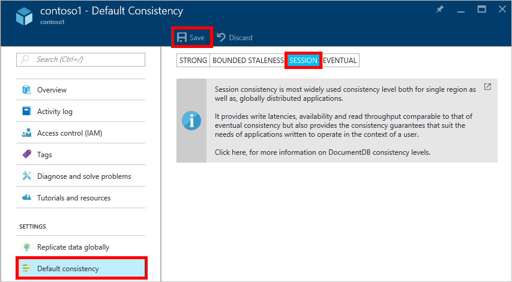

<properties
    pageTitle="Niveaux de cohérence dans DocumentDB | Microsoft Azure"
    description="DocumentDB comporte quatre niveaux de cohérence pour la cohérence éventuelle solde, disponibilité et les arbitrages latence."
    keywords="cohérence éventuelle, documentdb, azure, Microsoft azure"
    services="documentdb"
    authors="syamkmsft"
    manager="jhubbard"
    editor="cgronlun"
    documentationCenter=""/>

<tags
    ms.service="documentdb"
    ms.workload="data-services"
    ms.tgt_pltfrm="na"
    ms.devlang="na"
    ms.topic="article"
    ms.date="08/24/2016"
    ms.author="syamk"/>

# Niveaux de cohérence dans DocumentDB

DocumentDB Azure est conçu d’emblée avec distribution globale à l’esprit. Il est conçu pour offrir prévisibles faible latence garanties, un SLA de disponibilité de 99,99 % et plusieurs modèles de cohérence moyenne précise. Pour l’instant, DocumentDB propose quatre niveaux de cohérence : forte, délimitée-obsolescence, session et éventuelle. Outre le **fort** et la **cohérence éventuelle** modèles est fréquemment offerts par d’autres bases de données NoSQL, DocumentDB également propose deux modèles de garantir la cohérence avec soin code et operationalized – **délimitée obsolescence** et **session**et a validé leur utilité contre les exemples d’utilisation réels. Collectivement ces niveaux de quatre cohérence permettre d’effectuer bien motivées compromis entre la cohérence, la disponibilité et latence. 

## Étendue de la cohérence

La précision de cohérence limitée à la demande d’un utilisateur unique. Une demande d’écriture peut correspondre à une insertion, remplacer upsert ou supprimer des transactions (avec ou sans l’exécution d’un déclencheur pre ou post associé). Ou une demande d’écriture peut-être correspondre à l’exécution d’une procédure JavaScript stockée contrôlant plusieurs documents dans une partition transactions. À l’instar de l’écriture, une transaction en lecture/requête est également dans l’étendue à une demande d’utilisateur unique. L’utilisateur pourrez être amené à pagination sur un grand jeu de résultats, s’étendant sur plusieurs partitions, mais chacun d’eux lu transaction est portée à une seule page et provenant de dans une même partition.

## Niveaux de cohérence

Vous pouvez configurer un niveau de cohérence par défaut sur votre compte de base de données qui s’applique à toutes les collections (pour toutes les bases de données), sous compte de votre base de données. Par défaut, toutes les lectures et les requêtes exécutées sur les ressources définies par l’utilisateur utilise le niveau de cohérence par défaut spécifié sur le compte de base de données. Toutefois, vous pouvez alléger le niveau de cohérence d’une requête spécifique en lecture/requête en spécifiant l’en-tête de requête [[x-ms--niveau de cohérence]](https://msdn.microsoft.com/library/azure/mt632096.aspx) . Il existe quatre types de niveaux de cohérence pris en charge par le protocole de réplication DocumentDB qui fournissent un compromis effacer entre la garantie de la cohérence spécifique et de performances, comme décrit ci-dessous.

![DocumentDB propose plusieurs, bien définies choix à partir de modèles de cohérence (souple)][1]

**Fort**: 

- Cohérence forte offre une garantie [linearizability](https://aphyr.com/posts/313-strong-consistency-models) avec les lectures garanties pour retourner la version la plus récente d’un document. 
- Cohérence forte garantit qu’une écriture est visible uniquement après que elle est validée durablement par le quorum majorité des duplications. Une écriture est validée soit synchrone durablement par le serveur principal et le quorum de secondaires, ou qu’il est abandonné. Une lecture est toujours acceptée par la majorité lire quorum, un client est visible jamais une écriture partielle ou non validée et est toujours garanti pour lire le dernière écriture reconnu. 
- Comptes DocumentDB qui sont configurés pour utiliser la cohérence forte Impossible d’associer plusieurs régions Azure avec leur propre compte DocumentDB. 
- Le coût d’une opération de lecture (en termes d' [unités demande](documentdb-request-units.md) consommées) avec la cohérence forte est supérieure à la session et éventuelle, mais différente de celle obsolescence délimitée.
 

**Obsolescence DELIMITEE**: 

- Délimitée obsolescence cohérence garantit que les lectures risque de souffrir écrit par au maximum des versions *K* ou préfixes d’un document ou *t* intervalle de temps. 
- Par conséquent, lors de la sélection délimitée obsolescence, l’inefficacité » » peut être configurée de deux façons : 
    - Nombre de versions *K* du document par lequel le lit un décalage derrière les opérations d’écriture
    - Intervalle de temps *t* 
- Délimitée obsolescence offres total global de la commande à l’exception dans la fenêtre « obsolescence ». Notez que garantit la lecture monotone existe au sein d’une région à l’intérieur et extérieur la « obsolescence fenêtre ». 
- Obsolescence délimitée offre une meilleure garantie de cohérence de session ou de la cohérence éventuelle. Pour les applications distribuées globalement, nous vous recommandons de qu'utiliser obsolescence limitée pour les scénarios l’endroit où vous voulez la cohérence forte mais également souhaite disponibilité de 99,99 % et une faible latence. 
- Comptes DocumentDB qui sont configurés avec la cohérence obsolescence délimitée peuvent associer un nombre quelconque de régions Azure avec leur propre compte DocumentDB. 
- Le coût d’une opération de lecture (en termes de RUs consommées) avec obsolescence délimitée est supérieure à la session et la cohérence éventuelle, mais différente de celle cohérence forte.

**Session**: 

- Contrairement aux modèles de cohérence globale offertes par niveau de cohérence obsolescence fort et limité, la cohérence de session est dans l’étendue d’une session de client. 
- Cohérence de session est idéale pour tous les scénarios impliquant une session périphérique ou utilisateur dans la mesure où elle garantit lectures monotone, monotone écritures et en lecture garantit votre propre écrit (RYW). 
- Cohérence de session fournit la cohérence prévisible pour une session et débit de lecture maximale tout en garantissant la lecture et l’écriture de latence les plus faibles. 
- Comptes DocumentDB qui sont configurés avec la cohérence de session peuvent associer un nombre quelconque de régions Azure à leur propre compte DocumentDB. 
- Le coût d’une opération de lecture (en termes de RUs consommées) avec le niveau de cohérence session est obsolescence moins fort et limité, mais la cohérence plusieurs éventuelle
 

**Éventuelle**: 

- La cohérence éventuelle garantit qu’en absence de toute écriture supplémentaire, les réplicas au sein du groupe seront finalement convergent. 
- La cohérence éventuelle est la forme la plus faible de cohérence où un client peut obtenir les valeurs qui sont antérieurs à ceux qu’il avait vu avant.
- La cohérence éventuelle offre la cohérence en savoir plus faible mais sa la latence les plus faibles lectures et écritures.
- Comptes DocumentDB qui sont configurés avec la cohérence éventuelle peuvent associer un nombre quelconque de régions Azure à leur propre compte DocumentDB. 
- Le coût d’une opération de lecture (en termes de RUs consommées) avec la cohérence éventuelle niveau est le plus petit de tous les niveaux de cohérence DocumentDB.

## Garantie de la cohérence

Le tableau suivant capture différentes garanties de cohérence correspondant aux niveaux de quatre cohérence.

| Garantie technologique                                                         |    Fort                                       |    Obsolescence limitée                                                                           |    Session                                       |    Éventuelle                                 |
|----------------------------------------------------------|-------------------------------------------------|------------------------------------------------------------------------------------------------|--------------------------------------------------|--------------------------------------------------|
|    **Total général de la commande**                                |    Oui                                          |    Oui, en dehors de la fenêtre « obsolescence »                                                      |    Non, commande partielle « session »                   |    N°                                            |
|    **Garantie préfixe cohérente**                       |    Oui                                          |    Oui                                                                                         |    Oui                                           |    Oui                                           |
|    **Lectures monotone**                                   |    Oui                                          |    Oui, au sein de régions en dehors de la fenêtre obsolescence et dans une zone de tout le temps.     |    Oui, pour la session donnée                    |    N°                                            |
|    **Écritures monotone**                                  |    Oui                                          |    Oui                                                                                         |    Oui                                           |    Oui                                           |
|    **Lire votre écriture**                                  |    Oui                                          |    Oui                                                                                         |    Oui (dans la région écriture)                      |    N°                                            |

## Configuration du niveau de cohérence par défaut

1.  Dans le [portail Azure](https://portal.azure.com/), dans le Jumpbar, cliquez sur **DocumentDB (NoSQL)**.

2. Dans la carte **DocumentDB (NoSQL)** , sélectionnez le compte de base de données à modifier.

3. Dans la carte de compte, cliquez sur **par défaut la cohérence**.

4. Dans la carte de **Cohérence par défaut** , sélectionnez le nouveau niveau de la cohérence et cliquez sur **Enregistrer**.

    

## Niveaux de cohérence pour les requêtes

Par défaut, pour les ressources définies par l’utilisateur, le niveau de cohérence de requêtes est le même que le niveau de cohérence lectures. Par défaut, l’index est mise à jour synchrone sur chaque insertion, remplacer ou supprimer d’un document à la collection. Ainsi, les requêtes de respecter le niveau de cohérence même que celui de la lecture du document. Bien que DocumentDB est optimisé en écriture et prend en charge des volumes prolongées des écritures de document, la maintenance des index synchrone et traiter les requêtes de cohérence, vous pouvez configurer certaines collections pour mettre à jour leur index différée. Indexation lente améliore les performances d’écriture et davantage est idéal pour les scénarios d’intégration en bloc lorsque la charge de travail est principalement comportant beaucoup de lecture.  

Mode d’indexation|  Lectures|  Requêtes  
-------------|-------|---------
Cohérent (par défaut)|   Effectuer une sélection de péremption forte, délimitée, session, ou éventuelle|    Effectuer une sélection de péremption forte, délimitée, session, ou éventuelle|
Différé|   Effectuer une sélection de péremption forte, délimitée, session, ou éventuelle|    Éventuelle  

Comme avec les requêtes de lecture, vous pouvez réduire le niveau de cohérence d’une requête spécifique en spécifiant l’en-tête de requête [x ms-cohérence au niveau](https://msdn.microsoft.com/library/azure/mt632096.aspx) .

## Étapes suivantes

Si vous souhaitez effectuer une lecture plus sur les niveaux de la cohérence et compromis, nous vous recommandons des ressources suivantes :

-   Doug éponge. La cohérence des données répliquée expliqués par le biais joueur (vidéo).   
[https://www.YouTube.com/watch?v=gluIh8zd26I](https://www.youtube.com/watch?v=gluIh8zd26I)
-   Doug éponge. La cohérence des données répliquée expliqués par le biais joueur.   
[http://Research.Microsoft.com/pubs/157411/ConsistencyAndBaseballReport.PDF](http://research.microsoft.com/pubs/157411/ConsistencyAndBaseballReport.pdf)
-   Doug éponge. Session garanties pour les données répliquées cohérentes légèrement.   
[http://DL.ACM.org/citation.cfm?id=383631](http://dl.acm.org/citation.cfm?id=383631)
-   Michel Abadi. Cohérence compromis dans la conception de systèmes de base de données distribué moderne : Lettrine n'est qu’une partie de l’article ».   
[http://Computer.org/CSDL/mags/co/2012/02/mco2012020037-ABS.HTML](http://computer.org/csdl/mags/co/2012/02/mco2012020037-abs.html)
-   Peter Bailis, Shivaram Venkataraman, Michael J. Franklin, Joseph M. Hellerstein, Stoica Ion. Probabilité délimitée obsolescence (PBS) pour Quorums partielles pratiques.   
[http://VLDB.org/pvldb/vol5/p776_peterbailis_vldb2012.PDF](http://vldb.org/pvldb/vol5/p776_peterbailis_vldb2012.pdf)
-   Werner Vogels. Éventuelle cohérentes - revisitée.    
[http://allthingsdistributed.com/2008/12/eventually_consistent.HTML](http://allthingsdistributed.com/2008/12/eventually_consistent.html)

[1]: ./media/documentdb-consistency-levels/consistency-tradeoffs.png
