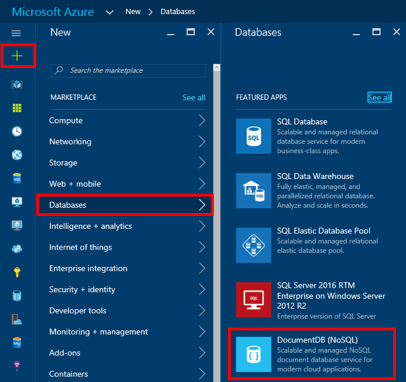
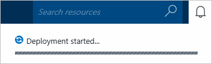

<properties
    pageTitle="Comment créer un compte DocumentDB | Microsoft Azure"
    description="Créer une base de données NoSQL DocumentDB Azure. Suivez ces instructions pour créer un compte DocumentDB et commencer à créer votre base de données NoSQL rapide, à l’échelle globale incroyables." 
    keywords="créer une base de données"
    services="documentdb"
    documentationCenter=""
    authors="mimig1"
    manager="jhubbard"
    editor="monicar"/>

<tags
    ms.service="documentdb"
    ms.workload="data-services"
    ms.tgt_pltfrm="na"
    ms.devlang="na"
    ms.topic="get-started-article"
    ms.date="10/17/2016"
    ms.author="mimig"/>

# Comment créer un compte DocumentDB NoSQL à l’aide du portail Azure

> [AZURE.SELECTOR]
- [Portail Azure](documentdb-create-account.md)
- [Azure infrastructure du langage commun et le Gestionnaire de ressources Azure](documentdb-automation-resource-manager-cli.md)

Pour créer une base de données Microsoft Azure DocumentDB, vous devez :

- Posséder un compte Azure. Vous pouvez obtenir un [compte Azure gratuit](https://azure.microsoft.com/free) si vous n’en avez pas déjà. 
- Créer un compte DocumentDB.  

Vous pouvez créer un compte DocumentDB à l’aide du portail Azure, des modèles de gestionnaire de ressources Azure ou Azure interface de ligne (commande). Cet article vous explique comment créer un compte DocumentDB à l’aide du portail Azure. Pour créer un compte à l’aide du Gestionnaire de ressources Azure ou Azure infrastructure du langage commun, consultez [DocumentDB automatiser la création de compte de base de données](documentdb-automation-resource-manager-cli.md).

Vous êtes novice dans DocumentDB ? Regardez [cette](https://azure.microsoft.com/documentation/videos/create-documentdb-on-azure/) vidéo quatre minutes par Scott Hanselman pour apprendre à effectuer les tâches courantes dans le portail en ligne.

1.  Connectez-vous au [portail Azure](https://portal.azure.com/).
2.  Dans la Jumpbar, cliquez sur **Nouveau**, cliquez sur **bases de données**, puis cliquez sur **DocumentDB (NoSQL)**. 

      

3. Dans la carte de **nouveau compte** , spécifiez la configuration du compte DocumentDB souhaitée.

    

    - Dans la zone **ID** , entrez un nom pour identifier le compte DocumentDB.  Lorsque l' **ID** est validé, une coche verte s’affiche dans la zone **ID** . La valeur **ID** devient le nom d’hôte dans l’URI. L' **ID** peut contenir uniquement des lettres minuscules, nombres et le «- » de caractères et doit être comprise entre 3 et 50 caractères. Notez que *documents.azure.com* est ajouté au nom du point de terminaison choisie, dont le résultat devient votre point de terminaison DocumentDB compte.

    - Dans la zone **NoSQL API** , sélectionnez le modèle de programmation à utiliser :
        - **DocumentDB**: l’API DocumentDB est disponible via .NET, Java, Node.js, Python et JavaScript [SDK](documentdb-sdk-dotnet.md), ainsi HTTP [reste](https://msdn.microsoft.com/library/azure/dn781481.aspx)et offre un accès par programme à toutes les fonctionnalités DocumentDB. 
       
        - **MongoDB**: DocumentDB propose également [prise en charge au niveau du protocole](documentdb-protocol-mongodb.md) pour **MongoDB** API. Lorsque vous choisissez l’option MongoDB API, vous pouvez utiliser existant MongoDB SDK et [Outils](documentdb-mongodb-mongochef.md) de communiquer avec DocumentDB. Vous pouvez [déplacer](documentdb-import-data.md) vos applications MongoDB existantes pour utiliser DocumentDB, avec [aucune modification de code nécessitée](documentdb-connect-mongodb-account.md)et tirez parti d’une base de données entièrement gérée comme un service, avec échelle illimitée, réplication globale et d’autres fonctionnalités.

    - Pour l' **abonnement**, sélectionnez l’abonnement Azure que vous souhaitez utiliser pour le compte DocumentDB. Si votre compte est un abonnement, ce compte est sélectionné par défaut.

    - Dans le **Groupe de ressources**, sélectionnez ou créez un groupe de ressources pour votre compte DocumentDB.  Par défaut, un nouveau groupe de ressources est créé. Pour plus d’informations, voir [l’aide du portail pour gérer vos ressources Azure Azure](../articles/azure-portal/resource-group-portal.md).

    - **Emplacement** permet de spécifier l’emplacement géographique dans lesquelles vous pouvez héberger votre compte DocumentDB. 

4.  Une fois que les nouvelles options de compte DocumentDB sont configurées, cliquez sur **créer**. Pour vérifier l’état du déploiement, activez le hub de Notifications.  

      

    

5.  Une fois le compte DocumentDB est créé, il est prêt à utiliser avec les paramètres par défaut. La cohérence par défaut du compte DocumentDB est définie à la **Session**.  Vous pouvez ajuster la cohérence par défaut en cliquant sur **La cohérence par défaut** dans le menu de la ressource. Pour en savoir plus sur les niveaux de cohérence offertes par DocumentDB, voir [niveaux de cohérence dans DocumentDB](documentdb-consistency-levels.md).

      

      

[How to: Create a DocumentDB account]: #Howto
[Next steps]: #NextSteps
[documentdb-manage]:../articles/documentdb/documentdb-manage.md

## Étapes suivantes

Maintenant que vous avez un compte DocumentDB, l’étape suivante consiste à créer une collection de sites DocumentDB et la base de données. 

Vous pouvez créer une nouvelle collection de sites et de la base de données à l’aide d’une des opérations suivantes :

- Le portail Azure, comme décrit dans [créer une collection de DocumentDB à l’aide du portail Azure](documentdb-create-collection.md).
- Les didacticiels exhaustives, qui incluent des exemples de données : [.NET](documentdb-get-started.md), [.NET MVC](documentdb-dotnet-application.md), [Java](documentdb-java-application.md), [Node.js](documentdb-nodejs-application.md)ou [Python](documentdb-python-application.md).
- [.NET](documentdb-dotnet-samples.md#database-examples), [Node.js](documentdb-nodejs-samples.md#database-examples)ou [Python](documentdb-python-samples.md#database-examples) exemple code disponible dans GitHub.
- [.NET](documentdb-sdk-dotnet.md), [Node.js](documentdb-sdk-node.md), [Java](documentdb-sdk-java.md), [Python](documentdb-sdk-python.md)et [reste](https://msdn.microsoft.com/library/azure/mt489072.aspx) SDK.

Après avoir créé votre base de données et de la collection de sites, vous devez [Ajouter des documents](documentdb-view-json-document-explorer.md) aux collections.

Une fois que vous avez documents dans une collection de sites, vous pouvez utiliser [DocumentDB SQL](documentdb-sql-query.md) pour [exécuter des requêtes](documentdb-sql-query.md#executing-queries) par rapport à vos documents. Vous pouvez exécuter des requêtes à l’aide de l' [Explorateur de requête](documentdb-query-collections-query-explorer.md) dans le portail, l' [API REST](https://msdn.microsoft.com/library/azure/dn781481.aspx)ou parmi les [SDK](documentdb-sdk-dotnet.md).

### Pour en savoir plus

Pour en savoir plus sur DocumentDB, Explorez ces ressources :

-   [Rubriques d’apprentissage pour DocumentDB](https://azure.microsoft.com/documentation/learning-paths/documentdb/)
-   [Concepts et le modèle de ressources hiérarchique DocumentDB](documentdb-resources.md)
