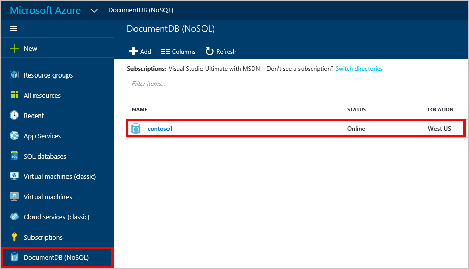

<properties 
    pageTitle="Créer une base de données DocumentDB et collection | Microsoft Azure" 
    description="Apprenez à créer des bases de données NoSQL et collections de document JSON à l’aide du portail de service en ligne pour Azure DocumentDB, un nuage en fonction de base de données du document. Obtenez un essai gratuit aujourd'hui." 
    services="documentdb" 
    authors="mimig1" 
    manager="jhubbard" 
    editor="monicar" 
    documentationCenter=""/>

<tags 
    ms.service="documentdb" 
    ms.workload="data-services" 
    ms.tgt_pltfrm="na" 
    ms.devlang="na" 
    ms.topic="article" 
    ms.date="10/17/2016" 
    ms.author="mimig"/>

# Comment créer une collection de sites DocumentDB et base de données à l’aide du portail Azure

Pour utiliser Microsoft Azure DocumentDB, vous devez disposer d’un [compte DocumentDB](documentdb-create-account.md), une base de données, une collection de sites et des documents. Cette rubrique explique comment créer une collection de sites DocumentDB dans le portail Azure. 

Ne savez pas quel une collection de sites est ? Voir [qu’est une collection de sites DocumentDB ?](#what-is-a-documentdb-collection)

1.  Dans le [portail Azure](https://portal.azure.com/), dans le Jumpbar, cliquez sur **DocumentDB (NoSQL)**et, dans la carte **DocumentDB (NoSQL)** , sélectionnez le compte auquel ajouter une collection de sites. Si vous n’avez pas tous les comptes répertoriés, vous devez [créer un compte DocumentDB](documentdb-create-account.md).

    
    
    Si **DocumentDB (NoSQL)** n’est pas visible dans la Jumpbar, cliquez sur **Autres Services** , puis sur **DocumentDB (NoSQL)**. Si vous n’avez pas tous les comptes répertoriés, vous devez [créer un compte DocumentDB](documentdb-create-account.md).

2. Dans la carte **DocumentDB compte** pour le compte sélectionné, cliquez sur **Ajouter la collection de sites**.

    

3. Dans la carte **Ajouter la collection de sites** , dans la zone **ID** , entrez l’ID pour votre nouvelle collection. Noms de collection de sites doit être comprise entre 1 et 255 caractères et ne peut pas contenir `/ \ # ?` ou un espace de fin. Lorsque le nom est validé, une coche verte s’affiche dans la zone ID.

    

4. Par défaut, les **Tarifs couche** est défini sur **Standard** afin que vous pouvez personnaliser le débit et le stockage pour votre collection de sites. Pour plus d’informations sur le niveau de tarification, voir [niveaux de performances dans DocumentDB](documentdb-performance-levels.md).  

5. Sélectionner un **mode de partitionnement** pour la collection de sites, **Partition unique** ou **partitionnées**. 

    Une **seule partition** a une capacité de stockage réservée de 10 Go et peut comporter des niveaux de débit des unités de demande de 10 000 400/seconde (demandeur/s). Un demandeur correspond au débit d’une lecture d’un document 1 Ko. Pour plus d’informations sur les unités de la demande, voir [unités de la demande](documentdb-request-units.md). 

    Une **collection de sites partitionnée** peut évoluer pour gérer une quantité illimitée de stockage sur plusieurs partitions et peut avoir des niveaux de débit commençant à 10,100 demandeur/s. Dans le portail, le stockage plus grand, que vous pouvez réserver est 250 Go et le débit la plupart des que vous pouvez réserver est de 250 000 demandeur/s. Pour augmenter un quota, créer une demande comme décrit dans la [demande est augmenté compte les quotas de DocumentDB](documentdb-increase-limits.md). Pour plus d’informations sur les collections partitionnées, voir [Partition unique et Collections partitionnées](documentdb-partition-data.md#single-partition-and-partitioned-collections).

    Par défaut, le débit pour une collection de partition unique est défini sur 1000 demandeur/s avec une capacité de stockage de 10 Go. Pour une collection partitionnée, le débit de collection de sites est défini sur 10100 demandeur/s avec une capacité de stockage de 250 Go. Vous pouvez modifier le débit et le stockage de la collection après la création de la collection de sites. 

6. Si vous créez une collection de sites partitionnées, sélectionnez la **Clé de Partition** pour la collection de sites. Il est important pour créer une collection performant de sélectionner la clé de partition correcte. Pour plus d’informations sur la sélection d’une clé de partition, voir [Création de division](documentdb-partition-data.md#designing-for-partitioning).

7. Dans la carte de **base de données** , créer une nouvelle base de données ou utiliser une existante. Noms de base de données doit être comprise entre 1 et 255 caractères et ne peut pas contenir `/ \ # ?` ou un espace de fin. Pour valider le nom, cliquez en dehors de la zone de texte. Lorsque le nom est validé, une coche verte apparaît dans la zone.

8. Cliquez sur **OK** dans la partie inférieure de l’écran pour créer la nouvelle collection. 

9. La nouvelle collection maintenant s’affiche dans l’objectif de **collections de sites** sur la carte de **vue d’ensemble** .
 
    

10. **Facultatif :** Pour modifier le débit de collection de sites dans le portail, cliquez sur **échelle** dans le menu de la ressource. 

    

## Qu’est une collection de sites DocumentDB ? 

Une collection de sites est un conteneur de documents JSON et la logique d’application JavaScript associée. Une collection de sites est une entité facturable, où le [coût](documentdb-performance-levels.md) est déterminé par le débit généré de la collection. Collections de sites peuvent s’étendre sur un ou plusieurs partitions/serveurs et pouvant évoluer pour gérer des volumes quasi illimitées de stockage ou débit.

Collections de sites sont automatiquement répartis dans un ou plusieurs serveurs physiques en DocumentDB. Lorsque vous créez une collection de sites, vous pouvez spécifier le débit généré en termes d’unités demande par seconde et une propriété de clé partition. La valeur de cette propriété sera utilisée par DocumentDB pour distribuer des documents entre les partitions et les demandes d’itinéraire comme les requêtes. La valeur de clé partition sert également la limite de transaction des procédures stockées et des déclencheurs. Chaque collection de sites possède un espace réservé débit spécifique à cette collection, qui n’est pas partagée avec d’autres collections de sites dans le même compte. Par conséquent, vous pouvez évoluer votre application en termes de stockage et de débit. 

Collections ne sont pas les mêmes comme des tables dans les bases de données relationnelles. Collections de sites n’appliquent pas de schéma, en fait DocumentDB n’applique pas tous les schémas, il s’agit d’une base de données exempt de schéma. Par conséquent, vous pouvez stocker différents types de documents avec des schémas centralisées dans la même collection. Vous pouvez choisir d’utiliser des collections de sites pour stocker des objets d’un seul type comme vous le feriez avec des tableaux. Le meilleur modèle dépend uniquement comment les données apparaissent ensemble dans les requêtes et les transactions.

## Autres façons de créer une collection de sites DocumentDB

Collections de sites n’ont pas à être créé à l’aide du portail, vous pouvez également créer à l’aide de la [DocumentDB SDK](documentdb-sdk-dotnet.md) et l’API REST. 

- Pour obtenir un exemple de code c#, voir les [exemples de collection de sites c#](documentdb-dotnet-samples.md#collection-examples). 
- Pour un échantillon de code Node.js, voir les [exemples de collection de sites Node.js](documentdb-nodejs-samples.md#collection-examples).
- Pour un échantillon de code Python, voir [exemples de collection de sites Python](documentdb-python-samples.md#collection-examples).
- Pour obtenir un exemple de l’API REST, voir [créer une collection de sites](https://msdn.microsoft.com/library/azure/mt489078.aspx).

## Résolution des problèmes

Si **Ajouter la collection de sites** est désactivé dans le portail Azure, cela signifie que votre compte est actuellement désactivé, qui se produit normalement lorsque tous les crédits avantages pour le mois sont utilisés.   

## Étapes suivantes

Maintenant que vous avez une collection de sites, l’étape suivante consiste à ajouter des documents ou importer des documents dans la collection de sites. Lorsque vous voulez ajouter des documents à une collection de sites, vous avez le choix :

- Vous pouvez [Ajouter des documents](documentdb-view-json-document-explorer.md) à l’aide de l’Explorateur de documents dans le portail.
- Vous pouvez [Importer des documents et des données](documentdb-import-data.md) à l’aide de l’outil de Migration de données DocumentDB, qui vous permet d’importer des fichiers JSON et CSV, ainsi que les données à partir de SQL Server, MongoDB, stockage de Table Azure et autres collections DocumentDB. 
- Ou vous pouvez ajouter des documents en utilisant l’un de l' [DocumentDB SDK](documentdb-sdk-dotnet.md). DocumentDB a .NET, Java, Python, Node.js et SDK de l’API JavaScript. Pour les exemples de code c# montrant comment utiliser des documents en utilisant le Kit de développement .NET DocumentDB, voir les [exemples de documents c#](documentdb-dotnet-samples.md#document-examples). Pour les exemples de code Node.js montrant comment utiliser des documents à l’aide du Kit de développement Node.js DocumentDB, voir les [exemples de documents Node.js](documentdb-nodejs-samples.md#document-examples).

Une fois que vous avez documents dans une collection de sites, vous pouvez utiliser [DocumentDB SQL](documentdb-sql-query.md) pour [exécuter des requêtes](documentdb-sql-query.md#executing-queries) par rapport à vos documents en utilisant l' [Explorateur de requête](documentdb-query-collections-query-explorer.md) dans le portail, l' [API REST](https://msdn.microsoft.com/library/azure/dn781481.aspx)ou parmi les [SDK](documentdb-sdk-dotnet.md). 
