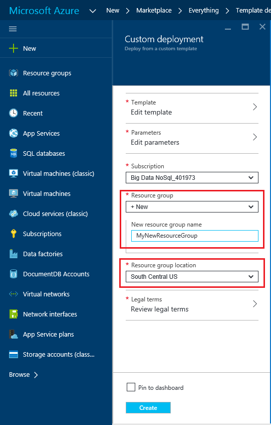
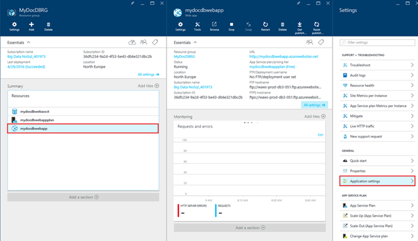

<properties 
    pageTitle="Déployer DocumentDB et Azure Application Service Web Apps à l’aide d’un modèle de gestionnaire de ressources Azure | Microsoft Azure" 
    description="Découvrez comment déployer un compte DocumentDB et un exemple d’application web à l’aide d’un modèle de gestionnaire de ressources Azure Azure Application Service Web Apps." 
    services="documentdb, app-service\web" 
    authors="h0n" 
    manager="jhubbard" 
    editor="monicar" 
    documentationCenter=""/>

<tags 
    ms.service="documentdb" 
    ms.workload="data-services" 
    ms.tgt_pltfrm="na" 
    ms.devlang="na" 
    ms.topic="article" 
    ms.date="08/02/2016" 
    ms.author="hawong"/>

# Déployer DocumentDB et à l’aide d’un modèle de gestionnaire de ressources Azure Azure Application Service Web Apps

Ce didacticiel montre comment utiliser un modèle Azure le Gestionnaire de ressources pour déployer et intégrer [Microsoft Azure DocumentDB](https://azure.microsoft.com/services/documentdb/), une application web [Azure Application Service](http://go.microsoft.com/fwlink/?LinkId=529714) et un exemple d’application web.

À l’aide de modèles Azure le Gestionnaire de ressources, vous pouvez facilement automatiser le déploiement et la configuration de vos ressources Azure.  Ce didacticiel montre comment déployer une application web et de configurer automatiquement les informations de connexion de compte DocumentDB.

Au terme de ce didacticiel, vous ne pourrez pas répondre aux questions suivantes :  

-   Comment puis-je utiliser un modèle de gestionnaire de ressources Azure déploiement et l’intégration d’un compte DocumentDB et une application web dans le Service d’application Azure ?
-   Comment puis-je utiliser un modèle de gestionnaire de ressources Azure déploiement et l’intégration d’un compte DocumentDB, une application web dans l’application de Service Web Apps et une application Webdeploy ?

## Conditions préalables
> [AZURE.TIP] Pendant ce didacticiel ne considère pas expérience préalable avec le Gestionnaire de ressources Azure modèles ou JSON, si vous souhaitez modifier les modèles référencés ou les options de déploiement, puis connaissance de chacun de ces domaines sera nécessaire.

Avant de suivre les instructions dans ce didacticiel, assurez-vous que vous avez les éléments suivants :

- Un abonnement Azure. Azure est une plateforme basée sur l’abonnement.  Pour plus d’informations sur l’obtention d’un abonnement, voir [Options d’achat](https://azure.microsoft.com/pricing/purchase-options/), [Propose des membres](https://azure.microsoft.com/pricing/member-offers/)ou [Version d’évaluation gratuite](https://azure.microsoft.com/pricing/free-trial/).

##Étape 1 : Télécharger les fichiers de modèle ##
Commençons par téléchargement des fichiers de modèle que nous utiliserons dans ce didacticiel.

1. Télécharger le modèle de [créer un compte DocumentDB, applications Web et déployer un exemple d’application démo](https://portalcontent.blob.core.windows.net/samples/DocDBWebsiteTodo.json) dans un dossier local (par exemple, C:\DocumentDBTemplates). Ce modèle déployez une application web, une application web application Service et un compte DocumentDB.  Il va également automatiquement configurer l’application web pour vous connecter au compte DocumentDB.

2. Télécharger le modèle de [Création d’un compte DocumentDB et exemple Web Apps](https://portalcontent.blob.core.windows.net/samples/DocDBWebSite.json) dans un dossier local (par exemple, C:\DocumentDBTemplates). Ce modèle déployer un compte DocumentDB, une application web application Service et modifie les paramètres de l’application du site pour retrouver facilement les informations de connexion DocumentDB, mais n’inclut pas d’une application web.  

##Étape 2 : Déployer le compte DocumentDB, l’application Service web app et démo exemple d’application

Maintenant nous allons déployer notre premier modèle.

> [AZURE.TIP] Le modèle ne vérifie pas que le nom de l’application web et le nom de compte DocumentDB entrés ci-dessous sont a) valides et b) disponibles.  Il est vivement recommandé de vérifier la disponibilité des noms que vous souhaitez fournir avant l’envoi du déploiement.

1. Connectez-vous au [Portail Azure](https://portal.azure.com), cliquez sur Nouveau et recherchez « Déploiement de modèle ».
    

2. Sélectionnez l’élément de déploiement de modèle, cliquez sur **créer**
    

3.  Cliquez sur **Modifier le modèle**, collez le contenu du fichier de modèle DocDBWebsiteTodo.json, puis cliquez sur **Enregistrer**.
    

4. Cliquez sur **Modifier les paramètres**, indiquez les valeurs pour chacun des paramètres obligatoires, puis cliquez sur **OK**.  Les paramètres sont les suivantes :

    1. Nom du site : Spécifie le nom de l’application web application Service et est utilisée pour créer l’URL que vous utiliserez pour accéder à l’application web (par exemple, si vous indiquez « mydemodocdbwebapp », puis l’URL à laquelle vous accéderez à l’application web sera mydemodocdbwebapp.azurewebsites.net).

    2. HOSTINGPLANNAME : Spécifie le nom de l’application Service d’hébergement plan à créer.

    3. EMPLACEMENT : Indique l’emplacement dans lequel vous souhaitez créer le web et DocumentDB ressources de l’application Azure.

    4. DATABASEACCOUNTNAME : Spécifie le nom du compte DocumentDB à créer.   

    

5. Sélectionnez un groupe de ressources existant ou fournir un nom pour le rendre un groupe de ressources, puis sélectionnez un emplacement pour le groupe de ressources.
    
  
6.  **Conditions juridiques révision**, **achat**, puis cliquez sur **créer** pour commencer le déploiement.  Sélectionnez **Ajouter au tableau de bord** pour le déploiement qui en résulte soit facilement visible sur votre page d’accueil du portail Azure.
    

7.  Une fois le déploiement, la carte de groupe de ressources s’ouvre.
      

8.  Pour utiliser l’application, accédez simplement à l’URL de l’application web (dans l’exemple ci-dessus, l’URL serait http://mydemodocdbwebapp.azurewebsites.net).  Vous verrez l’application web suivante :

    

9. Alors et créer quelques tâches dans l’application web, puis revenez à la carte du groupe de ressources dans le portail Azure. La ressource de compte DocumentDB dans la liste de ressources, puis cliquez sur **Explorateur de requête**.
      

10. Exécuter la requête par défaut, « SELECT *FROM c » et vérifiez les résultats.  Notez que la requête a récupéré la représentation JSON des tâches que vous avez créé à l’étape 7 ci-dessus.  N’hésitez pas à tester les requêtes ; par exemple, essayez d’exécuter SELECT* FROM c.isComplete où c = true pour renvoyer toutes les tâches qui ont été marqués comme terminés.

    

11. N’hésitez pas à Explorer l’utilisation du portail DocumentDB ou modifier l’exemple d’application Todo.  Lorsque vous êtes prêt, nous allons déployer un autre modèle.
    
 
## Étape 3 : Déployer l’échantillon Document compte et web app

Maintenant nous allons déployer notre deuxième modèle.  Ce modèle est utile pour indiquer comment vous pouvez ajouter des informations de connexion DocumentDB comme point de terminaison de compte et la clé principale dans une application web sous forme de paramètres de l’application ou d’une chaîne de connexion personnalisée. Par exemple, vous disposez de votre propre application web que vous voulez déployer avec un compte DocumentDB et que les informations de connexion complétées automatiquement au cours du déploiement.

> [AZURE.TIP] Le modèle ne vérifie pas que le nom de l’application web et le nom de compte DocumentDB entrés ci-dessous sont a) valides et b) disponibles.  Il est vivement recommandé de vérifier la disponibilité des noms que vous souhaitez fournir avant l’envoi du déploiement.

1. Dans le [Portail Azure](https://portal.azure.com), cliquez sur Nouveau et effectuez une recherche « Déploiement de modèle ».
    

2. Sélectionnez l’élément de déploiement de modèle, cliquez sur **créer**
    

3.  Cliquez sur **Modifier le modèle**, collez le contenu du fichier de modèle DocDBWebSite.json, puis cliquez sur **Enregistrer**.
    

4. Cliquez sur **Modifier les paramètres**, indiquez les valeurs pour chacun des paramètres obligatoires, puis cliquez sur **OK**.  Les paramètres sont les suivantes :

    1. Nom du site : Spécifie le nom de l’application web application Service et est utilisée pour créer l’URL que vous utiliserez pour accéder à l’application web (par exemple, si vous indiquez « mydemodocdbwebapp », puis l’URL à laquelle vous accéderez à l’application web sera mydemodocdbwebapp.azurewebsites.net).

    2. HOSTINGPLANNAME : Spécifie le nom de l’application Service d’hébergement plan à créer.

    3. EMPLACEMENT : Indique l’emplacement dans lequel vous souhaitez créer le web et DocumentDB ressources de l’application Azure.

    4. DATABASEACCOUNTNAME : Spécifie le nom du compte DocumentDB à créer.   

    

5. Sélectionnez un groupe de ressources existant ou fournir un nom pour le rendre un groupe de ressources, puis sélectionnez un emplacement pour le groupe de ressources.
    
  
6.  **Conditions juridiques révision**, **achat**, puis cliquez sur **créer** pour commencer le déploiement.  Sélectionnez **Ajouter au tableau de bord** pour le déploiement qui en résulte soit facilement visible sur votre page d’accueil du portail Azure.
    

7.  Une fois le déploiement, la carte de groupe de ressources s’ouvre.
      

8. Cliquez sur la ressource Web App dans la liste de ressources, puis cliquez sur **paramètres de l’Application**
      

9. Notez les paramètres de l’application présentes pour le point de terminaison DocumentDB et chacune des clés principales DocumentDB.
      

10. N’hésitez pas à continuer à Explorer le portail Azure, ou effectuez l’une de nos DocumentDB [exemples](http://go.microsoft.com/fwlink/?LinkID=402386) pour créer votre propre application DocumentDB.

    
    

## Étapes suivantes

Félicitations ! Vous avez déployé DocumentDB, application Service web app et un exemple d’application web à l’aide de modèles Azure le Gestionnaire de ressources.

- Pour en savoir plus sur DocumentDB, cliquez [ici](http://azure.com/docdb).
- Pour en savoir plus sur les applications Azure Application Service Web, cliquez [ici](http://go.microsoft.com/fwlink/?LinkId=325362).
- Pour en savoir plus sur le Gestionnaire de ressources Azure modèles, cliquez [ici](https://msdn.microsoft.com/library/azure/dn790549.aspx).

## Ce qui a changé
* Pour un guide à la modification de sites Web Application Service voir : [Azure Application Service et son Impact sur les Services Azure existants](http://go.microsoft.com/fwlink/?LinkId=529714)
* Pour un guide pour la modification de l’ancien portail au nouveau portail voir : [référence pour naviguer sur le portail classique Azure](http://go.microsoft.com/fwlink/?LinkId=529715)

>[AZURE.NOTE] Si vous voulez commencer à utiliser le Service d’application Azure avant de vous inscrire pour un compte Azure, accédez à [Essayer le Service application](http://go.microsoft.com/fwlink/?LinkId=523751), où vous pouvez créer une application web starter courte immédiatement dans le Service d’application. Aucune carte de crédit obligatoire ; Aucune engagements.
 
