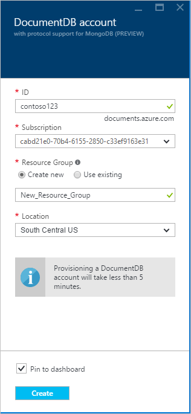

<properties 
    pageTitle="Créer un compte DocumentDB avec prise en charge du protocole de MongoDB | Microsoft Azure" 
    description="Apprenez à créer un compte DocumentDB avec prise en charge du protocole de MongoDB, désormais disponible pour l’aperçu." 
    services="documentdb" 
    authors="AndrewHoh" 
    manager="jhubbard" 
    editor="" 
    documentationCenter=""/>

<tags 
    ms.service="documentdb" 
    ms.workload="data-services" 
    ms.tgt_pltfrm="na" 
    ms.devlang="na" 
    ms.topic="article" 
    ms.date="10/20/2016" 
    ms.author="anhoh"/>

# Comment créer un compte DocumentDB avec prise en charge du protocole de MongoDB à l’aide du portail Azure

Pour créer un compte Azure DocumentDB avec prise en charge du protocole de MongoDB, vous devez :

- Posséder un compte Azure. Vous pouvez obtenir un [compte Azure gratuit](https://azure.microsoft.com/free/) si vous n’en avez pas déjà.

## Créer le compte  

Pour créer un compte DocumentDB avec prise en charge du protocole de MongoDB, procédez comme suit.

1. Dans une nouvelle fenêtre, connectez-vous au [Portail Azure](https://portal.azure.com).
2. Cliquez sur **Nouveau**et cliquez sur **données + stockage**, cliquez sur **Afficher toutes les**, puis recherchez la catégorie de **données + stockage** pour « Protocole DocumentDB ». Cliquez sur **DocumentDB - prise en charge du protocole de MongoDB**.

    

3. Par ailleurs, dans la catégorie de **données + stockage** , sous **stockage**, cliquez sur **plus**, puis cliquez sur **charger plus** une ou plusieurs fois pour afficher les **DocumentDB - prise en charge du protocole de MongoDB**. Cliquez sur **DocumentDB - prise en charge du protocole de MongoDB**.

    

4. Dans la carte **DocumentDB - prise en charge du protocole de MongoDB (preview)** , cliquez sur **créer** pour lancer le processus d’inscription (version préliminaire).

    

5. Dans la carte **DocumentDB compte** , cliquez sur **s’inscrire pour afficher un aperçu**. Lisez les informations, puis sur **OK**.

    

6.  Après avoir accepté les termes du contrat preview, vous revenez à la carte de créer.  Dans la carte de **compte DocumentDB** , spécifiez la configuration souhaitée pour le compte.

    

    - Dans la zone **ID** , entrez un nom pour identifier le compte.  Lorsque l' **ID** est validé, une coche verte s’affiche dans la zone **ID** . La valeur **ID** devient le nom d’hôte dans l’URI. L' **ID** peut contenir uniquement des lettres minuscules, nombres et le «- » de caractères et doit être comprise entre 3 et 50 caractères. Notez que *documents.azure.com* est ajouté au nom du point de terminaison choisie, dont le résultat devient le point de terminaison de votre compte.

    - Pour l' **abonnement**, sélectionnez l’abonnement Azure que vous souhaitez utiliser pour le compte. Si votre compte est un abonnement, ce compte est sélectionné par défaut.

    - Dans le **Groupe de ressources**, sélectionnez ou créez un groupe de ressources pour le compte.  Par défaut, un groupe de ressources existant sous l’abonnement Azure sera choisi.  Vous pouvez, cependant, choisir de sélectionnez cette option pour créer un nouveau groupe de ressources auquel vous voulez ajouter le compte. Pour plus d’informations, voir [l’aide du portail pour gérer vos ressources Azure Azure](resource-group-portal.md).

    - **Emplacement** permet de spécifier l’emplacement géographique dans lesquelles vous pouvez héberger le compte.
    
    - Facultatif : À cocher **Ajouter au tableau de bord**. Si elle est épinglée au tableau de bord, suivez **étape 8** ci-dessous pour afficher la navigation à gauche de votre nouveau compte.

7.  Une fois que les nouvelles options de compte sont configurées, cliquez sur **créer**.  Il peut prendre quelques minutes pour créer le compte.  Si elle est épinglée au tableau de bord, vous pouvez surveiller l’avancement de mise en service sur le Startboard.  
      

    Si ne pas épinglée au tableau de bord, vous pouvez surveiller l’avancement à partir du hub les Notifications.  

      

    

8.  Pour accéder à votre nouveau compte, cliquez sur **DocumentDB (NoSQL)** dans le menu de gauche. Dans votre liste de DocumentDB normal et DocumentDB avec des comptes de prise en charge de protocole Mongo, cliquez sur nom de votre nouveau compte.

9.  Il est désormais prêt à utiliser avec les paramètres par défaut. 

    
    

## Étapes suivantes

- Découvrez comment [vous connecter](documentdb-connect-mongodb-account.md) à un compte DocumentDB avec protocole prise en charge de MongoDB.

 
