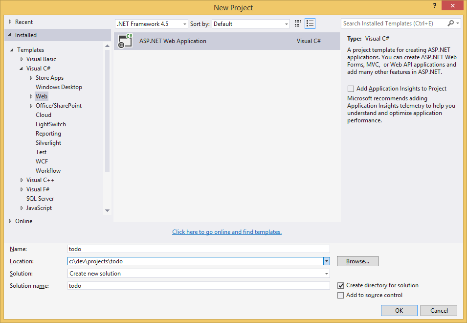
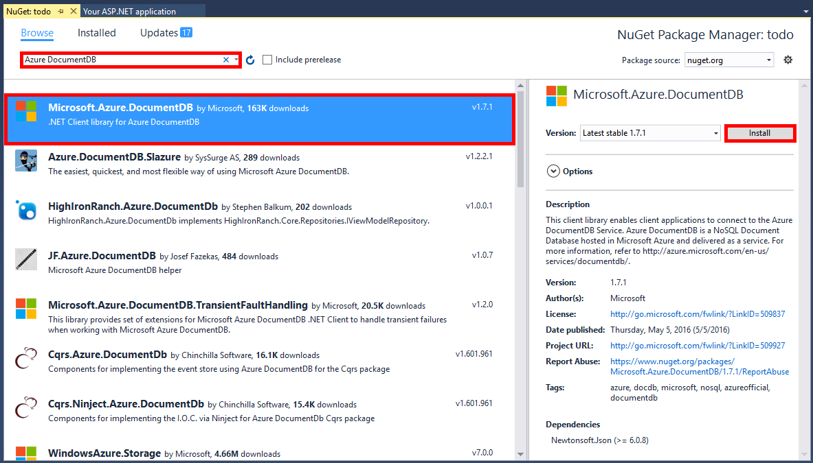
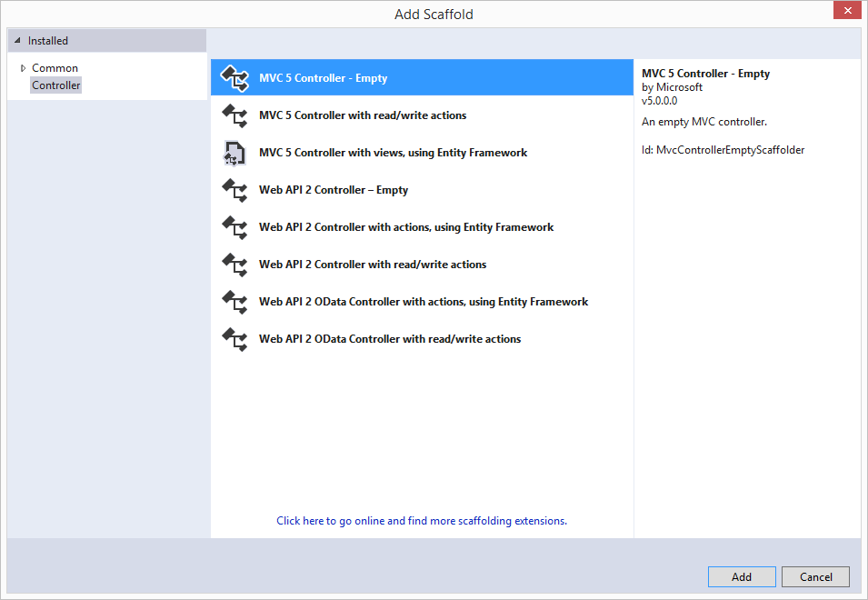
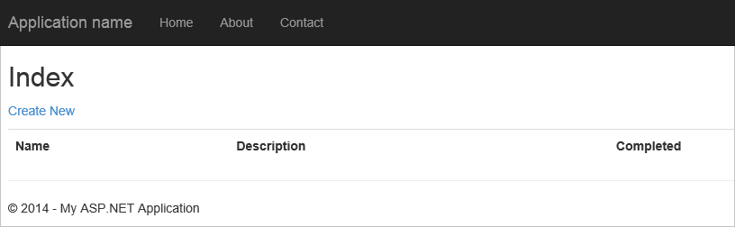

<properties 
    pageTitle="Didacticiel ASP.NET MVC pour DocumentDB : développement d’applications Web | Microsoft Azure" 
    description="Didacticiel ASP.NET MVC pour créer une application web MVC à l’aide de DocumentDB. Vous pouvez stocker JSON et accéder aux données d’une application todo hébergée sur des sites Web Azure - didacticiel ASP NET MVC étape par étape." 
    keywords="didacticiel mvc ASP.NET, développement d’applications web, application web mvc, didacticiel mvc net asp étape par étape"
    services="documentdb" 
    documentationCenter=".net" 
    authors="syamkmsft" 
    manager="jhubbard" 
    editor="cgronlun"/>

<tags 
    ms.service="documentdb" 
    ms.workload="data-services" 
    ms.tgt_pltfrm="na" 
    ms.devlang="dotnet" 
    ms.topic="hero-article" 
    ms.date="08/25/2016" 
    ms.author="syamk"/>

# ASP.NET MVC didacticiel : Développement d’applications Web avec DocumentDB

> [AZURE.SELECTOR]
- [.NET](documentdb-dotnet-application.md)
- [Node.js](documentdb-nodejs-application.md)
- [Java](documentdb-java-application.md)
- [Python](documentdb-python-application.md) 

Pour mettre en évidence comment vous pouvez exploiter efficacement DocumentDB Azure pour stocker et interroger les documents JSON, cet article fournit une vue d’ensemble bout en bout pour vous montrant comment créer une application todo à l’aide de DocumentDB Azure. Les tâches sont stockées en tant que documents JSON dans Azure DocumentDB.

Cette procédure vous montre comment utiliser le service DocumentDB fourni par Azure pour stocker et accéder aux données d’une application web ASP.NET MVC hébergée sur Azure. Si vous recherchez un didacticiel se concentre uniquement sur DocumentDB et non les composants ASP.NET MVC, voir [créer une application console DocumentDB c#](documentdb-get-started.md).

> [AZURE.TIP] Ce didacticiel suppose que vous avez expérience antérieure à l’aide de ASP.NET MVC et sites Web Azure. Si vous débutez dans ASP.NET ou les [Outils requis](#_Toc395637760), nous vous recommandons de téléchargement de l’exemple complet de projet à partir de [GitHub][] et en suivant les instructions dans cet exemple. Une fois que vous avez créé, vous pouvez consulter cet article pour obtenir un aperçu du code dans le contexte du projet.

## Conditions préalables pour ce didacticiel de base de données

Avant de suivre les instructions fournies dans cet article, vous devez vous assurer que vous disposez des éléments suivants :

- Un compte Azure actif. Si vous n’avez pas un compte, vous pouvez créer un compte d’évaluation gratuit en quelques minutes. Pour plus d’informations, voir [Azure la version d’évaluation gratuite](https://azure.microsoft.com/pricing/free-trial/).
- [Visual Studio 2015](http://www.visualstudio.com/) ou mise à jour de Visual Studio 2013 4 ou version ultérieure. Si vous utilisez Visual Studio 2013, vous avez besoin installer le [package nuget Microsoft.Net.Compilers](https://www.nuget.org/packages/Microsoft.Net.Compilers/) pour prendre en charge c# 6.0. 
- Kit de développement Azure pour .NET version2.5.1 ou version ultérieure, disponibles via [Programme d’installation de Microsoft Web Platform][].

Toutes les captures d’écran dans cet article ont eu lieu à l’aide de Visual Studio 2013 avec 4 mise à jour appliquée et le Kit de développement Azure pour .NET version2.5.1. Si votre système est configuré avec des versions différentes, il est possible que votre écran et les options ne correspondront pas entièrement, mais si vous remplissez les conditions préalables ci-dessus cette solution devrait fonctionner.

## Étape 1 : Créer un compte de base de données DocumentDB

Nous allons commencer par créer un compte DocumentDB. Si vous possédez déjà un compte, vous pouvez passer à [créer une application ASP.NET MVC](#_Toc395637762).

[AZURE.INCLUDE [documentdb-create-dbaccount](../../includes/documentdb-create-dbaccount.md)]

[AZURE.INCLUDE [documentdb-keys](../../includes/documentdb-keys.md)]

 
Nous allons maintenant découvrir comment créer une nouvelle application ASP.NET MVC à partir de la terre en place. 

## Étape 2 : Créer une nouvelle application MVC ASP.NET

À présent que vous avez un compte, nous allons créer notre nouveau projet ASP.NET.

1. Dans Visual Studio, dans le menu **fichier** , pointez sur **Nouveau**, puis cliquez sur **projet**.

    La boîte de dialogue **Nouveau projet** s’affiche.
2. Dans le volet **types de projets** , développez **modèles**, **Visual c#**, **Web**, puis sur **Application Web ASP.NET**.

    

3. Dans la zone **nom** , tapez le nom du projet. Ce didacticiel utilise le nom « todo ». Si vous choisissez d’utiliser un numéro autre que cela, puis à l’endroit où ce didacticiel parle de l’espace de noms todo, vous devez régler les exemples de code fournies pour utiliser tout ce que vous avez nommé votre application. 

4. Cliquez sur **Parcourir** pour accéder au dossier dans lequel vous voulez créer le projet, puis cliquez sur **OK**.

    La boîte de dialogue **Nouveau projet ASP.NET** apparaît.

    

5. Dans le volet Modèles, sélectionnez **MVC**.

6. Si vous prévoyez d’héberger votre application dans Azure puis sélectionnez **hôte dans le cloud** dans le coin inférieur droit d’avoir Azure héberger l’application. Nous avons sélectionné pour héberger dans le cloud et exécutez l’application hébergée dans un site Web Azure. Cette option preprovision un site Web Azure pour vous et faciliter la vie beaucoup au moment pour déployer l’application de travail final. Si vous souhaitez héberger ce ailleurs ou ne voulez pas configurer Azure dès le départ, puis désactivez simplement **hôte dans le Cloud**.

7. Cliquez sur **OK** et laissez Visual Studio faire son travail autour échafaudage le modèle ASP.NET MVC vide. 

8. Si vous avez choisi d’héberger ce dans le cloud au moins un écran supplémentaire vous invitant à se connecter à votre compte Azure et fournissez des valeurs pour votre nouveau site Web s’affiche. Fournissez toutes les valeurs supplémentaires et continuer. 

    Je n’ai pas choisi un serveur de base de données » » ici parce que nous allons utilisez pas un serveur de base de données SQL Azure ici, nous allons créer un nouveau compte Azure DocumentDB ultérieurement dans le portail Azure.

    Pour plus d’informations sur le choix d’un **plan de services d’application** et un **groupe de ressources**, voir [vue d’ensemble détaillée de Service d’application Azure offres](../app-service/azure-web-sites-web-hosting-plans-in-depth-overview.md).

    

9. Une fois que Visual Studio a terminé de créer l’application MVC réutilisable que vous avez une application ASP.NET vide que vous pouvez exécuter localement.

    Nous allons ignorer le projet en cours d’exécution localement parce que je suis que nous avons vu tous ASP.NET « Hello World » application. Passons directement à l’ajout de DocumentDB à ce projet et la création de notre application.

## Étape 3 : Ajouter DocumentDB à votre projet d’application web MVC

Maintenant que nous avons la plupart de la plomberie ASP.NET MVC dont nous avons besoin de cette solution, nous allons apprendre à l’objectif réel de ce didacticiel, ajout Azure DocumentDB à notre application web MVC.

1. Le Kit de développement .NET DocumentDB est proposé et distribué sous forme de package NuGet. Pour obtenir le package NuGet dans Visual Studio, utilisez le Gestionnaire de package NuGet dans Visual Studio avec le bouton droit sur le projet dans **L’Explorateur de solutions** , puis cliquez sur **Gérer les Packages NuGet**.

    

    La boîte de dialogue **Gérer les Packages NuGet** s’affiche.

2. Dans la zone NuGet **Parcourir** , tapez ***DocumentDB Azure***.
    
    À partir des résultats, installez le package **Microsoft Azure DocumentDB Client de la bibliothèque** . Cela sera Téléchargez et installez le package DocumentDB, ainsi que toutes les dépendances, comme Newtonsoft.Json. Cliquez sur **OK** dans la fenêtre **d’Aperçu** et **j’accepter** dans la fenêtre **d’Acceptation de la licence** pour terminer l’installation.

    

    Par ailleurs, vous pouvez utiliser la Console du Gestionnaire de Package pour installer le package. Pour ce faire, dans le menu **Outils** , cliquez sur **Gestionnaire de Package NuGet**, puis cliquez sur **Gestionnaire de Package Console**. À l’invite, tapez les informations suivantes.

        Install-Package Microsoft.Azure.DocumentDB

3. Une fois que le package est installé, votre solution Visual Studio doit ressembler à ce qui suit avec deux nouvelles références ajoutés, Microsoft.Azure.Documents.Client et Newtonsoft.Json.

    

##Étape 4 : Configurer l’application ASP.NET MVC
 
Maintenant nous allons ajouter les modèles, affichages et contrôleurs à cette application MVC :

- [Ajouter un modèle](#_Toc395637764).
- [Ajouter un contrôleur](#_Toc395637765).
- [Ajouter les affichages](#_Toc395637766).

### Ajouter un modèle de données JSON

Commençons par créer le **M** dans MVC, le modèle. 

1. Dans l' **Explorateur de solutions**, cliquez sur le dossier **modèles** , cliquez sur **Ajouter**, puis cliquez sur **cours**.

    La boîte de dialogue **Ajouter un nouvel élément** s’affiche.

2. Nommez le nouveau cours **Item.cs** et cliquez sur **Ajouter**. 

3. Dans ce nouveau fichier **Item.cs** , ajoutez le code suivant après dernière *instruction*.
        
        using Newtonsoft.Json;
    
4. Désormais, remplacer ce code 
        
        public class Item
        {
        }

    avec le code suivant.

        public class Item
        {
            [JsonProperty(PropertyName = "id")]
            public string Id { get; set; }
             
            [JsonProperty(PropertyName = "name")]
            public string Name { get; set; }

            [JsonProperty(PropertyName = "description")]
            public string Description { get; set; }

            [JsonProperty(PropertyName = "isComplete")]
            public bool Completed { get; set; }
        }

    Toutes les données de DocumentDB est transmises sur le réseau et stockées en tant que JSON. Pour contrôler la façon dont vos objets sont sérialisés/désérialisés par JSON.NET vous pouvez utiliser l’attribut **JsonProperty** comme illustré dans la classe **d’élément** que nous venez de créer. Vous **n’avez** pour effectuer cette mais je souhaite vous assurer que mon propriétés suivent les conventions d’appellation de camelCase JSON. 
    
    Non seulement peuvent contrôler le format du nom de la propriété lorsqu’il se prolonge dans JSON, mais vous pouvez renommer entièrement votre propriétés .NET telles que j’ai fait avec la propriété **Description** . 
    

### Ajouter un contrôleur

Qui prend en charge le **M**, maintenant nous allons créer le **C** dans MVC, une classe de contrôleur.

1. Dans l' **Explorateur de solutions**, cliquez sur le dossier **contrôleurs** , cliquez sur **Ajouter**, puis cliquez sur **contrôleur**.

    La boîte de dialogue **Ajouter une structure** s’affiche.

2. Sélectionnez **Contrôleur de 5 MVC - vide** , puis sur **Ajouter**.

    

3. Nommez votre nouveau contrôleur **ItemController.**

    

    Une fois que le fichier est créé, votre solution Visual Studio doit ressembler à ce qui suit avec le nouveau fichier ItemController.cs dans **L’Explorateur de solutions**. Le nouveau fichier Item.cs créé précédemment s’affiche.

    

    Vous pouvez fermer ItemController.cs, nous allons y revenir ultérieurement. 

### Ajouter des affichages

À présent, nous allons créer le **V** dans MVC, les vues :

- [Ajouter une vue d’Index de l’élément](#AddItemIndexView).
- [Ajouter une vue de nouvel élément](#AddNewIndexView).
- [Ajouter une vue de modifier l’élément](#_Toc395888515).

#### Ajouter une vue d’Index de l’élément

1. Dans l' **Explorateur de solutions**, développez le dossier **affichages** , cliquez sur le dossier **élément** vide que Visual Studio créé lorsque vous avez ajouté **ItemController** précédemment, cliquez sur **Ajouter**, puis cliquez sur **affichage**.

    

2. Dans la boîte de dialogue **Ajouter une vue** , procédez comme suit :
    - Dans la zone **nom de l’affichage** , tapez ***Index***.
    - Dans la zone **modèle** , sélectionnez ***liste***.
    - Dans la zone **classe du modèle** , sélectionnez ***élément (todo. Modèles)***.
    - Laissez vide la zone **classe de contexte de données** . 
    - Dans la zone de page mise en page, tapez ***~/Views/Shared/_Layout.cshtml***.
    
    

3. Une fois toutes ces valeurs sont définis, cliquez sur **Ajouter** et laisser Visual Studio créer une nouvelle vue de modèle. Une fois terminée, il s’ouvre le fichier cshtml qui a été créé. Nous pouvons fermer ce fichier dans Visual Studio comme nous s’y revenir ultérieurement.

#### Ajouter une vue de nouvel élément

Comment nous avons créé une vue **d’Index de l’élément** similaire, nous allons maintenant créer une nouvelle vue pour créer de nouveaux **éléments**.

1. Dans l' **Explorateur de solutions**, cliquez à nouveau sur le dossier de **élément** , cliquez sur **Ajouter**, puis cliquez sur **affichage**.

2. Dans la boîte de dialogue **Ajouter une vue** , procédez comme suit :
    - Dans la zone **nom de l’affichage** , tapez ***créer***.
    - Dans la zone **modèle** , sélectionnez ***créer***.
    - Dans la zone **classe du modèle** , sélectionnez ***élément (todo. Modèles)***.
    - Laissez vide la zone **classe de contexte de données** .
    - Dans la zone de page mise en page, tapez ***~/Views/Shared/_Layout.cshtml***.
    - Cliquez sur **Ajouter**.

#### Ajouter une vue de modifier l’élément

Et enfin, ajoutez un seul affichage dernière pour la modification d’un **élément** de la même manière qu’avant.

1. Dans l' **Explorateur de solutions**, cliquez à nouveau sur le dossier de **élément** , cliquez sur **Ajouter**, puis cliquez sur **affichage**.

2. Dans la boîte de dialogue **Ajouter une vue** , procédez comme suit :
    - Dans la zone **nom de l’affichage** , tapez ***Modifier***.
    - Dans la zone **modèle** , sélectionnez ***Modifier***.
    - Dans la zone **classe du modèle** , sélectionnez ***élément (todo. Modèles)***.
    - Laissez vide la zone **classe de contexte de données** . 
    - Dans la zone de page mise en page, tapez ***~/Views/Shared/_Layout.cshtml***.
    - Cliquez sur **Ajouter**.

Une fois que cela est terminé, fermez tous les documents cshtml dans Visual Studio comme nous retournera à ces vues ultérieurement.

## Étape 5 : Mettre en place des DocumentDB

À présent que les contenus MVC standard est prise en charge, nous allons activer pour ajouter le code pour DocumentDB. 

Dans cette section, nous allons ajouter code pour gérer les éléments suivants :

- [Classer les éléments incomplètes](#_Toc395637770).
- [Ajout d’éléments](#_Toc395637771).
- [Modification d’éléments](#_Toc395637772).

### Liste des éléments dans votre application web MVC incomplets

La première chose à faire est d’ajouter une classe contenant toute la logique pour vous connecter à utiliser DocumentDB. Pour ce didacticiel, nous encapsulerai cette logique dans à un cours de référentiel appelée DocumentDBRepository. 

1. Dans l' **Explorateur de solutions**, avec le bouton droit sur le projet, cliquez sur **Ajouter**, puis cliquez sur **cours**. Nommez la nouvelle classe **DocumentDBRepository** et cliquez sur **Ajouter**.
 
2. Dans la **DocumentDBRepository** nouvellement créé la classe et ajoutez le suivants *à l’aide des instructions* au-dessus de la déclaration *d’espace de noms*
        
        using Microsoft.Azure.Documents; 
        using Microsoft.Azure.Documents.Client; 
        using Microsoft.Azure.Documents.Linq; 
        using System.Configuration;
        using System.Linq.Expressions;
        using System.Threading.Tasks;

    Désormais, remplacer ce code 

        public class DocumentDBRepository
        {
        }

    avec le code suivant.

        public static class DocumentDBRepository<T> where T : class
        {
            private static readonly string DatabaseId = ConfigurationManager.AppSettings["database"];
            private static readonly string CollectionId = ConfigurationManager.AppSettings["collection"];
            private static DocumentClient client;
    
            public static void Initialize()
            {
                client = new DocumentClient(new Uri(ConfigurationManager.AppSettings["endpoint"]), ConfigurationManager.AppSettings["authKey"]);
                CreateDatabaseIfNotExistsAsync().Wait();
                CreateCollectionIfNotExistsAsync().Wait();
            }
    
            private static async Task CreateDatabaseIfNotExistsAsync()
            {
                try
                {
                    await client.ReadDatabaseAsync(UriFactory.CreateDatabaseUri(DatabaseId));
                }
                catch (DocumentClientException e)
                {
                    if (e.StatusCode == System.Net.HttpStatusCode.NotFound)
                    {
                        await client.CreateDatabaseAsync(new Database { Id = DatabaseId });
                    }
                    else
                    {
                        throw;
                    }
                }
            }
    
            private static async Task CreateCollectionIfNotExistsAsync()
            {
                try
                {
                    await client.ReadDocumentCollectionAsync(UriFactory.CreateDocumentCollectionUri(DatabaseId, CollectionId));
                }
                catch (DocumentClientException e)
                {
                    if (e.StatusCode == System.Net.HttpStatusCode.NotFound)
                    {
                        await client.CreateDocumentCollectionAsync(
                            UriFactory.CreateDatabaseUri(DatabaseId),
                            new DocumentCollection { Id = CollectionId },
                            new RequestOptions { OfferThroughput = 1000 });
                    }
                    else
                    {
                        throw;
                    }
                }
            }
        }

    > [AZURE.TIP] Lorsque vous créez une nouveau DocumentCollection vous pouvez fournir un paramètre RequestOptions facultatif d’OfferType, qui permet de spécifier le niveau de performance de la nouvelle collection. Si ce paramètre n’est passé le type d’offre par défaut est utilisé. Pour plus d’informations sur les types d’offre DocumentDB, consultez [Performances DocumentDB](documentdb-performance-levels.md)

3. Nous sommes en train de lire quelques valeurs de configuration, ouvrez le fichier **Web.config** de votre application et ajoutez les lignes suivantes sous donc la `<AppSettings>` section.
    
        <add key="endpoint" value="enter the URI from the Keys blade of the Azure Portal"/>
        <add key="authKey" value="enter the PRIMARY KEY, or the SECONDARY KEY, from the Keys blade of the Azure  Portal"/>
        <add key="database" value="ToDoList"/>
        <add key="collection" value="Items"/>
    
4. À présent, mettez à jour les valeurs de *point de terminaison* et *authKey* à l’aide de la carte de clés du portail Azure. Utiliser l' **URI** à partir de la carte de clés comme la valeur du paramètre de point de terminaison et utiliser la **Clé primaire**ou **Clé secondaire** à partir de la carte de clés comme la valeur du paramètre authKey.

    Prend en charge de mettre en place le référentiel DocumentDB, maintenant nous allons ajouter notre logique de l’application.

5. La première chose que nous voulons puissent faire avec une application de liste todo consiste à afficher les éléments incomplètes.  Copier et coller l’extrait de code suivant n’importe où dans la classe **DocumentDBRepository** .

        public static async Task<IEnumerable<T>> GetItemsAsync(Expression<Func<T, bool>> predicate)
        {
            IDocumentQuery<T> query = client.CreateDocumentQuery<T>(
                UriFactory.CreateDocumentCollectionUri(DatabaseId, CollectionId))
                .Where(predicate)
                .AsDocumentQuery();

            List<T> results = new List<T>();
            while (query.HasMoreResults)
            {
                results.AddRange(await query.ExecuteNextAsync<T>());
            }

            return results;
        }

6. Ouvrez **ItemController** nous ajoutée précédemment et que vous ajoutez le suivants *à l’aide des instructions* au-dessus de la déclaration d’espace de noms.

        using System.Net;
        using System.Threading.Tasks;
        using todo.Models;

    Si votre projet n’est pas nommé « todo », puis vous devez mettre à jour à l’aide de « todo. Modèles de » ; pour refléter le nom de votre projet.

    Désormais, remplacer ce code

        //GET: Item
        public ActionResult Index()
        {
            return View();
        }

    avec le code suivant.

        [ActionName("Index")]
        public async Task<ActionResult> IndexAsync()
        {
            var items = await DocumentDBRepository<Item>.GetItemsAsync(d => !d.Completed);
            return View(items);
        }
    
7. Ouvrez **Global.asax.cs** et ajoutez la ligne suivante à la méthode **Application_Start** 
 
        DocumentDBRepository<todo.Models.Item>.Initialize();
    
À ce stade votre solution doit être en mesure de créer sans erreur.

Si vous avez exécuté l’application maintenant, vous devez accéder au **HomeController** et l’affichage de **l’Index** de ce contrôleur. C’est le comportement par défaut pour le modèle de projet MVC que nous avons choisi au début, mais nous ne voulez pas que ! Nous allons modifier le routage sur cette application MVC pour modifier ce comportement.

Ouvrir ***application\_Start\RouteConfig.cs*** et recherchez la ligne commençant par « les valeurs par défaut : « et modifiez-le pour ressembler à ce qui suit.

        defaults: new { controller = "Item", action = "Index", id = UrlParameter.Optional }

Est désormais indique ASP.NET MVC que si vous n’avez pas défini une valeur dans l’URL pour contrôler le comportement de routage qu’au lieu d' **accueil**, utilisez **élément** comme le contrôleur et l’utilisateur **Index** en tant que la vue.

À présent si vous exécutez l’application, il appelle votre **ItemController** qui sera participer à la classe référentiel et utilisez la méthode GetItems pour renvoyer tous les éléments incomplets aux **affichages**\\**élément**\\vue**Index** . 

Si vous créez et exécutez ce projet maintenant, vous devez maintenant voir quelque chose qui ressemble à ceci.    

### Ajout d’éléments

Nous allons mettre certains éléments dans notre base de données afin que nous avons plus qu’une grille vide pour examiner.

Nous allons ajouter du code à DocumentDBRepository et ItemController de maintenir l’enregistrement dans DocumentDB.

1.  Ajoutez la méthode suivante à votre classe **DocumentDBRepository** .

        public static async Task<Document> CreateItemAsync(T item)
        {
            return await client.CreateDocumentAsync(UriFactory.CreateDocumentCollectionUri(DatabaseId, CollectionId), item);
        }

    Cette méthode crée un objet qui lui est passé simplement et persiste dans DocumentDB.

2. Ouvrez le fichier ItemController.cs et ajoutez l’extrait de code suivantes au sein de la classe. Voici comment ASP.NET MVC sait comment procéder pour l’action **créer** . Dans ce cas simplement afficher la vue Create.cshtml associée créée précédemment.

        [ActionName("Create")]
        public async Task<ActionResult> CreateAsync()
        {
            return View();
        }

    Nous devons maintenant encore du code dans ce contrôleur acceptant la présentation à partir de la vue **Create** .

2. Ajoutez le bloc de code suivant à la classe ItemController.cs qui indique que faire avec un formulaire billet pour ce contrôleur MVC ASP.NET.
    
        [HttpPost]
        [ActionName("Create")]
        [ValidateAntiForgeryToken]
        public async Task<ActionResult> CreateAsync([Bind(Include = "Id,Name,Description,Completed")] Item item)
        {
            if (ModelState.IsValid)
            {
                await DocumentDBRepository<Item>.CreateItemAsync(item);
                return RedirectToAction("Index");
            }

            return View(item);
        }

    Ce code appelle la DocumentDBRepository et utilise la méthode CreateItemAsync pour conserver le nouvel élément todo à la base de données. 
 
    **Note de sécurité**: l’attribut **ValidateAntiForgeryToken** est utilisé ici pour protéger cette application contre les attaques de falsification intersites demande. Il existe plusieurs lui ajouter simplement cet attribut, vos affichages nécessaire pour l’utiliser avec ce jeton contre également. Pour plus d’informations sur l’objet et des exemples de cette implémentation correctement, voir [Empêchant falsification de demander intersites][]. Le code source fourni sur [GitHub][] a l’implémentation complète mis en place.

    **Note de sécurité**: nous utilisons également l’attribut **lier** sur le paramètre de méthode pour vous protéger contre excessive validation attaques. Pour plus d’informations, consultez [Opérations de base dans ASP.NET MVC][].

Le code requis pour ajouter de nouveaux éléments à notre base de données de l’exercice pratique.

### Modification d’éléments

Il existe une dernière chose pour nous faire et qui est d’ajouter la possibilité de modifier des **éléments** dans la base de données et les marquer comme terminé. L’affichage à modifier a déjà été ajoutée au projet, afin que nous suffit ajouter du code à notre contrôleur et à la classe **DocumentDBRepository** à nouveau.

1. Ajoutez le code suivant à la classe **DocumentDBRepository** .

        public static async Task<Document> UpdateItemAsync(string id, T item)
        {
            return await client.ReplaceDocumentAsync(UriFactory.CreateDocumentUri(DatabaseId, CollectionId, id), item);
        }

        public static async Task<T> GetItemAsync(string id)
        {
            try
            {
                Document document = await client.ReadDocumentAsync(UriFactory.CreateDocumentUri(DatabaseId, CollectionId, id));
                return (T)(dynamic)document;
            }
            catch (DocumentClientException e)
            {
                if (e.StatusCode == HttpStatusCode.NotFound)
                {
                    return null;
                }
                else
                {
                    throw;
                }
            }
        }
    
    La première de ces méthodes, extractions **GetItem** un élément à partir de DocumentDB qui est passé revenir à **ItemController** puis vers le mode **Édition** .
    
    La seconde des méthodes nous avons ajouté uniquement remplace que le **Document** dans DocumentDB avec la version du **Document** transmis à partir de **ItemController**.

2. Ajoutez le code suivant à la classe **ItemController** .

        [HttpPost]
        [ActionName("Edit")]
        [ValidateAntiForgeryToken]
        public async Task<ActionResult> EditAsync([Bind(Include = "Id,Name,Description,Completed")] Item item)
        {
            if (ModelState.IsValid)
            {
                await DocumentDBRepository<Item>.UpdateItemAsync(item.Id, item);
                return RedirectToAction("Index");
            }

            return View(item);
        }

        [ActionName("Edit")]
        public async Task<ActionResult> EditAsync(string id)
        {
            if (id == null)
            {
                return new HttpStatusCodeResult(HttpStatusCode.BadRequest);
            }

            Item item = await DocumentDBRepository<Item>.GetItemAsync(id);
            if (item == null)
            {
                return HttpNotFound();
            }

            return View(item);
        }
    
    La première méthode gère la demande Http GET qui se produit lorsque l’utilisateur clique sur le lien **Modifier** à partir de la vue **Index** . Cette méthode extrait un [**Document**](http://msdn.microsoft.com/library/azure/microsoft.azure.documents.document.aspx) à partir de DocumentDB et passe à l’affichage à **Modifier** .

    **Modifier** l’affichage effectuera ensuite une publication Http à **IndexController**. 
    
    La deuxième méthode que nous avons ajouté gère passant l’objet mis à jour à DocumentDB à rendre persistante dans la base de données.

C’est tout, tout ce que nous avons besoin d’exécuter notre application incomplète **éléments**de liste, ajouter de nouveaux **éléments**et modifier des **éléments**.

## Étape 6 : Exécuter l’application localement

Pour tester l’application sur votre ordinateur local, procédez comme suit :

1. Appuyez sur F5 dans Visual Studio pour créer l’application en mode débogage. Il doit créer l’application et lancer un navigateur avec la page de grille vide que nous l’avons vu avant :

    

    Si vous utilisez Visual Studio 2013 et que vous recevez l’erreur « Ne peut pas attendre dans le corps d’une clause captures. » Vous devez installer le [package nuget Microsoft.Net.Compilers](https://www.nuget.org/packages/Microsoft.Net.Compilers/). Vous pouvez également comparer votre code par rapport à l’exemple de projet sur [GitHub][]. 

2. Cliquez sur le lien **Créer un nouveau** et ajouter des valeurs dans les champs **nom** et une **Description** . Quitter le **terminé** la case cette option est désactivée dans le cas contraire le nouvel **élément** sera ajouté à un état terminé et de n’apparaisse pas dans la liste initiale.

    

3. Cliquez sur **créer** et vous êtes redirigé vers l’affichage **Index** et votre **élément** s’affiche dans la liste.

    

    N’hésitez pas à ajouter d’autres quelques **éléments** à votre liste todo.

3. Cliquez sur **Modifier** en regard d’un **élément** dans la liste et vous accédez à l’affichage **Modifier** l’endroit où vous pouvez mettre à jour toute propriété de votre objet, y compris l’indicateur **terminé** . Si vous activez l’indicateur **achevé** et cliquez sur **Enregistrer**, l' **élément** est supprimé dans la liste des tâches non terminées.

    

4. Une fois que vous avez testé l’application, appuyez sur Ctrl + F5 pour arrêter le débogage de l’application. Vous êtes prêt à déployer !

## Étape 7 : Déploiement de l’application aux sites Web Azure

Maintenant que vous avez l’application complète fonctionne correctement avec DocumentDB, nous allons déployer cette application web aux sites Web Azure. Si vous avez sélectionné **hôte dans le cloud** lorsque vous avez créé le projet ASP.NET MVC vide Visual Studio facilite vraiment et effectue l’essentiel du travail à votre place. 

1. Pour la publication de cette application, il vous souhaitez est avec le bouton droit sur le projet dans **L’Explorateur de solutions** , cliquez sur **Publier**.

    

2. Tout doit déjà être configuré en fonction de vos informations d’identification ; en fait le site Web a déjà été créé dans Azure pour vous à l' **URL de Destination** indiqué, il vous souhaitez est cliquez sur **Publier**.

    

En quelques secondes, Visual Studio terminer la publication de votre application web et lancer un navigateur dans laquelle vous pouvez voir votre travail pratique en cours d’exécution dans Azure !

## Étapes suivantes

Félicitations ! Vous venez de créé votre première ASP.NET MVC application web à l’aide de DocumentDB Azure et publié à des sites Web Azure. Le code source pour l’application complète, y compris les fonctionnalités de détail et supprimer non incluses dans ce didacticiel peut être téléchargé ou cloner à partir de [GitHub][]. Donc si vous êtes intéressé par l’ajout qui dans votre application, déplacez le code et ajoutez-la à cette application.

Pour ajouter des fonctionnalités supplémentaires à votre application, passez en revue les API disponibles dans la [Bibliothèque .NET DocumentDB](https://msdn.microsoft.com/library/azure/dn948556.aspx) et n’hésitez pas à contribuer à la bibliothèque .NET DocumentDB sur [GitHub][]. 

[\*]: https://microsoft.sharepoint.com/teams/DocDB/Shared%20Documents/Documentation/Docs.LatestVersions/PicExportError
[Visual Studio Express]: http://www.visualstudio.com/products/visual-studio-express-vs.aspx
[Programme d’installation de la plateforme Microsoft Web]: http://www.microsoft.com/web/downloads/platform.aspx
[Empêcher la falsification intersites demande]: http://go.microsoft.com/fwlink/?LinkID=517254
[Opérations de base dans ASP.NET MVC]: http://go.microsoft.com/fwlink/?LinkId=317598
[GitHub]: https://github.com/Azure-Samples/documentdb-net-todo-app
