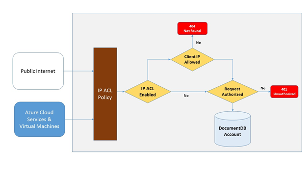
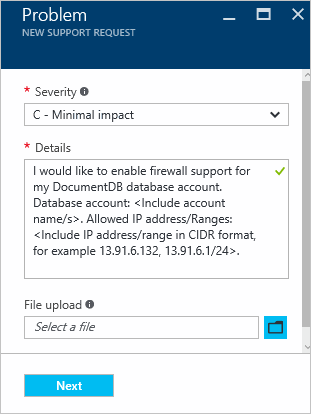

<properties
    pageTitle="Prise en charge de pare-feu DocumentDB | Microsoft Azure"
    description="Découvrez comment utiliser les stratégies de contrôle d’accès IP pour la prise en charge de pare-feu sur les comptes de base de données Azure DocumentDB."
    keywords="Contrôle d’accès IP, prise en charge de pare-feu"
    services="documentdb"
    authors="shahankur11"
    manager="jhubbard"
    editor=""
    tags="azure-resource-manager"
    documentationCenter=""/>

<tags 
    ms.service="documentdb" 
    ms.workload="data-services" 
    ms.tgt_pltfrm="na" 
    ms.devlang="na" 
    ms.topic="article" 
    ms.date="10/17/2016" 
    ms.author="ankshah; kraman"/>

# Prise en charge de pare-feu DocumentDB

Pour sécuriser les données stockées dans un compte de base de données Azure DocumentDB, DocumentDB a fourni prise en charge pour un reposant confiant [modèle d’autorisation](https://msdn.microsoft.com/library/azure/dn783368.aspx) qui utilise un code d’authentification fort message basé sur hachage (HMAC). À présent, en plus du modèle d’autorisations secrète, DocumentDB prend en charge basée sur des contrôles d’accès basé sur IP pour la prise en charge pare-feu entrante. Ce modèle est très similaire aux règles de pare-feu d’un système de base de données traditionnel et fournit un niveau supplémentaire de sécurité pour le compte de base de données DocumentDB. Avec ce modèle, vous pouvez maintenant configurer un compte de base de données DocumentDB pour être accessibles uniquement à partir d’un ensemble d’ordinateurs approuvé et/ou services cloud. Accès aux ressources DocumentDB à partir de ces jeux approuvés des ordinateurs et des services nécessitent toujours l’appelant présenter un jeton d’autorisation valide.

## Vue d’ensemble du contrôle d’accès IP

Par défaut, un compte de base de données DocumentDB est accessible à partir d’internet public dans la mesure où la demande est accompagnée d’un jeton d’autorisation valide. Pour configurer le contrôle d’accès basé sur la stratégie IP, l’utilisateur doit fournir le jeu d’adresses IP ou des plages d’adresses IP sous forme CIDR pour être inclus comme la liste autorisée des adresses IP du client pour un compte de base de données spécifiée. Une fois que cette configuration est appliquée, toutes les demandes des machines en dehors de cette liste autorisée seront bloquées par le serveur.  La connexion de traitement de circulation pour le contrôle d’accès basé sur IP est décrite dans le diagramme suivant.

## Connexions à partir de services en nuage

Dans Azure, les services en nuage constituent un moyen très courant pour l’hébergement de logique de service intermédiaire à l’aide de DocumentDB. Pour activer l’accès à un compte de base de données DocumentDB à partir d’un service cloud, l’adresse IP publique du service cloud doit être ajouté à la liste d’adresses IP correspondant à votre compte de base de données DocumentDB en [contactant le support Azure](#configure-ip-policy)autorisée.  Ainsi que toutes les instances de rôle de services de cloud ont accès à votre compte de base de données DocumentDB. Vous pouvez récupérer des adresses IP pour vos services cloud dans le portail Azure, comme indiqué dans l’écran suivant. 

Lorsque vous faites évoluer votre service cloud en ajoutant des instances de rôle supplémentaires, ces nouvelles instances a automatiquement accès au compte de base de données DocumentDB dans la mesure où ils font partie du même service cloud.

## Connexions à partir d’ordinateurs virtuels

[Machines virtuelles](https://azure.microsoft.com/services/virtual-machines/) ou [échelle machine virtuelle définit](../virtual-machine-scale-sets/virtual-machine-scale-sets-overview.md) permet également d’héberger services intermédiaire à l’aide de DocumentDB.  Pour configurer le DocumentDB compte de base de données pour autoriser l’accès à partir de machines virtuelles, les adresses IP publiques de machine virtuelle et/ou machine virtuelle échelle jeu doit être configuré dans l’un des adresses IP autorisées pour votre compte de base de données DocumentDB en [contactant le support Azure](#configure-ip-policy). Vous pouvez récupérer des adresses IP pour les machines virtuelles dans le portail Azure, comme indiqué dans l’écran suivant.

Lorsque vous ajoutez des instances supplémentaires machine virtuelle au groupe, ils sont fournis automatiquement accès à votre compte de base de données DocumentDB.

## Connexions à partir d’internet

Lorsque vous accédez à un compte de base de données DocumentDB depuis un ordinateur sur internet, l’adresse IP du client ou la plage d’adresses IP de l’ordinateur doit être ajouté à la liste d’adresses IP pour le compte de base de données DocumentDB autorisée. 

## Configuration de la stratégie de contrôle d’accès IP

Utiliser le portail Azure une demande avec [Prise en charge Azure](https://portal.azure.com/?#blade/Microsoft_Azure_Support/HelpAndSupportBlade) pour activer la stratégie de contrôle d’accès IP sur votre compte de base de données.

1. Dans la carte [aide + support](https://portal.azure.com/?#blade/Microsoft_Azure_Support/HelpAndSupportBlade) , sélectionnez **nouvelle demande d’assistance**.
2. Dans la carte **Nouveau prend en charge la demande** , sélectionnez **Concepts de base**.
3. Dans la carte **Concepts de base** , sélectionnez les options suivantes :
    - **Type de problème**: Quota
    - **Abonnement**: l’abonnement associé au compte dans lesquelles vous pouvez ajouter la stratégie de contrôle d’accès IP.
    - **Type de quota**: DocumentDB
    - **Plan de support**: prise en charge de Quota - inclus.
4. Dans la carte de **problème** , procédez comme suit :
    - **Gravité**: sélectionnez C - impact Minimal
    - **Détails**: copiez le texte suivant dans la zone et inclure votre nom de compte/s et l’adresse IP/es : « je souhaite activer la prise en charge du pare-feu de mon compte de base de données DocumentDB. Compte de base de données : *nom de compte inclure/s*. Autorisées/plages d’adresses IP : *plage d’adresses IP inclure au format CIDR, par exemple 13.91.6.132, 13.91.6.1/24*. »
    - Cliquez sur **suivant**. 
5. Dans la carte **les informations de Contact** , renseignez vos détails de contact, puis cliquez sur **créer**. 

Une fois que votre requête est reçue, le contrôle d’accès IP doit être activé dans les 24 heures. Une fois que la requête est terminée, vous serez informé.

## Résolution des problèmes de la stratégie de contrôle d’accès IP

### Opérations de portail

Grâce à une stratégie de contrôle d’accès IP pour votre compte de base de données DocumentDB, tout accès à votre compte de base de données DocumentDB à partir d’ordinateurs à l’extérieur configuré autorisée liste des plages d’adresses IP sont bloqués. En raison de ce modèle, l’opération de plan de données à partir du portail de navigation est également bloquée pour garantir l’intégrité du contrôle d’accès. 

### Kit de développement logiciel & reste API

Pour les raisons de sécurité, access via SDK ou des API REST à partir d’ordinateurs se trouvent pas sur la liste autorisée renverra une réponse de 404 introuvable générique avec des détails supplémentaires. Vérifiez que l’adresse IP autorisé liste configurée pour votre compte de base de données DocumentDB pour vous assurer que la configuration de stratégie correcte est appliquée à votre compte de base de données DocumentDB.

## Étapes suivantes

Pour plus d’informations sur le réseau de performance associés conseils, voir [optimiser les performances](documentdb-performance-tips.md).