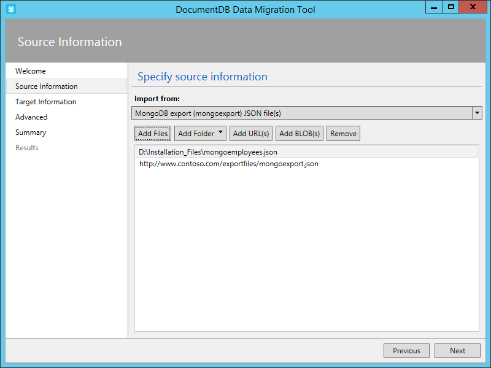
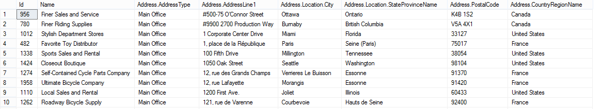
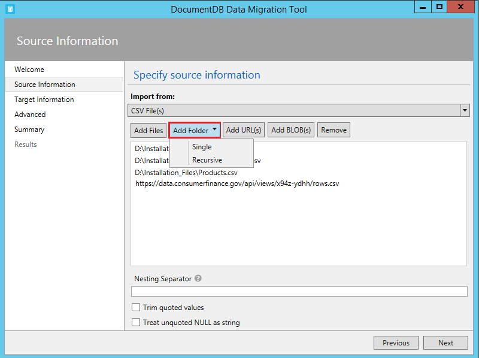
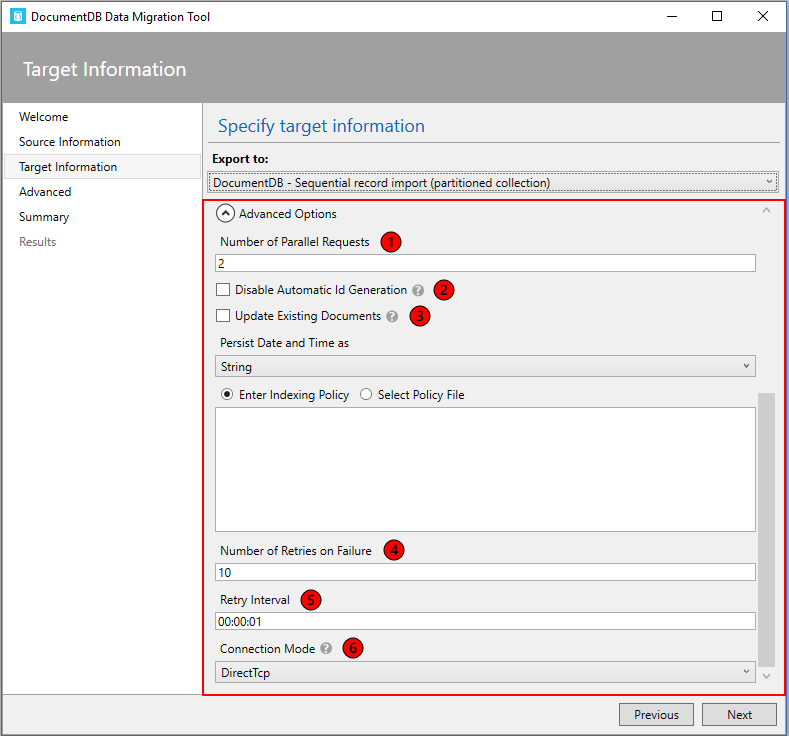
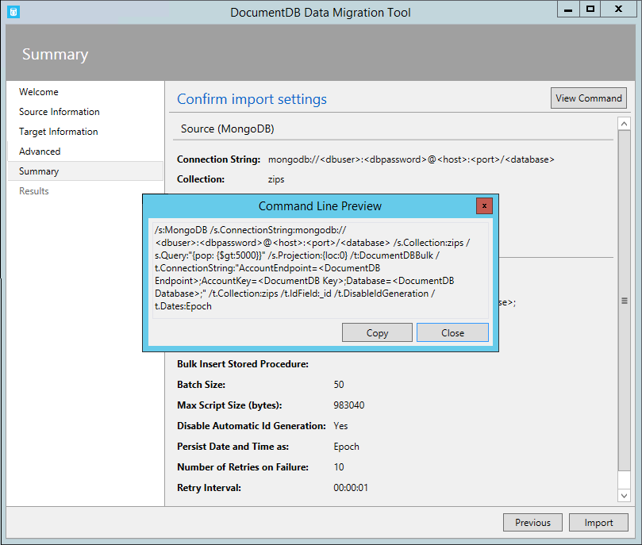

<properties
    pageTitle="Outil de migration de base de données pour DocumentDB | Microsoft Azure"
    description="Découvrez comment utiliser les outils de migration de données DocumentDB ouvrir la source pour importer des données à DocumentDB provenant de diverses sources, y compris les fichiers MongoDB, SQL Server, Table stockage, Amazon DynamoDB, CSV et JSON. CSV conversion JSON."
    keywords="CSV vers json, outils de migration de base de données, convertir csv json"
    services="documentdb"
    authors="andrewhoh"
    manager="jhubbard"
    editor="monicar"
    documentationCenter=""/>

<tags
    ms.service="documentdb"
    ms.workload="data-services"
    ms.tgt_pltfrm="na"
    ms.devlang="na"
    ms.topic="article"
    ms.date="10/06/2016"
    ms.author="anhoh"/>

# Importer des données à DocumentDB avec l’outil de Migration de base de données

Cet article vous explique comment utiliser l’outil de migration de données source ouvert officielle DocumentDB pour importer des données à [Microsoft Azure DocumentDB](https://azure.microsoft.com/services/documentdb/) à partir de sources variées, notamment JSON des fichiers CSV, SQL, MongoDB, stockage de Table Azure, Amazon DynamoDB et collections DocumentDB.

Lisez cet article, vous serez en mesure de répondre aux questions suivantes :  

-   Comment puis-je importer fichier JSON, un fichier CSV, données SQL Server ou données MongoDB à DocumentDB ?
-   Comment puis-je importer des données à partir d’Azure Table storage Amazon DynamoDB et HBase à DocumentDB ?
-   Comment puis-je migrer les données entre collections DocumentDB ?

##Conditions préalables

Avant de suivre les instructions fournies dans cet article, assurez-vous que vous avez les éléments suivants :

- [Microsoft .NET Framework 4.51](https://www.microsoft.com/download/developer-tools.aspx) ou une version ultérieure.

##Vue d’ensemble de l’outil de Migration de données DocumentDB

L’outil de Migration de données DocumentDB est une solution d’ouvrir la source qui importe des données à DocumentDB à partir d’une variété de sources, notamment :

- Fichiers JSON
- MongoDB
- SQL Server
- Fichiers CSV
- Stockage de Table Azure
- DynamoDB Amazon
- HBase
- Collections DocumentDB

Tandis que l’outil d’importation inclut une interface utilisateur graphique (dtui.exe), il peut également être piloté à partir de la ligne de commande (dt.exe). En fait, il existe une option pour copier la commande associée après la configuration d’une importation via l’interface utilisateur. Données sources sous forme de tableau (par exemple, les fichiers SQL Server ou CSV) peuvent être transformées, tels que les relations hiérarchiques (sous-documents) peuvent être créées pendant l’importation. Poursuivez votre lecture pour en savoir plus sur les options de source, exemples de lignes de commande pour importer à partir de chaque source, options de destination et l’importation de l’affichage des résultats.

##Installation de l’outil de Migration des données DocumentDB

Le code de source d’outil de migration est disponible dans GitHub dans [ce référentiel](https://github.com/azure/azure-documentdb-datamigrationtool) et une version compilée est disponible à partir du [Centre de téléchargement Microsoft](http://www.microsoft.com/downloads/details.aspx?FamilyID=cda7703a-2774-4c07-adcc-ad02ddc1a44d). Vous pouvez compiler la solution ou simplement télécharger et extraire la version compilée dans un répertoire de votre choix. Ensuite, exécutez des options :

- **Dtui.exe**: version de l’interface graphique de l’outil
- **DT.exe**: version de ligne de commande de l’outil

##Importer des fichiers JSON

L’option importer JSON la source du fichier vous permet d’importer un ou plusieurs document unique JSON fichiers ou JSON que chacun contient un tableau de documents JSON. Lorsque vous ajoutez des dossiers qui contiennent des fichiers JSON à importer, vous avez la possibilité de rechercher des fichiers dans des sous-dossiers de manière récursive.

Voici quelques exemples de ligne de commande pour importer des fichiers JSON :

    #Import a single JSON file
    dt.exe /s:JsonFile /s.Files:.\Sessions.json /t:DocumentDBBulk /t.ConnectionString:"AccountEndpoint=<DocumentDB Endpoint>;AccountKey=<DocumentDB Key>;Database=<DocumentDB Database>;" /t.Collection:Sessions /t.CollectionThroughput:2500

    #Import a directory of JSON files
    dt.exe /s:JsonFile /s.Files:C:\TESessions\*.json /t:DocumentDBBulk /t.ConnectionString:" AccountEndpoint=<DocumentDB Endpoint>;AccountKey=<DocumentDB Key>;Database=<DocumentDB Database>;" /t.Collection:Sessions /t.CollectionThroughput:2500

    #Import a directory (including sub-directories) of JSON files
    dt.exe /s:JsonFile /s.Files:C:\LastFMMusic\**\*.json /t:DocumentDBBulk /t.ConnectionString:" AccountEndpoint=<DocumentDB Endpoint>;AccountKey=<DocumentDB Key>;Database=<DocumentDB Database>;" /t.Collection:Music /t.CollectionThroughput:2500

    #Import a directory (single), directory (recursive), and individual JSON files
    dt.exe /s:JsonFile /s.Files:C:\Tweets\*.*;C:\LargeDocs\**\*.*;C:\TESessions\Session48172.json;C:\TESessions\Session48173.json;C:\TESessions\Session48174.json;C:\TESessions\Session48175.json;C:\TESessions\Session48177.json /t:DocumentDBBulk /t.ConnectionString:"AccountEndpoint=<DocumentDB Endpoint>;AccountKey=<DocumentDB Key>;Database=<DocumentDB Database>;" /t.Collection:subs /t.CollectionThroughput:2500

    #Import a single JSON file and partition the data across 4 collections
    dt.exe /s:JsonFile /s.Files:D:\\CompanyData\\Companies.json /t:DocumentDBBulk /t.ConnectionString:"AccountEndpoint=<DocumentDB Endpoint>;AccountKey=<DocumentDB Key>;Database=<DocumentDB Database>;" /t.Collection:comp[1-4] /t.PartitionKey:name /t.CollectionThroughput:2500

##Importer à partir de MongoDB

L’option MongoDB source importer permet d’importer à partir d’une collection de sites MongoDB individuels et vous pouvez également filtrer les documents à l’aide d’une requête et/ou modifier la structure du document à l’aide d’une projection.  

La chaîne de connexion est au format MongoDB standard :

    mongodb://<dbuser>:<dbpassword>@<host>:<port>/<database>

> [AZURE.NOTE] Utilisez la commande vérifier pour vous assurer que l’instance MongoDB spécifiée dans le champ chaîne de connexion sont accessibles.

Entrez le nom de la collection de sites à partir de laquelle les données sont importées. Vous pouvez éventuellement spécifier ou fournir un fichier pour une requête (par exemple {pop : {$gt : 5000}}) et/ou projection (par exemple, {loc:0}) à filtrer et mettre en forme les données à importer.

Voici quelques exemples de ligne de commande pour importer à partir de MongoDB :

    #Import all documents from a MongoDB collection
    dt.exe /s:MongoDB /s.ConnectionString:mongodb://<dbuser>:<dbpassword>@<host>:<port>/<database> /s.Collection:zips /t:DocumentDBBulk /t.ConnectionString:"AccountEndpoint=<DocumentDB Endpoint>;AccountKey=<DocumentDB Key>;Database=<DocumentDB Database>;" /t.Collection:BulkZips /t.IdField:_id /t.CollectionThroughput:2500

    #Import documents from a MongoDB collection which match the query and exclude the loc field
    dt.exe /s:MongoDB /s.ConnectionString:mongodb://<dbuser>:<dbpassword>@<host>:<port>/<database> /s.Collection:zips /s.Query:{pop:{$gt:50000}} /s.Projection:{loc:0} /t:DocumentDBBulk /t.ConnectionString:"AccountEndpoint=<DocumentDB Endpoint>;AccountKey=<DocumentDB Key>;Database=<DocumentDB Database>;" /t.Collection:BulkZipsTransform /t.IdField:_id/t.CollectionThroughput:2500

##Importer des fichiers d’exportation MongoDB

L’option importer MongoDB exportation JSON fichier source vous permet d’importer un ou plusieurs fichiers JSON produites à partir de l’utilitaire mongoexport.  

Lorsque vous ajoutez des dossiers qui contiennent des fichiers JSON MongoDB exportation pour l’importation, vous avez la possibilité de rechercher des fichiers dans des sous-dossiers de manière récursive.

Voici un exemple de ligne de commande pour importer à partir de fichiers JSON d’exportation MongoDB :

    dt.exe /s:MongoDBExport /s.Files:D:\mongoemployees.json /t:DocumentDBBulk /t.ConnectionString:"AccountEndpoint=<DocumentDB Endpoint>;AccountKey=<DocumentDB Key>;Database=<DocumentDB Database>;" /t.Collection:employees /t.IdField:_id /t.Dates:Epoch /t.CollectionThroughput:2500

##Importer à partir de SQL Server

L’option SQL source importer permet d’importer à partir d’une base de données SQL Server individuel et vous pouvez également filtrer les enregistrements à importer à l’aide d’une requête. En outre, vous pouvez modifier la structure du document en spécifiant un séparateur d’imbrication (plus dans un instant).  

Le format de la chaîne de connexion est le format de chaîne de connexion SQL standard.

> [AZURE.NOTE] Utilisez la commande vérifier pour vous assurer que l’instance SQL Server spécifiée dans le champ chaîne de connexion sont accessibles.

La propriété séparateur d’imbrication est utilisée pour créer des relations hiérarchiques (sous-adresse documents) lors de l’importation. Prenons la requête SQL suivante :

*Sélectionnez CAST (BusinessEntityID AS varchar) comme Id, nom, AddressType en tant que [Address.AddressType], AddressLine1 en tant que [Address.AddressLine1], ville en tant que [Address.Location.City], StateProvinceName en tant que [Address.Location.StateProvinceName], CodePostal en tant que [Address.PostalCode], CountryRegionName en tant que [Address.CountryRegionName] à partir de Sales.vStoreWithAddresses où AddressType = « Principaux Office »*

Qui renvoie les résultats (partiels) suivants :

Notez les alias tels que Address.AddressType et Address.Location.StateProvinceName. En spécifiant un séparateur d’imbrication de «. », l’outil d’importation crée des sous-documents adresse et Address.Location lors de l’importation. Voici un exemple d’un document qui en résulte dans DocumentDB :

*{« id » : « 956 », « nom » : « Plus précis et Service de vente », « Adresse » : {« AddressType » : « Bureau principaux », « AddressLine1 » : « #500 75 O'Connor rue », « Emplacement » : {« Ville » : « Ottawa », « StateProvinceName » : « Ontario »}, « Code postal » : « K4B 1S2 », « CountryRegionName » : « Canada »}}*

Voici quelques exemples de ligne de commande pour importer à partir de SQL Server :

    #Import records from SQL which match a query
    dt.exe /s:SQL /s.ConnectionString:"Data Source=<server>;Initial Catalog=AdventureWorks;User Id=advworks;Password=<password>;" /s.Query:"select CAST(BusinessEntityID AS varchar) as Id, * from Sales.vStoreWithAddresses WHERE AddressType='Main Office'" /t:DocumentDBBulk /t.ConnectionString:" AccountEndpoint=<DocumentDB Endpoint>;AccountKey=<DocumentDB Key>;Database=<DocumentDB Database>;" /t.Collection:Stores /t.IdField:Id /t.CollectionThroughput:2500

    #Import records from sql which match a query and create hierarchical relationships
    dt.exe /s:SQL /s.ConnectionString:"Data Source=<server>;Initial Catalog=AdventureWorks;User Id=advworks;Password=<password>;" /s.Query:"select CAST(BusinessEntityID AS varchar) as Id, Name, AddressType as [Address.AddressType], AddressLine1 as [Address.AddressLine1], City as [Address.Location.City], StateProvinceName as [Address.Location.StateProvinceName], PostalCode as [Address.PostalCode], CountryRegionName as [Address.CountryRegionName] from Sales.vStoreWithAddresses WHERE AddressType='Main Office'" /s.NestingSeparator:. /t:DocumentDBBulk /t.ConnectionString:" AccountEndpoint=<DocumentDB Endpoint>;AccountKey=<DocumentDB Key>;Database=<DocumentDB Database>;" /t.Collection:StoresSub /t.IdField:Id /t.CollectionThroughput:2500

##Importer des fichiers CSV - CSV convertir en JSON

L’option importer de source du fichier CSV vous permet d’importer un ou plusieurs fichiers CSV. Lorsque vous ajoutez des dossiers qui contiennent des fichiers CSV pour l’importation, vous avez la possibilité de rechercher des fichiers dans des sous-dossiers de manière récursive.

Similaire à la source SQL, la propriété séparateur d’imbrication peut servir à créer des relations hiérarchiques (sous-adresse documents) lors de l’importation. Vous pouvez l’en-tête CSV suivant lignes ligne et de données :

Notez les alias tels que DomainInfo.Domain_Name et RedirectInfo.Redirecting. En spécifiant un séparateur d’imbrication de «. », l’outil d’importation créera des sous-documents DomainInfo et RedirectInfo lors de l’importation. Voici un exemple d’un document qui en résulte dans DocumentDB :

*{« DomainInfo » : {« Nom_domaine » : « ACUS.GOV », « Domain_Name_Address » : « http://www.ACUS.GOV »}, « Agence Federal » : « administration conférence des États-Unis », « RedirectInfo » : {« Rediriger » : « 0 », « Redirect_Destination » : « »}, « id » : « 9cc565c5-ebcd-1c03-ebd3-cc3e2ecd814d »}*

L’outil d’importation tente de déduire le type d’informations pour des valeurs sans guillemets dans les fichiers CSV (valeurs entre guillemets sont toujours considérés comme chaînes).  Types sont identifiés dans l’ordre suivant : nombre, date/heure, booléen.  

Il existe deux autres éléments à noter à propos d’importation CSV :

1.  Par défaut, les valeurs sans guillemets sont réduites toujours par tabulations et des espaces, tandis que les valeurs entre guillemets sont conservés en tant que-est. Ce problème peut être remplacé par la case à cocher SUPPRESPACE valeurs entre guillemets ou l’option de ligne de commande /s.TrimQuoted.

2.  Par défaut, une valeur null sans guillemets est considérée comme une valeur null. Ce problème peut être remplacé (c'est-à-dire considérer une valeur null sans guillemets sous forme de chaîne « null ») avec le considérer guillemets NULL en tant que la case à cocher de la chaîne ou l’option de ligne de commande /s.NoUnquotedNulls.

Voici un exemple de ligne de commande pour l’importation CSV :

    dt.exe /s:CsvFile /s.Files:.\Employees.csv /t:DocumentDBBulk /t.ConnectionString:"AccountEndpoint=<DocumentDB Endpoint>;AccountKey=<DocumentDB Key>;Database=<DocumentDB Database>;" /t.Collection:Employees /t.IdField:EntityID /t.CollectionThroughput:2500

##Importer à partir du stockage de Table Azure

L’option importer de Table Azure stockage source permet d’importer à partir d’une table de stockage de Table Azure individuelle et éventuellement de filtrer les entités de table doivent être importées.  

Le format de la chaîne de connexion de stockage de Table Azure est la suivante :

    DefaultEndpointsProtocol=<protocol>;AccountName=<Account Name>;AccountKey=<Account Key>;

> [AZURE.NOTE] Utilisez la commande vérifier pour vous assurer que l’instance de stockage de Table Azure spécifiée dans le champ chaîne de connexion sont accessibles.

Entrez le nom de la table Azure à partir de laquelle les données sont importées. Vous pouvez éventuellement spécifier un [filtre](https://msdn.microsoft.com/library/azure/ff683669.aspx).

L’option importer de Table Azure stockage source comporte les options supplémentaires suivantes :

1. Inclure les champs internes
    2. All - inclure tous les champs internes (PartitionKey, RowKey et horodatage)
    3. Aucun : exclure tous les champs internes
    4. RowKey - n’inclure que le champ RowKey
3. Sélectionner des colonnes
    1. Filtres de stockage de Table Azure ne prennent pas en charge les projections. Si vous souhaitez importer uniquement les propriétés d’entité Table Azure spécifiques, ajoutez-les à la liste Sélectionner les colonnes. Toutes les autres propriétés entité sont ignorées.

Voici un exemple de ligne de commande pour importer à partir du stockage de Table Azure :

    dt.exe /s:AzureTable /s.ConnectionString:"DefaultEndpointsProtocol=https;AccountName=<Account Name>;AccountKey=<Account Key>" /s.Table:metrics /s.InternalFields:All /s.Filter:"PartitionKey eq 'Partition1' and RowKey gt '00001'" /s.Projection:ObjectCount;ObjectSize  /t:DocumentDBBulk /t.ConnectionString:" AccountEndpoint=<DocumentDB Endpoint>;AccountKey=<DocumentDB Key>;Database=<DocumentDB Database>;" /t.Collection:metrics /t.CollectionThroughput:2500

##Importer à partir d’Amazon DynamoDB

L’option d’importer de source DynamoDB Amazon permet d’importer à partir d’une table DynamoDB Amazon individuelle et vous pouvez également filtrer les entités à importer. Plusieurs modèles sont fournies afin que la configuration d’une importation est aussi simple que possible.

Le format de la chaîne de connexion DynamoDB Amazon est la suivante :

    ServiceURL=<Service Address>;AccessKey=<Access Key>;SecretKey=<Secret Key>;

> [AZURE.NOTE] Utilisez la commande vérifier pour vous assurer que l’instance Amazon DynamoDB spécifiée dans le champ chaîne de connexion sont accessibles.

Voici un exemple de ligne de commande pour importer à partir d’Amazon DynamoDB :

    dt.exe /s:DynamoDB /s.ConnectionString:ServiceURL=https://dynamodb.us-east-1.amazonaws.com;AccessKey=<accessKey>;SecretKey=<secretKey> /s.Request:"{   """TableName""": """ProductCatalog""" }" /t:DocumentDBBulk /t.ConnectionString:"AccountEndpoint=<DocumentDB Endpoint>;AccountKey=<DocumentDB Key>;Database=<DocumentDB Database>;" /t.Collection:catalogCollection /t.CollectionThroughput:2500

##Importer des fichiers de stockage d’objets Blob Azure

Le fichier JSON, fichier d’exportation MongoDB et options d’importer de source de fichier CSV autoriser vous permet d’importer un ou plusieurs fichiers à partir du stockage Blob Azure. Après avoir spécifié une URL de conteneur Blob et une clé de compte, fournissent une expression régulière pour sélectionner l’ou les fichiers à importer.

Voici un exemple de ligne de commande pour importer des fichiers JSON depuis le stockage Blob Azure :

    dt.exe /s:JsonFile /s.Files:"blobs://<account key>@account.blob.core.windows.net:443/importcontainer/.*" /t:DocumentDBBulk /t.ConnectionString:"AccountEndpoint=<DocumentDB Endpoint>;AccountKey=<DocumentDB Key>;Database=<DocumentDB Database>;" /t.Collection:doctest

##Importer à partir de DocumentDB

L’option DocumentDB source importer permet d’importer des données d’une ou plusieurs collections de DocumentDB et vous pouvez également filtrer les documents à l’aide d’une requête.  

Le format de la chaîne de connexion DocumentDB est la suivante :

    AccountEndpoint=<DocumentDB Endpoint>;AccountKey=<DocumentDB Key>;Database=<DocumentDB Database>;

DocumentDB chaîne de connexion de compte peut être extraits de la carte de clés du portail Azure, comme décrit dans [la gestion d’un compte DocumentDB](documentdb-manage-account.md), cependant le nom de la base de données doit être ajouté à la chaîne de connexion au format suivant :

    Database=<DocumentDB Database>;

> [AZURE.NOTE] Utilisez la commande vérifier pour vous assurer que l’instance de DocumentDB spécifiée dans le champ chaîne de connexion sont accessibles.

Pour importer à partir d’une collection de DocumentDB unique, entrez le nom de la collection de sites à partir de laquelle les données sont importées. Pour importer à partir de plusieurs collections DocumentDB, fournissent une expression régulière pour un ou plusieurs noms de collection de sites (par exemple, collection01 | collection02 | collection03). Vous pouvez éventuellement spécifier ou fournir un fichier pour une requête pour filtrer et forme les données à importer.

> [AZURE.NOTE] Étant donné que le champ collection accepte les expressions régulières, si vous importez à partir d’une collection unique dont le nom contient des caractères d’expressions régulières, puis ces caractères doivent être une séquence d’échappement en conséquence.

L’option DocumentDB source importer comporte les options avancées suivantes :

1. Inclure les champs internes : Spécifie d’inclure les propriétés du système DocumentDB document dans l’exportation (par exemple, _rid, DTS) ou non.
2. Nombre de tentatives en cas d’échec : Spécifie le nombre de fois pour vous reconnecter à DocumentDB en cas d’erreurs transitoires (par exemple, coupure de connectivité réseau).
3. Intervalle : Indique le délai d’attente entre une nouvelle tentative de connexion à DocumentDB en cas d’erreurs transitoires (par exemple, coupure de connectivité réseau).
4. Mode de connexion : Spécifie le mode de connexion à utiliser avec DocumentDB. Les choix disponibles sont DirectTcp, DirectHttps et la passerelle. Les modes de connexion directe sont plus rapides, tandis que le mode de passerelle est plus lié au pare-feu et qu’elle utilise uniquement le port 443.

> [AZURE.TIP] L’outil d’importation par défaut, le mode de connexion DirectTcp. Si vous rencontrez des problèmes de pare-feu, passez en mode connexion passerelle, car elle requiert uniquement le port 443.

Voici quelques exemples de ligne de commande pour importer à partir de DocumentDB :

    #Migrate data from one DocumentDB collection to another DocumentDB collections
    dt.exe /s:DocumentDB /s.ConnectionString:"AccountEndpoint=<DocumentDB Endpoint>;AccountKey=<DocumentDB Key>;Database=<DocumentDB Database>;" /s.Collection:TEColl /t:DocumentDBBulk /t.ConnectionString:" AccountEndpoint=<DocumentDB Endpoint>;AccountKey=<DocumentDB Key>;Database=<DocumentDB Database>;" /t.Collection:TESessions /t.CollectionThroughput:2500

    #Migrate data from multiple DocumentDB collections to a single DocumentDB collection
    dt.exe /s:DocumentDB /s.ConnectionString:"AccountEndpoint=<DocumentDB Endpoint>;AccountKey=<DocumentDB Key>;Database=<DocumentDB Database>;" /s.Collection:comp1|comp2|comp3|comp4 /t:DocumentDBBulk /t.ConnectionString:"AccountEndpoint=<DocumentDB Endpoint>;AccountKey=<DocumentDB Key>;Database=<DocumentDB Database>;" /t.Collection:singleCollection /t.CollectionThroughput:2500

    #Export a DocumentDB collection to a JSON file
    dt.exe /s:DocumentDB /s.ConnectionString:"AccountEndpoint=<DocumentDB Endpoint>;AccountKey=<DocumentDB Key>;Database=<DocumentDB Database>;" /s.Collection:StoresSub /t:JsonFile /t.File:StoresExport.json /t.Overwrite /t.CollectionThroughput:2500

##Importer à partir de HBase

L’option HBase source importer permet d’importer des données d’une table HBase et vous pouvez également filtrer les données. Plusieurs modèles sont fournies afin que la configuration d’une importation est aussi simple que possible.

Le format de la chaîne de connexion HBase Stargate est la suivante :

    ServiceURL=<server-address>;Username=<username>;Password=<password>

> [AZURE.NOTE] Utilisez la commande vérifier pour vous assurer que l’instance de HBase spécifiée dans le champ chaîne de connexion sont accessibles.

Voici un exemple de ligne de commande pour importer à partir de HBase :

    dt.exe /s:HBase /s.ConnectionString:ServiceURL=<server-address>;Username=<username>;Password=<password> /s.Table:Contacts /t:DocumentDBBulk /t.ConnectionString:"AccountEndpoint=<DocumentDB Endpoint>;AccountKey=<DocumentDB Key>;Database=<DocumentDB Database>;" /t.Collection:hbaseimport

##Importation DocumentDB (importation en bloc)

L’importer en bloc DocumentDB permet d’importer à partir d’une des options disponibles source, à l’aide d’une procédure DocumentDB stockée pour l’efficacité. L’outil prend en charge les importer dans la collection d’une sites partition unique DocumentDB, ainsi qu’importer sharded dans laquelle les données sont réparties sur plusieurs collections de DocumentDB partitions unique. Pour plus d’informations sur partition de données, voir [partitionnement et la même échelle dans Azure DocumentDB](documentdb-partition-data.md). L’outil sera créer, exécuter et puis supprimez la procédure stockée dans la celle ou cible.  

Le format de la chaîne de connexion DocumentDB est la suivante :

    AccountEndpoint=<DocumentDB Endpoint>;AccountKey=<DocumentDB Key>;Database=<DocumentDB Database>;

DocumentDB chaîne de connexion de compte peut être extraits de la carte de clés du portail Azure, comme décrit dans [la gestion d’un compte DocumentDB](documentdb-manage-account.md), cependant le nom de la base de données doit être ajouté à la chaîne de connexion au format suivant :

    Database=<DocumentDB Database>;

> [AZURE.NOTE] Utilisez la commande vérifier pour vous assurer que l’instance de DocumentDB spécifiée dans le champ chaîne de connexion sont accessibles.

Pour importer dans une collection unique, entrez le nom de la collection de sites à laquelle les données importées et cliquez sur le bouton Ajouter. Pour importer dans plusieurs collections de sites, entrez le nom de chaque collection individuellement ou utilisez la syntaxe suivante pour spécifier plusieurs collections : *collection_prefix*[index de début - index de fin]. Lorsque vous spécifiez plusieurs collections via la syntaxe ci-dessus, gardez les éléments suivants à l’esprit :

1. Uniquement les modèles de noms de plage entier sont prises en charge. Par exemple, la spécification collection [0-3] produira les collections suivantes : collection0, collection1, collection2, collection3.
2. Vous pouvez utiliser une syntaxe abrégée : collecte [3] émet même ensemble de collections mentionné à l’étape 1.
3. Plusieurs substitution peut être fournie. Par exemple, collection [0-1] [0-9] générera 20 noms de collection de sites avec les zéros non significatifs (collection01,... 02... 03).

Une fois que le nom de la collection de sites ont été spécifié, sélectionnez le débit souhaité de la celle ou (400 RUs pour 10 000 RUs). Pour de meilleures performances importer, sélectionnez un débit plus élevé. Pour plus d’informations sur les niveaux de performances, voir [niveaux de performances dans DocumentDB](documentdb-performance-levels.md).

> [AZURE.NOTE] Le paramètre de débit performances s’applique uniquement à la création de collection de sites. Si la collection de sites spécifiée déjà existe, son débit ne sera pas modifiée.

Lorsque vous importez dans plusieurs collections de sites, le hachage importation outil prend en charge en fonction d’ont. Dans ce scénario, spécifiez la propriété du document que vous souhaitez utiliser comme clé de Partition (si la clé de Partition est vide, documents sera sharded au hasard entre les groupes cibles).

Vous pouvez éventuellement spécifier le champ dans la source d’importation doit être utilisé en tant que la propriété d’id de document DocumentDB lors de l’importation (Notez que si les documents ne comportent pas cette propriété, puis l’outil d’importation génère un GUID comme valeur de propriété id).

Il existe un certain nombre d’options avancées disponibles lors de l’importation. Tout d’abord, tandis que l’outil inclut un bloc par défaut importer une procédure stockée (BulkInsert.js), vous pouvez choisir de spécifier votre propre procédure d’importation stockée :

 

En outre, lorsque vous importez des types de date (par exemple, à partir de SQL Server ou MongoDB), vous pouvez choisir entre trois options d’importation :

 

-   Chaîne : Persistent comme une valeur de chaîne
-   Version : Persistent comme une valeur de numéro de version
-   Les deux : Persistent chaîne et les valeurs de numéro de version. Cette option crée un sous-document, par exemple : « date_joined » : {« Valeur » : « 2013-10-21T21:17:25.2410000Z », « version » : 1382390245}

L’importer en bloc DocumentDB comporte les options avancées supplémentaires suivantes :

1. Taille du lot : L’outil par défaut une taille de lot de 50.  Si les documents à importer sont volumineux, envisagez de réduire la taille du lot. En revanche, si les documents à importer sont petites, envisagez d’augmenter la taille du lot.
2. Taille de Script max (octets) : l’outil par défaut, une taille maximale de script de 512 Ko
3. Désactiver la génération Id automatique : Si tous les documents à importer contient un champ d’id, puis en sélectionnant cette option peut améliorer les performances. Documents manquants un champ unique ne seront pas importées.
4. Mettre à jour les Documents existants : L’outil par défaut remplaçant ne pas les documents existants par id est en conflit. Cette option permettra de remplacement de documents existants avec des correspondants ID. Cette fonctionnalité est utile pour les migrations planifiée des données qui mettent à jour des documents existants.
5. Nombre de tentatives en cas d’échec : Spécifie le nombre de fois pour vous reconnecter à DocumentDB en cas d’erreurs transitoires (par exemple, coupure de connectivité réseau).
6. Intervalle : Indique le délai d’attente entre une nouvelle tentative de connexion à DocumentDB en cas d’erreurs transitoires (par exemple, coupure de connectivité réseau).
7. Mode de connexion : Spécifie le mode de connexion à utiliser avec DocumentDB. Les choix disponibles sont DirectTcp, DirectHttps et la passerelle. Les modes de connexion directe sont plus rapides, tandis que le mode de passerelle est plus lié au pare-feu et qu’elle utilise uniquement le port 443.

> [AZURE.TIP] L’outil d’importation par défaut, le mode de connexion DirectTcp. Si vous rencontrez des problèmes de pare-feu, passez en mode connexion passerelle, car elle requiert uniquement le port 443.

##Importation DocumentDB (enregistrement séquentiel importer)

L’importer enregistrement séquentiel DocumentDB permet d’importer à partir d’une des options de sources disponibles dans une base de l’enregistrement par. Vous pouvez choisir cette option si vous importez à une collection existante qui a atteint son quota des procédures stockées. L’outil prend en charge l’importation à un seul DocumentDB collection, ainsi que sharded importer selon laquelle les données sont réparties sur plusieurs collections de DocumentDB partition unique et/ou multiple partition (partition unique et partition à plusieurs). Pour plus d’informations sur partition de données, voir [partitionnement et la même échelle dans Azure DocumentDB](documentdb-partition-data.md).

Le format de la chaîne de connexion DocumentDB est la suivante :

    AccountEndpoint=<DocumentDB Endpoint>;AccountKey=<DocumentDB Key>;Database=<DocumentDB Database>;

DocumentDB chaîne de connexion de compte peut être extraits de la carte de clés du portail Azure, comme décrit dans [la gestion d’un compte DocumentDB](documentdb-manage-account.md), cependant le nom de la base de données doit être ajouté à la chaîne de connexion au format suivant :

    Database=<DocumentDB Database>;

> [AZURE.NOTE] Utilisez la commande vérifier pour vous assurer que l’instance de DocumentDB spécifiée dans le champ chaîne de connexion sont accessibles.

Pour importer dans une collection unique, entrez le nom de la collection de sites à laquelle les données importées et cliquez sur le bouton Ajouter. Pour importer dans plusieurs collections de sites, entrez le nom de chaque collection individuellement ou utilisez la syntaxe suivante pour spécifier plusieurs collections : *collection_prefix*[index de début - index de fin]. Lorsque vous spécifiez plusieurs collections via la syntaxe ci-dessus, gardez les éléments suivants à l’esprit :

1. Uniquement les modèles de noms de plage entier sont prises en charge. Par exemple, la spécification collection [0-3] produira les collections suivantes : collection0, collection1, collection2, collection3.
2. Vous pouvez utiliser une syntaxe abrégée : collecte [3] émet même ensemble de collections mentionné à l’étape 1.
3. Plusieurs substitution peut être fournie. Par exemple, collection [0-1] [0-9] générera 20 noms de collection de sites avec les zéros non significatifs (collection01,... 02... 03).

Une fois que le nom de la collection de sites ont été spécifié, sélectionnez le débit souhaité de la celle ou (400 RUs à 250 000 RUs). Pour de meilleures performances importer, sélectionnez un débit plus élevé. Pour plus d’informations sur les niveaux de performances, voir [niveaux de performances dans DocumentDB](documentdb-performance-levels.md). Toute importation aux collections de débit > 10 000 RUs nécessite une clé de partition. Si vous choisissez d’avoir plus de 250 000 RUs, voir [augmenter les limites de comptes DocumentDB](documentdb-increase-limits.md).

> [AZURE.NOTE] Le paramètre de débit s’applique uniquement à la création de collection de sites. Si la collection de sites spécifiée déjà existe, son débit ne sera pas modifiée.

Lorsque vous importez dans plusieurs collections de sites, le hachage importation outil prend en charge en fonction d’ont. Dans ce scénario, spécifiez la propriété du document que vous souhaitez utiliser comme clé de Partition (si la clé de Partition est vide, documents sera sharded au hasard entre les groupes cibles).

Vous pouvez éventuellement spécifier le champ dans la source d’importation doit être utilisé en tant que la propriété d’id de document DocumentDB lors de l’importation (Notez que si les documents ne comportent pas cette propriété, puis l’outil d’importation génère un GUID comme valeur de propriété id).

Il existe un certain nombre d’options avancées disponibles lors de l’importation. Tout d’abord, lorsque vous importez des types de date (par exemple, à partir de SQL Server ou MongoDB), vous pouvez choisir entre trois options d’importation :

 

-   Chaîne : Persistent comme une valeur de chaîne
-   Version : Persistent comme une valeur de numéro de version
-   Les deux : Persistent chaîne et les valeurs de numéro de version. Cette option crée un sous-document, par exemple : « date_joined » : {« Valeur » : « 2013-10-21T21:17:25.2410000Z », « version » : 1382390245}

DocumentDB - importer enregistrement séquentiel comporte les options avancées supplémentaires suivantes :

1. Nombre de requêtes en parallèle : l’outil par défaut est 2 demandes parallèles. Si les documents à importer sont petites, envisagez d’augmenter le nombre de requêtes en parallèle. Notez que si ce nombre est trop élevé, l’importation peut rencontrer la limitation.
2. Désactiver la génération Id automatique : Si tous les documents à importer contient un champ d’id, puis en sélectionnant cette option peut améliorer les performances. Documents manquants un champ unique ne seront pas importées.
3. Mettre à jour les Documents existants : L’outil par défaut remplaçant ne pas les documents existants par id est en conflit. Cette option permettra de remplacement de documents existants avec des correspondants ID. Cette fonctionnalité est utile pour les migrations planifiée des données qui mettent à jour des documents existants.
4. Nombre de tentatives en cas d’échec : Spécifie le nombre de fois pour vous reconnecter à DocumentDB en cas d’erreurs transitoires (par exemple, coupure de connectivité réseau).
5. Intervalle : Indique le délai d’attente entre une nouvelle tentative de connexion à DocumentDB en cas d’erreurs transitoires (par exemple, coupure de connectivité réseau).
6. Mode de connexion : Spécifie le mode de connexion à utiliser avec DocumentDB. Les choix disponibles sont DirectTcp, DirectHttps et la passerelle. Les modes de connexion directe sont plus rapides, tandis que le mode de passerelle est plus lié au pare-feu et qu’elle utilise uniquement le port 443.

> [AZURE.TIP] L’outil d’importation par défaut, le mode de connexion DirectTcp. Si vous rencontrez des problèmes de pare-feu, passez en mode connexion passerelle, car elle requiert uniquement le port 443.

##Spécifier une stratégie d’indexation lors de la création de collections de sites DocumentDB

Lorsque vous autorisez l’outil de migration créer des collections lors de l’importation, vous pouvez spécifier la stratégie d’indexation des collections. Dans les options avancées de section de la plus grande partie DocumentDB importer et séquentiel DocumentDB options d’enregistrement, accédez à la section de stratégie de l’indexation.

À l’aide de la stratégie de l’indexation option avancée, vous pouvez sélectionner un fichier de stratégie d’indexation, manuellement Entrez une politique d’indexation ou sélectionnez à partir d’un ensemble de modèles par défaut (en cliquant avec le bouton droit dans la zone de texte stratégie d’indexation).

L’outil fournit les modèles de stratégie sont :

- Par défaut. Cette stratégie est recommandée lorsque vous êtes exécuter des requêtes de l’égalité sur chaînes et à l’aide de ORDER BY, plage et l’égalité des requêtes pour les nombres. Cette stratégie a un réduire les frais stockage index que plage.
- Plage. Cette stratégie est préférable que vous utilisez requêtes ORDER BY, plage et égalité sur des nombres et des chaînes. Cette stratégie a un index stockage temps système plus élevé par défaut ou hachage.

> [AZURE.NOTE] Si vous ne spécifiez pas une politique d’indexation, la stratégie par défaut est appliquée. Pour plus d’informations sur les stratégies d’indexation, voir [règles d’indexation DocumentDB](documentdb-indexing-policies.md).

## Exporter vers un fichier JSON

L’exporter DocumentDB JSON vous permet les options disponibles source exporter vers un fichier JSON qui contient un tableau de documents JSON. L’outil gérera l’exportation pour vous, ou vous pouvez choisir d’afficher la commande de migration qui en résulte et exécutez la commande vous-même. Le fichier JSON résultant peut-être être stocké localement ou dans le stockage Blob Azure.

Vous pouvez éventuellement choisir de prettify le JSON résultante, ce qui augmente la taille du document obtenu lorsque vous effectuez le contenu plus lisible.

    Standard JSON export
    [{"id":"Sample","Title":"About Paris","Language":{"Name":"English"},"Author":{"Name":"Don","Location":{"City":"Paris","Country":"France"}},"Content":"Don's document in DocumentDB is a valid JSON document as defined by the JSON spec.","PageViews":10000,"Topics":[{"Title":"History of Paris"},{"Title":"Places to see in Paris"}]}]

    Prettified JSON export
    [
    {
    "id": "Sample",
    "Title": "About Paris",
    "Language": {
      "Name": "English"
    },
    "Author": {
      "Name": "Don",
      "Location": {
        "City": "Paris",
        "Country": "France"
      }
    },
    "Content": "Don's document in DocumentDB is a valid JSON document as defined by the JSON spec.",
    "PageViews": 10000,
    "Topics": [
      {
        "Title": "History of Paris"
      },
      {
        "Title": "Places to see in Paris"
      }
    ]
    }]

## Configuration avancée

Dans l’écran configuration avancée, spécifiez l’emplacement du fichier journal à laquelle vous voulez que les erreurs écrits. Les règles suivantes s’appliquent à cette page :

1.  Si un nom de fichier n’est pas fourni, puis toutes les erreurs apparaîtront dans la page de résultats.
2.  Si un nom de fichier est fourni sans un répertoire, puis le fichier est créé (ou remplacé) dans le répertoire environnement actif.
3.  Si vous sélectionnez un existant fichier, puis le fichier est remplacé, il n’existe aucune option d’ajout.

Ensuite, choisissez s’il faut enregistrer toutes les, critique, ou aucun message d’erreur. Enfin, déterminez la fréquence à laquelle le message de transfert écran activé est mise à jour avec sa progression.

    

## Confirmer les paramètres d’importation et d’afficher la ligne de commande

1. Une fois les informations sur la source, les informations de cible et configuration avancée, passez en revue le résumé de la migration et, éventuellement, affichage/copie la commande de migration résultante (la copie de la commande est utile pour automatiser les opérations d’importation) :

    

    

2. Une fois que vous êtes satisfait de vos options source et cible, cliquez sur **Importer**. Le temps écoulé, nombre transféré et informations sur l’échec (si vous n’avez pas fournir un nom de fichier dans la configuration avancée) seront mise à jour comme l’importation est en cours. Une fois terminé, vous pouvez exporter les résultats (par exemple, de traiter les erreurs d’importation).

    

3. Vous pouvez également démarrer une nouvelle importation, tout en conservant les paramètres existants (par exemple, choix d’informations, sources et cibles de chaîne de connexion, etc.) ou de la réinitialisation de toutes les valeurs.

    

## Étapes suivantes

- Pour en savoir plus sur DocumentDB, consultez la [Rubrique d’apprentissage](https://azure.microsoft.com/documentation/learning-paths/documentdb/).
